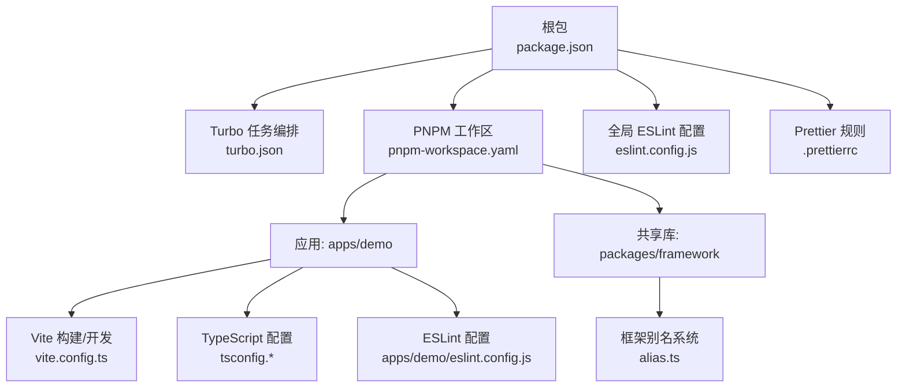
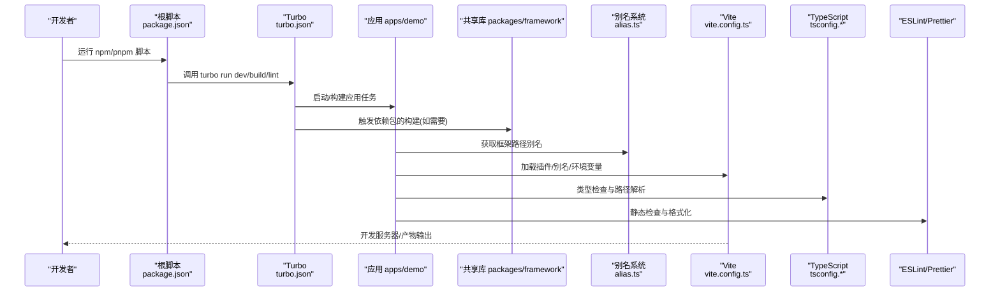
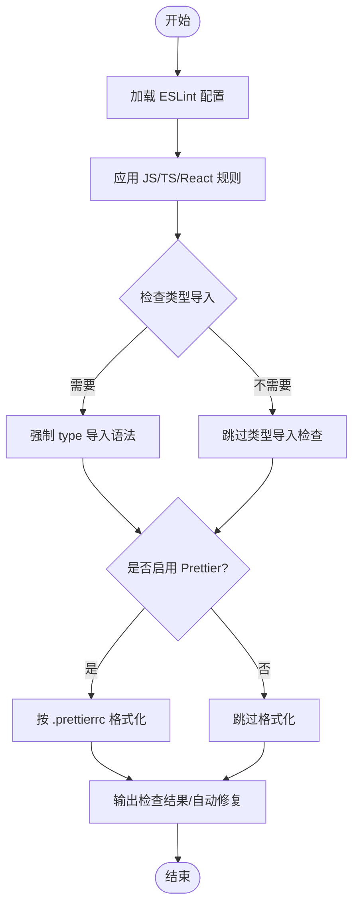
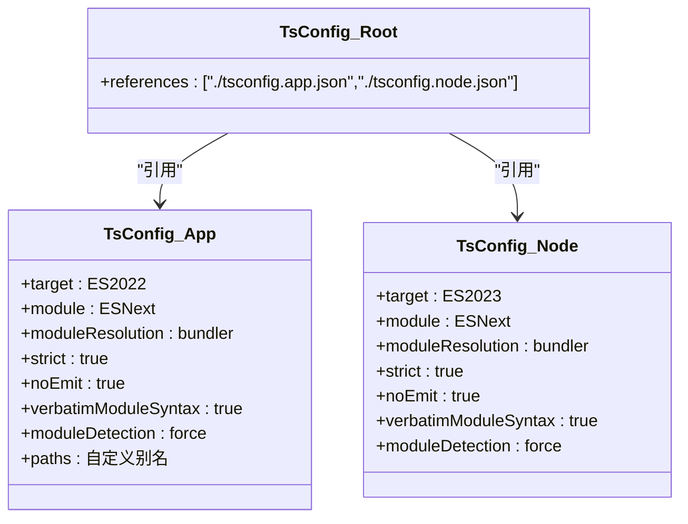
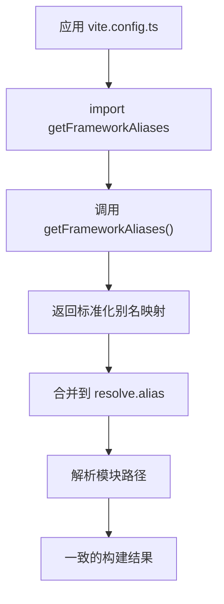
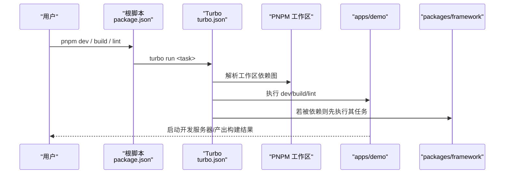
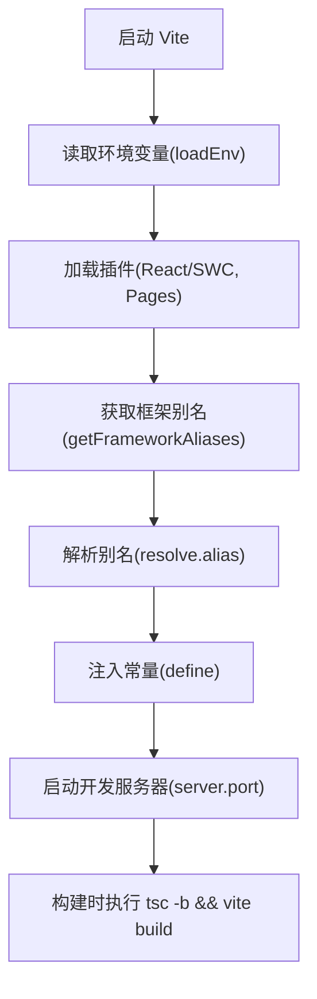
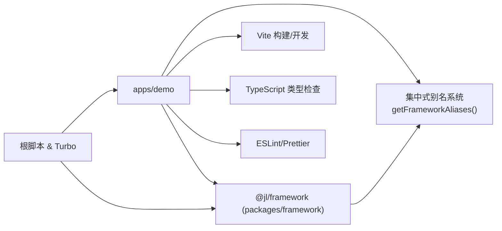

# 开发工具

<cite>
**本文引用的文件**
- [package.json](file://package.json)
- [turbo.json](file://turbo.json)
- [pnpm-workspace.yaml](file://pnpm-workspace.yaml)
- [eslint.config.js](file://eslint.config.js)
- [.prettierrc](file://.prettierrc)
- [apps/demo/package.json](file://apps/demo/package.json)
- [apps/demo/vite.config.ts](file://apps/demo/vite.config.ts)
- [apps/demo/tsconfig.json](file://apps/demo/tsconfig.json)
- [apps/demo/tsconfig.app.json](file://apps/demo/tsconfig.app.json)
- [apps/demo/tsconfig.node.json](file://apps/demo/tsconfig.node.json)
- [apps/demo/eslint.config.js](file://apps/demo/eslint.config.js)
- [packages/framework/alias.ts](file://packages/framework/alias.ts)
- [packages/framework/vite.config.ts](file://packages/framework/vite.config.ts)
- [packages/framework/tsconfig.json](file://packages/framework/tsconfig.json)
- [docs/1.运行与构建.md](file://docs/1.运行与构建.md)
</cite>

## 更新摘要
**所做更改**
- 更新了ESLint配置部分，新增TypeScript类型导入一致性规则
- 新增了集中式路径别名管理系统说明
- 更新了TypeScript编译配置，强调verbatimModuleSyntax的作用
- 增强了Monorepo架构中框架与应用间的类型一致性保障

## 目录
1. [简介](#简介)
2. [项目结构](#项目结构)
3. [核心组件](#核心组件)
4. [架构总览](#架构总览)
5. [详细组件分析](#详细组件分析)
6. [依赖关系分析](#依赖关系分析)
7. [性能考虑](#性能考虑)
8. [故障排查指南](#故障排查指南)
9. [结论](#结论)
10. [附录](#附录)

## 简介
本文件面向Monorepo项目的开发者，系统化说明代码质量工具（ESLint、Prettier）、TypeScript编译配置、基于Turbo的任务编排与PNPM Workspace设置，并给出开发工作流（提交规范、分支策略、代码审查）、调试与性能分析、测试策略与框架集成、IDE配置与效率提升建议。目标是让不同经验水平的开发者都能快速上手并保持高质量交付。

## 项目结构
本项目采用Monorepo组织：应用位于 apps/*，共享库位于 packages/*；根目录通过 pnpm-workspace.yaml 声明工作区，使用 turbo 统一编排任务，并通过统一的 ESLint/Prettier 配置保证代码风格一致。

图示来源
- [package.json:1-19](file://package.json#L1-L19)
- [turbo.json:1-29](file://turbo.json#L1-L29)
- [pnpm-workspace.yaml:1-5](file://pnpm-workspace.yaml#L1-L5)
- [apps/demo/vite.config.ts:1-36](file://apps/demo/vite.config.ts#L1-L36)
- [apps/demo/tsconfig.json:1-8](file://apps/demo/tsconfig.json#L1-L8)
- [apps/demo/eslint.config.js:1-42](file://apps/demo/eslint.config.js#L1-L42)
- [eslint.config.js:1-142](file://eslint.config.js#L1-L142)
- [.prettierrc:1-14](file://.prettierrc#L1-L14)
- [packages/framework/alias.ts:1-22](file://packages/framework/alias.ts#L1-L22)

章节来源
- [package.json:1-19](file://package.json#L1-L19)
- [turbo.json:1-29](file://turbo.json#L1-L29)
- [pnpm-workspace.yaml:1-5](file://pnpm-workspace.yaml#L1-L5)

## 核心组件
- 任务编排与缓存：通过 Turbo 定义 build/dev/lint 等任务，支持依赖图执行与增量缓存。
- 工作区管理：PNPM Workspace 将 apps/* 与 packages/* 纳入同一仓库，便于跨包引用与本地联调。
- 代码质量：根级与子应用级 ESLint 配置，结合 Prettier 统一风格，新增TypeScript类型导入一致性规则。
- 构建与类型：Vite + TypeScript（多 tsconfig），按环境加载变量与别名解析，启用verbatimModuleSyntax增强类型检查。
- 集中式路径别名：通过 getFrameworkAliases() 统一管理框架路径别名，确保应用与框架间的一致性。
- 文档与环境：README/运行文档提供环境变量与脚本说明。

章节来源
- [turbo.json:1-29](file://turbo.json#L1-L29)
- [pnpm-workspace.yaml:1-5](file://pnpm-workspace.yaml#L1-L5)
- [eslint.config.js:1-142](file://eslint.config.js#L1-L142)
- [.prettierrc:1-14](file://.prettierrc#L1-L14)
- [apps/demo/vite.config.ts:1-36](file://apps/demo/vite.config.ts#L1-L36)
- [apps/demo/tsconfig.app.json:1-64](file://apps/demo/tsconfig.app.json#L1-L64)
- [apps/demo/tsconfig.node.json:1-26](file://apps/demo/tsconfig.node.json#L1-L26)
- [packages/framework/alias.ts:1-22](file://packages/framework/alias.ts#L1-L22)
- [docs/1.运行与构建.md:1-91](file://docs/1.运行与构建.md#L1-L91)

## 架构总览
下图展示 Monorepo 中各层职责与交互：根脚本驱动 Turbo，Turbo 调度 PNPM 工作区内的应用与库；应用侧由 Vite 负责开发与构建，TypeScript 负责类型检查与路径映射；ESLint 与 Prettier 贯穿所有源码以保证一致性；集中式路径别名系统确保框架与应用间的模块解析一致性。

图示来源
- [package.json:1-19](file://package.json#L1-L19)
- [turbo.json:1-29](file://turbo.json#L1-L29)
- [apps/demo/vite.config.ts:1-36](file://apps/demo/vite.config.ts#L1-L36)
- [apps/demo/tsconfig.app.json:1-64](file://apps/demo/tsconfig.app.json#L1-L64)
- [apps/demo/eslint.config.js:1-42](file://apps/demo/eslint.config.js#L1-L42)
- [packages/framework/alias.ts:1-22](file://packages/framework/alias.ts#L1-L22)

## 详细组件分析

### 代码质量工具：ESLint 与 Prettier
- 根级 ESLint 配置启用推荐规则集，覆盖 TS/TSX，包含 React Hooks 与 React Refresh 校验，并对常见风格与潜在问题设定 warn/error 级别。
- 子应用 ESLint 配置进一步扩展至 React 最新推荐与 Vite 刷新插件，指定多 tsconfig 以增强类型感知。
- **新增**：TypeScript类型导入一致性规则 `@typescript-eslint/consistent-type-imports`，强制类型导入必须显式标记 `type`，与 `verbatimModuleSyntax` 配置对齐。
- Prettier 统一单引号、分号、尾随逗号、行宽、缩进、换行符与 JSX 属性排版等。

图示来源
- [eslint.config.js:1-142](file://eslint.config.js#L1-L142)
- [apps/demo/eslint.config.js:1-42](file://apps/demo/eslint.config.js#L1-L42)
- [.prettierrc:1-14](file://.prettierrc#L1-L14)

章节来源
- [eslint.config.js:1-142](file://eslint.config.js#L1-L142)
- [apps/demo/eslint.config.js:1-42](file://apps/demo/eslint.config.js#L1-L42)
- [.prettierrc:1-14](file://.prettierrc#L1-L14)

### TypeScript 编译配置
- 应用端 tsconfig.app.json 开启严格模式、禁用 emit（由构建工具处理）、设置 ESNext 模块与 bundler 解析、**启用 verbatimModuleSyntax/moduleDetection**，并配置丰富的路径别名指向共享库。
- Node 端 tsconfig.node.json 针对构建脚本与工具链进行类型检查，同样启用 verbatimModuleSyntax。
- 顶层 tsconfig.json 通过 references 引用 app/node 两个配置，便于 IDE 与工具链协同。
- **新增**：verbatimModuleSyntax 选项确保类型导入和值导入的严格区分，提升类型检查的一致性和准确性。

图示来源
- [apps/demo/tsconfig.app.json:1-64](file://apps/demo/tsconfig.app.json#L1-L64)
- [apps/demo/tsconfig.node.json:1-26](file://apps/demo/tsconfig.node.json#L1-L26)
- [apps/demo/tsconfig.json:1-7](file://apps/demo/tsconfig.json#L1-L7)

章节来源
- [apps/demo/tsconfig.app.json:1-64](file://apps/demo/tsconfig.app.json#L1-L64)
- [apps/demo/tsconfig.node.json:1-26](file://apps/demo/tsconfig.node.json#L1-L26)
- [apps/demo/tsconfig.json:1-7](file://apps/demo/tsconfig.json#L1-L7)

### 集中式路径别名管理系统
- **新增**：在 `packages/framework/alias.ts` 中定义了 `getFrameworkAliases()` 函数，统一管理框架的路径别名配置。
- 该函数返回标准化的别名映射，包括 `@`、`@view`、`@ctrl`、`@store`、`@data`、`@handler`、`@utils` 等。
- 应用端的 `vite.config.ts` 通过引入该函数复用框架的别名配置，确保框架内部模块的正确解析。
- 框架自身的 `vite.config.ts` 也使用该函数，保持构建时和开发时的一致性。

图示来源
- [packages/framework/alias.ts:1-22](file://packages/framework/alias.ts#L1-L22)
- [apps/demo/vite.config.ts:1-36](file://apps/demo/vite.config.ts#L1-L36)
- [packages/framework/vite.config.ts:1-43](file://packages/framework/vite.config.ts#L1-L43)

章节来源
- [packages/framework/alias.ts:1-22](file://packages/framework/alias.ts#L1-L22)
- [apps/demo/vite.config.ts:1-36](file://apps/demo/vite.config.ts#L1-L36)
- [packages/framework/vite.config.ts:1-43](file://packages/framework/vite.config.ts#L1-L43)

### Monorepo 构建与任务编排（Turbo + PNPM）
- 根 package.json 暴露 build/dev/dev:mock/lint 脚本，统一委托给 Turbo。
- turbo.json 定义任务：build 依赖上游包的 build，dev/dev:mock 为持久化任务，lint 可缓存。
- pnpm-workspace.yaml 将 apps/* 与 packages/* 纳入工作区，支持 workspace:* 引用本地包。

图示来源
- [package.json:1-19](file://package.json#L1-L19)
- [turbo.json:1-29](file://turbo.json#L1-L29)
- [pnpm-workspace.yaml:1-5](file://pnpm-workspace.yaml#L1-L5)
- [apps/demo/package.json:1-44](file://apps/demo/package.json#L1-L44)

章节来源
- [package.json:1-19](file://package.json#L1-L19)
- [turbo.json:1-29](file://turbo.json#L1-L29)
- [pnpm-workspace.yaml:1-5](file://pnpm-workspace.yaml#L1-L5)
- [apps/demo/package.json:1-44](file://apps/demo/package.json#L1-L44)

### Vite 开发与构建
- 通过 defineConfig 根据 mode 加载环境变量，注册 React SWC 插件与 Pages 路由插件。
- 配置开发端口、路径别名（含 @jl/framework 指向源码）、define 注入应用环境变量。
- **新增**：通过 `getFrameworkAliases()` 复用框架的别名配置，确保框架内部模块的正确解析。
- 构建流程在子应用 package.json 中组合 tsc -b 与 vite build，确保类型检查与打包顺序。

图示来源
- [apps/demo/vite.config.ts:1-36](file://apps/demo/vite.config.ts#L1-L36)
- [apps/demo/package.json:1-44](file://apps/demo/package.json#L1-L44)
- [packages/framework/alias.ts:1-22](file://packages/framework/alias.ts#L1-L22)

章节来源
- [apps/demo/vite.config.ts:1-36](file://apps/demo/vite.config.ts#L1-L36)
- [apps/demo/package.json:1-44](file://apps/demo/package.json#L1-L44)

### 环境变量与运行
- 文档说明了多环境配置方式与常用变量（如 VITE_ENV、VITE_SERVER_PORT、VITE_BASE_URL、VITE_TITLE 等）。
- 应用通过 Vite 的 loadEnv 按 mode 加载，并在运行时通过 define 注入到客户端。

章节来源
- [docs/1.运行与构建.md:1-91](file://docs/1.运行与构建.md#L1-L91)
- [apps/demo/vite.config.ts:1-36](file://apps/demo/vite.config.ts#L1-L36)

## 依赖关系分析
- 应用依赖共享库 @jl/framework（workspace:*），通过 Vite 别名与 TS paths 双重映射，实现源码级联调。
- **新增**：集中式路径别名系统确保框架与应用间的模块解析一致性，避免重复配置和维护成本。
- 根脚本与 Turbo 解耦具体实现，便于在多包场景下复用任务与缓存。
- ESLint 与 Prettier 在根与子应用同时生效，保证全仓一致性。
- **新增**：TypeScript类型导入一致性规则确保类型导入的规范性，与verbatimModuleSyntax配置保持一致。

图示来源
- [apps/demo/package.json:1-44](file://apps/demo/package.json#L1-L44)
- [apps/demo/vite.config.ts:1-36](file://apps/demo/vite.config.ts#L1-L36)
- [apps/demo/tsconfig.app.json:1-64](file://apps/demo/tsconfig.app.json#L1-L64)
- [eslint.config.js:1-142](file://eslint.config.js#L1-L142)
- [.prettierrc:1-14](file://.prettierrc#L1-L14)
- [packages/framework/alias.ts:1-22](file://packages/framework/alias.ts#L1-L22)

章节来源
- [apps/demo/package.json:1-44](file://apps/demo/package.json#L1-L44)
- [apps/demo/vite.config.ts:1-36](file://apps/demo/vite.config.ts#L1-L36)
- [apps/demo/tsconfig.app.json:1-64](file://apps/demo/tsconfig.app.json#L1-L64)
- [eslint.config.js:1-142](file://eslint.config.js#L1-L142)
- [.prettierrc:1-14](file://.prettierrc#L1-L14)

## 性能考虑
- 利用 Turbo 的任务缓存与并行执行，减少重复构建与检查时间。
- 使用 SWC 插件加速 React 转换，缩短冷/热启动时间。
- 通过 Pages 插件按需异步导入页面，降低首屏体积。
- 保持 strict 与 noUnusedLocals/Parameters 开启，尽早发现冗余代码，减小产物体积。
- **新增**：verbatimModuleSyntax 选项提升类型检查性能，减少不必要的类型推断。
- 合理划分包粒度，避免不必要的依赖提升。
- **新增**：集中式路径别名减少重复配置，提升维护效率和构建性能。

[本节为通用指导，不直接分析具体文件]

## 故障排查指南
- 构建失败
  - 确认 Node 版本与 pnpm 版本符合文档要求。
  - 检查环境变量是否正确加载（mode 与 .env 文件）。
  - 查看 Turbo 任务日志定位具体失败的包或步骤。
- 类型错误
  - 确认 tsconfig 的 paths 与 Vite alias 保持一致。
  - **新增**：检查类型导入是否正确标记 `type` 关键字，确保与 `@typescript-eslint/consistent-type-imports` 规则一致。
  - 清理 tsBuildInfo 后重试。
- 静态检查报错
  - 使用 ESLint 提供的修复选项自动修正部分问题。
  - 对照 Prettier 规则调整格式。
  - **新增**：处理类型导入相关的ESLint错误，确保类型导入使用正确的语法。
- 开发服务器异常
  - 检查端口占用与 VITE_SERVER_PORT 配置。
  - 确认 Pages 插件目录与扩展名配置正确。
  - **新增**：验证集中式别名系统的正确性，确保框架内部模块能够正确解析。

章节来源
- [docs/1.运行与构建.md:1-91](file://docs/1.运行与构建.md#L1-L91)
- [apps/demo/vite.config.ts:1-36](file://apps/demo/vite.config.ts#L1-L36)
- [apps/demo/tsconfig.app.json:1-64](file://apps/demo/tsconfig.app.json#L1-L64)
- [eslint.config.js:1-142](file://eslint.config.js#L1-L142)
- [.prettierrc:1-14](file://.prettierrc#L1-L14)
- [apps/demo/eslint.config.js:1-42](file://apps/demo/eslint.config.js#L1-L42)

## 结论
本项目通过 Turborepo 与 PNPM Workspace 实现了高效的 Monorepo 协作；ESLint 与 Prettier 保障代码质量，新增的TypeScript类型导入一致性规则进一步提升代码规范性；Vite + TypeScript 提供现代前端开发体验，verbatimModuleSyntax增强类型检查一致性；集中式路径别名系统简化了框架与应用间的模块管理。遵循本文的工作流与配置建议，团队可在大型项目中保持高内聚、低耦合与稳定的交付节奏。

[本节为总结性内容，不直接分析具体文件]

## 附录

### 开发工作流建议
- 代码提交规范
  - 建议使用约定式提交（如 feat/fix/docs/chore 前缀），配合 Commit Message 规范与自动化校验。
- 分支管理策略
  - 主干保护：main/master 仅允许合并经过审查的分支。
  - 功能分支：feature/* 从 main 切出，完成后发起 PR。
  - 发布分支：release/* 用于预发与回归验证。
- 代码审查流程
  - 强制至少一名 reviewer 批准。
  - 关注变更影响面、类型安全、性能与可维护性。
  - 使用 CI 自动执行 lint/test/build，通过后合入。

[本节为通用实践建议，不直接分析具体文件]

### 调试技巧
- 浏览器端
  - 使用 Source Maps 与断点调试；结合 Network 面板观察接口请求。
- 服务端/Node 侧
  - 使用 Node Inspector 或 VS Code 调试器附加进程。
- 构建期
  - 打开 Vite 的 --debug 模式或查看 Turbo 详细日志定位瓶颈。
- **新增**：类型导入调试
  - 当遇到类型导入相关错误时，检查是否正确使用了 `type` 关键字。
  - 使用IDE的类型提示功能验证导入的正确性。

[本节为通用实践建议，不直接分析具体文件]

### 性能分析工具
- 前端性能
  - Chrome DevTools Performance/Lighthouse 分析渲染与网络。
  - Webpack/Vite Bundle 分析插件评估包体积。
- 后端/中间件
  - 使用 APM 或日志聚合平台监控延迟与错误率。

[本节为通用实践建议，不直接分析具体文件]

### 测试策略与框架集成
- 单元测试
  - 建议引入 Vitest/Jest 对工具函数与业务逻辑进行测试。
- 组件测试
  - 使用 React Testing Library 编写可维护的 UI 测试。
- E2E 测试
  - 可选 Playwright/Cypress 覆盖关键用户旅程。
- 持续集成
  - 在 CI 中执行 test 与 lint，阻断不合格提交。

[本节为通用实践建议，不直接分析具体文件]

### IDE 配置与效率提升
- VS Code 推荐
  - 安装 ESLint、Prettier、TypeScript 相关扩展。
  - 保存时自动格式化，开启 TS 语言服务与类型提示。
  - 配置工作区设置以匹配项目规则。
- 快捷键与片段
  - 自定义常用代码片段，提升编码效率。
- 终端与工作区
  - 使用内置终端与多窗口切换，配合任务面板执行脚本。
- **新增**：类型导入辅助
  - 利用IDE的智能提示功能，自动添加正确的 `type` 关键字。
  - 使用ESLint的自动修复功能处理类型导入相关问题。

[本节为通用实践建议，不直接分析具体文件]