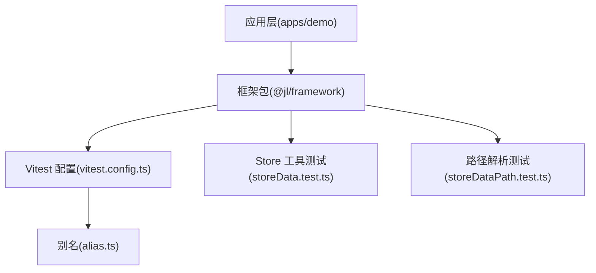
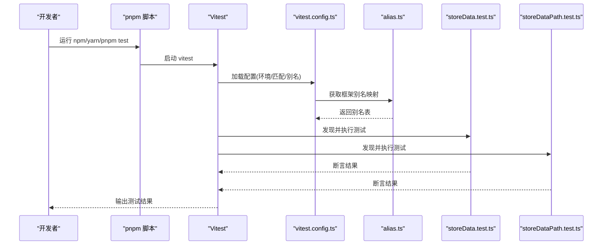
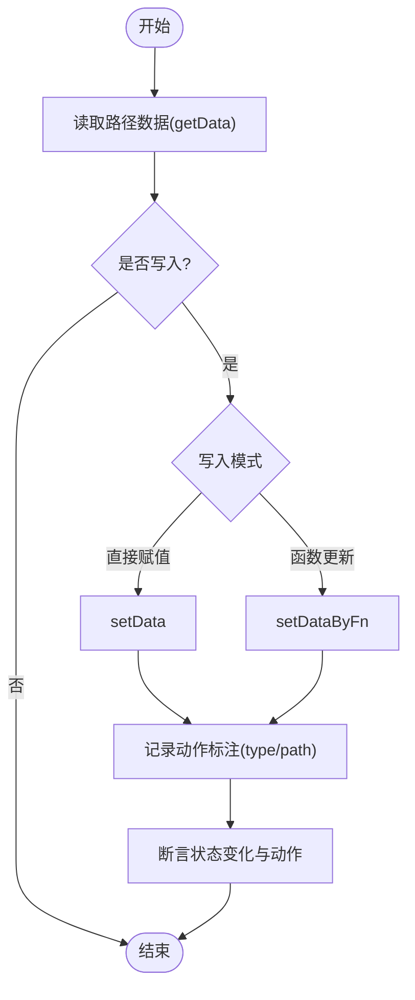
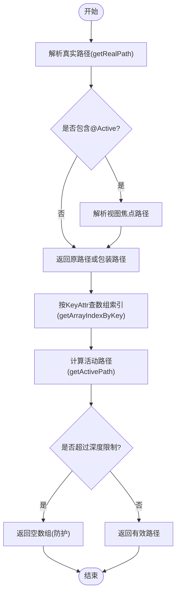
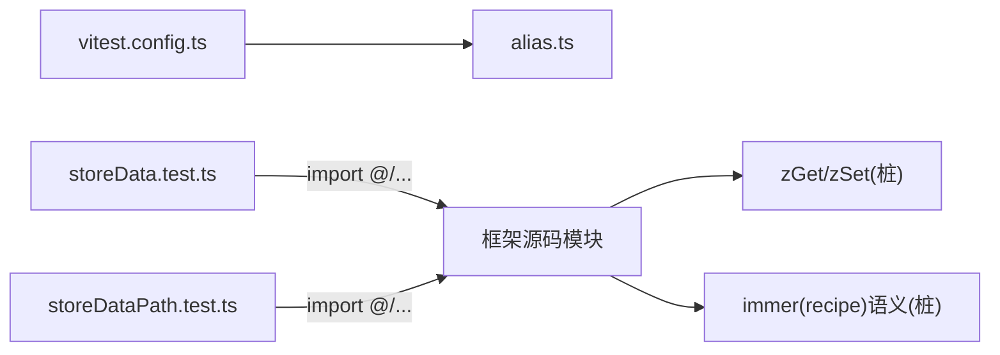

# Vitest测试框架

<cite>
**本文引用的文件**
- [package.json](file://packages/framework/package.json)
- [vitest.config.ts](file://packages/framework/vitest.config.ts)
- [alias.ts](file://packages/framework/alias.ts)
- [storeData.test.ts](file://packages/framework/src/stores/store/utils/storeData.test.ts)
- [storeDataPath.test.ts](file://packages/framework/src/stores/store/utils/storeDataPath.test.ts)
</cite>

## 目录
1. [简介](#简介)
2. [项目结构](#项目结构)
3. [核心组件](#核心组件)
4. [架构总览](#架构总览)
5. [详细组件分析](#详细组件分析)
6. [依赖关系分析](#依赖关系分析)
7. [性能考量](#性能考量)
8. [故障排查指南](#故障排查指南)
9. [结论](#结论)
10. [附录](#附录)

## 简介
本仓库在框架包中集成了基于 Vitest 的单元测试体系，用于验证 Store 层工具函数与路径解析逻辑的正确性。测试运行于 Node 环境，通过复用框架别名配置，实现对源码模块的直接引用与断言。测试覆盖数据存取、路径解析、活动路径计算等关键能力，确保状态管理工具的稳定性和可维护性。

## 项目结构
- 根工作区使用 pnpm + Turborepo 组织多包工程，应用与框架解耦。
- 框架包 @jl/framework 提供 Store 工具与视图控制相关能力，并在其内部通过 Vitest 进行单测。
- 测试入口与配置集中在 packages/framework 下：
  - vitest.config.ts：定义测试运行环境与匹配规则，并复用 alias 配置以支持 @ 等路径别名。
  - package.json：暴露 test/test:watch 脚本，集成 vitest 命令。
  - alias.ts：集中导出框架路径别名，供 Vite/Vitest 共享。

图表来源
- [vitest.config.ts:1-14](file://packages/framework/vitest.config.ts#L1-L14)
- [alias.ts:1-22](file://packages/framework/alias.ts#L1-L22)
- [storeData.test.ts:1-160](file://packages/framework/src/stores/store/utils/storeData.test.ts#L1-L160)
- [storeDataPath.test.ts:1-124](file://packages/framework/src/stores/store/utils/storeDataPath.test.ts#L1-L124)

章节来源
- [package.json:22-28](file://packages/framework/package.json#L22-L28)
- [vitest.config.ts:1-14](file://packages/framework/vitest.config.ts#L1-L14)
- [alias.ts:1-22](file://packages/framework/alias.ts#L1-L22)

## 核心组件
- 测试运行器与配置
  - 运行环境：Node（纯 Node 环境运行 store 层工具测试）。
  - 匹配规则：包含 src/**/*.test.{ts,tsx}。
  - 别名复用：通过 getFrameworkAliases() 注入 @、@store、@data 等别名，保证测试可直接 import 源码模块。
- 测试用例集合
  - storeData.test.ts：覆盖 getData、setData、setDataByFn、initDataAndReq 以及 KeyAttr 常量行为。
  - storeDataPath.test.ts：覆盖 getRealPath、getArrayIndexByKey、getActivePath 的路径解析与边界保护。

章节来源
- [vitest.config.ts:4-12](file://packages/framework/vitest.config.ts#L4-L12)
- [storeData.test.ts:1-160](file://packages/framework/src/stores/store/utils/storeData.test.ts#L1-L160)
- [storeDataPath.test.ts:1-124](file://packages/framework/src/stores/store/utils/storeDataPath.test.ts#L1-L124)

## 架构总览
下图展示了测试执行时从脚本到配置再到具体测试文件的调用链，以及别名解析如何使测试能直接引用源码模块。

图表来源
- [vitest.config.ts:1-14](file://packages/framework/vitest.config.ts#L1-L14)
- [alias.ts:1-22](file://packages/framework/alias.ts#L1-L22)
- [storeData.test.ts:1-160](file://packages/framework/src/stores/store/utils/storeData.test.ts#L1-L160)
- [storeDataPath.test.ts:1-124](file://packages/framework/src/stores/store/utils/storeDataPath.test.ts#L1-L124)

## 详细组件分析

### 数据存取工具测试（storeData.test.ts）
- 目标：验证 Store 数据读写的正确性与 DevTools 动作标注。
- 关键点
  - getData：支持数组路径、字符串路径、系统头路径分流与缺失值处理。
  - setData：按路径写入、空路径不产生更新、系统头路径写入数据树。
  - setDataByFn：函数式更新并携带动作标注。
  - initDataAndReq：根据 Data 声明初始化请求节点并维护父子关系；对不存在父节点的参数引用进行跳过；重复 id 以最后声明为准。
  - KeyAttr：保持为固定常量，保障表格行选择等场景一致性。
- 桩与模拟
  - 构造最小可用的 IStoreBase 与 zGet/zSet 桩，模拟 immer recipe 的执行语义，便于在无 immer 环境下验证逻辑。
  - 记录 actions 数组以断言 devtools 动作类型与路径。

图表来源
- [storeData.test.ts:34-81](file://packages/framework/src/stores/store/utils/storeData.test.ts#L34-L81)
- [storeData.test.ts:83-108](file://packages/framework/src/stores/store/utils/storeData.test.ts#L83-L108)
- [storeData.test.ts:110-153](file://packages/framework/src/stores/store/utils/storeData.test.ts#L110-L153)

章节来源
- [storeData.test.ts:1-160](file://packages/framework/src/stores/store/utils/storeData.test.ts#L1-L160)

### 路径解析工具测试（storeDataPath.test.ts）
- 目标：验证路径规范化、数组索引查找与活动路径计算。
- 关键点
  - getRealPath：支持 undefined、数字、字面量数组、普通字符串路径；解析 @Active 引用；相同字面量路径缓存命中返回同一引用。
  - getArrayIndexByKey：按 KeyAttr 查找数组元素下标；具备缓存与重建机制；未命中返回 -1；非数组输入安全返回 -1。
  - getActivePath：根据焦点行 KeyAttr 计算焦点路径；焦点不存在返回 undefined；循环引用超过阈值时触发防护返回空数组。
- 桩与模拟
  - createFakeState 构造最小 IStoreBase 以支撑 getView/getViewParamByKey/getData 等依赖。
  - 通过自定义 getViewParamByKey 模拟 @Active 引用解析。

图表来源
- [storeDataPath.test.ts:27-68](file://packages/framework/src/stores/store/utils/storeDataPath.test.ts#L27-L68)
- [storeDataPath.test.ts:70-93](file://packages/framework/src/stores/store/utils/storeDataPath.test.ts#L70-L93)
- [storeDataPath.test.ts:95-123](file://packages/framework/src/stores/store/utils/storeDataPath.test.ts#L95-L123)

章节来源
- [storeDataPath.test.ts:1-124](file://packages/framework/src/stores/store/utils/storeDataPath.test.ts#L1-L124)

## 依赖关系分析
- 测试与配置
  - vitest.config.ts 依赖 alias.ts 提供的 getFrameworkAliases，从而将 @、@store、@data 等别名指向框架源码目录。
  - 测试文件通过 @ 别名导入被测模块，避免相对路径耦合。
- 运行时依赖
  - 测试运行于 Node 环境，无需浏览器 API。
  - 测试通过桩对象模拟 zustand 的 zGet/zSet 与 immer 的 recipe 语义，降低外部依赖复杂度。

图表来源
- [vitest.config.ts:1-14](file://packages/framework/vitest.config.ts#L1-L14)
- [alias.ts:1-22](file://packages/framework/alias.ts#L1-L22)
- [storeData.test.ts:1-160](file://packages/framework/src/stores/store/utils/storeData.test.ts#L1-L160)
- [storeDataPath.test.ts:1-124](file://packages/framework/src/stores/store/utils/storeDataPath.test.ts#L1-L124)

章节来源
- [vitest.config.ts:1-14](file://packages/framework/vitest.config.ts#L1-L14)
- [alias.ts:1-22](file://packages/framework/alias.ts#L1-L22)

## 性能考量
- 路径缓存：getRealPath 对字面量路径进行缓存，减少重复计算与对象创建。
- 索引缓存：getArrayIndexByKey 对数组索引进行缓存，并在数组引用变更后重建，平衡性能与一致性。
- 深度防护：getActivePath 对循环引用设置上限，避免无限递归导致的性能问题。
- 最小桩：测试使用最小可用桩替代完整 Store 实现，降低内存与 CPU 开销。

[本节为通用指导，不直接分析具体文件]

## 故障排查指南
- 测试无法识别 @ 别名
  - 检查 vitest.config.ts 是否正确引入并应用 getFrameworkAliases。
  - 确认 alias.ts 中的 srcDir 路径与实际目录一致。
- 测试找不到被测模块
  - 确认测试文件与被测模块的相对位置及 @ 映射是否生效。
  - 若修改了 tsconfig paths，需同步更新 alias.ts。
- 断言失败
  - 针对 storeData.test.ts：核对路径写法与 setData/setDataByFn 的行为约定。
  - 针对 storeDataPath.test.ts：核对 @Active 引用是否存在、焦点行 KeyAttr 是否匹配。
- 性能问题
  - 关注 getActivePath 的深度限制与 getArrayIndexByKey 的重建策略，必要时调整测试数据规模。

章节来源
- [vitest.config.ts:1-14](file://packages/framework/vitest.config.ts#L1-L14)
- [alias.ts:1-22](file://packages/framework/alias.ts#L1-L22)
- [storeData.test.ts:1-160](file://packages/framework/src/stores/store/utils/storeData.test.ts#L1-L160)
- [storeDataPath.test.ts:1-124](file://packages/framework/src/stores/store/utils/storeDataPath.test.ts#L1-L124)

## 结论
该仓库在框架包内采用 Vitest 构建了轻量而高效的单元测试体系，聚焦 Store 层的数据存取与路径解析能力。通过统一的别名配置与 Node 环境运行，测试具备良好的可移植性与可维护性。测试覆盖了关键路径与边界条件，有助于保障状态管理工具的正确性与稳定性。

## 附录
- 常用命令
  - 运行测试：在框架包目录下执行测试脚本。
  - 监听模式：开启 watch 以便快速迭代。
- 扩展建议
  - 逐步增加 UI 组件与业务逻辑的测试覆盖率。
  - 结合 Mock 网络请求与异步流程，完善端到端验证。

[本节为补充信息，不直接分析具体文件]