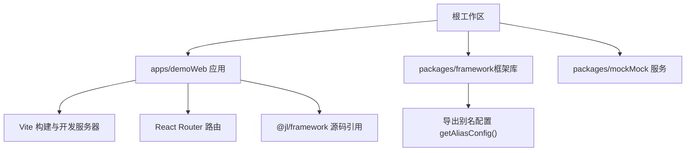
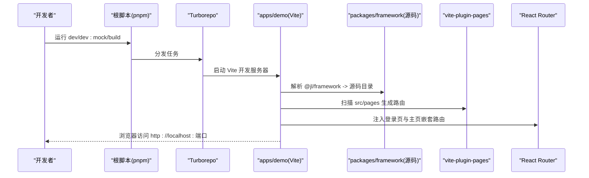
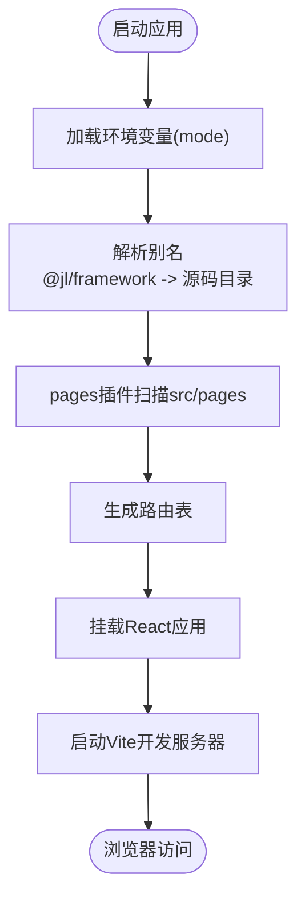
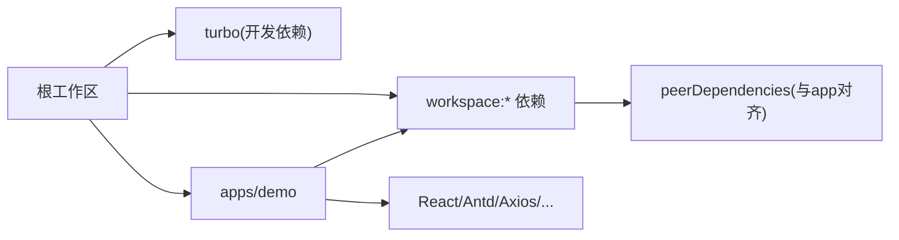

# 快速开始

<cite>
**本文引用的文件**
- [package.json](file://package.json)
- [pnpm-workspace.yaml](file://pnpm-workspace.yaml)
- [turbo.json](file://turbo.json)
- [apps/demo/package.json](file://apps/demo/package.json)
- [apps/demo/vite.config.ts](file://apps/demo/vite.config.ts)
- [apps/demo/src/main.tsx](file://apps/demo/src/main.tsx)
- [packages/framework/package.json](file://packages/framework/package.json)
- [packages/framework/vite.config.ts](file://packages/framework/vite.config.ts)
- [docs/1.运行与构建.md](file://docs/1.运行与构建.md)
</cite>

## 目录
1. [简介](#简介)
2. [项目结构](#项目结构)
3. [核心组件](#核心组件)
4. [架构总览](#架构总览)
5. [详细组件分析](#详细组件分析)
6. [依赖分析](#依赖分析)
7. [性能考虑](#性能考虑)
8. [故障排除指南](#故障排除指南)
9. [结论](#结论)
10. [附录](#附录)

## 简介
本指南面向首次接触 WMS Web 项目的开发者，帮助你在最短时间内完成环境准备、仓库克隆、依赖安装、Monorepo 初始化与任务编排配置，并成功启动开发服务器。你将了解基于 pnpm workspace 的 Monorepo 结构与 turbo 的任务编排机制，以及应用与框架包的协作方式。

## 项目结构
本项目采用 Monorepo 组织方式：
- apps/demo：前端应用（React + Vite），提供页面、布局、主题与路由等。
- packages/framework：共享框架库，提供通用能力与别名配置导出。
- packages/mock：Mock 服务（用于本地接口模拟）。
- 根目录：统一脚本入口与 Turborepo 任务编排。

图表来源
- [pnpm-workspace.yaml:1-5](file://pnpm-workspace.yaml#L1-L5)
- [turbo.json:1-29](file://turbo.json#L1-L29)
- [apps/demo/vite.config.ts:1-36](file://apps/demo/vite.config.ts#L1-L36)
- [packages/framework/vite.config.ts:1-56](file://packages/framework/vite.config.ts#L1-L56)

章节来源
- [pnpm-workspace.yaml:1-5](file://pnpm-workspace.yaml#L1-L5)
- [turbo.json:1-29](file://turbo.json#L1-L29)
- [apps/demo/package.json:1-44](file://apps/demo/package.json#L1-L44)
- [apps/demo/vite.config.ts:1-36](file://apps/demo/vite.config.ts#L1-L36)
- [packages/framework/package.json:1-52](file://packages/framework/package.json#L1-L52)
- [packages/framework/vite.config.ts:1-56](file://packages/framework/vite.config.ts#L1-L56)

## 核心组件
- 包管理器与工作区：使用 pnpm 管理多包工作区，通过 pnpm-workspace.yaml 声明 apps/* 与 packages/*。
- 任务编排：使用 Turborepo 在根脚本中统一执行 build、dev、dev:mock、lint 等任务，支持缓存与持久化。
- 应用层：apps/demo 基于 Vite + React，使用 vite-plugin-pages 进行页面路由，并通过别名将 @jl/framework 指向框架源码目录。
- 框架层：packages/framework 提供可复用的 UI/状态/工具能力，并在构建时生成类型声明与 UMD/ES 产物；同时导出别名配置供应用复用。

章节来源
- [package.json:1-19](file://package.json#L1-L19)
- [pnpm-workspace.yaml:1-5](file://pnpm-workspace.yaml#L1-L5)
- [turbo.json:1-29](file://turbo.json#L1-L29)
- [apps/demo/package.json:1-44](file://apps/demo/package.json#L1-L44)
- [apps/demo/vite.config.ts:1-36](file://apps/demo/vite.config.ts#L1-L36)
- [packages/framework/package.json:1-52](file://packages/framework/package.json#L1-L52)
- [packages/framework/vite.config.ts:1-56](file://packages/framework/vite.config.ts#L1-L56)

## 架构总览
下图展示了从根脚本到应用与框架的调用关系，以及环境变量与别名的装配流程。

图表来源
- [package.json:6-11](file://package.json#L6-L11)
- [turbo.json:3-28](file://turbo.json#L3-L28)
- [apps/demo/vite.config.ts:1-36](file://apps/demo/vite.config.ts#L1-L36)
- [apps/demo/src/main.tsx:1-53](file://apps/demo/src/main.tsx#L1-L53)

## 详细组件分析

### 环境与前置要求
- Node.js：建议使用文档推荐的版本（例如 24.x），可通过 nvm 切换与管理。
- 包管理器：pnpm（推荐锁定版本由根 package.json 指定）。
- 建议安装：Node 与 pnpm 后，在根目录执行依赖安装。

章节来源
- [docs/1.运行与构建.md:7-16](file://docs/1.运行与构建.md#L7-L16)
- [package.json:15-18](file://package.json#L15-L18)

### Monorepo 初始化与工作区
- 工作区定义：pnpm-workspace.yaml 声明 apps/* 与 packages/* 为工作区包。
- 根脚本：通过 turbo run 统一调度各子包的脚本命令。
- 任务编排：turbo.json 定义了 build、dev、dev:mock、lint 的行为与缓存策略。

章节来源
- [pnpm-workspace.yaml:1-5](file://pnpm-workspace.yaml#L1-L5)
- [package.json:6-11](file://package.json#L6-L11)
- [turbo.json:1-29](file://turbo.json#L1-L29)

### 应用开发与启动
- 应用脚本：apps/demo/package.json 提供 dev、dev:prod、dev:mock、build、preview 等脚本。
- Vite 配置：
  - 根据 mode 加载环境变量。
  - 使用 vite-plugin-pages 自动扫描 src/pages 生成路由。
  - 将 @jl/framework 指向 packages/framework/src 以启用源码级联调试。
  - 合并框架导出的别名配置。
  - 设置开发服务器端口（来自环境变量或默认值）。
- 应用入口：main.tsx 使用 React Router 注册登录页与主布局，挂载 Antd ConfigProvider 并提供 Suspense。

图表来源
- [apps/demo/vite.config.ts:1-36](file://apps/demo/vite.config.ts#L1-L36)
- [apps/demo/src/main.tsx:1-53](file://apps/demo/src/main.tsx#L1-L53)

章节来源
- [apps/demo/package.json:6-13](file://apps/demo/package.json#L6-L13)
- [apps/demo/vite.config.ts:1-36](file://apps/demo/vite.config.ts#L1-L36)
- [apps/demo/src/main.tsx:1-53](file://apps/demo/src/main.tsx#L1-L53)

### 框架库与别名导出
- 框架包：packages/framework 提供可复用的能力，构建输出 ES/UMD 与类型声明。
- 别名导出：vite.config.ts 暴露 getAliasConfig()，应用侧可直接复用，保证一致的路径映射。
- 外部化依赖：构建时将 react/react-dom/antd 外部化，避免重复打包。

章节来源
- [packages/framework/package.json:1-52](file://packages/framework/package.json#L1-L52)
- [packages/framework/vite.config.ts:1-56](file://packages/framework/vite.config.ts#L1-L56)

## 依赖分析
- 工作区依赖：根 package.json 引入 turbo 作为开发依赖，统一编排任务。
- 应用依赖：apps/demo 依赖 React、Antd、Axios、ahooks、react-router-dom 等，并使用 workspace:* 引用本地框架包。
- 框架依赖：packages/framework 声明 peerDependencies 与应用保持一致，自身依赖 zustand、immer 等。

图表来源
- [package.json:16-18](file://package.json#L16-L18)
- [apps/demo/package.json:15-43](file://apps/demo/package.json#L15-L43)
- [packages/framework/package.json:25-51](file://packages/framework/package.json#L25-L51)

章节来源
- [package.json:1-19](file://package.json#L1-L19)
- [apps/demo/package.json:15-43](file://apps/demo/package.json#L15-L43)
- [packages/framework/package.json:25-51](file://packages/framework/package.json#L25-L51)

## 性能考虑
- 使用 Turborepo 缓存：build/lint 开启缓存，减少重复计算。
- 开发模式持久化：dev 与 dev:mock 设置为 persistent，保持进程常驻，提升热更新体验。
- 按需构建：vite-plugin-pages 异步导入页面，降低首屏体积。
- 外部化依赖：框架构建时外部化 React/Antd，避免重复打包。

章节来源
- [turbo.json:3-28](file://turbo.json#L3-L28)
- [apps/demo/vite.config.ts:12-19](file://apps/demo/vite.config.ts#L12-L19)
- [packages/framework/vite.config.ts:33-53](file://packages/framework/vite.config.ts#L33-L53)

## 故障排除指南
- 无法识别 pnpm workspace：
  - 确认根目录存在 pnpm-workspace.yaml，且包含 apps/* 与 packages/*。
  - 确保使用 pnpm 而非 npm/yarn。
- 找不到 @jl/framework：
  - 检查 apps/demo/vite.config.ts 中的别名是否指向 packages/framework/src。
  - 确认已执行依赖安装，且 pnpm 已解析 workspace:*。
- 端口冲突：
  - 通过环境变量 VITE_SERVER_PORT 调整端口，或在 .env 中配置。
- 环境变量未生效：
  - 确认当前 mode 对应的环境变量已正确加载（Vite 会根据 mode 加载）。
  - 检查 main.tsx 中路由路径是否来自环境变量。
- 构建失败：
  - 先执行 lint 检查代码问题。
  - 清理缓存后重试（删除 node_modules/.turbo 或 dist）。
- 开发服务器不刷新：
  - 确认 dev 任务为 persistent，且浏览器未缓存旧资源。

章节来源
- [pnpm-workspace.yaml:1-5](file://pnpm-workspace.yaml#L1-L5)
- [apps/demo/vite.config.ts:20-33](file://apps/demo/vite.config.ts#L20-L33)
- [apps/demo/src/main.tsx:11-21](file://apps/demo/src/main.tsx#L11-L21)
- [turbo.json:3-28](file://turbo.json#L3-L28)

## 结论
通过 pnpm workspace 与 Turborepo 的组合，WMS Web 项目在 Monorepo 下实现了清晰的职责划分与高效的开发体验。按照本指南完成环境准备与启动后，你可以快速进入业务开发，并利用框架层的复用能力加速迭代。

## 附录

### 快速上手步骤（从零到运行）
- 安装 Node.js（建议使用文档推荐版本）与 pnpm。
- 克隆仓库并进入根目录。
- 安装依赖：pnpm install。
- 启动开发服务器（含 Mock）：pnpm dev:mock。
- 打开浏览器访问提示的本地地址。

章节来源
- [docs/1.运行与构建.md:7-16](file://docs/1.运行与构建.md#L7-L16)
- [package.json:6-11](file://package.json#L6-L11)

### 常用命令速查
- 开发（普通）：pnpm dev
- 开发（Mock）：pnpm dev:mock
- 构建：pnpm build
- 代码检查：pnpm lint

章节来源
- [package.json:6-11](file://package.json#L6-L11)
- [turbo.json:3-28](file://turbo.json#L3-L28)

### 环境变量要点
- 应用标题、端口、API 基础地址等通过环境变量控制。
- 不同 mode 可覆盖不同配置，便于多环境部署。
- 应用入口会读取登录页路径等变量，用于路由配置。

章节来源
- [docs/1.运行与构建.md:18-63](file://docs/1.运行与构建.md#L18-L63)
- [apps/demo/vite.config.ts:7-10](file://apps/demo/vite.config.ts#L7-L10)
- [apps/demo/src/main.tsx:11-21](file://apps/demo/src/main.tsx#L11-L21)