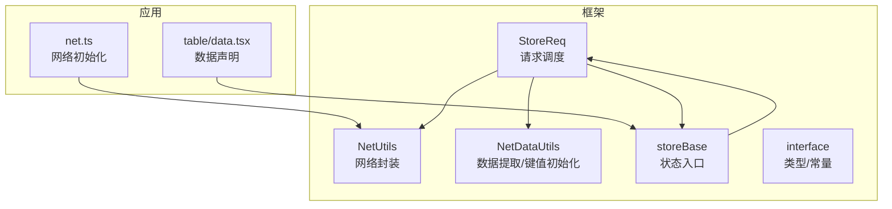
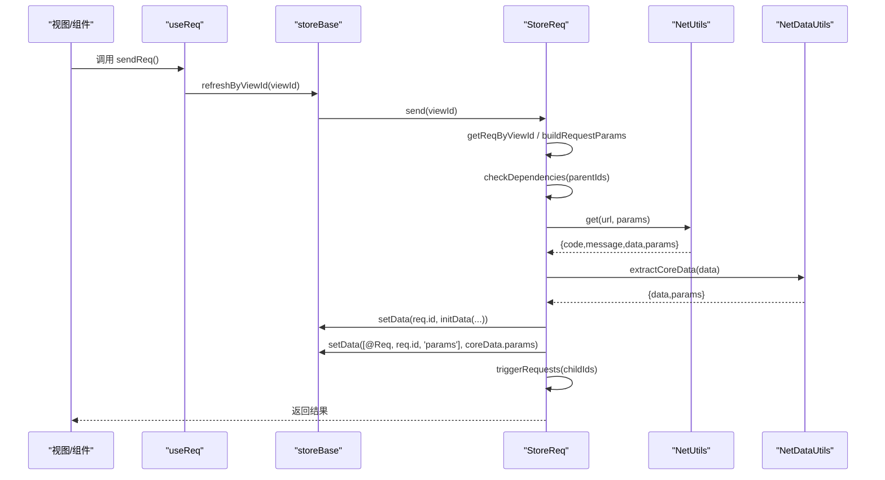
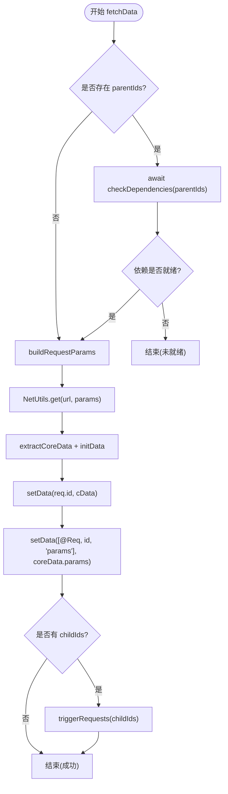
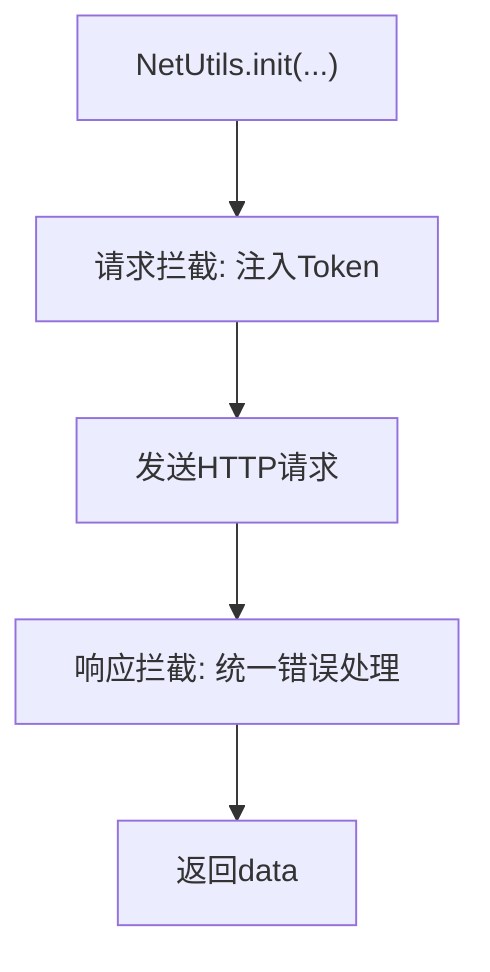
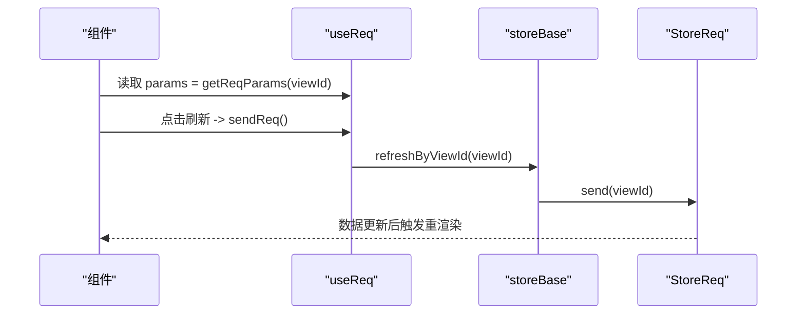
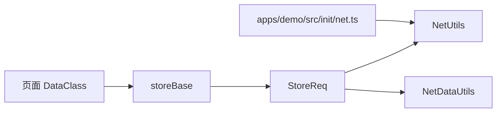

# 数据同步

<cite>
**本文引用的文件**
- [packages/framework/src/stores/store/utils/storeReq.ts](file://packages/framework/src/stores/store/utils/storeReq.ts)
- [packages/framework/src/stores/store/hooks/useReq.ts](file://packages/framework/src/stores/store/hooks/useReq.ts)
- [packages/framework/src/stores/store/storeBase.ts](file://packages/framework/src/stores/store/storeBase.ts)
- [packages/framework/src/stores/store/interface.ts](file://packages/framework/src/stores/store/interface.ts)
- [packages/framework/src/data/interface.ts](file://packages/framework/src/data/interface.ts)
- [packages/framework/src/utils/netUtils/index.ts](file://packages/framework/src/utils/netUtils/index.ts)
- [packages/framework/src/utils/netUtils/netDataUtils.ts](file://packages/framework/src/utils/netUtils/netDataUtils.ts)
- [apps/demo/src/init/net.ts](file://apps/demo/src/init/net.ts)
- [apps/demo/src/pages/base/table/data.tsx](file://apps/demo/src/pages/base/table/data.tsx)
</cite>

## 目录
1. [简介](#简介)
2. [项目结构](#项目结构)
3. [核心组件](#核心组件)
4. [架构总览](#架构总览)
5. [详细组件分析](#详细组件分析)
6. [依赖关系分析](#依赖关系分析)
7. [性能考虑](#性能考虑)
8. [故障排查指南](#故障排查指南)
9. [结论](#结论)
10. [附录](#附录)

## 简介
本文件围绕“数据同步”主题，系统化阐述本地存储与远程数据同步的实现机制、缓存策略与一致性保证；详细说明请求参数的管理与传递（getReqParams、refreshByViewId）；解释错误处理与重试策略；给出增量/全量更新策略选择与大数据优化建议；并提供列表加载、表单提交、实时更新的典型应用场景。

## 项目结构
- 框架层（packages/framework）
  - 状态与请求：store 层封装数据读写、视图管理、请求调度（StoreReq、storeBase、interface）
  - 网络层：统一网络请求封装（NetUtils），含拦截器、鉴权、错误回调
  - 数据处理：响应数据提取与键值初始化（NetDataUtils）
  - 类型定义：数据模型、路径与常量（data/interface、stores/interface）
- 应用层（apps/demo）
  - 网络初始化：配置 baseURL、登录页、登录接口与全局错误处理（init/net.ts）
  - 页面数据声明：以 DataProps 描述数据源、URL、参数映射等（如 table/data.tsx）

**图表来源**
- [packages/framework/src/stores/store/utils/storeReq.ts:70-180](file://packages/framework/src/stores/store/utils/storeReq.ts#L70-L180)
- [packages/framework/src/utils/netUtils/index.ts:23-72](file://packages/framework/src/utils/netUtils/index.ts#L23-L72)
- [packages/framework/src/utils/netUtils/netDataUtils.ts:31-113](file://packages/framework/src/utils/netUtils/netDataUtils.ts#L31-L113)
- [packages/framework/src/stores/store/storeBase.ts:18-53](file://packages/framework/src/stores/store/storeBase.ts#L18-L53)
- [apps/demo/src/init/net.ts:5-17](file://apps/demo/src/init/net.ts#L5-L17)
- [apps/demo/src/pages/base/table/data.tsx:3-18](file://apps/demo/src/pages/base/table/data.tsx#L3-L18)

**章节来源**
- [packages/framework/src/stores/store/utils/storeReq.ts:1-209](file://packages/framework/src/stores/store/utils/storeReq.ts#L1-L209)
- [packages/framework/src/utils/netUtils/index.ts:1-117](file://packages/framework/src/utils/netUtils/index.ts#L1-L117)
- [packages/framework/src/utils/netUtils/netDataUtils.ts:1-114](file://packages/framework/src/utils/netUtils/netDataUtils.ts#L1-L114)
- [packages/framework/src/stores/store/storeBase.ts:1-57](file://packages/framework/src/stores/store/storeBase.ts#L1-L57)
- [apps/demo/src/init/net.ts:1-19](file://apps/demo/src/init/net.ts#L1-L19)
- [apps/demo/src/pages/base/table/data.tsx:1-21](file://apps/demo/src/pages/base/table/data.tsx#L1-L21)

## 核心组件
- StoreReq：负责根据视图 ID 解析请求、构建参数、检查依赖、发起网络请求、写入本地 store、触发子节点请求
- NetUtils：基于 axios 的网络封装，提供请求/响应拦截、鉴权注入、统一错误回调
- NetDataUtils：从响应中提取核心数据与分页/激活等视图参数，并为对象/数组分配稳定 key
- storeBase：暴露统一的 get/set 能力，将 StoreReq 的能力挂载到 store 上（getReqParams、refreshByViewId）
- data/interface：定义 DataProps/SysDataProps/DataParamType，用于声明数据源、参数映射、默认值、格式化函数等

**章节来源**
- [packages/framework/src/stores/store/utils/storeReq.ts:10-208](file://packages/framework/src/stores/store/utils/storeReq.ts#L10-L208)
- [packages/framework/src/utils/netUtils/index.ts:6-117](file://packages/framework/src/utils/netUtils/index.ts#L6-L117)
- [packages/framework/src/utils/netUtils/netDataUtils.ts:31-113](file://packages/framework/src/utils/netUtils/netDataUtils.ts#L31-L113)
- [packages/framework/src/stores/store/storeBase.ts:18-53](file://packages/framework/src/stores/store/storeBase.ts#L18-L53)
- [packages/framework/src/data/interface.ts:4-37](file://packages/framework/src/data/interface.ts#L4-L37)

## 架构总览
数据同步的关键流程：
- 视图通过 useReq 获取当前视图的请求参数并触发刷新
- storeBase 将 refreshByViewId 委托给 StoreReq.send
- StoreReq 根据 viewId 定位 SysDataProps，构建参数，检查依赖，调用 NetUtils.get
- NetUtils 在请求前注入 Token，并在响应拦截器中统一错误处理
- 返回数据经 NetDataUtils 提取核心数据与视图参数，并初始化 key
- 数据写入 store.data，同时记录请求参数到 store.req，随后触发子节点请求

**图表来源**
- [packages/framework/src/stores/store/hooks/useReq.ts:9-19](file://packages/framework/src/stores/store/hooks/useReq.ts#L9-L19)
- [packages/framework/src/stores/store/storeBase.ts:49-53](file://packages/framework/src/stores/store/storeBase.ts#L49-L53)
- [packages/framework/src/stores/store/utils/storeReq.ts:27-93](file://packages/framework/src/stores/store/utils/storeReq.ts#L27-L93)
- [packages/framework/src/utils/netUtils/index.ts:107-113](file://packages/framework/src/utils/netUtils/index.ts#L107-L113)
- [packages/framework/src/utils/netUtils/netDataUtils.ts:31-60](file://packages/framework/src/utils/netUtils/netDataUtils.ts#L31-L60)

## 详细组件分析

### StoreReq：请求调度与数据落库
- 视图参数解析：getReqByViewId 支持字符串或数组 path，定位到对应 SysDataProps
- 参数读取：getReqParams 返回当前视图的 criteria，供上层使用
- 依赖检查：checkDependencies 会递归确保父级数据就绪，必要时先拉取父数据
- 参数构建：buildRequestParams 合并 criteria 与 params 映射（支持固定 value 或从 store 路径取值）
- 网络请求：getReqData 调用 NetUtils.get，捕获异常并抛出
- 数据落库：extractCoreData 分离核心数据与视图参数；initData 为对象/数组赋 key；写入 store.data 和 store.req
- 子节点触发：triggerRequests 顺序等待子节点请求完成

**图表来源**
- [packages/framework/src/stores/store/utils/storeReq.ts:70-180](file://packages/framework/src/stores/store/utils/storeReq.ts#L70-L180)

**章节来源**
- [packages/framework/src/stores/store/utils/storeReq.ts:27-180](file://packages/framework/src/stores/store/utils/storeReq.ts#L27-L180)

### NetUtils：网络封装与鉴权
- 初始化：设置 baseURL、超时、登录页、登录接口、token 过期时间
- 请求拦截：自动注入 Authorization 头；无 token 时调用 errorHandler(401)
- 响应拦截：统一错误回调，包含 code/message/type
- 便捷方法：get/post 直接返回 data
- 未授权处理：handleUnauthorized 清理 token 并跳转登录

**图表来源**
- [packages/framework/src/utils/netUtils/index.ts:23-72](file://packages/framework/src/utils/netUtils/index.ts#L23-L72)
- [packages/framework/src/utils/netUtils/index.ts:107-113](file://packages/framework/src/utils/netUtils/index.ts#L107-L113)

**章节来源**
- [packages/framework/src/utils/netUtils/index.ts:1-117](file://packages/framework/src/utils/netUtils/index.ts#L1-L117)
- [apps/demo/src/init/net.ts:5-17](file://apps/demo/src/init/net.ts#L5-L17)

### NetDataUtils：数据提取与键值初始化
- extractCoreData：识别 @dataSource/@list 作为核心数据，@pagination/@active 作为视图参数
- initData：为对象/数组递归赋值稳定 key（优先 keyAttr，其次 id/key/code，最后生成随机 key）

**章节来源**
- [packages/framework/src/utils/netUtils/netDataUtils.ts:31-113](file://packages/framework/src/utils/netUtils/netDataUtils.ts#L31-L113)

### storeBase：状态入口与能力挂载
- 暴露 setData/getData/setDataDebounce 等数据操作
- 将 StoreReq 的 getReqParams、refreshByViewId 挂载到 store 上，供 hooks 使用

**章节来源**
- [packages/framework/src/stores/store/storeBase.ts:18-53](file://packages/framework/src/stores/store/storeBase.ts#L18-L53)

### 请求参数管理与传递（getReqParams、refreshByViewId）
- getReqParams：通过 StoreReq.getReqParams 获取指定视图的 criteria，便于表单/筛选条件联动
- refreshByViewId：通过 storeBase.refreshByViewId 触发 StoreReq.send，重新拉取数据
- useReq：React Hook 封装，提供 [params, sendReq, resetReq]，简化组件侧调用

**图表来源**
- [packages/framework/src/stores/store/hooks/useReq.ts:9-19](file://packages/framework/src/stores/store/hooks/useReq.ts#L9-L19)
- [packages/framework/src/stores/store/storeBase.ts:49-53](file://packages/framework/src/stores/store/storeBase.ts#L49-L53)
- [packages/framework/src/stores/store/utils/storeReq.ts:196-207](file://packages/framework/src/stores/store/utils/storeReq.ts#L196-L207)

**章节来源**
- [packages/framework/src/stores/store/hooks/useReq.ts:1-38](file://packages/framework/src/stores/store/hooks/useReq.ts#L1-L38)
- [packages/framework/src/stores/store/storeBase.ts:49-53](file://packages/framework/src/stores/store/storeBase.ts#L49-L53)
- [packages/framework/src/stores/store/utils/storeReq.ts:42-53](file://packages/framework/src/stores/store/utils/storeReq.ts#L42-L53)

### 数据模型与参数映射（DataProps/SysDataProps/DataParamType）
- DataProps：id、url、params、defaultData、keyAttr、format
- SysDataProps：扩展 parentIds、childIds、criteria
- DataParamType：field/value/path，支持固定值或从 store 路径引用

**章节来源**
- [packages/framework/src/data/interface.ts:4-37](file://packages/framework/src/data/interface.ts#L4-L37)

### 实际应用场景
- 列表数据加载：在页面 DataClass 中声明 mainTable（id/url/keyAttr），系统自动拉取并写入 store.data，表格组件订阅即可
- 表单数据提交：mainForm 声明 url，提交后通过 refreshByViewId 刷新相关数据
- 实时数据更新：结合定时轮询或 WebSocket（由业务层实现），调用 refreshByViewId 主动刷新

示例参考：
- 列表数据声明：[apps/demo/src/pages/base/table/data.tsx:3-18](file://apps/demo/src/pages/base/table/data.tsx#L3-L18)

**章节来源**
- [apps/demo/src/pages/base/table/data.tsx:1-21](file://apps/demo/src/pages/base/table/data.tsx#L1-L21)

## 依赖关系分析
- StoreReq 依赖 NetUtils 进行网络访问，依赖 NetDataUtils 进行数据标准化
- storeBase 聚合 store 能力，并将 StoreReq 能力暴露为 IStoreActions
- 应用层通过 init/net.ts 配置 NetUtils，统一错误处理与未授权行为
- 页面通过 DataClass 声明数据源，驱动 StoreReq 的拉取与落库

**图表来源**
- [apps/demo/src/init/net.ts:5-17](file://apps/demo/src/init/net.ts#L5-L17)
- [packages/framework/src/stores/store/storeBase.ts:18-53](file://packages/framework/src/stores/store/storeBase.ts#L18-L53)
- [packages/framework/src/stores/store/utils/storeReq.ts:70-180](file://packages/framework/src/stores/store/utils/storeReq.ts#L70-L180)
- [packages/framework/src/utils/netUtils/index.ts:23-72](file://packages/framework/src/utils/netUtils/index.ts#L23-L72)
- [packages/framework/src/utils/netUtils/netDataUtils.ts:31-113](file://packages/framework/src/utils/netUtils/netDataUtils.ts#L31-L113)

**章节来源**
- [packages/framework/src/stores/store/interface.ts:74-132](file://packages/framework/src/stores/store/interface.ts#L74-L132)
- [packages/framework/src/stores/store/utils/storeReq.ts:70-180](file://packages/framework/src/stores/store/utils/storeReq.ts#L70-L180)
- [packages/framework/src/utils/netUtils/index.ts:23-72](file://packages/framework/src/utils/netUtils/index.ts#L23-L72)

## 性能考虑
- 依赖顺序与并行度
  - checkDependencies 串行等待父级数据就绪；如需提升并发，可在不破坏依赖的前提下改为 Promise.all
- 子节点请求
  - triggerRequests 串行执行子节点请求；若子节点相互独立，可考虑并行化以提升整体吞吐
- 数据去重与键值
  - NetDataUtils.initData 为对象/数组分配稳定 key，有助于列表渲染与 diff 优化
- 大列表优化
  - 服务端分页：通过 @pagination 字段配合后端分页接口
  - 前端虚拟滚动：结合 key 稳定的数据结构，减少重渲染开销
  - 增量更新：仅更新变更项，避免整表替换
- 防抖与节流
  - storeData 提供 setDataDebounce，适合高频输入场景，降低状态更新频率

[本节为通用性能建议，无需特定文件来源]

## 故障排查指南
- 常见错误来源
  - 网络层：无 Token、超时、服务端错误码；由 NetUtils 拦截器统一回调 errorHandler
  - 业务层：请求不存在、依赖未就绪；StoreReq 会输出警告日志
- 用户反馈
  - 应用层在 net.ts 中通过 message.error 展示错误信息；401 时调用 handleUnauthorized 跳转登录
- 调试建议
  - 查看 store.data 与 store.req 中的请求参数与结果
  - 检查 DataProps 的 url、params、path 映射是否正确
  - 确认 parentIds/childIds 依赖链是否符合预期

**章节来源**
- [packages/framework/src/utils/netUtils/index.ts:40-69](file://packages/framework/src/utils/netUtils/index.ts#L40-L69)
- [apps/demo/src/init/net.ts:10-15](file://apps/demo/src/init/net.ts#L10-L15)
- [packages/framework/src/stores/store/utils/storeReq.ts:74-86](file://packages/framework/src/stores/store/utils/storeReq.ts#L74-L86)
- [packages/framework/src/stores/store/utils/storeReq.ts:172-175](file://packages/framework/src/stores/store/utils/storeReq.ts#L172-L175)

## 结论
该数据同步方案通过 StoreReq 统一管理请求生命周期，结合 NetUtils 的拦截器与 NetDataUtils 的数据标准化，实现了从参数构建、依赖检查、网络请求到本地存储的完整闭环。通过 getReqParams 与 refreshByViewId，视图可灵活读取与刷新数据；借助 key 稳定化与分页/增量策略，可支撑大规模列表场景。错误处理与未授权流程清晰，便于统一用户体验。

[本节为总结性内容，无需特定文件来源]

## 附录
- 关键类型与常量
  - PathKey：@Data、@Req、@View、@Root 等路径前缀
  - ParamKey：@Active、@Select、@Open、@All 等控制参数
- 数据流要点
  - 请求参数：criteria + params 映射
  - 数据存储：store.data[id] = 标准化后的数据
  - 请求元信息：store.req[id].params = 视图参数（如分页）

**章节来源**
- [packages/framework/src/stores/store/interface.ts:34-72](file://packages/framework/src/stores/store/interface.ts#L34-L72)
- [packages/framework/src/stores/store/utils/storeReq.ts:117-137](file://packages/framework/src/stores/store/utils/storeReq.ts#L117-L137)
- [packages/framework/src/stores/store/utils/storeReq.ts:157-169](file://packages/framework/src/stores/store/utils/storeReq.ts#L157-L169)