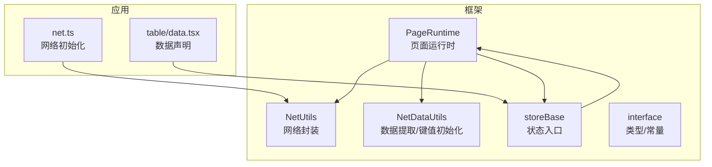
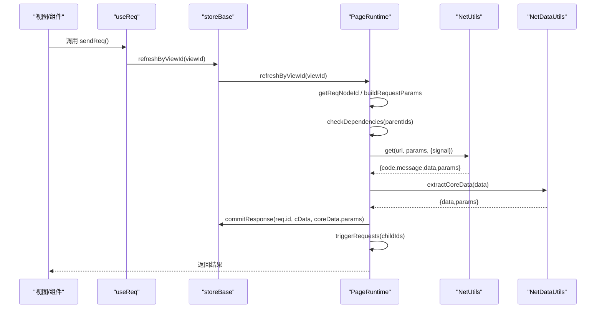
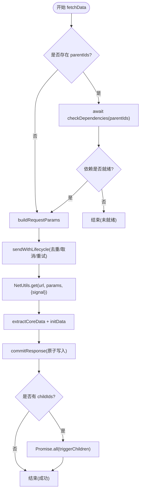
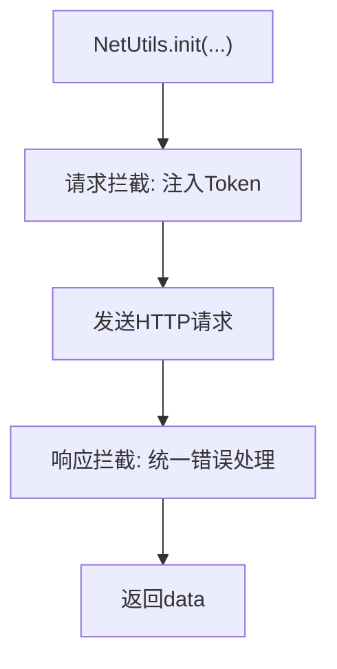
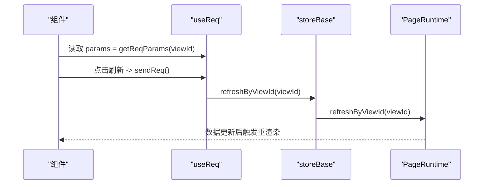
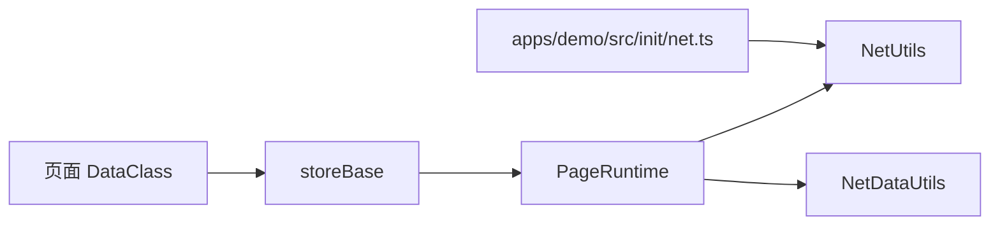

基于我对代码的分析，现在我将更新数据同步文档。主要变更是移除了旧的storeReq.ts文件，数据同步机制已迁移到PageRuntime中。让我创建更新后的文档：

# 数据同步

<cite>
**本文引用的文件**
- [packages/framework/src/stores/store/utils/pageRuntime.ts](file://packages/framework/src/stores/store/utils/pageRuntime.ts)
- [packages/framework/src/stores/store/storeBase.ts](file://packages/framework/src/stores/store/storeBase.ts)
- [packages/framework/src/stores/store/interface.ts](file://packages/framework/src/stores/store/interface.ts)
- [packages/framework/src/data/interface.ts](file://packages/framework/src/data/interface.ts)
- [packages/framework/src/utils/netUtils/index.ts](file://packages/framework/src/utils/netUtils/index.ts)
- [packages/framework/src/utils/netUtils/netDataUtils.ts](file://packages/framework/src/utils/netUtils/netDataUtils.ts)
- [packages/framework/src/stores/store/hooks/useReq.ts](file://packages/framework/src/stores/store/hooks/useReq.ts)
- [apps/demo/src/init/net.ts](file://apps/demo/src/init/net.ts)
- [apps/demo/src/pages/base/table/data.tsx](file://apps/demo/src/pages/base/table/data.tsx)
</cite>

## 更新摘要
**所做更改**
- 更新了核心组件分析，从StoreReq迁移到PageRuntime
- 重构了架构总览和详细组件分析部分
- 更新了请求生命周期和错误处理机制
- 增强了性能考虑和故障排查指南
- 保持了原有的文档结构和一致性

## 目录
1. [简介](#简介)
2. [项目结构](#项目结构)
3. [核心组件](#核心组件)
4. [架构总览](#架构总览)
5. [详细组件分析](#详细组件分析)
6. [依赖关系分析](#依赖关系分析)
7. [性能考虑](#性能考虑)
8. [故障排查指南](#故障排查指南)
9. [结论](#结论)
10. [附录](#附录)

## 简介
本文件围绕"数据同步"主题，系统化阐述本地存储与远程数据同步的实现机制、缓存策略与一致性保证；详细说明请求参数的管理与传递（getReqParams、refreshByViewId）；解释错误处理与重试策略；给出增量/全量更新策略选择与大数据优化建议；并提供列表加载、表单提交、实时更新的典型应用场景。

**更新** 数据同步机制已从旧的StoreReq迁移到新的PageRuntime实现，提供了更强大的请求去重、竞态取消、重试机制和防抖写入功能。

## 项目结构
- 框架层（packages/framework）
  - 页面运行时：PageRuntime类封装数据读写、视图管理、请求调度（请求去重、竞态取消、重试）
  - 状态管理：storeBase提供统一的get/set能力，将PageRuntime的能力挂载到store上
  - 网络层：统一网络请求封装（NetUtils），含拦截器、鉴权、错误回调
  - 数据处理：响应数据提取与键值初始化（NetDataUtils）
  - 类型定义：数据模型、路径与常量（data/interface、stores/interface）
- 应用层（apps/demo）
  - 网络初始化：配置 baseURL、登录页、登录接口与全局错误处理（init/net.ts）
  - 页面数据声明：以 DataProps 描述数据源、URL、参数映射等（如 table/data.tsx）

```mermaid
graph TB
subgraph "框架"
A["PageRuntime<br/>页面运行时"]
B["NetUtils<br/>网络封装"]
C["NetDataUtils<br/>数据提取/键值初始化"]
D["storeBase<br/>状态入口"]
E["interface<br/>类型/常量"]
end
subgraph "应用"
F["net.ts<br/>网络初始化"]
G["table/data.tsx<br/>数据声明"]
end
F --> B
G --> D
D --> A
A --> B
A --> C
A --> D
```

**图表来源**
- [packages/framework/src/stores/store/utils/pageRuntime.ts:35-418](file://packages/framework/src/stores/store/utils/pageRuntime.ts#L35-L418)
- [packages/framework/src/utils/netUtils/index.ts:6-148](file://packages/framework/src/utils/netUtils/index.ts#L6-L148)
- [packages/framework/src/utils/netUtils/netDataUtils.ts:31-121](file://packages/framework/src/utils/netUtils/netDataUtils.ts#L31-L121)
- [packages/framework/src/stores/store/storeBase.ts:20-97](file://packages/framework/src/stores/store/storeBase.ts#L20-L97)
- [apps/demo/src/init/net.ts:5-17](file://apps/demo/src/init/net.ts#L5-L17)
- [apps/demo/src/pages/base/table/data.tsx:8-22](file://apps/demo/src/pages/base/table/data.tsx#L8-L22)

**章节来源**
- [packages/framework/src/stores/store/utils/pageRuntime.ts:1-418](file://packages/framework/src/stores/store/utils/pageRuntime.ts#L1-L418)
- [packages/framework/src/utils/netUtils/index.ts:1-148](file://packages/framework/src/utils/netUtils/index.ts#L1-L148)
- [packages/framework/src/utils/netUtils/netDataUtils.ts:1-121](file://packages/framework/src/utils/netUtils/netDataUtils.ts#L1-L121)
- [packages/framework/src/stores/store/storeBase.ts:1-97](file://packages/framework/src/stores/store/storeBase.ts#L1-L97)
- [apps/demo/src/init/net.ts:1-20](file://apps/demo/src/init/net.ts#L1-L20)
- [apps/demo/src/pages/base/table/data.tsx:1-35](file://apps/demo/src/pages/base/table/data.tsx#L1-L35)

## 核心组件
- **PageRuntime**：页面运行时类，负责请求去重、竞态取消、重试机制、防抖写入、依赖检查、子节点触发
- **NetUtils**：基于 axios 的网络封装，提供请求/响应拦截、鉴权注入、统一错误回调
- **NetDataUtils**：从响应中提取核心数据与分页/激活等视图参数，并为对象/数组分配稳定 key
- **storeBase**：暴露统一的 get/set 能力，将 PageRuntime 的能力挂载到 store 上（getReqParams、refreshByViewId）
- **useReq**：React Hook 封装，提供 [params, sendReq, resetReq]，简化组件侧调用
- **data/interface**：定义 DataProps/SysDataProps/DataParamType，用于声明数据源、参数映射、默认值、格式化函数等

**章节来源**
- [packages/framework/src/stores/store/utils/pageRuntime.ts:35-418](file://packages/framework/src/stores/store/utils/pageRuntime.ts#L35-L418)
- [packages/framework/src/utils/netUtils/index.ts:6-148](file://packages/framework/src/utils/netUtils/index.ts#L6-L148)
- [packages/framework/src/utils/netUtils/netDataUtils.ts:31-121](file://packages/framework/src/utils/netUtils/netDataUtils.ts#L31-L121)
- [packages/framework/src/stores/store/storeBase.ts:20-97](file://packages/framework/src/stores/store/storeBase.ts#L20-L97)
- [packages/framework/src/stores/store/hooks/useReq.ts:11-43](file://packages/framework/src/stores/store/hooks/useReq.ts#L11-L43)
- [packages/framework/src/data/interface.ts:4-40](file://packages/framework/src/data/interface.ts#L4-L40)

## 架构总览
数据同步的关键流程：
- 视图通过 useReq 获取当前视图的请求参数并触发刷新
- storeBase 将 refreshByViewId 委托给 PageRuntime.refreshByViewId
- PageRuntime 根据 viewId 解析请求节点，构建参数，检查依赖，调用 NetUtils.get
- NetUtils 在请求前注入 Token，并在响应拦截器中统一错误处理
- 返回数据经 NetDataUtils 提取核心数据与视图参数，并初始化 key
- 数据写入 store.data，同时记录请求元信息到 reqMeta，随后触发子节点请求

```mermaid
sequenceDiagram
participant UI as "视图/组件"
participant Hook as "useReq"
participant Store as "storeBase"
participant Runtime as "PageRuntime"
participant Net as "NetUtils"
participant Data as "NetDataUtils"
UI->>Hook : 调用 sendReq()
Hook->>Store : refreshByViewId(viewId)
Store->>Runtime : refreshByViewId(viewId)
Runtime->>Runtime : getReqNodeId / buildRequestParams
Runtime->>Runtime : checkDependencies(parentIds)
Runtime->>Net : get(url, params, {signal})
Net-->>Runtime : {code,message,data,params}
Runtime->>Data : extractCoreData(data)
Data-->>Runtime : {data,params}
Runtime->>Store : commitResponse(req.id, cData, coreData.params)
Runtime->>Runtime : triggerRequests(childIds)
Runtime-->>UI : 返回结果
```

**图表来源**
- [packages/framework/src/stores/store/hooks/useReq.ts:11-43](file://packages/framework/src/stores/store/hooks/useReq.ts#L11-L43)
- [packages/framework/src/stores/store/storeBase.ts:82-86](file://packages/framework/src/stores/store/storeBase.ts#L82-L86)
- [packages/framework/src/stores/store/utils/pageRuntime.ts:108-115](file://packages/framework/src/stores/store/utils/pageRuntime.ts#L108-L115)
- [packages/framework/src/utils/netUtils/index.ts:124-130](file://packages/framework/src/utils/netUtils/index.ts#L124-L130)
- [packages/framework/src/utils/netUtils/netDataUtils.ts:32-59](file://packages/framework/src/utils/netUtils/netDataUtils.ts#L32-L59)

## 详细组件分析

### PageRuntime：页面运行时与请求生命周期
- **请求节点解析**：getReqNodeId 支持字符串或数组 path，定位到对应请求节点
- **参数读取**：getReqParams 返回当前视图的 criteria，供上层使用
- **依赖检查**：checkDependencies 会递归确保父级数据就绪，检测循环依赖
- **参数构建**：buildRequestParams 合并 criteria 与 params 映射（支持固定 value 或从 store 路径取值）
- **请求生命周期**：sendWithLifecycle 实现请求去重、竞态取消、重试机制
- **数据落库**：commitResponse 原子性写入数据和请求元信息
- **子节点触发**：triggerChildren 并行等待子节点请求完成

```mermaid
flowchart TD
Start(["开始 fetchData"]) --> CheckDep{"是否存在 parentIds?"}
CheckDep --> |是| WaitParent["await checkDependencies(parentIds)"]
CheckDep --> |否| BuildParams["buildRequestParams"]
WaitParent --> DepOk{"依赖是否就绪?"}
DepOk --> |否| EndFail["结束(未就绪)"]
DepOk --> |是| BuildParams
BuildParams --> SendLife["sendWithLifecycle(去重/取消/重试)"]
SendLife --> CallNet["NetUtils.get(url, params, {signal})"]
CallNet --> Parse["extractCoreData + initData"]
Parse --> Commit["commitResponse(原子写入)"]
Commit --> ChildCheck{"是否有 childIds?"}
ChildCheck --> |是| TriggerChild["Promise.all(triggerChildren)"]
ChildCheck --> |否| EndOK["结束(成功)"]
TriggerChild --> EndOK
```

**图表来源**
- [packages/framework/src/stores/store/utils/pageRuntime.ts:169-325](file://packages/framework/src/stores/store/utils/pageRuntime.ts#L169-L325)

**章节来源**
- [packages/framework/src/stores/store/utils/pageRuntime.ts:51-325](file://packages/framework/src/stores/store/utils/pageRuntime.ts#L51-L325)

### NetUtils：网络封装与鉴权
- **初始化**：设置 baseURL、超时、登录页、登录接口、token 过期时间
- **请求拦截**：自动注入 Authorization 头；无 token 时调用 errorHandler(401)
- **响应拦截**：统一错误回调，包含 code/message/type；支持竞态取消透传
- **便捷方法**：get/post 直接返回 data
- **未授权处理**：handleUnauthorized 清理 token 并跳转登录

```mermaid
flowchart TD
Init["NetUtils.init(...)"] --> InterReq["请求拦截: 注入Token"]
InterReq --> Send["发送HTTP请求"]
Send --> Resp["响应拦截: 统一错误处理"]
Resp --> Done["返回data"]
```

**图表来源**
- [packages/framework/src/utils/netUtils/index.ts:23-76](file://packages/framework/src/utils/netUtils/index.ts#L23-L76)
- [packages/framework/src/utils/netUtils/index.ts:124-144](file://packages/framework/src/utils/netUtils/index.ts#L124-L144)

**章节来源**
- [packages/framework/src/utils/netUtils/index.ts:1-148](file://packages/framework/src/utils/netUtils/index.ts#L1-L148)
- [apps/demo/src/init/net.ts:5-17](file://apps/demo/src/init/net.ts#L5-L17)

### NetDataUtils：数据提取与键值初始化
- **extractCoreData**：识别 @dataSource/@list 作为核心数据，@pagination/@active 作为视图参数
- **initData**：为对象/数组递归赋值稳定 key（优先 keyAttr，其次 id/key/code，最后生成随机 key）

**章节来源**
- [packages/framework/src/utils/netUtils/netDataUtils.ts:32-121](file://packages/framework/src/utils/netUtils/netDataUtils.ts#L32-L121)

### storeBase：状态入口与能力挂载
- **暴露 setData/getData/setDataDebounce 等数据操作**
- **将 PageRuntime 的 getReqParams、refreshByViewId 挂载到 store 上，供 hooks 使用**
- **页面运行时与 store 同生命周期：请求登记与防抖计时器按页面实例隔离**

**章节来源**
- [packages/framework/src/stores/store/storeBase.ts:20-97](file://packages/framework/src/stores/store/storeBase.ts#L20-L97)

### 请求参数管理与传递（getReqParams、refreshByViewId）
- **getReqParams**：通过 PageRuntime.getReqParams 获取指定视图的 criteria，便于表单/筛选条件联动
- **refreshByViewId**：通过 storeBase.refreshByViewId 触发 PageRuntime.refreshByViewId，重新拉取数据
- **useReq**：React Hook 封装，提供 [params, sendReq, resetReq]，简化组件侧调用

```mermaid
sequenceDiagram
participant Comp as "组件"
participant Hook as "useReq"
participant Store as "storeBase"
participant Runtime as "PageRuntime"
Comp->>Hook : 读取 params = getReqParams(viewId)
Comp->>Hook : 点击刷新 -> sendReq()
Hook->>Store : refreshByViewId(viewId)
Store->>Runtime : refreshByViewId(viewId)
Runtime-->>Comp : 数据更新后触发重渲染
```

**图表来源**
- [packages/framework/src/stores/store/hooks/useReq.ts:11-43](file://packages/framework/src/stores/store/hooks/useReq.ts#L11-L43)
- [packages/framework/src/stores/store/storeBase.ts:82-86](file://packages/framework/src/stores/store/storeBase.ts#L82-L86)
- [packages/framework/src/stores/store/utils/pageRuntime.ts:108-115](file://packages/framework/src/stores/store/utils/pageRuntime.ts#L108-L115)

**章节来源**
- [packages/framework/src/stores/store/hooks/useReq.ts:11-43](file://packages/framework/src/stores/store/hooks/useReq.ts#L11-L43)
- [packages/framework/src/stores/store/storeBase.ts:82-86](file://packages/framework/src/stores/store/storeBase.ts#L82-L86)
- [packages/framework/src/stores/store/utils/pageRuntime.ts:71-77](file://packages/framework/src/stores/store/utils/pageRuntime.ts#L71-L77)

### 数据模型与参数映射（DataProps/SysDataProps/DataParamType）
- **DataProps**：id、url、params、defaultData、keyAttr、format、retry
- **SysDataProps**：扩展 parentIds、childIds、criteria
- **DataParamType**：field/value/path，支持固定值或从 store 路径引用

**章节来源**
- [packages/framework/src/data/interface.ts:4-40](file://packages/framework/src/data/interface.ts#L4-L40)

### 实际应用场景
- **列表数据加载**：在页面 DataClass 中声明 mainTable（id/url/keyAttr），系统自动拉取并写入 store.data，表格组件订阅即可
- **表单数据提交**：mainForm 声明 url，提交后通过 refreshByViewId 刷新相关数据
- **实时数据更新**：结合定时轮询或 WebSocket（由业务层实现），调用 refreshByViewId 主动刷新

示例参考：
- 列表数据声明：[apps/demo/src/pages/base/table/data.tsx:8-22](file://apps/demo/src/pages/base/table/data.tsx#L8-L22)

**章节来源**
- [apps/demo/src/pages/base/table/data.tsx:8-22](file://apps/demo/src/pages/base/table/data.tsx#L8-L22)

## 依赖关系分析
- **PageRuntime** 依赖 NetUtils 进行网络访问，依赖 NetDataUtils 进行数据标准化
- **storeBase** 聚合 store 能力，并将 PageRuntime 能力暴露为 IStoreActions
- **应用层** 通过 init/net.ts 配置 NetUtils，统一错误处理与未授权行为
- **页面** 通过 DataClass 声明数据源，驱动 PageRuntime 的拉取与落库

```mermaid
graph LR
NetInit["apps/demo/src/init/net.ts"] --> NetUtils["NetUtils"]
StoreBase["storeBase"] --> PageRuntime["PageRuntime"]
PageRuntime --> NetUtils
PageRuntime --> NetDataUtils["NetDataUtils"]
PageData["页面 DataClass"] --> StoreBase
```

**图表来源**
- [apps/demo/src/init/net.ts:5-17](file://apps/demo/src/init/net.ts#L5-L17)
- [packages/framework/src/stores/store/storeBase.ts:20-97](file://packages/framework/src/stores/store/storeBase.ts#L20-L97)
- [packages/framework/src/stores/store/utils/pageRuntime.ts:169-325](file://packages/framework/src/stores/store/utils/pageRuntime.ts#L169-L325)
- [packages/framework/src/utils/netUtils/index.ts:23-76](file://packages/framework/src/utils/netUtils/index.ts#L23-L76)
- [packages/framework/src/utils/netUtils/netDataUtils.ts:32-121](file://packages/framework/src/utils/netUtils/netDataUtils.ts#L32-L121)

**章节来源**
- [packages/framework/src/stores/store/interface.ts:117-171](file://packages/framework/src/stores/store/interface.ts#L117-L171)
- [packages/framework/src/stores/store/utils/pageRuntime.ts:169-325](file://packages/framework/src/stores/store/utils/pageRuntime.ts#L169-L325)
- [packages/framework/src/utils/netUtils/index.ts:23-76](file://packages/framework/src/utils/netUtils/index.ts#L23-L76)

## 性能考虑
- **请求去重与竞态取消**
  - inflight Map 登记进行中请求，相同参数的并发请求复用同一个 Promise
  - 新请求取代旧请求时通过 AbortController 取消，避免资源浪费
- **依赖顺序与并行度**
  - checkDependencies 串行等待父级数据就绪；子节点请求通过 Promise.all 并行执行
- **数据去重与键值**
  - NetDataUtils.initData 为对象/数组分配稳定 key，有助于列表渲染与 diff 优化
- **大列表优化**
  - 服务端分页：通过 @pagination 字段配合后端分页接口
  - 前端虚拟滚动：结合 key 稳定的数据结构，减少重渲染开销
  - 增量更新：仅更新变更项，避免整表替换
- **防抖与节流**
  - setDataDebounce 提供300ms默认延迟，同一路径的连续写入合并为最后一次
  - dispose 时立即提交未落盘的防抖输入，避免数据丢失
- **重试机制**
  - 线性递增重试间隔：300ms、600ms、900ms...
  - 可配置的 retry 次数，401/403 不重试

## 故障排查指南
- **常见错误来源**
  - 网络层：无 Token、超时、服务端错误码；由 NetUtils 拦截器统一回调 errorHandler
  - 业务层：请求不存在、依赖未就绪；PageRuntime 会输出警告日志
  - 循环依赖：checkDependencies 检测到循环依赖时会报错并终止请求
- **用户反馈**
  - 应用层在 net.ts 中通过 message.error 展示错误信息；401 时调用 handleUnauthorized 跳转登录
- **调试建议**
  - 查看 store.data 与 store.reqMeta 中的请求状态与结果
  - 检查 DataProps 的 url、params、path 映射是否正确
  - 确认 parentIds/childIds 依赖链是否符合预期
  - 使用浏览器开发者工具监控 inflight 请求和 debounce 任务

**章节来源**
- [packages/framework/src/utils/netUtils/index.ts:40-76](file://packages/framework/src/utils/netUtils/index.ts#L40-L76)
- [apps/demo/src/init/net.ts:10-15](file://apps/demo/src/init/net.ts#L10-L15)
- [packages/framework/src/stores/store/utils/pageRuntime.ts:183-207](file://packages/framework/src/stores/store/utils/pageRuntime.ts#L183-L207)
- [packages/framework/src/stores/store/utils/pageRuntime.ts:229-233](file://packages/framework/src/stores/store/utils/pageRuntime.ts#L229-L233)

## 结论
该数据同步方案通过 PageRuntime 统一管理请求生命周期，实现了请求去重、竞态取消、重试机制和防抖写入等高级特性。结合 NetUtils 的拦截器与 NetDataUtils 的数据标准化，实现了从参数构建、依赖检查、网络请求到本地存储的完整闭环。通过 getReqParams 与 refreshByViewId，视图可灵活读取与刷新数据；借助 key 稳定化与分页/增量策略，可支撑大规模列表场景。错误处理与未授权流程清晰，便于统一用户体验。

**更新** 新的 PageRuntime 实现相比旧的 StoreReq 提供了更强大的功能：请求去重避免重复请求、竞态取消防止资源浪费、重试机制提高容错性、防抖写入优化用户体验。

## 附录
- **关键类型与常量**
  - PathKey：@Data、@Req、@View、@Root 等路径前缀
  - ParamKey：@Active、@Select、@Open、@All 等控制参数
  - ReqStatus：'idle' | 'pending' | 'success' | 'error' 请求状态
- **数据流要点**
  - 请求参数：criteria + params 映射
  - 数据存储：store.data[id] = 标准化后的数据
  - 请求元信息：reqMeta[id].status = 请求状态，responseParams = 响应参数
  - 请求去重：inflight Map 登记进行中请求，相同参数复用 Promise
  - 竞态取消：AbortController 取消旧请求，新请求取代旧请求

**章节来源**
- [packages/framework/src/stores/store/interface.ts:64-100](file://packages/framework/src/stores/store/interface.ts#L64-L100)
- [packages/framework/src/stores/store/interface.ts:29-45](file://packages/framework/src/stores/store/interface.ts#L29-L45)
- [packages/framework/src/stores/store/utils/pageRuntime.ts:360-386](file://packages/framework/src/stores/store/utils/pageRuntime.ts#L360-L386)
- [packages/framework/src/stores/store/utils/pageRuntime.ts:327-354](file://packages/framework/src/stores/store/utils/pageRuntime.ts#L327-L354)