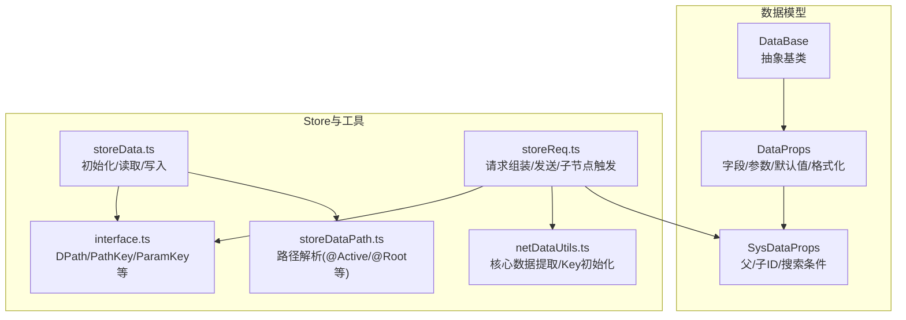
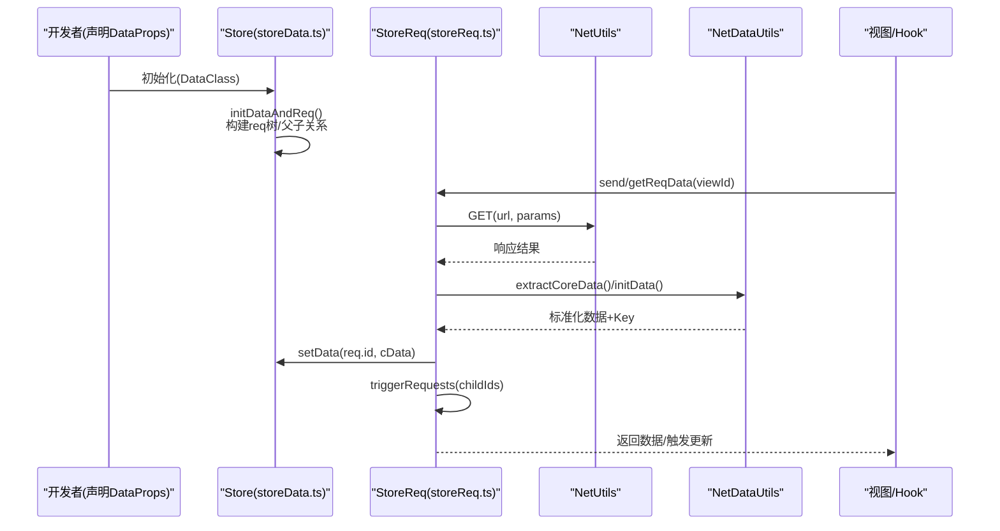
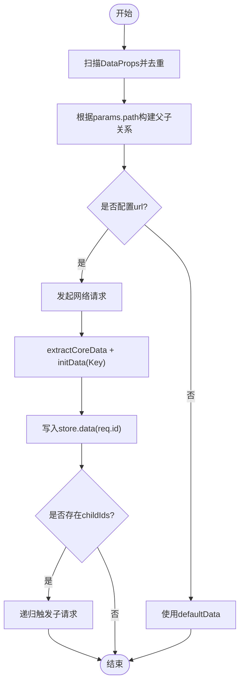
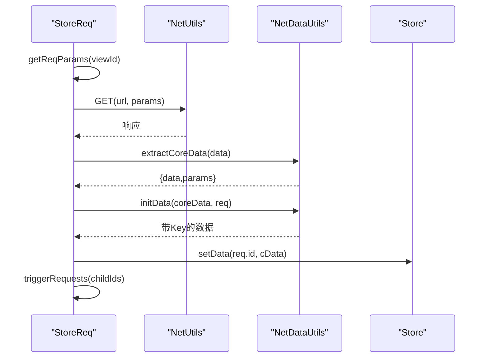
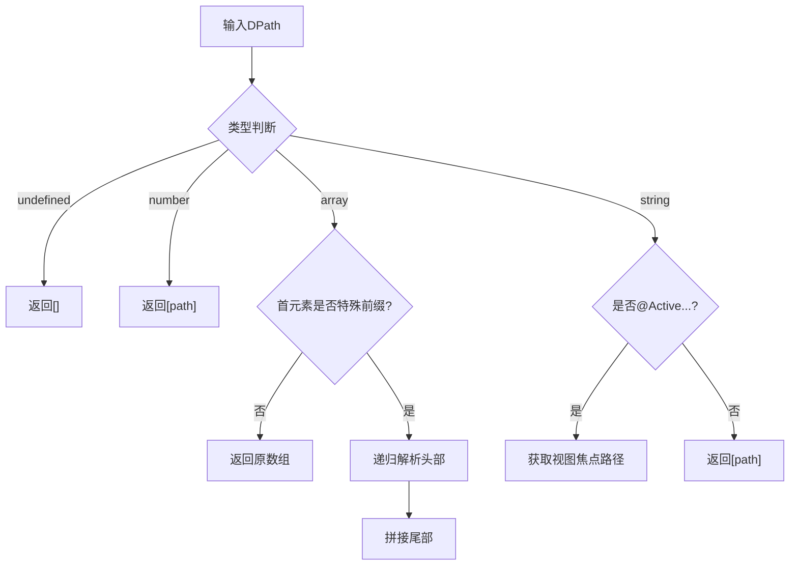
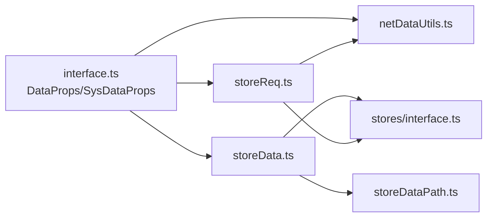

# 数据模型

<cite>
**本文引用的文件**
- [packages/framework/src/data/interface.ts](file://packages/framework/src/data/interface.ts)
- [packages/framework/src/data/dataBase.ts](file://packages/framework/src/data/dataBase.ts)
- [packages/framework/src/stores/store/utils/storeData.ts](file://packages/framework/src/stores/store/utils/storeData.ts)
- [packages/framework/src/stores/store/utils/storeReq.ts](file://packages/framework/src/stores/store/utils/storeReq.ts)
- [packages/framework/src/stores/store/utils/storeDataPath.ts](file://packages/framework/src/stores/store/utils/storeDataPath.ts)
- [packages/framework/src/stores/store/interface.ts](file://packages/framework/src/stores/store/interface.ts)
- [packages/framework/src/utils/netUtils/netDataUtils.ts](file://packages/framework/src/utils/netUtils/netDataUtils.ts)
- [apps/demo/src/pages/base/table/data.tsx](file://apps/demo/src/pages/base/table/data.tsx)
- [apps/demo/src/pages/base/form/data.tsx](file://apps/demo/src/pages/base/form/data.tsx)
</cite>

## 目录
1. [简介](#简介)
2. [项目结构](#项目结构)
3. [核心组件](#核心组件)
4. [架构总览](#架构总览)
5. [详细组件分析](#详细组件分析)
6. [依赖关系分析](#依赖关系分析)
7. [性能考虑](#性能考虑)
8. [故障排查指南](#故障排查指南)
9. [结论](#结论)
10. [附录：创建与使用示例](#附录创建与使用示例)

## 简介
本文件围绕数据模型的设计与实现，系统性阐述 DataProps 接口、SysDataProps 接口、数据请求与转换流程、生命周期管理、继承扩展机制，以及在实际业务中的创建与使用方式。目标是帮助开发者在不深入源码细节的前提下，快速掌握数据模型的职责边界、约束条件与最佳实践。

## 项目结构
数据模型相关代码主要分布在以下位置：
- 数据模型定义：packages/framework/src/data/interface.ts
- 数据基类：packages/framework/src/data/dataBase.ts
- 数据初始化与读写：packages/framework/src/stores/store/utils/storeData.ts
- 数据路径解析：packages/framework/src/stores/store/utils/storeDataPath.ts
- 数据请求与触发：packages/framework/src/stores/store/utils/storeReq.ts
- Store 类型与常量：packages/framework/src/stores/store/interface.ts
- 网络数据工具（提取核心数据、初始化 Key）：packages/framework/src/utils/netUtils/netDataUtils.ts
- Demo 使用示例：apps/demo/src/pages/base/*

图表来源
- [packages/framework/src/data/interface.ts:1-38](file://packages/framework/src/data/interface.ts#L1-L38)
- [packages/framework/src/data/dataBase.ts:1-18](file://packages/framework/src/data/dataBase.ts#L1-L18)
- [packages/framework/src/stores/store/utils/storeData.ts:1-84](file://packages/framework/src/stores/store/utils/storeData.ts#L1-L84)
- [packages/framework/src/stores/store/utils/storeDataPath.ts:1-96](file://packages/framework/src/stores/store/utils/storeDataPath.ts#L1-L96)
- [packages/framework/src/stores/store/utils/storeReq.ts:1-208](file://packages/framework/src/stores/store/utils/storeReq.ts#L1-L208)
- [packages/framework/src/utils/netUtils/netDataUtils.ts:1-114](file://packages/framework/src/utils/netUtils/netDataUtils.ts#L1-L114)
- [packages/framework/src/stores/store/interface.ts:1-133](file://packages/framework/src/stores/store/interface.ts#L1-L133)

章节来源
- [packages/framework/src/data/interface.ts:1-38](file://packages/framework/src/data/interface.ts#L1-L38)
- [packages/framework/src/data/dataBase.ts:1-18](file://packages/framework/src/data/dataBase.ts#L1-L18)
- [packages/framework/src/stores/store/utils/storeData.ts:1-84](file://packages/framework/src/stores/store/utils/storeData.ts#L1-L84)
- [packages/framework/src/stores/store/utils/storeDataPath.ts:1-96](file://packages/framework/src/stores/store/utils/storeDataPath.ts#L1-L96)
- [packages/framework/src/stores/store/utils/storeReq.ts:1-208](file://packages/framework/src/stores/store/utils/storeReq.ts#L1-L208)
- [packages/framework/src/utils/netUtils/netDataUtils.ts:1-114](file://packages/framework/src/utils/netUtils/netDataUtils.ts#L1-L114)
- [packages/framework/src/stores/store/interface.ts:1-133](file://packages/framework/src/stores/store/interface.ts#L1-L133)

## 核心组件
- DataProps：声明数据节点的元信息，包括唯一标识、数据来源（path/url）、请求参数、默认数据、主键策略、数据格式化函数。
- SysDataProps：在 DataProps 基础上扩展系统运行时字段，如 parentIds、childIds、criteria，用于描述数据节点间的父子关系与搜索上下文。
- DataBase：抽象基类，提供便捷方法（如 active），并约定子类以 DataProps 为属性集合的组织形式。
- Store 层：负责将 DataProps 转换为可运行的 SysDataProps，维护 data/req/view 等状态，并提供 get/set 能力。
- NetDataUtils：对后端返回数据进行“核心数据”提取与“Key”初始化，确保列表项具备稳定标识。

章节来源
- [packages/framework/src/data/interface.ts:1-38](file://packages/framework/src/data/interface.ts#L1-L38)
- [packages/framework/src/data/dataBase.ts:1-18](file://packages/framework/src/data/dataBase.ts#L1-L18)
- [packages/framework/src/stores/store/utils/storeData.ts:1-84](file://packages/framework/src/stores/store/utils/storeData.ts#L1-L84)
- [packages/framework/src/utils/netUtils/netDataUtils.ts:1-114](file://packages/framework/src/utils/netDataUtils/netDataUtils.ts#L1-L114)

## 架构总览
数据模型从声明到渲染的完整链路如下：
- 开发者通过继承 DataBase 声明多个 DataProps 实例。
- Store 初始化阶段扫描这些实例，构建 SysDataProps，计算父子关系，生成 req 树。
- 视图或处理器触发数据请求时，StoreReq 根据 url/params 发起网络请求，调用 NetDataUtils 处理响应，写入 store.data，并级联触发子节点请求。
- 组件通过 useData/useDataById 等 Hook 订阅数据变化。

图表来源
- [packages/framework/src/stores/store/utils/storeData.ts:1-84](file://packages/framework/src/stores/store/utils/storeData.ts#L1-L84)
- [packages/framework/src/stores/store/utils/storeReq.ts:1-208](file://packages/framework/src/stores/store/utils/storeReq.ts#L1-L208)
- [packages/framework/src/utils/netUtils/netDataUtils.ts:1-114](file://packages/framework/src/utils/netUtils/netDataUtils.ts#L1-L114)

## 详细组件分析

### DataProps 接口设计与约束
- id：必填，作为数据节点的唯一标识，用于存储与引用。
- path：可选的数据引用路径（DPath），若当前值存在则跳过请求；支持 @Active/@Root 等特殊前缀。
- url：可选的网络请求地址；当存在且非空时执行网络请求。
- params：可选的请求参数数组，每个元素包含 field/value/path，value 优先于 path 引用。
- defaultData：可选的默认数据，当无 url 或请求未命中时使用。
- keyAttr：可选的主键策略，支持字符串或字符串数组组合；未设置时由系统自动生成全局唯一 Key。
- format：可选的数据格式化函数，用于对后端返回的 data 进行预处理。

验证与约束要点
- id 必须存在且为字符串，否则会被忽略。
- path 为空或未定义时，不会触发“已有值不请求”的短路逻辑。
- params.value 优先级高于 params.path，避免重复解析。
- keyAttr 可为复合键，便于复杂实体定位。

章节来源
- [packages/framework/src/data/interface.ts:1-38](file://packages/framework/src/data/interface.ts#L1-L38)
- [packages/framework/src/stores/store/utils/storeData.ts:1-84](file://packages/framework/src/stores/store/utils/storeData.ts#L1-L84)

### SysDataProps 的作用与规则
- parentIds/childIds：由 Store 在初始化阶段根据 params.path 自动推导，形成数据依赖图，用于级联请求。
- criteria：搜索条件容器，通常由上层传入或动态填充，参与请求参数拼装。
- 继承自 DataProps，保留所有字段语义。

章节来源
- [packages/framework/src/data/interface.ts:1-38](file://packages/framework/src/data/interface.ts#L1-L38)
- [packages/framework/src/stores/store/utils/storeData.ts:1-84](file://packages/framework/src/stores/store/utils/storeData.ts#L1-L84)

### 数据模型的生命周期管理
- 初始化：initDataAndReq 遍历 DataProps，去重后复制到 req 树，并基于 params.path 计算父子关系，填充 parentIds/childIds。
- 更新：setData/getData 通过 storeDataPath 解析真实路径（含 @Active/@Root 等），读写 store.data。
- 销毁：当前仓库未显式暴露销毁 API；如需清理，建议在应用卸载时重置 store 或移除视图绑定。

图表来源
- [packages/framework/src/stores/store/utils/storeData.ts:1-84](file://packages/framework/src/stores/store/utils/storeData.ts#L1-L84)
- [packages/framework/src/stores/store/utils/storeReq.ts:1-208](file://packages/framework/src/stores/store/utils/storeReq.ts#L1-L208)
- [packages/framework/src/utils/netUtils/netDataUtils.ts:1-114](file://packages/framework/src/utils/netUtils/netDataUtils.ts#L1-L114)

章节来源
- [packages/framework/src/stores/store/utils/storeData.ts:1-84](file://packages/framework/src/stores/store/utils/storeData.ts#L1-L84)
- [packages/framework/src/stores/store/utils/storeReq.ts:1-208](file://packages/framework/src/stores/store/utils/storeReq.ts#L1-L208)

### 数据请求与转换规则
- 参数组装：getReqParams 将 params 中 value 直接赋值，或按 path 解析引用值；支持特殊键名（如 @dataSource/@list/@pagination/@active）。
- 网络请求：getReqData 根据 url 发起请求，失败时抛出异常并记录错误。
- 数据归一化：extractCoreData 识别核心数据段与视图参数段；initData 为对象/数组逐项注入 Key。
- 子节点触发：完成父节点数据写入后，按 childIds 顺序串行触发子节点请求。

图表来源
- [packages/framework/src/stores/store/utils/storeReq.ts:1-208](file://packages/framework/src/stores/store/utils/storeReq.ts#L1-L208)
- [packages/framework/src/utils/netUtils/netDataUtils.ts:1-114](file://packages/framework/src/utils/netUtils/netDataUtils.ts#L1-L114)

章节来源
- [packages/framework/src/stores/store/utils/storeReq.ts:1-208](file://packages/framework/src/stores/store/utils/storeReq.ts#L1-L208)
- [packages/framework/src/utils/netUtils/netDataUtils.ts:1-114](file://packages/framework/src/utils/netUtils/netDataUtils.ts#L1-L114)

### 路径解析与数据引用
- DPath：支持字符串、数字、数组及 undefined。
- 特殊前缀：@Active/@Root/@Data/@Req/@View/@ViewParam 等，用于在不同命名空间取值。
- 解析流程：getRealPath 会递归展开首个元素是否为特殊引用，并将 @Active 解析为对应视图的焦点路径。

图表来源
- [packages/framework/src/stores/store/utils/storeDataPath.ts:1-96](file://packages/framework/src/stores/store/utils/storeDataPath.ts#L1-L96)
- [packages/framework/src/stores/store/interface.ts:1-133](file://packages/framework/src/stores/store/interface.ts#L1-L133)

章节来源
- [packages/framework/src/stores/store/utils/storeDataPath.ts:1-96](file://packages/framework/src/stores/store/utils/storeDataPath.ts#L1-L96)
- [packages/framework/src/stores/store/interface.ts:1-133](file://packages/framework/src/stores/store/interface.ts#L1-L133)

### 继承与扩展机制
- 继承：通过继承 DataBase，将多个 DataProps 作为实例属性组织，便于统一管理与复用。
- 扩展：可通过自定义 DataProps.format 对数据进行预处理；通过 keyAttr 控制主键生成策略；通过 params 灵活拼装请求参数。
- 自定义数据类型：在业务侧定义新的 DataProps 组合，并在 Store 初始化时被自动识别与挂载。

章节来源
- [packages/framework/src/data/dataBase.ts:1-18](file://packages/framework/src/data/dataBase.ts#L1-L18)
- [packages/framework/src/data/interface.ts:1-38](file://packages/framework/src/data/interface.ts#L1-L38)

## 依赖关系分析
- DataProps/SysDataProps 被 StoreReq、StoreData、NetDataUtils 共同消费，构成数据契约。
- StoreData 依赖 storeDataPath 进行路径解析，依赖 interface 中的 PathKey/ParamKey/DPath。
- StoreReq 依赖 NetDataUtils 进行数据归一化，依赖 NetUtils 进行网络请求。
- Demo 页面通过继承 DataBase 声明具体数据模型，体现框架的可扩展性。

图表来源
- [packages/framework/src/data/interface.ts:1-38](file://packages/framework/src/data/interface.ts#L1-L38)
- [packages/framework/src/stores/store/utils/storeData.ts:1-84](file://packages/framework/src/stores/store/utils/storeData.ts#L1-L84)
- [packages/framework/src/stores/store/utils/storeReq.ts:1-208](file://packages/framework/src/stores/store/utils/storeReq.ts#L1-L208)
- [packages/framework/src/stores/store/utils/storeDataPath.ts:1-96](file://packages/framework/src/stores/store/utils/storeDataPath.ts#L1-L96)
- [packages/framework/src/stores/store/interface.ts:1-133](file://packages/framework/src/stores/store/interface.ts#L1-L133)
- [packages/framework/src/utils/netUtils/netDataUtils.ts:1-114](file://packages/framework/src/utils/netUtils/netDataUtils.ts#L1-L114)

章节来源
- [packages/framework/src/data/interface.ts:1-38](file://packages/framework/src/data/interface.ts#L1-L38)
- [packages/framework/src/stores/store/utils/storeData.ts:1-84](file://packages/framework/src/stores/store/utils/storeData.ts#L1-L84)
- [packages/framework/src/stores/store/utils/storeReq.ts:1-208](file://packages/framework/src/stores/store/utils/storeReq.ts#L1-L208)
- [packages/framework/src/stores/store/utils/storeDataPath.ts:1-96](file://packages/framework/src/stores/store/utils/storeDataPath.ts#L1-L96)
- [packages/framework/src/stores/store/interface.ts:1-133](file://packages/framework/src/stores/store/interface.ts#L1-L133)
- [packages/framework/src/utils/netUtils/netDataUtils.ts:1-114](file://packages/framework/src/utils/netUtils/netDataUtils.ts#L1-L114)

## 性能考虑
- 合理设置 keyAttr：为列表项指定稳定的主键，减少渲染时的 diff 开销。
- 利用 path 引用：通过 path 复用已有数据，避免重复请求。
- 控制子节点请求粒度：仅在必要时配置 childIds，避免不必要的级联请求。
- 使用 format 做轻量预处理：避免在 UI 层重复计算。
- 谨慎使用深度嵌套路径：过深的 DPath 会增加解析成本。

[本节为通用建议，不直接分析具体文件]

## 故障排查指南
- 数据请求失败：检查 url 是否正确、params 是否完整；查看控制台错误日志。
- 数据未更新：确认 path 解析是否符合预期（特别是 @Active/@Root）；检查是否有同名 id 导致覆盖。
- 子节点未触发：确认 parentIds/childIds 是否正确构建；检查父节点请求是否成功。
- Key 冲突：若未设置 keyAttr，系统会尝试从 id/key/code 取键，仍失败则生成随机 Key；建议显式配置 keyAttr。

章节来源
- [packages/framework/src/stores/store/utils/storeReq.ts:1-208](file://packages/framework/src/stores/store/utils/storeReq.ts#L1-L208)
- [packages/framework/src/stores/store/utils/storeData.ts:1-84](file://packages/framework/src/stores/store/utils/storeData.ts#L1-L84)
- [packages/framework/src/utils/netUtils/netDataUtils.ts:1-114](file://packages/framework/src/utils/netUtils/netDataUtils.ts#L1-L114)

## 结论
该数据模型以 DataProps 为核心契约，结合 Store 层的初始化、路径解析与请求编排，实现了声明式的数据建模与自动化数据流管理。通过 SysDataProps 的父子关系与 criteria，支撑了复杂场景下的数据联动与过滤。配合 NetDataUtils 的归一化处理，保证了数据的一致性与可追踪性。

[本节为总结性内容，不直接分析具体文件]

## 附录：创建与使用示例
以下为仓库中实际使用的示例路径，供参考：
- 表单数据模型：apps/demo/src/pages/base/form/data.tsx
- 表格数据模型（含主表与详情联动）：apps/demo/src/pages/base/table/data.tsx

章节来源
- [apps/demo/src/pages/base/form/data.tsx:1-10](file://apps/demo/src/pages/base/form/data.tsx#L1-L10)
- [apps/demo/src/pages/base/table/data.tsx:1-21](file://apps/demo/src/pages/base/table/data.tsx#L1-L21)