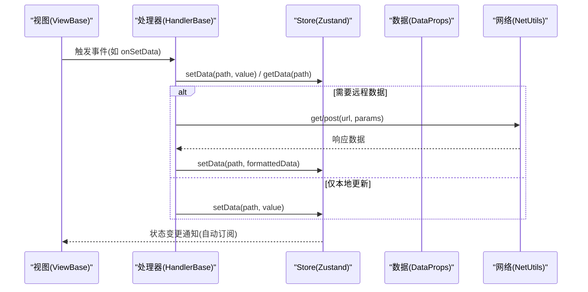
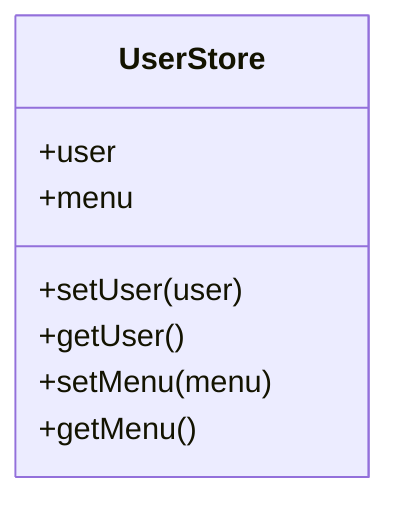
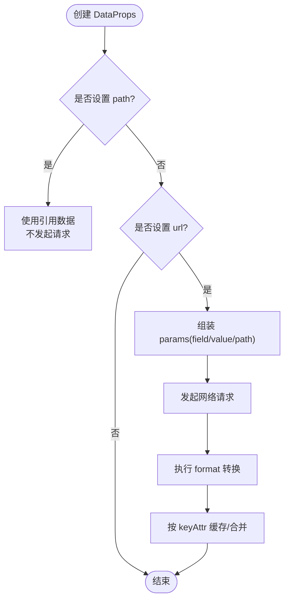
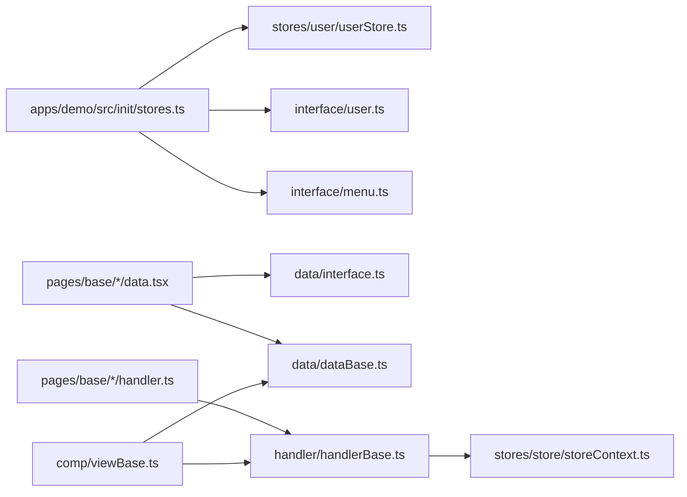

# 数据管理

<cite>
**本文引用的文件**
- [apps/demo/src/init/stores.ts](file://apps/demo/src/init/stores.ts)
- [apps/demo/src/interface/user.ts](file://apps/demo/src/interface/user.ts)
- [apps/demo/src/interface/menu.ts](file://apps/demo/src/interface/menu.ts)
- [packages/framework/src/stores/user/userStore.ts](file://packages/framework/src/stores/user/userStore.ts)
- [packages/framework/src/stores/user/interface.ts](file://packages/framework/src/stores/user/interface.ts)
- [packages/framework/src/stores/store/storeContext.ts](file://packages/framework/src/stores/store/storeContext.ts)
- [packages/framework/src/data/dataBase.ts](file://packages/framework/src/data/dataBase.ts)
- [packages/framework/src/data/interface.ts](file://packages/framework/src/data/interface.ts)
- [packages/framework/src/handler/handlerBase.ts](file://packages/framework/src/handler/handlerBase.ts)
- [packages/framework/src/comp/viewBase.ts](file://packages/framework/src/comp/viewBase.ts)
- [packages/framework/src/interface.ts](file://packages/framework/src/interface.ts)
- [apps/demo/src/pages/base/table/data.tsx](file://apps/demo/src/pages/base/table/data.tsx)
- [apps/demo/src/pages/base/form/data.tsx](file://apps/demo/src/pages/form/data.tsx)
- [apps/demo/src/pages/base/modal/data.tsx](file://apps/demo/src/pages/base/modal/data.tsx)
- [apps/demo/src/pages/base/drawer/data.tsx](file://apps/demo/src/pages/base/drawer/data.tsx)
- [apps/demo/src/pages/base/tab/data.tsx](file://apps/demo/src/pages/base/tab/data.tsx)
- [apps/demo/src/pages/base/table/handler.ts](file://apps/demo/src/pages/base/table/handler.ts)
- [apps/demo/src/pages/base/form/handler.ts](file://apps/demo/src/pages/base/form/handler.ts)
- [apps/demo/src/pages/base/modal/handler.ts](file://apps/demo/src/pages/base/modal/handler.ts)
</cite>

## 目录
1. [简介](#简介)
2. [项目结构](#项目结构)
3. [核心组件](#核心组件)
4. [架构总览](#架构总览)
5. [详细组件分析](#详细组件分析)
6. [依赖关系分析](#依赖关系分析)
7. [性能考虑](#性能考虑)
8. [故障排查指南](#故障排查指南)
9. [结论](#结论)
10. [附录：API参考与示例](#附录api参考与示例)

## 简介
本文件系统性地梳理并文档化基于 Zustand 的数据管理方案，覆盖 Store 定义、状态更新与组件订阅机制；数据模型设计与约束（DataProps 接口、类型与校验）；数据绑定机制（单向数据流与双向绑定实现思路）；数据同步策略（本地存储、远程同步与缓存管理）；并提供数据操作 API 参考（增删改查与异步处理）、实际示例与性能优化建议。

## 项目结构
仓库采用 monorepo 组织，应用层在 apps/demo，框架核心能力在 packages/framework。数据管理相关的关键位置如下：
- 应用初始化 Store：apps/demo/src/init/stores.ts
- 领域模型定义：apps/demo/src/interface/user.ts、apps/demo/src/interface/menu.ts
- 框架 Store 工厂与上下文：packages/framework/src/stores/user/userStore.ts、packages/framework/src/stores/store/storeContext.ts
- 数据模型与路径引用：packages/framework/src/data/interface.ts、packages/framework/src/data/dataBase.ts
- 处理器基类（统一数据访问与网络请求）：packages/framework/src/handler/handlerBase.ts
- 视图基类（承载 handler 与 data 引用）：packages/framework/src/comp/viewBase.ts
- 页面级 Data/Handler 示例：apps/demo/src/pages/base/*

```mermaid
graph TB
subgraph "应用层"
A_init["apps/demo/src/init/stores.ts"]
A_user["apps/demo/src/interface/user.ts"]
A_menu["apps/demo/src/interface/menu.ts"]
A_table_data["apps/demo/src/pages/base/table/data.tsx"]
A_form_data["apps/demo/src/pages/base/form/data.tsx"]
A_modal_data["apps/demo/src/pages/base/modal/data.tsx"]
A_drawer_data["apps/demo/src/pages/base/drawer/data.tsx"]
A_tab_data["apps/demo/src/pages/base/tab/data.tsx"]
A_table_handler["apps/demo/src/pages/base/table/handler.ts"]
A_form_handler["apps/demo/src/pages/base/form/handler.ts"]
A_modal_handler["apps/demo/src/pages/base/modal/handler.ts"]
end
subgraph "框架层"
F_store_factory["packages/framework/src/stores/user/userStore.ts"]
F_store_ctx["packages/framework/src/stores/store/storeContext.ts"]
F_data_interface["packages/framework/src/data/interface.ts"]
F_data_base["packages/framework/src/data/dataBase.ts"]
F_handler_base["packages/framework/src/handler/handlerBase.ts"]
F_view_base["packages/framework/src/comp/viewBase.ts"]
F_global_interface["packages/framework/src/interface.ts"]
end
A_init --> F_store_factory
A_init --> A_user
A_init --> A_menu
A_table_data --> F_data_base
A_table_data --> F_data_interface
A_form_data --> F_data_base
A_modal_data --> F_data_base
A_drawer_data --> F_data_base
A_tab_data --> F_data_base
A_table_handler --> F_handler_base
A_form_handler --> F_handler_base
A_modal_handler --> F_handler_base
F_handler_base --> F_store_ctx
F_view_base --> F_handler_base
F_view_base --> F_data_base
F_global_interface --> F_view_base
```

图表来源
- [apps/demo/src/init/stores.ts:1-11](file://apps/demo/src/init/stores.ts#L1-L11)
- [packages/framework/src/stores/user/userStore.ts:1-21](file://packages/framework/src/stores/user/userStore.ts#L1-L21)
- [packages/framework/src/stores/store/storeContext.ts:1-7](file://packages/framework/src/stores/store/storeContext.ts#L1-L7)
- [packages/framework/src/data/dataBase.ts:1-17](file://packages/framework/src/data/dataBase.ts#L1-L17)
- [packages/framework/src/data/interface.ts:1-38](file://packages/framework/src/data/interface.ts#L1-L38)
- [packages/framework/src/handler/handlerBase.ts:1-92](file://packages/framework/src/handler/handlerBase.ts#L1-L92)
- [packages/framework/src/comp/viewBase.ts:1-16](file://packages/framework/src/comp/viewBase.ts#L1-L16)
- [packages/framework/src/interface.ts:1-34](file://packages/framework/src/interface.ts#L1-L34)

章节来源
- [apps/demo/src/init/stores.ts:1-11](file://apps/demo/src/init/stores.ts#L1-L11)
- [packages/framework/src/stores/user/userStore.ts:1-21](file://packages/framework/src/stores/user/userStore.ts#L1-L21)
- [packages/framework/src/data/dataBase.ts:1-17](file://packages/framework/src/data/dataBase.ts#L1-L17)
- [packages/framework/src/handler/handlerBase.ts:1-92](file://packages/framework/src/handler/handlerBase.ts#L1-L92)

## 核心组件
- 用户 Store 工厂：提供 create 工厂函数，使用 immer 中间件生成不可变更新能力的 Store，暴露 user、menu 状态及 set/get 方法。
- Store 上下文：通过 React Context 暴露 UseBoundStore，供组件订阅。
- 数据模型 DataProps：声明数据源的 id、url、params、defaultData、keyAttr、format 等元信息，用于驱动数据加载、缓存与格式化。
- 数据基类 DataBase：提供 active 静态方法，简化活动路径引用构造。
- 处理器基类 HandlerBase：封装 getData/setData、网络请求 get/post、视图与弹窗/抽屉的 handler 获取等通用能力。
- 视图基类 ViewBase：持有 handler 与 data 引用，抽象根 ID 获取。

章节来源
- [packages/framework/src/stores/user/userStore.ts:1-21](file://packages/framework/src/stores/user/userStore.ts#L1-L21)
- [packages/framework/src/stores/store/storeContext.ts:1-7](file://packages/framework/src/stores/store/storeContext.ts#L1-L7)
- [packages/framework/src/data/interface.ts:1-38](file://packages/framework/src/data/interface.ts#L1-L38)
- [packages/framework/src/data/dataBase.ts:1-17](file://packages/framework/src/data/dataBase.ts#L1-L17)
- [packages/framework/src/handler/handlerBase.ts:1-92](file://packages/framework/src/handler/handlerBase.ts#L1-L92)
- [packages/framework/src/comp/viewBase.ts:1-16](file://packages/framework/src/comp/viewBase.ts#L1-L16)

## 架构总览
整体数据流遵循“视图 -> 处理器 -> Store -> 数据源”的单向流，结合 DataProps 的路径引用与 keyAttr 实现局部更新与去重。Zustand + immer 保证高效增量更新；HandlerBase 统一数据访问与网络调用；DataProps 作为数据契约，驱动加载、缓存与格式化。

图表来源
- [packages/framework/src/handler/handlerBase.ts:21-53](file://packages/framework/src/handler/handlerBase.ts#L21-L53)
- [packages/framework/src/stores/user/userStore.ts:5-18](file://packages/framework/src/stores/user/userStore.ts#L5-L18)
- [packages/framework/src/data/interface.ts:4-18](file://packages/framework/src/data/interface.ts#L4-L18)

## 详细组件分析

### Store 设计与实现（Zustand + immer）
- 工厂函数 createUserStore<User, Menu>() 返回一个带 immer 中间件的 Store，包含 user、menu 状态以及 setUser、getUser、setMenu、getMenu 等方法。
- 通过 React Context 暴露 UseBoundStore，便于组件以 Hook 方式订阅。
- 优势：不可变更新、细粒度订阅、最小化重渲染。

图表来源
- [packages/framework/src/stores/user/userStore.ts:1-21](file://packages/framework/src/stores/user/userStore.ts#L1-L21)
- [packages/framework/src/stores/store/storeContext.ts:1-7](file://packages/framework/src/stores/store/storeContext.ts#L1-L7)

章节来源
- [packages/framework/src/stores/user/userStore.ts:1-21](file://packages/framework/src/stores/user/userStore.ts#L1-L21)
- [packages/framework/src/stores/store/storeContext.ts:1-7](file://packages/framework/src/stores/store/storeContext.ts#L1-L7)

### 数据模型 DataProps 与约束
- DataProps 字段说明：
  - id：数据源唯一标识
  - path：引用路径，命中则跳过请求
  - url：远程数据地址
  - params：请求参数数组，支持固定值或从路径取值
  - defaultData：默认数据
  - keyAttr：主键或组合键，用于列表去重与定位
  - format：数据格式化回调
- SysDataProps 扩展了 parentIds、childIds、criteria，用于父子关联与搜索条件。
- DataParamType 定义了 field/value/path 三元组，灵活组合参数来源。

图表来源
- [packages/framework/src/data/interface.ts:4-38](file://packages/framework/src/data/interface.ts#L4-L38)

章节来源
- [packages/framework/src/data/interface.ts:1-38](file://packages/framework/src/data/interface.ts#L1-L38)

### 数据绑定机制（单向流与双向绑定）
- 单向数据流：
  - 视图通过 HandlerBase.setData 更新 Store，Store 变更由组件自动订阅并重渲染。
  - 读取数据通过 HandlerBase.getData 或 getAllData。
- 双向绑定：
  - 表单场景可通过 setData 将输入值写回 Store，同时通过 getData 读取当前值，形成“读-写”闭环。
  - 可结合 DataProps.path 与 keyAttr 实现复杂表单与表格的双向联动。

章节来源
- [packages/framework/src/handler/handlerBase.ts:21-34](file://packages/framework/src/handler/handlerBase.ts#L21-L34)
- [packages/framework/src/data/dataBase.ts:4-15](file://packages/framework/src/data/dataBase.ts#L4-L15)

### 数据同步策略（本地、远程与缓存）
- 本地存储：
  - 通过 setData 直接写入 Store，配合 immer 实现高效局部更新。
- 远程数据同步：
  - 通过 HandlerBase.get/post 发起网络请求，成功后再 setData 落库。
- 缓存管理：
  - DataProps.path 命中时复用已有数据，避免重复请求。
  - keyAttr 控制列表项的唯一性与合并策略。
  - defaultData 提供初始态，提升首屏体验。

章节来源
- [packages/framework/src/data/interface.ts:4-18](file://packages/framework/src/data/interface.ts#L4-L18)
- [packages/framework/src/handler/handlerBase.ts:46-53](file://packages/framework/src/handler/handlerBase.ts#L46-L53)

### 组件订阅机制
- 通过 StoreContext 暴露 UseBoundStore，组件以 Hook 订阅所需切片，实现最小化重渲染。
- ViewBase 持有 handler 与 data 引用，便于在视图中统一访问数据与行为。

章节来源
- [packages/framework/src/stores/store/storeContext.ts:1-7](file://packages/framework/src/stores/store/storeContext.ts#L1-L7)
- [packages/framework/src/comp/viewBase.ts:1-16](file://packages/framework/src/comp/viewBase.ts#L1-L16)

### 示例：表格/表单/弹窗/抽屉的数据配置
- 表格数据源 mainTable：配置 id、url、keyAttr，用于列表展示与行选择。
- 表单数据源 mainForm：配置 id、url，用于编辑与提交。
- 表单数据 mainFormData：通过 DataBase.active(mainTable.id) 建立与表格选中行的联动路径。
- 弹窗/抽屉/Tab：均通过 DataProps 声明各自的数据源与 URL，保持解耦。

章节来源
- [apps/demo/src/pages/base/table/data.tsx:1-22](file://apps/demo/src/pages/base/table/data.tsx#L1-L22)
- [apps/demo/src/pages/base/form/data.tsx:1-10](file://apps/demo/src/pages/base/form/data.tsx#L1-L10)
- [apps/demo/src/pages/base/modal/data.tsx:1-10](file://apps/demo/src/pages/base/modal/data.tsx#L1-L10)
- [apps/demo/src/pages/base/drawer/data.tsx:1-10](file://apps/demo/src/pages/base/drawer/data.tsx#L1-L10)
- [apps/demo/src/pages/base/tab/data.tsx:1-16](file://apps/demo/src/pages/base/tab/data.tsx#L1-L16)

### 示例：处理器中的常见操作
- 读取数据：onPrintData 中通过 getData([PathKey.Data]) 打印当前数据快照。
- 设置数据：onSetData 通过 setData(['form', 'model'], value) 更新表单模型。
- 网络请求：btnGetReqData/btnPostReqData 调用 get/post 发送请求。
- 弹窗控制：openModal 通过 getModalHandler('modal').open() 打开弹窗。

章节来源
- [apps/demo/src/pages/base/table/handler.ts:1-30](file://apps/demo/src/pages/base/table/handler.ts#L1-L30)
- [apps/demo/src/pages/base/form/handler.ts:1-18](file://apps/demo/src/pages/base/form/handler.ts#L1-L18)
- [apps/demo/src/pages/base/modal/handler.ts:1-10](file://apps/demo/src/pages/base/modal/handler.ts#L1-L10)

## 依赖关系分析
- 应用层依赖框架层：
  - stores.ts 依赖 createUserStore 工厂与领域模型 User、MenuItem。
  - 页面 Data/Handler 依赖框架的 DataProps、DataBase、HandlerBase。
- 框架内部依赖：
  - HandlerBase 依赖 Store 上下文与 NetUtils。
  - ViewBase 依赖 HandlerBase 与 DataBase。
  - DataProps 定义数据契约，贯穿数据加载、缓存与格式化流程。

图表来源
- [apps/demo/src/init/stores.ts:1-11](file://apps/demo/src/init/stores.ts#L1-L11)
- [packages/framework/src/stores/user/userStore.ts:1-21](file://packages/framework/src/stores/user/userStore.ts#L1-L21)
- [packages/framework/src/data/interface.ts:1-38](file://packages/framework/src/data/interface.ts#L1-L38)
- [packages/framework/src/data/dataBase.ts:1-17](file://packages/framework/src/data/dataBase.ts#L1-L17)
- [packages/framework/src/handler/handlerBase.ts:1-92](file://packages/framework/src/handler/handlerBase.ts#L1-L92)
- [packages/framework/src/stores/store/storeContext.ts:1-7](file://packages/framework/src/stores/store/storeContext.ts#L1-L7)
- [packages/framework/src/comp/viewBase.ts:1-16](file://packages/framework/src/comp/viewBase.ts#L1-L16)

章节来源
- [apps/demo/src/init/stores.ts:1-11](file://apps/demo/src/init/stores.ts#L1-L11)
- [packages/framework/src/handler/handlerBase.ts:1-92](file://packages/framework/src/handler/handlerBase.ts#L1-L92)

## 性能考虑
- 使用 immer 进行不可变更新，减少不必要的深拷贝与重渲染。
- 利用 DataProps.path 命中缓存，避免重复请求。
- 合理设置 keyAttr，确保列表项唯一性，提高 diff 效率。
- 按需订阅 Store 切片，避免全量订阅导致的性能损耗。
- 对大数据集分页加载与虚拟滚动结合，降低内存占用。

[本节为通用性能建议，不直接分析具体文件]

## 故障排查指南
- 找不到对应 handler：当通过 getHandler 获取视图 handler 失败时会抛出错误，检查 viewId 是否正确注册。
- 数据未更新：确认 setData 的 path 是否与 DataProps 一致，或是否存在 path 引用导致未触发请求。
- 网络请求异常：检查 get/post 的 url 与 params，并在 Handler 中捕获异常进行提示。
- 表单与表格联动失效：确认 mainFormData 的 path 是否正确指向活动行，且 keyAttr 设置正确。

章节来源
- [packages/framework/src/handler/handlerBase.ts:59-79](file://packages/framework/src/handler/handlerBase.ts#L59-L79)
- [packages/framework/src/data/interface.ts:4-18](file://packages/framework/src/data/interface.ts#L4-L18)

## 结论
本系统通过 Zustand + immer 构建高性能状态管理，结合 DataProps 的数据契约与 HandlerBase 的统一数据访问，实现了清晰的数据流与良好的可维护性。通过路径引用、主键策略与格式化回调，有效支撑复杂业务场景下的数据绑定、同步与缓存需求。

[本节为总结性内容，不直接分析具体文件]

## 附录：API参考与示例

### Store API（用户与菜单）
- 状态字段
  - user：用户信息对象
  - menu：菜单数组
- 操作方法
  - setUser(user)：设置用户信息
  - getUser()：获取用户信息
  - setMenu(menu)：设置菜单
  - getMenu()：获取菜单

章节来源
- [packages/framework/src/stores/user/interface.ts:1-15](file://packages/framework/src/stores/user/interface.ts#L1-L15)
- [packages/framework/src/stores/user/userStore.ts:5-18](file://packages/framework/src/stores/user/userStore.ts#L5-L18)

### 数据模型 DataProps
- 字段
  - id：字符串，数据源标识
  - path：DPath，引用路径
  - url：字符串，远程地址
  - params：DataParamType[]，请求参数
  - defaultData：任意类型，默认数据
  - keyAttr：string | string[]，主键或组合键
  - format：(data: any) => any，数据格式化回调

章节来源
- [packages/framework/src/data/interface.ts:4-18](file://packages/framework/src/data/interface.ts#L4-L18)

### 处理器 API（HandlerBase）
- 数据访问
  - getData(path?)：读取指定路径数据
  - getAllData()：读取全部数据
  - setData(path, value)：设置指定路径数据
- 视图参数
  - setViewParam(viewId, key, value)
  - setViewParams(viewId, values, init?)
- 网络请求
  - get(url, params?)
  - post(url, params?)
- 视图与弹窗
  - getView(viewId)
  - getModalHandler(viewId)
  - getDrawerHandler(viewId)

章节来源
- [packages/framework/src/handler/handlerBase.ts:21-89](file://packages/framework/src/handler/handlerBase.ts#L21-L89)

### 数据绑定示例
- 单向数据流：在 Handler 中调用 setData 更新 Store，组件自动订阅并重渲染。
- 双向绑定：表单输入 onChange 中调用 setData 写回 Store，并通过 getData 读取当前值。

章节来源
- [apps/demo/src/pages/base/table/handler.ts:4-10](file://apps/demo/src/pages/base/table/handler.ts#L4-L10)
- [apps/demo/src/pages/base/form/handler.ts:4-6](file://apps/demo/src/pages/base/form/handler.ts#L4-L6)

### 数据同步示例
- 本地更新：setData 直接修改 Store。
- 远程同步：get/post 成功后 setData 落库。
- 缓存命中：DataProps.path 命中时跳过请求。

章节来源
- [apps/demo/src/pages/base/table/handler.ts:20-26](file://apps/demo/src/pages/base/table/handler.ts#L20-L26)
- [packages/framework/src/data/interface.ts:4-18](file://packages/framework/src/data/interface.ts#L4-L18)

### 领域模型示例
- User：name、auth、menu
- MenuItem：title、path、icon、children

章节来源
- [apps/demo/src/interface/user.ts:1-9](file://apps/demo/src/interface/user.ts#L1-L9)
- [apps/demo/src/interface/menu.ts:1-6](file://apps/demo/src/interface/menu.ts#L1-L6)