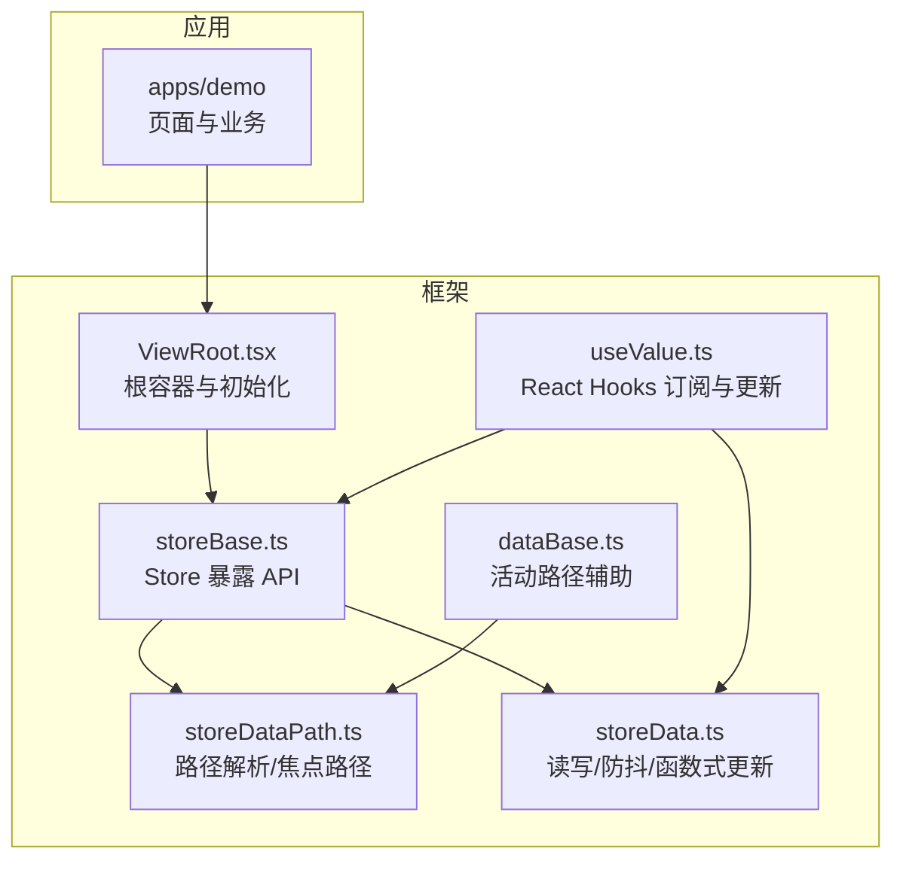
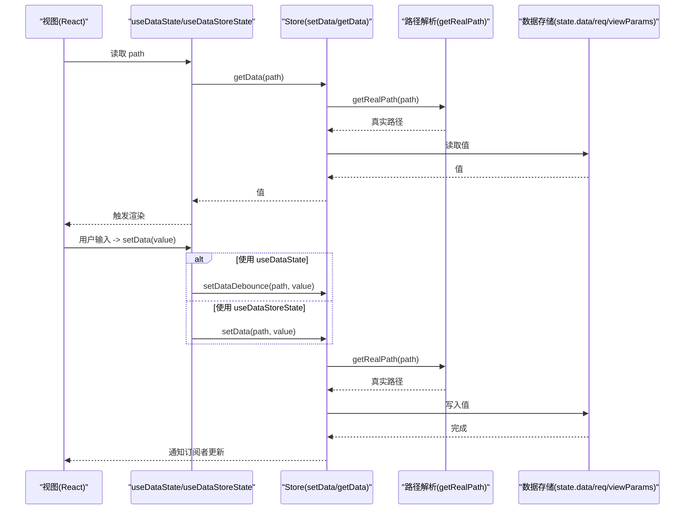
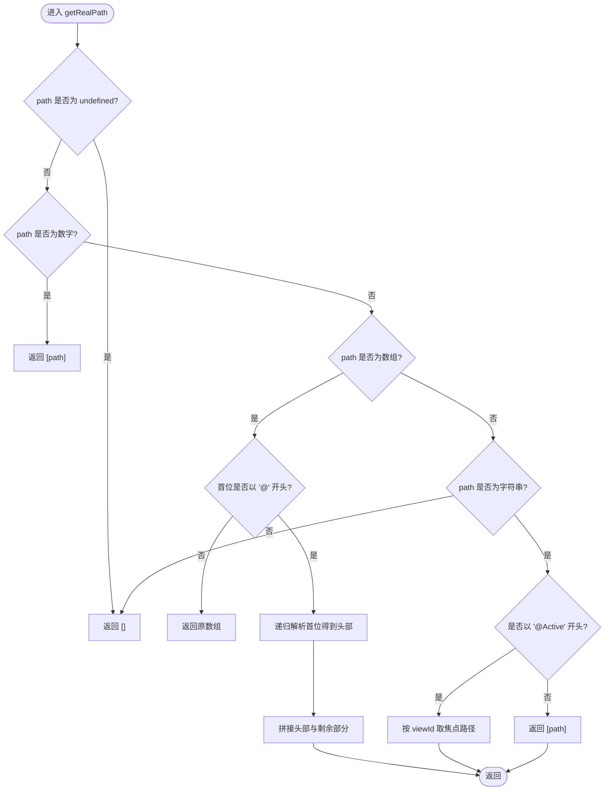
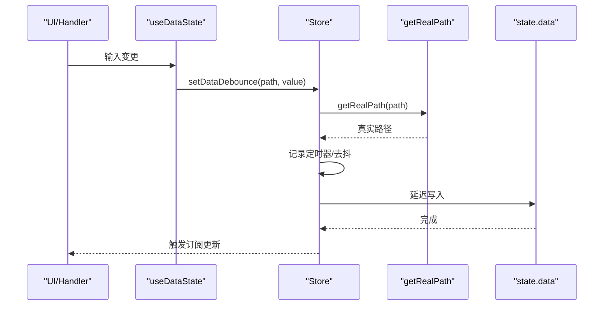
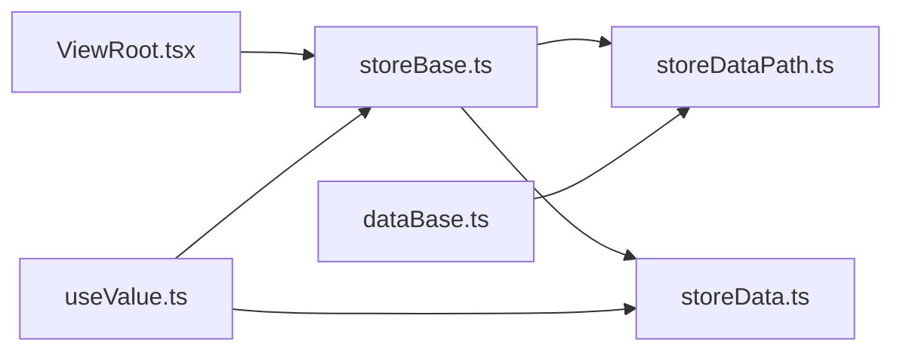

# 数据绑定

<cite>
**本文引用的文件**
- [ViewRoot.tsx](file://packages/framework/src/ViewRoot.tsx)
- [storeBase.ts](file://packages/framework/src/stores/store/storeBase.ts)
- [interface.ts](file://packages/framework/src/stores/store/interface.ts)
- [storeDataPath.ts](file://packages/framework/src/stores/store/utils/storeDataPath.ts)
- [storeData.ts](file://packages/framework/src/stores/store/utils/storeData.ts)
- [useValue.ts](file://packages/framework/src/stores/store/hooks/useValue.ts)
- [dataBase.ts](file://packages/framework/src/data/dataBase.ts)
- [table/index.tsx](file://apps/demo/src/pages/base/table/index.tsx)
- [table/data.tsx](file://apps/demo/src/pages/base/table/data.tsx)
- [table/view.tsx](file://apps/demo/src/pages/base/table/view.tsx)
- [form/handler.ts](file://apps/demo/src/pages/base/form/handler.ts)
</cite>

## 目录
1. [简介](#简介)
2. [项目结构](#项目结构)
3. [核心组件](#核心组件)
4. [架构总览](#架构总览)
5. [详细组件分析](#详细组件分析)
6. [依赖关系分析](#依赖关系分析)
7. [性能考虑](#性能考虑)
8. [故障排查指南](#故障排查指南)
9. [结论](#结论)
10. [附录：使用示例](#附录使用示例)

## 简介
本文件围绕框架的数据绑定机制，系统性阐述单向数据流与双向绑定的实现方式、路径解析与取值逻辑、特殊键 PathKey 与 ParamKey 的语义与用法、性能优化策略（防抖、批量更新、选择性渲染）、视图与数据的同步机制（实时更新与延迟更新），并提供表单、表格及复杂组件的实际使用示例。

## 项目结构
该仓库采用“应用 + 框架”的分层组织：
- 应用层 apps/demo：包含页面级 Demo，展示表单、表格等场景的数据绑定用法。
- 框架层 packages/framework：提供 ViewRoot、Store、数据绑定工具、Hooks、数据基类等核心能力。

图表来源
- [ViewRoot.tsx:10-48](file://packages/framework/src/ViewRoot.tsx#L10-L48)
- [storeBase.ts:35-57](file://packages/framework/src/stores/store/storeBase.ts#L35-L57)
- [storeDataPath.ts:13-74](file://packages/framework/src/stores/store/utils/storeDataPath.ts#L13-L74)
- [storeData.ts:57-146](file://packages/framework/src/stores/store/utils/storeData.ts#L57-L146)
- [useValue.ts:10-51](file://packages/framework/src/stores/store/hooks/useValue.ts#L10-L51)
- [dataBase.ts:4-15](file://packages/framework/src/data/dataBase.ts#L4-L15)

章节来源
- [ViewRoot.tsx:10-48](file://packages/framework/src/ViewRoot.tsx#L10-L48)
- [storeBase.ts:35-57](file://packages/framework/src/stores/store/storeBase.ts#L35-L57)

## 核心组件
- ViewRoot：创建并缓存 Store，注入上下文，触发视图与数据初始化，支持预渲染。
- Store（storeBase）：统一暴露 setData/getData/setDataDebounce 等数据操作 API，以及视图参数管理。
- 路径解析（storeDataPath）：将抽象路径（含 @Active/@Data/@Req/@View/@ViewParam/@Root 等）解析为真实路径；维护焦点行路径。
- 数据读写（storeData）：封装读取、写入、函数式更新与防抖更新。
- React Hooks（useValue）：提供 useDataState（本地缓存+防抖写回）、useDataStoreState（直接写回）、useData（只读订阅）。
- 数据基类（dataBase）：提供 active(viewId) 便捷方法生成活动路径引用。

章节来源
- [ViewRoot.tsx:10-48](file://packages/framework/src/ViewRoot.tsx#L10-L48)
- [storeBase.ts:35-57](file://packages/framework/src/stores/store/storeBase.ts#L35-L57)
- [storeDataPath.ts:13-74](file://packages/framework/src/stores/store/utils/storeDataPath.ts#L13-L74)
- [storeData.ts:57-146](file://packages/framework/src/stores/store/utils/storeData.ts#L57-L146)
- [useValue.ts:10-51](file://packages/framework/src/stores/store/hooks/useValue.ts#L10-L51)
- [dataBase.ts:4-15](file://packages/framework/src/data/dataBase.ts#L4-L15)

## 架构总览
数据绑定以 Store 为中心，视图通过 Hooks 订阅 store 中的特定路径，当数据变化时自动重渲染；用户输入可通过 Hooks 或 Handler 调用 setData/setDataDebounce 进行更新，路径解析器负责将抽象路径转换为实际存储位置。

图表来源
- [useValue.ts:10-51](file://packages/framework/src/stores/store/hooks/useValue.ts#L10-L51)
- [storeData.ts:57-146](file://packages/framework/src/stores/store/utils/storeData.ts#L57-L146)
- [storeDataPath.ts:13-74](file://packages/framework/src/stores/store/utils/storeDataPath.ts#L13-L74)

## 详细组件分析

### 路径解析与值获取
- 抽象路径支持：@Data、@Req、@View、@ViewParam、@Root、@Route、@Active。
- 数组路径首位若以系统头开头，会递归解析头部再拼接尾部。
- @Active:viewId 形式根据当前视图的焦点行 key 计算实际数据路径。
- getDataSource 根据路径首段映射到 store.req / store.view / store.viewParams / store.data。

图表来源
- [storeDataPath.ts:13-58](file://packages/framework/src/stores/store/utils/storeDataPath.ts#L13-L58)
- [storeDataPath.ts:63-74](file://packages/framework/src/stores/store/utils/storeDataPath.ts#L63-L74)

章节来源
- [storeDataPath.ts:13-74](file://packages/framework/src/stores/store/utils/storeDataPath.ts#L13-L74)

### PathKey 与 ParamKey 详解
- PathKey（数据路径前缀）：
  - @：系统头，用于标识特殊路径
  - @Active：焦点行数据
  - @Route：路由信息
  - @Data：数据区
  - @Req：请求配置区
  - @View：视图实例区
  - @ViewParam：视图参数区
  - @Root：根节点
- ParamKey（视图参数键）：
  - @：系统头
  - @Active：当前焦点键
  - @ActivePath：焦点行对应数据路径
  - @Select：选中项
  - @Open：控制开关
  - @All：返回所有参数

这些键在路径解析与视图参数管理中协同工作，确保跨视图联动与焦点定位。

章节来源
- [interface.ts:38-72](file://packages/framework/src/stores/store/interface.ts#L38-L72)
- [storeDataPath.ts:46-52](file://packages/framework/src/stores/store/utils/storeDataPath.ts#L46-L52)
- [storeDataPath.ts:84-116](file://packages/framework/src/stores/store/utils/storeDataPath.ts#L84-L116)

### 数据读写与更新模式
- 读取：getData(path) 经 getRealPath 解析后从对应区域取值。
- 写入：setData(path, value) 直接写入；setDataByFn(path, fn) 基于当前值进行函数式更新。
- 防抖：setDataDebounce(path, value, delay) 对高频输入进行节流合并，默认 300ms。
- 视图参数：setViewParamByKey/setViewParams 支持批量设置，并在设置 @Active 时自动计算并缓存 @ActivePath。

图表来源
- [useValue.ts:10-28](file://packages/framework/src/stores/store/hooks/useValue.ts#L10-L28)
- [storeData.ts:118-146](file://packages/framework/src/stores/store/utils/storeData.ts#L118-L146)
- [storeDataPath.ts:13-58](file://packages/framework/src/stores/store/utils/storeDataPath.ts#L13-L58)

章节来源
- [storeData.ts:57-146](file://packages/framework/src/stores/store/utils/storeData.ts#L57-L146)
- [storeBase.ts:35-57](file://packages/framework/src/stores/store/storeBase.ts#L35-L57)

### 视图与数据的同步机制
- 实时更新：useDataStoreState 直接调用 setData，立即持久化到 Store，适合需要即时落盘的场景。
- 延迟更新：useDataState 在本地保存临时状态，并通过 setDataDebounce 延迟写回，减少频繁更新带来的性能开销。
- 选择性渲染：通过精确订阅路径（如 useStore((s)=>s.getData(path))）仅影响相关组件，避免全量重绘。

章节来源
- [useValue.ts:10-51](file://packages/framework/src/stores/store/hooks/useValue.ts#L10-L51)

### 焦点行与跨视图联动
- 通过 @Active:viewId 可动态指向某视图的焦点行数据。
- 设置 @Active 时，框架自动计算并缓存 @ActivePath，后续读取 @Active 即可快速定位。
- 支持链式 @Active 引用，内部通过递归解析并限制深度防止循环。

章节来源
- [storeDataPath.ts:46-52](file://packages/framework/src/stores/store/utils/storeDataPath.ts#L46-L52)
- [storeDataPath.ts:84-116](file://packages/framework/src/stores/store/utils/storeDataPath.ts#L84-L116)
- [storeView.ts:86-127](file://packages/framework/src/stores/store/utils/storeView.ts#L86-L127)

## 依赖关系分析
- ViewRoot 依赖 createBaseStore 初始化 Store，并注入 StoreContext。
- Store 暴露 setData/getData/setDataDebounce 等方法，内部依赖路径解析与数据存取。
- Hooks 依赖 Store 提供的订阅与更新能力。
- 数据基类 dataBase.active 依赖视图路径工具生成活动路径引用。

图表来源
- [ViewRoot.tsx:10-48](file://packages/framework/src/ViewRoot.tsx#L10-L48)
- [storeBase.ts:35-57](file://packages/framework/src/stores/store/storeBase.ts#L35-L57)
- [storeDataPath.ts:13-74](file://packages/framework/src/stores/store/utils/storeDataPath.ts#L13-L74)
- [storeData.ts:57-146](file://packages/framework/src/stores/store/utils/storeData.ts#L57-L146)
- [useValue.ts:10-51](file://packages/framework/src/stores/store/hooks/useValue.ts#L10-L51)
- [dataBase.ts:4-15](file://packages/framework/src/data/dataBase.ts#L4-L15)

章节来源
- [ViewRoot.tsx:10-48](file://packages/framework/src/ViewRoot.tsx#L10-L48)
- [storeBase.ts:35-57](file://packages/framework/src/stores/store/storeBase.ts#L35-L57)

## 性能考虑
- 防抖处理：setDataDebounce 对同一路径的多次写入进行合并，降低 Store 更新频率与渲染压力。
- 批量更新：setViewParams 支持一次性合并多个视图参数，减少多次 zSet 触发的开销。
- 选择性渲染：通过精确路径订阅（useStore 选择器）仅更新受影响组件。
- 预渲染：ViewRoot 收集 PreRenderType 的视图 ID，提前渲染以提升交互响应。
- 函数式更新：setDataByFn 基于当前值进行增量更新，避免不必要的中间态。

章节来源
- [storeData.ts:118-146](file://packages/framework/src/stores/store/utils/storeData.ts#L118-L146)
- [storeView.ts:100-127](file://packages/framework/src/stores/store/utils/storeView.ts#L100-L127)
- [ViewRoot.tsx:20-48](file://packages/framework/src/ViewRoot.tsx#L20-L48)

## 故障排查指南
- 路径为空：getRealPath 返回空数组时不会执行读写，检查传入 path 是否正确，尤其是 @Active:viewId 的 viewId 是否存在。
- 焦点路径未生效：确认已设置 @Active 且视图存在；若链式 @Active，注意递归深度保护。
- 防抖不生效：检查是否重复调用同一路径的 setDataDebounce；确认 delay 设置合理。
- 视图参数未更新：使用 setViewParams 批量设置，或在 setViewParamByKey 中确保 key 正确。

章节来源
- [storeDataPath.ts:13-58](file://packages/framework/src/stores/store/utils/storeDataPath.ts#L13-L58)
- [storeDataPath.ts:84-116](file://packages/framework/src/stores/store/utils/storeDataPath.ts#L84-L116)
- [storeView.ts:86-127](file://packages/framework/src/stores/store/utils/storeView.ts#L86-L127)

## 结论
该数据绑定体系以 Store 为核心，结合路径解析与 Hooks 实现了高效的单向数据流与便捷的双向绑定体验。通过 PathKey/ParamKey 的约定，框架提供了强大的跨视图联动能力；配合防抖、批量更新与选择性渲染，兼顾了易用性与性能。

## 附录：使用示例

### 表单绑定（实时/延迟）
- 实时写入：在 Handler 中使用 setData(['form','name'], value) 直接更新。
- 延迟写入：在组件中使用 useDataState('form.name') 获得本地状态与防抖写入方法。

章节来源
- [form/handler.ts:3-15](file://apps/demo/src/pages/base/form/handler.ts#L3-L15)
- [useValue.ts:10-28](file://packages/framework/src/stores/store/hooks/useValue.ts#L10-L28)

### 表格数据绑定（列表与详情联动）
- 定义数据源：在 Data 中声明 mainTable/mainForm，并使用 DataBase.active(mainTable.id) 作为表单的初始路径，使表单聚焦于表格当前行。
- 视图绑定：在 View 中通过 dataId 关联数据源，表格与表单共享数据上下文。

章节来源
- [table/data.tsx:3-21](file://apps/demo/src/pages/base/table/data.tsx#L3-L21)
- [table/view.tsx:5-41](file://apps/demo/src/pages/base/table/view.tsx#L5-L41)
- [dataBase.ts:4-15](file://packages/framework/src/data/dataBase.ts#L4-L15)

### 复杂组件的数据交互（跨视图参数）
- 使用 setViewParams 批量设置视图参数，并在设置 @Active 时自动计算 @ActivePath。
- 通过 @Active:viewId 在任意位置读取焦点行数据，实现跨组件联动。

章节来源
- [storeView.ts:86-127](file://packages/framework/src/stores/store/utils/storeView.ts#L86-L127)
- [storeDataPath.ts:46-52](file://packages/framework/src/stores/store/utils/storeDataPath.ts#L46-L52)