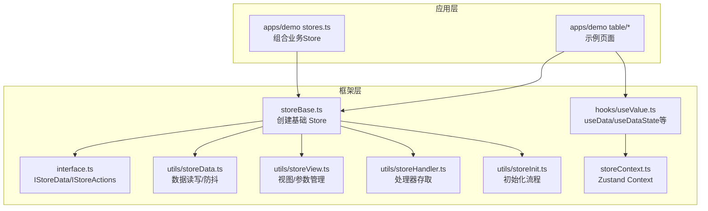
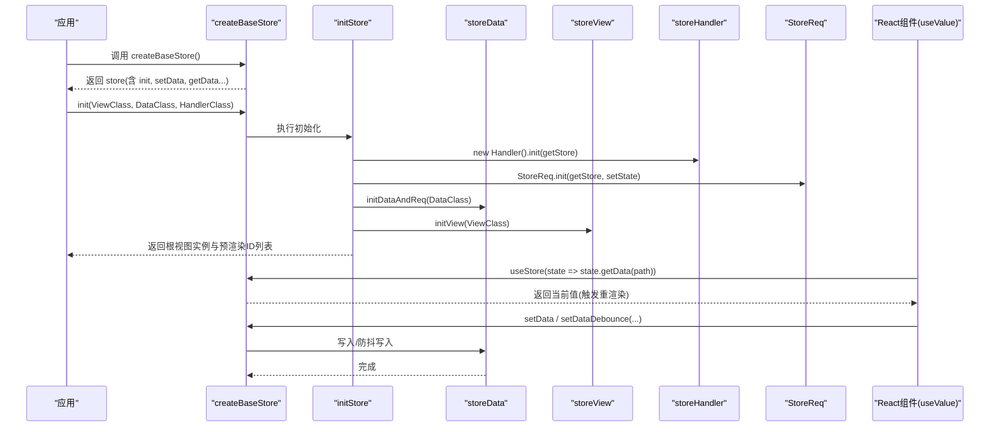
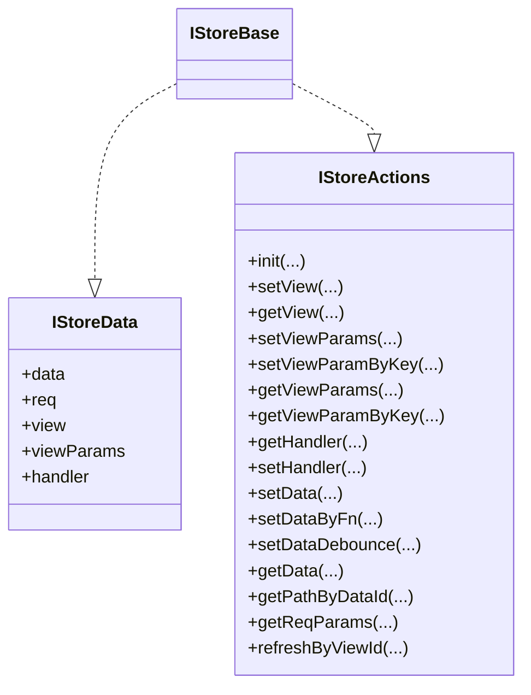
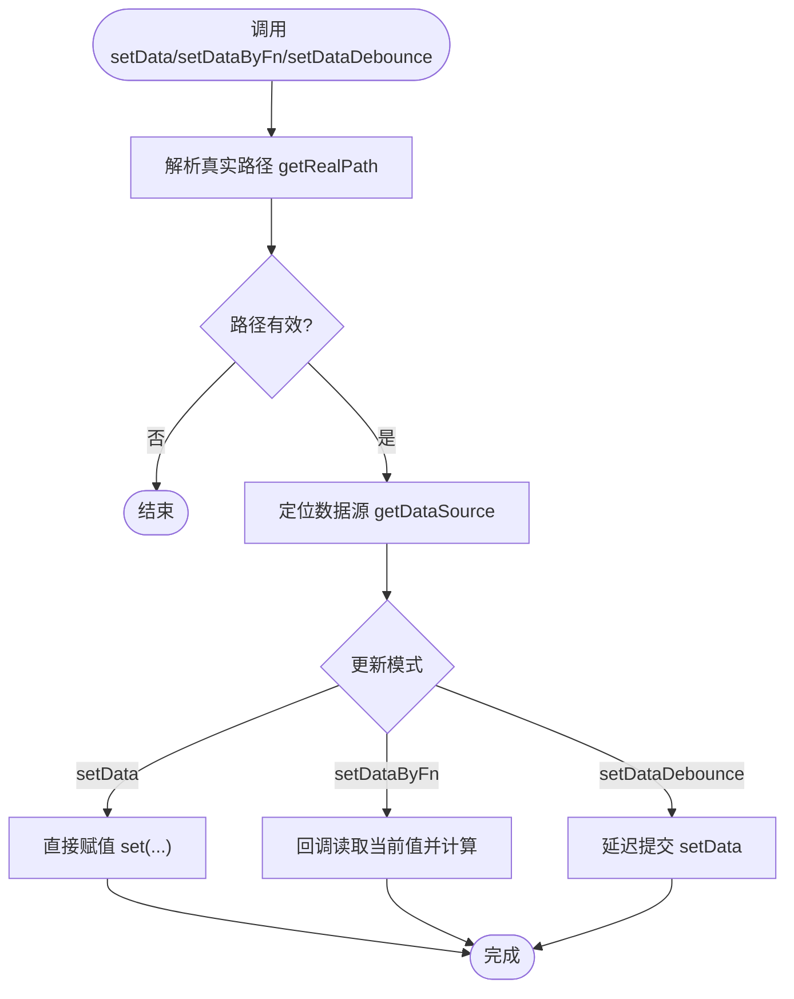
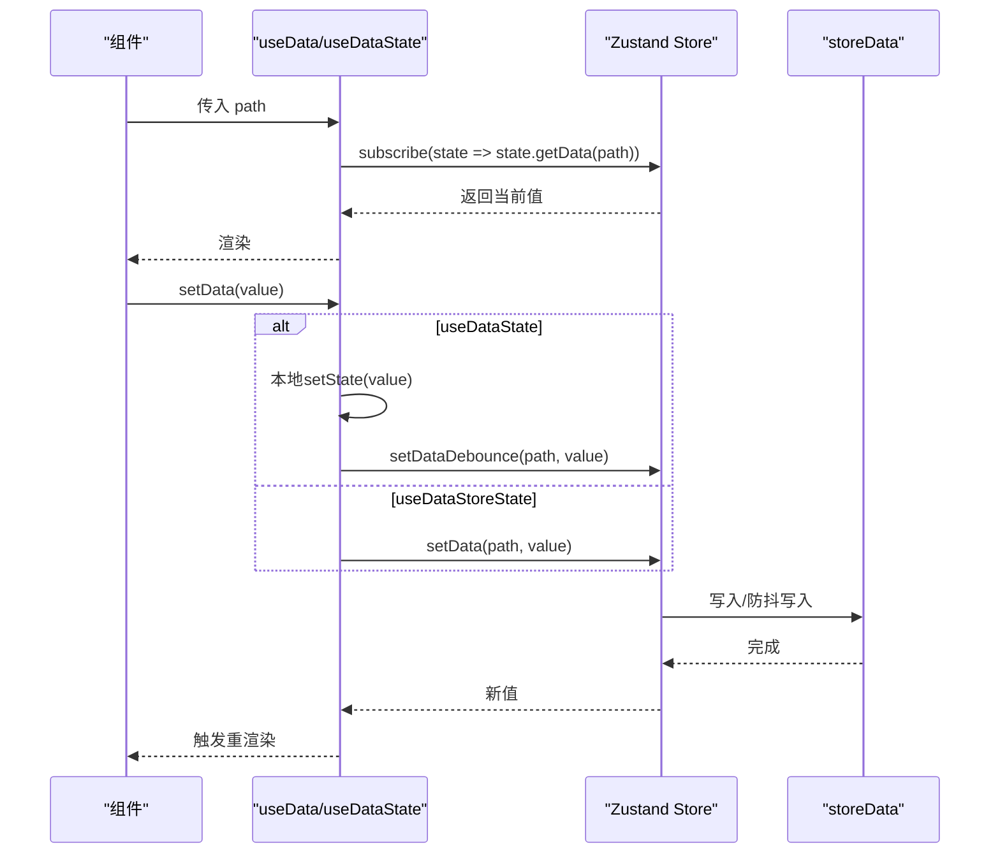
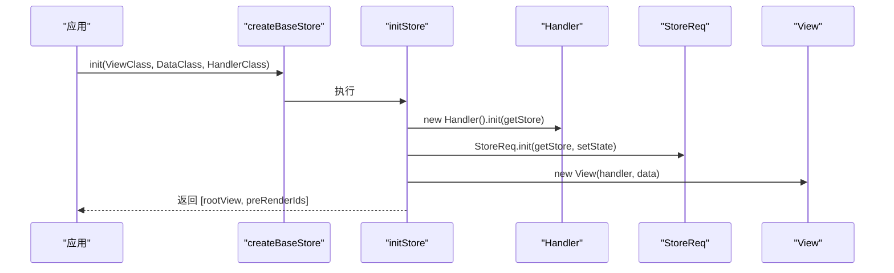
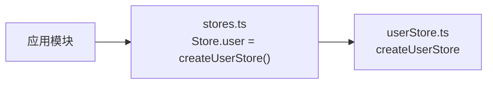
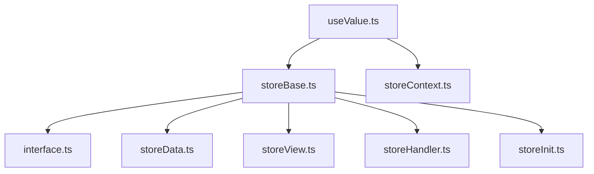

# 状态管理

<cite>
**本文引用的文件**
- [storeBase.ts](file://packages/framework/src/stores/store/storeBase.ts)
- [interface.ts](file://packages/framework/src/stores/store/interface.ts)
- [useValue.ts](file://packages/framework/src/stores/store/hooks/useValue.ts)
- [storeData.ts](file://packages/framework/src/stores/store/utils/storeData.ts)
- [storeView.ts](file://packages/framework/src/stores/store/utils/storeView.ts)
- [storeHandler.ts](file://packages/framework/src/stores/store/utils/storeHandler.ts)
- [storeInit.ts](file://packages/framework/src/stores/store/utils/storeInit.ts)
- [storeContext.ts](file://packages/framework/src/stores/store/storeContext.ts)
- [userStore.ts](file://packages/framework/src/stores/user/userStore.ts)
- [stores.ts](file://apps/demo/src/init/stores.ts)
- [handler.ts](file://apps/demo/src/pages/base/table/handler.ts)
- [data.tsx](file://apps/demo/src/pages/base/table/data.tsx)
- [view.tsx](file://apps/demo/src/pages/base/table/view.tsx)
</cite>

## 目录
1. [简介](#简介)
2. [项目结构](#项目结构)
3. [核心组件](#核心组件)
4. [架构总览](#架构总览)
5. [详细组件分析](#详细组件分析)
6. [依赖关系分析](#依赖关系分析)
7. [性能考虑](#性能考虑)
8. [故障排查指南](#故障排查指南)
9. [结论](#结论)
10. [附录](#附录)

## 简介
本文件系统性地梳理基于 Zustand 的状态管理实现，覆盖 Store 的创建、状态定义与更新机制；详解 IStoreData 接口的 data、req、view、viewParams、handler 的作用与用法；说明状态订阅与响应式更新的原理，包括 useValue Hook 的使用方式与性能优化策略；总结复杂状态处理与持久化方案的最佳实践，并提供实际示例与调试技巧。

## 项目结构
该仓库采用“框架包 + Demo 应用”的分层组织：
- 框架层（packages/framework）提供统一的 Store 基础能力、视图/数据/处理器抽象、工具方法与 Hooks。
- 应用层（apps/demo）通过初始化模块组合业务 Store，并在页面中演示使用。

图表来源
- [storeBase.ts:18-57](file://packages/framework/src/stores/store/storeBase.ts#L18-L57)
- [interface.ts:74-132](file://packages/framework/src/stores/store/interface.ts#L74-L132)
- [useValue.ts:1-63](file://packages/framework/src/stores/store/hooks/useValue.ts#L1-L63)
- [storeData.ts:57-147](file://packages/framework/src/stores/store/utils/storeData.ts#L57-L147)
- [storeView.ts:7-128](file://packages/framework/src/stores/store/utils/storeView.ts#L7-L128)
- [storeHandler.ts:1-24](file://packages/framework/src/stores/store/utils/storeHandler.ts#L1-L24)
- [storeInit.ts:14-37](file://packages/framework/src/stores/store/utils/storeInit.ts#L14-L37)
- [storeContext.ts:1-7](file://packages/framework/src/stores/store/storeContext.ts#L1-L7)
- [stores.ts:1-11](file://apps/demo/src/init/stores.ts#L1-L11)

章节来源
- [storeBase.ts:18-57](file://packages/framework/src/stores/store/storeBase.ts#L18-L57)
- [stores.ts:1-11](file://apps/demo/src/init/stores.ts#L1-L11)

## 核心组件
- 基础 Store 工厂：createBaseStore 基于 Zustand + immer 创建统一 Store，暴露数据、请求、视图、参数、处理器等能力。
- 接口定义：IStoreData 描述状态结构，IStoreActions 描述操作方法，IStoreBase 为二者组合。
- 数据工具：getData/setData/setDataByFn/setDataDebounce 提供路径化读写与防抖更新。
- 视图工具：initView/getView/setView/getViewParams/setViewParams 等管理视图实例与参数。
- 处理器工具：getHandler/setHandler 在 Store 中按 viewId 存取处理器实例。
- 初始化流程：initStore 负责组装 Handler/Data/View，并启动请求系统。
- React 集成：useValue 系列 Hook 提供细粒度订阅与本地缓存更新。

章节来源
- [storeBase.ts:18-57](file://packages/framework/src/stores/store/storeBase.ts#L18-L57)
- [interface.ts:74-132](file://packages/framework/src/stores/store/interface.ts#L74-L132)
- [storeData.ts:57-147](file://packages/framework/src/stores/store/utils/storeData.ts#L57-L147)
- [storeView.ts:7-128](file://packages/framework/src/stores/store/utils/storeView.ts#L7-L128)
- [storeHandler.ts:1-24](file://packages/framework/src/stores/store/utils/storeHandler.ts#L1-L24)
- [storeInit.ts:14-37](file://packages/framework/src/stores/store/utils/storeInit.ts#L14-L37)
- [useValue.ts:1-63](file://packages/framework/src/stores/store/hooks/useValue.ts#L1-L63)

## 架构总览
下图展示了 Store 的创建、初始化、数据与视图管理以及 React 订阅的整体流程。

图表来源
- [storeBase.ts:18-57](file://packages/framework/src/stores/store/storeBase.ts#L18-L57)
- [storeInit.ts:14-37](file://packages/framework/src/stores/store/utils/storeInit.ts#L14-L37)
- [storeData.ts:57-147](file://packages/framework/src/stores/store/utils/storeData.ts#L57-L147)
- [storeView.ts:7-128](file://packages/framework/src/stores/store/utils/storeView.ts#L7-L128)
- [useValue.ts:1-63](file://packages/framework/src/stores/store/hooks/useValue.ts#L1-L63)

## 详细组件分析

### Store 创建与状态定义
- 使用 Zustand 的 create 配合 immer 中间件，以不可变方式更新状态。
- 初始状态包含 data、req、view、viewParams、handler 五个核心字段。
- 暴露 init、视图操作、数据处理、请求刷新等方法，统一封装到 Store 中。

图表来源
- [interface.ts:74-132](file://packages/framework/src/stores/store/interface.ts#L74-L132)

章节来源
- [storeBase.ts:18-57](file://packages/framework/src/stores/store/storeBase.ts#L18-L57)
- [interface.ts:74-132](file://packages/framework/src/stores/store/interface.ts#L74-L132)

### IStoreData 属性详解
- data：全局数据容器，支持路径访问与函数式更新，用于存放业务数据与表单模型等。
- req：数据请求元信息存储，记录各数据源的请求配置与状态，便于统一刷新与参数获取。
- view：视图实例树，以 id 为键保存 ViewBase 派生实例，便于跨组件共享与上下文传递。
- viewParams：视图级参数集合，支持批量设置与单项设置，内置焦点 Active 与 ActivePath 联动。
- handler：视图处理器实例集合，按 viewId 存取，便于在视图中调用业务逻辑。

章节来源
- [interface.ts:74-85](file://packages/framework/src/stores/store/interface.ts#L74-L85)
- [storeView.ts:62-128](file://packages/framework/src/stores/store/utils/storeView.ts#L62-L128)
- [storeHandler.ts:1-24](file://packages/framework/src/stores/store/utils/storeHandler.ts#L1-L24)

### 状态更新机制与数据流
- 直接更新：setData 通过路径写入，内部根据真实路径解析与数据源定位进行赋值。
- 函数式更新：setDataByFn 接收回调，基于当前快照计算新值，避免竞态。
- 防抖更新：setDataDebounce 对频繁输入场景进行节流，减少不必要的重渲染。
- 视图参数：setViewParams/setViewParamByKey 支持合并或覆盖，Active 自动推导 ActivePath。
- 处理器存取：getHandler/setHandler 将处理器实例挂载到 Store，供视图或数据层调用。

图表来源
- [storeData.ts:57-147](file://packages/framework/src/stores/store/utils/storeData.ts#L57-L147)

章节来源
- [storeData.ts:57-147](file://packages/framework/src/stores/store/utils/storeData.ts#L57-L147)
- [storeView.ts:78-128](file://packages/framework/src/stores/store/utils/storeView.ts#L78-L128)
- [storeHandler.ts:1-24](file://packages/framework/src/stores/store/utils/storeHandler.ts#L1-L24)

### 状态订阅与响应式更新（useValue Hook）
- useData：基于 Zustand selector 精确订阅指定 path 的数据变化，最小化重渲染。
- useDataState：本地缓存 + 防抖同步 Store，适合高频输入场景，先本地即时反馈再落库。
- useDataStoreState：直接订阅 Store 数据并立即写回，适合需要强一致性的场景。
- useDataById：根据数据 id 反查对应路径并订阅，简化表格行数据绑定。

图表来源
- [useValue.ts:1-63](file://packages/framework/src/stores/store/hooks/useValue.ts#L1-L63)
- [storeData.ts:57-147](file://packages/framework/src/stores/store/utils/storeData.ts#L57-L147)

章节来源
- [useValue.ts:1-63](file://packages/framework/src/stores/store/hooks/useValue.ts#L1-L63)
- [storeData.ts:57-147](file://packages/framework/src/stores/store/utils/storeData.ts#L57-L147)

### 初始化流程与视图装配
- initStore 负责：
  - 首次加载时创建 Handler/Data/View 实例，并初始化请求系统与视图树。
  - 若已存在视图树则直接复用，避免重复初始化。
  - 返回根视图实例与需要预渲染的 ID 列表。

图表来源
- [storeInit.ts:14-37](file://packages/framework/src/stores/store/utils/storeInit.ts#L14-L37)
- [storeBase.ts:18-57](file://packages/framework/src/stores/store/storeBase.ts#L18-L57)

章节来源
- [storeInit.ts:14-37](file://packages/framework/src/stores/store/utils/storeInit.ts#L14-L37)
- [storeBase.ts:18-57](file://packages/framework/src/stores/store/storeBase.ts#L18-L57)

### 业务 Store 示例与集成
- 用户 Store：基于 Zustand + immer 创建泛型 Store，管理用户信息与菜单。
- 应用集成：在 demo 应用中通过静态类聚合多个 Store，便于集中管理与注入。

图表来源
- [userStore.ts:1-22](file://packages/framework/src/stores/user/userStore.ts#L1-L22)
- [stores.ts:1-11](file://apps/demo/src/init/stores.ts#L1-L11)

章节来源
- [userStore.ts:1-22](file://packages/framework/src/stores/user/userStore.ts#L1-L22)
- [stores.ts:1-11](file://apps/demo/src/init/stores.ts#L1-L11)

### 实战示例与最佳实践
- 复杂状态处理
  - 使用 setDataByFn 进行基于旧值的增量更新，避免并发覆盖。
  - 使用 setDataDebounce 处理高频输入（如搜索框），降低渲染压力。
  - 使用 viewParams 管理视图级交互状态（如分页、筛选、焦点）。
- 状态持久化建议
  - 将关键状态（如用户信息、菜单）序列化后存入 localStorage/sessionStorage，在应用启动时恢复。
  - 对大对象或频繁变更的数据不建议持久化，以免 IO 成为瓶颈。
  - 结合版本迁移策略，兼容历史数据结构变更。
- 调试技巧
  - 在 Handler 中打印 data/req 快照，快速定位问题。
  - 使用性能追踪工具统计 getData 耗时，识别热点路径。
  - 利用 viewParams 的 Active/ActivePath 联动特性，辅助调试表格行选择。

章节来源
- [handler.ts:1-29](file://apps/demo/src/pages/base/table/handler.ts#L1-L29)
- [data.tsx:1-21](file://apps/demo/src/pages/base/table/data.tsx#L1-L21)
- [view.tsx:1-41](file://apps/demo/src/pages/base/table/view.tsx#L1-L41)

## 依赖关系分析
- 低耦合高内聚：storeBase 仅依赖工具函数与接口，不感知具体业务。
- 工具函数职责清晰：storeData/storeView/storeHandler 分别专注数据、视图、处理器。
- React 解耦：useValue 通过 Context 获取 Store，组件只关心数据与动作。
- 无循环依赖：初始化流程单向驱动，避免环状引用。

图表来源
- [storeBase.ts:18-57](file://packages/framework/src/stores/store/storeBase.ts#L18-L57)
- [interface.ts:74-132](file://packages/framework/src/stores/store/interface.ts#L74-L132)
- [storeData.ts:57-147](file://packages/framework/src/stores/store/utils/storeData.ts#L57-L147)
- [storeView.ts:7-128](file://packages/framework/src/stores/store/utils/storeView.ts#L7-L128)
- [storeHandler.ts:1-24](file://packages/framework/src/stores/store/utils/storeHandler.ts#L1-L24)
- [storeInit.ts:14-37](file://packages/framework/src/stores/store/utils/storeInit.ts#L14-L37)
- [useValue.ts:1-63](file://packages/framework/src/stores/store/hooks/useValue.ts#L1-L63)
- [storeContext.ts:1-7](file://packages/framework/src/stores/store/storeContext.ts#L1-L7)

## 性能考虑
- 使用 immer 中间件进行不可变更新，避免深拷贝开销。
- 使用 selector 精确订阅，减少无关重渲染。
- 高频输入使用 setDataDebounce 降低更新频率。
- 合理拆分 viewParams，避免单一对象过大导致 diff 成本上升。
- 对大数据集采用分页与虚拟滚动，减少一次性渲染节点数。

## 故障排查指南
- 常见问题
  - 未确认的 viewId：检查 getView 传入的 viewId 是否为空字符串或未定义。
  - 数据请求不存在：检查 initDataAndReq 是否成功构建父子关系，确认 parentIds/childIds。
  - 防抖未生效：确认 setDataDebounce 的路径唯一性，避免重复 key 冲突。
- 定位方法
  - 在 Handler 中打印 data/req 快照，对比预期结构。
  - 使用性能追踪统计 getData 耗时，定位慢路径。
  - 通过 viewParams.Active/ActivePath 联动验证焦点是否正确计算。

章节来源
- [storeView.ts:39-45](file://packages/framework/src/stores/store/utils/storeView.ts#L39-L45)
- [storeData.ts:9-54](file://packages/framework/src/stores/store/utils/storeData.ts#L9-L54)
- [handler.ts:1-29](file://apps/demo/src/pages/base/table/handler.ts#L1-L29)

## 结论
本状态管理体系以 Zustand + immer 为核心，围绕 IStoreData 的五大维度（data、req、view、viewParams、handler）构建了统一、可扩展的状态模型。通过工具函数与 Hooks 的组合，实现了高效、可维护的状态读写与响应式更新。结合最佳实践与调试手段，可在复杂业务场景中保持清晰的代码结构与良好的性能表现。

## 附录
- 常用 API 速查
  - 数据：getData、setData、setDataByFn、setDataDebounce
  - 视图：init、setView、getView、setViewParams、setViewParamByKey、getViewParams、getViewParamByKey
  - 处理器：getHandler、setHandler
  - 请求：getReqParams、refreshByViewId
- 参考路径
  - [storeBase.ts:18-57](file://packages/framework/src/stores/store/storeBase.ts#L18-L57)
  - [interface.ts:74-132](file://packages/framework/src/stores/store/interface.ts#L74-L132)
  - [useValue.ts:1-63](file://packages/framework/src/stores/store/hooks/useValue.ts#L1-L63)
  - [storeData.ts:57-147](file://packages/framework/src/stores/store/utils/storeData.ts#L57-L147)
  - [storeView.ts:7-128](file://packages/framework/src/stores/store/utils/storeView.ts#L7-L128)
  - [storeHandler.ts:1-24](file://packages/framework/src/stores/store/utils/storeHandler.ts#L1-L24)
  - [storeInit.ts:14-37](file://packages/framework/src/stores/store/utils/storeInit.ts#L14-L37)
  - [userStore.ts:1-22](file://packages/framework/src/stores/user/userStore.ts#L1-L22)
  - [stores.ts:1-11](file://apps/demo/src/init/stores.ts#L1-L11)
  - [handler.ts:1-29](file://apps/demo/src/pages/base/table/handler.ts#L1-L29)
  - [data.tsx:1-21](file://apps/demo/src/pages/base/table/data.tsx#L1-L21)
  - [view.tsx:1-41](file://apps/demo/src/pages/base/table/view.tsx#L1-L41)