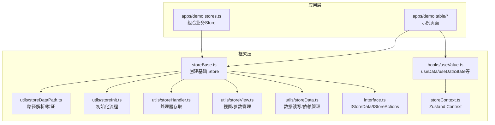
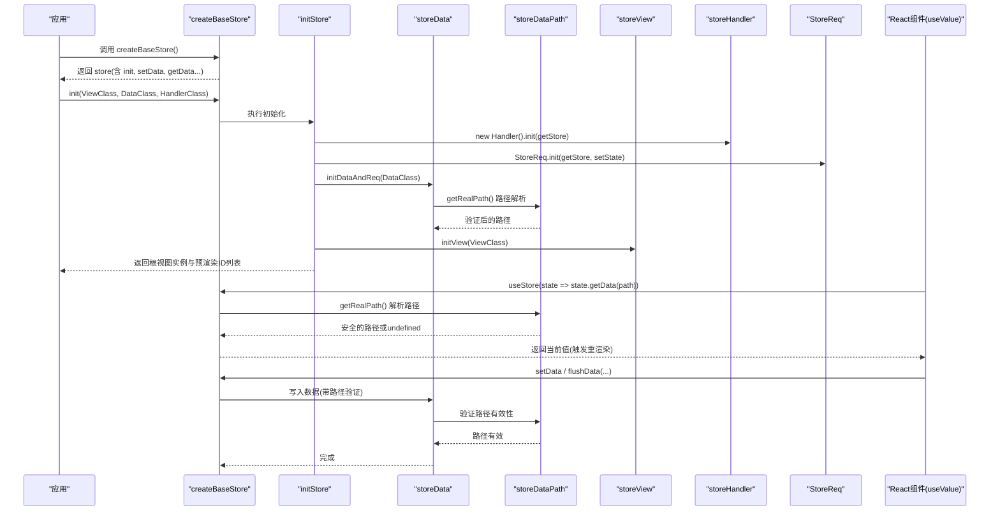
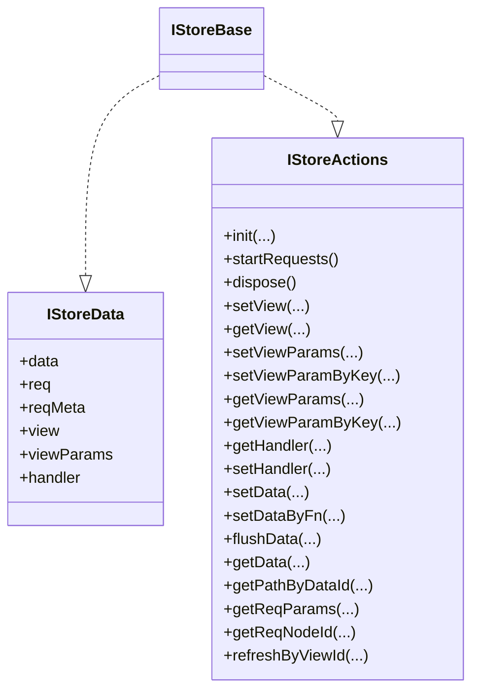
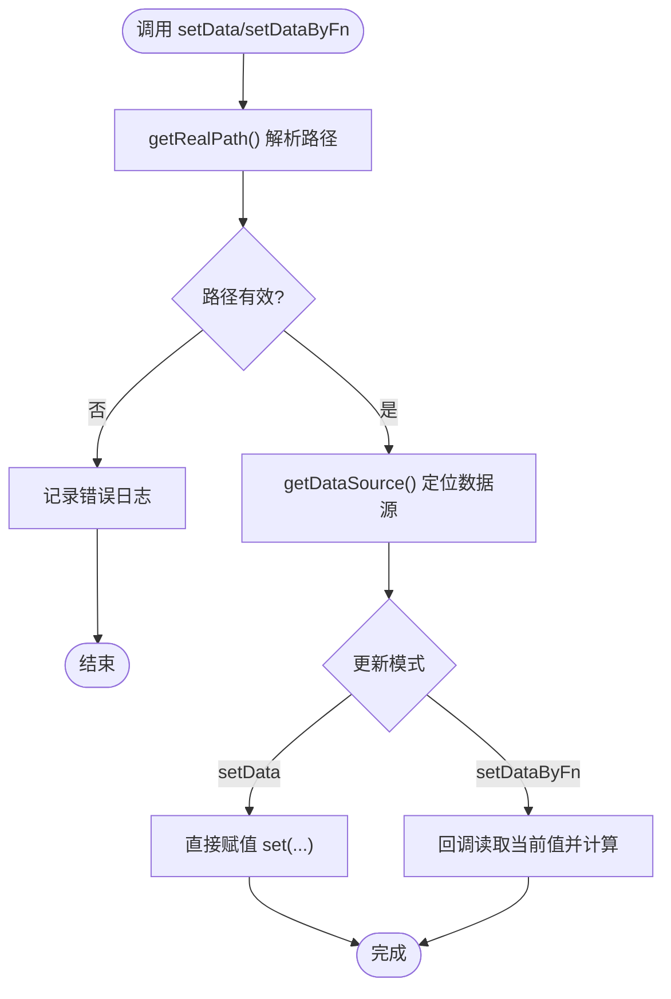
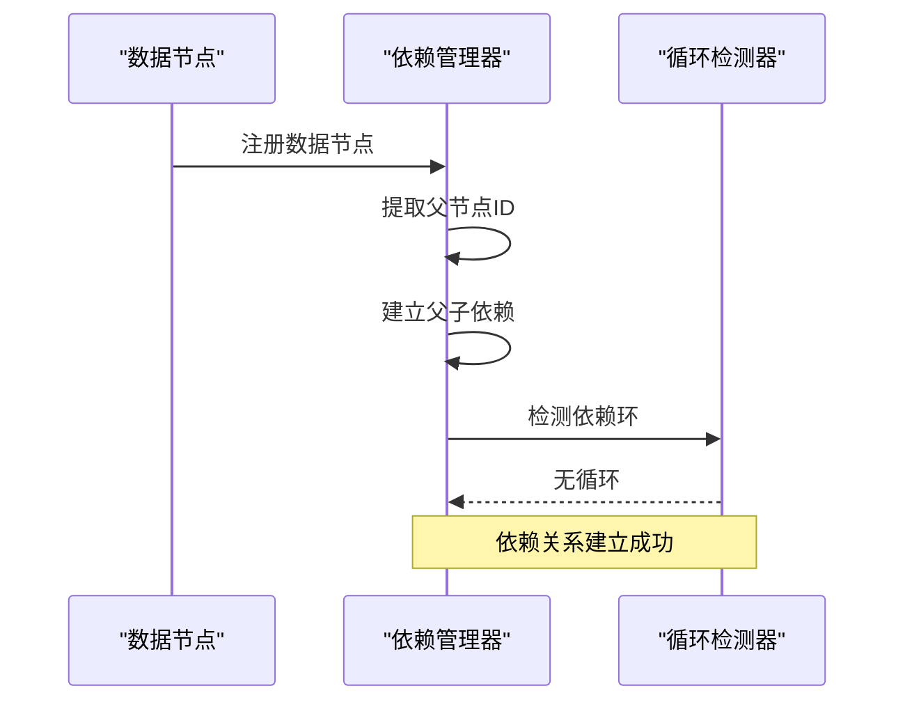
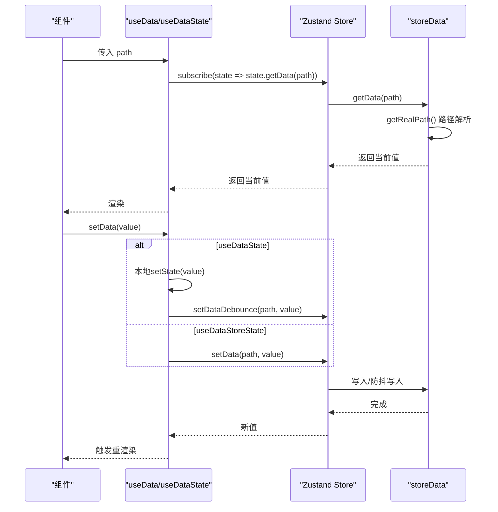
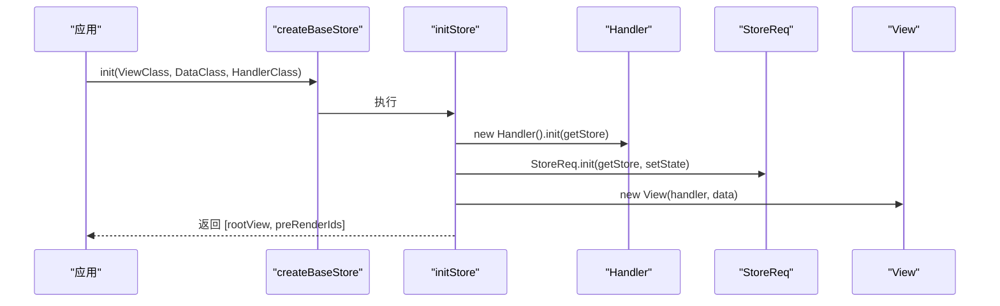
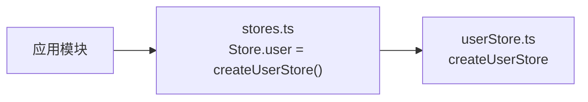
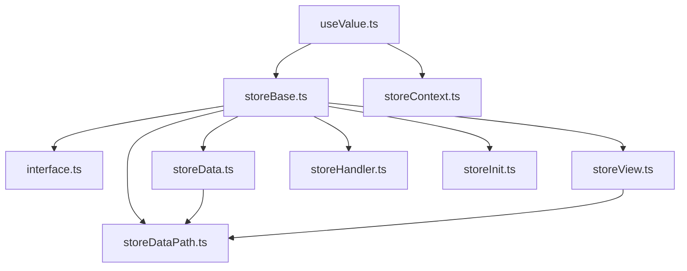

# 状态管理

<cite>
**本文引用的文件**
- [storeBase.ts](file://packages/framework/src/stores/store/storeBase.ts)
- [interface.ts](file://packages/framework/src/stores/store/interface.ts)
- [useValue.ts](file://packages/framework/src/stores/store/hooks/useValue.ts)
- [storeData.ts](file://packages/framework/src/stores/store/utils/storeData.ts)
- [storeView.ts](file://packages/framework/src/stores/store/utils/storeView.ts)
- [storeHandler.ts](file://packages/framework/src/stores/store/utils/storeHandler.ts)
- [storeInit.ts](file://packages/framework/src/stores/store/utils/storeInit.ts)
- [storeContext.ts](file://packages/framework/src/stores/store/storeContext.ts)
- [storeDataPath.ts](file://packages/framework/src/stores/store/utils/storeDataPath.ts)
- [userStore.ts](file://packages/framework/src/stores/user/userStore.ts)
- [stores.ts](file://apps/demo/src/init/stores.ts)
- [handler.ts](file://apps/demo/src/pages/base/table/handler.ts)
- [data.tsx](file://apps/demo/src/pages/base/table/data.tsx)
- [view.tsx](file://apps/demo/src/pages/base/table/view.tsx)
</cite>

## 更新摘要
**所做更改**
- 增强了Store数据管理系统，包括改进的错误处理、路径验证和依赖管理
- 新增了独立的路径解析工具模块 storeDataPath.ts
- 移除了旧的setDataDebounce函数，改用PageRuntime统一管理防抖逻辑
- 增强了数据请求的父子依赖关系管理和循环检测
- 改进了性能追踪和错误日志记录

## 目录
1. [简介](#简介)
2. [项目结构](#项目结构)
3. [核心组件](#核心组件)
4. [架构总览](#架构总览)
5. [详细组件分析](#详细组件分析)
6. [依赖关系分析](#依赖关系分析)
7. [性能考虑](#性能考虑)
8. [故障排查指南](#故障排查指南)
9. [结论](#结论)
10. [附录](#附录)

## 简介
本文件系统性地梳理基于 Zustand 的状态管理实现，覆盖 Store 的创建、状态定义与更新机制；详解 IStoreData 接口的 data、req、view、viewParams、handler 的作用与用法；说明状态订阅与响应式更新的原理，包括 useValue Hook 的使用方式与性能优化策略；总结复杂状态处理与持久化方案的最佳实践，并提供实际示例与调试技巧。

**更新** 本次更新重点增强了Store数据管理系统，引入了更健壮的路径验证、错误处理和依赖管理机制，同时优化了性能监控和调试能力。

## 项目结构
该仓库采用"框架包 + Demo 应用"的分层组织：
- 框架层（packages/framework）提供统一的 Store 基础能力、视图/数据/处理器抽象、工具方法与 Hooks。
- 应用层（apps/demo）通过初始化模块组合业务 Store，并在页面中演示使用。

```mermaid
graph TB
subgraph "框架层"
A["storeBase.ts<br/>创建基础 Store"]
B["interface.ts<br/>IStoreData/IStoreActions"]
C["hooks/useValue.ts<br/>useData/useDataState等"]
D["utils/storeData.ts<br/>数据读写/依赖管理"]
E["utils/storeView.ts<br/>视图/参数管理"]
F["utils/storeHandler.ts<br/>处理器存取"]
G["utils/storeInit.ts<br/>初始化流程"]
H["storeContext.ts<br/>Zustand Context"]
I["utils/storeDataPath.ts<br/>路径解析/验证"]
end
subgraph "应用层"
X["apps/demo stores.ts<br/>组合业务Store"]
Y["apps/demo table/*<br/>示例页面"]
end
A --> B
A --> D
A --> E
A --> F
A --> G
A --> I
C --> H
X --> A
Y --> C
Y --> A
```

**图表来源**
- [storeBase.ts:20-98](file://packages/framework/src/stores/store/storeBase.ts#L20-L98)
- [interface.ts:102-171](file://packages/framework/src/stores/store/interface.ts#L102-L171)
- [useValue.ts:1-67](file://packages/framework/src/stores/store/hooks/useValue.ts#L1-L67)
- [storeData.ts:1-207](file://packages/framework/src/stores/store/utils/storeData.ts#L1-L207)
- [storeView.ts:1-156](file://packages/framework/src/stores/store/utils/storeView.ts#L1-L156)
- [storeHandler.ts:1-25](file://packages/framework/src/stores/store/utils/storeHandler.ts#L1-L25)
- [storeInit.ts:14-37](file://packages/framework/src/stores/store/utils/storeInit.ts#L14-L37)
- [storeContext.ts:1-7](file://packages/framework/src/stores/store/storeContext.ts#L1-L7)
- [storeDataPath.ts:1-231](file://packages/framework/src/stores/store/utils/storeDataPath.ts#L1-L231)
- [stores.ts:1-11](file://apps/demo/src/init/stores.ts#L1-L11)

## 核心组件
- 基础 Store 工厂：createBaseStore 基于 Zustand + immer 创建统一 Store，暴露数据、请求、视图、参数、处理器等能力。
- 接口定义：IStoreData 描述状态结构，IStoreActions 描述操作方法，IStoreBase 为二者组合。
- 数据工具：getData/setData/setDataByFn 提供路径化读写，集成强大的依赖管理和错误处理。
- 视图工具：initView/getView/setView/getViewParams/setViewParams 等管理视图实例与参数。
- 处理器工具：getHandler/setHandler 在 Store 中按 viewId 存取处理器实例。
- 初始化流程：initStore 负责组装 Handler/Data/View，并启动请求系统。
- React 集成：useValue 系列 Hook 提供细粒度订阅与本地缓存更新。
- **新增** 路径解析工具：独立的 storeDataPath.ts 模块提供路径验证、引用解析和性能优化。

**章节来源**
- [storeBase.ts:20-98](file://packages/framework/src/stores/store/storeBase.ts#L20-L98)
- [interface.ts:102-171](file://packages/framework/src/stores/store/interface.ts#L102-L171)
- [storeData.ts:1-207](file://packages/framework/src/stores/store/utils/storeData.ts#L1-L207)
- [storeView.ts:1-156](file://packages/framework/src/stores/store/utils/storeView.ts#L1-L156)
- [storeHandler.ts:1-25](file://packages/framework/src/stores/store/utils/storeHandler.ts#L1-L25)
- [storeInit.ts:14-37](file://packages/framework/src/stores/store/utils/storeInit.ts#L14-L37)
- [useValue.ts:1-67](file://packages/framework/src/stores/store/hooks/useValue.ts#L1-L67)
- [storeDataPath.ts:1-231](file://packages/framework/src/stores/store/utils/storeDataPath.ts#L1-L231)

## 架构总览
下图展示了 Store 的创建、初始化、数据与视图管理以及 React 订阅的整体流程。

```mermaid
sequenceDiagram
participant App as "应用"
participant Base as "createBaseStore"
participant Init as "initStore"
participant Data as "storeData"
participant Path as "storeDataPath"
participant View as "storeView"
participant Handler as "storeHandler"
participant Req as "StoreReq"
participant UI as "React组件(useValue)"
App->>Base : 调用 createBaseStore()
Base-->>App : 返回 store(含 init, setData, getData...)
App->>Base : init(ViewClass, DataClass, HandlerClass)
Base->>Init : 执行初始化
Init->>Handler : new Handler().init(getStore)
Init->>Req : StoreReq.init(getStore, setState)
Init->>Data : initDataAndReq(DataClass)
Data->>Path : getRealPath() 路径解析
Path-->>Data : 验证后的路径
Init->>View : initView(ViewClass)
Init-->>App : 返回根视图实例与预渲染ID列表
UI->>Base : useStore(state => state.getData(path))
Base->>Path : getRealPath() 解析路径
Path-->>Base : 安全的路径或undefined
Base-->>UI : 返回当前值(触发重渲染)
UI->>Base : setData / flushData(...)
Base->>Data : 写入数据(带路径验证)
Data->>Path : 验证路径有效性
Path-->>Data : 路径有效
Data-->>Base : 完成
```

**图表来源**
- [storeBase.ts:20-98](file://packages/framework/src/stores/store/storeBase.ts#L20-L98)
- [storeInit.ts:14-37](file://packages/framework/src/stores/store/utils/storeInit.ts#L14-L37)
- [storeData.ts:78-207](file://packages/framework/src/stores/store/utils/storeData.ts#L78-L207)
- [storeDataPath.ts:29-92](file://packages/framework/src/stores/store/utils/storeDataPath.ts#L29-L92)
- [storeView.ts:1-156](file://packages/framework/src/stores/store/utils/storeView.ts#L1-L156)
- [useValue.ts:1-67](file://packages/framework/src/stores/store/hooks/useValue.ts#L1-L67)

## 详细组件分析

### Store 创建与状态定义
- 使用 Zustand 的 create 配合 immer 中间件，以不可变方式更新状态。
- 初始状态包含 data、req、reqMeta、view、viewParams、handler 六个核心字段。
- 暴露 init、视图操作、数据处理、请求刷新等方法，统一封装到 Store 中。
- **更新** 现在集成了 PageRuntime 来管理页面级别的运行时状态，包括防抖计时器和请求生命周期。

```mermaid
classDiagram
class IStoreData {
+data
+req
+reqMeta
+view
+viewParams
+handler
}
class IStoreActions {
+init(...)
+startRequests()
+dispose()
+setView(...)
+getView(...)
+setViewParams(...)
+setViewParamByKey(...)
+getViewParams(...)
+getViewParamByKey(...)
+getHandler(...)
+setHandler(...)
+setData(...)
+setDataByFn(...)
+flushData(...)
+getData(...)
+getPathByDataId(...)
+getReqParams(...)
+getReqNodeId(...)
+refreshByViewId(...)
}
class IStoreBase
IStoreBase ..|> IStoreData
IStoreBase ..|> IStoreActions
```

**图表来源**
- [interface.ts:102-171](file://packages/framework/src/stores/store/interface.ts#L102-L171)

**章节来源**
- [storeBase.ts:20-98](file://packages/framework/src/stores/store/storeBase.ts#L20-L98)
- [interface.ts:102-171](file://packages/framework/src/stores/store/interface.ts#L102-L171)

### IStoreData 属性详解
- data：全局数据容器，支持路径访问与函数式更新，用于存放业务数据与表单模型等。
- req：数据请求元信息存储，记录各数据源的请求配置与状态，便于统一刷新与参数获取。
- **新增** reqMeta：数据请求运行状态存储，与请求声明分离，避免覆盖参数声明。
- view：视图实例树，以 id 为键保存 ViewBase 派生实例，便于跨组件共享与上下文传递。
- viewParams：视图级参数集合，支持批量设置与单项设置，内置焦点 Active 与 ActivePath 联动。
- handler：视图处理器实例集合，按 viewId 存取，便于在视图中调用业务逻辑。

**章节来源**
- [interface.ts:102-115](file://packages/framework/src/stores/store/interface.ts#L102-L115)
- [storeView.ts:66-156](file://packages/framework/src/stores/store/utils/storeView.ts#L66-L156)
- [storeHandler.ts:1-25](file://packages/framework/src/stores/store/utils/storeHandler.ts#L1-L25)

### 增强的数据管理与路径验证
**更新** Store数据管理得到了显著增强，包括更好的错误处理、路径验证和依赖管理：

- **路径解析与验证**：通过独立的 storeDataPath.ts 模块提供强大的路径解析功能，支持 @Active、@Row 等特殊引用。
- **依赖关系管理**：自动建立数据节点间的父子依赖关系，支持循环检测和去重。
- **错误处理**：完善的错误日志记录和警告机制，帮助开发者快速定位问题。
- **性能优化**：引入路径解析缓存和引用级索引缓存，显著提升高频访问场景的性能。

```mermaid
flowchart TD
Start(["调用 setData/setDataByFn"]) --> Resolve["getRealPath() 解析路径"]
Resolve --> Validate{"路径有效?"}
Validate -- 否 --> LogError["记录错误日志"]
LogError --> End(["结束"])
Validate -- 是 --> Locate["getDataSource() 定位数据源"]
Locate --> Update{"更新模式"}
Update -- setData --> Direct["直接赋值 set(...)"]
Update -- setDataByFn --> Fn["回调读取当前值并计算"]
Direct --> Done(["完成"])
Fn --> Done
```

**图表来源**
- [storeData.ts:148-207](file://packages/framework/src/stores/store/utils/storeData.ts#L148-L207)
- [storeDataPath.ts:29-92](file://packages/framework/src/stores/store/utils/storeDataPath.ts#L29-L92)

**章节来源**
- [storeData.ts:1-207](file://packages/framework/src/stores/store/utils/storeData.ts#L1-L207)
- [storeDataPath.ts:1-231](file://packages/framework/src/stores/store/utils/storeDataPath.ts#L1-L231)

### 数据请求依赖管理
**更新** 新的依赖管理系统提供了更健壮的请求依赖处理：

- **自动依赖发现**：从 params.path 声明中提取被依赖的数据节点 ID。
- **双向登记**：建立父子依赖的双向关系，支持 parentIds 和 childIds。
- **循环检测**：使用 DFS 算法检测依赖环，防止请求链相互等待。
- **容错处理**：对不存在的父节点或自依赖进行安全处理。

```mermaid
sequenceDiagram
participant Data as "数据节点"
participant Dep as "依赖管理器"
participant Cycle as "循环检测器"
Data->>Dep : 注册数据节点
Dep->>Dep : 提取父节点ID
Dep->>Dep : 建立父子依赖
Dep->>Cycle : 检测依赖环
Cycle-->>Dep : 无循环
Note over Dep,Cycle : 依赖关系建立成功
```

**图表来源**
- [storeData.ts:28-124](file://packages/framework/src/stores/store/utils/storeData.ts#L28-L124)

**章节来源**
- [storeData.ts:28-124](file://packages/framework/src/stores/store/utils/storeData.ts#L28-L124)

### 状态订阅与响应式更新（useValue Hook）
- useData：基于 Zustand selector 精确订阅指定 path 的数据变化，最小化重渲染。
- useDataState：本地缓存 + 防抖同步 Store，适合高频输入场景，先本地即时反馈再落库。
- useDataStoreState：直接订阅 Store 数据并立即写回，适合需要强一致性的场景。
- useDataById：根据数据 id 反查对应路径并订阅，简化表格行数据绑定。

```mermaid
sequenceDiagram
participant Comp as "组件"
participant Hook as "useData/useDataState"
participant Store as "Zustand Store"
participant Utils as "storeData"
Comp->>Hook : 传入 path
Hook->>Store : subscribe(state => state.getData(path))
Store->>Utils : getData(path)
Utils->>Utils : getRealPath() 路径解析
Utils-->>Store : 返回当前值
Store-->>Hook : 返回当前值
Hook-->>Comp : 渲染
Comp->>Hook : setData(value)
alt useDataState
Hook->>Hook : 本地setState(value)
Hook->>Store : setDataDebounce(path, value)
else useDataStoreState
Hook->>Store : setData(path, value)
end
Store->>Utils : 写入/防抖写入
Utils-->>Store : 完成
Store-->>Hook : 新值
Hook-->>Comp : 触发重渲染
```

**图表来源**
- [useValue.ts:1-67](file://packages/framework/src/stores/store/hooks/useValue.ts#L1-L67)
- [storeData.ts:131-207](file://packages/framework/src/stores/store/utils/storeData.ts#L131-L207)

**章节来源**
- [useValue.ts:1-67](file://packages/framework/src/stores/store/hooks/useValue.ts#L1-L67)
- [storeData.ts:131-207](file://packages/framework/src/stores/store/utils/storeData.ts#L131-L207)

### 初始化流程与视图装配
- initStore 负责：
  - 首次加载时创建 Handler/Data/View 实例，并初始化请求系统与视图树。
  - 若已存在视图树则直接复用，避免重复初始化。
  - 返回根视图实例与需要预渲染的 ID 列表。

```mermaid
sequenceDiagram
participant App as "应用"
participant Base as "createBaseStore"
participant Init as "initStore"
participant H as "Handler"
participant R as "StoreReq"
participant V as "View"
App->>Base : init(ViewClass, DataClass, HandlerClass)
Base->>Init : 执行
Init->>H : new Handler().init(getStore)
Init->>R : StoreReq.init(getStore, setState)
Init->>V : new View(handler, data)
Init-->>App : 返回 [rootView, preRenderIds]
```

**图表来源**
- [storeInit.ts:14-37](file://packages/framework/src/stores/store/utils/storeInit.ts#L14-L37)
- [storeBase.ts:20-98](file://packages/framework/src/stores/store/storeBase.ts#L20-L98)

**章节来源**
- [storeInit.ts:14-37](file://packages/framework/src/stores/store/utils/storeInit.ts#L14-L37)
- [storeBase.ts:20-98](file://packages/framework/src/stores/store/storeBase.ts#L20-L98)

### 业务 Store 示例与集成
- 用户 Store：基于 Zustand + immer 创建泛型 Store，管理用户信息与菜单。
- 应用集成：在 demo 应用中通过静态类聚合多个 Store，便于集中管理与注入。

```mermaid
graph LR
U["userStore.ts<br/>createUserStore<User,Menu>"]
S["stores.ts<br/>Store.user = createUserStore()"]
App["应用模块"]
App --> S
S --> U
```

**图表来源**
- [userStore.ts:1-22](file://packages/framework/src/stores/user/userStore.ts#L1-L22)
- [stores.ts:1-11](file://apps/demo/src/init/stores.ts#L1-L11)

**章节来源**
- [userStore.ts:1-22](file://packages/framework/src/stores/user/userStore.ts#L1-L22)
- [stores.ts:1-11](file://apps/demo/src/init/stores.ts#L1-L11)

### 实战示例与最佳实践
- 复杂状态处理
  - 使用 setDataByFn 进行基于旧值的增量更新，避免并发覆盖。
  - 使用 flushData 提交防抖待写数据，替代旧的 setDataDebounce。
  - 使用 viewParams 管理视图级交互状态（如分页、筛选、焦点）。
- 状态持久化建议
  - 将关键状态（如用户信息、菜单）序列化后存入 localStorage/sessionStorage，在应用启动时恢复。
  - 对大对象或频繁变更的数据不建议持久化，以免 IO 成为瓶颈。
  - 结合版本迁移策略，兼容历史数据结构变更。
- 调试技巧
  - 在 Handler 中打印 data/req 快照，快速定位问题。
  - 使用性能追踪工具统计 getData 耗时，识别热点路径。
  - 利用 viewParams 的 Active/ActivePath 联动特性，辅助调试表格行选择。

**章节来源**
- [handler.ts:1-33](file://apps/demo/src/pages/base/table/handler.ts#L1-L33)
- [data.tsx:1-35](file://apps/demo/src/pages/base/table/data.tsx#L1-L35)
- [view.tsx:1-41](file://apps/demo/src/pages/base/table/view.tsx#L1-L41)

## 依赖关系分析
- 低耦合高内聚：storeBase 仅依赖工具函数与接口，不感知具体业务。
- 工具函数职责清晰：storeData/storeView/storeHandler 分别专注数据、视图、处理器。
- **新增** 路径解析独立：storeDataPath 专门处理路径解析和验证，提高代码可维护性。
- React 解耦：useValue 通过 Context 获取 Store，组件只关心数据与动作。
- 无循环依赖：初始化流程单向驱动，避免环状引用。

```mermaid
graph TB
Base["storeBase.ts"]
IF["interface.ts"]
SD["storeData.ts"]
SV["storeView.ts"]
SH["storeHandler.ts"]
SI["storeInit.ts"]
UV["useValue.ts"]
SC["storeContext.ts"]
SP["storeDataPath.ts"]
Base --> IF
Base --> SD
Base --> SV
Base --> SH
Base --> SI
Base --> SP
UV --> SC
UV --> Base
SD --> SP
SV --> SP
```

**图表来源**
- [storeBase.ts:20-98](file://packages/framework/src/stores/store/storeBase.ts#L20-L98)
- [interface.ts:102-171](file://packages/framework/src/stores/store/interface.ts#L102-L171)
- [storeData.ts:1-207](file://packages/framework/src/stores/store/utils/storeData.ts#L1-L207)
- [storeView.ts:1-156](file://packages/framework/src/stores/store/utils/storeView.ts#L1-L156)
- [storeHandler.ts:1-25](file://packages/framework/src/stores/store/utils/storeHandler.ts#L1-L25)
- [storeInit.ts:14-37](file://packages/framework/src/stores/store/utils/storeInit.ts#L14-L37)
- [useValue.ts:1-67](file://packages/framework/src/stores/store/hooks/useValue.ts#L1-L67)
- [storeContext.ts:1-7](file://packages/framework/src/stores/store/storeContext.ts#L1-L7)
- [storeDataPath.ts:1-231](file://packages/framework/src/stores/store/utils/storeDataPath.ts#L1-L231)

## 性能考虑
- 使用 immer 中间件进行不可变更新，避免深拷贝开销。
- 使用 selector 精确订阅，减少无关重渲染。
- **新增** 路径解析缓存：字面量路径解析结果缓存，避免高频订阅场景重复解析。
- **新增** 引用级索引缓存：WeakMap 缓存数组索引映射，提升 @Active/@Row 解析性能。
- 合理拆分 viewParams，避免单一对象过大导致 diff 成本上升。
- 对大数据集采用分页与虚拟滚动，减少一次性渲染节点数。
- **更新** 使用 PageRuntime 统一管理防抖逻辑，避免跨页面状态污染。

## 故障排查指南
- 常见问题
  - 未确认的 viewId：检查 getView 传入的 viewId 是否为空字符串或未定义。
  - 数据请求不存在：检查 initDataAndReq 是否成功构建父子关系，确认 parentIds/childIds。
  - **新增** 路径解析失败：检查 getRealPath 返回值是否为 undefined，确认引用路径是否正确。
  - **新增** 依赖循环：查看循环检测日志，检查 dependsOn 声明是否存在循环依赖。
- 定位方法
  - 在 Handler 中打印 data/req 快照，对比预期结构。
  - 使用性能追踪统计 getData 耗时，定位慢路径。
  - 通过 viewParams.Active/ActivePath 联动验证焦点是否正确计算。
  - **新增** 检查路径解析缓存命中率，优化高频访问路径。

**章节来源**
- [storeView.ts:43-49](file://packages/framework/src/stores/store/utils/storeView.ts#L43-L49)
- [storeData.ts:78-124](file://packages/framework/src/stores/store/utils/storeData.ts#L78-L124)
- [storeDataPath.ts:29-92](file://packages/framework/src/stores/store/utils/storeDataPath.ts#L29-L92)
- [handler.ts:1-33](file://apps/demo/src/pages/base/table/handler.ts#L1-L33)

## 结论
本状态管理体系以 Zustand + immer 为核心，围绕 IStoreData 的六大维度（data、req、reqMeta、view、viewParams、handler）构建了统一、可扩展的状态模型。**更新** 本次增强引入了独立的路径解析模块、健壮的依赖管理和完善的错误处理机制，同时优化了性能监控和调试能力。通过工具函数与 Hooks 的组合，实现了高效、可维护的状态读写与响应式更新。结合最佳实践与调试手段，可在复杂业务场景中保持清晰的代码结构与良好的性能表现。

## 附录
- 常用 API 速查
  - 数据：getData、setData、setDataByFn、flushData
  - 视图：init、setView、getView、setViewParams、setViewParamByKey、getViewParams、getViewParamByKey
  - 处理器：getHandler、setHandler
  - 请求：getReqParams、getReqNodeId、refreshByViewId
  - **新增** 路径：getRealPath、getActivePath、getArrayIndexByKey
- 参考路径
  - [storeBase.ts:20-98](file://packages/framework/src/stores/store/storeBase.ts#L20-L98)
  - [interface.ts:102-171](file://packages/framework/src/stores/store/interface.ts#L102-L171)
  - [useValue.ts:1-67](file://packages/framework/src/stores/store/hooks/useValue.ts#L1-L67)
  - [storeData.ts:1-207](file://packages/framework/src/stores/store/utils/storeData.ts#L1-L207)
  - [storeView.ts:1-156](file://packages/framework/src/stores/store/utils/storeView.ts#L1-L156)
  - [storeHandler.ts:1-25](file://packages/framework/src/stores/store/utils/storeHandler.ts#L1-L25)
  - [storeInit.ts:14-37](file://packages/framework/src/stores/store/utils/storeInit.ts#L14-L37)
  - [storeDataPath.ts:1-231](file://packages/framework/src/stores/store/utils/storeDataPath.ts#L1-L231)
  - [userStore.ts:1-22](file://packages/framework/src/stores/user/userStore.ts#L1-L22)
  - [stores.ts:1-11](file://apps/demo/src/init/stores.ts#L1-L11)
  - [handler.ts:1-33](file://apps/demo/src/pages/base/table/handler.ts#L1-L33)
  - [data.tsx:1-35](file://apps/demo/src/pages/base/table/data.tsx#L1-L35)
  - [view.tsx:1-41](file://apps/demo/src/pages/base/table/view.tsx#L1-L41)