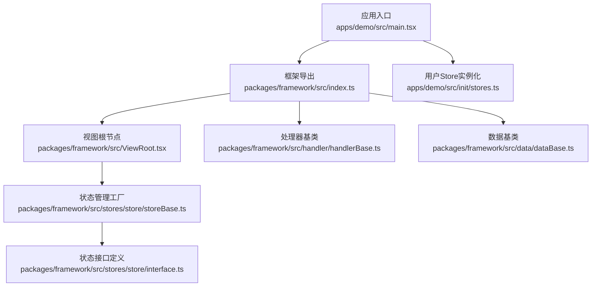
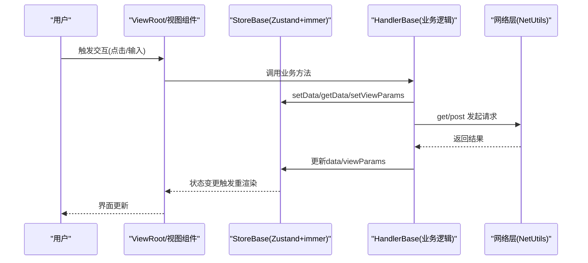
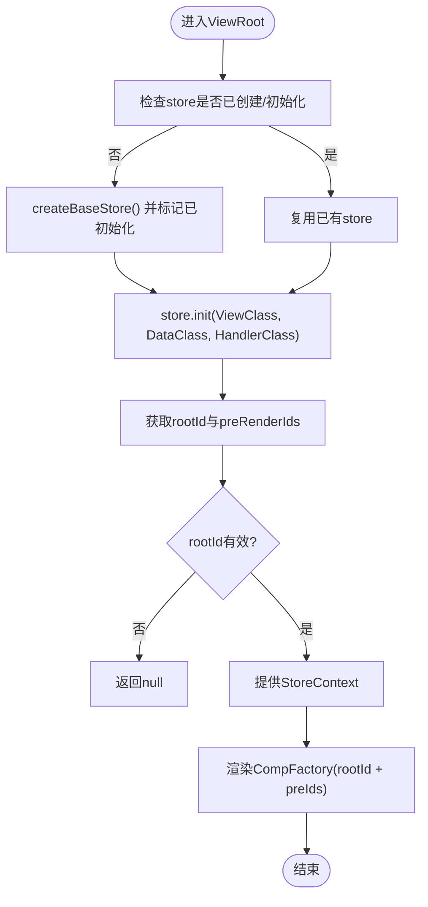
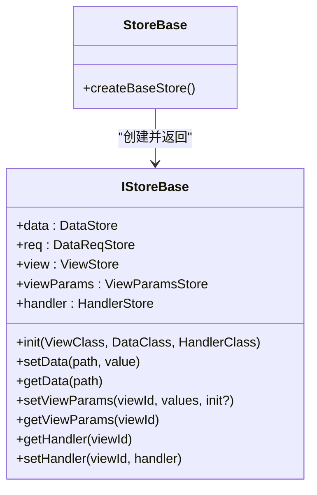
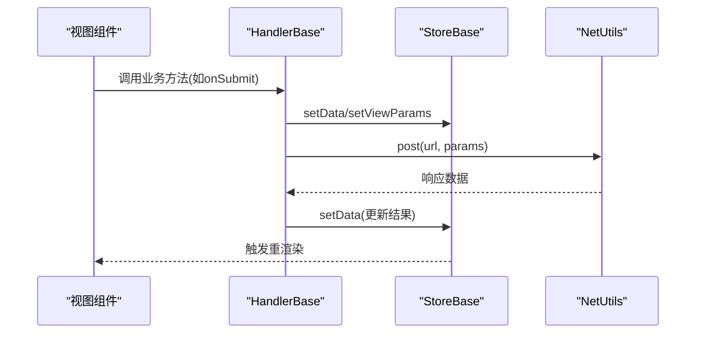
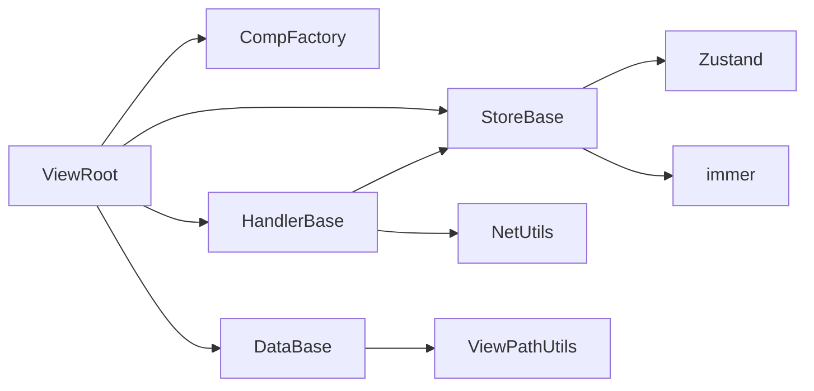

# MVC架构模式

<cite>
**本文引用的文件**
- [packages/framework/src/ViewRoot.tsx](file://packages/framework/src/ViewRoot.tsx)
- [packages/framework/src/handler/handlerBase.ts](file://packages/framework/src/handler/handlerBase.ts)
- [packages/framework/src/stores/store/storeBase.ts](file://packages/framework/src/stores/store/storeBase.ts)
- [packages/framework/src/stores/store/interface.ts](file://packages/framework/src/stores/store/interface.ts)
- [packages/framework/src/data/dataBase.ts](file://packages/framework/src/data/dataBase.ts)
- [packages/framework/src/index.ts](file://packages/framework/src/index.ts)
- [apps/demo/src/main.tsx](file://apps/demo/src/main.tsx)
- [apps/demo/src/init/stores.ts](file://apps/demo/src/init/stores.ts)
</cite>

## 目录
1. [简介](#简介)
2. [项目结构](#项目结构)
3. [核心组件](#核心组件)
4. [架构总览](#架构总览)
5. [详细组件分析](#详细组件分析)
6. [依赖关系分析](#依赖关系分析)
7. [性能考量](#性能考量)
8. [故障排查指南](#故障排查指南)
9. [结论](#结论)
10. [附录：自定义Model/View/Controller示例路径](#附录自定义modelviewcontroller示例路径)

## 简介
本文件面向WMS Web项目的MVC架构模式，系统性阐述Model-View-Controller分层设计理念与实现。重点说明：
- ViewRoot作为视图层根节点的职责与渲染机制
- StoreBase（基于Zustand+Immer）作为状态管理层的实现机制
- HandlerBase处理业务逻辑、网络请求与视图交互的方式
- 数据在三层之间的流转过程：用户操作从View到Handler，再到Store更新，最终触发View重新渲染
- 如何基于框架扩展自定义的Model、View和Controller
- 最佳实践与常见陷阱

## 项目结构
- 应用入口位于 apps/demo/src/main.tsx，负责路由与全局配置挂载
- 框架核心位于 packages/framework/src，提供ViewRoot、HandlerBase、DataBase以及基于Zustand的状态管理
- 应用通过 @jl/framework 暴露的API创建用户级store并初始化

**图表来源**
- [apps/demo/src/main.tsx:11-31](file://apps/demo/src/main.tsx#L11-L31)
- [packages/framework/src/index.ts:12-30](file://packages/framework/src/index.ts#L12-L30)
- [packages/framework/src/ViewRoot.tsx:10-46](file://packages/framework/src/ViewRoot.tsx#L10-L46)
- [packages/framework/src/handler/handlerBase.ts:10-90](file://packages/framework/src/handler/handlerBase.ts#L10-L90)
- [packages/framework/src/data/dataBase.ts:4-15](file://packages/framework/src/data/dataBase.ts#L4-L15)
- [packages/framework/src/stores/store/storeBase.ts:18-36](file://packages/framework/src/stores/store/storeBase.ts#L18-L36)
- [packages/framework/src/stores/store/interface.ts:74-132](file://packages/framework/src/stores/store/interface.ts#L74-L132)
- [apps/demo/src/init/stores.ts:5-8](file://apps/demo/src/init/stores.ts#L5-L8)

**章节来源**
- [apps/demo/src/main.tsx:11-31](file://apps/demo/src/main.tsx#L11-L31)
- [packages/framework/src/index.ts:12-30](file://packages/framework/src/index.ts#L12-L30)
- [apps/demo/src/init/stores.ts:5-8](file://apps/demo/src/init/stores.ts#L5-L8)

## 核心组件
- ViewRoot：视图层根节点，负责创建并缓存Store、初始化View/Data/Handler、注入Store上下文、渲染CompFactory树
- StoreBase：基于Zustand+immer的状态工厂，提供init、setData/getData、视图参数管理、handler注册等能力
- HandlerBase：业务逻辑基类，封装网络请求、数据读写、视图参数设置、弹出框/抽屉控制器获取
- DataBase：数据模型抽象基类，提供活动路径等通用能力

**章节来源**
- [packages/framework/src/ViewRoot.tsx:10-46](file://packages/framework/src/ViewRoot.tsx#L10-L46)
- [packages/framework/src/stores/store/storeBase.ts:18-36](file://packages/framework/src/stores/store/storeBase.ts#L18-L36)
- [packages/framework/src/handler/handlerBase.ts:10-90](file://packages/framework/src/handler/handlerBase.ts#L10-L90)
- [packages/framework/src/data/dataBase.ts:4-15](file://packages/framework/src/data/dataBase.ts#L4-L15)

## 架构总览
下图展示MVC各层职责与交互关系：ViewRoot驱动Store初始化，HandlerBase执行业务逻辑并通过Store读写数据，Store使用Zustand+immer进行不可变更新，View通过CompFactory订阅Store变化完成重渲染。

**图表来源**
- [packages/framework/src/ViewRoot.tsx:10-46](file://packages/framework/src/ViewRoot.tsx#L10-L46)
- [packages/framework/src/stores/store/storeBase.ts:18-36](file://packages/framework/src/stores/store/storeBase.ts#L18-L36)
- [packages/framework/src/handler/handlerBase.ts:18-57](file://packages/framework/src/handler/handlerBase.ts#L18-L57)

## 详细组件分析

### ViewRoot：视图根节点与生命周期
- 职责
  - 创建并缓存Store实例，避免StrictMode重复创建
  - 调用Store.init(ViewClass, DataClass, HandlerClass)完成三件套初始化
  - 将Store注入StoreContext，供子组件消费
  - 根据rootId与预渲染ID列表渲染CompFactory树
- 关键点
  - 使用useRef确保store仅创建一次
  - 使用useMemo计算useStore、rootId、preIds，减少重复计算
  - 当rootId无效或useStore未就绪时返回null，保证安全渲染

**图表来源**
- [packages/framework/src/ViewRoot.tsx:10-46](file://packages/framework/src/ViewRoot.tsx#L10-L46)

**章节来源**
- [packages/framework/src/ViewRoot.tsx:10-46](file://packages/framework/src/ViewRoot.tsx#L10-L46)

### StoreBase：状态管理层实现机制
- 职责
  - 基于Zustand create工厂创建IStoreBase实例
  - 使用immer中间件支持不可变更新
  - 提供init、setData/getData、setViewParams/getViewParams、getHandler/setHandler等方法
  - 统一管理data、req、view、viewParams、handler等状态域
- 关键点
  - init接收ViewClass、DataClass、HandlerClass，完成视图、数据、处理器绑定
  - setDataDebounce用于高频更新的防抖写入
  - 通过工具函数封装对state的读写，便于扩展与测试

**图表来源**
- [packages/framework/src/stores/store/storeBase.ts:18-36](file://packages/framework/src/stores/store/storeBase.ts#L18-L36)
- [packages/framework/src/stores/store/interface.ts:74-132](file://packages/framework/src/stores/store/interface.ts#L74-L132)

**章节来源**
- [packages/framework/src/stores/store/storeBase.ts:18-36](file://packages/framework/src/stores/store/storeBase.ts#L18-L36)
- [packages/framework/src/stores/store/interface.ts:74-132](file://packages/framework/src/stores/store/interface.ts#L74-L132)

### HandlerBase：业务逻辑与交互编排
- 职责
  - 提供init(getStore)以注入Store访问器
  - 统一封装getData/getAllData/setData、setViewParam(s)、网络请求get/post
  - 提供getModalHandler/getDrawerHandler获取对应视图控件处理器
  - 内部通过getHandler懒加载并缓存视图对应的HandlerViewBase
- 关键点
  - 所有数据与视图参数变更均通过Store完成，保证单一数据源
  - 视图处理器按类型映射，缺失时抛出明确错误信息
  - 网络请求委托给NetUtils，保持业务层简洁

**图表来源**
- [packages/framework/src/handler/handlerBase.ts:18-89](file://packages/framework/src/handler/handlerBase.ts#L18-L89)

**章节来源**
- [packages/framework/src/handler/handlerBase.ts:10-90](file://packages/framework/src/handler/handlerBase.ts#L10-L90)

### DataBase：数据模型抽象
- 职责
  - 提供静态active(viewId)便捷方法，简化活动路径获取
  - 作为具体数据模型的基类，承载业务数据结构与方法
- 关键点
  - 通过ViewPathUtils统一管理视图路径相关能力
  - 子类可自由扩展字段与方法，遵循单一职责

**章节来源**
- [packages/framework/src/data/dataBase.ts:4-15](file://packages/framework/src/data/dataBase.ts#L4-L15)

### 应用集成：用户Store与入口
- 应用通过@jl/framework暴露的createUserStore创建用户级Store，并在初始化阶段挂载
- main.tsx负责路由与主题配置，配合ViewRoot完成页面渲染

**章节来源**
- [apps/demo/src/init/stores.ts:5-8](file://apps/demo/src/init/stores.ts#L5-L8)
- [apps/demo/src/main.tsx:11-31](file://apps/demo/src/main.tsx#L11-L31)
- [packages/framework/src/index.ts:1-20](file://packages/framework/src/index.ts#L1-L20)

## 依赖关系分析
- ViewRoot依赖StoreBase、CompFactory、DataBase、HandlerBase
- StoreBase依赖Zustand与immer，并提供统一的IStoreBase接口
- HandlerBase依赖StoreBase与NetUtils，并维护视图处理器映射
- DataBase依赖ViewPathUtils，提供路径相关能力
- 应用层通过index.ts聚合导出，降低耦合度

**图表来源**
- [packages/framework/src/ViewRoot.tsx:10-46](file://packages/framework/src/ViewRoot.tsx#L10-L46)
- [packages/framework/src/handler/handlerBase.ts:10-90](file://packages/framework/src/handler/handlerBase.ts#L10-L90)
- [packages/framework/src/stores/store/storeBase.ts:18-36](file://packages/framework/src/stores/store/storeBase.ts#L18-L36)
- [packages/framework/src/data/dataBase.ts:4-15](file://packages/framework/src/data/dataBase.ts#L4-L15)

**章节来源**
- [packages/framework/src/ViewRoot.tsx:10-46](file://packages/framework/src/ViewRoot.tsx#L10-L46)
- [packages/framework/src/handler/handlerBase.ts:10-90](file://packages/framework/src/handler/handlerBase.ts#L10-L90)
- [packages/framework/src/stores/store/storeBase.ts:18-36](file://packages/framework/src/stores/store/storeBase.ts#L18-L36)
- [packages/framework/src/data/dataBase.ts:4-15](file://packages/framework/src/data/dataBase.ts#L4-L15)

## 性能考量
- Store单例与惰性初始化：ViewRoot使用useRef与initializedRef确保Store只创建一次，避免React StrictMode下的重复初始化开销
- 不可变更新：StoreBase使用immer中间件，减少不必要的深拷贝与比较成本
- 防抖写入：setDataDebounce适用于高频输入场景，降低频繁重渲染压力
- 按需渲染：CompFactory根据rootId与preRenderIds精确渲染，避免无关组件重绘
- 建议
  - 将昂贵计算放入useMemo/useCallback
  - 合理拆分视图粒度，减少大对象传递
  - 对网络请求做去抖/节流与缓存策略

[本节为通用指导，不直接分析具体文件]

## 故障排查指南
- 视图处理器不存在
  - 现象：调用getHandler时抛出“对应的handler不存在”
  - 排查：确认视图类型是否正确注册到ViewHandlerMap；检查viewId是否有效
  - 参考位置：[packages/framework/src/handler/handlerBase.ts:61-79](file://packages/framework/src/handler/handlerBase.ts#L61-L79)
- Store未就绪或rootId无效
  - 现象：ViewRoot返回null，无渲染输出
  - 排查：检查init流程是否成功；确认传入的ViewClass/DataClass/HandlerClass构造正确
  - 参考位置：[packages/framework/src/ViewRoot.tsx:20-36](file://packages/framework/src/ViewRoot.tsx#L20-L36)
- 数据未更新或视图未刷新
  - 现象：调用setData后界面未变化
  - 排查：确认path是否正确；是否使用了setDataDebounce导致延迟；检查是否有其他组件覆盖状态
  - 参考位置：[packages/framework/src/stores/store/storeBase.ts:18-36](file://packages/framework/src/stores/store/storeBase.ts#L18-L36)
- 网络请求失败
  - 现象：post/get返回异常
  - 排查：检查NetUtils配置与后端接口；在Handler中增加错误分支与用户提示
  - 参考位置：[packages/framework/src/handler/handlerBase.ts:46-53](file://packages/framework/src/handler/handlerBase.ts#L46-L53)

**章节来源**
- [packages/framework/src/handler/handlerBase.ts:61-79](file://packages/framework/src/handler/handlerBase.ts#L61-L79)
- [packages/framework/src/ViewRoot.tsx:20-36](file://packages/framework/src/ViewRoot.tsx#L20-L36)
- [packages/framework/src/stores/store/storeBase.ts:18-36](file://packages/framework/src/stores/store/storeBase.ts#L18-L36)
- [packages/framework/src/handler/handlerBase.ts:46-53](file://packages/framework/src/handler/handlerBase.ts#L46-L53)

## 结论
本项目采用清晰的MVC分层：
- ViewRoot负责视图生命周期与Store注入
- StoreBase基于Zustand+immer提供稳定高效的状态管理
- HandlerBase集中编排业务逻辑与网络请求，并通过Store与视图解耦
该架构具备良好的可扩展性与可维护性，适合复杂业务场景。遵循本文的最佳实践与注意事项，可有效提升开发效率与运行稳定性。

[本节为总结性内容，不直接分析具体文件]

## 附录：自定义Model/View/Controller示例路径
以下为在应用中实现自定义Model、View、Controller的推荐文件路径与组织方式（请结合现有页面结构进行扩展）：
- 自定义Model（数据层）
  - 路径：apps/demo/src/pages/base/table/data.tsx
  - 说明：继承DataBase，定义表格数据结构与操作方法
  - 参考：[packages/framework/src/data/dataBase.ts:4-15](file://packages/framework/src/data/dataBase.ts#L4-L15)
- 自定义Controller（业务层）
  - 路径：apps/demo/src/pages/base/table/handler.ts
  - 说明：继承HandlerBase，实现数据加载、表单提交、弹窗控制等逻辑
  - 参考：[packages/framework/src/handler/handlerBase.ts:10-90](file://packages/framework/src/handler/handlerBase.ts#L10-L90)
- 自定义View（视图层）
  - 路径：apps/demo/src/pages/base/table/view.tsx
  - 说明：实现视图渲染与事件回调，调用Controller方法
  - 参考：[packages/framework/src/comp/viewBase.ts:4-14](file://packages/framework/src/comp/viewBase.ts#L4-L14)
- 页面入口与注册
  - 路径：apps/demo/src/pages/base/table/index.tsx
  - 说明：组合ViewClass/DataClass/HandlerClass，交由ViewRoot渲染
  - 参考：[packages/framework/src/ViewRoot.tsx:10-46](file://packages/framework/src/ViewRoot.tsx#L10-L46)
- 用户级Store
  - 路径：apps/demo/src/init/stores.ts
  - 说明：使用createUserStore创建全局用户与菜单状态
  - 参考：[apps/demo/src/init/stores.ts:5-8](file://apps/demo/src/init/stores.ts#L5-L8)

**章节来源**
- [packages/framework/src/data/dataBase.ts:4-15](file://packages/framework/src/data/dataBase.ts#L4-L15)
- [packages/framework/src/handler/handlerBase.ts:10-90](file://packages/framework/src/handler/handlerBase.ts#L10-L90)
- [packages/framework/src/comp/viewBase.ts:4-14](file://packages/framework/src/comp/viewBase.ts#L4-L14)
- [packages/framework/src/ViewRoot.tsx:10-46](file://packages/framework/src/ViewRoot.tsx#L10-L46)
- [apps/demo/src/init/stores.ts:5-8](file://apps/demo/src/init/stores.ts#L5-L8)