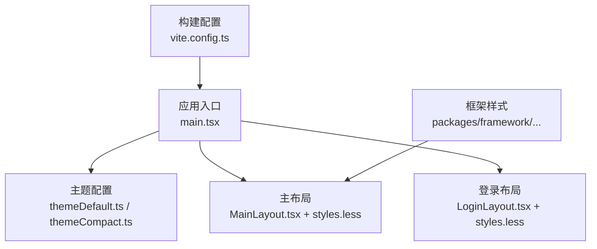
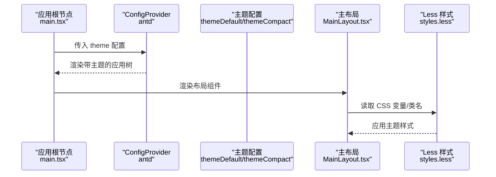
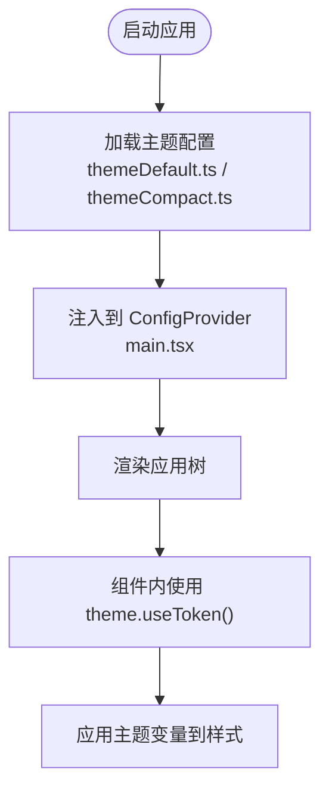
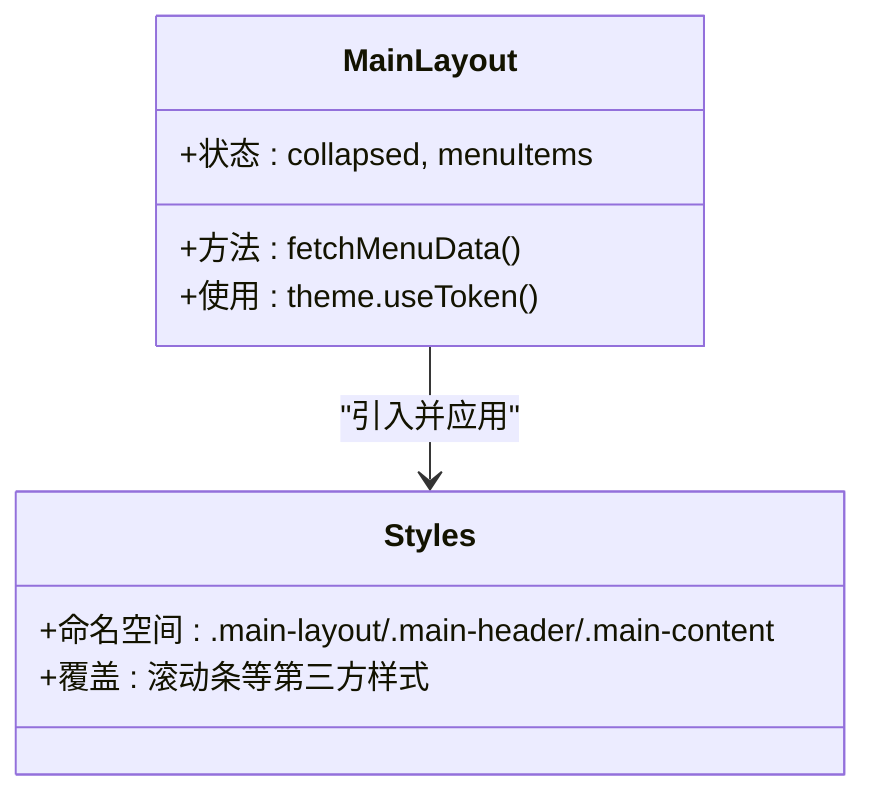
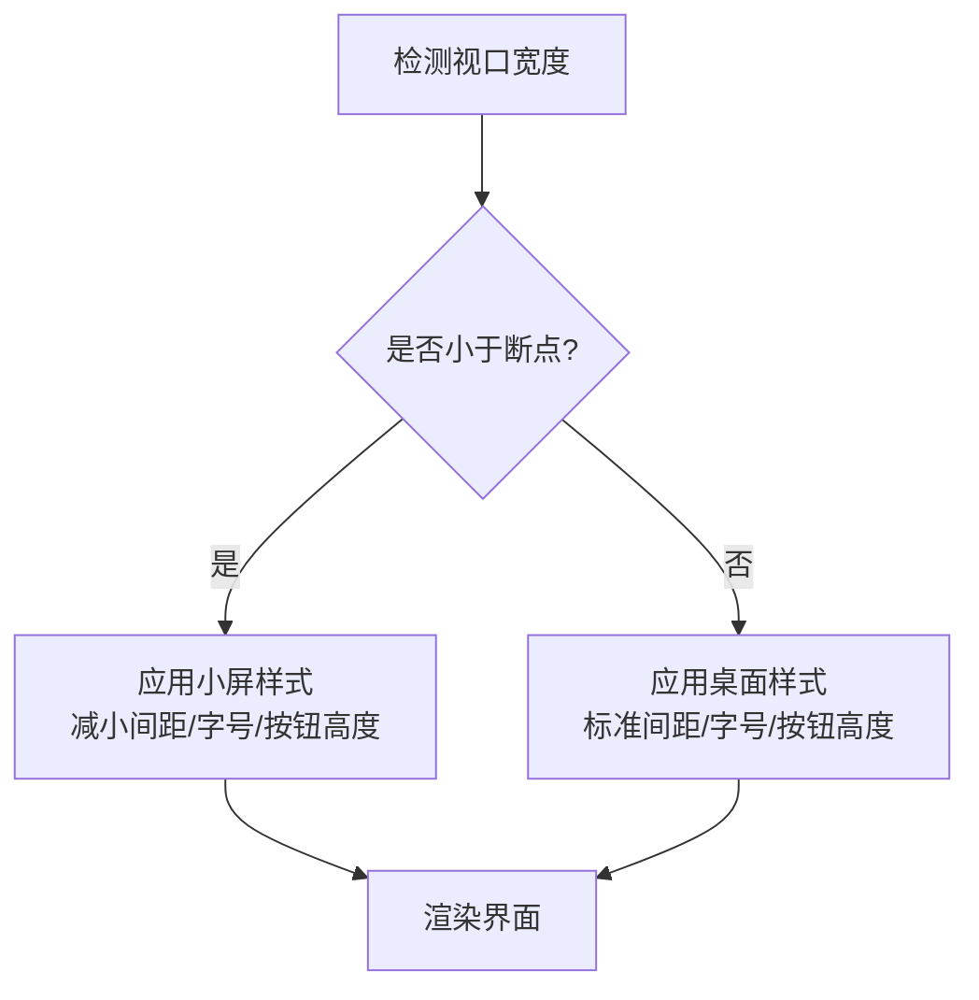
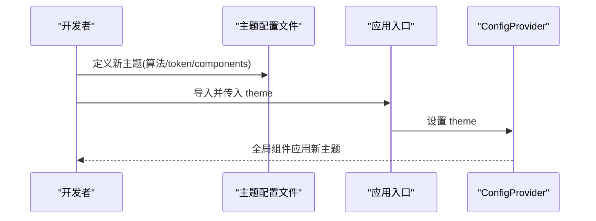
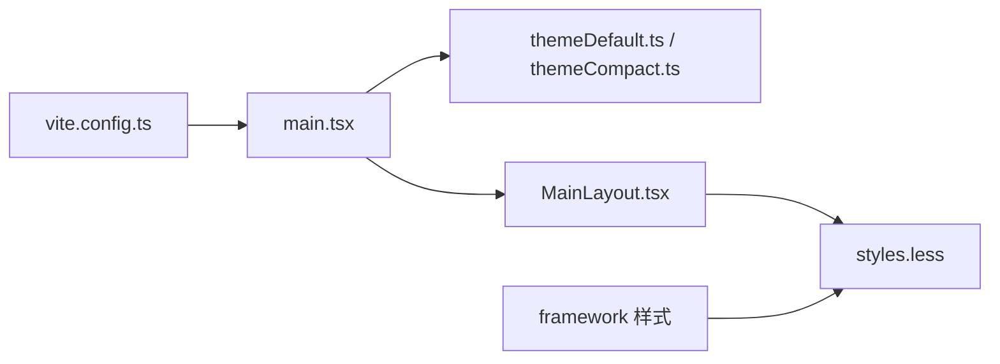

# 主题系统

<cite>
**本文引用的文件**
- [apps/demo/src/theme/themeDefault.ts](file://apps/demo/src/theme/themeDefault.ts)
- [apps/demo/src/theme/themeCompact.ts](file://apps/demo/src/theme/themeCompact.ts)
- [apps/demo/src/main.tsx](file://apps/demo/src/main.tsx)
- [apps/demo/vite.config.ts](file://apps/demo/vite.config.ts)
- [apps/demo/src/layouts/main/MainLayout.tsx](file://apps/demo/src/layouts/main/MainLayout.tsx)
- [apps/demo/src/layouts/main/styles.less](file://apps/demo/src/layouts/main/styles.less)
- [apps/demo/src/layouts/login/LoginLayout.tsx](file://apps/demo/src/layouts/login/LoginLayout.tsx)
- [apps/demo/src/layouts/login/styles.less](file://apps/demo/src/layouts/login/styles.less)
- [packages/framework/src/comp/view/table/styles/index.less](file://packages/framework/src/comp/view/table/styles/index.less)
</cite>

## 目录
1. [简介](#简介)
2. [项目结构](#项目结构)
3. [核心组件](#核心组件)
4. [架构总览](#架构总览)
5. [详细组件分析](#详细组件分析)
6. [依赖关系分析](#依赖关系分析)
7. [性能考虑](#性能考虑)
8. [故障排查指南](#故障排查指南)
9. [结论](#结论)
10. [附录](#附录)

## 简介
本文件面向 WMS Web 项目的主题系统，聚焦基于 Ant Design 的主题定制机制与实现。内容涵盖：
- 默认主题与紧凑主题的切换方式
- Less 样式组织与 CSS 变量使用
- 响应式设计的实现方案
- 主题配置的扩展机制与自定义主题开发
- 主题开发最佳实践（样式隔离、性能优化）
- 主题配置示例与样式编写规范

## 项目结构
本项目采用 Monorepo 结构，应用位于 apps/demo，框架能力位于 packages/framework。主题相关代码集中在 apps/demo/src/theme，并在应用入口通过 Ant Design 的 ConfigProvider 注入主题；布局与页面样式以 Less 文件组织，遵循按模块划分的样式隔离策略。

图表来源
- [apps/demo/src/main.tsx:1-31](file://apps/demo/src/main.tsx#L1-L31)
- [apps/demo/src/theme/themeDefault.ts:1-15](file://apps/demo/src/theme/themeDefault.ts#L1-L15)
- [apps/demo/src/theme/themeCompact.ts:1-15](file://apps/demo/src/theme/themeCompact.ts#L1-L15)
- [apps/demo/src/layouts/main/MainLayout.tsx:1-77](file://apps/demo/src/layouts/main/MainLayout.tsx#L1-L77)
- [apps/demo/src/layouts/main/styles.less:1-45](file://apps/demo/src/layouts/main/styles.less#L1-L45)
- [apps/demo/src/layouts/login/LoginLayout.tsx:1-99](file://apps/demo/src/layouts/login/LoginLayout.tsx#L1-L99)
- [apps/demo/src/layouts/login/styles.less:1-189](file://apps/demo/src/layouts/login/styles.less#L1-L189)
- [apps/demo/vite.config.ts:1-36](file://apps/demo/vite.config.ts#L1-L36)
- [packages/framework/src/comp/view/table/styles/index.less:1-4](file://packages/framework/src/comp/view/table/styles/index.less#L1-L4)

章节来源
- [apps/demo/src/main.tsx:1-31](file://apps/demo/src/main.tsx#L1-L31)
- [apps/demo/vite.config.ts:1-36](file://apps/demo/vite.config.ts#L1-L36)

## 核心组件
- 主题配置对象
  - 默认主题：使用 Ant Design 默认算法，并通过 token 与 components 进行微调。
  - 紧凑主题：使用紧凑算法，保持统一的圆角与组件风格。
- 应用根节点
  - 通过 ConfigProvider 注入主题，使全局组件生效。
- 布局与样式
  - 主布局与登录布局分别维护独立样式文件，利用 Less 组织样式并配合 CSS 变量提升可维护性。
- 构建与别名
  - Vite 配置中定义别名，便于引用框架源码与统一资源路径。

章节来源
- [apps/demo/src/theme/themeDefault.ts:1-15](file://apps/demo/src/theme/themeDefault.ts#L1-L15)
- [apps/demo/src/theme/themeCompact.ts:1-15](file://apps/demo/src/theme/themeCompact.ts#L1-L15)
- [apps/demo/src/main.tsx:1-31](file://apps/demo/src/main.tsx#L1-L31)
- [apps/demo/src/layouts/main/MainLayout.tsx:1-77](file://apps/demo/src/layouts/main/MainLayout.tsx#L1-L77)
- [apps/demo/src/layouts/main/styles.less:1-45](file://apps/demo/src/layouts/main/styles.less#L1-L45)
- [apps/demo/src/layouts/login/styles.less:1-189](file://apps/demo/src/layouts/login/styles.less#L1-L189)
- [apps/demo/vite.config.ts:1-36](file://apps/demo/vite.config.ts#L1-L36)

## 架构总览
Ant Design 主题通过 ConfigProvider 在应用根节点提供，所有子组件共享同一套主题上下文。主题由算法（默认/紧凑）、token（设计令牌）和组件级覆盖组成。样式层采用 Less 模块化组织，结合 CSS 变量实现主题化与可维护性。

图表来源
- [apps/demo/src/main.tsx:1-31](file://apps/demo/src/main.tsx#L1-L31)
- [apps/demo/src/theme/themeDefault.ts:1-15](file://apps/demo/src/theme/themeDefault.ts#L1-L15)
- [apps/demo/src/theme/themeCompact.ts:1-15](file://apps/demo/src/theme/themeCompact.ts#L1-L15)
- [apps/demo/src/layouts/main/MainLayout.tsx:1-77](file://apps/demo/src/layouts/main/MainLayout.tsx#L1-L77)
- [apps/demo/src/layouts/main/styles.less:1-45](file://apps/demo/src/layouts/main/styles.less#L1-L45)

## 详细组件分析

### 主题配置与切换
- 默认主题与紧凑主题均通过 Ant Design 的 ThemeConfig 定义，包含 algorithm、token 与 components 三部分。
- 应用入口将紧凑主题作为默认主题注入到 ConfigProvider，从而全局生效。
- 如需动态切换主题，可在运行时根据用户偏好或环境变量选择不同主题对象并更新 ConfigProvider 的 theme 属性。

图表来源
- [apps/demo/src/theme/themeDefault.ts:1-15](file://apps/demo/src/theme/themeDefault.ts#L1-L15)
- [apps/demo/src/theme/themeCompact.ts:1-15](file://apps/demo/src/theme/themeCompact.ts#L1-L15)
- [apps/demo/src/main.tsx:1-31](file://apps/demo/src/main.tsx#L1-L31)
- [apps/demo/src/layouts/main/MainLayout.tsx:41-43](file://apps/demo/src/layouts/main/MainLayout.tsx#L41-L43)

章节来源
- [apps/demo/src/theme/themeDefault.ts:1-15](file://apps/demo/src/theme/themeDefault.ts#L1-L15)
- [apps/demo/src/theme/themeCompact.ts:1-15](file://apps/demo/src/theme/themeCompact.ts#L1-L15)
- [apps/demo/src/main.tsx:1-31](file://apps/demo/src/main.tsx#L1-L31)
- [apps/demo/src/layouts/main/MainLayout.tsx:41-43](file://apps/demo/src/layouts/main/MainLayout.tsx#L41-L43)

### Less 样式组织与 CSS 变量使用
- 样式按模块拆分：主布局与登录布局各自拥有独立的 .less 文件，避免样式污染。
- 使用 CSS 变量：通过 Ant Design 的 theme.useToken() 获取 token，并将其应用到背景色等样式属性，确保与主题一致。
- 组件样式覆盖：在业务样式文件中对第三方组件进行局部覆盖，如滚动条样式等。

图表来源
- [apps/demo/src/layouts/main/MainLayout.tsx:1-77](file://apps/demo/src/layouts/main/MainLayout.tsx#L1-L77)
- [apps/demo/src/layouts/main/styles.less:1-45](file://apps/demo/src/layouts/main/styles.less#L1-L45)

章节来源
- [apps/demo/src/layouts/main/MainLayout.tsx:1-77](file://apps/demo/src/layouts/main/MainLayout.tsx#L1-L77)
- [apps/demo/src/layouts/main/styles.less:1-45](file://apps/demo/src/layouts/main/styles.less#L1-L45)

### 响应式设计实现
- 登录页通过媒体查询在小屏设备上调整间距、字号与按钮尺寸，保证移动端可用性。
- 主布局采用弹性布局与固定高度区域，配合滚动容器适配不同屏幕尺寸。
- 建议在更多页面复用类似的响应式断点与布局策略，保持一致体验。

图表来源
- [apps/demo/src/layouts/login/styles.less:126-150](file://apps/demo/src/layouts/login/styles.less#L126-L150)

章节来源
- [apps/demo/src/layouts/login/styles.less:126-150](file://apps/demo/src/layouts/login/styles.less#L126-L150)

### 主题配置的扩展机制与自定义主题
- 扩展点
  - algorithm：选择默认或紧凑算法，控制整体密度与视觉风格。
  - token：集中管理颜色、圆角、阴影等设计令牌，便于全局替换。
  - components：针对特定组件（如 Table、Input）进行细粒度覆盖。
- 自定义主题流程
  - 新建主题配置文件，继承或组合现有主题对象。
  - 在应用入口或运行时通过 ConfigProvider 注入新主题。
  - 在业务样式中使用 theme.useToken() 获取变量，确保一致性。

图表来源
- [apps/demo/src/theme/themeDefault.ts:1-15](file://apps/demo/src/theme/themeDefault.ts#L1-L15)
- [apps/demo/src/theme/themeCompact.ts:1-15](file://apps/demo/src/theme/themeCompact.ts#L1-L15)
- [apps/demo/src/main.tsx:1-31](file://apps/demo/src/main.tsx#L1-L31)

章节来源
- [apps/demo/src/theme/themeDefault.ts:1-15](file://apps/demo/src/theme/themeDefault.ts#L1-L15)
- [apps/demo/src/theme/themeCompact.ts:1-15](file://apps/demo/src/theme/themeCompact.ts#L1-L15)
- [apps/demo/src/main.tsx:1-31](file://apps/demo/src/main.tsx#L1-L31)

### 样式编写规范与最佳实践
- 样式隔离
  - 每个模块/页面维护独立 .less 文件，使用命名空间避免冲突。
  - 仅覆盖必要的第三方组件样式，避免全局污染。
- 使用 CSS 变量
  - 通过 theme.useToken() 获取 token，并在样式中引用，确保与主题同步。
- 性能优化
  - 减少不必要的深度选择器与复杂嵌套，降低样式计算成本。
  - 合理使用媒体查询与条件样式，避免重排重绘。
- 可维护性
  - 将通用样式抽取为公共样式片段，复用性强且易于维护。
  - 在框架包中集中管理基础组件样式，业务层只做必要覆盖。

章节来源
- [apps/demo/src/layouts/main/styles.less:1-45](file://apps/demo/src/layouts/main/styles.less#L1-L45)
- [apps/demo/src/layouts/login/styles.less:1-189](file://apps/demo/src/layouts/login/styles.less#L1-L189)
- [packages/framework/src/comp/view/table/styles/index.less:1-4](file://packages/framework/src/comp/view/table/styles/index.less#L1-L4)

## 依赖关系分析
- 应用入口依赖主题配置与布局组件，并通过 ConfigProvider 将主题注入到整个应用树。
- 布局组件依赖 Ant Design 的 theme API 获取 token，并在样式文件中引用。
- 构建配置通过别名指向框架源码，便于开发与调试。

图表来源
- [apps/demo/src/main.tsx:1-31](file://apps/demo/src/main.tsx#L1-L31)
- [apps/demo/src/theme/themeDefault.ts:1-15](file://apps/demo/src/theme/themeDefault.ts#L1-L15)
- [apps/demo/src/theme/themeCompact.ts:1-15](file://apps/demo/src/theme/themeCompact.ts#L1-L15)
- [apps/demo/src/layouts/main/MainLayout.tsx:1-77](file://apps/demo/src/layouts/main/MainLayout.tsx#L1-L77)
- [apps/demo/src/layouts/main/styles.less:1-45](file://apps/demo/src/layouts/main/styles.less#L1-L45)
- [apps/demo/vite.config.ts:1-36](file://apps/demo/vite.config.ts#L1-L36)
- [packages/framework/src/comp/view/table/styles/index.less:1-4](file://packages/framework/src/comp/view/table/styles/index.less#L1-L4)

章节来源
- [apps/demo/src/main.tsx:1-31](file://apps/demo/src/main.tsx#L1-L31)
- [apps/demo/vite.config.ts:1-36](file://apps/demo/vite.config.ts#L1-L36)

## 性能考虑
- 主题渲染
  - 使用 Ant Design 的算法与 token 机制，避免手写大量样式，减少重复计算。
  - 仅在必要时覆盖组件样式，避免全局样式膨胀。
- 样式体积
  - 按需引入组件与样式，减少打包体积。
  - 使用 CSS 变量替代硬编码值，提高复用率。
- 运行时性能
  - 避免频繁切换主题导致的重渲染；如需切换，合并多次变更。
  - 合理划分样式作用域，减少选择器匹配开销。

## 故障排查指南
- 主题未生效
  - 检查是否在应用根节点正确注入 ConfigProvider 与 theme。
  - 确认主题配置文件导出的是正确的 ThemeConfig 对象。
- 样式被覆盖
  - 检查样式文件的优先级与作用域，避免全局样式覆盖业务样式。
  - 使用浏览器开发者工具定位具体样式规则。
- 响应式异常
  - 核对媒体查询断点与设备像素比，确保在不同设备上表现一致。
  - 检查布局容器的宽高与溢出设置，避免内容被裁剪。

章节来源
- [apps/demo/src/main.tsx:1-31](file://apps/demo/src/main.tsx#L1-L31)
- [apps/demo/src/layouts/main/styles.less:1-45](file://apps/demo/src/layouts/main/styles.less#L1-L45)
- [apps/demo/src/layouts/login/styles.less:126-150](file://apps/demo/src/layouts/login/styles.less#L126-L150)

## 结论
本项目通过 Ant Design 的主题机制与 Less 模块化样式，实现了灵活、可维护的主题系统。默认主题与紧凑主题通过算法与 token 统一管理，布局与页面样式遵循隔离原则并使用 CSS 变量提升一致性。响应式设计通过媒体查询与弹性布局保障多端体验。未来可通过运行时主题切换与更丰富的 token 扩展，进一步提升用户体验与可定制性。

## 附录
- 主题配置示例
  - 默认主题：使用默认算法，设置圆角与组件覆盖。
  - 紧凑主题：使用紧凑算法，保持统一视觉密度。
- 样式编写规范
  - 按模块拆分样式文件，使用命名空间避免冲突。
  - 优先使用 theme.useToken() 获取变量，减少硬编码。
  - 谨慎覆盖第三方组件样式，尽量局部作用域。
- 构建与别名
  - 通过 Vite 别名指向框架源码，便于开发与调试。

章节来源
- [apps/demo/src/theme/themeDefault.ts:1-15](file://apps/demo/src/theme/themeDefault.ts#L1-L15)
- [apps/demo/src/theme/themeCompact.ts:1-15](file://apps/demo/src/theme/themeCompact.ts#L1-L15)
- [apps/demo/src/layouts/main/styles.less:1-45](file://apps/demo/src/layouts/main/styles.less#L1-L45)
- [apps/demo/src/layouts/login/styles.less:1-189](file://apps/demo/src/layouts/login/styles.less#L1-L189)
- [apps/demo/vite.config.ts:1-36](file://apps/demo/vite.config.ts#L1-L36)