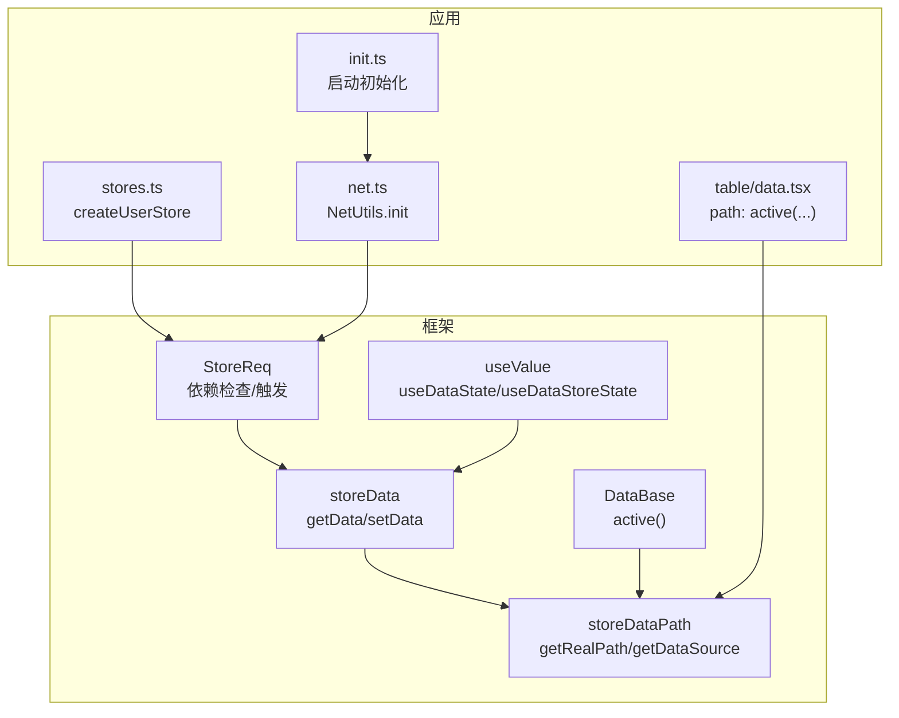
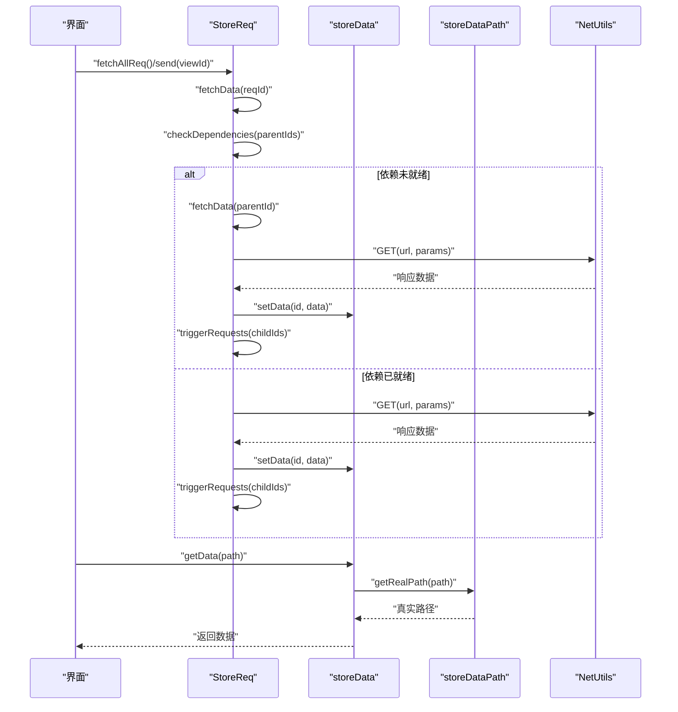
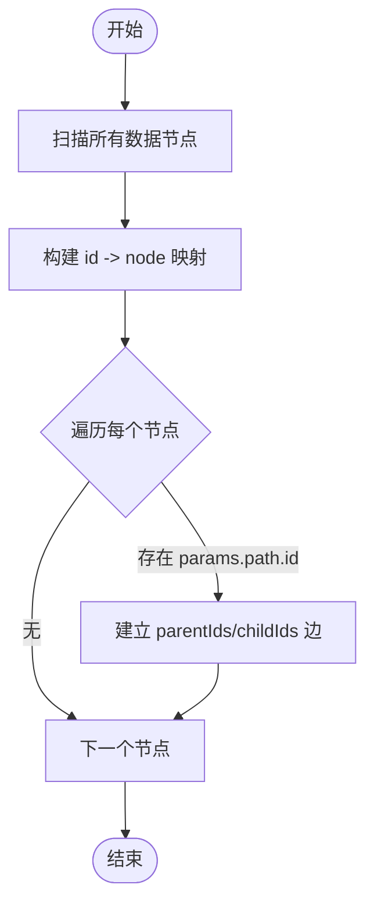
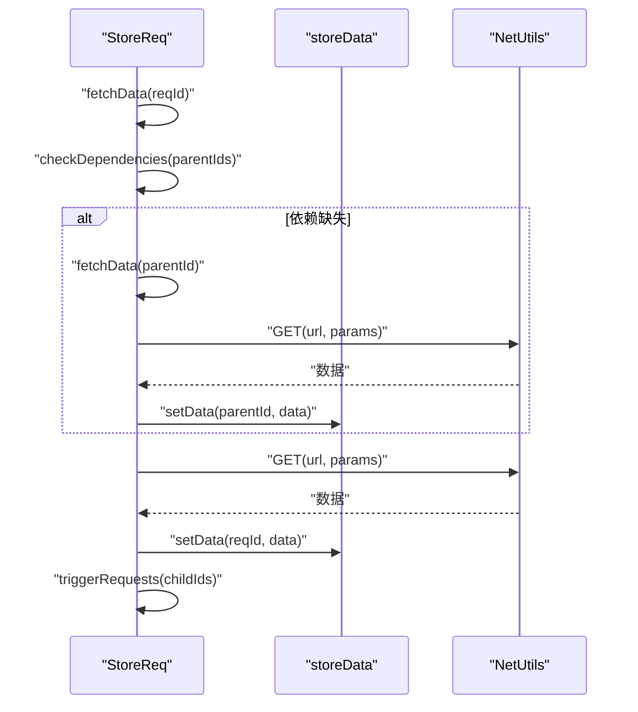
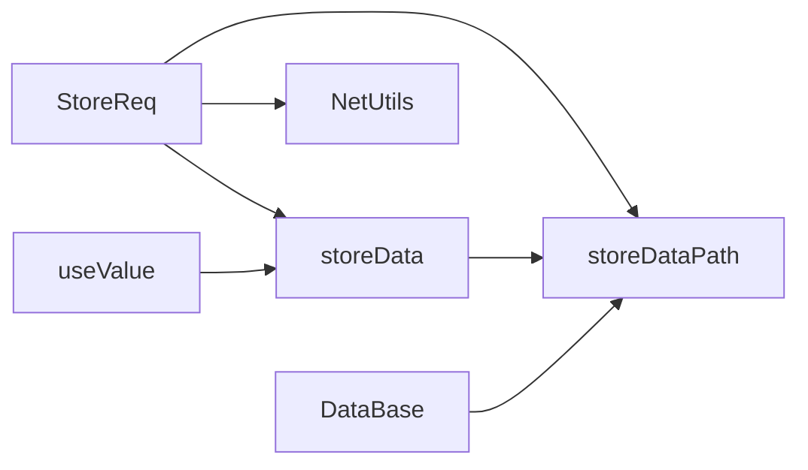

# 数据依赖管理

<cite>
**本文引用的文件**
- [storeReq.ts](file://packages/framework/src/stores/store/utils/storeReq.ts)
- [storeData.ts](file://packages/framework/src/stores/store/utils/storeData.ts)
- [storeDataPath.ts](file://packages/framework/src/stores/store/utils/storeDataPath.ts)
- [useValue.ts](file://packages/framework/src/stores/store/hooks/useValue.ts)
- [index.ts](file://packages/framework/src/index.ts)
- [dataBase.ts](file://packages/framework/src/data/dataBase.ts)
- [stores.ts](file://apps/demo/src/init/stores.ts)
- [net.ts](file://apps/demo/src/init/net.ts)
- [init.ts](file://apps/demo/src/init/init.ts)
- [table/data.tsx](file://apps/demo/src/pages/base/table/data.tsx)
</cite>

## 目录
1. [简介](#简介)
2. [项目结构](#项目结构)
3. [核心组件](#核心组件)
4. [架构总览](#架构总览)
5. [详细组件分析](#详细组件分析)
6. [依赖关系分析](#依赖关系分析)
7. [性能考虑](#性能考虑)
8. [故障排查指南](#故障排查指南)
9. [结论](#结论)
10. [附录](#附录)

## 简介
本文件面向WMS Web项目的数据依赖管理，系统性阐述父子级联请求、依赖图构建与维护、异步依赖处理、依赖失效与重新计算机制，以及最佳实践（性能优化与错误处理）。文档基于框架内 store 层的数据请求与状态管理实现，结合示例页面中的数据声明方式，帮助读者理解并正确使用该机制。

## 项目结构
- 框架层（packages/framework）
  - 数据请求与依赖调度：storeReq.ts
  - 数据读写与路径解析：storeData.ts、storeDataPath.ts
  - React Hooks 集成：useValue.ts
  - 对外导出入口：index.ts
  - 数据基类：dataBase.ts
- 应用层（apps/demo）
  - Store 初始化与网络配置：stores.ts、net.ts、init.ts
  - 页面数据声明示例：table/data.tsx（展示通过 path 引用活动行数据）

图表来源
- [storeReq.ts:1-208](file://packages/framework/src/stores/store/utils/storeReq.ts#L1-L208)
- [storeData.ts:1-147](file://packages/framework/src/stores/store/utils/storeData.ts#L1-L147)
- [storeDataPath.ts:1-117](file://packages/framework/src/stores/store/utils/storeDataPath.ts#L1-L117)
- [useValue.ts:1-48](file://packages/framework/src/stores/store/hooks/useValue.ts#L1-L48)
- [dataBase.ts:1-17](file://packages/framework/src/data/dataBase.ts#L1-L17)
- [stores.ts:1-11](file://apps/demo/src/init/stores.ts#L1-L11)
- [net.ts:1-20](file://apps/demo/src/init/net.ts#L1-L20)
- [init.ts:1-9](file://apps/demo/src/init/init.ts#L1-L9)
- [table/data.tsx:1-21](file://apps/demo/src/pages/base/table/data.tsx#L1-L21)

章节来源
- [index.ts:1-69](file://packages/framework/src/index.ts#L1-L69)

## 核心组件
- StoreReq：负责数据请求的依赖检查、参数构建、网络调用、结果落库与子节点触发。
- storeData：提供 getData/setData/setDataDebounce 等数据读写能力，并在初始化时构建依赖图（parentIds/childIds）。
- storeDataPath：将引用路径（如 @Active）解析为真实数据路径，支持视图间路径引用。
- useValue：React Hook，封装本地缓存与防抖更新，便于 UI 与 store 同步。
- DataBase：提供 active(viewId) 便捷方法，用于构造活动行路径引用。

章节来源
- [storeReq.ts:1-208](file://packages/framework/src/stores/store/utils/storeReq.ts#L1-L208)
- [storeData.ts:1-147](file://packages/framework/src/stores/store/utils/storeData.ts#L1-L147)
- [storeDataPath.ts:1-117](file://packages/framework/src/stores/store/utils/storeDataPath.ts#L1-L117)
- [useValue.ts:1-48](file://packages/framework/src/stores/store/hooks/useValue.ts#L1-L48)
- [dataBase.ts:1-17](file://packages/framework/src/data/dataBase.ts#L1-L17)

## 架构总览
数据依赖管理的核心流程如下：
- 初始化阶段：从数据声明中收集所有节点，根据 params.path.id 建立 parentIds/childIds，形成依赖图。
- 触发阶段：调用 fetchAllReq 或 send(viewId) 发起根节点请求；每个请求在发送前检查依赖是否就绪。
- 执行阶段：构建请求参数（合并 criteria、params 映射），发起网络请求，格式化并存储数据。
- 级联阶段：父节点成功后，自动触发其 childIds 对应的子节点请求，形成链式加载。
- 读取阶段：UI 通过 useDataState/useDataStoreState 订阅 store 数据变化，支持防抖写入。

图表来源
- [storeReq.ts:58-208](file://packages/framework/src/stores/store/utils/storeReq.ts#L58-L208)
- [storeData.ts:57-88](file://packages/framework/src/stores/store/utils/storeData.ts#L57-L88)
- [storeDataPath.ts:13-58](file://packages/framework/src/stores/store/utils/storeDataPath.ts#L13-L58)

## 详细组件分析

### 依赖图构建与维护
- 构建时机：在 initDataAndReq 中遍历数据声明，提取 id 并克隆到 req 表；随后二次遍历，根据 params[].path.id 建立父子关系，填充 parentIds/childIds。
- 维护策略：依赖关系在初始化时静态构建，运行时通过 store.data 中的 id 键查找依赖数据是否存在。
- 循环依赖检测：当前实现未显式检测环；建议在业务侧避免循环依赖，或在后续扩展中加入 visited 集合检测。

图表来源
- [storeData.ts:9-54](file://packages/framework/src/stores/store/utils/storeData.ts#L9-L54)

章节来源
- [storeData.ts:9-54](file://packages/framework/src/stores/store/utils/storeData.ts#L9-L54)

### 父子级联请求与自动触发
- 触发入口：fetchAllReq 仅触发没有父节点的请求；send(viewId) 根据视图路径定位对应请求并触发。
- 依赖检查：fetchData 在发送前调用 checkDependencies，若依赖缺失则递归获取依赖数据。
- 自动级联：getReqData 成功后将数据写入 store，并调用 triggerRequests 顺序触发子节点请求。

图表来源
- [storeReq.ts:71-190](file://packages/framework/src/stores/store/utils/storeReq.ts#L71-L190)

章节来源
- [storeReq.ts:58-208](file://packages/framework/src/stores/store/utils/storeReq.ts#L58-L208)

### 异步依赖处理（Promise 链与 async/await）
- fetchData/checkDependencies/getReqData/triggerRequests 均使用 async/await 串行化依赖获取与子节点触发，确保依赖顺序正确。
- 错误传播：网络异常在 getReqData 中捕获并抛出，上层可据此进行统一错误处理。

章节来源
- [storeReq.ts:71-190](file://packages/framework/src/stores/store/utils/storeReq.ts#L71-L190)

### 依赖失效与重新计算
- 失效场景：当父节点数据被覆盖或清空时，子节点可能因依赖缺失而无法继续。
- 重新计算：可通过 send(viewId) 重新触发指定视图的请求；也可在业务层对关键数据变更后再调用 fetchAllReq 或 send。
- 建议：对频繁变动的父数据，采用增量更新而非全量替换，减少不必要的重算。

章节来源
- [storeReq.ts:196-208](file://packages/framework/src/stores/store/utils/storeReq.ts#L196-L208)

### 路径解析与活动行引用
- 路径解析：getRealPath 支持数组、字符串、特殊引用（如 @Active），并将引用展开为真实路径。
- 活动行：DataBase.active(viewId) 生成活动行引用；table/data.tsx 中使用该引用将表单数据绑定到表格选中行。

章节来源
- [storeDataPath.ts:13-58](file://packages/framework/src/stores/store/utils/storeDataPath.ts#L13-L58)
- [dataBase.ts:4-12](file://packages/framework/src/data/dataBase.ts#L4-L12)
- [table/data.tsx:1-21](file://apps/demo/src/pages/base/table/data.tsx#L1-L21)

### React 集成与防抖更新
- useDataState：本地缓存 + 防抖写入，适合输入框等高频更新场景。
- useDataStoreState：直接写 store，适合需要立即生效的场景。
- setDataDebounce：按路径去抖，避免频繁状态更新导致性能问题。

章节来源
- [useValue.ts:10-43](file://packages/framework/src/stores/store/hooks/useValue.ts#L10-L43)
- [storeData.ts:118-147](file://packages/framework/src/stores/store/utils/storeData.ts#L118-L147)

## 依赖关系分析
- 模块耦合
  - StoreReq 依赖 storeData 进行数据存取，依赖 storeDataPath 进行路径解析，依赖 NetUtils 进行网络请求。
  - storeData 依赖 storeDataPath 解析路径，并提供 getData/setData/setDataDebounce。
  - useValue 依赖 storeData 提供的能力，并通过 Context 接入 store。
- 外部依赖
  - NetUtils：网络请求与全局错误处理（401 等）。
  - Lodash：对象操作工具。
- 潜在循环依赖
  - 当前代码未发现模块级循环导入；业务数据声明需避免循环依赖（A 依赖 B，B 又依赖 A）。

图表来源
- [storeReq.ts:1-208](file://packages/framework/src/stores/store/utils/storeReq.ts#L1-L208)
- [storeData.ts:1-147](file://packages/framework/src/stores/store/utils/storeData.ts#L1-L147)
- [storeDataPath.ts:1-117](file://packages/framework/src/stores/store/utils/storeDataPath.ts#L1-L117)
- [useValue.ts:1-48](file://packages/framework/src/stores/store/hooks/useValue.ts#L1-L48)
- [dataBase.ts:1-17](file://packages/framework/src/data/dataBase.ts#L1-L17)

章节来源
- [storeReq.ts:1-208](file://packages/framework/src/stores/store/utils/storeReq.ts#L1-L208)
- [storeData.ts:1-147](file://packages/framework/src/stores/store/utils/storeData.ts#L1-L147)
- [storeDataPath.ts:1-117](file://packages/framework/src/stores/store/utils/storeDataPath.ts#L1-L117)
- [useValue.ts:1-48](file://packages/framework/src/stores/store/hooks/useValue.ts#L1-L48)
- [dataBase.ts:1-17](file://packages/framework/src/data/dataBase.ts#L1-L17)

## 性能考虑
- 依赖图构建复杂度：O(N + E)，N 为节点数，E 为依赖边数；初始化时一次性构建，避免重复计算。
- 级联触发顺序：串行 await 保证依赖顺序，但会阻塞整体加载；对于独立子树可考虑并行化（需谨慎避免竞态）。
- 防抖写入：setDataDebounce 降低高频更新带来的渲染压力。
- 路径解析开销：getRealPath 支持复杂引用，建议尽量减少深层嵌套引用。
- 网络层：NetUtils 统一错误处理，建议结合重试与超时策略提升鲁棒性。

[本节为通用指导，不直接分析具体文件]

## 故障排查指南
- 常见告警
  - “数据请求不存在”：检查 reqId 是否正确，或是否在初始化前被访问。
  - “依赖数据未就绪”：确认父节点 url/criteria/params 配置是否正确，必要时手动触发父节点请求。
  - “视图对应的请求不存在”：检查 view.path 与 store.req 的映射关系。
- 网络错误
  - 401 未授权：由 NetUtils 统一处理跳转登录；检查 token 与接口鉴权。
  - 其他错误：在 getReqData 中捕获并抛出，可在上层 try/catch 或全局错误边界处理。
- 调试建议
  - 打印依赖图：在 initDataAndReq 后输出 req 的 parentIds/childIds，验证依赖关系。
  - 逐步触发：先 send(父视图) 再 send(子视图)，观察日志定位失败点。

章节来源
- [storeReq.ts:71-190](file://packages/framework/src/stores/store/utils/storeReq.ts#L71-L190)
- [net.ts:5-17](file://apps/demo/src/init/net.ts#L5-L17)

## 结论
该数据依赖管理机制通过声明式依赖图与自动级联触发，显著降低了前端数据编排的复杂度。借助路径解析与活动行引用，能够灵活表达复杂的数据关联。配合防抖更新与统一的网络错误处理，兼顾了易用性与性能。建议在业务中遵循“根节点驱动、依赖前置、最小化重算”的原则，以获得更优的用户体验。

[本节为总结性内容，不直接分析具体文件]

## 附录
- 最佳实践
  - 明确根节点：只暴露无父依赖的节点供外部触发。
  - 合理拆分：将大页面拆分为多个视图，减少单页依赖深度。
  - 参数复用：通过 params 映射共享父节点数据，避免重复请求。
  - 错误隔离：对关键请求增加重试与降级逻辑。
- 示例参考
  - 活动行引用：table/data.tsx 中通过 DataBase.active(mainTable.id) 将表单数据绑定到表格选中行。
  - 网络初始化：net.ts 中配置基础 URL、登录地址与全局错误回调。
  - Store 初始化：stores.ts 中创建用户与菜单 store，init.ts 中启动网络初始化。

章节来源
- [table/data.tsx:1-21](file://apps/demo/src/pages/base/table/data.tsx#L1-L21)
- [net.ts:1-20](file://apps/demo/src/init/net.ts#L1-L20)
- [stores.ts:1-11](file://apps/demo/src/init/stores.ts#L1-L11)
- [init.ts:1-9](file://apps/demo/src/init/init.ts#L1-L9)