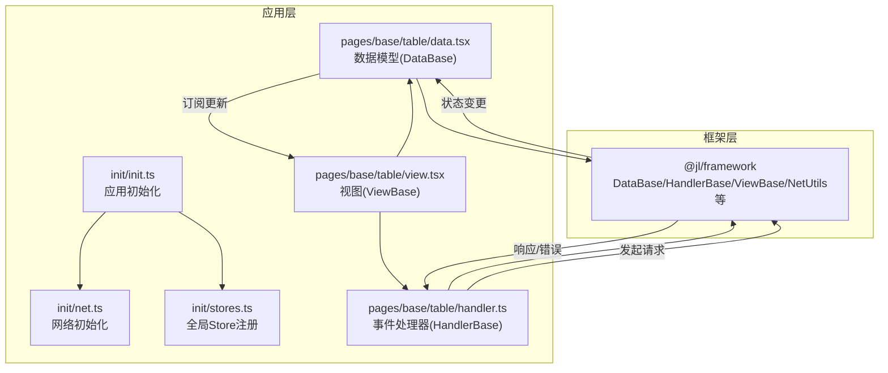
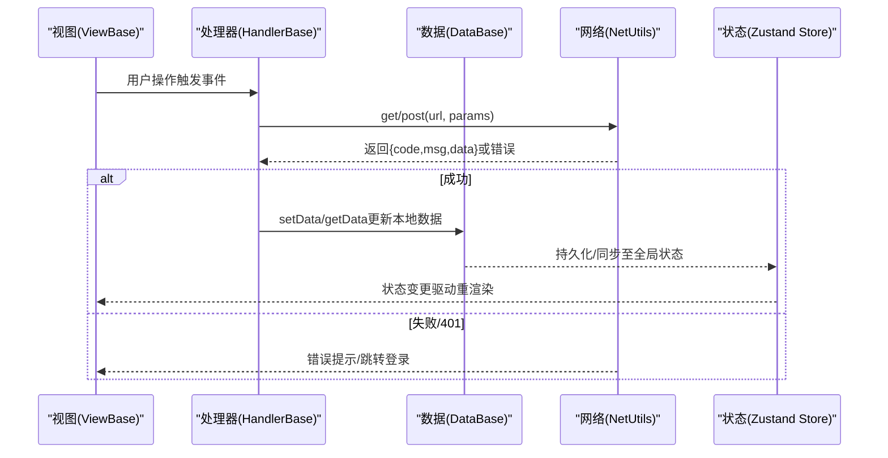
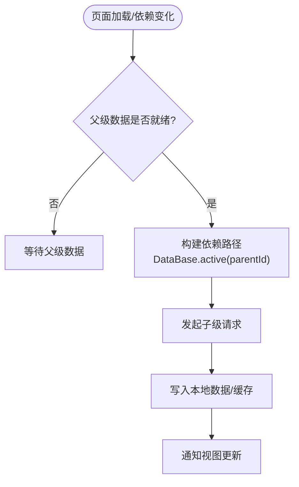
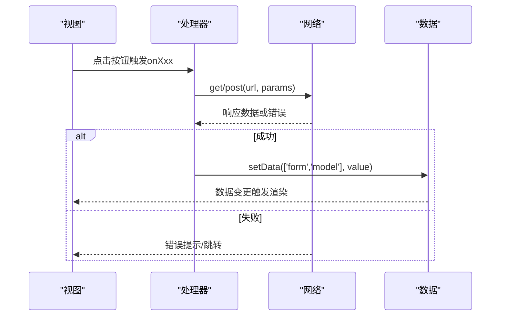
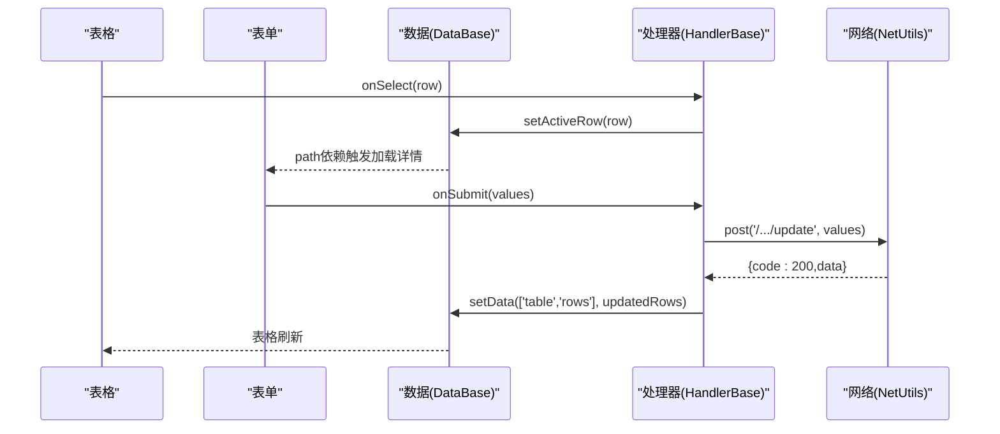
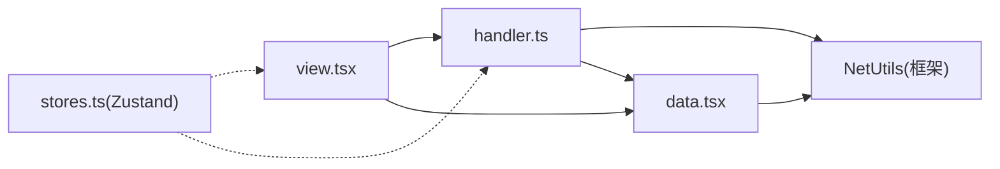

# 数据流管理

<cite>
**本文引用的文件**
- [apps/demo/src/init/stores.ts](file://apps/demo/src/init/stores.ts)
- [apps/demo/src/init/net.ts](file://apps/demo/src/init/net.ts)
- [apps/demo/src/init/init.ts](file://apps/demo/src/init/init.ts)
- [apps/demo/src/interface/user.ts](file://apps/demo/src/interface/user.ts)
- [apps/demo/src/interface/menu.ts](file://apps/demo/src/interface/menu.ts)
- [apps/demo/src/pages/base/table/data.tsx](file://apps/demo/src/pages/base/table/data.tsx)
- [apps/demo/src/pages/base/table/handler.ts](file://apps/demo/src/pages/base/table/handler.ts)
- [apps/demo/src/pages/base/table/view.tsx](file://apps/demo/src/pages/base/table/view.tsx)
</cite>

## 目录
1. [简介](#简介)
2. [项目结构](#项目结构)
3. [核心组件](#核心组件)
4. [架构总览](#架构总览)
5. [详细组件分析](#详细组件分析)
6. [依赖关系分析](#依赖关系分析)
7. [性能考虑](#性能考虑)
8. [故障排查指南](#故障排查指南)
9. [结论](#结论)
10. [附录](#附录)

## 简介
本文件面向WMS Web项目的数据流管理，重点阐述基于Zustand的状态管理模式与框架提供的数据抽象层（DataBase/HandlerBase/ViewBase）如何协同工作，实现从UI到状态再到网络请求的完整闭环。文档涵盖：
- Store的结构设计与状态更新机制
- 数据请求生命周期（触发、执行、返回、落库、渲染）
- 数据依赖管理（父子级联、依赖检查）
- 数据绑定与同步（UI与状态实时同步）
- 最佳实践（性能优化、错误处理）
- 复杂数据流场景的实现示例（以表格+表单联动为例）

## 项目结构
本项目采用应用层（apps/demo）与框架层（packages/framework）分离的组织方式。应用层通过引入框架能力，定义页面级的Data/Handler/View，配合全局Store进行跨模块状态共享；网络层统一初始化并集中处理鉴权与错误提示。

图表来源
- [apps/demo/src/init/init.ts:1-9](file://apps/demo/src/init/init.ts#L1-L9)
- [apps/demo/src/init/net.ts:1-20](file://apps/demo/src/init/net.ts#L1-L20)
- [apps/demo/src/init/stores.ts:1-11](file://apps/demo/src/init/stores.ts#L1-L11)
- [apps/demo/src/pages/base/table/data.tsx:1-22](file://apps/demo/src/pages/base/table/data.tsx#L1-L22)
- [apps/demo/src/pages/base/table/handler.ts:1-30](file://apps/demo/src/pages/base/table/handler.ts#L1-L30)
- [apps/demo/src/pages/base/table/view.tsx:1-86](file://apps/demo/src/pages/base/table/view.tsx#L1-L86)

章节来源
- [apps/demo/src/init/init.ts:1-9](file://apps/demo/src/init/init.ts#L1-L9)
- [apps/demo/src/init/net.ts:1-20](file://apps/demo/src/init/net.ts#L1-L20)
- [apps/demo/src/init/stores.ts:1-11](file://apps/demo/src/init/stores.ts#L1-L11)

## 核心组件
- 全局Store（Zustand）
  - 通过createUserStore创建用户相关的全局状态容器，用于跨页面共享用户信息、菜单等。
  - 类型约束由接口User与MenuItem提供，保证类型安全。
- 网络层
  - NetUtils.init统一配置基础地址、登录地址及未授权处理回调，集中处理401跳转与错误提示。
- 页面数据层（DataBase）
  - 以Data类声明数据源（如mainTable/mainForm），支持url、path依赖、keyAttr等配置，自动完成请求与缓存。
- 事件处理器（HandlerBase）
  - 封装get/post等方法发起请求，提供getData/setData等工具方法读写状态，支持统计打印与重置。
- 视图层（ViewBase）
  - 声明UI结构与交互，将控件与dataId绑定，自动订阅数据变化并渲染。

章节来源
- [apps/demo/src/init/stores.ts:1-11](file://apps/demo/src/init/stores.ts#L1-L11)
- [apps/demo/src/interface/user.ts:1-9](file://apps/demo/src/interface/user.ts#L1-L9)
- [apps/demo/src/interface/menu.ts:1-6](file://apps/demo/src/interface/menu.ts#L1-L6)
- [apps/demo/src/init/net.ts:1-20](file://apps/demo/src/init/net.ts#L1-L20)
- [apps/demo/src/pages/base/table/data.tsx:1-22](file://apps/demo/src/pages/base/table/data.tsx#L1-L22)
- [apps/demo/src/pages/base/table/handler.ts:1-30](file://apps/demo/src/pages/base/table/handler.ts#L1-L30)
- [apps/demo/src/pages/base/table/view.tsx:1-86](file://apps/demo/src/pages/base/table/view.tsx#L1-L86)

## 架构总览
下图展示从UI交互到状态更新、再到网络请求与数据回写的完整流程，以及各层的职责边界。

图表来源
- [apps/demo/src/pages/base/table/view.tsx:1-86](file://apps/demo/src/pages/base/table/view.tsx#L1-L86)
- [apps/demo/src/pages/base/table/handler.ts:1-30](file://apps/demo/src/pages/base/table/handler.ts#L1-L30)
- [apps/demo/src/pages/base/table/data.tsx:1-22](file://apps/demo/src/pages/base/table/data.tsx#L1-L22)
- [apps/demo/src/init/net.ts:1-20](file://apps/demo/src/init/net.ts#L1-L20)
- [apps/demo/src/init/stores.ts:1-11](file://apps/demo/src/init/stores.ts#L1-L11)

## 详细组件分析

### 全局Store（Zustand）设计
- 使用createUserStore<User, MenuItem>创建用户域Store，暴露user字段，类型为User接口，便于在任意位置读取当前用户信息与权限、菜单。
- 通过Store静态属性统一管理，避免重复实例化，确保单例语义。
- 与业务解耦：Store仅负责状态存储与访问，不直接耦合网络逻辑。

章节来源
- [apps/demo/src/init/stores.ts:1-11](file://apps/demo/src/init/stores.ts#L1-L11)
- [apps/demo/src/interface/user.ts:1-9](file://apps/demo/src/interface/user.ts#L1-L9)
- [apps/demo/src/interface/menu.ts:1-6](file://apps/demo/src/interface/menu.ts#L1-L6)

### 网络层初始化与错误处理
- 统一初始化基础URL、登录URL与API路径，集中处理401未授权场景，调用handleUnauthorized进行跳转或清理。
- 所有请求的错误通过message.error统一提示，降低分散处理的复杂度。

章节来源
- [apps/demo/src/init/net.ts:1-20](file://apps/demo/src/init/net.ts#L1-L20)

### 数据模型（DataBase）与依赖管理
- Data类继承DataBase，声明mainTable/mainForm等数据源，支持：
  - url：后端接口地址
  - path：依赖路径，支持通过DataBase.active()建立父子级联依赖
  - keyAttr：列表主键，提升渲染与更新性能
- 依赖检查：当父级数据变化时，子级可依据path自动重新拉取，避免手动编排。

图表来源
- [apps/demo/src/pages/base/table/data.tsx:1-22](file://apps/demo/src/pages/base/table/data.tsx#L1-L22)

章节来源
- [apps/demo/src/pages/base/table/data.tsx:1-22](file://apps/demo/src/pages/base/table/data.tsx#L1-L22)

### 事件处理器（HandlerBase）与请求生命周期
- 提供get/post便捷方法，内部封装请求发送、错误处理与状态更新。
- getData/setData用于精确读写指定数据节点，支持按PathKey选择不同作用域的数据。
- 提供printStats/resetStats辅助调试，便于定位频繁读取的数据路径。

图表来源
- [apps/demo/src/pages/base/table/handler.ts:1-30](file://apps/demo/src/pages/base/table/handler.ts#L1-L30)
- [apps/demo/src/pages/base/table/view.tsx:1-86](file://apps/demo/src/pages/base/table/view.tsx#L1-L86)

章节来源
- [apps/demo/src/pages/base/table/handler.ts:1-30](file://apps/demo/src/pages/base/table/handler.ts#L1-L30)

### 视图（ViewBase）与数据绑定
- ViewBase声明控件与dataId的映射，控件自动订阅对应数据源的变化，实现UI与状态的实时同步。
- 工具栏按钮绑定handler中的方法，形成“视图→处理器→数据→网络”的单向数据流。

章节来源
- [apps/demo/src/pages/base/table/view.tsx:1-86](file://apps/demo/src/pages/base/table/view.tsx#L1-L86)

### 复杂数据流场景：表格与表单联动
- 场景描述：表格选中某行后，右侧表单自动加载该行的详情数据；表单修改后提交，成功后刷新表格或局部字段。
- 实现要点：
  - 在Data中定义mainTable与mainFormData，并通过path依赖将formData与active table行关联。
  - Handler中处理表格选择事件，设置选中项；表单提交时调用post/get，成功后setData更新表单或表格。
  - View中将table与form的dataId分别绑定到mainTable与mainFormData，实现双向联动。

图表来源
- [apps/demo/src/pages/base/table/data.tsx:1-22](file://apps/demo/src/pages/base/table/data.tsx#L1-L22)
- [apps/demo/src/pages/base/table/handler.ts:1-30](file://apps/demo/src/pages/base/table/handler.ts#L1-L30)
- [apps/demo/src/pages/base/table/view.tsx:1-86](file://apps/demo/src/pages/base/table/view.tsx#L1-L86)

章节来源
- [apps/demo/src/pages/base/table/data.tsx:1-22](file://apps/demo/src/pages/base/table/data.tsx#L1-L22)
- [apps/demo/src/pages/base/table/handler.ts:1-30](file://apps/demo/src/pages/base/table/handler.ts#L1-L30)
- [apps/demo/src/pages/base/table/view.tsx:1-86](file://apps/demo/src/pages/base/table/view.tsx#L1-L86)

## 依赖关系分析
- 视图依赖处理器与数据模型，通过dataId与data对象建立绑定关系。
- 处理器依赖网络层与数据层，负责协调请求与状态更新。
- 数据层依赖框架的数据管理能力（DataBase），实现请求缓存、依赖解析与状态同步。
- 全局Store独立于页面数据流，用于跨模块共享的用户上下文。

图表来源
- [apps/demo/src/pages/base/table/view.tsx:1-86](file://apps/demo/src/pages/base/table/view.tsx#L1-L86)
- [apps/demo/src/pages/base/table/handler.ts:1-30](file://apps/demo/src/pages/base/table/handler.ts#L1-L30)
- [apps/demo/src/pages/base/table/data.tsx:1-22](file://apps/demo/src/pages/base/table/data.tsx#L1-L22)
- [apps/demo/src/init/stores.ts:1-11](file://apps/demo/src/init/stores.ts#L1-L11)

章节来源
- [apps/demo/src/pages/base/table/view.tsx:1-86](file://apps/demo/src/pages/base/table/view.tsx#L1-L86)
- [apps/demo/src/pages/base/table/handler.ts:1-30](file://apps/demo/src/pages/base/table/handler.ts#L1-L30)
- [apps/demo/src/pages/base/table/data.tsx:1-22](file://apps/demo/src/pages/base/table/data.tsx#L1-L22)
- [apps/demo/src/init/stores.ts:1-11](file://apps/demo/src/init/stores.ts#L1-L11)

## 性能考虑
- 合理设置keyAttr：为列表数据指定主键，减少Diff计算与重渲染开销。
- 使用path依赖：通过DataBase.active()建立父子级联，避免重复请求与手动编排。
- 精准setData：只更新必要字段，避免整块数据替换导致的大范围重渲染。
- 利用统计工具：通过printStats/resetStats观察高频读取路径，识别热点数据并进行缓存或分页优化。
- 错误快速失败：统一错误提示与401处理，避免无效重试造成资源浪费。

[本节为通用指导，无需特定文件引用]

## 故障排查指南
- 401未授权
  - 现象：登录后仍被拦截或页面跳转登录。
  - 排查：检查NetUtils.init是否正确配置登录地址与回调，确认handleUnauthorized逻辑是否生效。
  - 参考：[apps/demo/src/init/net.ts:1-20](file://apps/demo/src/init/net.ts#L1-L20)
- 数据未更新
  - 现象：UI未随状态变化而更新。
  - 排查：确认dataId绑定正确、setData路径准确、path依赖是否满足条件。
  - 参考：[apps/demo/src/pages/base/table/data.tsx:1-22](file://apps/demo/src/pages/base/table/data.tsx#L1-L22)、[apps/demo/src/pages/base/table/view.tsx:1-86](file://apps/demo/src/pages/base/table/view.tsx#L1-L86)
- 频繁请求
  - 现象：同一数据多次请求。
  - 排查：检查是否重复触发get/post、是否缺少缓存策略、是否误用getData导致重复拉取。
  - 参考：[apps/demo/src/pages/base/table/handler.ts:1-30](file://apps/demo/src/pages/base/table/handler.ts#L1-L30)

章节来源
- [apps/demo/src/init/net.ts:1-20](file://apps/demo/src/init/net.ts#L1-L20)
- [apps/demo/src/pages/base/table/data.tsx:1-22](file://apps/demo/src/pages/base/table/data.tsx#L1-L22)
- [apps/demo/src/pages/base/table/handler.ts:1-30](file://apps/demo/src/pages/base/table/handler.ts#L1-L30)
- [apps/demo/src/pages/base/table/view.tsx:1-86](file://apps/demo/src/pages/base/table/view.tsx#L1-L86)

## 结论
本项目通过Zustand全局Store与框架提供的DataBase/HandlerBase/ViewBase组合，构建了清晰、可维护的数据流体系。UI与状态解耦，请求生命周期标准化，依赖管理自动化，错误处理集中化。遵循本文的最佳实践，可在保证开发效率的同时获得良好的性能与可观测性。

[本节为总结性内容，无需特定文件引用]

## 附录
- 关键概念速查
  - DataBase：声明数据源、依赖与缓存策略
  - HandlerBase：封装请求与状态操作，承载业务事件
  - ViewBase：声明UI与数据绑定，驱动渲染
  - NetUtils：统一网络配置与错误处理
  - Zustand Store：跨模块共享状态

[本节为概念说明，无需特定文件引用]