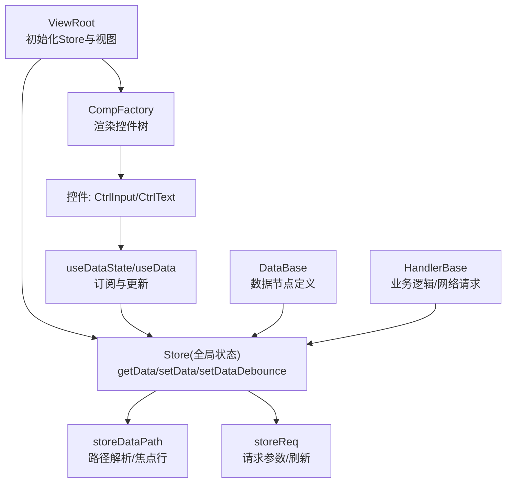
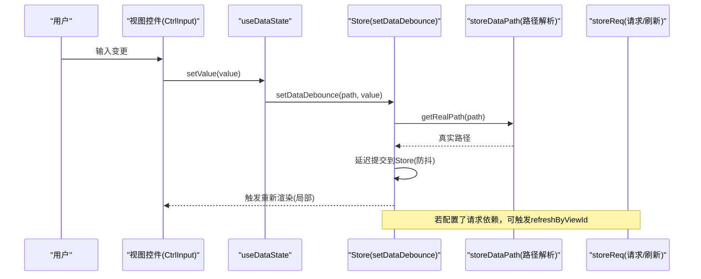
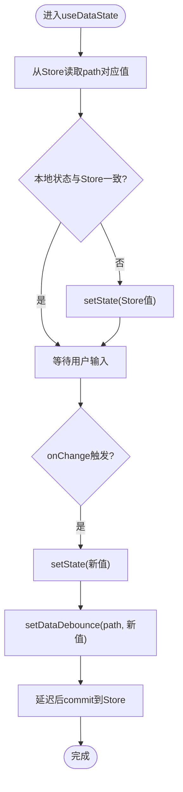
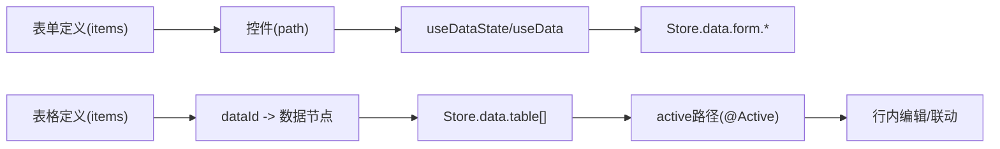
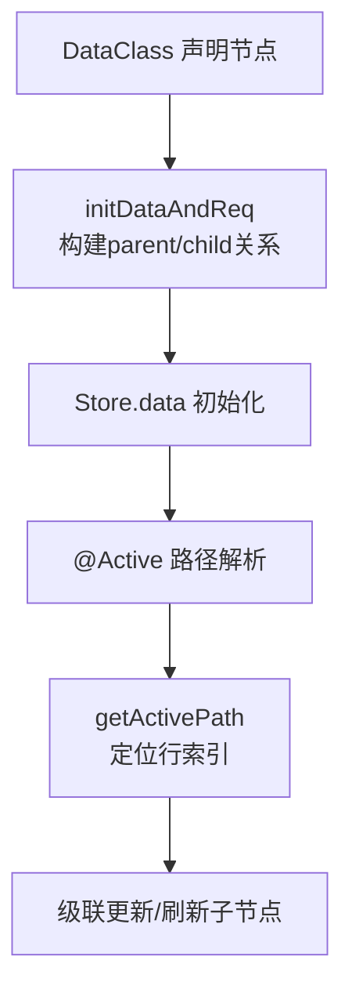
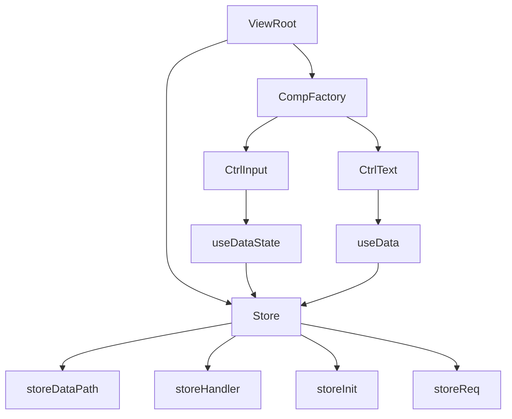

# 数据绑定

<cite>
**本文引用的文件**
- [ViewRoot.tsx](file://packages/framework/src/ViewRoot.tsx)
- [storeBase.ts](file://packages/framework/src/stores/store/storeBase.ts)
- [useValue.ts](file://packages/framework/src/stores/store/hooks/useValue.ts)
- [storeData.ts](file://packages/framework/src/stores/store/utils/storeData.ts)
- [storeDataPath.ts](file://packages/framework/src/stores/store/utils/storeDataPath.ts)
- [handlerBase.ts](file://packages/framework/src/handler/handlerBase.ts)
- [dataBase.ts](file://packages/framework/src/data/dataBase.ts)
- [viewPathUtils/index.ts](file://packages/framework/src/utils/viewPathUtils/index.ts)
- [ctrlInput.tsx](file://packages/framework/src/comp/control/input/ctrlInput.tsx)
- [ctrlText.tsx](file://packages/framework/src/comp/control/text/ctrlText.tsx)
- [form/view.tsx](file://apps/demo/src/pages/base/form/view.tsx)
- [table/view.tsx](file://apps/demo/src/pages/base/table/view.tsx)
- [table/data.tsx](file://apps/demo/src/pages/base/table/data.tsx)
- [form/handler.ts](file://apps/demo/src/pages/base/form/handler.ts)
- [table/handler.ts](file://apps/demo/src/pages/base/table/handler.ts)
</cite>

## 目录
1. [简介](#简介)
2. [项目结构](#项目结构)
3. [核心组件](#核心组件)
4. [架构总览](#架构总览)
5. [详细组件分析](#详细组件分析)
6. [依赖关系分析](#依赖关系分析)
7. [性能考虑](#性能考虑)
8. [故障排查指南](#故障排查指南)
9. [结论](#结论)
10. [附录：复杂场景示例](#附录复杂场景示例)

## 简介
本文件面向WMS Web项目的数据绑定机制，聚焦于双向数据绑定的实现原理与最佳实践。内容涵盖：
- useValue Hook 的工作机制与数据同步策略
- 视图层与状态层的数据映射（表单字段、表格数据）
- 数据验证与格式化机制（输入校验、输出转换）
- 数据依赖管理与级联更新
- 性能优化技巧（防抖、节流）
- 复杂数据绑定场景的代码示例路径

## 项目结构
本项目采用“视图-数据-处理器”三层分离的框架设计：
- 视图层：通过 ViewRoot 初始化 Store，并渲染具体页面组件；控件（如 Input、Text）通过 Hooks 读取和更新数据
- 状态层：基于 Zustand + immer 的全局 Store，提供 getData/setData/setDataDebounce 等能力
- 数据层：DataBase 抽象类定义数据节点及其请求参数，支持活动行路径引用与父子依赖
- 处理器层：HandlerBase 封装网络请求与状态操作，供视图调用

图表来源
- [ViewRoot.tsx:10-48](file://packages/framework/src/ViewRoot.tsx#L10-L48)
- [storeBase.ts:18-57](file://packages/framework/src/stores/store/storeBase.ts#L18-L57)
- [ctrlInput.tsx:9-22](file://packages/framework/src/comp/control/input/ctrlInput.tsx#L9-L22)
- [ctrlText.tsx:8-27](file://packages/framework/src/comp/control/text/ctrlText.tsx#L8-L27)
- [storeDataPath.ts:13-58](file://packages/framework/src/stores/store/utils/storeDataPath.ts#L13-L58)
- [storeReq.ts:1-47](file://packages/framework/src/stores/store/utils/storeReq.ts#L1-L47)

章节来源
- [ViewRoot.tsx:10-48](file://packages/framework/src/ViewRoot.tsx#L10-L48)
- [storeBase.ts:18-57](file://packages/framework/src/stores/store/storeBase.ts#L18-L57)

## 核心组件
- Store（全局状态）
  - 提供 setData/getData/setDataByFn/setDataDebounce 等方法，配合 immer 实现不可变更新
  - 暴露 refreshByViewId/getReqParams 等请求相关能力
- useValue Hooks
  - useDataState：本地缓存+防抖同步到 Store，适合高频输入
  - useDataStoreState：直接写入 Store，适合即时生效
  - useData：只读订阅，用于展示型控件
- DataBase
  - 声明数据节点（id/url/keyAttr/path），支持 active(viewId) 生成活动行路径引用
- HandlerBase
  - 统一封装 getData/setData/网络请求方法，便于在视图中调用

章节来源
- [storeBase.ts:18-57](file://packages/framework/src/stores/store/storeBase.ts#L18-L57)
- [useValue.ts:10-63](file://packages/framework/src/stores/store/hooks/useValue.ts#L10-L63)
- [dataBase.ts:4-15](file://packages/framework/src/data/dataBase.ts#L4-L15)
- [handlerBase.ts:10-47](file://packages/framework/src/handler/handlerBase.ts#L10-L47)

## 架构总览
下图展示了从用户交互到状态更新的完整链路，以及数据依赖与请求流程。

图表来源
- [ctrlInput.tsx:9-22](file://packages/framework/src/comp/control/input/ctrlInput.tsx#L9-L22)
- [useValue.ts:10-28](file://packages/framework/src/stores/store/hooks/useValue.ts#L10-L28)
- [storeData.ts:118-146](file://packages/framework/src/stores/store/utils/storeData.ts#L118-L146)
- [storeDataPath.ts:13-58](file://packages/framework/src/stores/store/utils/storeDataPath.ts#L13-L58)
- [storeBase.ts:43-52](file://packages/framework/src/stores/store/storeBase.ts#L43-L52)

## 详细组件分析

### useValue Hook 工作机制与数据同步策略
- useDataState
  - 使用本地安全状态保存当前值，避免频繁重渲染
  - 监听 Store 中对应路径的值变化，同步到本地状态
  - 写入时先更新本地状态，再通过 setDataDebounce 延迟写入 Store，减少状态抖动
- useDataStoreState
  - 直接调用 Store.setData，适用于需要立即落库或联动其他模块的场景
- useData
  - 仅订阅 Store 中的数据，用于只读展示

图表来源
- [useValue.ts:10-28](file://packages/framework/src/stores/store/hooks/useValue.ts#L10-L28)
- [storeData.ts:118-146](file://packages/framework/src/stores/store/utils/storeData.ts#L118-L146)

章节来源
- [useValue.ts:10-63](file://packages/framework/src/stores/store/hooks/useValue.ts#L10-L63)
- [storeData.ts:118-146](file://packages/framework/src/stores/store/utils/storeData.ts#L118-L146)

### 视图层与状态层的数据映射
- 表单字段绑定
  - 控件通过 path 指向 Store 中的具体字段，例如 form 下的 name、price 等
  - 输入控件（CtrlInput）使用 useDataState 实现双向绑定
  - 文本控件（CtrlText）使用 useData 进行只读展示
- 表格数据绑定
  - 表格项通过 items 配置字段映射，数据来源于 dataId 对应的数据节点
  - 可通过 PathKey.Active 与 DataBase.active(viewId) 获取当前选中行的数据路径，实现行内编辑联动

图表来源
- [form/view.tsx:11-87](file://apps/demo/src/pages/base/form/view.tsx#L11-L87)
- [table/view.tsx:5-83](file://apps/demo/src/pages/base/table/view.tsx#L5-L83)
- [table/data.tsx:3-19](file://apps/demo/src/pages/base/table/data.tsx#L3-L19)
- [ctrlInput.tsx:9-22](file://packages/framework/src/comp/control/input/ctrlInput.tsx#L9-L22)
- [ctrlText.tsx:8-27](file://packages/framework/src/comp/control/text/ctrlText.tsx#L8-L27)
- [dataBase.ts:4-15](file://packages/framework/src/data/dataBase.ts#L4-L15)
- [viewPathUtils/index.ts:4-9](file://packages/framework/src/utils/viewPathUtils/index.ts#L4-L9)

章节来源
- [form/view.tsx:11-87](file://apps/demo/src/pages/base/form/view.tsx#L11-L87)
- [table/view.tsx:5-83](file://apps/demo/src/pages/base/table/view.tsx#L5-L83)
- [table/data.tsx:3-19](file://apps/demo/src/pages/base/table/data.tsx#L3-L19)
- [ctrlInput.tsx:9-22](file://packages/framework/src/comp/control/input/ctrlInput.tsx#L9-L22)
- [ctrlText.tsx:8-27](file://packages/framework/src/comp/control/text/ctrlText.tsx#L8-L27)
- [dataBase.ts:4-15](file://packages/framework/src/data/dataBase.ts#L4-L15)
- [viewPathUtils/index.ts:4-9](file://packages/framework/src/utils/viewPathUtils/index.ts#L4-L9)

### 数据验证与格式化机制
- 输入校验
  - 建议在控件层（如 CtrlInput）对 onChange 事件做基础校验（空值、格式），再调用 setValue
  - 对于复杂规则，可在 Handler 中集中处理，并通过 setData 回写错误信息
- 输出转换
  - 展示型控件（CtrlText）可根据 sourceView 调整样式与显示格式
  - 时间/日期控件可通过 ctrl.format 等属性控制显示格式（参考时间控件接口）

章节来源
- [ctrlInput.tsx:9-22](file://packages/framework/src/comp/control/input/ctrlInput.tsx#L9-L22)
- [ctrlText.tsx:8-27](file://packages/framework/src/comp/control/text/ctrlText.tsx#L8-L27)
- [time/interface.tsx:4-25](file://packages/framework/src/comp/control/time/interface.tsx#L4-L25)

### 数据依赖管理与级联更新
- 数据节点依赖
  - 通过 DataProps.params.path 引用父节点，自动构建父子关系
  - 初始化时计算 parentIds/childIds，便于后续级联刷新
- 活动行路径
  - 使用 DataBase.active(viewId) 生成 @Active:viewId 路径，结合 storeDataPath 解析为实际索引路径
  - 表格与表单可通过活动行路径实现联动编辑

图表来源
- [storeData.ts:9-54](file://packages/framework/src/stores/store/utils/storeData.ts#L9-L54)
- [storeDataPath.ts:84-116](file://packages/framework/src/stores/store/utils/storeDataPath.ts#L84-L116)
- [dataBase.ts:4-15](file://packages/framework/src/data/dataBase.ts#L4-L15)
- [viewPathUtils/index.ts:4-9](file://packages/framework/src/utils/viewPathUtils/index.ts#L4-L9)

章节来源
- [storeData.ts:9-54](file://packages/framework/src/stores/store/utils/storeData.ts#L9-L54)
- [storeDataPath.ts:84-116](file://packages/framework/src/stores/store/utils/storeDataPath.ts#L84-L116)
- [dataBase.ts:4-15](file://packages/framework/src/data/dataBase.ts#L4-L15)
- [viewPathUtils/index.ts:4-9](file://packages/framework/src/utils/viewPathUtils/index.ts#L4-L9)

### 性能优化技巧（防抖与节流）
- 防抖
  - useDataState 默认通过 setDataDebounce 延迟写入 Store，降低频繁输入导致的重渲染开销
  - 防抖定时器按路径唯一键管理，重复输入会取消旧定时器
- 节流
  - 对于搜索、分页等场景，可在 Handler 中对网络请求进行节流（例如合并多次查询）
- 性能统计
  - getData 已接入 PerfTrackUtils，便于追踪调用次数与耗时

章节来源
- [useValue.ts:10-28](file://packages/framework/src/stores/store/hooks/useValue.ts#L10-L28)
- [storeData.ts:118-146](file://packages/framework/src/stores/store/utils/storeData.ts#L118-L146)
- [perfTrackerUtils.ts:1-77](file://packages/framework/src/utils/sysUtils/perfTrackerUtils.ts#L1-L77)

## 依赖关系分析
- Store 依赖
  - storeDataPath：路径解析、数据源选择、活动行定位
  - storeHandler：Handler 实例存取
  - storeInit：视图/数据/请求初始化
  - storeReq：请求参数与刷新
- 视图依赖
  - ViewRoot：创建并注入 Store，渲染 CompFactory
  - 控件：通过 useDataState/useData 订阅/更新 Store

图表来源
- [storeBase.ts:18-57](file://packages/framework/src/stores/store/storeBase.ts#L18-L57)
- [storeDataPath.ts:13-58](file://packages/framework/src/stores/store/utils/storeDataPath.ts#L13-L58)
- [storeHandler.ts:1-24](file://packages/framework/src/stores/store/utils/storeHandler.ts#L1-L24)
- [storeInit.ts:33-70](file://packages/framework/src/stores/store/utils/storeInit.ts#L33-L70)
- [storeReq.ts:1-47](file://packages/framework/src/stores/store/utils/storeReq.ts#L1-L47)
- [ViewRoot.tsx:10-48](file://packages/framework/src/ViewRoot.tsx#L10-L48)
- [ctrlInput.tsx:9-22](file://packages/framework/src/comp/control/input/ctrlInput.tsx#L9-L22)
- [ctrlText.tsx:8-27](file://packages/framework/src/comp/control/text/ctrlText.tsx#L8-L27)

章节来源
- [storeBase.ts:18-57](file://packages/framework/src/stores/store/storeBase.ts#L18-L57)
- [ViewRoot.tsx:10-48](file://packages/framework/src/ViewRoot.tsx#L10-L48)

## 性能考虑
- 优先使用 useDataState 进行高频输入，利用防抖减少 Store 更新频率
- 对只读展示使用 useData，避免不必要的本地状态维护
- 合理拆分数据节点，减少大范围状态更新的影响面
- 使用 PerfTrackUtils 监控关键函数（如 getData）的性能指标
- 对网络请求进行节流/去重，避免重复请求

[本节为通用指导，不直接分析具体文件]

## 故障排查指南
- 数据未更新
  - 检查 path 是否正确，是否包含特殊前缀（如 @Active）
  - 确认 useDataState/useDataStoreState 的使用场景是否合适
- 防抖导致延迟
  - 如需即时生效，改用 useDataStoreState 或直接调用 setData
- 活动行路径为空
  - 检查表格是否已选中行，确保 keyAttr 正确设置
- 请求未触发
  - 检查 DataProps.params.path 是否正确引用父节点
  - 使用 refreshByViewId 手动刷新

章节来源
- [useValue.ts:10-63](file://packages/framework/src/stores/store/hooks/useValue.ts#L10-L63)
- [storeDataPath.ts:13-58](file://packages/framework/src/stores/store/utils/storeDataPath.ts#L13-L58)
- [storeBase.ts:43-52](file://packages/framework/src/stores/store/storeBase.ts#L43-L52)

## 结论
本项目通过 Store + Hooks + 控件的组合实现了高效的双向数据绑定：
- 使用 useDataState 实现“本地缓存 + 防抖提交”，兼顾体验与性能
- 通过 DataBase.active 与路径解析工具，实现表格与表单的联动编辑
- 借助 Store 的统一 API，简化数据读写与请求管理
- 通过性能统计与合理的状态拆分，保障大规模数据场景下的稳定性

[本节为总结性内容，不直接分析具体文件]

## 附录：复杂场景示例
以下示例展示如何在表单与表格组合场景中实现复杂数据绑定：
- 表单字段绑定
  - 在表单 view 中定义 items，每个 field 对应 Store.data.form 下的字段
  - 使用 Ctrl.Input 等控件，自动双向绑定
- 表格数据绑定
  - 在 table view 中配置 items 与 dataId，数据来自 Store.data.table[]
  - 通过 mainFormData 的 path 使用 DataBase.active(mainTable.id) 绑定到当前选中行
- 处理器联动
  - 在 handler 中调用 setData(['form', 'model'], ...) 或发起网络请求
  - 使用 printStats/resetStats 观察 getData 使用情况

示例路径
- 表单视图与数据定义：[form/view.tsx:11-87](file://apps/demo/src/pages/base/form/view.tsx#L11-L87)、[form/data.tsx:1-10](file://apps/demo/src/pages/base/form/data.tsx#L1-L10)
- 表格视图与数据定义：[table/view.tsx:5-83](file://apps/demo/src/pages/base/table/view.tsx#L5-L83)、[table/data.tsx:3-19](file://apps/demo/src/pages/base/table/data.tsx#L3-L19)
- 处理器示例：[form/handler.ts:1-18](file://apps/demo/src/pages/base/form/handler.ts#L1-L18)、[table/handler.ts:1-30](file://apps/demo/src/pages/base/table/handler.ts#L1-L30)

章节来源
- [form/view.tsx:11-87](file://apps/demo/src/pages/base/form/view.tsx#L11-L87)
- [table/view.tsx:5-83](file://apps/demo/src/pages/base/table/view.tsx#L5-L83)
- [table/data.tsx:3-19](file://apps/demo/src/pages/base/table/data.tsx#L3-L19)
- [form/handler.ts:1-18](file://apps/demo/src/pages/base/form/handler.ts#L1-L18)
- [table/handler.ts:1-30](file://apps/demo/src/pages/base/table/handler.ts#L1-L30)