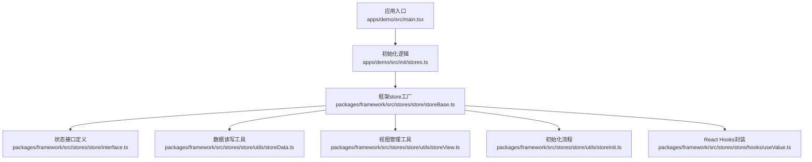
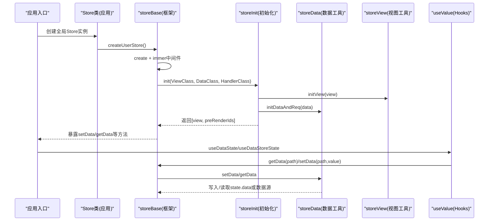
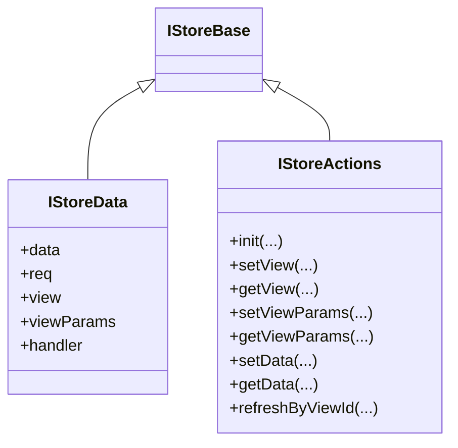
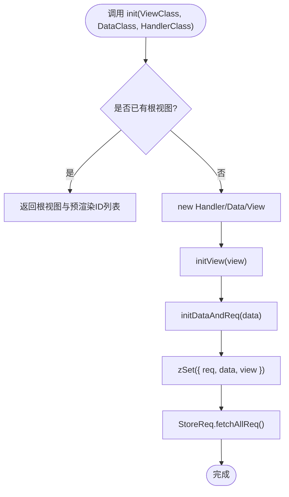
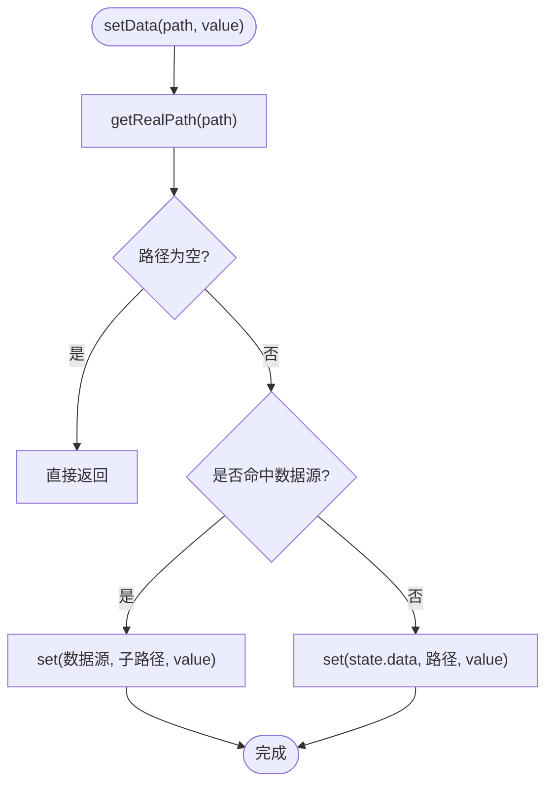
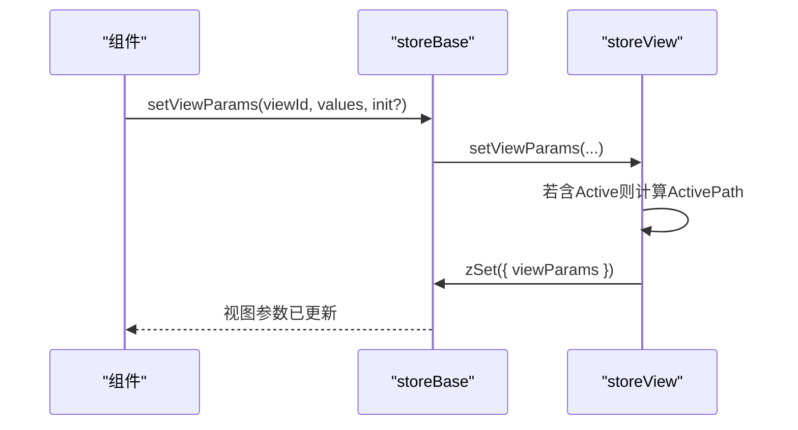
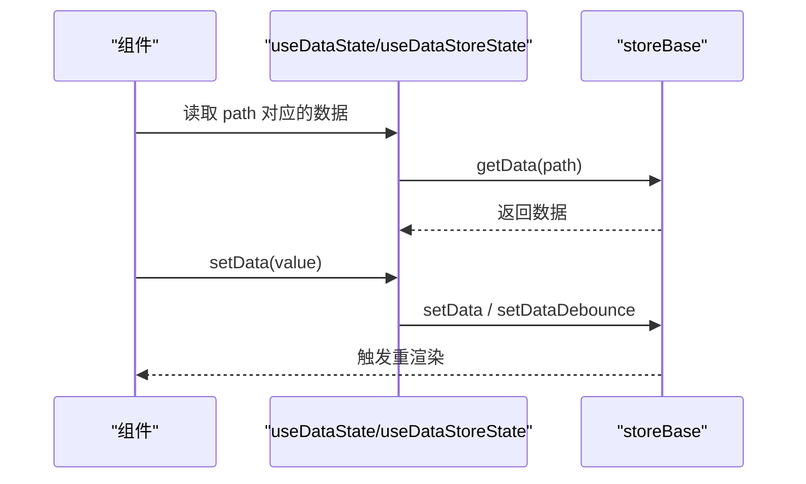
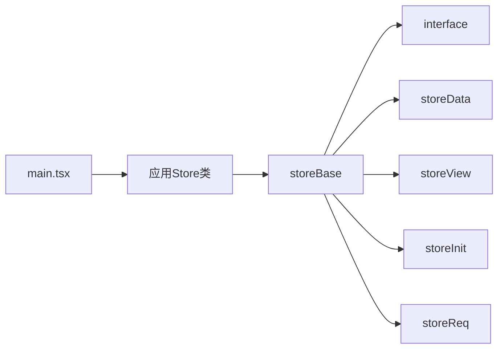

# 状态管理

<cite>
**本文引用的文件**
- [apps/demo/src/init/stores.ts](file://apps/demo/src/init/stores.ts)
- [packages/framework/src/stores/store/storeBase.ts](file://packages/framework/src/stores/store/storeBase.ts)
- [packages/framework/src/stores/store/interface.ts](file://packages/framework/src/stores/store/interface.ts)
- [packages/framework/src/stores/store/utils/storeData.ts](file://packages/framework/src/stores/store/utils/storeData.ts)
- [packages/framework/src/stores/store/utils/storeInit.ts](file://packages/framework/src/stores/store/utils/storeInit.ts)
- [packages/framework/src/stores/store/utils/storeView.ts](file://packages/framework/src/stores/store/utils/storeView.ts)
- [packages/framework/src/stores/store/hooks/useValue.ts](file://packages/framework/src/stores/store/hooks/useValue.ts)
- [packages/framework/src/interface.ts](file://packages/framework/src/interface.ts)
- [apps/demo/src/main.tsx](file://apps/demo/src/main.tsx)
</cite>

## 目录
1. [简介](#简介)
2. [项目结构](#项目结构)
3. [核心组件](#核心组件)
4. [架构总览](#架构总览)
5. [详细组件分析](#详细组件分析)
6. [依赖关系分析](#依赖关系分析)
7. [性能考虑](#性能考虑)
8. [故障排查指南](#故障排查指南)
9. [结论](#结论)
10. [附录](#附录)

## 简介
本文件面向WMS Web项目的状态管理，聚焦基于Zustand的框架化实现。内容涵盖：
- store的创建与初始化流程
- 状态结构设计（数据、视图、请求、处理器）
- 状态更新机制（setData、getData、setDataByFn、setDataDebounce等）
- immer中间件的作用与不可变更新实践
- 状态持久化与缓存策略建议
- 性能优化技巧（状态分割、按需加载、防抖更新）
- 自定义store的创建与使用示例路径

## 项目结构
仓库采用monorepo组织，应用层在apps/demo，通用能力在packages/framework。状态管理核心位于framework的stores模块，应用通过统一的Store类暴露createUserStore工厂方法，便于在各页面/布局中复用。

图表来源
- [apps/demo/src/main.tsx:1-53](file://apps/demo/src/main.tsx#L1-L53)
- [apps/demo/src/init/stores.ts:1-11](file://apps/demo/src/init/stores.ts#L1-L11)
- [packages/framework/src/stores/store/storeBase.ts:1-58](file://packages/framework/src/stores/store/storeBase.ts#L1-L58)
- [packages/framework/src/stores/store/interface.ts:1-133](file://packages/framework/src/stores/store/interface.ts#L1-L133)
- [packages/framework/src/stores/store/utils/storeData.ts:1-147](file://packages/framework/src/stores/store/utils/storeData.ts#L1-L147)
- [packages/framework/src/stores/store/utils/storeView.ts:1-128](file://packages/framework/src/stores/store/utils/storeView.ts#L1-L128)
- [packages/framework/src/stores/store/utils/storeInit.ts:1-71](file://packages/framework/src/stores/store/utils/storeInit.ts#L1-L71)
- [packages/framework/src/stores/store/hooks/useValue.ts:1-64](file://packages/framework/src/stores/store/hooks/useValue.ts#L1-L64)

章节来源
- [apps/demo/src/main.tsx:1-53](file://apps/demo/src/main.tsx#L1-L53)
- [apps/demo/src/init/stores.ts:1-11](file://apps/demo/src/init/stores.ts#L1-L11)

## 核心组件
- 基础store工厂：基于Zustand create并启用immer中间件，统一提供data、req、view、viewParams、handler以及一系列操作方法。
- 状态接口：定义IStoreBase（数据、请求、视图、参数、处理器）与IStoreActions（init、set/get视图、set/get数据、刷新请求等）。
- 数据工具：getData/setData/setDataByFn/setDataDebounce，支持路径解析、数据源路由、防抖更新。
- 视图工具：initView/setView/getView及视图参数批量设置，自动计算焦点路径等。
- 初始化流程：initStore负责实例化Handler/Data/View，构建视图树与数据请求图，触发初始请求。
- React Hooks：useDataState/useDataStoreState/useData/useDataById，封装读取与更新，结合防抖提升交互体验。

章节来源
- [packages/framework/src/stores/store/storeBase.ts:1-58](file://packages/framework/src/stores/store/storeBase.ts#L1-L58)
- [packages/framework/src/stores/store/interface.ts:1-133](file://packages/framework/src/stores/store/interface.ts#L1-L133)
- [packages/framework/src/stores/store/utils/storeData.ts:1-147](file://packages/framework/src/stores/store/utils/storeData.ts#L1-L147)
- [packages/framework/src/stores/store/utils/storeView.ts:1-128](file://packages/framework/src/stores/store/utils/storeView.ts#L1-L128)
- [packages/framework/src/stores/store/utils/storeInit.ts:1-71](file://packages/framework/src/stores/store/utils/storeInit.ts#L1-L71)
- [packages/framework/src/stores/store/hooks/useValue.ts:1-64](file://packages/framework/src/stores/store/hooks/useValue.ts#L1-L64)

## 架构总览
下图展示从应用入口到store初始化、数据读写、视图管理的整体调用链。

图表来源
- [apps/demo/src/main.tsx:1-53](file://apps/demo/src/main.tsx#L1-L53)
- [apps/demo/src/init/stores.ts:1-11](file://apps/demo/src/init/stores.ts#L1-L11)
- [packages/framework/src/stores/store/storeBase.ts:1-58](file://packages/framework/src/stores/store/storeBase.ts#L1-L58)
- [packages/framework/src/stores/store/utils/storeInit.ts:1-71](file://packages/framework/src/stores/store/utils/storeInit.ts#L1-L71)
- [packages/framework/src/stores/store/utils/storeData.ts:1-147](file://packages/framework/src/stores/store/utils/storeData.ts#L1-L147)
- [packages/framework/src/stores/store/utils/storeView.ts:1-128](file://packages/framework/src/stores/store/utils/storeView.ts#L1-L128)
- [packages/framework/src/stores/store/hooks/useValue.ts:1-64](file://packages/framework/src/stores/store/hooks/useValue.ts#L1-L64)

## 详细组件分析

### 状态结构与类型设计
- IStoreData：包含data、req、view、viewParams、handler五大块，分别承载业务数据、请求配置、视图实例、视图参数、视图处理器。
- IStoreActions：定义init、视图CRUD、数据读写、请求刷新等动作。
- PathKey/ParamKey：统一的路径与参数键约定，如@Data、@Req、@View、Active、Select等，用于跨组件共享上下文。

图表来源
- [packages/framework/src/stores/store/interface.ts:1-133](file://packages/framework/src/stores/store/interface.ts#L1-L133)

章节来源
- [packages/framework/src/stores/store/interface.ts:1-133](file://packages/framework/src/stores/store/interface.ts#L1-L133)

### store创建与初始化
- 应用层通过Store类暴露createUserStore<User, MenuItem>()，集中管理store实例。
- 框架层storeBase以create+immer创建store，挂载data、req、view、viewParams、handler默认值，并绑定init、set/get视图、set/get数据、刷新请求等方法。
- initStore负责：
  - 首次初始化时创建Handler/Data/View实例
  - 构建视图树（initView）
  - 解析数据节点与请求依赖（initDataAndReq）
  - 将view/data/req写入store
  - 触发所有初始化请求（fetchAllReq）

图表来源
- [packages/framework/src/stores/store/utils/storeInit.ts:1-71](file://packages/framework/src/stores/store/utils/storeInit.ts#L1-L71)
- [packages/framework/src/stores/store/storeBase.ts:1-58](file://packages/framework/src/stores/store/storeBase.ts#L1-L58)

章节来源
- [apps/demo/src/init/stores.ts:1-11](file://apps/demo/src/init/stores.ts#L1-L11)
- [packages/framework/src/stores/store/storeBase.ts:1-58](file://packages/framework/src/stores/store/storeBase.ts#L1-L58)
- [packages/framework/src/stores/store/utils/storeInit.ts:1-71](file://packages/framework/src/stores/store/utils/storeInit.ts#L1-L71)

### 数据读写与不可变更新
- getData：根据DPath解析真实路径，优先走数据源（如按id映射），再读取state.data或指定子路径。
- setData：将value写入对应路径；若命中数据源则写入数据源对象，否则写入state.data。
- setDataByFn：以函数形式获取当前值进行变更，适合复杂合并场景。
- setDataDebounce：对同一path的多次快速更新进行防抖，减少频繁重渲染。
- immer中间件：在set回调中以“可变形式”修改state，内部自动产生不可变快照，避免手动展开拷贝。

图表来源
- [packages/framework/src/stores/store/utils/storeData.ts:1-147](file://packages/framework/src/stores/store/utils/storeData.ts#L1-L147)
- [packages/framework/src/stores/store/storeBase.ts:1-58](file://packages/framework/src/stores/store/storeBase.ts#L1-L58)

章节来源
- [packages/framework/src/stores/store/utils/storeData.ts:1-147](file://packages/framework/src/stores/store/utils/storeData.ts#L1-L147)
- [packages/framework/src/stores/store/storeBase.ts:1-58](file://packages/framework/src/stores/store/storeBase.ts#L1-L58)

### 视图与参数管理
- initView：扫描视图实例属性，收集带id/type的组件，建立以id为键的视图字典，并处理数组路径中的特殊引用。
- setView/getView：按viewId存取视图实例。
- setViewParams/getViewParams：批量或单项设置视图参数；当设置焦点（Active）时，自动计算ActivePath。
- 这些操作均通过immer安全地更新state.view与state.viewParams。

图表来源
- [packages/framework/src/stores/store/utils/storeView.ts:1-128](file://packages/framework/src/stores/store/utils/storeView.ts#L1-L128)
- [packages/framework/src/stores/store/storeBase.ts:1-58](file://packages/framework/src/stores/store/storeBase.ts#L1-L58)

章节来源
- [packages/framework/src/stores/store/utils/storeView.ts:1-128](file://packages/framework/src/stores/store/utils/storeView.ts#L1-L128)

### React Hooks封装与使用
- useDataState：本地缓存+防抖更新，适合表单输入等高频场景。
- useDataStoreState：直接同步更新store，适合即时生效的场景。
- useData/useDataById：只读订阅，最小化重渲染。
- 这些hooks通过StoreContext获取useStore，并以选择器方式订阅具体字段，提高性能。

图表来源
- [packages/framework/src/stores/store/hooks/useValue.ts:1-64](file://packages/framework/src/stores/store/hooks/useValue.ts#L1-L64)
- [packages/framework/src/stores/store/storeBase.ts:1-58](file://packages/framework/src/stores/store/storeBase.ts#L1-L58)

章节来源
- [packages/framework/src/stores/store/hooks/useValue.ts:1-64](file://packages/framework/src/stores/store/hooks/useValue.ts#L1-L64)

### 应用层Store类与集成
- 应用层定义Store类，静态属性user通过createUserStore<User, MenuItem>()创建，集中导出供各模块使用。
- main.tsx作为应用入口，负责路由与全局Provider，配合init流程完成启动。

章节来源
- [apps/demo/src/init/stores.ts:1-11](file://apps/demo/src/init/stores.ts#L1-L11)
- [apps/demo/src/main.tsx:1-53](file://apps/demo/src/main.tsx#L1-L53)
- [packages/framework/src/interface.ts:1-35](file://packages/framework/src/interface.ts#L1-L35)

## 依赖关系分析
- storeBase依赖：
  - interface：IStoreBase/IStoreActions等类型
  - storeData：数据读写与防抖
  - storeView：视图与参数管理
  - storeInit：初始化流程
  - storeReq：请求相关（由initStore调用）
- 应用层依赖：
  - stores.ts：暴露统一Store类
  - main.tsx：应用启动与路由

图表来源
- [packages/framework/src/stores/store/storeBase.ts:1-58](file://packages/framework/src/stores/store/storeBase.ts#L1-L58)
- [packages/framework/src/stores/store/interface.ts:1-133](file://packages/framework/src/stores/store/interface.ts#L1-L133)
- [apps/demo/src/init/stores.ts:1-11](file://apps/demo/src/init/stores.ts#L1-L11)
- [apps/demo/src/main.tsx:1-53](file://apps/demo/src/main.tsx#L1-L53)

章节来源
- [packages/framework/src/stores/store/storeBase.ts:1-58](file://packages/framework/src/stores/store/storeBase.ts#L1-L58)
- [packages/framework/src/stores/store/interface.ts:1-133](file://packages/framework/src/stores/store/interface.ts#L1-L133)
- [apps/demo/src/init/stores.ts:1-11](file://apps/demo/src/init/stores.ts#L1-L11)
- [apps/demo/src/main.tsx:1-53](file://apps/demo/src/main.tsx#L1-L53)

## 性能考虑
- 使用immer中间件：以可变写法更新状态，内部生成不可变快照，避免浅比较失效导致的过度渲染。
- 选择器订阅：hooks中使用选择器仅订阅所需字段，降低重渲染范围。
- 防抖更新：高频输入使用setDataDebounce，减少不必要的store更新与渲染。
- 状态分割：按功能域拆分store（如用户、菜单、表格状态），避免单一大store带来的耦合与更新风暴。
- 按需加载：视图与数据请求延迟初始化，仅在进入页面或触发条件时加载，减少首屏开销。
- 数据源路由：通过getData/setData的数据源机制，将不同模块的数据隔离存储，局部更新更精准。

## 故障排查指南
- 未确认的viewId：访问不存在的视图会抛出错误，检查传入的viewId是否正确。
- 重复数据请求初始化：若存在重复id的请求定义，会跳过并输出警告，需去重或调整id。
- 父节点不存在：数据请求依赖的父节点缺失时会警告，需确保依赖顺序正确。
- 路径为空：setData/getData传入空路径会被忽略，检查DPath构造是否正确。
- 防抖定时器泄漏：同一路径多次更新会取消旧定时器，无需手动清理。

章节来源
- [packages/framework/src/stores/store/utils/storeView.ts:38-45](file://packages/framework/src/stores/store/utils/storeView.ts#L38-L45)
- [packages/framework/src/stores/store/utils/storeData.ts:14-24](file://packages/framework/src/stores/store/utils/storeData.ts#L14-L24)
- [packages/framework/src/stores/store/utils/storeData.ts:26-51](file://packages/framework/src/stores/store/utils/storeData.ts#L26-L51)
- [packages/framework/src/stores/store/utils/storeData.ts:70-89](file://packages/framework/src/stores/store/utils/storeData.ts#L70-L89)
- [packages/framework/src/stores/store/utils/storeData.ts:118-147](file://packages/framework/src/stores/store/utils/storeData.ts#L118-L147)

## 结论
该状态管理方案以Zustand为核心，结合immer实现不可变更新，并通过框架化的storeBase、storeData、storeView、storeInit等模块，提供了统一的数据、视图、请求管理能力。应用层只需通过Store类暴露的工厂方法即可快速集成。推荐在实践中遵循状态分割、按需加载、防抖更新与选择器订阅等最佳实践，以获得更好的可维护性与性能表现。

## 附录
- 自定义store创建与使用示例路径
  - 应用层Store类与工厂方法：[apps/demo/src/init/stores.ts:1-11](file://apps/demo/src/init/stores.ts#L1-L11)
  - 框架store工厂与动作绑定：[packages/framework/src/stores/store/storeBase.ts:1-58](file://packages/framework/src/stores/store/storeBase.ts#L1-L58)
  - 状态接口定义（IStoreBase/IStoreActions）：[packages/framework/src/stores/store/interface.ts:1-133](file://packages/framework/src/stores/store/interface.ts#L1-L133)
  - 数据读写与防抖：[packages/framework/src/stores/store/utils/storeData.ts:1-147](file://packages/framework/src/stores/store/utils/storeData.ts#L1-L147)
  - 视图与参数管理：[packages/framework/src/stores/store/utils/storeView.ts:1-128](file://packages/framework/src/stores/store/utils/storeView.ts#L1-L128)
  - 初始化流程：[packages/framework/src/stores/store/utils/storeInit.ts:1-71](file://packages/framework/src/stores/store/utils/storeInit.ts#L1-L71)
  - React Hooks封装：[packages/framework/src/stores/store/hooks/useValue.ts:1-64](file://packages/framework/src/stores/store/hooks/useValue.ts#L1-L64)
  - 应用入口与路由集成：[apps/demo/src/main.tsx:1-53](file://apps/demo/src/main.tsx#L1-L53)