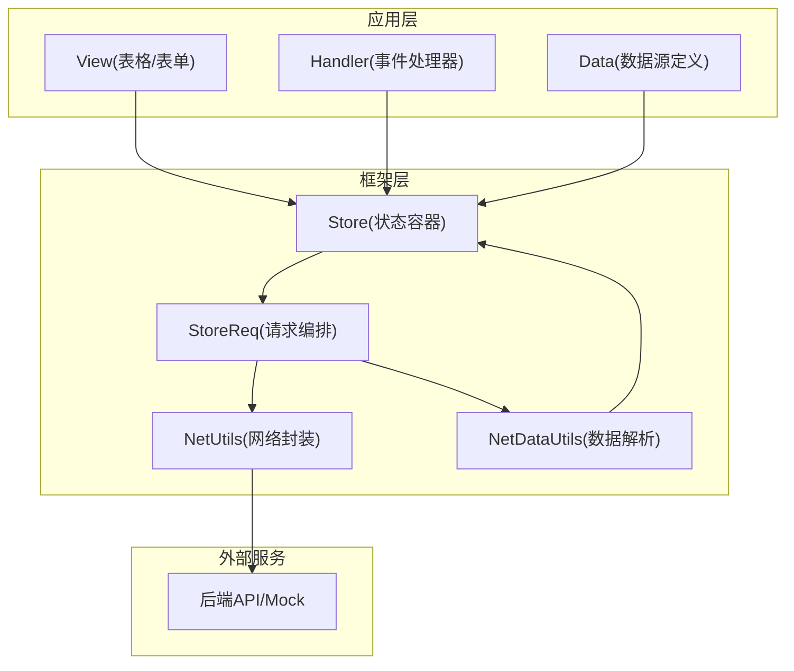
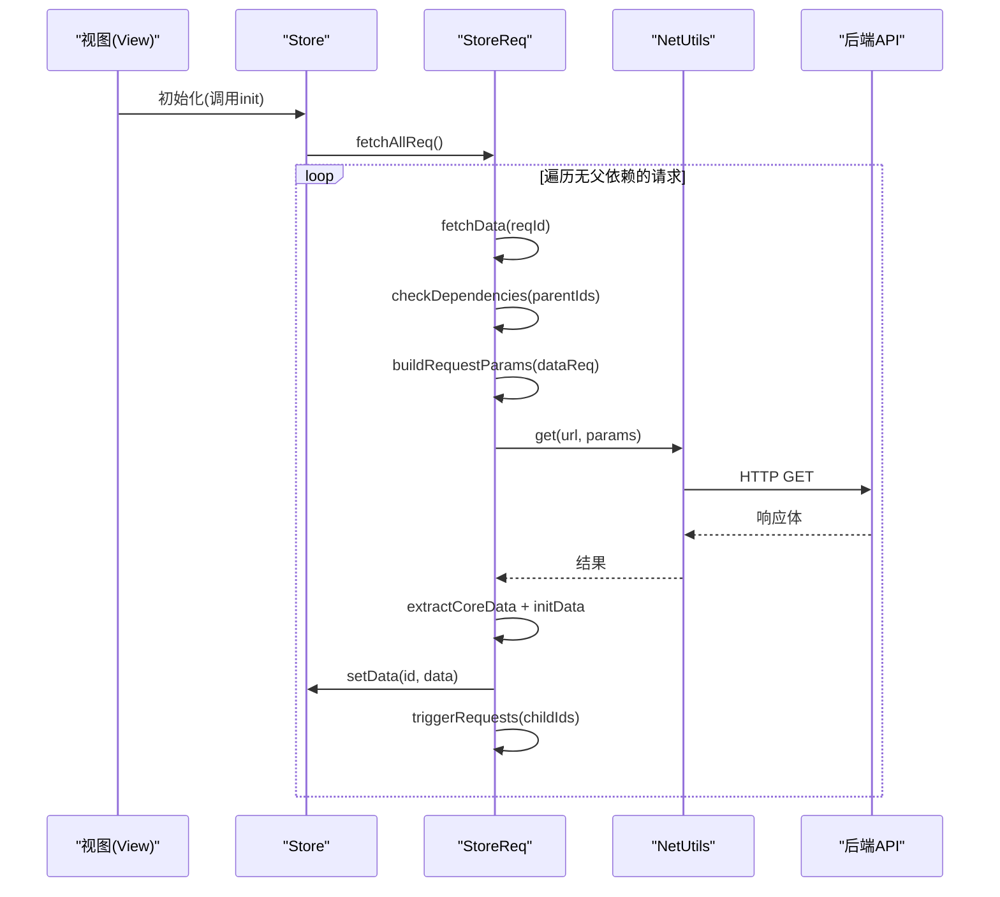
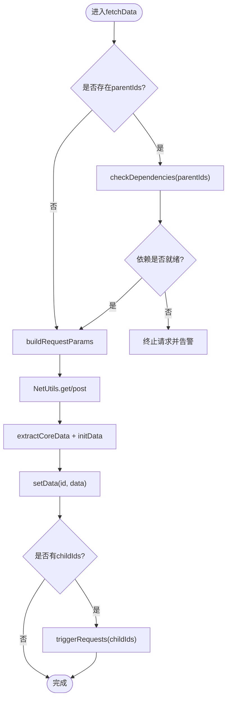
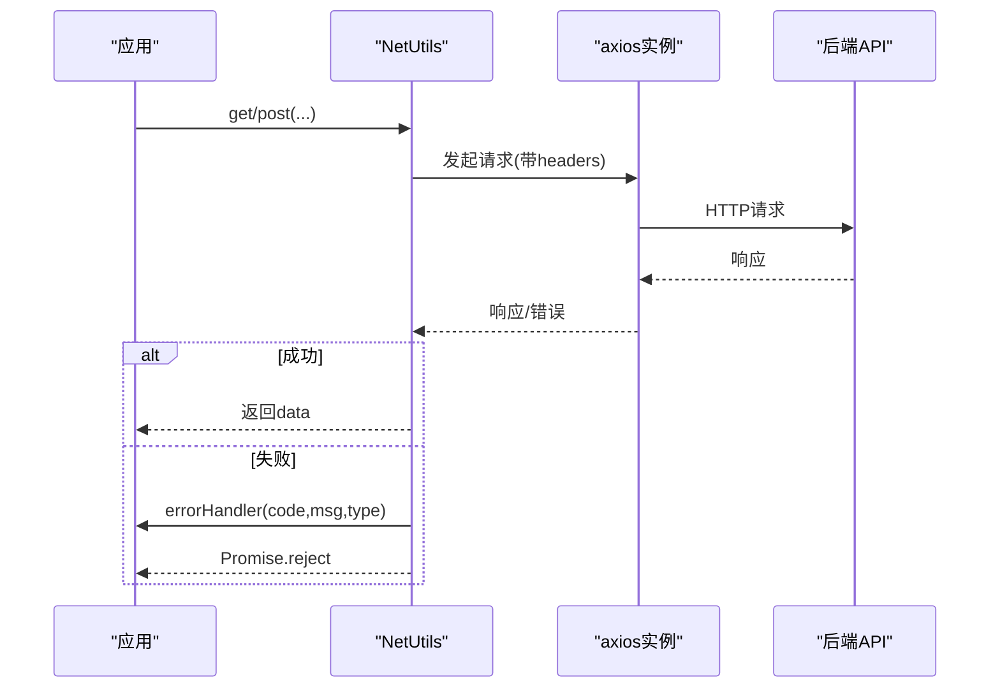
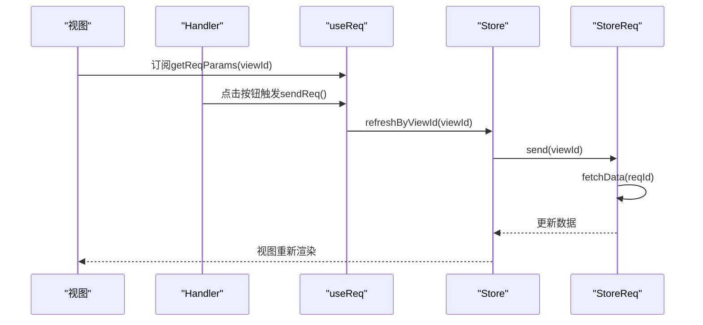
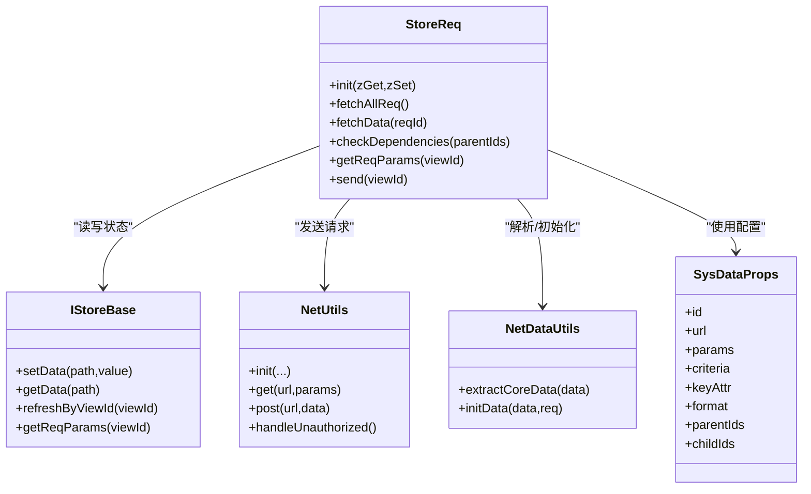

# 请求生命周期

<cite>
**本文引用的文件**
- [storeReq.ts](file://packages/framework/src/stores/store/utils/storeReq.ts)
- [netDataUtils.ts](file://packages/framework/src/utils/netUtils/netDataUtils.ts)
- [index.ts](file://packages/framework/src/utils/netUtils/index.ts)
- [interface.ts](file://packages/framework/src/data/interface.ts)
- [interface.ts](file://packages/framework/src/stores/store/interface.ts)
- [useReq.ts](file://packages/framework/src/stores/store/hooks/useReq.ts)
- [storeBase.ts](file://packages/framework/src/stores/store/storeBase.ts)
- [storeInit.ts](file://packages/framework/src/stores/store/utils/storeInit.ts)
- [handlerViewBase.ts](file://packages/framework/src/handler/handlerViewBase.ts)
- [perfTrackerUtils.ts](file://packages/framework/src/utils/sysUtils/perfTrackerUtils.ts)
- [data.tsx](file://apps/demo/src/pages/base/table/data.tsx)
- [view.tsx](file://apps/demo/src/pages/base/table/view.tsx)
- [handler.ts](file://apps/demo/src/pages/base/table/handler.ts)
- [net.ts](file://apps/demo/src/init/net.ts)
</cite>

## 目录
1. [简介](#简介)
2. [项目结构](#项目结构)
3. [核心组件](#核心组件)
4. [架构总览](#架构总览)
5. [详细组件分析](#详细组件分析)
6. [依赖关系分析](#依赖关系分析)
7. [性能与并发](#性能与并发)
8. [故障排查指南](#故障排查指南)
9. [结论](#结论)
10. [附录：复杂数据请求示例](#附录复杂数据请求示例)

## 简介
本文面向WMS Web项目的请求生命周期，系统化阐述从触发请求到数据返回的完整流程，覆盖请求发起、拦截处理、响应处理、错误处理、StoreReq实现原理（参数管理、依赖检查、子节点级联）、视图绑定（自动/手动刷新）、去重与缓存策略、监控与调试工具，以及复杂数据请求场景的实践方法。

## 项目结构
- 框架层位于 packages/framework，提供 Store、StoreReq、NetUtils、数据工具等能力
- 应用示例位于 apps/demo，展示页面级 Data/View/Handler 的组合使用
- 初始化入口在 apps/demo/src/init，负责网络配置与全局错误处理

图表来源
- [storeInit.ts:33-49](file://packages/framework/src/stores/store/utils/storeInit.ts#L33-L49)
- [storeReq.ts:58-93](file://packages/framework/src/stores/store/utils/storeReq.ts#L58-L93)
- [index.ts:23-72](file://packages/framework/src/utils/netUtils/index.ts#L23-L72)
- [netDataUtils.ts:33-112](file://packages/framework/src/utils/netUtils/netDataUtils.ts#L33-L112)

章节来源
- [storeInit.ts:33-49](file://packages/framework/src/stores/store/utils/storeInit.ts#L33-L49)
- [storeBase.ts:44-53](file://packages/framework/src/stores/store/storeBase.ts#L44-L53)

## 核心组件
- StoreReq：负责根据视图关联的请求配置，构建参数、校验依赖、发送请求、格式化并落库，触发子节点请求
- NetUtils：基于 axios 的网络封装，统一注入 Token、超时、拦截器与错误处理
- NetDataUtils：对接口返回进行“核心数据”提取与 Key 值初始化
- Store：提供 setData/getData、视图/处理器存取、请求参数读取与刷新入口
- useReq Hook：为视图提供获取当前请求参数、手动刷新、重置参数的便捷方法

章节来源
- [storeReq.ts:10-208](file://packages/framework/src/stores/store/utils/storeReq.ts#L10-L208)
- [index.ts:6-117](file://packages/framework/src/utils/netUtils/index.ts#L6-L117)
- [netDataUtils.ts:31-112](file://packages/framework/src/utils/netUtils/netDataUtils.ts#L31-L112)
- [storeBase.ts:44-53](file://packages/framework/src/stores/store/storeBase.ts#L44-L53)
- [useReq.ts:9-37](file://packages/framework/src/stores/store/hooks/useReq.ts#L9-L37)

## 架构总览
下图展示了从 View/Data 定义到 Store 初始化、再到 StoreReq 编排请求、NetUtils 执行网络请求、最终数据回写 Store 的完整链路。

图表来源
- [storeInit.ts:33-49](file://packages/framework/src/stores/store/utils/storeInit.ts#L33-L49)
- [storeReq.ts:58-190](file://packages/framework/src/stores/store/utils/storeReq.ts#L58-L190)
- [index.ts:23-72](file://packages/framework/src/utils/netUtils/index.ts#L23-L72)

## 详细组件分析

### StoreReq 类：请求编排与数据流
- 参数管理
  - 通过 view.path 定位 store.req 中的具体请求配置
  - 合并 criteria 与 params 映射，支持从 store.data 中按路径取值填充
- 依赖检查
  - 若存在 parentIds，先确保父级数据就绪；否则延迟或中止当前请求
- 请求执行
  - 调用 NetUtils.get/post 等发送请求
  - 使用 NetDataUtils.extractCoreData 提取核心数据与分页/激活等视图参数
  - 使用 NetDataUtils.initData 为对象/数组项设置稳定 key
  - 将数据写入 store.data[req.id]，并将 params 写入 store.req[req.id].params
- 级联触发
  - 若配置 childIds，则在成功后顺序触发子请求
- 手动刷新
  - send(viewId) 通过 viewId 反查对应 req 并复用 fetchData

图表来源
- [storeReq.ts:71-190](file://packages/framework/src/stores/store/utils/storeReq.ts#L71-L190)

章节来源
- [storeReq.ts:27-208](file://packages/framework/src/stores/store/utils/storeReq.ts#L27-L208)
- [interface.ts:21-37](file://packages/framework/src/data/interface.ts#L21-L37)

### NetUtils：网络层与错误处理
- 初始化
  - 创建 axios 实例，设置 baseURL、timeout
  - 注册请求拦截器：注入 Authorization 头，缺失时调用 errorHandler
  - 注册响应拦截器：统一捕获异常并调用 errorHandler
- 登录与鉴权
  - login 获取 token 并持久化
  - handleUnauthorized 清理 token 并跳转登录
- 常用方法
  - get/post/put/delete 封装，返回统一 Result 结构

图表来源
- [index.ts:23-72](file://packages/framework/src/utils/netUtils/index.ts#L23-L72)
- [index.ts:107-113](file://packages/framework/src/utils/netUtils/index.ts#L107-L113)

章节来源
- [index.ts:23-117](file://packages/framework/src/utils/netUtils/index.ts#L23-L117)
- [net.ts:5-17](file://apps/demo/src/init/net.ts#L5-L17)

### NetDataUtils：数据解析与Key生成
- 核心数据提取
  - 识别 @dataSource/@list 作为数据主体
  - 识别 @pagination/@active 作为视图参数
  - 若无特殊标记，默认整体作为数据
- Key 初始化
  - 优先使用 req.keyAttr（字符串或字段组合）
  - 其次尝试 id/key/code 等常见主键字段
  - 最后生成唯一 key，保证列表渲染稳定性

章节来源
- [netDataUtils.ts:33-112](file://packages/framework/src/utils/netUtils/netDataUtils.ts#L33-L112)

### Store 与视图绑定：自动/手动刷新
- 自动刷新
  - Store 初始化后调用 StoreReq.fetchAllReq，仅触发无父依赖的请求
  - 子请求由父请求成功后按 childIds 顺序触发
- 手动刷新
  - 通过 useReq 暴露的 sendReq 或 Store.refreshByViewId 触发指定视图的请求
  - 可结合 PathKey.Req 修改请求参数后再刷新

图表来源
- [useReq.ts:9-37](file://packages/framework/src/stores/store/hooks/useReq.ts#L9-L37)
- [storeBase.ts:49-53](file://packages/framework/src/stores/store/storeBase.ts#L49-L53)
- [storeReq.ts:196-207](file://packages/framework/src/stores/store/utils/storeReq.ts#L196-L207)

章节来源
- [storeInit.ts:33-49](file://packages/framework/src/stores/store/utils/storeInit.ts#L33-L49)
- [useReq.ts:9-37](file://packages/framework/src/stores/store/hooks/useReq.ts#L9-L37)
- [storeBase.ts:44-53](file://packages/framework/src/stores/store/storeBase.ts#L44-L53)

### 请求去重与缓存策略
- 去重
  - 当前实现未显式维护“进行中请求”的去重集合；同一 reqId 短时间内多次触发可能产生重复请求
  - 建议扩展：在 fetchData 前以 reqId 为键缓存 Promise，并在完成后清理
- 缓存
  - 数据落库于 store.data[req.id]，后续可通过 path 引用避免重复请求（如 mainFormData 通过 active 路径引用）
  - 适合读多写少、数据稳定的场景

章节来源
- [data.tsx:15-18](file://apps/demo/src/pages/base/table/data.tsx#L15-L18)

### 监控与调试工具
- 性能统计
  - PerfTrackUtils：包装函数并记录调用次数、耗时、异常次数等
  - printStats/resetStats：打印或清零统计信息
- 使用方式
  - 在关键数据处理或请求前后包装函数，便于定位瓶颈
  - 在 Handler 中调用 printStats/resetStats 查看 getData 等方法的统计

章节来源
- [perfTrackerUtils.ts:40-154](file://packages/framework/src/utils/sysUtils/perfTrackerUtils.ts#L40-L154)
- [handler.ts:12-18](file://apps/demo/src/pages/base/table/handler.ts#L12-L18)

## 依赖关系分析
- StoreReq 依赖
  - IStoreBase：用于读写 store 状态
  - NetUtils：发送网络请求
  - NetDataUtils：解析与初始化数据
  - SysDataProps：描述请求配置（url、params、criteria、keyAttr、format、parentIds、childIds）
- Store 暴露
  - setData/getData、refreshByViewId、getReqParams 等能力供上层使用
- 视图与数据绑定
  - View 通过 dataId 绑定 Data 定义的请求
  - Data 通过 path 引用其他数据，形成级联

图表来源
- [storeReq.ts:10-208](file://packages/framework/src/stores/store/utils/storeReq.ts#L10-L208)
- [index.ts:6-117](file://packages/framework/src/utils/netUtils/index.ts#L6-L117)
- [netDataUtils.ts:31-112](file://packages/framework/src/utils/netUtils/netDataUtils.ts#L31-L112)
- [interface.ts:21-37](file://packages/framework/src/data/interface.ts#L21-L37)
- [interface.ts:74-133](file://packages/framework/src/stores/store/interface.ts#L74-L133)

章节来源
- [interface.ts:21-37](file://packages/framework/src/data/interface.ts#L21-L37)
- [interface.ts:74-133](file://packages/framework/src/stores/store/interface.ts#L74-L133)

## 性能与并发
- 并发控制
  - 当前子请求按 childIds 顺序 await 触发，避免并行风暴
  - 建议在 fetchData 中加入“进行中”队列，防止同一 reqId 重复请求
- 防抖更新
  - setDataDebounce 对高频状态更新进行节流，减少渲染抖动
- 性能追踪
  - 使用 PerfTrackUtils 包装热点函数，配合 printStats 观察指标

章节来源
- [storeReq.ts:186-190](file://packages/framework/src/stores/store/utils/storeReq.ts#L186-L190)
- [storeData.ts:125-146](file://packages/framework/src/stores/store/utils/storeData.ts#L125-L146)
- [perfTrackerUtils.ts:40-154](file://packages/framework/src/utils/sysUtils/perfTrackerUtils.ts#L40-L154)

## 故障排查指南
- 未授权/Token 缺失
  - 请求拦截器会调用 errorHandler，应用侧需处理 401 并跳转登录
- 接口异常
  - 响应拦截器统一捕获错误码与消息，便于集中提示
- 依赖未就绪
  - checkDependencies 会尝试拉取父数据，若仍为空则中止并告警
- 数据未更新
  - 确认 view.path 是否正确指向 store.req 中的配置
  - 确认 params/criteria 是否被正确构建与提交

章节来源
- [index.ts:40-69](file://packages/framework/src/utils/netUtils/index.ts#L40-L69)
- [storeReq.ts:79-112](file://packages/framework/src/stores/store/utils/storeReq.ts#L79-L112)

## 结论
本项目通过 StoreReq 将“视图-数据-请求”解耦，借助 NetUtils 统一网络层，NetDataUtils 标准化数据形态，形成清晰的生命周期：初始化→依赖检查→参数构建→网络请求→数据解析→状态落库→子级级联→视图渲染。配合 useReq Hook 与 Store 暴露的刷新能力，可实现灵活的自动/手动刷新。建议在现有基础上补充请求去重与更完善的缓存策略，并结合性能追踪工具持续优化。

## 附录：复杂数据请求示例
以下示例演示如何定义多级数据依赖、参数联动与手动刷新：

- 数据定义
  - 主表数据 mainTable：id=table，url=/demo/base/table，keyAttr=id
  - 表单数据 mainForm：id=form，url=/demo/base/form
  - 详情数据 mainFormData：id=formData，path=[DataBase.active(mainTable.id)]，表示跟随主表选中行变化而刷新

- 视图绑定
  - table1 绑定 mainTable 的数据
  - form1 绑定 mainFormData 的数据，并通过工具栏按钮触发 Handler 中的操作

- 手动刷新
  - 在 Handler 中调用 post/get 直接发起请求，或通过 useReq.sendReq 刷新指定视图

- 监控
  - 使用 printStats/resetStats 观察 getData 等方法的调用情况

章节来源
- [data.tsx:3-18](file://apps/demo/src/pages/base/table/data.tsx#L3-L18)
- [view.tsx:5-83](file://apps/demo/src/pages/base/table/view.tsx#L5-L83)
- [handler.ts:1-27](file://apps/demo/src/pages/base/table/handler.ts#L1-L27)
- [useReq.ts:9-37](file://packages/framework/src/stores/store/hooks/useReq.ts#L9-L37)