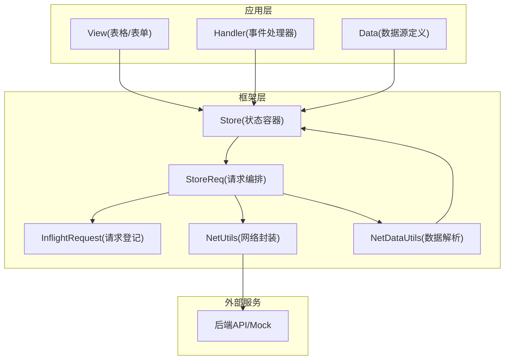
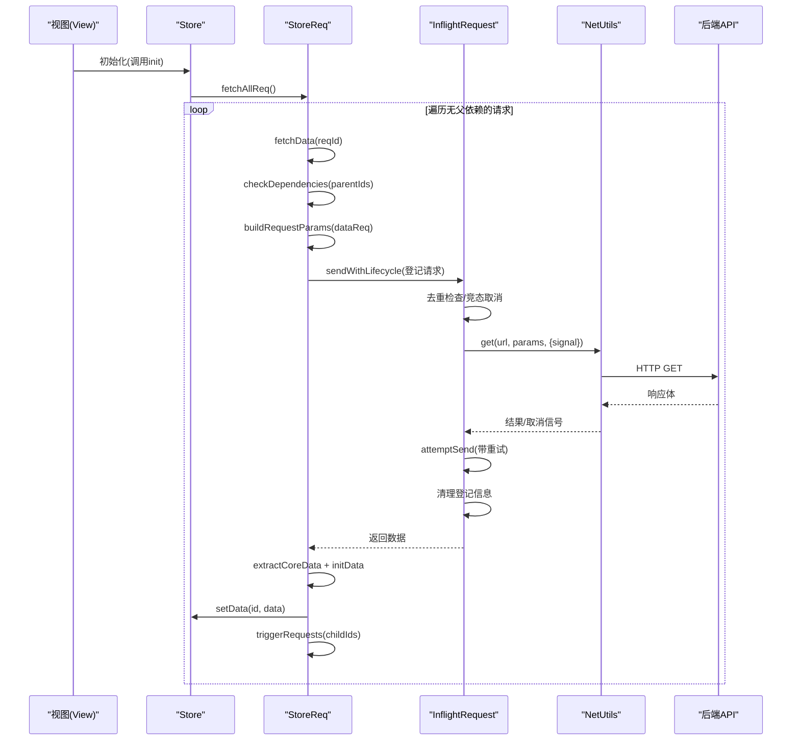
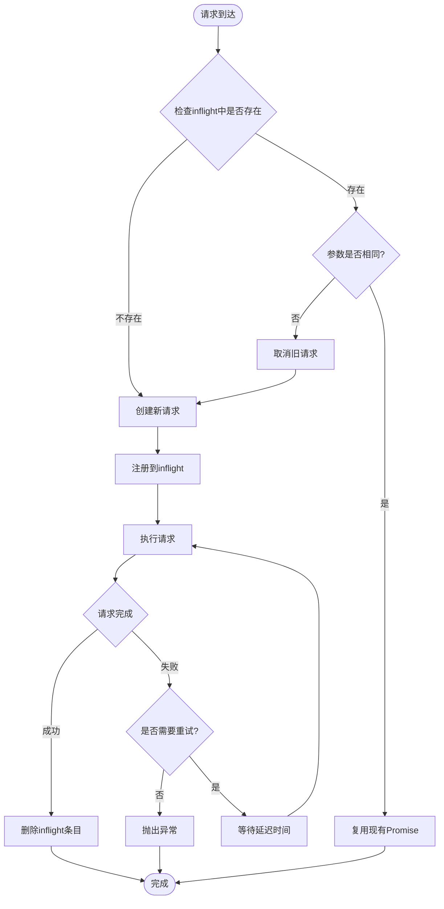
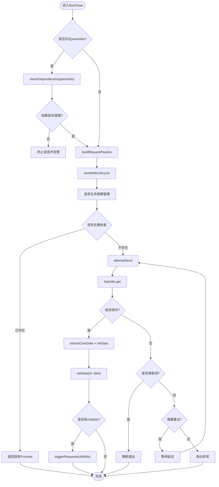
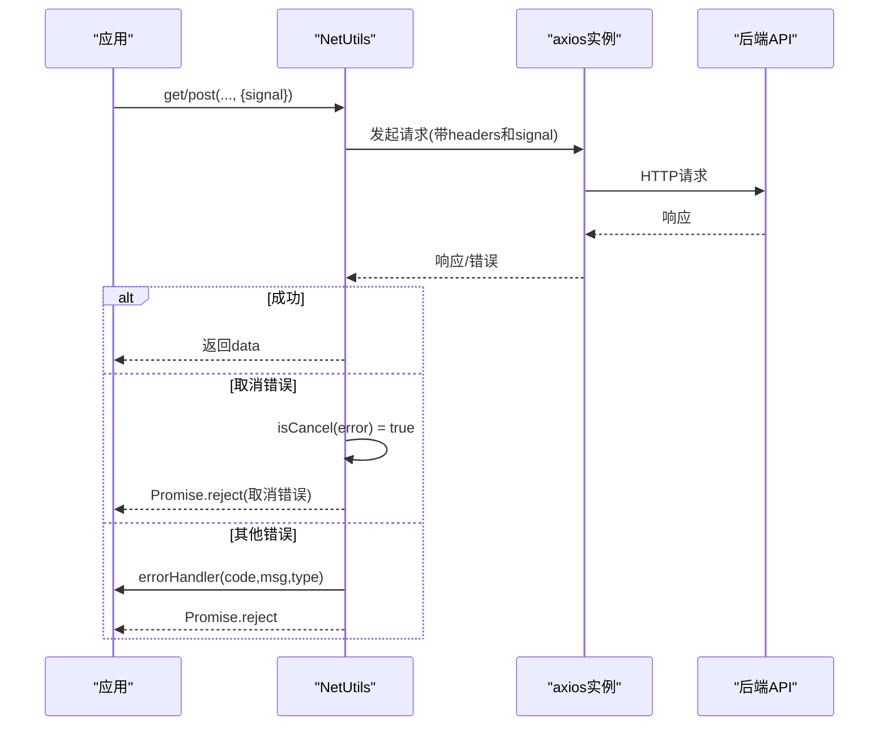
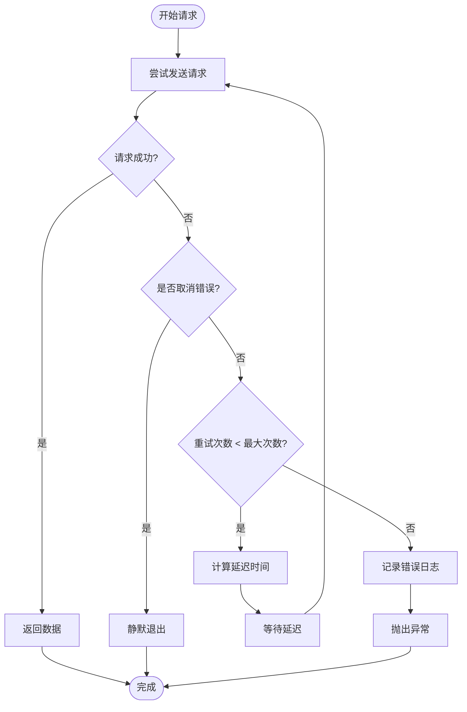
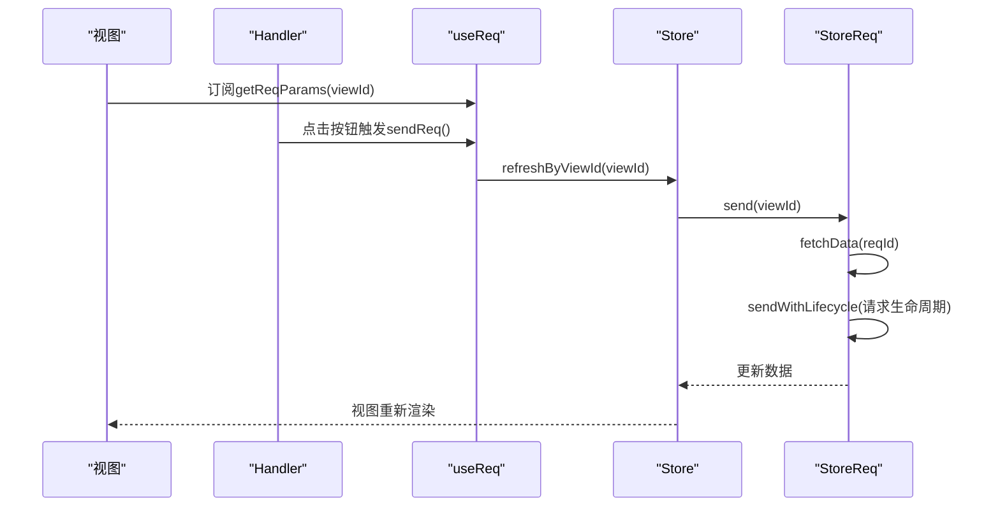
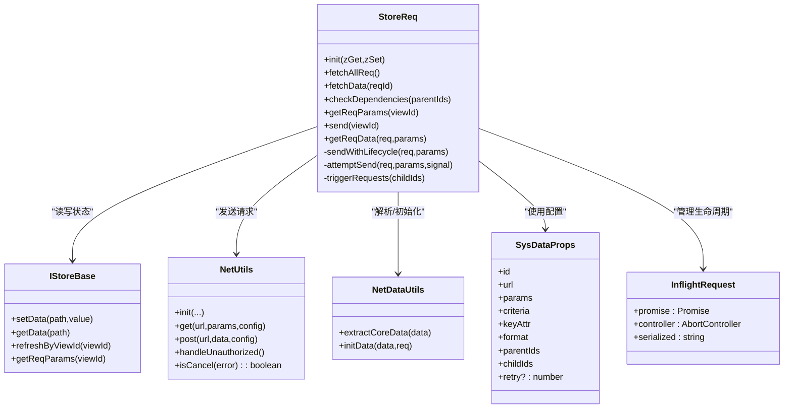

# 请求生命周期

<cite>
**本文引用的文件**
- [storeReq.ts](file://packages/framework/src/stores/store/utils/storeReq.ts)
- [netDataUtils.ts](file://packages/framework/src/utils/netUtils/netDataUtils.ts)
- [index.ts](file://packages/framework/src/utils/netUtils/index.ts)
- [interface.ts](file://packages/framework/src/data/interface.ts)
- [interface.ts](file://packages/framework/src/stores/store/interface.ts)
- [useReq.ts](file://packages/framework/src/stores/store/hooks/useReq.ts)
- [storeBase.ts](file://packages/framework/src/stores/store/storeBase.ts)
- [storeInit.ts](file://packages/framework/src/stores/store/utils/storeInit.ts)
- [handlerViewBase.ts](file://packages/framework/src/handler/handlerViewBase.ts)
- [perfTrackerUtils.ts](file://packages/framework/src/utils/sysUtils/perfTrackerUtils.ts)
- [data.tsx](file://apps/demo/src/pages/base/table/data.tsx)
- [view.tsx](file://apps/demo/src/pages/base/table/view.tsx)
- [handler.ts](file://apps/demo/src/pages/base/table/handler.ts)
- [net.ts](file://apps/demo/src/init/net.ts)
</cite>

## 更新摘要
**变更内容**
- 新增 InflightRequest 接口实现请求去重与竞态处理
- 实现指数退避重试机制，支持配置化重试次数和延迟策略
- 增强请求生命周期管理，包含请求登记、取消控制和资源清理
- 优化并发控制，防止重复请求和资源竞争

## 目录
1. [简介](#简介)
2. [项目结构](#项目结构)
3. [核心组件](#核心组件)
4. [架构总览](#架构总览)
5. [详细组件分析](#详细组件分析)
6. [依赖关系分析](#依赖关系分析)
7. [性能与并发](#性能与并发)
8. [故障排查指南](#故障排查指南)
9. [结论](#结论)
10. [附录：复杂数据请求示例](#附录复杂数据请求示例)

## 简介
本文面向WMS Web项目的请求生命周期，系统化阐述从触发请求到数据返回的完整流程，覆盖请求发起、拦截处理、响应处理、错误处理、StoreReq实现原理（参数管理、依赖检查、子节点级联）、视图绑定（自动/手动刷新）、**增强的请求去重与缓存策略**、监控与调试工具，以及复杂数据请求场景的实践方法。

**最新更新**：系统新增了InflightRequest接口，实现了智能的请求去重、竞态处理和指数退避重试机制，大幅提升了请求管理的健壮性和性能。

## 项目结构
- 框架层位于 packages/framework，提供 Store、StoreReq、NetUtils、数据工具等能力
- 应用示例位于 apps/demo，展示页面级 Data/View/Handler 的组合使用
- 初始化入口在 apps/demo/src/init，负责网络配置与全局错误处理

**图表来源**
- [storeReq.ts:11-28](file://packages/framework/src/stores/store/utils/storeReq.ts#L11-L28)
- [storeInit.ts:33-49](file://packages/framework/src/stores/store/utils/storeInit.ts#L33-L49)
- [storeReq.ts:58-93](file://packages/framework/src/stores/store/utils/storeReq.ts#L58-L93)
- [index.ts:23-72](file://packages/framework/src/utils/netUtils/index.ts#L23-L72)
- [netDataUtils.ts:33-112](file://packages/framework/src/utils/netUtils/netDataUtils.ts#L33-L112)

## 核心组件
- **StoreReq**：负责根据视图关联的请求配置，构建参数、校验依赖、发送请求、格式化并落库，触发子节点请求，**新增请求生命周期管理**
- **InflightRequest**：**新增接口**，用于跟踪进行中的请求，实现请求去重、竞态处理和资源清理
- **NetUtils**：基于 axios 的网络封装，统一注入 Token、超时、拦截器与错误处理，**支持请求取消信号**
- **NetDataUtils**：对接口返回进行"核心数据"提取与 Key 值初始化
- **Store**：提供 setData/getData、视图/处理器存取、请求参数读取与刷新入口
- **useReq Hook**：为视图提供获取当前请求参数、手动刷新、重置参数的便捷方法

**章节来源**
- [storeReq.ts:10-287](file://packages/framework/src/stores/store/utils/storeReq.ts#L10-L287)
- [index.ts:6-148](file://packages/framework/src/utils/netUtils/index.ts#L6-L148)
- [netDataUtils.ts:31-112](file://packages/framework/src/utils/netUtils/netDataUtils.ts#L31-L112)
- [storeBase.ts:44-53](file://packages/framework/src/stores/store/storeBase.ts#L44-L53)
- [useReq.ts:9-37](file://packages/framework/src/stores/store/hooks/useReq.ts#L9-L37)

## 架构总览
下图展示了从 View/Data 定义到 Store 初始化、再到 StoreReq 编排请求、**增强的请求生命周期管理**、NetUtils 执行网络请求、最终数据回写 Store 的完整链路。

**图表来源**
- [storeInit.ts:33-49](file://packages/framework/src/stores/store/utils/storeInit.ts#L33-L49)
- [storeReq.ts:58-287](file://packages/framework/src/stores/store/utils/storeReq.ts#L58-L287)
- [index.ts:23-72](file://packages/framework/src/utils/netUtils/index.ts#L23-L72)

## 详细组件分析

### InflightRequest 接口：请求去重与竞态处理
**新增功能**：InflightRequest 接口是本次更新的核心，提供了完整的请求生命周期管理能力。

- **数据结构**
  - `promise`：共享的请求 Promise，相同参数的并发请求复用同一实例
  - `controller`：AbortController 实例，用于新请求取代旧请求时的取消操作
  - `serialized`：请求参数的 JSON 序列化结果，用于判断并发请求是否相同

- **请求去重机制**
  - 通过 Map<string, InflightRequest> 存储进行中的请求
  - 以 req.id 作为键，确保同一数据节点的请求唯一性
  - 比较序列化后的参数，仅当参数完全相同时才复用 Promise

- **竞态处理**
  - 新请求到来时，如果存在未完成的旧请求且参数不同，立即调用 abort() 取消旧请求
  - 使用 AbortSignal 传递取消信号给底层网络请求
  - 被取消的请求静默退出，不触发后续的数据处理和子请求

**图表来源**
- [storeReq.ts:203-229](file://packages/framework/src/stores/store/utils/storeReq.ts#L203-L229)
- [storeReq.ts:235-259](file://packages/framework/src/stores/store/utils/storeReq.ts#L235-L259)

**章节来源**
- [storeReq.ts:11-28](file://packages/framework/src/stores/store/utils/storeReq.ts#L11-L28)
- [storeReq.ts:203-229](file://packages/framework/src/stores/store/utils/storeReq.ts#L203-L229)

### StoreReq 类：增强的请求编排与数据流
**更新功能**：集成了 InflightRequest 的生命周期管理，提供更健壮的请求处理能力。

- **参数管理**
  - 通过 view.path 定位 store.req 中的具体请求配置
  - 合并 criteria 与 params 映射，支持从 store.data 中按路径取值填充
- **依赖检查**
  - 若存在 parentIds，先确保父级数据就绪；否则延迟或中止当前请求
- **增强的请求执行**
  - 调用 NetUtils.get/post 等发送请求，支持 AbortSignal
  - 使用 NetDataUtils.extractCoreData 提取核心数据与分页/激活等视图参数
  - 使用 NetDataUtils.initData 为对象/数组项设置稳定 key
  - 将数据写入 store.data[req.id]，并将 params 写入 store.req[req.id].params
- **级联触发**
  - 若配置 childIds，则在成功后顺序触发子请求
- **手动刷新**
  - send(viewId) 通过 viewId 反查对应 req 并复用 fetchData
- **重试机制**
  - 支持配置 retry 字段控制重试次数
  - 线性递增延迟：300ms、600ms、900ms...
  - 区分正常错误和取消错误，取消错误不计数

**图表来源**
- [storeReq.ts:87-109](file://packages/framework/src/stores/store/utils/storeReq.ts#L87-L109)
- [storeReq.ts:160-197](file://packages/framework/src/stores/store/utils/storeReq.ts#L160-L197)
- [storeReq.ts:203-259](file://packages/framework/src/stores/store/utils/storeReq.ts#L203-L259)

**章节来源**
- [storeReq.ts:24-287](file://packages/framework/src/stores/store/utils/storeReq.ts#L24-L287)
- [interface.ts:21-37](file://packages/framework/src/data/interface.ts#L21-L37)

### NetUtils：增强的网络层与错误处理
**更新功能**：支持请求取消信号，完善竞态处理机制。

- **初始化**
  - 创建 axios 实例，设置 baseURL、timeout
  - 注册请求拦截器：注入 Authorization 头，缺失时调用 errorHandler
  - 注册响应拦截器：统一捕获异常并调用 errorHandler，**特殊处理取消请求**
- **登录与鉴权**
  - login 获取 token 并持久化
  - handleUnauthorized 清理 token 并跳转登录
- **增强的常用方法**
  - get/post/put/delete 封装，返回统一 Result 结构，**支持传入 signal 参数**
  - isCancel 方法检测是否为取消错误
- **取消处理**
  - 响应拦截器中识别 axios.isCancel 错误，直接透传不触发全局错误处理
  - 支持 AbortController 的信号传递

**图表来源**
- [index.ts:23-72](file://packages/framework/src/utils/netUtils/index.ts#L23-L72)
- [index.ts:114-116](file://packages/framework/src/utils/netUtils/index.ts#L114-L116)
- [index.ts:124-130](file://packages/framework/src/utils/netUtils/index.ts#L124-L130)

**章节来源**
- [index.ts:23-148](file://packages/framework/src/utils/netUtils/index.ts#L23-L148)
- [net.ts:5-17](file://apps/demo/src/init/net.ts#L5-L17)

### 指数退避重试机制
**新增功能**：实现了可配置的指数退避重试策略。

- **重试配置**
  - 通过 SysDataProps.retry 字段配置最大重试次数
  - 默认值为 0，表示不重试
  - 最小值为 0，通过 Math.max(0, req.retry ?? 0) 确保

- **延迟策略**
  - 基础延迟 RETRY_BASE_DELAY = 300ms
  - 线性递增：第1次重试300ms，第2次600ms，第3次900ms...
  - 公式：RETRY_BASE_DELAY * (attempt + 1)

- **错误分类处理**
  - 取消错误：通过 NetUtils.isCancel 识别，静默退出不计数
  - 网络错误：记录警告日志并重试
  - 达到最大重试次数：记录错误日志并抛出异常

**图表来源**
- [storeReq.ts:235-259](file://packages/framework/src/stores/store/utils/storeReq.ts#L235-L259)
- [interface.ts:18-19](file://packages/framework/src/data/interface.ts#L18-L19)

**章节来源**
- [storeReq.ts:8-9](file://packages/framework/src/stores/store/utils/storeReq.ts#L8-L9)
- [storeReq.ts:235-259](file://packages/framework/src/stores/store/utils/storeReq.ts#L235-L259)
- [interface.ts:18-19](file://packages/framework/src/data/interface.ts#L18-L19)

### NetDataUtils：数据解析与Key生成
- **核心数据提取**
  - 识别 @dataSource/@list 作为数据主体
  - 识别 @pagination/@active 作为视图参数
  - 若无特殊标记，默认整体作为数据
- **Key 初始化**
  - 优先使用 req.keyAttr（字符串或字段组合）
  - 其次尝试 id/key/code 等常见主键字段
  - 最后生成唯一 key，保证列表渲染稳定性

**章节来源**
- [netDataUtils.ts:33-112](file://packages/framework/src/utils/netUtils/netDataUtils.ts#L33-L112)

### Store 与视图绑定：自动/手动刷新
- **自动刷新**
  - Store 初始化后调用 StoreReq.fetchAllReq，仅触发无父依赖的请求
  - 子请求由父请求成功后按 childIds 顺序触发
- **手动刷新**
  - 通过 useReq 暴露的 sendReq 或 Store.refreshByViewId 触发指定视图的请求
  - 可结合 PathKey.Req 修改请求参数后再刷新

**图表来源**
- [useReq.ts:9-37](file://packages/framework/src/stores/store/hooks/useReq.ts#L9-L37)
- [storeBase.ts:49-53](file://packages/framework/src/stores/store/storeBase.ts#L49-L53)
- [storeReq.ts:275-286](file://packages/framework/src/stores/store/utils/storeReq.ts#L275-L286)

**章节来源**
- [storeInit.ts:33-49](file://packages/framework/src/stores/store/utils/storeInit.ts#L33-L49)
- [useReq.ts:9-37](file://packages/framework/src/stores/store/hooks/useReq.ts#L9-L37)
- [storeBase.ts:44-53](file://packages/framework/src/stores/store/storeBase.ts#L44-L53)

### 增强的请求去重与缓存策略
**重大更新**：实现了完整的请求去重和竞态处理机制。

- **智能去重**
  - 基于 InflightRequest 接口的 Map 存储，按 req.id 索引进行中的请求
  - 通过 JSON.stringify(params) 序列化参数，精确匹配相同参数的并发请求
  - 相同参数的请求直接复用 Promise，避免重复网络请求

- **竞态处理**
  - 新请求到来时，如果存在未完成的旧请求且参数不同，立即调用 AbortController.abort()
  - 使用 AbortSignal 传递取消信号，底层网络请求会优雅地停止
  - 被取消的请求静默退出，不触发数据处理和子请求链

- **资源管理**
  - 请求完成后通过 finally 钩子清理 in flight 登记
  - 仅在登记未被更新的请求覆盖时才删除条目，防止误删
  - 内存泄漏防护：所有进行中的请求都会被正确清理

- **传统缓存**
  - 数据落库于 store.data[req.id]，后续可通过 path 引用避免重复请求（如 mainFormData 通过 active 路径引用）
  - 适合读多写少、数据稳定的场景

**章节来源**
- [storeReq.ts:27-28](file://packages/framework/src/stores/store/utils/storeReq.ts#L27-L28)
- [storeReq.ts:203-229](file://packages/framework/src/stores/store/utils/storeReq.ts#L203-L229)
- [data.tsx:15-18](file://apps/demo/src/pages/base/table/data.tsx#L15-L18)

### 监控与调试工具
- **性能统计**
  - PerfTrackUtils：包装函数并记录调用次数、耗时、异常次数等
  - printStats/resetStats：打印或清零统计信息
- **使用方式**
  - 在关键数据处理或请求前后包装函数，便于定位瓶颈
  - 在 Handler 中调用 printStats/resetStats 查看 getData 等方法的统计

**章节来源**
- [perfTrackerUtils.ts:40-154](file://packages/framework/src/utils/sysUtils/perfTrackerUtils.ts#L40-L154)
- [handler.ts:12-18](file://apps/demo/src/pages/base/table/handler.ts#L12-L18)

## 依赖关系分析
- **StoreReq 依赖**
  - IStoreBase：用于读写 store 状态
  - NetUtils：发送网络请求，**支持请求取消信号**
  - NetDataUtils：解析与初始化数据
  - SysDataProps：描述请求配置（url、params、criteria、keyAttr、format、parentIds、childIds、**retry**）
  - **InflightRequest：新增的接口，用于请求生命周期管理**
- **Store 暴露**
  - setData/getData、refreshByViewId、getReqParams 等能力供上层使用
- **视图与数据绑定**
  - View 通过 dataId 绑定 Data 定义的请求
  - Data 通过 path 引用其他数据，形成级联

**图表来源**
- [storeReq.ts:24-287](file://packages/framework/src/stores/store/utils/storeReq.ts#L24-L287)
- [storeReq.ts:11-19](file://packages/framework/src/stores/store/utils/storeReq.ts#L11-L19)
- [index.ts:6-148](file://packages/framework/src/utils/netUtils/index.ts#L6-L148)
- [netDataUtils.ts:31-112](file://packages/framework/src/utils/netUtils/netDataUtils.ts#L31-L112)
- [interface.ts:21-37](file://packages/framework/src/data/interface.ts#L21-L37)
- [interface.ts:74-133](file://packages/framework/src/stores/store/interface.ts#L74-L133)

**章节来源**
- [interface.ts:21-37](file://packages/framework/src/data/interface.ts#L21-L37)
- [interface.ts:74-133](file://packages/framework/src/stores/store/interface.ts#L74-L133)

## 性能与并发
- **并发控制**
  - 当前子请求按 childIds 顺序 await 触发，避免并行风暴
  - **新增 InflightRequest 机制**：防止同一 reqId 重复请求，支持竞态取消
  - 通过 AbortController 优雅地取消不必要的请求，节省网络资源
- **防抖更新**
  - setDataDebounce 对高频状态更新进行节流，减少渲染抖动
- **性能追踪**
  - 使用 PerfTrackUtils 包装热点函数，配合 printStats 观察指标
- **重试优化**
  - 指数退避重试避免雪崩效应
  - 区分取消错误和网络错误，提高重试准确性

**章节来源**
- [storeReq.ts:186-190](file://packages/framework/src/stores/store/utils/storeReq.ts#L186-L190)
- [storeReq.ts:203-259](file://packages/framework/src/stores/store/utils/storeReq.ts#L203-L259)
- [storeData.ts:125-146](file://packages/framework/src/stores/store/utils/storeData.ts#L125-L146)
- [perfTrackerUtils.ts:40-154](file://packages/framework/src/utils/sysUtils/perfTrackerUtils.ts#L40-L154)

## 故障排查指南
- **未授权/Token 缺失**
  - 请求拦截器会调用 errorHandler，应用侧需处理 401 并跳转登录
- **接口异常**
  - 响应拦截器统一捕获错误码与消息，便于集中提示
- **依赖未就绪**
  - checkDependencies 会尝试拉取父数据，若仍为空则中止并告警
- **数据未更新**
  - 确认 view.path 是否正确指向 store.req 中的配置
  - 确认 params/criteria 是否被正确构建与提交
- **请求被取消**
  - 检查是否存在竞态请求，新请求可能取消了旧请求
  - 查看控制台日志中的"已被新请求取代"提示信息
- **重试问题**
  - 检查 retry 配置是否合理
  - 确认错误类型是否为可重试的网络错误

**章节来源**
- [index.ts:40-69](file://packages/framework/src/utils/netUtils/index.ts#L40-L69)
- [storeReq.ts:96-102](file://packages/framework/src/stores/store/utils/storeReq.ts#L96-L102)
- [storeReq.ts:246-249](file://packages/framework/src/stores/store/utils/storeReq.ts#L246-L249)

## 结论
本项目通过 StoreReq 将"视图-数据-请求"解耦，借助 NetUtils 统一网络层，NetDataUtils 标准化数据形态，形成清晰的生命周期：初始化→依赖检查→参数构建→**增强的请求生命周期管理**→网络请求→数据解析→状态落库→子级级联→视图渲染。**新增的 InflightRequest 接口**实现了智能的请求去重、竞态处理和指数退避重试机制，大幅提升了系统的健壮性和性能。配合 useReq Hook 与 Store 暴露的刷新能力，可实现灵活的自动/手动刷新。建议在现有基础上继续优化重试策略，并结合性能追踪工具持续监控请求健康度。

## 附录：复杂数据请求示例
以下示例演示如何定义多级数据依赖、参数联动与手动刷新，**充分利用新的请求生命周期特性**：

- **数据定义**
  - 主表数据 mainTable：id=table，url=/demo/base/table，keyAttr=id，**可配置 retry=2 启用重试**
  - 表单数据 mainForm：id=form，url=/demo/base/form
  - 详情数据 mainFormData：id=formData，path=[DataBase.active(mainTable.id)]，表示跟随主表选中行变化而刷新

- **视图绑定**
  - table1 绑定 mainTable 的数据
  - form1 绑定 mainFormData 的数据，并通过工具栏按钮触发 Handler 中的操作

- **手动刷新**
  - 在 Handler 中调用 post/get 直接发起请求，或通过 useReq.sendReq 刷新指定视图
  - **利用请求去重**：多次触发相同参数的请求只会执行一次网络请求

- **监控**
  - 使用 printStats/resetStats 观察 getData 等方法的调用情况
  - **查看请求生命周期日志**：关注重试、取消等调试信息

- **最佳实践**
  - 为易失败的接口配置合理的 retry 值
  - 利用请求去重避免用户快速点击导致的重复请求
  - 合理使用竞态取消，确保始终显示最新请求的结果

**章节来源**
- [data.tsx:3-37](file://apps/demo/src/pages/base/table/data.tsx#L3-L37)
- [view.tsx:5-83](file://apps/demo/src/pages/base/table/view.tsx#L5-L83)
- [handler.ts:1-32](file://apps/demo/src/pages/base/table/handler.ts#L1-L32)
- [useReq.ts:9-37](file://packages/framework/src/stores/store/hooks/useReq.ts#L9-L37)
- [storeReq.ts:235-259](file://packages/framework/src/stores/store/utils/storeReq.ts#L235-L259)