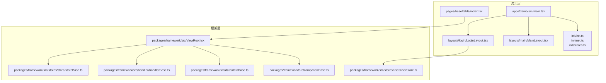
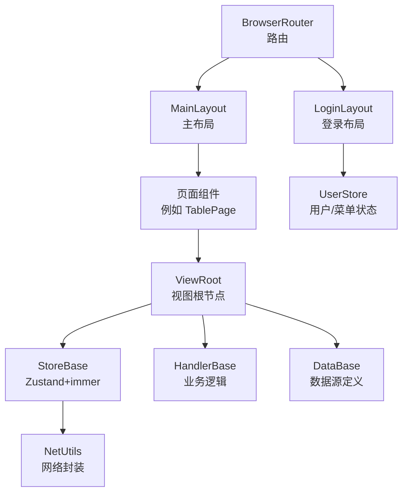
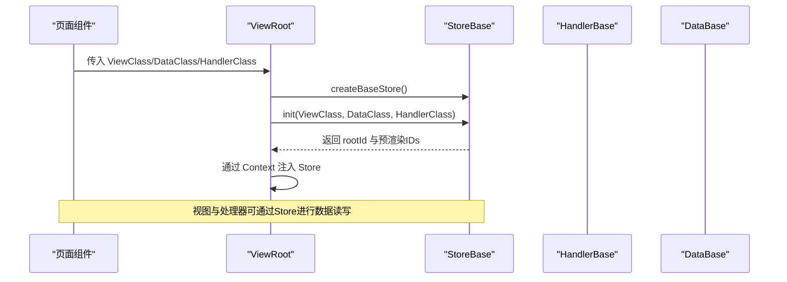
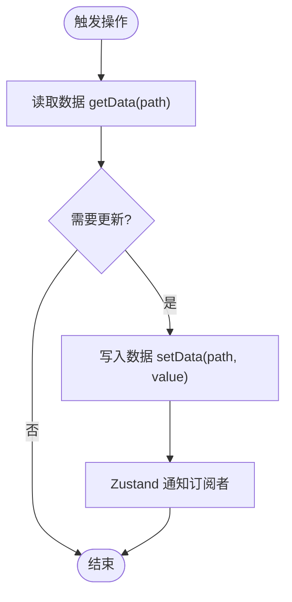
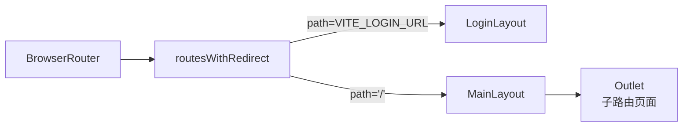
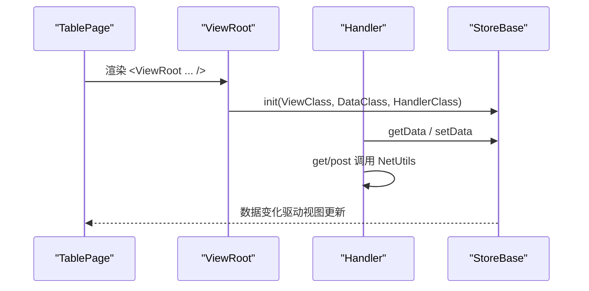
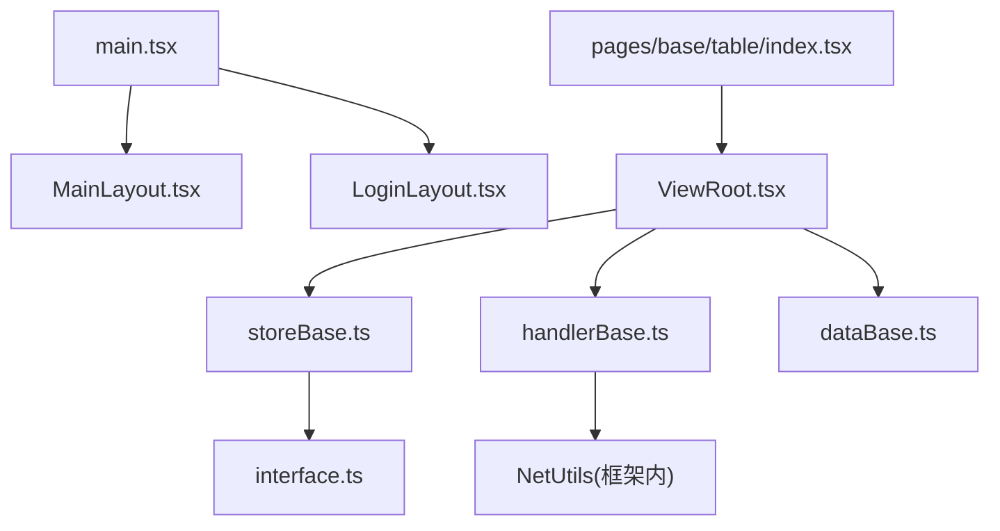

# 架构设计

<cite>
**本文引用的文件**
- [main.tsx](file://apps/demo/src/main.tsx)
- [MainLayout.tsx](file://apps/demo/src/layouts/main/MainLayout.tsx)
- [LoginLayout.tsx](file://apps/demo/src/layouts/login/LoginLayout.tsx)
- [init.ts](file://apps/demo/src/init/init.ts)
- [net.ts](file://apps/demo/src/init/net.ts)
- [stores.ts](file://apps/demo/src/init/stores.ts)
- [index.tsx（表格页）](file://apps/demo/src/pages/base/table/index.tsx)
- [data.tsx（表格数据定义）](file://apps/demo/src/pages/base/table/data.tsx)
- [handler.ts（表格处理器）](file://apps/demo/src/pages/base/table/handler.ts)
- [ViewRoot.tsx](file://packages/framework/src/ViewRoot.tsx)
- [viewBase.ts](file://packages/framework/src/comp/viewBase.ts)
- [handlerBase.ts](file://packages/framework/src/handler/handlerBase.ts)
- [dataBase.ts](file://packages/framework/src/data/dataBase.ts)
- [storeBase.ts](file://packages/framework/src/stores/store/storeBase.ts)
- [storeContext.ts](file://packages/framework/src/stores/store/storeContext.ts)
- [userStore.ts](file://packages/framework/src/stores/user/userStore.ts)
- [interface.ts](file://packages/framework/src/interface.ts)
</cite>

## 目录
1. [简介](#简介)
2. [项目结构](#项目结构)
3. [核心组件](#核心组件)
4. [架构总览](#架构总览)
5. [详细组件分析](#详细组件分析)
6. [依赖关系分析](#依赖关系分析)
7. [性能考虑](#性能考虑)
8. [故障排查指南](#故障排查指南)
9. [结论](#结论)
10. [附录](#附录)

## 简介
本架构设计文档面向WMS Web项目，围绕MVC分层、组件化架构、基于Zustand的状态管理与数据同步机制、路由与布局系统、主题系统进行系统化说明。重点阐述ViewRoot、StoreBase、DataBase等框架核心组件的职责与交互，给出系统边界、组件交互图与数据处理流程图，并总结技术权衡与扩展点设计。

## 项目结构
- 应用层（apps/demo）：包含页面、布局、初始化配置、主题与类型定义。入口文件负责挂载React根节点、配置路由与主题。
- 框架层（packages/framework）：提供MVC组件化能力、视图根节点、状态管理、网络封装、工具与类型定义。

图表来源
- [main.tsx:11-31](file://apps/demo/src/main.tsx#L11-L31)
- [MainLayout.tsx:16-74](file://apps/demo/src/layouts/main/MainLayout.tsx#L16-L74)
- [LoginLayout.tsx:18-49](file://apps/demo/src/layouts/login/LoginLayout.tsx#L18-L49)
- [ViewRoot.tsx:10-48](file://packages/framework/src/ViewRoot.tsx#L10-L48)
- [storeBase.ts:18-57](file://packages/framework/src/stores/store/storeBase.ts#L18-L57)
- [handlerBase.ts:10-90](file://packages/framework/src/handler/handlerBase.ts#L10-L90)
- [dataBase.ts:4-15](file://packages/framework/src/data/dataBase.ts#L4-L15)
- [viewBase.ts:4-14](file://packages/framework/src/comp/viewBase.ts#L4-L14)
- [userStore.ts:5-18](file://packages/framework/src/stores/user/userStore.ts#L5-L18)

章节来源
- [main.tsx:1-53](file://apps/demo/src/main.tsx#L1-L53)
- [MainLayout.tsx:1-77](file://apps/demo/src/layouts/main/MainLayout.tsx#L1-L77)
- [LoginLayout.tsx:1-99](file://apps/demo/src/layouts/login/LoginLayout.tsx#L1-L99)
- [init.ts:1-9](file://apps/demo/src/init/init.ts#L1-L9)
- [net.ts:1-20](file://apps/demo/src/init/net.ts#L1-L20)
- [stores.ts:1-11](file://apps/demo/src/init/stores.ts#L1-L11)
- [index.tsx（表格页）:1-10](file://apps/demo/src/pages/base/table/index.tsx#L1-L10)
- [data.tsx（表格数据定义）:1-22](file://apps/demo/src/pages/base/table/data.tsx#L1-L22)
- [handler.ts（表格处理器）:1-30](file://apps/demo/src/pages/base/table/handler.ts#L1-L30)
- [ViewRoot.tsx:1-48](file://packages/framework/src/ViewRoot.tsx#L1-L48)
- [storeBase.ts:1-58](file://packages/framework/src/stores/store/storeBase.ts#L1-L58)
- [handlerBase.ts:1-92](file://packages/framework/src/handler/handlerBase.ts#L1-L92)
- [dataBase.ts:1-17](file://packages/framework/src/data/dataBase.ts#L1-L17)
- [viewBase.ts:1-16](file://packages/framework/src/comp/viewBase.ts#L1-L16)
- [userStore.ts:1-21](file://packages/framework/src/stores/user/userStore.ts#L1-L21)

## 核心组件
- ViewRoot：视图渲染的根节点，负责创建Store实例、初始化视图/数据/处理器，并通过上下文注入Store到子树。
- StoreBase（createBaseStore）：基于Zustand + immer构建的全局状态容器，统一管理数据、请求参数、视图元信息、处理器引用，并提供读写API。
- DataBase：数据源抽象，用于声明式描述数据项（如列表、表单）及其关联路径，简化跨组件数据引用。
- HandlerBase：业务逻辑抽象，封装对Store的读写、网络请求、弹窗/抽屉操作等，屏蔽Store细节。
- viewBase：视图基类，持有Handler与Data引用，要求实现getRootId以标识自身。
- userStore：用户与菜单全局状态，独立于页面级Store，用于登录态与权限相关数据。

章节来源
- [ViewRoot.tsx:10-48](file://packages/framework/src/ViewRoot.tsx#L10-L48)
- [storeBase.ts:18-57](file://packages/framework/src/stores/store/storeBase.ts#L18-L57)
- [dataBase.ts:4-15](file://packages/framework/src/data/dataBase.ts#L4-L15)
- [handlerBase.ts:10-90](file://packages/framework/src/handler/handlerBase.ts#L10-L90)
- [viewBase.ts:4-14](file://packages/framework/src/comp/viewBase.ts#L4-L14)
- [userStore.ts:5-18](file://packages/framework/src/stores/user/userStore.ts#L5-L18)

## 架构总览
本项目采用“应用层 + 框架层”的分层架构。应用层通过路由与布局组织页面，使用框架提供的ViewRoot将MVC三要素（View/Handler/Data）装配为可复用单元；框架层提供统一的Store、网络、工具与类型契约，确保各页面一致的数据流与交互模式。

图表来源
- [main.tsx:11-31](file://apps/demo/src/main.tsx#L11-L31)
- [MainLayout.tsx:16-74](file://apps/demo/src/layouts/main/MainLayout.tsx#L16-L74)
- [LoginLayout.tsx:18-49](file://apps/demo/src/layouts/login/LoginLayout.tsx#L18-L49)
- [ViewRoot.tsx:10-48](file://packages/framework/src/ViewRoot.tsx#L10-L48)
- [storeBase.ts:18-57](file://packages/framework/src/stores/store/storeBase.ts#L18-L57)
- [handlerBase.ts:46-53](file://packages/framework/src/handler/handlerBase.ts#L46-L53)
- [userStore.ts:5-18](file://packages/framework/src/stores/user/userStore.ts#L5-L18)

## 详细组件分析

### MVC分层设计与职责划分
- Model（数据层）
  - 由DataBase派生类定义数据项（如列表、表单），通过active路径建立关联，便于跨组件共享。
  - StoreBase维护data、req、view、viewParams、handler等状态，提供setData/getData等原子操作。
- View（视图层）
  - 通过ViewRoot传入ViewClass/DataClass/HandlerClass完成装配，内部由CompFactory根据rootId渲染具体视图。
  - 视图仅关注UI展示与用户交互，不直接操作Store。
- Controller（控制器/处理器）
  - HandlerBase封装业务逻辑，调用Store读写数据、发起网络请求、控制弹窗/抽屉等。
  - 页面中通过ViewRoot将Handler注入到视图，视图事件回调处理器方法。

章节来源
- [dataBase.ts:4-15](file://packages/framework/src/data/dataBase.ts#L4-L15)
- [storeBase.ts:18-57](file://packages/framework/src/stores/store/storeBase.ts#L18-L57)
- [ViewRoot.tsx:10-48](file://packages/framework/src/ViewRoot.tsx#L10-L48)
- [handlerBase.ts:10-90](file://packages/framework/src/handler/handlerBase.ts#L10-L90)
- [viewBase.ts:4-14](file://packages/framework/src/comp/viewBase.ts#L4-L14)

### ViewRoot、StoreBase、DataBase 的作用与交互
- ViewRoot
  - 使用useRef保证Store在StrictMode下只创建一次。
  - 调用StoreBase.init初始化视图、数据、处理器，并将Store通过Context注入给子树。
- StoreBase
  - 基于Zustand + immer，集中管理data、req、view、viewParams、handler。
  - 提供setView/getView、setData/getData、getReqParams/refreshByViewId等方法。
- DataBase
  - 提供active静态方法，生成活动路径引用，简化跨组件数据绑定。

图表来源
- [ViewRoot.tsx:10-48](file://packages/framework/src/ViewRoot.tsx#L10-L48)
- [storeBase.ts:18-57](file://packages/framework/src/stores/store/storeBase.ts#L18-L57)
- [handlerBase.ts:10-90](file://packages/framework/src/handler/handlerBase.ts#L10-L90)
- [dataBase.ts:4-15](file://packages/framework/src/data/dataBase.ts#L4-L15)

章节来源
- [ViewRoot.tsx:10-48](file://packages/framework/src/ViewRoot.tsx#L10-L48)
- [storeBase.ts:18-57](file://packages/framework/src/stores/store/storeBase.ts#L18-L57)
- [dataBase.ts:4-15](file://packages/framework/src/data/dataBase.ts#L4-L15)

### 数据流管理方案（Zustand + immer）
- 状态模型
  - StoreBase统一维护data、req、view、viewParams、handler，所有变更通过immer不可变更新。
  - userStore独立管理用户与菜单，供登录态与权限相关场景使用。
- 数据同步
  - 处理器通过getData/setData访问或修改数据，支持函数式更新与防抖设置。
  - 视图通过Context获取Store，订阅所需切片，避免不必要的重渲染。
- 请求流程
  - 处理器封装get/post调用NetUtils，错误与未授权处理集中在初始化阶段。

图表来源
- [storeBase.ts:18-57](file://packages/framework/src/stores/store/storeBase.ts#L18-L57)
- [handlerBase.ts:21-44](file://packages/framework/src/handler/handlerBase.ts#L21-L44)
- [userStore.ts:5-18](file://packages/framework/src/stores/user/userStore.ts#L5-L18)

章节来源
- [storeBase.ts:18-57](file://packages/framework/src/stores/store/storeBase.ts#L18-L57)
- [handlerBase.ts:21-44](file://packages/framework/src/handler/handlerBase.ts#L21-L44)
- [userStore.ts:5-18](file://packages/framework/src/stores/user/userStore.ts#L5-L18)

### 路由系统与布局系统
- 路由系统
  - 使用react-router-dom的BrowserRouter与useRoutes，按环境配置区分登录与主应用路由。
  - 登录路由映射到LoginLayout，主路由映射到MainLayout并嵌套子路由。
- 布局系统
  - MainLayout包含侧边菜单、头部、内容区与Outlet，承载Tab区域与用户头像。
  - LoginLayout提供登录表单与基础校验，成功后跳转首页。

图表来源
- [main.tsx:11-31](file://apps/demo/src/main.tsx#L11-L31)
- [MainLayout.tsx:16-74](file://apps/demo/src/layouts/main/MainLayout.tsx#L16-L74)
- [LoginLayout.tsx:18-49](file://apps/demo/src/layouts/login/LoginLayout.tsx#L18-L49)

章节来源
- [main.tsx:11-31](file://apps/demo/src/main.tsx#L11-L31)
- [MainLayout.tsx:16-74](file://apps/demo/src/layouts/main/MainLayout.tsx#L16-L74)
- [LoginLayout.tsx:18-49](file://apps/demo/src/layouts/login/LoginLayout.tsx#L18-L49)

### 主题系统
- 通过antd的ConfigProvider注入主题对象，当前使用紧凑主题themeCompact。
- 布局中使用theme.useToken获取token，统一背景色等样式变量。

章节来源
- [main.tsx:23-31](file://apps/demo/src/main.tsx#L23-L31)
- [MainLayout.tsx:41-43](file://apps/demo/src/layouts/main/MainLayout.tsx#L41-L43)

### 组件化架构与页面示例（表格页）
- 页面通过ViewRoot将视图、数据、处理器组合为一个可复用单元。
- data.tsx定义数据项与路径关联；handler.ts实现按钮点击、数据打印、网络请求等业务逻辑。

图表来源
- [index.tsx（表格页）:1-10](file://apps/demo/src/pages/base/table/index.tsx#L1-L10)
- [data.tsx（表格数据定义）:1-22](file://apps/demo/src/pages/base/table/data.tsx#L1-L22)
- [handler.ts（表格处理器）:1-30](file://apps/demo/src/pages/base/table/handler.ts#L1-L30)
- [ViewRoot.tsx:10-48](file://packages/framework/src/ViewRoot.tsx#L10-L48)
- [storeBase.ts:18-57](file://packages/framework/src/stores/store/storeBase.ts#L18-L57)
- [handlerBase.ts:46-53](file://packages/framework/src/handler/handlerBase.ts#L46-L53)

章节来源
- [index.tsx（表格页）:1-10](file://apps/demo/src/pages/base/table/index.tsx#L1-L10)
- [data.tsx（表格数据定义）:1-22](file://apps/demo/src/pages/base/table/data.tsx#L1-L22)
- [handler.ts（表格处理器）:1-30](file://apps/demo/src/pages/base/table/handler.ts#L1-L30)

## 依赖关系分析
- 应用层依赖框架层：
  - main.tsx依赖路由、布局与主题。
  - 页面依赖ViewRoot与框架类型。
  - 布局依赖NetUtils与Antd组件。
- 框架层内部依赖：
  - ViewRoot依赖StoreBase、HandlerBase、DataBase、viewBase。
  - StoreBase依赖immer、工具方法与接口。
  - HandlerBase依赖NetUtils与Store接口。
  - DataBase依赖路径工具。

图表来源
- [main.tsx:11-31](file://apps/demo/src/main.tsx#L11-L31)
- [MainLayout.tsx:1-77](file://apps/demo/src/layouts/main/MainLayout.tsx#L1-L77)
- [LoginLayout.tsx:1-99](file://apps/demo/src/layouts/login/LoginLayout.tsx#L1-L99)
- [index.tsx（表格页）:1-10](file://apps/demo/src/pages/base/table/index.tsx#L1-L10)
- [ViewRoot.tsx:10-48](file://packages/framework/src/ViewRoot.tsx#L10-L48)
- [storeBase.ts:18-57](file://packages/framework/src/stores/store/storeBase.ts#L18-L57)
- [handlerBase.ts:10-90](file://packages/framework/src/handler/handlerBase.ts#L10-L90)
- [dataBase.ts:4-15](file://packages/framework/src/data/dataBase.ts#L4-L15)
- [interface.ts:20-34](file://packages/framework/src/interface.ts#L20-L34)

章节来源
- [main.tsx:11-31](file://apps/demo/src/main.tsx#L11-L31)
- [ViewRoot.tsx:10-48](file://packages/framework/src/ViewRoot.tsx#L10-L48)
- [storeBase.ts:18-57](file://packages/framework/src/stores/store/storeBase.ts#L18-L57)
- [handlerBase.ts:10-90](file://packages/framework/src/handler/handlerBase.ts#L10-L90)
- [dataBase.ts:4-15](file://packages/framework/src/data/dataBase.ts#L4-L15)
- [interface.ts:20-34](file://packages/framework/src/interface.ts#L20-L34)

## 性能考虑
- StrictMode与Store生命周期
  - ViewRoot使用useRef确保Store仅创建一次，避免重复初始化带来的性能损耗。
- 不可变更新
  - 借助immer进行不可变更新，减少不必要的深比较与重渲染。
- 按需订阅
  - 视图通过StoreContext选择器订阅最小状态切片，降低重渲染范围。
- 网络与错误处理
  - 统一错误提示与未授权处理，减少分散的错误分支与重试开销。

[本节为通用性能建议，不直接分析具体文件]

## 故障排查指南
- 登录失败
  - 检查表单校验与请求返回码，确认message提示与跳转逻辑。
- 未授权（401）
  - 网络初始化时已注册401处理，检查NetUtils.handleUnauthorized是否被正确调用。
- 菜单加载失败
  - 检查环境变量VITE_API_MENU与NetUtils.get调用，确认错误消息提示。
- 数据未更新
  - 确认Handler中setData路径是否正确，StoreBase.setData是否被调用，视图是否订阅对应切片。

章节来源
- [LoginLayout.tsx:24-49](file://apps/demo/src/layouts/login/LoginLayout.tsx#L24-L49)
- [net.ts:5-17](file://apps/demo/src/init/net.ts#L5-L17)
- [MainLayout.tsx:21-39](file://apps/demo/src/layouts/main/MainLayout.tsx#L21-L39)
- [handlerBase.ts:21-44](file://packages/framework/src/handler/handlerBase.ts#L21-L44)

## 结论
本项目通过ViewRoot将MVC三要素解耦并组合为可复用单元，配合StoreBase的集中状态管理与Zustand的高效更新机制，实现了清晰的数据流与良好的可维护性。路由与布局系统提供了稳定的应用骨架，主题系统统一了视觉风格。整体架构具备清晰的边界、可扩展的组件化能力与一致的交互范式，适合中大型Web应用的持续演进。

## 附录
- 系统边界
  - 应用层：页面、布局、初始化、主题与类型。
  - 框架层：视图根节点、状态管理、网络封装、工具与类型契约。
- 扩展点设计
  - 新增页面：通过ViewRoot组合ViewClass/DataClass/HandlerClass即可接入。
  - 新增数据项：继承DataBase并声明DataProps，利用active建立关联。
  - 新增处理器能力：在HandlerBase基础上扩展方法，或通过StoreBase增加新API。
  - 主题扩展：在ConfigProvider中替换或合并主题对象。

[本节为概念性补充，不直接分析具体文件]