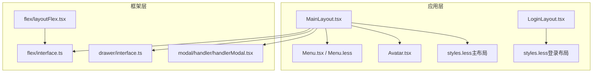
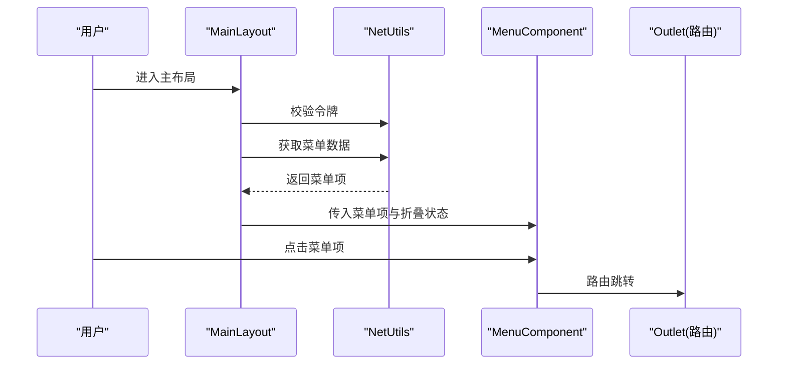
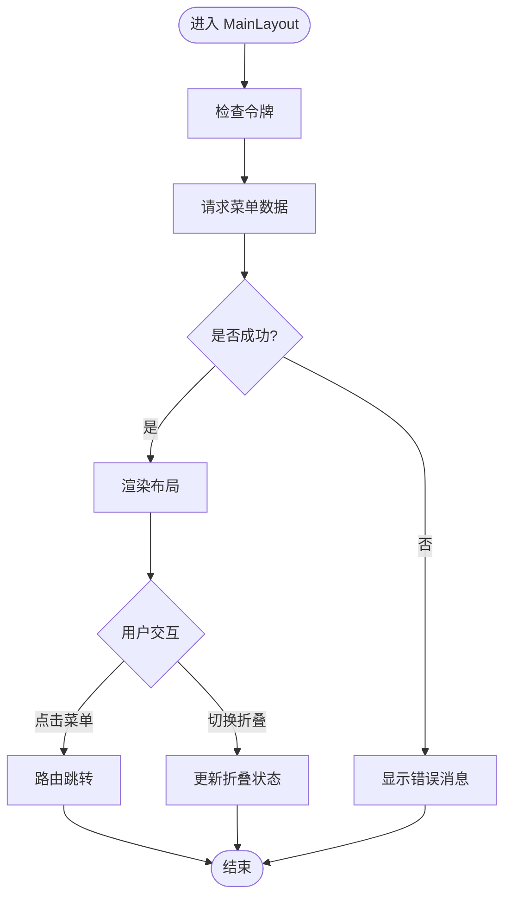
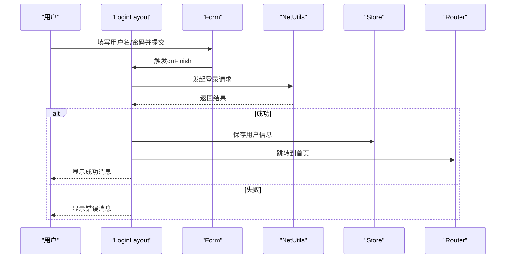
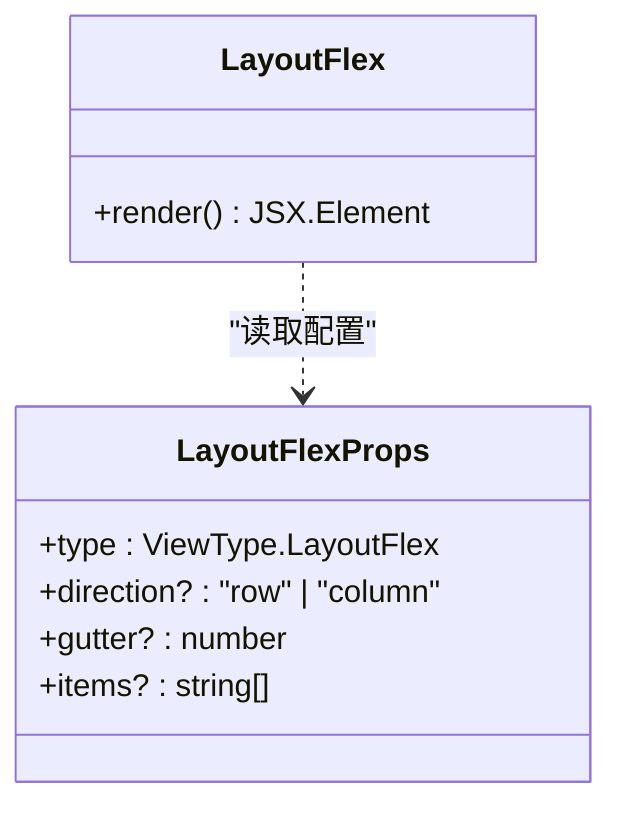
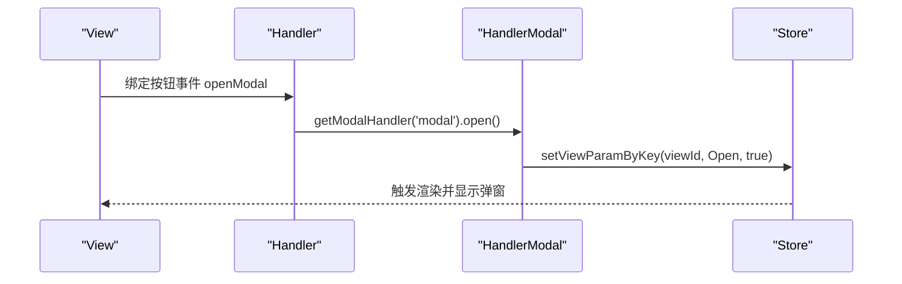
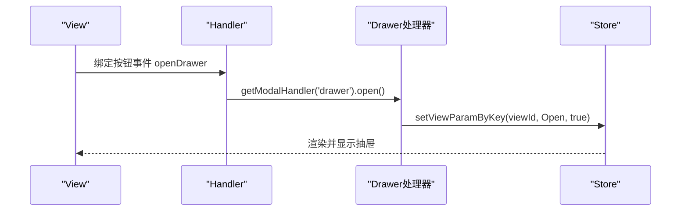
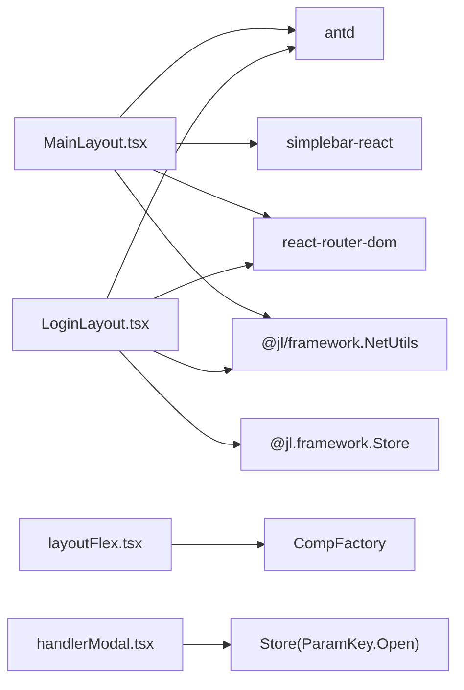

# 布局系统

<cite>
**本文引用的文件**
- [MainLayout.tsx](file://apps/demo/src/layouts/main/MainLayout.tsx)
- [LoginLayout.tsx](file://apps/demo/src/layouts/login/LoginLayout.tsx)
- [styles.less（主布局）](file://apps/demo/src/layouts/main/styles.less)
- [styles.less（登录布局）](file://apps/demo/src/layouts/login/styles.less)
- [Menu.tsx](file://apps/demo/src/layouts/main/comp/Menu.tsx)
- [Menu.less](file://apps/demo/src/layouts/main/comp/Menu.less)
- [Avatar.tsx](file://apps/demo/src/layouts/main/comp/Avatar.tsx)
- [view.tsx（Modal示例）](file://apps/demo/src/pages/base/modal/view.tsx)
- [handler.ts（Modal示例）](file://apps/demo/src/pages/base/modal/handler.ts)
- [view.tsx（Drawer示例）](file://apps/demo/src/pages/base/drawer/view.tsx)
- [handler.ts（Drawer示例）](file://apps/demo/src/pages/base/drawer/handler.ts)
- [interface.ts（Flex接口）](file://packages/framework/src/comp/view/flex/interface.ts)
- [layoutFlex.tsx（Flex实现）](file://packages/framework/src/comp/view/flex/layoutFlex.tsx)
- [interface.ts（Drawer接口）](file://packages/framework/src/comp/view/drawer/interface.ts)
- [handlerModal.tsx（弹窗处理器）](file://packages/framework/src/comp/view/modal/handler/handlerModal.tsx)
- [2.组件用法.md](file://docs/2.组件用法.md)
</cite>

## 目录
1. [简介](#简介)
2. [项目结构](#项目结构)
3. [核心组件](#核心组件)
4. [架构总览](#架构总览)
5. [详细组件分析](#详细组件分析)
6. [依赖关系分析](#依赖关系分析)
7. [性能与兼容性](#性能与兼容性)
8. [故障排查指南](#故障排查指南)
9. [结论](#结论)
10. [附录：配置参考](#附录：配置参考)

## 简介
本文件面向WMS Web项目的布局系统，聚焦以下目标：
- 解释 MainLayout 与 LoginLayout 的实现架构与设计模式
- 详细说明 Flex 布局组件的配置选项与使用方法
- 描述 Modal、Drawer 等弹出式布局的使用场景与配置参数
- 解释布局组件的响应式设计实现
- 提供自定义布局组件的开发指南
- 给出布局性能优化与兼容性处理方案

## 项目结构
布局系统由“应用级布局”和“框架级布局组件”两部分组成：
- 应用级布局：位于 apps/demo/src/layouts，包含主布局 MainLayout 与登录布局 LoginLayout，以及侧边栏菜单、头像等子组件
- 框架级布局：位于 packages/framework/src/comp/view，提供可复用的布局能力，如 Flex、Modal、Drawer 等，并通过 ViewRoot 在页面中声明式使用

图表来源
- [MainLayout.tsx:1-77](file://apps/demo/src/layouts/main/MainLayout.tsx#L1-L77)
- [LoginLayout.tsx:1-99](file://apps/demo/src/layouts/login/LoginLayout.tsx#L1-L99)
- [Menu.tsx:1-53](file://apps/demo/src/layouts/main/comp/Menu.tsx#L1-L53)
- [Avatar.tsx:1-47](file://apps/demo/src/layouts/main/comp/Avatar.tsx#L1-L47)
- [styles.less（主布局）:1-45](file://apps/demo/src/layouts/main/styles.less#L1-L45)
- [styles.less（登录布局）:1-189](file://apps/demo/src/layouts/login/styles.less#L1-L189)
- [interface.ts（Flex接口）:1-25](file://packages/framework/src/comp/view/flex/interface.ts#L1-L25)
- [layoutFlex.tsx:1-25](file://packages/framework/src/comp/view/flex/layoutFlex.tsx#L1-L25)
- [interface.ts（Drawer接口）:1-20](file://packages/framework/src/comp/view/drawer/interface.ts#L1-L20)
- [handlerModal.tsx:1-18](file://packages/framework/src/comp/view/modal/handler/handlerModal.tsx#L1-L18)

章节来源
- [MainLayout.tsx:1-77](file://apps/demo/src/layouts/main/MainLayout.tsx#L1-L77)
- [LoginLayout.tsx:1-99](file://apps/demo/src/layouts/login/LoginLayout.tsx#L1-L99)
- [2.组件用法.md:280-327](file://docs/2.组件用法.md#L280-L327)

## 核心组件
- MainLayout：应用主布局，组合侧边栏、头部、内容区与路由出口，负责菜单数据加载、折叠状态、主题色注入与滚动容器
- LoginLayout：登录页布局，基于卡片与表单完成登录流程，集成消息提示与跳转
- Menu 组件：侧边栏导航，支持折叠、选中态与路由跳转
- Avatar 组件：顶部用户区域，提供通知、设置、全屏与退出登录等入口
- Flex 布局：框架提供的弹性布局，通过 direction 与 gutter 控制排列方向与间距
- Modal/Dra wer：通过视图配置与处理器打开/关闭，承载表单或详情等子视图

章节来源
- [MainLayout.tsx:16-73](file://apps/demo/src/layouts/main/MainLayout.tsx#L16-L73)
- [LoginLayout.tsx:18-95](file://apps/demo/src/layouts/login/LoginLayout.tsx#L18-L95)
- [Menu.tsx:17-49](file://apps/demo/src/layouts/main/comp/Menu.tsx#L17-L49)
- [Avatar.tsx:8-43](file://apps/demo/src/layouts/main/comp/Avatar.tsx#L8-L43)
- [interface.ts（Flex接口）:8-25](file://packages/framework/src/comp/view/flex/interface.ts#L8-L25)
- [layoutFlex.tsx:6-22](file://packages/framework/src/comp/view/flex/layoutFlex.tsx#L6-L22)
- [interface.ts（Drawer接口）:3-20](file://packages/framework/src/comp/view/drawer/interface.ts#L3-L20)
- [handlerModal.tsx:9-16](file://packages/framework/src/comp/view/modal/handler/handlerModal.tsx#L9-L16)

## 架构总览
MainLayout 采用“壳组件 + 子组件”的组合模式：
- 外层 Layout 作为整体容器
- 左侧 Sider 承载 MenuComponent，支持折叠与滚动
- 顶部 Header 放置触发按钮、标签区域与用户操作区
- 内容区 Content 包裹 SimpleBar 滚动容器与 Outlet 路由出口
- 通过 theme.useToken 获取主题色，保持 UI 一致性

图表来源
- [MainLayout.tsx:21-39](file://apps/demo/src/layouts/main/MainLayout.tsx#L21-L39)
- [Menu.tsx:21-24](file://apps/demo/src/layouts/main/comp/Menu.tsx#L21-L24)

章节来源
- [MainLayout.tsx:21-73](file://apps/demo/src/layouts/main/MainLayout.tsx#L21-L73)
- [Menu.tsx:17-49](file://apps/demo/src/layouts/main/comp/Menu.tsx#L17-L49)

## 详细组件分析

### MainLayout 主布局
- 职责：组织页面骨架、管理菜单与折叠状态、注入主题、提供滚动内容与路由出口
- 关键实现要点：
  - 使用 antd Layout 构建三栏结构（侧边栏、头部、内容）
  - 通过 state 管理 collapsed 折叠状态
  - 通过 NetUtils 获取菜单并错误提示
  - 使用 theme.useToken 注入背景色
  - 使用 SimpleBar 为内容区提供稳定滚动体验
  - 使用 Outlet 渲染子路由

图表来源
- [MainLayout.tsx:21-39](file://apps/demo/src/layouts/main/MainLayout.tsx#L21-L39)
- [MainLayout.tsx:45-73](file://apps/demo/src/layouts/main/MainLayout.tsx#L45-L73)

章节来源
- [MainLayout.tsx:16-73](file://apps/demo/src/layouts/main/MainLayout.tsx#L16-L73)
- [styles.less（主布局）:1-45](file://apps/demo/src/layouts/main/styles.less#L1-L45)

### LoginLayout 登录布局
- 职责：展示登录卡片、表单校验、调用登录接口、存储用户信息并跳转首页
- 关键实现要点：
  - 使用 antd Form 进行字段校验与提交
  - 使用 message API 反馈登录结果
  - 通过 Store 保存用户信息
  - 登录成功后使用路由跳转至首页

图表来源
- [LoginLayout.tsx:24-49](file://apps/demo/src/layouts/login/LoginLayout.tsx#L24-L49)
- [LoginLayout.tsx:51-95](file://apps/demo/src/layouts/login/LoginLayout.tsx#L51-L95)

章节来源
- [LoginLayout.tsx:18-95](file://apps/demo/src/layouts/login/LoginLayout.tsx#L18-L95)
- [styles.less（登录布局）:1-189](file://apps/demo/src/layouts/login/styles.less#L1-L189)

### 侧边栏菜单 MenuComponent
- 职责：渲染侧边菜单、处理选中态与路由跳转、支持折叠与滚动
- 关键点：
  - 使用 antd Menu 的 inline 模式与 dark 主题
  - 通过 SimpleBar 限制高度并提供滚动
  - 使用 useNavigate 进行路由跳转

章节来源
- [Menu.tsx:17-49](file://apps/demo/src/layouts/main/comp/Menu.tsx#L17-L49)
- [Menu.less:1-31](file://apps/demo/src/layouts/main/comp/Menu.less#L1-L31)

### 顶部用户区 AvatarComponent
- 职责：提供通知、设置、全屏与用户下拉菜单（含退出登录）
- 关键点：
  - 使用 Dropdown 与 Space 组合布局
  - 退出登录调用统一鉴权处理

章节来源
- [Avatar.tsx:8-43](file://apps/demo/src/layouts/main/comp/Avatar.tsx#L8-L43)

### Flex 布局组件
- 配置项：
  - direction：布局方向，可选 row 或 column
  - gutter：子节点间距（像素）
  - items：子节点组件 id 列表
- 渲染逻辑：
  - 读取 view 配置，生成 display:flex 容器
  - 按顺序渲染 CompFactory 挂载的子视图

图表来源
- [interface.ts（Flex接口）:8-25](file://packages/framework/src/comp/view/flex/interface.ts#L8-L25)
- [layoutFlex.tsx:6-22](file://packages/framework/src/comp/view/flex/layoutFlex.tsx#L6-L22)

章节来源
- [interface.ts（Flex接口）:8-25](file://packages/framework/src/comp/view/flex/interface.ts#L8-L25)
- [layoutFlex.tsx:6-22](file://packages/framework/src/comp/view/flex/layoutFlex.tsx#L6-L22)
- [2.组件用法.md:305-315](file://docs/2.组件用法.md#L305-L315)

### Modal 弹窗布局
- 使用方式：
  - 在 View 中声明 modal 配置，指定 viewId 指向要嵌入的表单或内容
  - 在 Handler 中通过 getModalHandler('modal').open() 打开弹窗
- 内部机制：
  - 通过 store 设置对应 viewId 的 Open 参数为 true/false 控制显隐

图表来源
- [view.tsx（Modal示例）:18-22](file://apps/demo/src/pages/base/modal/view.tsx#L18-L22)
- [handler.ts（Modal示例）:4-7](file://apps/demo/src/pages/base/modal/handler.ts#L4-L7)
- [handlerModal.tsx:9-16](file://packages/framework/src/comp/view/modal/handler/handlerModal.tsx#L9-L16)

章节来源
- [view.tsx（Modal示例）:18-22](file://apps/demo/src/pages/base/modal/view.tsx#L18-L22)
- [handler.ts（Modal示例）:4-7](file://apps/demo/src/pages/base/modal/handler.ts#L4-L7)
- [handlerModal.tsx:9-16](file://packages/framework/src/comp/view/modal/handler/handlerModal.tsx#L9-L16)
- [2.组件用法.md:317-327](file://docs/2.组件用法.md#L317-L327)

### Drawer 抽屉布局
- 使用方式：
  - 在 View 中声明 drawer 配置，指定 viewId、width、placement 等
  - 在 Handler 中通过 getModalHandler('drawer').open() 打开抽屉
- 配置项：
  - viewId：抽屉内嵌视图ID
  - title：标题
  - placement：位置 left/right/top/bottom
  - width：宽度
  - onClose：关闭回调

图表来源
- [view.tsx（Drawer示例）:18-23](file://apps/demo/src/pages/base/drawer/view.tsx#L18-L23)
- [handler.ts（Drawer示例）:4-7](file://apps/demo/src/pages/base/drawer/handler.ts#L4-L7)
- [interface.ts（Drawer接口）:3-20](file://packages/framework/src/comp/view/drawer/interface.ts#L3-L20)

章节来源
- [view.tsx（Drawer示例）:18-23](file://apps/demo/src/pages/base/drawer/view.tsx#L18-L23)
- [handler.ts（Drawer示例）:4-7](file://apps/demo/src/pages/base/drawer/handler.ts#L4-L7)
- [interface.ts（Drawer接口）:3-20](file://packages/framework/src/comp/view/drawer/interface.ts#L3-L20)

### 响应式设计实现
- 登录布局：
  - 使用媒体查询在小屏下调整内边距、字号与按钮尺寸，提升移动端体验
- 主布局：
  - 通过固定高度的 Header 与自适应 Content，结合 SimpleBar 保证内容滚动
  - 侧边栏使用 flex 布局与滚动容器，适配不同屏幕高度

章节来源
- [styles.less（登录布局）:126-150](file://apps/demo/src/layouts/login/styles.less#L126-L150)
- [styles.less（主布局）:1-45](file://apps/demo/src/layouts/main/styles.less#L1-L45)
- [Menu.tsx:27-46](file://apps/demo/src/layouts/main/comp/Menu.tsx#L27-L46)

## 依赖关系分析
- MainLayout 依赖：
  - antd Layout、Button、theme
  - simplebar-react 用于滚动
  - react-router-dom 的路由钩子与 Outlet
  - @jl/framework 的 NetUtils 用于网络与鉴权
- LoginLayout 依赖：
  - antd Form、Input、Button、Typography、Card
  - @jl/framework 的 NetUtils 与 Store
  - react-router-dom 的 useNavigate
- 框架层：
  - Flex/Dra wer/Modal 通过统一的 View 配置与 Store 参数驱动渲染与显隐

图表来源
- [MainLayout.tsx:1-12](file://apps/demo/src/layouts/main/MainLayout.tsx#L1-L12)
- [LoginLayout.tsx:1-9](file://apps/demo/src/layouts/login/LoginLayout.tsx#L1-L9)
- [layoutFlex.tsx:1-5](file://packages/framework/src/comp/view/flex/layoutFlex.tsx#L1-L5)
- [handlerModal.tsx:1-5](file://packages/framework/src/comp/view/modal/handler/handlerModal.tsx#L1-L5)

章节来源
- [MainLayout.tsx:1-12](file://apps/demo/src/layouts/main/MainLayout.tsx#L1-L12)
- [LoginLayout.tsx:1-9](file://apps/demo/src/layouts/login/LoginLayout.tsx#L1-L9)
- [layoutFlex.tsx:1-5](file://packages/framework/src/comp/view/flex/layoutFlex.tsx#L1-L5)
- [handlerModal.tsx:1-5](file://packages/framework/src/comp/view/modal/handler/handlerModal.tsx#L1-L5)

## 性能与兼容性
- 滚动性能：
  - 使用 simplebar-react 替代原生滚动条，减少重排重绘，提升长列表滚动流畅度
- 渲染优化：
  - 使用 useMemoizedFn 缓存事件处理函数，避免重复创建
  - 通过 theme.useToken 获取主题变量，减少样式计算开销
- 资源加载：
  - 按需引入图标与组件，减少打包体积
- 兼容性：
  - 使用 CSS Flexbox 与媒体查询实现响应式，兼容主流现代浏览器
  - 登录卡片使用 backdrop-filter 等特性，建议在需要时提供降级策略

[本节为通用指导，不直接分析具体文件]

## 故障排查指南
- 菜单数据为空或失败：
  - 检查环境变量配置与接口返回码
  - 查看 message 错误提示定位问题
- 登录失败：
  - 确认表单校验规则与后端返回码
  - 检查 Store 是否正确保存用户信息
- 弹窗/抽屉未显示：
  - 确认 viewId 配置正确
  - 检查 Handler 是否正确调用 open/close
  - 查看 Store 中对应 viewId 的 Open 参数状态

章节来源
- [MainLayout.tsx:21-33](file://apps/demo/src/layouts/main/MainLayout.tsx#L21-L33)
- [LoginLayout.tsx:24-49](file://apps/demo/src/layouts/login/LoginLayout.tsx#L24-L49)
- [handlerModal.tsx:9-16](file://packages/framework/src/comp/view/modal/handler/handlerModal.tsx#L9-L16)

## 结论
本项目布局系统以 MainLayout 与 LoginLayout 为核心，结合框架层的 Flex、Modal、Drawer 等布局能力，实现了高内聚、低耦合的可复用布局体系。通过声明式配置与统一的状态管理，开发者可以快速搭建复杂业务页面，同时具备良好的响应式体验与可维护性。

[本节为总结，不直接分析具体文件]

## 附录：配置参考
- Flex 布局
  - direction：row | column
  - gutter：数字（像素）
  - items：字符串数组（子视图ID）
- Drawer 抽屉
  - viewId：字符串（内嵌视图ID）
  - title：字符串（标题）
  - placement：left | right | top | bottom
  - width：数字（宽度）
  - onClose：函数（关闭回调）
- Modal 弹窗
  - viewId：字符串（内嵌视图ID）
  - 通过 Handler 的 open/close 控制显隐

章节来源
- [interface.ts（Flex接口）:8-25](file://packages/framework/src/comp/view/flex/interface.ts#L8-L25)
- [interface.ts（Drawer接口）:3-20](file://packages/framework/src/comp/view/drawer/interface.ts#L3-L20)
- [2.组件用法.md:305-327](file://docs/2.组件用法.md#L305-L327)