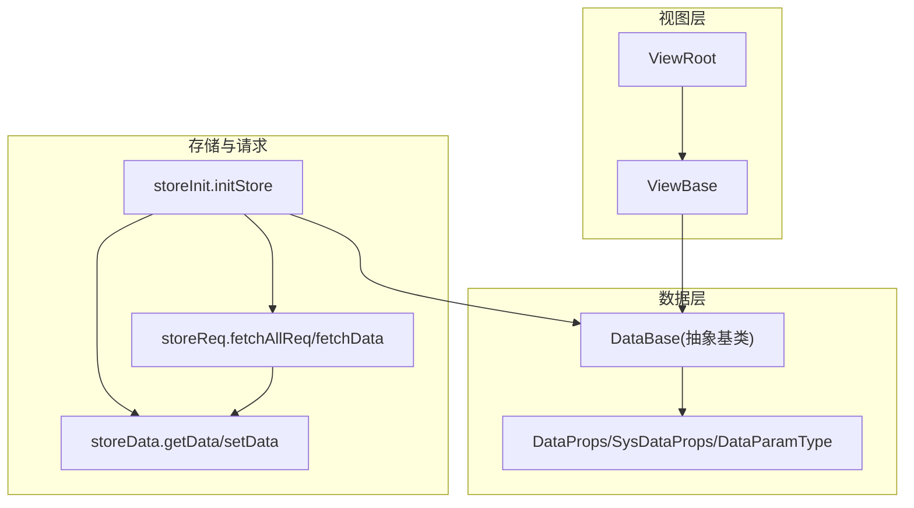
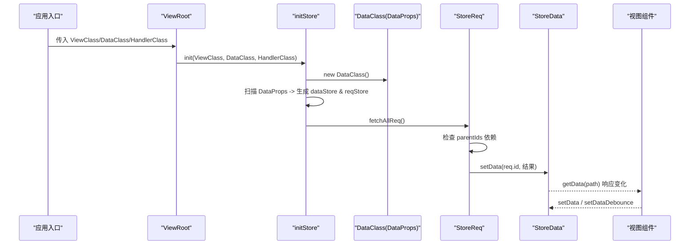
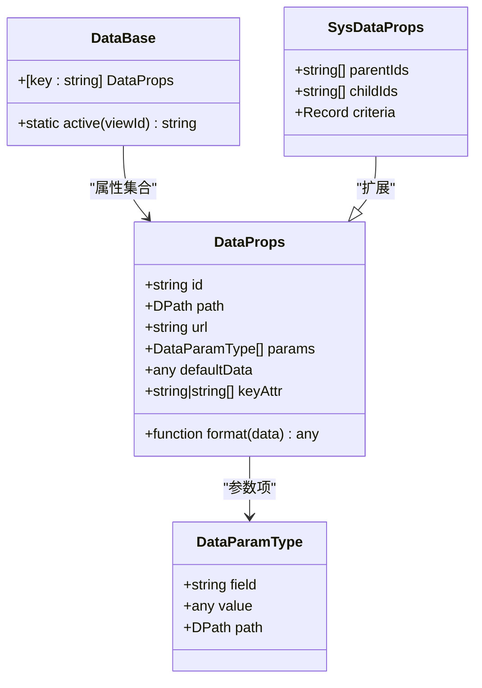
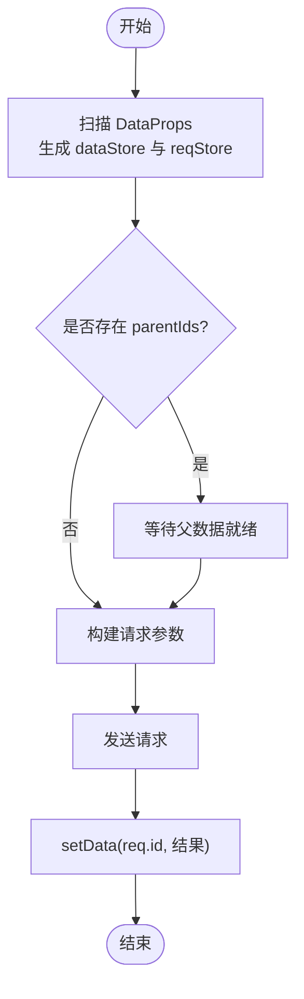
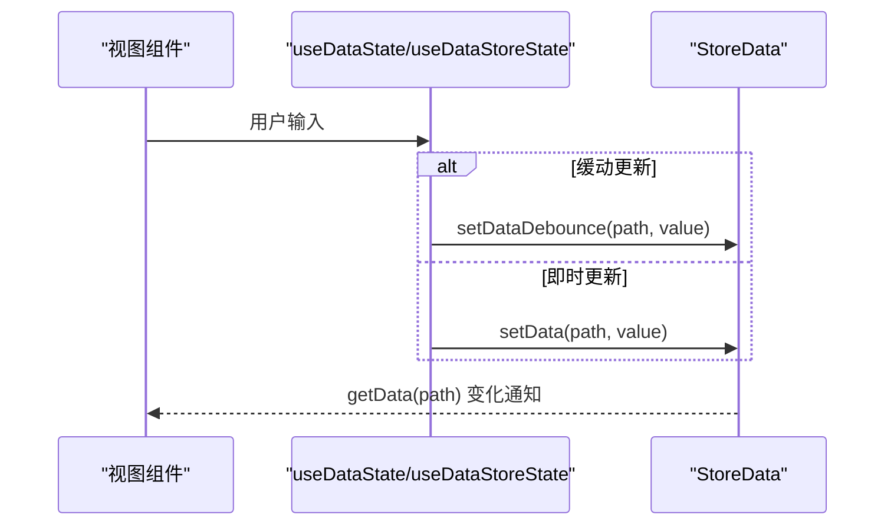
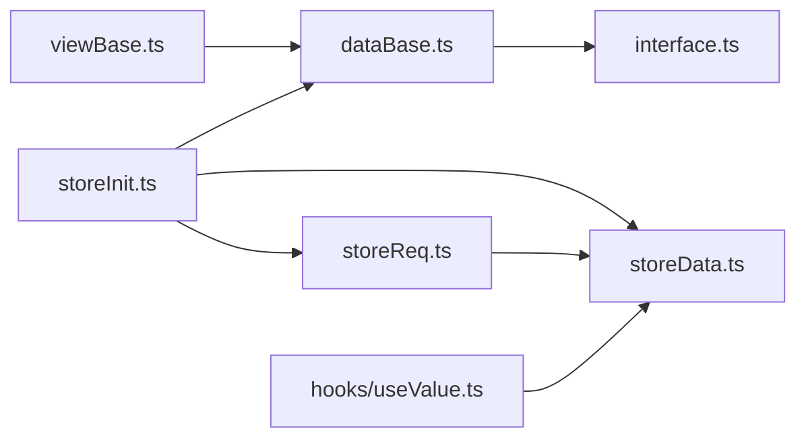

# DataBase基类

<cite>
**本文引用的文件**
- [packages/framework/src/data/dataBase.ts](file://packages/framework/src/data/dataBase.ts)
- [packages/framework/src/data/interface.ts](file://packages/framework/src/data/interface.ts)
- [packages/framework/src/comp/viewBase.ts](file://packages/framework/src/comp/viewBase.ts)
- [packages/framework/src/stores/store/utils/storeInit.ts](file://packages/framework/src/stores/store/utils/storeInit.ts)
- [packages/framework/src/stores/store/utils/storeData.ts](file://packages/framework/src/stores/store/utils/storeData.ts)
- [packages/framework/src/stores/store/utils/storeReq.ts](file://packages/framework/src/stores/store/utils/storeReq.ts)
- [packages/framework/src/stores/store/hooks/useValue.ts](file://packages/framework/src/stores/store/hooks/useValue.ts)
- [packages/framework/src/stores/store/interface.ts](file://packages/framework/src/stores/store/interface.ts)
- [packages/framework/src/index.ts](file://packages/framework/src/index.ts)
- [apps/demo/src/pages/base/table/data.tsx](file://apps/demo/src/pages/base/table/data.tsx)
- [apps/demo/src/pages/base/form/data.tsx](file://apps/demo/src/pages/base/form/data.tsx)
- [apps/demo/src/pages/base/modal/data.tsx](file://apps/demo/src/pages/base/modal/data.tsx)
- [apps/demo/src/pages/base/drawer/data.tsx](file://apps/demo/src/pages/base/drawer/data.tsx)
- [apps/demo/src/pages/base/tab/data.tsx](file://apps/demo/src/pages/base/tab/data.tsx)
</cite>

## 目录
1. [简介](#简介)
2. [项目结构](#项目结构)
3. [核心组件](#核心组件)
4. [架构总览](#架构总览)
5. [详细组件分析](#详细组件分析)
6. [依赖关系分析](#依赖关系分析)
7. [性能考量](#性能考量)
8. [故障排查指南](#故障排查指南)
9. [结论](#结论)
10. [附录](#附录)

## 简介
本文件围绕框架中的 DataBase 抽象基类，系统阐述其设计理念与数据管理模式。DataBase 作为所有页面数据模型的统一基类，通过声明式配置（id、url、path、params、defaultData、keyAttr、format）驱动数据的加载、缓存、依赖与更新；配合 Store 层的数据读写、请求编排与视图绑定，实现“数据即模型”的清晰分层。本文将深入说明：
- 数据CRUD与请求流程：基于 DataProps 的配置化请求、依赖检查、参数构建与结果落库
- 验证规则与转换机制：通过 format 钩子进行数据格式化，keyAttr 支持主键识别
- 双向绑定与同步策略：useDataState/useDataStoreState 等 Hook 提供本地缓存与即时更新两种模式
- 自定义数据模型：继承 DataBase 并扩展字段与方法
- 缓存、懒加载与性能优化：debounce、依赖顺序执行、预渲染等
- 迁移与版本管理：以 path 引用与默认数据为锚点的渐进式演进策略

## 项目结构
- 数据模型基类位于 packages/framework/src/data/dataBase.ts，定义统一的 Data 模型结构与活动路径工具方法
- 数据接口定义在 packages/framework/src/data/interface.ts，包含 DataProps、SysDataProps、DataParamType 等
- 视图基类 ViewBase 将 Handler 与 Data 注入到视图实例中，形成“视图-处理器-数据”三元结构
- Store 层负责初始化、数据读写、请求调度与视图注册，详见 store 相关工具文件
- Demo 应用展示了如何继承 DataBase 并组合多个数据源（表格、表单、弹窗、抽屉、标签页）

图表来源
- [packages/framework/src/data/dataBase.ts:4-15](file://packages/framework/src/data/dataBase.ts#L4-L15)
- [packages/framework/src/data/interface.ts:4-38](file://packages/framework/src/data/interface.ts#L4-L38)
- [packages/framework/src/comp/viewBase.ts:4-14](file://packages/framework/src/comp/viewBase.ts#L4-L14)
- [packages/framework/src/stores/store/utils/storeInit.ts:15-50](file://packages/framework/src/stores/store/utils/storeInit.ts#L15-L50)
- [packages/framework/src/stores/store/utils/storeData.ts:57-88](file://packages/framework/src/stores/store/utils/storeData.ts#L57-L88)
- [packages/framework/src/stores/store/utils/storeReq.ts:58-93](file://packages/framework/src/stores/store/utils/storeReq.ts#L58-L93)

章节来源
- [packages/framework/src/data/dataBase.ts:1-18](file://packages/framework/src/data/dataBase.ts#L1-L18)
- [packages/framework/src/data/interface.ts:1-38](file://packages/framework/src/data/interface.ts#L1-L38)
- [packages/framework/src/comp/viewBase.ts:1-16](file://packages/framework/src/comp/viewBase.ts#L1-L16)
- [packages/framework/src/stores/store/utils/storeInit.ts:1-70](file://packages/framework/src/stores/store/utils/storeInit.ts#L1-L70)

## 核心组件
- DataBase 抽象基类：提供静态 active(viewId) 用于生成活动路径引用；并通过索引签名允许任意 DataProps 属性挂载
- DataProps：声明数据源的 id、url、path、params、defaultData、keyAttr、format 等元信息
- ViewBase：将 handler 与 data 注入视图，要求实现 getRootId()
- Store 初始化器 initStore：创建 DataClass 实例，扫描并初始化数据与请求，最后触发无父依赖的请求
- 数据读写 storeData：getData/setData/setDataDebounce 等，支持真实路径解析与数据源路由
- 请求调度 storeReq：fetchAllReq/fetchData/send，处理依赖检查、参数构建与结果写入

章节来源
- [packages/framework/src/data/dataBase.ts:4-15](file://packages/framework/src/data/dataBase.ts#L4-L15)
- [packages/framework/src/data/interface.ts:4-38](file://packages/framework/src/data/interface.ts#L4-L38)
- [packages/framework/src/comp/viewBase.ts:4-14](file://packages/framework/src/comp/viewBase.ts#L4-L14)
- [packages/framework/src/stores/store/utils/storeInit.ts:15-50](file://packages/framework/src/stores/store/utils/storeInit.ts#L15-L50)
- [packages/framework/src/stores/store/utils/storeData.ts:57-146](file://packages/framework/src/stores/store/utils/storeData.ts#L57-L146)
- [packages/framework/src/stores/store/utils/storeReq.ts:58-208](file://packages/framework/src/stores/store/utils/storeReq.ts#L58-L208)

## 架构总览
下图展示从页面根节点到数据请求与更新的完整链路：ViewRoot 创建 Store 并调用 initStore，initStore 构造 DataClass 与 ViewClass，扫描 DataProps 生成数据与请求树，随后按依赖顺序发起请求，最终通过 storeData 写入数据，视图通过 Hooks 订阅变化。

图表来源
- [packages/framework/src/stores/store/utils/storeInit.ts:15-50](file://packages/framework/src/stores/store/utils/storeInit.ts#L15-L50)
- [packages/framework/src/stores/store/utils/storeReq.ts:58-93](file://packages/framework/src/stores/store/utils/storeReq.ts#L58-L93)
- [packages/framework/src/stores/store/utils/storeData.ts:57-88](file://packages/framework/src/stores/store/utils/storeData.ts#L57-L88)

## 详细组件分析

### DataBase 抽象基类与数据模型设计
- 设计要点
  - 以 DataProps 为契约，集中描述数据源元信息（id/url/path/params/defaultData/keyAttr/format）
  - 通过静态 active(viewId) 简化活动路径引用，便于跨组件共享数据位置
  - 使用索引签名允许子类自由扩展字段与方法，保持类型安全的同时具备灵活性
- 典型用法
  - 表格/表单/弹窗/抽屉/标签页各自维护独立 Data 子类，组合多个 DataProps
  - 通过 path 指向其他 Data 的 id，建立数据引用关系，避免重复请求

章节来源
- [packages/framework/src/data/dataBase.ts:4-15](file://packages/framework/src/data/dataBase.ts#L4-L15)
- [packages/framework/src/data/interface.ts:4-38](file://packages/framework/src/data/interface.ts#L4-L38)
- [apps/demo/src/pages/base/table/data.tsx:1-19](file://apps/demo/src/pages/base/table/data.tsx#L1-L19)
- [apps/demo/src/pages/base/form/data.tsx:1-10](file://apps/demo/src/pages/base/form/data.tsx#L1-L10)
- [apps/demo/src/pages/base/modal/data.tsx:1-10](file://apps/demo/src/pages/base/modal/data.tsx#L1-L10)
- [apps/demo/src/pages/base/drawer/data.tsx:1-10](file://apps/demo/src/pages/base/drawer/data.tsx#L1-L10)
- [apps/demo/src/pages/base/tab/data.tsx:1-16](file://apps/demo/src/pages/base/tab/data.tsx#L1-L16)

#### 类图（代码级映射）

图表来源
- [packages/framework/src/data/dataBase.ts:4-15](file://packages/framework/src/data/dataBase.ts#L4-L15)
- [packages/framework/src/data/interface.ts:4-38](file://packages/framework/src/data/interface.ts#L4-L38)

### 数据CRUD与请求流程
- 读取（C/R）
  - 通过 storeData.getData 根据 DPath 获取数据，自动解析真实路径与数据源
  - 视图侧 useData/useDataState/useDataStoreState 订阅数据变化
- 创建/更新（U/D）
  - 通过 storeData.setData/setDataByFn/setDataDebounce 设置数据
  - setDataDebounce 对高频输入做防抖，减少频繁更新
- 请求编排
  - initStore 扫描 DataProps 生成 reqStore，并按 parentIds 依赖顺序执行 fetchData
  - StoreReq.fetchAllReq 仅触发无父依赖的请求，fetchData 内部检查依赖、构建参数、发送请求并写入数据

图表来源
- [packages/framework/src/stores/store/utils/storeInit.ts:33-49](file://packages/framework/src/stores/store/utils/storeInit.ts#L33-L49)
- [packages/framework/src/stores/store/utils/storeReq.ts:58-93](file://packages/framework/src/stores/store/utils/storeReq.ts#L58-L93)
- [packages/framework/src/stores/store/utils/storeReq.ts:175-180](file://packages/framework/src/stores/store/utils/storeReq.ts#L175-L180)

章节来源
- [packages/framework/src/stores/store/utils/storeInit.ts:15-50](file://packages/framework/src/stores/store/utils/storeInit.ts#L15-L50)
- [packages/framework/src/stores/store/utils/storeReq.ts:58-208](file://packages/framework/src/stores/store/utils/storeReq.ts#L58-L208)
- [packages/framework/src/stores/store/utils/storeData.ts:57-146](file://packages/framework/src/stores/store/utils/storeData.ts#L57-L146)

### 验证规则与转换机制
- 验证
  - 建议在 DataProps.format 中进行数据校验与清洗，返回标准化后的数据
  - 可通过 keyAttr 指定主键或复合主键，确保列表去重与行级更新正确性
- 转换
  - format 函数接收原始数据，返回视图所需结构
  - 结合 defaultData 提供初始态，保证界面可渲染

章节来源
- [packages/framework/src/data/interface.ts:4-38](file://packages/framework/src/data/interface.ts#L4-L38)

### 数据与视图的双向绑定与同步策略
- 单向数据流
  - Store 作为唯一数据源，视图通过 useData/useDataState/useDataStoreState 订阅
- 双向交互
  - 用户输入触发 setData/setDataDebounce，更新 Store 后视图自动刷新
  - useDataState 在本地保存一份副本，延迟合并至 Store，适合高频输入场景
  - useDataStoreState 直接写 Store，适合需要立即生效的场景

图表来源
- [packages/framework/src/stores/store/hooks/useValue.ts:10-43](file://packages/framework/src/stores/store/hooks/useValue.ts#L10-L43)
- [packages/framework/src/stores/store/utils/storeData.ts:120-146](file://packages/framework/src/stores/store/utils/storeData.ts#L120-L146)

章节来源
- [packages/framework/src/stores/store/hooks/useValue.ts:1-48](file://packages/framework/src/stores/store/hooks/useValue.ts#L1-L48)
- [packages/framework/src/stores/store/utils/storeData.ts:120-146](file://packages/framework/src/stores/store/utils/storeData.ts#L120-L146)

### 自定义数据模型与扩展方法
- 继承 DataBase 并声明 DataProps 字段，如 mainTable/mainForm/mainFormData 等
- 通过 path 与其他 Data 建立引用，例如 mainFormData.path 指向 mainTable 的活动路径
- 可在子类中添加业务方法（如批量操作、导出、校验），并在 Handler 中调用

章节来源
- [apps/demo/src/pages/base/table/data.tsx:1-19](file://apps/demo/src/pages/base/table/data.tsx#L1-L19)
- [apps/demo/src/pages/base/form/data.tsx:1-10](file://apps/demo/src/pages/base/form/data.tsx#L1-L10)
- [apps/demo/src/pages/base/modal/data.tsx:1-10](file://apps/demo/src/pages/base/modal/data.tsx#L1-L10)
- [apps/demo/src/pages/base/drawer/data.tsx:1-10](file://apps/demo/src/pages/base/drawer/data.tsx#L1-L10)
- [apps/demo/src/pages/base/tab/data.tsx:1-16](file://apps/demo/src/pages/base/tab/data.tsx#L1-L16)

### 数据缓存、懒加载与性能优化
- 缓存
  - Store 全局缓存数据，getData 直接读取内存，避免重复网络请求
  - defaultData 提供初始缓存，提升首屏体验
- 懒加载
  - 仅触发无父依赖的请求，子依赖按需拉取
  - 预渲染：LayoutModal/LayoutDrawer 等类型在初始化时提前渲染，减少交互延迟
- 防抖
  - setDataDebounce 对高频输入进行节流，降低渲染压力
- 性能追踪
  - 提供 printStats/resetStats 辅助定位性能瓶颈

章节来源
- [packages/framework/src/stores/store/utils/storeInit.ts:11-12](file://packages/framework/src/stores/store/utils/storeInit.ts#L11-L12)
- [packages/framework/src/stores/store/utils/storeInit.ts:53-70](file://packages/framework/src/stores/store/utils/storeInit.ts#L53-L70)
- [packages/framework/src/stores/store/utils/storeData.ts:120-146](file://packages/framework/src/stores/store/utils/storeData.ts#L120-L146)
- [packages/framework/src/index.ts:67-69](file://packages/framework/src/index.ts#L67-L69)

### 数据迁移与版本管理最佳实践
- 使用 path 引用而非硬编码字符串，降低耦合度，便于重构
- 利用 defaultData 提供向后兼容的初始结构，逐步替换旧字段
- 通过 keyAttr 稳定标识记录，确保迁移过程中列表项不闪烁
- 在 format 中集中处理字段映射与类型转换，屏蔽上游变更

章节来源
- [packages/framework/src/data/interface.ts:4-38](file://packages/framework/src/data/interface.ts#L4-L38)

## 依赖关系分析
- 模块内聚
  - DataBase 与 DataProps 强内聚，职责单一
  - Store 层将数据读写与请求编排解耦，便于测试与维护
- 外部依赖
  - lodash 用于对象操作与路径访问
  - ahooks/zustand 用于状态管理与副作用
- 潜在循环依赖
  - 当前结构通过 index 导出与相对路径隔离，未见明显循环导入

图表来源
- [packages/framework/src/data/dataBase.ts:1-18](file://packages/framework/src/data/dataBase.ts#L1-L18)
- [packages/framework/src/data/interface.ts:1-38](file://packages/framework/src/data/interface.ts#L1-L38)
- [packages/framework/src/comp/viewBase.ts:1-16](file://packages/framework/src/comp/viewBase.ts#L1-L16)
- [packages/framework/src/stores/store/utils/storeInit.ts:1-70](file://packages/framework/src/stores/store/utils/storeInit.ts#L1-L70)
- [packages/framework/src/stores/store/utils/storeReq.ts:1-208](file://packages/framework/src/stores/store/utils/storeReq.ts#L1-L208)
- [packages/framework/src/stores/store/utils/storeData.ts:1-146](file://packages/framework/src/stores/store/utils/storeData.ts#L1-L146)
- [packages/framework/src/stores/store/hooks/useValue.ts:1-48](file://packages/framework/src/stores/store/hooks/useValue.ts#L1-L48)

章节来源
- [packages/framework/src/index.ts:1-69](file://packages/framework/src/index.ts#L1-L69)

## 性能考量
- 使用 setDataDebounce 处理高频输入，避免过度渲染
- 合理拆分 DataProps，减少不必要的全量请求
- 利用 defaultData 与 format 缩短首屏渲染时间
- 借助 printStats 定期评估关键路径耗时

## 故障排查指南
- 常见问题
  - 视图未找到：检查 viewId 是否正确，是否已注册到 Store
  - 请求未触发：确认 DataProps.url 与 params 配置，检查 parentIds 依赖是否满足
  - 数据未更新：确认 setData/setDataDebounce 的路径与值是否正确
- 调试建议
  - 打印 Store 快照，观察 data/req/view 结构
  - 使用 console.warn 输出依赖检查结果与错误堆栈

章节来源
- [packages/framework/src/stores/store/utils/storeReq.ts:71-93](file://packages/framework/src/stores/store/utils/storeReq.ts#L71-L93)
- [packages/framework/src/stores/store/utils/storeReq.ts:196-208](file://packages/framework/src/stores/store/utils/storeReq.ts#L196-L208)

## 结论
DataBase 基类通过声明式 DataProps 与 Store 层的协同，实现了“数据即模型”的统一范式。它提供了清晰的 CR/U/D 流程、灵活的验证与转换机制、稳定的双向绑定策略以及完善的性能优化手段。借助 path 引用与 defaultData，团队可以安全地进行数据迁移与版本演进。

## 附录
- 快速上手
  - 继承 DataBase 并声明 DataProps
  - 在视图中通过 this.data 访问数据源
  - 使用 store 提供的 Hooks 进行数据读写与订阅
- 参考示例
  - 表格/表单/弹窗/抽屉/标签页的数据模型组织方式

章节来源
- [apps/demo/src/pages/base/table/data.tsx:1-19](file://apps/demo/src/pages/base/table/data.tsx#L1-L19)
- [apps/demo/src/pages/base/form/data.tsx:1-10](file://apps/demo/src/pages/base/form/data.tsx#L1-L10)
- [apps/demo/src/pages/base/modal/data.tsx:1-10](file://apps/demo/src/pages/base/modal/data.tsx#L1-L10)
- [apps/demo/src/pages/base/drawer/data.tsx:1-10](file://apps/demo/src/pages/base/drawer/data.tsx#L1-L10)
- [apps/demo/src/pages/base/tab/data.tsx:1-16](file://apps/demo/src/pages/base/tab/data.tsx#L1-L16)