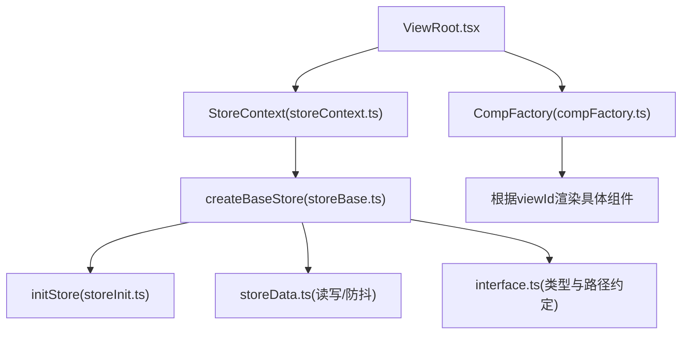
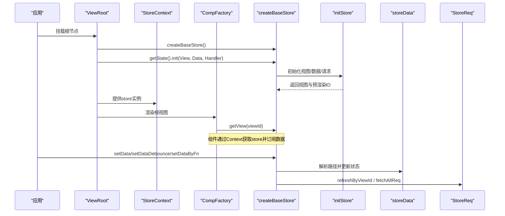
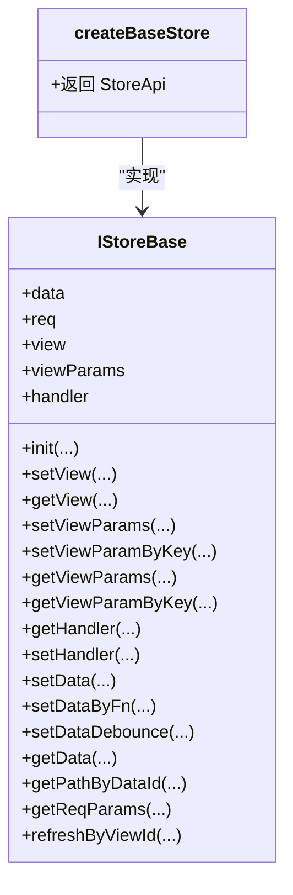
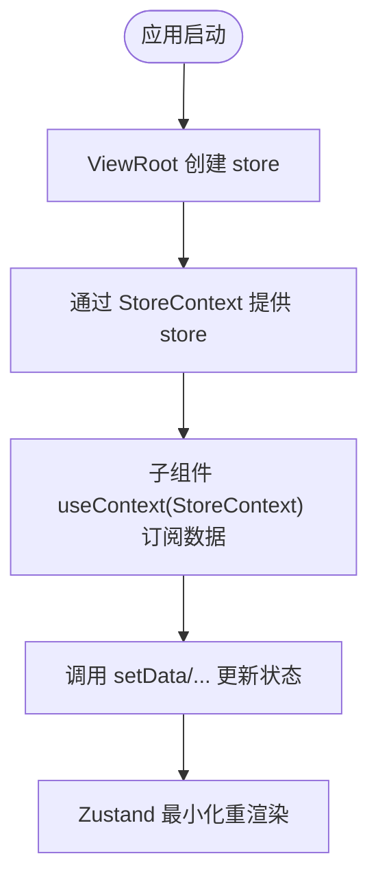
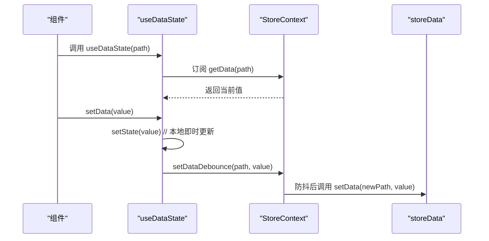
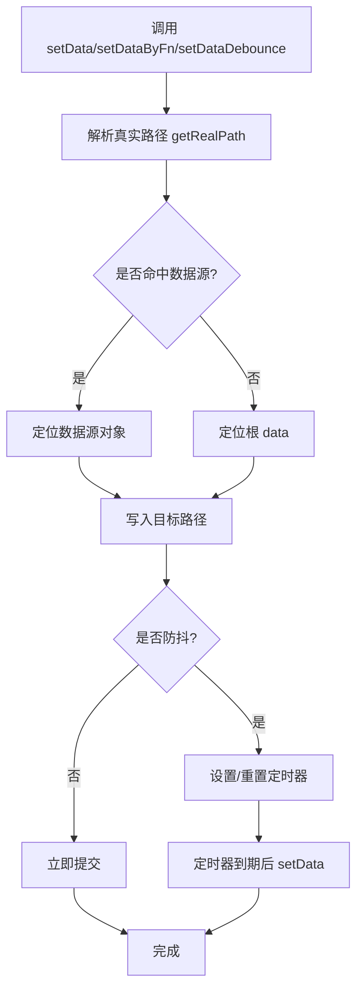
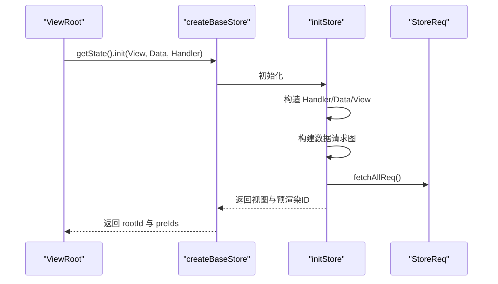
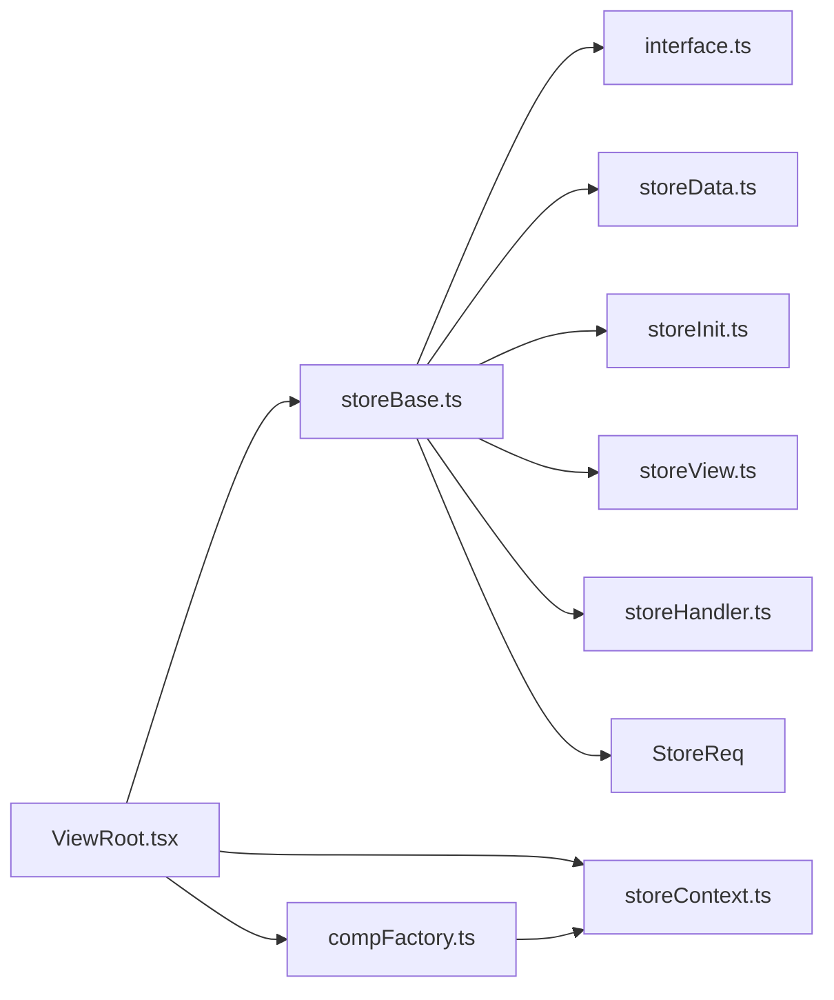

# StoreBase基类

<cite>
**本文引用的文件**
- [storeBase.ts](file://packages/framework/src/stores/store/storeBase.ts)
- [interface.ts](file://packages/framework/src/stores/store/interface.ts)
- [storeContext.ts](file://packages/framework/src/stores/store/storeContext.ts)
- [useValue.ts](file://packages/framework/src/stores/store/hooks/useValue.ts)
- [storeData.ts](file://packages/framework/src/stores/store/utils/storeData.ts)
- [storeInit.ts](file://packages/framework/src/stores/store/utils/storeInit.ts)
- [ViewRoot.tsx](file://packages/framework/src/ViewRoot.tsx)
- [compFactory.ts](file://packages/framework/src/comp/compFactory.ts)
- [userStore.ts](file://packages/framework/src/stores/user/userStore.ts)
- [stores.ts](file://apps/demo/src/init/stores.ts)
</cite>

## 目录
1. [简介](#简介)
2. [项目结构](#项目结构)
3. [核心组件](#核心组件)
4. [架构总览](#架构总览)
5. [详细组件分析](#详细组件分析)
6. [依赖关系分析](#依赖关系分析)
7. [性能考量](#性能考量)
8. [故障排查指南](#故障排查指南)
9. [结论](#结论)
10. [附录](#附录)

## 简介
本文件围绕 StoreBase 基类（通过 createBaseStore 暴露）进行系统化文档化，重点解释其作为状态管理核心的设计模式与实现机制。内容涵盖：
- 状态的创建、更新与订阅机制
- StoreContext 的作用与 Provider 模式
- useValue Hook 的工作原理与使用场景
- 自定义 Store 的实现示例与最佳实践
- 状态持久化、调试与性能优化策略

## 项目结构
StoreBase 位于框架的 stores 模块中，采用“基于 Zustand + Immer”的状态管理模式，并通过 React Context 将 store 注入到视图树中。关键文件组织如下：
- 核心 store 定义与动作封装：storeBase.ts
- 状态结构与路径约定：interface.ts
- React Context 提供全局 store 引用：storeContext.ts
- 数据读写与防抖更新工具：utils/storeData.ts
- 初始化流程与预渲染：utils/storeInit.ts
- 根节点 Provider 与组件工厂：ViewRoot.tsx、compFactory.ts
- 用户域 Store 示例：userStore.ts
- Demo 应用中的 Store 聚合入口：apps/demo/src/init/stores.ts

图表来源
- [ViewRoot.tsx:11-45](file://packages/framework/src/ViewRoot.tsx#L11-L45)
- [storeContext.ts:1-7](file://packages/framework/src/stores/store/storeContext.ts#L1-L7)
- [storeBase.ts:18-55](file://packages/framework/src/stores/store/storeBase.ts#L18-L55)
- [storeInit.ts:15-50](file://packages/framework/src/stores/store/utils/storeInit.ts#L15-L50)
- [storeData.ts:57-147](file://packages/framework/src/stores/store/utils/storeData.ts#L57-L147)
- [interface.ts:74-132](file://packages/framework/src/stores/store/interface.ts#L74-L132)
- [compFactory.ts:42-57](file://packages/framework/src/comp/compFactory.ts#L42-L57)

章节来源
- [storeBase.ts:18-55](file://packages/framework/src/stores/store/storeBase.ts#L18-L55)
- [ViewRoot.tsx:11-45](file://packages/framework/src/ViewRoot.tsx#L11-L45)
- [compFactory.ts:42-57](file://packages/framework/src/comp/compFactory.ts#L42-L57)

## 核心组件
- createBaseStore：基于 Zustand + Immer 创建 IStoreBase 实例，封装数据、视图、请求、处理器等能力，并提供统一 API（setData/getData/setViewParams/refreshByViewId 等）。
- StoreContext：React Context，承载 UseBoundStore<StoreApi<IStoreBase>>，用于在组件树中共享 store 实例。
- ViewRoot：应用级根组件，负责创建并缓存 store 实例，调用 init 完成视图与数据初始化，并将 store 通过 Context 提供给子树。
- CompFactory：根据 viewId 从 store 获取视图元信息，动态渲染对应组件。
- storeData：数据读取/写入/函数式更新/防抖更新的工具集合，支持复杂路径解析与数据源定位。
- storeInit：初始化流程，包括 Handler/Data/View 的构造、数据请求图构建、预渲染处理与首次请求触发。
- interface：定义 IStoreBase 数据结构、DPath 路径语法、特殊键（@Data/@Req/@View 等）以及 Actions 接口。

章节来源
- [storeBase.ts:18-55](file://packages/framework/src/stores/store/storeBase.ts#L18-L55)
- [storeContext.ts:1-7](file://packages/framework/src/stores/store/storeContext.ts#L1-L7)
- [ViewRoot.tsx:11-45](file://packages/framework/src/ViewRoot.tsx#L11-L45)
- [compFactory.ts:42-57](file://packages/framework/src/comp/compFactory.ts#L42-L57)
- [storeData.ts:57-147](file://packages/framework/src/stores/store/utils/storeData.ts#L57-L147)
- [storeInit.ts:15-50](file://packages/framework/src/stores/store/utils/storeInit.ts#L15-L50)
- [interface.ts:74-132](file://packages/framework/src/stores/store/interface.ts#L74-L132)

## 架构总览
StoreBase 以“单一 store 实例 + React Context”为核心，结合“视图驱动的数据流”和“声明式数据请求”，形成以下工作流：
- 启动阶段：ViewRoot 创建 store，调用 init 完成 Handler/Data/View 初始化，构建数据请求图，触发首次请求。
- 渲染阶段：CompFactory 根据 viewId 获取视图配置，渲染对应 UI 组件；组件通过 useValue 系列 Hook 订阅 store 数据。
- 更新阶段：组件调用 setData/setDataDebounce/setDataByFn 等方法更新状态；Zustand + Immer 保证不可变更新与最小重渲染。
- 请求阶段：StoreReq 统一管理数据请求参数与刷新，支持按 viewId 刷新。

图表来源
- [ViewRoot.tsx:11-45](file://packages/framework/src/ViewRoot.tsx#L11-L45)
- [storeBase.ts:18-55](file://packages/framework/src/stores/store/storeBase.ts#L18-L55)
- [storeInit.ts:15-50](file://packages/framework/src/stores/store/utils/storeInit.ts#L15-L50)
- [storeData.ts:57-147](file://packages/framework/src/stores/store/utils/storeData.ts#L57-L147)
- [compFactory.ts:42-57](file://packages/framework/src/comp/compFactory.ts#L42-L57)

## 详细组件分析

### StoreBase（createBaseStore）
- 职责：创建并暴露 IStoreBase 实例，封装数据、视图、请求、处理器等能力。
- 关键点：
  - 使用 immer 中间件，支持直接修改 state 的写法，内部自动产生不可变更新。
  - 提供 setData/getData/setDataByFn/setDataDebounce 等数据操作 API。
  - 提供 setView/getView/setViewParams 等视图管理 API。
  - 提供 getHandler/setHandler 管理视图方法。
  - 提供 getReqParams/refreshByViewId 管理数据请求。
  - init 委托给 storeInit，完成 Handler/Data/View 的初始化与请求图构建。

图表来源
- [storeBase.ts:18-55](file://packages/framework/src/stores/store/storeBase.ts#L18-L55)
- [interface.ts:74-132](file://packages/framework/src/stores/store/interface.ts#L74-L132)

章节来源
- [storeBase.ts:18-55](file://packages/framework/src/stores/store/storeBase.ts#L18-L55)
- [interface.ts:74-132](file://packages/framework/src/stores/store/interface.ts#L74-L132)

### StoreContext 与 Provider 模式
- StoreContext 是一个 React Context，类型为 UseBoundStore<StoreApi<IStoreBase>>。
- ViewRoot 在挂载时创建 store 实例，并通过 <StoreContext value={useStore}> 将其注入到整个组件树。
- 子组件通过 useContext(StoreContext) 获取 store，并使用 selector 订阅所需字段，避免不必要的重渲染。

图表来源
- [ViewRoot.tsx:11-45](file://packages/framework/src/ViewRoot.tsx#L11-L45)
- [storeContext.ts:1-7](file://packages/framework/src/stores/store/storeContext.ts#L1-L7)

章节来源
- [ViewRoot.tsx:11-45](file://packages/framework/src/ViewRoot.tsx#L11-L45)
- [storeContext.ts:1-7](file://packages/framework/src/stores/store/storeContext.ts#L1-L7)

### useValue Hook 工作原理与使用场景
- useDataState：本地缓存 + 防抖更新。适合输入框等高频变更场景，先更新本地状态立即响应，再延迟同步到 store。
- useDataStoreState：直接读写 store，无本地缓存。适合需要强一致性的场景。
- useData：只读订阅指定路径数据。
- useDataById：根据 id 查找对应数据路径并返回数据。

图表来源
- [useValue.ts:10-63](file://packages/framework/src/stores/store/hooks/useValue.ts#L10-L63)
- [storeData.ts:118-147](file://packages/framework/src/stores/store/utils/storeData.ts#L118-L147)

章节来源
- [useValue.ts:10-63](file://packages/framework/src/stores/store/hooks/useValue.ts#L10-L63)
- [storeData.ts:118-147](file://packages/framework/src/stores/store/utils/storeData.ts#L118-L147)

### 数据读写与防抖更新流程
- getData：解析真实路径，优先定位数据源（如 @Data），再读取嵌套值。
- setData：解析路径，定位数据源或根 data，写入值。
- setDataByFn：传入函数，基于当前值计算新值并写回。
- setDataDebounce：为每个 path 维护定时器，合并多次快速更新，最终落库。

图表来源
- [storeData.ts:57-147](file://packages/framework/src/stores/store/utils/storeData.ts#L57-L147)

章节来源
- [storeData.ts:57-147](file://packages/framework/src/stores/store/utils/storeData.ts#L57-L147)

### 初始化流程与预渲染
- initStore：创建 Handler/Data/View，初始化视图树与数据请求图，填充 req/data/view，触发首次请求。
- 预渲染：对特定视图类型（如 Modal/Drawer）提前渲染，提升交互体验。

图表来源
- [storeInit.ts:15-50](file://packages/framework/src/stores/store/utils/storeInit.ts#L15-L50)
- [ViewRoot.tsx:20-32](file://packages/framework/src/ViewRoot.tsx#L20-L32)

章节来源
- [storeInit.ts:15-50](file://packages/framework/src/stores/store/utils/storeInit.ts#L15-L50)
- [ViewRoot.tsx:20-32](file://packages/framework/src/ViewRoot.tsx#L20-L32)

### 自定义 Store 的实现示例与最佳实践
- 领域 Store：参考 userStore.ts，使用 create + immer 创建独立 Store，暴露 typed actions。
- 聚合入口：参考 apps/demo/src/init/stores.ts，将多个领域 Store 聚合为统一的 Store 类，便于集中管理与测试。
- 最佳实践：
  - 使用 TypeScript 泛型约束 Store 类型，确保类型安全。
  - 将业务无关的通用能力放在 StoreBase，领域逻辑下沉到各自 Store。
  - 通过 Context 注入 store，避免 prop drilling。
  - 使用 selector 精确订阅，减少重渲染。

章节来源
- [userStore.ts:1-21](file://packages/framework/src/stores/user/userStore.ts#L1-L21)
- [stores.ts:1-11](file://apps/demo/src/init/stores.ts#L1-L11)

## 依赖关系分析
- createBaseStore 依赖：
  - interface：IStoreBase、DPath、PathKey 等类型与常量
  - utils/storeData：数据读写与防抖
  - utils/storeInit：初始化流程
  - utils/storeView：视图相关操作
  - utils/storeHandler：处理器存取
  - StoreReq：数据请求管理
- ViewRoot 依赖：
  - createBaseStore：创建 store
  - StoreContext：提供 store
  - CompFactory：渲染视图
- CompFactory 依赖：
  - StoreContext：获取 store
  - 视图类型映射：根据 view.type 选择组件

图表来源
- [storeBase.ts:1-17](file://packages/framework/src/stores/store/storeBase.ts#L1-L17)
- [ViewRoot.tsx:1-45](file://packages/framework/src/ViewRoot.tsx#L1-L45)
- [compFactory.ts:42-57](file://packages/framework/src/comp/compFactory.ts#L42-L57)

章节来源
- [storeBase.ts:1-17](file://packages/framework/src/stores/store/storeBase.ts#L1-L17)
- [ViewRoot.tsx:1-45](file://packages/framework/src/ViewRoot.tsx#L1-L45)
- [compFactory.ts:42-57](file://packages/framework/src/comp/compFactory.ts#L42-L57)

## 性能考量
- 不可变更新：借助 immer，避免手动深拷贝，降低内存与 CPU 开销。
- 精确订阅：使用 selector 订阅最小数据片段，减少组件重渲染范围。
- 防抖更新：setDataDebounce 合并高频更新，降低 store 更新频率与渲染压力。
- 预渲染：对 Modal/Drawer 等视图提前渲染，改善交互响应。
- 建议：
  - 合理拆分 store，避免单例过大导致 selector 匹配成本上升。
  - 对大列表数据使用分页/虚拟滚动，并结合局部更新。
  - 谨慎使用 setDataByFn 中的 console.log 等副作用，生产环境关闭。

[本节为通用指导，不直接分析具体文件]

## 故障排查指南
- 常见问题：
  - 重复初始化：检查 ViewRoot 中 store 是否被复用，避免 StrictMode 下重复创建。
  - 路径解析失败：确认 DPath 是否符合规范，必要时使用 PathKey 前缀（如 @Data/@Req）。
  - 防抖未生效：确认 setDataDebounce 的 delay 与调用频率，检查 debounceTimers 是否被正确清理。
  - 视图未渲染：检查 CompFactory 是否能根据 view.type 找到对应组件。
- 调试建议：
  - 在 setDataByFn 中保留必要的日志输出，定位数据流向。
  - 使用浏览器开发者工具的 React Profiler 观察重渲染范围。
  - 对 StoreReq 的请求参数与结果进行断点调试。

章节来源
- [storeData.ts:91-116](file://packages/framework/src/stores/store/utils/storeData.ts#L91-L116)
- [storeData.ts:118-147](file://packages/framework/src/stores/store/utils/storeData.ts#L118-L147)
- [compFactory.ts:42-57](file://packages/framework/src/comp/compFactory.ts#L42-L57)

## 结论
StoreBase 通过 Zustand + Immer 提供了简洁而强大的状态管理能力，配合 React Context 实现了跨组件的状态共享与最小化更新。其设计将“视图驱动”、“数据请求”、“处理器”与“数据模型”解耦，使复杂应用的开发更加结构化与可维护。结合 useValue Hook 的多种用法，既能满足即时反馈的交互需求，也能保证数据一致性。通过合理的性能优化与调试策略，可在大型应用中稳定运行。

[本节为总结性内容，不直接分析具体文件]

## 附录
- 常用路径与键：
  - PathKey：@Data/@Req/@View/@ViewParam/@Route/@Root 等，用于在路径中引用不同上下文。
  - ParamKey：@Active/@Select/@Open/@All 等，用于页面内控制参数。
- 扩展点：
  - 可通过 storeInit 扩展初始化流程，例如接入埋点、权限校验。
  - 可通过 StoreReq 扩展请求拦截、重试、缓存策略。
- 示例参考：
  - 用户域 Store：userStore.ts
  - Demo 聚合入口：apps/demo/src/init/stores.ts

[本节为补充说明，不直接分析具体文件]