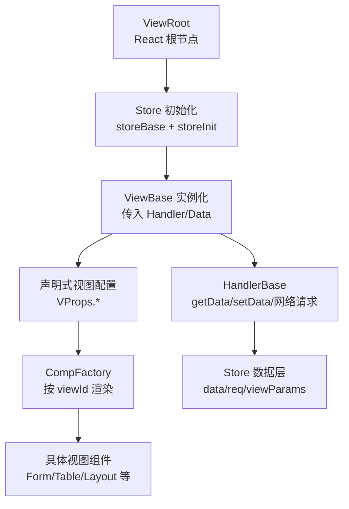
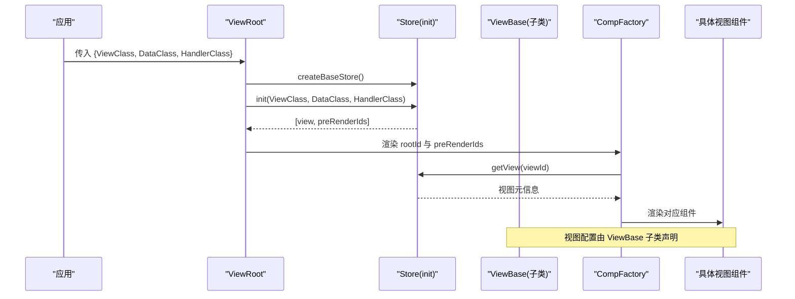
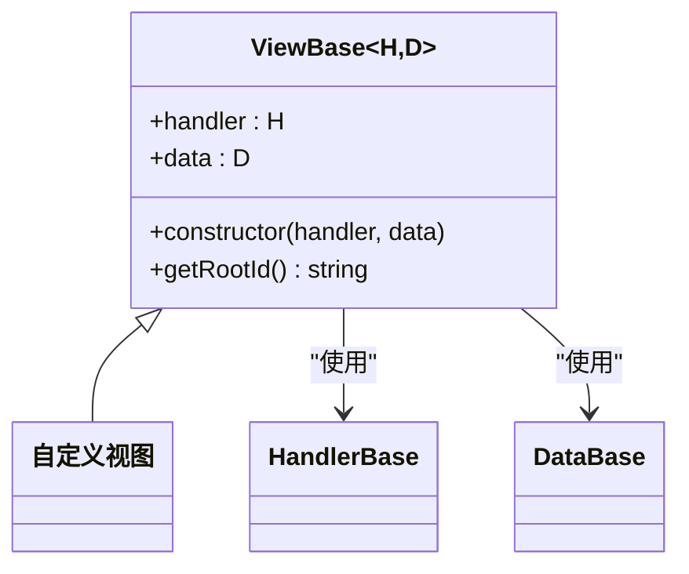
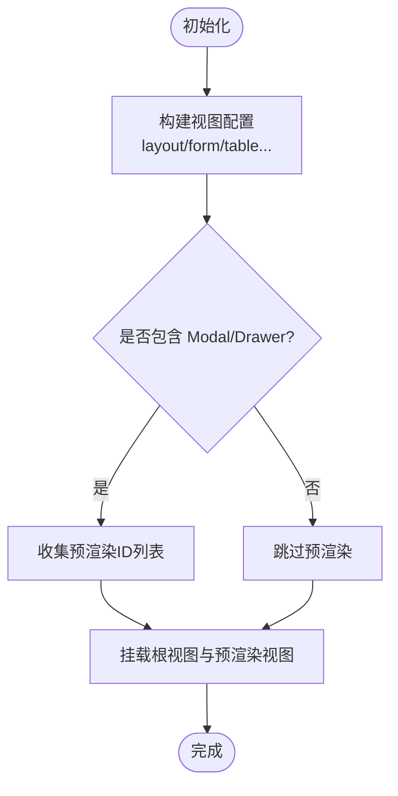
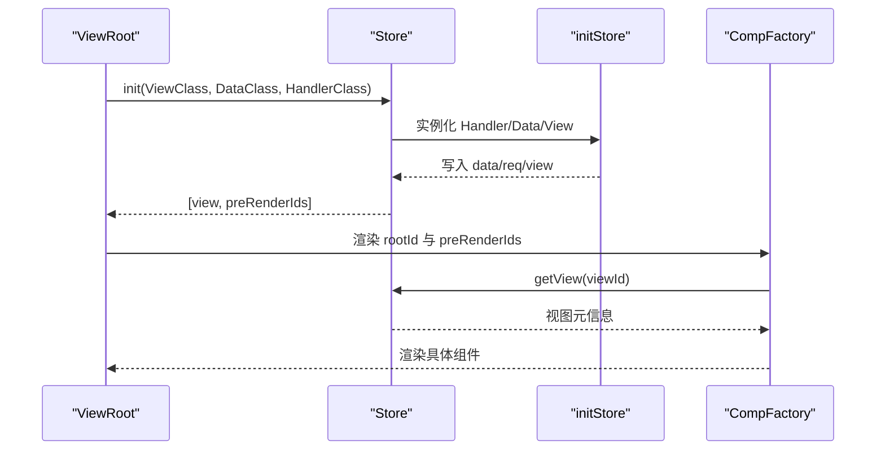
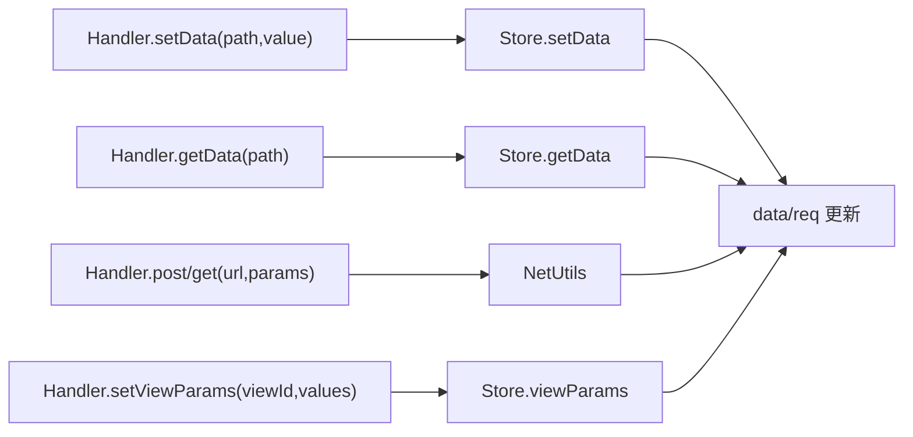
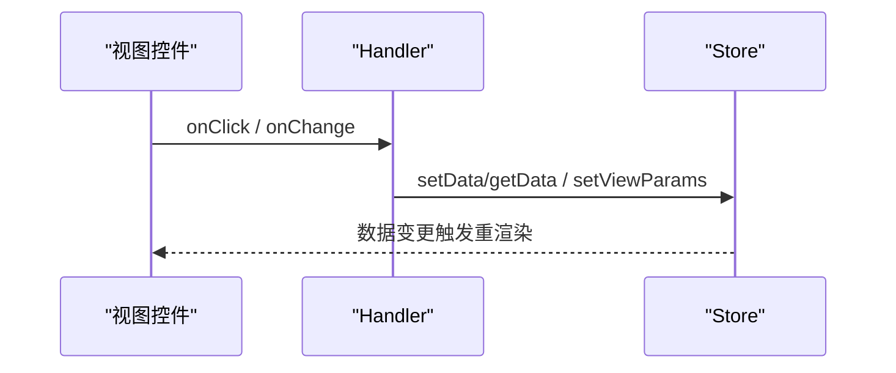
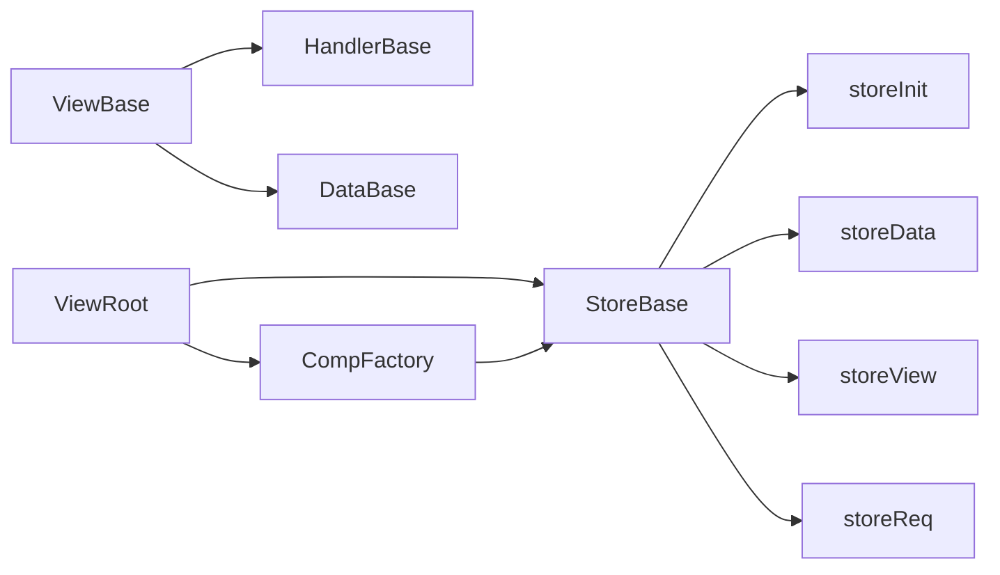

# ViewBase基类

<cite>
**本文引用的文件**
- [packages/framework/src/comp/viewBase.ts](file://packages/framework/src/comp/viewBase.ts)
- [packages/framework/src/interface.ts](file://packages/framework/src/interface.ts)
- [packages/framework/src/data/dataBase.ts](file://packages/framework/src/data/dataBase.ts)
- [packages/framework/src/handler/handlerBase.ts](file://packages/framework/src/handler/handlerBase.ts)
- [packages/framework/src/handler/handlerViewBase.ts](file://packages/framework/src/handler/handlerViewBase.ts)
- [packages/framework/src/stores/store/storeBase.ts](file://packages/framework/src/stores/store/storeBase.ts)
- [packages/framework/src/stores/store/utils/storeInit.ts](file://packages/framework/src/stores/store/utils/storeInit.ts)
- [packages/framework/src/ViewRoot.tsx](file://packages/framework/src/ViewRoot.tsx)
- [packages/framework/src/comp/compFactory.ts](file://packages/framework/src/comp/compFactory.ts)
- [apps/demo/src/pages/base/table/view.tsx](file://apps/demo/src/pages/base/table/view.tsx)
- [apps/demo/src/pages/base/form/view.tsx](file://apps/demo/src/pages/base/form/view.tsx)
</cite>

## 目录
1. [简介](#简介)
2. [项目结构](#项目结构)
3. [核心组件](#核心组件)
4. [架构总览](#架构总览)
5. [详细组件分析](#详细组件分析)
6. [依赖关系分析](#依赖关系分析)
7. [性能考量](#性能考量)
8. [故障排查指南](#故障排查指南)
9. [结论](#结论)
10. [附录](#附录)

## 简介
本文件围绕框架中的 ViewBase 抽象基类，系统阐述其设计理念、生命周期、状态与渲染机制、声明式视图配置、动态渲染原理、与数据层和事件处理模式的绑定方式，并给出继承 ViewBase 创建自定义视图组件的完整示例与最佳实践。ViewBase 作为所有视图组件的基础抽象，将“视图配置”与“处理器/数据源”解耦，通过 Store 驱动渲染，实现可组合、可扩展的声明式 UI。

## 项目结构
- 视图基类：packages/framework/src/comp/viewBase.ts
- 视图入口与初始化：packages/framework/src/ViewRoot.tsx、packages/framework/src/stores/store/utils/storeInit.ts
- 存储与状态：packages/framework/src/stores/store/storeBase.ts
- 数据层基类：packages/framework/src/data/dataBase.ts
- 处理器基类：packages/framework/src/handler/handlerBase.ts、packages/framework/src/handler/handlerViewBase.ts
- 类型与装配：packages/framework/src/interface.ts
- 组件工厂与渲染分发：packages/framework/src/comp/compFactory.ts
- 示例页面（表单/表格）：apps/demo/src/pages/base/form/view.tsx、apps/demo/src/pages/base/table/view.tsx

图表来源
- [packages/framework/src/ViewRoot.tsx:10-46](file://packages/framework/src/ViewRoot.tsx#L10-L46)
- [packages/framework/src/stores/store/storeBase.ts:18-53](file://packages/framework/src/stores/store/storeBase.ts#L18-L53)
- [packages/framework/src/stores/store/utils/storeInit.ts:15-50](file://packages/framework/src/stores/store/utils/storeInit.ts#L15-L50)
- [packages/framework/src/comp/compFactory.ts:42-57](file://packages/framework/src/comp/compFactory.ts#L42-L57)

章节来源
- [packages/framework/src/ViewRoot.tsx:10-46](file://packages/framework/src/ViewRoot.tsx#L10-L46)
- [packages/framework/src/stores/store/storeBase.ts:18-53](file://packages/framework/src/stores/store/storeBase.ts#L18-L53)
- [packages/framework/src/stores/store/utils/storeInit.ts:15-50](file://packages/framework/src/stores/store/utils/storeInit.ts#L15-L50)
- [packages/framework/src/comp/compFactory.ts:42-57](file://packages/framework/src/comp/compFactory.ts#L42-L57)

## 核心组件
- ViewBase：抽象基类，持有 handler 与 data 引用，强制子类实现 getRootId() 以暴露根视图 ID。
- HandlerBase：统一封装数据读写、视图参数设置、网络请求、弹窗/抽屉处理器获取等能力。
- DataBase：数据层基类，提供静态工具方法（如活动路径），承载业务数据模型。
- Store（Zustand + immer）：集中管理 data、req、view、viewParams、handler 等状态，并提供 init、setData/getData、setViewParam 等方法。
- ViewRoot：React 入口，创建/复用 Store，调用 store.init(ViewClass, DataClass, HandlerClass)，并将根视图与预渲染视图挂载到 CompFactory。
- CompFactory：根据 viewId 从 Store 中取视图元信息，映射到具体 React 组件进行渲染。

章节来源
- [packages/framework/src/comp/viewBase.ts:4-14](file://packages/framework/src/comp/viewBase.ts#L4-L14)
- [packages/framework/src/handler/handlerBase.ts:10-90](file://packages/framework/src/handler/handlerBase.ts#L10-L90)
- [packages/framework/src/data/dataBase.ts:4-15](file://packages/framework/src/data/dataBase.ts#L4-L15)
- [packages/framework/src/stores/store/storeBase.ts:18-53](file://packages/framework/src/stores/store/storeBase.ts#L18-L53)
- [packages/framework/src/ViewRoot.tsx:10-46](file://packages/framework/src/ViewRoot.tsx#L10-L46)
- [packages/framework/src/comp/compFactory.ts:42-57](file://packages/framework/src/comp/compFactory.ts#L42-L57)

## 架构总览
ViewBase 位于“视图层”，通过构造函数注入 Handler 与 Data，自身不直接操作 DOM，而是通过声明式配置描述 UI 结构；Store 负责持久化与响应式更新；CompFactory 根据配置与 viewId 动态渲染具体组件；HandlerBase 提供统一的交互与数据访问接口。

图表来源
- [packages/framework/src/ViewRoot.tsx:20-44](file://packages/framework/src/ViewRoot.tsx#L20-L44)
- [packages/framework/src/stores/store/utils/storeInit.ts:15-50](file://packages/framework/src/stores/store/utils/storeInit.ts#L15-L50)
- [packages/framework/src/comp/compFactory.ts:42-57](file://packages/framework/src/comp/compFactory.ts#L42-L57)

## 详细组件分析

### ViewBase 抽象基类
- 职责
  - 统一持有 handler 与 data 的强类型引用，确保视图与处理器/数据源的契约一致。
  - 强制子类实现 getRootId()，用于标识当前视图树的根节点 ID，供 Store 与 CompFactory 定位渲染。
- 设计要点
  - 泛型约束：HandlerClass extends HandlerBase，DataSource extends DataBase，保证类型安全。
  - 无副作用：基类不包含渲染逻辑，仅定义最小契约，降低耦合。
- 生命周期
  - 构造阶段：由 Store 在初始化时 new ViewClass(handler, data)。
  - 运行期：通过声明式属性（如 layout、form、table）描述 UI；getRootId() 暴露根 ID。
  - 销毁：由 Store 与 React 生命周期管理，基类无需额外清理。

图表来源
- [packages/framework/src/comp/viewBase.ts:4-14](file://packages/framework/src/comp/viewBase.ts#L4-L14)
- [packages/framework/src/handler/handlerBase.ts:10-90](file://packages/framework/src/handler/handlerBase.ts#L10-L90)
- [packages/framework/src/data/dataBase.ts:4-15](file://packages/framework/src/data/dataBase.ts#L4-L15)

章节来源
- [packages/framework/src/comp/viewBase.ts:4-14](file://packages/framework/src/comp/viewBase.ts#L4-L14)

### 视图配置与声明式定义
- 视图配置通过 ViewBase 子类的成员属性声明，例如 layout、form、table 等，使用 VProps.* 类型描述。
- 每个视图项包含 id、type、path（可选）、items（字段/列）等，形成树形布局。
- 根视图通过 getRootId() 返回 layout.id，作为 CompFactory 的初始渲染入口。
- 预渲染：LayoutModal、LayoutDrawer 类型的视图会在初始化时被收集为 preRenderIds，提前挂载以提升体验。

图表来源
- [packages/framework/src/stores/store/utils/storeInit.ts:53-70](file://packages/framework/src/stores/store/utils/storeInit.ts#L53-L70)
- [packages/framework/src/ViewRoot.tsx:20-44](file://packages/framework/src/ViewRoot.tsx#L20-L44)

章节来源
- [apps/demo/src/pages/base/form/view.tsx:11-96](file://apps/demo/src/pages/base/form/view.tsx#L11-L96)
- [apps/demo/src/pages/base/table/view.tsx:5-83](file://apps/demo/src/pages/base/table/view.tsx#L5-L83)
- [packages/framework/src/stores/store/utils/storeInit.ts:53-70](file://packages/framework/src/stores/store/utils/storeInit.ts#L53-L70)

### 动态渲染机制
- ViewRoot 使用 useMemo 创建/复用 Store，避免 StrictMode 重复初始化。
- Store.init 会实例化 Handler、Data、View，并初始化数据与请求，随后返回根视图与预渲染 ID 列表。
- CompFactory 根据 viewId 查询 Store 中的视图元信息，映射到具体 React 组件进行渲染。
- 视图间通过 id 关联，支持嵌套与组合（如 LayoutFlex 组合 form/table）。

图表来源
- [packages/framework/src/ViewRoot.tsx:20-44](file://packages/framework/src/ViewRoot.tsx#L20-L44)
- [packages/framework/src/stores/store/utils/storeInit.ts:15-50](file://packages/framework/src/stores/store/utils/storeInit.ts#L15-L50)
- [packages/framework/src/comp/compFactory.ts:42-57](file://packages/framework/src/comp/compFactory.ts#L42-L57)

章节来源
- [packages/framework/src/ViewRoot.tsx:20-44](file://packages/framework/src/ViewRoot.tsx#L20-L44)
- [packages/framework/src/stores/store/utils/storeInit.ts:15-50](file://packages/framework/src/stores/store/utils/storeInit.ts#L15-L50)
- [packages/framework/src/comp/compFactory.ts:42-57](file://packages/framework/src/comp/compFactory.ts#L42-L57)

### 与数据层的绑定机制
- 数据模型：DataBase 提供静态方法与键值索引，承载业务数据结构。
- 数据读写：HandlerBase.getData/setData 通过 Store 访问 data，支持路径式访问与函数式更新。
- 请求管理：StoreReq 统一管理请求参数与刷新，HandlerBase.get/post 封装网络请求。
- 视图参数：HandlerBase.setViewParam/setViewParams 可跨视图传递参数，配合 Store 的 viewParams 实现联动。

图表来源
- [packages/framework/src/handler/handlerBase.ts:21-57](file://packages/framework/src/handler/handlerBase.ts#L21-L57)
- [packages/framework/src/stores/store/storeBase.ts:43-52](file://packages/framework/src/stores/store/storeBase.ts#L43-L52)

章节来源
- [packages/framework/src/handler/handlerBase.ts:21-57](file://packages/framework/src/handler/handlerBase.ts#L21-L57)
- [packages/framework/src/stores/store/storeBase.ts:43-52](file://packages/framework/src/stores/store/storeBase.ts#L43-L52)

### 事件处理模式
- 视图配置中的 toolList 或控件回调可直接绑定 this.handler.xxx 方法，实现“配置即事件”。
- Handler 内部通过 Store 提供的 setData/getData 更新状态，触发视图重渲染。
- 对于弹窗/抽屉，可通过 HandlerBase.getModalHandler/getDrawerHandler 获取对应处理器，控制显示/隐藏与传参。

图表来源
- [packages/framework/src/handler/handlerBase.ts:31-44](file://packages/framework/src/handler/handlerBase.ts#L31-L44)
- [apps/demo/src/pages/base/form/view.tsx:70-86](file://apps/demo/src/pages/base/form/view.tsx#L70-L86)

章节来源
- [packages/framework/src/handler/handlerBase.ts:31-44](file://packages/framework/src/handler/handlerBase.ts#L31-L44)
- [apps/demo/src/pages/base/form/view.tsx:70-86](file://apps/demo/src/pages/base/form/view.tsx#L70-L86)

### 继承 ViewBase 创建自定义视图组件（完整示例）
- 步骤
  1) 新建 View 类继承 ViewBase<Handler, Data>，声明布局与控件配置（如 layout、form、table）。
  2) 实现 getRootId()，返回根布局的 id。
  3) 在 toolList 或控件回调中调用 this.handler.xxx 执行逻辑。
  4) 在页面中使用 ViewRoot 传入 {ViewClass, DataClass, HandlerClass} 完成装配。
- 参考示例
  - 表单视图：apps/demo/src/pages/base/form/view.tsx
  - 表格视图：apps/demo/src/pages/base/table/view.tsx

章节来源
- [apps/demo/src/pages/base/form/view.tsx:11-96](file://apps/demo/src/pages/base/form/view.tsx#L11-L96)
- [apps/demo/src/pages/base/table/view.tsx:5-83](file://apps/demo/src/pages/base/table/view.tsx#L5-L83)

## 依赖关系分析
- ViewBase 依赖 HandlerBase 与 DataBase，但不直接依赖具体 UI 组件，保持低耦合。
- Store 依赖 storeInit、storeData、storeView、storeReq 等工具模块，提供统一的状态管理与副作用隔离。
- ViewRoot 依赖 Store 与 CompFactory，负责生命周期与渲染调度。
- CompFactory 依赖 Store 与视图类型映射表，实现动态渲染。

图表来源
- [packages/framework/src/comp/viewBase.ts:4-14](file://packages/framework/src/comp/viewBase.ts#L4-L14)
- [packages/framework/src/stores/store/storeBase.ts:18-53](file://packages/framework/src/stores/store/storeBase.ts#L18-L53)
- [packages/framework/src/ViewRoot.tsx:20-44](file://packages/framework/src/ViewRoot.tsx#L20-L44)
- [packages/framework/src/comp/compFactory.ts:42-57](file://packages/framework/src/comp/compFactory.ts#L42-L57)

章节来源
- [packages/framework/src/comp/viewBase.ts:4-14](file://packages/framework/src/comp/viewBase.ts#L4-L14)
- [packages/framework/src/stores/store/storeBase.ts:18-53](file://packages/framework/src/stores/store/storeBase.ts#L18-L53)
- [packages/framework/src/ViewRoot.tsx:20-44](file://packages/framework/src/ViewRoot.tsx#L20-L44)
- [packages/framework/src/comp/compFactory.ts:42-57](file://packages/framework/src/comp/compFactory.ts#L42-L57)

## 性能考量
- Store 复用：ViewRoot 使用 useRef 与 initializedRef 确保 Store 只创建一次，避免 StrictMode 下重复初始化导致的性能损耗。
- 预渲染：对 Modal/Drawer 等视图进行预渲染，减少用户交互时的等待时间。
- 不可变更新：Store 基于 immer，局部更新避免全量重渲染。
- 按需渲染：CompFactory 仅在 viewId 存在且类型映射有效时渲染，减少无效开销。

章节来源
- [packages/framework/src/ViewRoot.tsx:16-32](file://packages/framework/src/ViewRoot.tsx#L16-L32)
- [packages/framework/src/stores/store/utils/storeInit.ts:53-70](file://packages/framework/src/stores/store/utils/storeInit.ts#L53-L70)
- [packages/framework/src/stores/store/storeBase.ts:18-53](file://packages/framework/src/stores/store/storeBase.ts#L18-L53)

## 故障排查指南
- 未找到对应 handler
  - 现象：调用 getHandler 时报错“对应的handler不存在”。
  - 原因：Store 中未注册或未正确初始化该视图的 handler。
  - 处理：确认 ViewRoot 已传入正确的 HandlerClass，并在 storeInit 中完成初始化。
- 视图未渲染
  - 现象：CompFactory 返回 null。
  - 原因：viewId 不存在或类型映射缺失。
  - 处理：检查 getRootId 返回值是否正确，确认 CompFactory 的类型映射表包含该视图类型。
- 数据未更新
  - 现象：调用 setData 后视图未刷新。
  - 原因：路径错误或未触发订阅更新。
  - 处理：核对 path 格式，确保使用 Store 提供的 setData/getData 方法。

章节来源
- [packages/framework/src/handler/handlerBase.ts:61-79](file://packages/framework/src/handler/handlerBase.ts#L61-L79)
- [packages/framework/src/comp/compFactory.ts:42-57](file://packages/framework/src/comp/compFactory.ts#L42-L57)
- [packages/framework/src/stores/store/storeBase.ts:43-52](file://packages/framework/src/stores/store/storeBase.ts#L43-L52)

## 结论
ViewBase 以最小契约定义了视图组件的边界：持有 handler 与 data，暴露根视图 ID。配合 Store 的集中状态管理、CompFactory 的动态渲染以及 HandlerBase 的统一交互接口，形成了高内聚、低耦合的声明式视图体系。通过合理的配置与事件绑定，开发者可以高效地构建复杂界面，同时获得良好的可维护性与扩展性。

## 附录
- 类型与装配
  - ViewProps：定义 ViewRoot 所需的 ViewClass、DataClass、HandlerClass。
  - ViewHooksProps：为 Hook 场景提供 useStore。
- 常用 API
  - HandlerBase.getData/setData：数据读取与更新。
  - HandlerBase.setViewParam/setViewParams：视图参数传递。
  - HandlerBase.get/post：网络请求封装。
  - ViewBase.getRootId：声明根视图 ID。

章节来源
- [packages/framework/src/interface.ts:20-34](file://packages/framework/src/interface.ts#L20-L34)
- [packages/framework/src/handler/handlerBase.ts:21-57](file://packages/framework/src/handler/handlerBase.ts#L21-L57)
- [packages/framework/src/comp/viewBase.ts:4-14](file://packages/framework/src/comp/viewBase.ts#L4-L14)