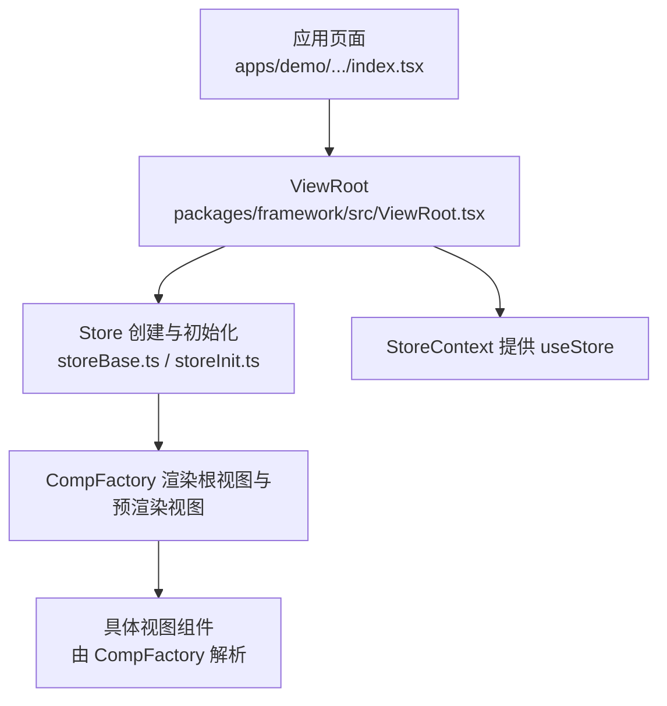
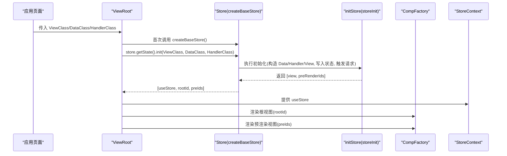
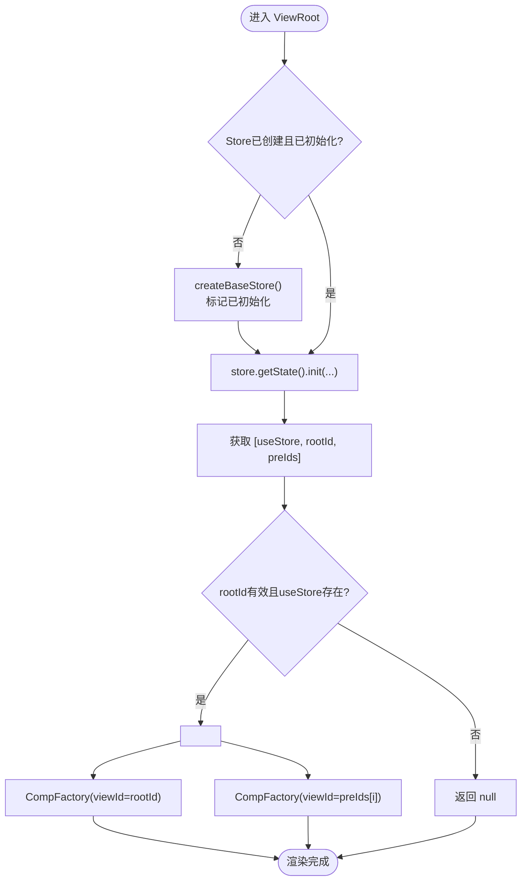
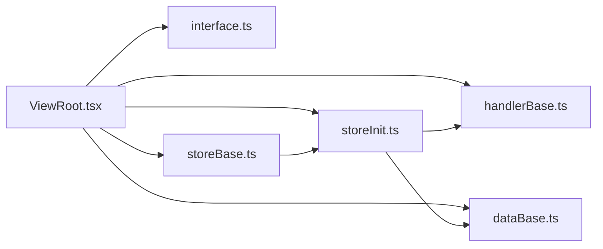

# ViewRoot组件

<cite>
**本文引用的文件**
- [ViewRoot.tsx](file://packages/framework/src/ViewRoot.tsx)
- [interface.ts](file://packages/framework/src/interface.ts)
- [storeBase.ts](file://packages/framework/src/stores/store/storeBase.ts)
- [storeInit.ts](file://packages/framework/src/stores/store/utils/storeInit.ts)
- [handlerBase.ts](file://packages/framework/src/handler/handlerBase.ts)
- [dataBase.ts](file://packages/framework/src/data/dataBase.ts)
- [drawer/index.tsx](file://apps/demo/src/pages/base/drawer/index.tsx)
- [table/index.tsx](file://apps/demo/src/pages/base/table/index.tsx)
- [form/index.tsx](file://apps/demo/src/pages/base/form/index.tsx)
- [tab/index.tsx](file://apps/demo/src/pages/base/tab/index.tsx)
- [drawer/data.tsx](file://apps/demo/src/pages/base/drawer/data.tsx)
- [drawer/handler.ts](file://apps/demo/src/pages/base/drawer/handler.ts)
- [2.组件用法.md](file://docs/2.组件用法.md)
</cite>

## 目录
1. [简介](#简介)
2. [项目结构](#项目结构)
3. [核心组件](#核心组件)
4. [架构总览](#架构总览)
5. [详细组件分析](#详细组件分析)
6. [依赖关系分析](#依赖关系分析)
7. [性能考虑](#性能考虑)
8. [故障排查指南](#故障排查指南)
9. [结论](#结论)
10. [附录](#附录)

## 简介
ViewRoot 是框架的视图渲染根节点，负责：
- 创建并缓存 Store 实例（基于 Zustand + immer）
- 初始化数据、视图与处理器，并将它们注入到全局上下文
- 通过 CompFactory 渲染根视图以及需要预渲染的布局类子视图（如 Modal、Drawer）
- 提供统一的配置接口 ViewProps，使页面以声明式方式组织数据、视图和事件处理

## 项目结构
围绕 ViewRoot 的关键文件与职责如下：
- packages/framework/src/ViewRoot.tsx：入口组件，管理 Store 生命周期与渲染
- packages/framework/src/interface.ts：定义 ViewProps、ViewHooksProps 等类型
- packages/framework/src/stores/store/storeBase.ts：创建 Store，暴露 init、数据读写、视图参数、请求刷新等方法
- packages/framework/src/stores/store/utils/storeInit.ts：实现 store 初始化流程（构造 Data/Handler/View，写入状态，触发请求）
- packages/framework/src/handler/handlerBase.ts：处理器基类，封装数据读写、网络请求、视图与弹窗控制
- packages/framework/src/data/dataBase.ts：数据基类，提供路径工具方法
- apps/demo 下的多个页面示例：展示如何在业务中使用 ViewRoot



图表来源
- [ViewRoot.tsx:11-46](file://packages/framework/src/ViewRoot.tsx#L11-L46)
- [storeBase.ts:18-55](file://packages/framework/src/stores/store/storeBase.ts#L18-L55)
- [storeInit.ts:15-51](file://packages/framework/src/stores/store/utils/storeInit.ts#L15-L51)

章节来源
- [ViewRoot.tsx:11-46](file://packages/framework/src/ViewRoot.tsx#L11-L46)
- [storeBase.ts:18-55](file://packages/framework/src/stores/store/storeBase.ts#L18-L55)
- [storeInit.ts:15-51](file://packages/framework/src/stores/store/utils/storeInit.ts#L15-L51)

## 核心组件
- ViewRoot：接收 ViewClass、DataClass、HandlerClass 三类构造函数，完成 Store 创建、初始化与渲染。内部使用 useRef 保证 Store 仅创建一次，useMemo 缓存初始化结果，避免重复计算。
- Store（createBaseStore）：基于 Zustand + immer，集中管理 data、req、view、viewParams、handler，并提供 init、setData/getData、setView/getView、refreshByViewId 等能力。
- HandlerBase：为业务处理器提供统一的数据访问、网络请求、视图参数设置与弹窗/抽屉控制能力。
- DataBase：数据基类，提供活动路径等便捷方法。

章节来源
- [ViewRoot.tsx:11-46](file://packages/framework/src/ViewRoot.tsx#L11-L46)
- [storeBase.ts:18-55](file://packages/framework/src/stores/store/storeBase.ts#L18-L55)
- [handlerBase.ts:10-90](file://packages/framework/src/handler/handlerBase.ts#L10-L90)
- [dataBase.ts:4-15](file://packages/framework/src/data/dataBase.ts#L4-L15)

## 架构总览
ViewRoot 作为根节点，串联了“配置 -> Store 初始化 -> 视图渲染”的完整链路。



图表来源
- [ViewRoot.tsx:11-46](file://packages/framework/src/ViewRoot.tsx#L11-L46)
- [storeBase.ts:18-55](file://packages/framework/src/stores/store/storeBase.ts#L18-L55)
- [storeInit.ts:15-51](file://packages/framework/src/stores/store/utils/storeInit.ts#L15-L51)

## 详细组件分析

### ViewRoot 组件
- 作用：作为视图渲染根节点，统一管理 Store 生命周期，驱动视图与数据初始化，并通过 Context 将 Store 暴露给子树。
- 关键实现要点：
  - 使用 useRef 保存 Store 实例与初始化标记，确保在 React StrictMode 下不会重复创建 Store。
  - 使用 useMemo 缓存初始化结果，依赖 ViewClass/DataClass/HandlerClass 变化时重新初始化。
  - 校验 rootId 与 useStore 有效性，无效时返回 null，避免空渲染。
  - 通过 CompFactory 渲染根视图与预渲染视图（Modal/Drawer）。



图表来源
- [ViewRoot.tsx:11-46](file://packages/framework/src/ViewRoot.tsx#L11-L46)

章节来源
- [ViewRoot.tsx:11-46](file://packages/framework/src/ViewRoot.tsx#L11-L46)

### Store 与初始化流程
- createBaseStore：基于 Zustand + immer 创建 Store，暴露 init、数据读写、视图参数、请求刷新等方法。
- initStore：首次初始化时创建 Data/Handler/View，写入 state.view/state.data/state.req，并触发所有数据请求；同时识别需要预渲染的布局视图（Modal/Drawer），返回其 id 列表以便提前挂载。

```mermaid
sequenceDiagram
participant ST as "Store"
participant SI as "initStore"
participant DR as "DataClass"
participant HV as "HandlerClass"
participant VV as "ViewClass"
participant SR as "StoreReq"
ST->>SI : init(ViewClass, DataClass, HandlerClass)
SI->>HV : new HandlerClass(); handler.init(getStore)
SI->>SR : StoreReq.init(getStore, setState)
SI->>DR : new DataClass()
SI->>VV : new ViewClass(handler, data)
SI->>ST : 写入 view/data/req
SI->>SR : fetchAllReq()
SI-->>ST : 返回 [view, preRenderIds]
```

图表来源
- [storeInit.ts:15-51](file://packages/framework/src/stores/store/utils/storeInit.ts#L15-L51)
- [storeBase.ts:18-55](file://packages/framework/src/stores/store/storeBase.ts#L18-L55)

章节来源
- [storeBase.ts:18-55](file://packages/framework/src/stores/store/storeBase.ts#L18-L55)
- [storeInit.ts:15-51](file://packages/framework/src/stores/store/utils/storeInit.ts#L15-L51)

### ViewProps 接口与使用方法
- ViewProps 包含三个必填项：
  - ViewClass：视图构造函数，用于生成视图实例
  - DataClass：数据构造函数，用于生成数据源实例
  - HandlerClass：处理器构造函数，用于绑定事件与逻辑
- 典型用法：在页面中引入这三个类，并以 <ViewRoot ViewClass=... DataClass=... HandlerClass=... /> 的方式挂载。

章节来源
- [interface.ts:20-34](file://packages/framework/src/interface.ts#L20-L34)
- [2.组件用法.md:430-444](file://docs/2.组件用法.md#L430-L444)
- [drawer/index.tsx:1-9](file://apps/demo/src/pages/base/drawer/index.tsx#L1-L9)
- [table/index.tsx:1-9](file://apps/demo/src/pages/base/table/index.tsx#L1-L9)
- [form/index.tsx:1-9](file://apps/demo/src/pages/base/form/index.tsx#L1-L9)
- [tab/index.tsx:1-9](file://apps/demo/src/pages/base/tab/index.tsx#L1-L9)

### useRef 与 useMemo 的性能优化
- useRef：
  - 用于持久化 Store 实例与初始化标记，避免在 StrictMode 或重渲染时重复创建 Store，减少不必要的初始化开销。
- useMemo：
  - 缓存初始化结果（useStore、rootId、preIds），仅在 ViewClass/DataClass/HandlerClass 变化时重新计算，降低渲染成本。

章节来源
- [ViewRoot.tsx:16-32](file://packages/framework/src/ViewRoot.tsx#L16-L32)

### 错误处理与边界情况
- 根视图未就绪：当 rootId 不是字符串或 useStore 为空时，直接返回 null，避免渲染异常。
- 处理器查找失败：在 HandlerBase 中，若根据 viewId 找不到对应 handler，会抛出错误，便于快速定位问题。
- 预渲染视图缺失：getPreRenderIds 会跳过没有 type/id 的视图属性，防止无效节点导致渲染错误。

章节来源
- [ViewRoot.tsx:34-36](file://packages/framework/src/ViewRoot.tsx#L34-L36)
- [handlerBase.ts:61-79](file://packages/framework/src/handler/handlerBase.ts#L61-L79)
- [storeInit.ts:53-70](file://packages/framework/src/stores/store/utils/storeInit.ts#L53-L70)

### 使用示例（来自仓库）
- 基础页面挂载：
  - drawer/index.tsx：导入 ViewRoot 并传入 ViewClass/DataClass/HandlerClass
  - table/index.tsx、form/index.tsx、tab/index.tsx：同上
- 数据与处理器示例：
  - drawer/data.tsx：继承 DataBase，定义数据项
  - drawer/handler.ts：继承 HandlerBase，演示打开抽屉

章节来源
- [drawer/index.tsx:1-9](file://apps/demo/src/pages/base/drawer/index.tsx#L1-L9)
- [table/index.tsx:1-9](file://apps/demo/src/pages/base/table/index.tsx#L1-L9)
- [form/index.tsx:1-9](file://apps/demo/src/pages/base/form/index.tsx#L1-L9)
- [tab/index.tsx:1-9](file://apps/demo/src/pages/base/tab/index.tsx#L1-L9)
- [drawer/data.tsx:1-10](file://apps/demo/src/pages/base/drawer/data.tsx#L1-L10)
- [drawer/handler.ts:1-10](file://apps/demo/src/pages/base/drawer/handler.ts#L1-L10)

## 依赖关系分析
ViewRoot 与其依赖的关系如下：



图表来源
- [ViewRoot.tsx:1-9](file://packages/framework/src/ViewRoot.tsx#L1-L9)
- [storeBase.ts:1-17](file://packages/framework/src/stores/store/storeBase.ts#L1-L17)
- [storeInit.ts:1-9](file://packages/framework/src/stores/store/utils/storeInit.ts#L1-L9)

章节来源
- [ViewRoot.tsx:1-9](file://packages/framework/src/ViewRoot.tsx#L1-L9)
- [storeBase.ts:1-17](file://packages/framework/src/stores/store/storeBase.ts#L1-L17)
- [storeInit.ts:1-9](file://packages/framework/src/stores/store/utils/storeInit.ts#L1-L9)

## 性能考虑
- Store 单例：通过 useRef 确保 Store 只创建一次，避免 StrictMode 下的重复初始化。
- 计算缓存：useMemo 缓存初始化结果，减少重复计算。
- 预渲染策略：对 Modal/Drawer 等布局类视图进行预渲染，提升交互响应速度。
- 数据更新：Store 使用 immer 中间件，支持不可变数据的浅比较，减少不必要重渲染。

[本节为通用性能建议，不直接分析具体文件]

## 故障排查指南
- 页面空白：检查 ViewRoot 是否返回 null（可能因 rootId 非字符串或 useStore 为空）。
- 处理器报错：确认目标 viewId 对应的 handler 是否存在，必要时查看 HandlerBase 的错误抛出位置。
- 数据未加载：确认 initDataAndReq 与 StoreReq.fetchAllReq 是否被调用，检查数据配置是否正确。
- 预渲染视图未显示：检查视图是否具备 type 与 id，且类型为 LayoutModal/LayoutDrawer。

章节来源
- [ViewRoot.tsx:34-36](file://packages/framework/src/ViewRoot.tsx#L34-L36)
- [handlerBase.ts:61-79](file://packages/framework/src/handler/handlerBase.ts#L61-L79)
- [storeInit.ts:15-51](file://packages/framework/src/stores/store/utils/storeInit.ts#L15-L51)

## 结论
ViewRoot 作为框架的根节点，将 Store、数据、视图与处理器有机整合，提供了稳定高效的初始化与渲染机制。通过合理的 useRef/useMemo 优化与预渲染策略，保证了良好的性能与可维护性。配合清晰的 ViewProps 接口与示例，开发者可以快速构建复杂的前端页面。

## 附录
- 更多用法参考：
  - docs/2.组件用法.md：包含 ViewRoot 的使用示例与分类总结
  - apps/demo 各页面：展示了不同场景下的 ViewRoot 集成方式

章节来源
- [2.组件用法.md:430-455](file://docs/2.组件用法.md#L430-L455)