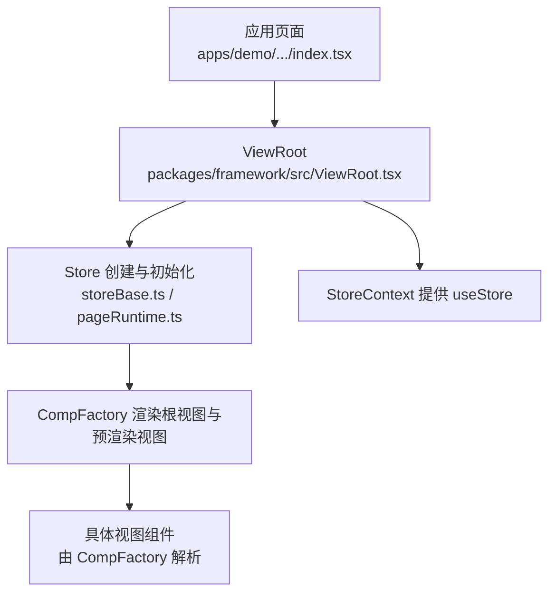
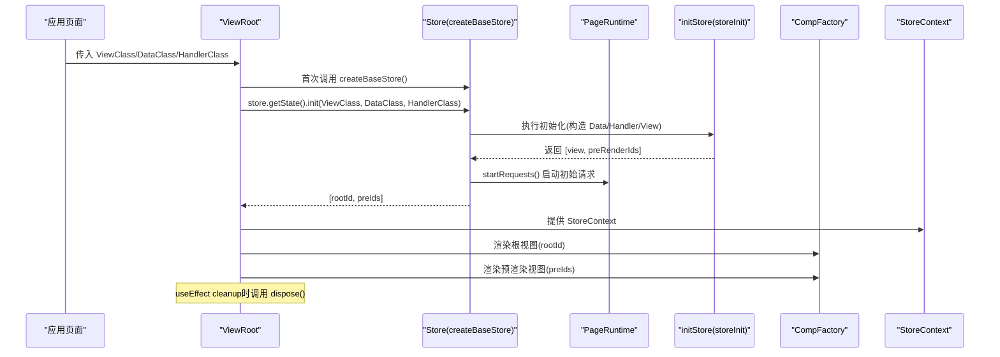
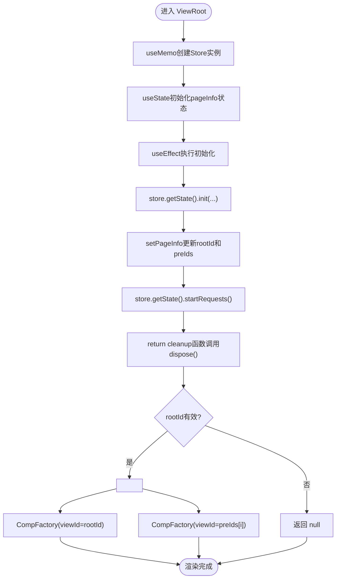
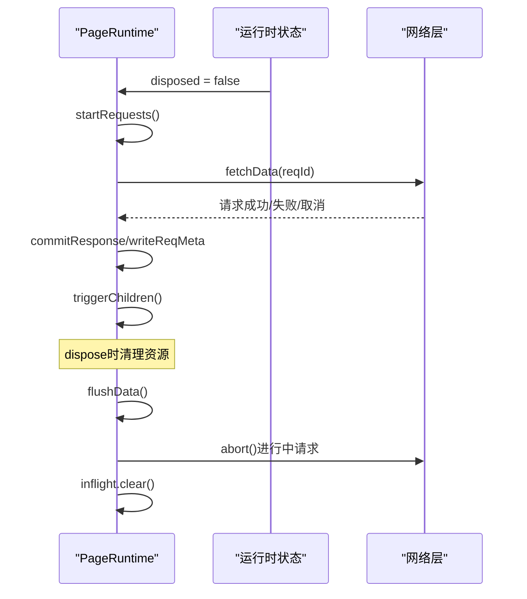
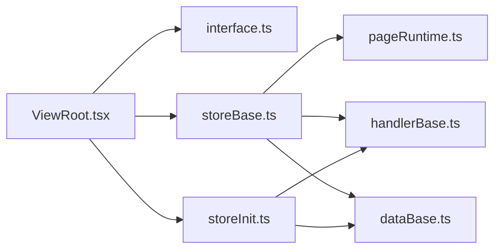

# ViewRoot组件

<cite>
**本文引用的文件**
- [ViewRoot.tsx](file://packages/framework/src/ViewRoot.tsx)
- [interface.ts](file://packages/framework/src/interface.ts)
- [storeBase.ts](file://packages/framework/src/stores/store/storeBase.ts)
- [pageRuntime.ts](file://packages/framework/src/stores/store/utils/pageRuntime.ts)
- [storeInit.ts](file://packages/framework/src/stores/store/utils/storeInit.ts)
- [handlerBase.ts](file://packages/framework/src/handler/handlerBase.ts)
- [dataBase.ts](file://packages/framework/src/data/dataBase.ts)
- [drawer/index.tsx](file://apps/demo/src/pages/base/drawer/index.tsx)
- [table/index.tsx](file://apps/demo/src/pages/base/table/index.tsx)
- [form/index.tsx](file://apps/demo/src/pages/base/form/index.tsx)
- [tab/index.tsx](file://apps/demo/src/pages/base/tab/index.tsx)
- [drawer/data.tsx](file://apps/demo/src/pages/base/drawer/data.tsx)
- [drawer/handler.ts](file://apps/demo/src/pages/base/drawer/handler.ts)
- [2.组件用法.md](file://docs/2.组件用法.md)
</cite>

## 更新摘要
**变更内容**
- 重构了ViewRoot组件的生命周期管理，从简单的store初始化模式转变为基于effect的初始化和清理模式
- 引入PageRuntime进行更健壮的生命周期管理，支持请求去重、竞态取消和防抖输入提交
- 更新了Store创建和初始化流程，将副作用统一放在effect中处理
- 增强了错误处理和边界情况处理能力

## 目录
1. [简介](#简介)
2. [项目结构](#项目结构)
3. [核心组件](#核心组件)
4. [架构总览](#架构总览)
5. [详细组件分析](#详细组件分析)
6. [依赖关系分析](#依赖关系分析)
7. [性能考虑](#性能考虑)
8. [故障排查指南](#故障排查指南)
9. [结论](#结论)
10. [附录](#附录)

## 简介
ViewRoot 是框架的视图渲染根节点，负责：
- 使用新的PageRuntime进行更健壮的生命周期管理
- 通过effect钩子统一管理Store实例的初始化和清理
- 处理组件生命周期，确保在StrictMode下不会重复创建Store
- 提供统一的配置接口 ViewProps，使页面以声明式方式组织数据、视图和事件处理
- 管理请求去重、竞态取消和防抖输入等高级特性

## 项目结构
围绕 ViewRoot 的关键文件与职责如下：
- packages/framework/src/ViewRoot.tsx：入口组件，使用effect管理Store生命周期与渲染
- packages/framework/src/interface.ts：定义 ViewProps、ViewHooksProps 等类型
- packages/framework/src/stores/store/storeBase.ts：创建 Store，暴露 init、startRequests、dispose 等方法
- packages/framework/src/stores/store/utils/pageRuntime.ts：PageRuntime类，管理请求生命周期和防抖逻辑
- packages/framework/src/stores/store/utils/storeInit.ts：实现 store 初始化流程（构造 Data/Handler/View）
- packages/framework/src/handler/handlerBase.ts：处理器基类，封装数据读写、网络请求、视图与弹窗控制
- packages/framework/src/data/dataBase.ts：数据基类，提供路径工具方法
- apps/demo 下的多个页面示例：展示如何在业务中使用 ViewRoot

```mermaid
graph TB
A["应用页面<br/>apps/demo/.../index.tsx"] --> B["ViewRoot<br/>packages/framework/src/ViewRoot.tsx"]
B --> C["Store 创建与初始化<br/>storeBase.ts / pageRuntime.ts"]
C --> D["CompFactory 渲染根视图与预渲染视图"]
B --> E["StoreContext 提供 useStore"]
D --> F["具体视图组件<br/>由 CompFactory 解析"]
```

**图表来源**
- [ViewRoot.tsx:11-55](file://packages/framework/src/ViewRoot.tsx#L11-L55)
- [storeBase.ts:20-95](file://packages/framework/src/stores/store/storeBase.ts#L20-L95)
- [pageRuntime.ts:35-105](file://packages/framework/src/stores/store/utils/pageRuntime.ts#L35-L105)

**章节来源**
- [ViewRoot.tsx:11-55](file://packages/framework/src/ViewRoot.tsx#L11-L55)
- [storeBase.ts:20-95](file://packages/framework/src/stores/store/storeBase.ts#L20-L95)
- [pageRuntime.ts:35-105](file://packages/framework/src/stores/store/utils/pageRuntime.ts#L35-L105)

## 核心组件
- ViewRoot：接收 ViewClass、DataClass、HandlerClass 三类构造函数，使用useEffect管理Store生命周期，完成初始化与渲染。内部使用useRef保证Store仅创建一次，useMemo缓存初始化结果。
- PageRuntime：新的页面运行时类，管理请求去重、竞态取消、重试机制和防抖输入，提供startRequests和dispose方法进行生命周期管理。
- Store（createBaseStore）：基于 Zustand + immer，集中管理 data、req、view、viewParams、handler，并提供init、startRequests、dispose等能力。
- HandlerBase：为业务处理器提供统一的数据访问、网络请求、视图参数设置与弹窗/抽屉控制能力。
- DataBase：数据基类，提供活动路径等便捷方法。

**章节来源**
- [ViewRoot.tsx:11-55](file://packages/framework/src/ViewRoot.tsx#L11-L55)
- [pageRuntime.ts:35-105](file://packages/framework/src/stores/store/utils/pageRuntime.ts#L35-L105)
- [storeBase.ts:20-95](file://packages/framework/src/stores/store/storeBase.ts#L20-L95)
- [handlerBase.ts:10-90](file://packages/framework/src/handler/handlerBase.ts#L10-L90)
- [dataBase.ts:4-15](file://packages/framework/src/data/dataBase.ts#L4-L15)

## 架构总览
ViewRoot 作为根节点，串联了"配置 -> Store 初始化 -> 视图渲染"的完整链路，现在使用PageRuntime进行更健壮的生命周期管理。

```mermaid
sequenceDiagram
participant App as "应用页面"
participant VR as "ViewRoot"
participant ST as "Store(createBaseStore)"
participant PR as "PageRuntime"
participant SI as "initStore(storeInit)"
participant CF as "CompFactory"
participant CTX as "StoreContext"
App->>VR : 传入 ViewClass/DataClass/HandlerClass
VR->>ST : 首次调用 createBaseStore()
VR->>ST : store.getState().init(ViewClass, DataClass, HandlerClass)
ST->>SI : 执行初始化(构造 Data/Handler/View)
SI-->>ST : 返回 [view, preRenderIds]
ST->>PR : startRequests() 启动初始请求
ST-->>VR : [rootId, preIds]
VR->>CTX : 提供 StoreContext
VR->>CF : 渲染根视图(rootId)
VR->>CF : 渲染预渲染视图(preIds)
Note over VR : useEffect cleanup时调用 dispose()
```

**图表来源**
- [ViewRoot.tsx:25-40](file://packages/framework/src/ViewRoot.tsx#L25-L40)
- [storeBase.ts:33-38](file://packages/framework/src/stores/store/storeBase.ts#L33-L38)
- [pageRuntime.ts:83-105](file://packages/framework/src/stores/store/utils/pageRuntime.ts#L83-L105)
- [storeInit.ts:14-49](file://packages/framework/src/stores/store/utils/storeInit.ts#L14-L49)

## 详细组件分析

### ViewRoot 组件
- 作用：作为视图渲染根节点，使用effect统一管理Store生命周期，驱动视图与数据初始化，并通过Context将Store暴露给子树。
- **更新**：重构为基于effect的初始化和清理模式，将副作用从渲染期移到effect中，避免React StrictMode下的重复初始化问题。
- 关键实现要点：
  - 使用useMemo创建Store实例，确保只创建一次且无副作用
  - 使用useState管理pageInfo状态，包含rootId和preIds
  - 使用useEffect处理初始化逻辑，包括init、startRequests和cleanup
  - 校验 rootId 有效性，无效时返回 null，避免空渲染
  - 通过 CompFactory 渲染根视图与预渲染视图（Modal/Drawer）

```mermaid
flowchart TD
Start(["进入 ViewRoot"]) --> CreateStore["useMemo创建Store实例"]
CreateStore --> SetState["useState初始化pageInfo状态"]
SetState --> Effect["useEffect执行初始化"]
Effect --> InitStore["store.getState().init(...)"]
InitStore --> UpdateState["setPageInfo更新rootId和preIds"]
UpdateState --> StartReq["store.getState().startRequests()"]
StartReq --> Cleanup["return cleanup函数调用dispose()"]
Cleanup --> Render{"rootId有效?"}
Render -- "否" --> ReturnNull["返回 null"]
Render -- "是" --> RenderNode["<StoreContext value={store}>"]
RenderNode --> RootNode["CompFactory(viewId=rootId)"]
RenderNode --> PreNodes["CompFactory(viewId=preIds[i])"]
RootNode --> End(["渲染完成"])
PreNodes --> End
ReturnNull --> End
```

**图表来源**
- [ViewRoot.tsx:16-40](file://packages/framework/src/ViewRoot.tsx#L16-L40)

**章节来源**
- [ViewRoot.tsx:16-40](file://packages/framework/src/ViewRoot.tsx#L16-L40)

### PageRuntime 生命周期管理
- **新增**：PageRuntime类提供了完整的页面生命周期管理，包括请求去重、竞态取消、重试机制和防抖输入处理。
- 核心功能：
  - startRequests：启动所有无父节点的初始请求，支持幂等调用
  - dispose：释放页面运行时，提交未落盘的防抖输入，取消进行中的请求
  - fetchData：带重试的请求发送，支持并发去重和竞态取消
  - setDataDebounce：防抖写入，同一路径的连续写入合并为最后一次
  - flushData：立即提交防抖待写数据

```mermaid
sequenceDiagram
participant PR as "PageRuntime"
participant RT as "运行时状态"
participant NET as "网络层"
RT->>PR : disposed = false
PR->>PR : startRequests()
PR->>NET : fetchData(reqId)
NET-->>PR : 请求成功/失败/取消
PR->>PR : commitResponse/writeReqMeta
PR->>PR : triggerChildren()
Note over PR : dispose时清理资源
PR->>PR : flushData()
PR->>NET : abort()进行中请求
PR->>PR : inflight.clear()
```

**图表来源**
- [pageRuntime.ts:83-105](file://packages/framework/src/stores/store/utils/pageRuntime.ts#L83-L105)
- [pageRuntime.ts:169-176](file://packages/framework/src/stores/store/utils/pageRuntime.ts#L169-L176)
- [pageRuntime.ts:328-342](file://packages/framework/src/stores/store/utils/pageRuntime.ts#L328-L342)

**章节来源**
- [pageRuntime.ts:83-105](file://packages/framework/src/stores/store/utils/pageRuntime.ts#L83-L105)
- [pageRuntime.ts:169-176](file://packages/framework/src/stores/store/utils/pageRuntime.ts#L169-L176)
- [pageRuntime.ts:328-342](file://packages/framework/src/stores/store/utils/pageRuntime.ts#L328-L342)

### Store 与初始化流程
- createBaseStore：基于 Zustand + immer 创建 Store，集成PageRuntime，暴露init、startRequests、dispose等方法。
- initStore：首次初始化时创建 Data/Handler/View，写入 state.view/state.data/state.req，并识别需要预渲染的布局视图。
- **更新**：现在请求启动和清理都通过PageRuntime管理，确保生命周期的一致性。

```mermaid
sequenceDiagram
participant ST as "Store"
participant PR as "PageRuntime"
participant SI as "initStore"
participant DR as "DataClass"
participant HV as "HandlerClass"
participant VV as "ViewClass"
ST->>PR : new PageRuntime(get, set)
ST->>SI : init(ViewClass, DataClass, HandlerClass)
SI->>HV : new HandlerClass(); handler.init(getStore)
SI->>DR : new DataClass()
SI->>VV : new ViewClass(handler, data)
SI->>ST : 写入 view/data/req
ST->>PR : startRequests()
SI-->>ST : 返回 [view, preRenderIds]
```

**图表来源**
- [storeBase.ts:20-38](file://packages/framework/src/stores/store/storeBase.ts#L20-L38)
- [storeInit.ts:14-49](file://packages/framework/src/stores/store/utils/storeInit.ts#L14-L49)
- [pageRuntime.ts:83-92](file://packages/framework/src/stores/store/utils/pageRuntime.ts#L83-L92)

**章节来源**
- [storeBase.ts:20-38](file://packages/framework/src/stores/store/storeBase.ts#L20-L38)
- [storeInit.ts:14-49](file://packages/framework/src/stores/store/utils/storeInit.ts#L14-L49)
- [pageRuntime.ts:83-92](file://packages/framework/src/stores/store/utils/pageRuntime.ts#L83-L92)

### ViewProps 接口与使用方法
- ViewProps 包含三个必填项：
  - ViewClass：视图构造函数，用于生成视图实例
  - DataClass：数据构造函数，用于生成数据源实例
  - HandlerClass：处理器构造函数，用于绑定事件与逻辑
- 典型用法：在页面中引入这三个类，并以 <ViewRoot ViewClass=... DataClass=... HandlerClass=... /> 的方式挂载。

**章节来源**
- [interface.ts:26-34](file://packages/framework/src/interface.ts#L26-L34)
- [2.组件用法.md:430-444](file://docs/2.组件用法.md#L430-L444)
- [drawer/index.tsx:1-9](file://apps/demo/src/pages/base/drawer/index.tsx#L1-L9)
- [table/index.tsx:1-9](file://apps/demo/src/pages/base/table/index.tsx#L1-L9)
- [form/index.tsx:1-9](file://apps/demo/src/pages/base/form/index.tsx#L1-L9)
- [tab/index.tsx:1-9](file://apps/demo/src/pages/base/tab/index.tsx#L1-L9)

### useRef 与 useMemo 的性能优化
- **更新**：现在主要使用useMemo创建Store实例，useEffect处理副作用，useState管理渲染状态。
- useMemo：
  - 用于创建Store实例，确保只创建一次且无副作用
  - 依赖数组为空，保证Store实例在整个组件生命周期内稳定
- useState：
  - 管理pageInfo状态，包含rootId和preIds
  - 仅在初始化完成后更新，避免不必要的重渲染
- useEffect：
  - 处理初始化逻辑，包括init、startRequests和cleanup
  - 依赖数组包含store和三个Class，确保依赖变化时重新初始化

**章节来源**
- [ViewRoot.tsx:16-40](file://packages/framework/src/ViewRoot.tsx#L16-L40)

### 错误处理与边界情况
- **更新**：现在通过PageRuntime提供更健壮的错误处理机制。
- 根视图未就绪：当 rootId 不是字符串或 useStore 为空时，直接返回 null，避免渲染异常。
- 处理器查找失败：在 HandlerBase 中，若根据 viewId 找不到对应 handler，会抛出错误，便于快速定位问题。
- 预渲染视图缺失：getPreRenderIds 会跳过没有 type/id 的视图属性，防止无效节点导致渲染错误。
- 请求错误处理：PageRuntime内置请求重试、竞态取消和错误日志记录。
- 防抖输入保护：dispose时自动提交未落盘的防抖输入，避免数据丢失。

**章节来源**
- [ViewRoot.tsx:42-45](file://packages/framework/src/ViewRoot.tsx#L42-L45)
- [handlerBase.ts:61-79](file://packages/framework/src/handler/handlerBase.ts#L61-L79)
- [storeInit.ts:52-69](file://packages/framework/src/stores/store/utils/storeInit.ts#L52-L69)
- [pageRuntime.ts:100-105](file://packages/framework/src/stores/store/utils/pageRuntime.ts#L100-L105)
- [pageRuntime.ts:169-176](file://packages/framework/src/stores/store/utils/pageRuntime.ts#L169-L176)

### 使用示例（来自仓库）
- 基础页面挂载：
  - drawer/index.tsx：导入 ViewRoot 并传入 ViewClass/DataClass/HandlerClass
  - table/index.tsx、form/index.tsx、tab/index.tsx：同上
- 数据与处理器示例：
  - drawer/data.tsx：继承 DataBase，定义数据项
  - drawer/handler.ts：继承 HandlerBase，演示打开抽屉

**章节来源**
- [drawer/index.tsx:1-9](file://apps/demo/src/pages/base/drawer/index.tsx#L1-L9)
- [table/index.tsx:1-9](file://apps/demo/src/pages/base/table/index.tsx#L1-L9)
- [form/index.tsx:1-9](file://apps/demo/src/pages/base/form/index.tsx#L1-L9)
- [tab/index.tsx:1-9](file://apps/demo/src/pages/base/tab/index.tsx#L1-L9)
- [drawer/data.tsx:1-10](file://apps/demo/src/pages/base/drawer/data.tsx#L1-L10)
- [drawer/handler.ts:1-10](file://apps/demo/src/pages/base/drawer/handler.ts#L1-L10)

## 依赖关系分析
ViewRoot 与其依赖的关系如下：

```mermaid
graph LR
VR["ViewRoot.tsx"] --> IF["interface.ts"]
VR --> SB["storeBase.ts"]
VR --> SI["storeInit.ts"]
SB --> PR["pageRuntime.ts"]
SB --> HB["handlerBase.ts"]
SB --> DB["dataBase.ts"]
SI --> HB
SI --> DB
```

**图表来源**
- [ViewRoot.tsx:1-8](file://packages/framework/src/ViewRoot.tsx#L1-L8)
- [storeBase.ts:1-18](file://packages/framework/src/stores/store/storeBase.ts#L1-L18)
- [storeInit.ts:1-8](file://packages/framework/src/stores/store/utils/storeInit.ts#L1-L8)

**章节来源**
- [ViewRoot.tsx:1-8](file://packages/framework/src/ViewRoot.tsx#L1-L8)
- [storeBase.ts:1-18](file://packages/framework/src/stores/store/storeBase.ts#L1-L18)
- [storeInit.ts:1-8](file://packages/framework/src/stores/store/utils/storeInit.ts#L1-L8)

## 性能考虑
- **更新**：现在使用PageRuntime进行更高效的请求管理和内存管理。
- Store 单例：通过useMemo确保Store只创建一次，避免StrictMode下的重复初始化。
- 计算缓存：useState管理渲染状态，仅在初始化完成后更新。
- 预渲染策略：对 Modal/Drawer 等布局类视图进行预渲染，提升交互响应速度。
- 数据更新：Store 使用 immer 中间件，支持不可变数据的浅比较，减少不必要重渲染。
- 请求优化：PageRuntime提供请求去重、竞态取消和重试机制，减少网络开销。
- 防抖输入：用户输入防抖处理，减少频繁的状态更新。

## 故障排查指南
- **更新**：新增了PageRuntime相关的故障排查指导。
- 页面空白：检查 ViewRoot 是否返回 null（可能因 rootId 非字符串）。
- 处理器报错：确认目标 viewId 对应的 handler 是否存在，必要时查看 HandlerBase 的错误抛出位置。
- 数据未加载：确认 initDataAndReq 与 PageRuntime.startRequests 是否被调用，检查数据配置是否正确。
- 预渲染视图未显示：检查视图是否具备 type 与 id，且类型为 LayoutModal/LayoutDrawer。
- 请求失败：查看PageRuntime的错误日志，检查网络请求配置和重试机制。
- 内存泄漏：确认组件卸载时dispose是否正确调用，清理进行中的请求和定时器。
- 防抖输入丢失：检查dispose是否在正确时机调用，确保未落盘数据得到提交。

**章节来源**
- [ViewRoot.tsx:42-45](file://packages/framework/src/ViewRoot.tsx#L42-L45)
- [handlerBase.ts:61-79](file://packages/framework/src/handler/handlerBase.ts#L61-L79)
- [storeInit.ts:14-49](file://packages/framework/src/stores/store/utils/storeInit.ts#L14-L49)
- [pageRuntime.ts:100-105](file://packages/framework/src/stores/store/utils/pageRuntime.ts#L100-L105)

## 结论
ViewRoot 作为框架的根节点，通过引入PageRuntime实现了更健壮的生命周期管理，将Store、数据、视图与处理器有机整合，提供了稳定高效的初始化与渲染机制。新的基于effect的初始化模式和PageRuntime的请求管理能力，保证了良好的性能、可维护性和用户体验。配合清晰的 ViewProps 接口与示例，开发者可以快速构建复杂的前端页面。

## 附录
- 更多用法参考：
  - docs/2.组件用法.md：包含 ViewRoot 的使用示例与分类总结
  - apps/demo 各页面：展示了不同场景下的 ViewRoot 集成方式

**章节来源**
- [2.组件用法.md:430-455](file://docs/2.组件用法.md#L430-L455)