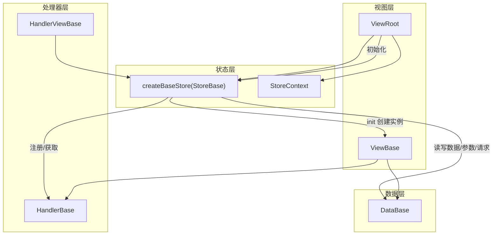
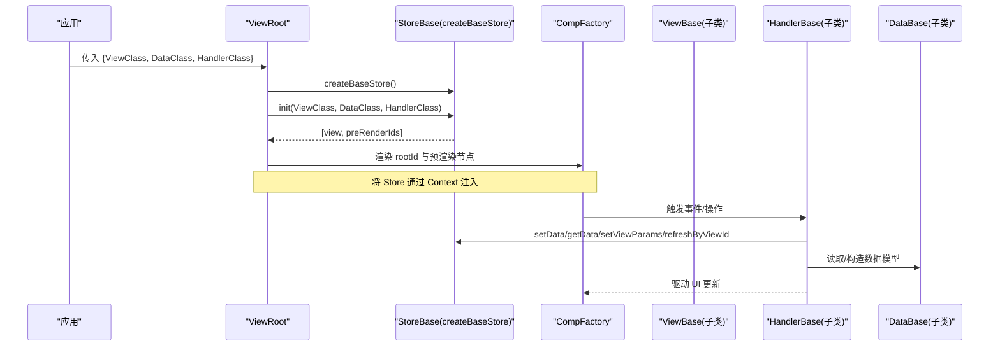
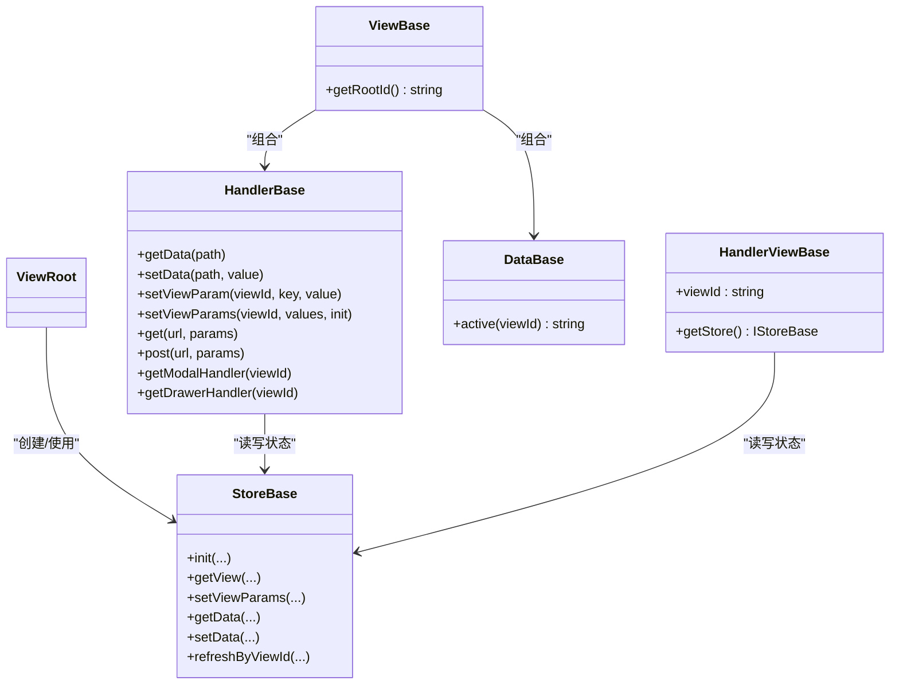

# 核心组件

<cite>
**本文引用的文件**
- [ViewRoot.tsx](file://packages/framework/src/ViewRoot.tsx)
- [viewBase.ts](file://packages/framework/src/comp/viewBase.ts)
- [dataBase.ts](file://packages/framework/src/data/dataBase.ts)
- [handlerBase.ts](file://packages/framework/src/handler/handlerBase.ts)
- [handlerViewBase.ts](file://packages/framework/src/handler/handlerViewBase.ts)
- [storeBase.ts](file://packages/framework/src/stores/store/storeBase.ts)
- [storeContext.ts](file://packages/framework/src/stores/store/storeContext.ts)
- [interface.ts](file://packages/framework/src/interface.ts)
- [handlerModal.tsx](file://packages/framework/src/comp/view/modal/handler/handlerModal.tsx)
- [handlerDrawer.tsx](file://packages/framework/src/comp/view/drawer/handler/handlerDrawer.tsx)
</cite>

## 目录
1. [简介](#简介)
2. [项目结构](#项目结构)
3. [核心组件](#核心组件)
4. [架构总览](#架构总览)
5. [详细组件分析](#详细组件分析)
6. [依赖关系分析](#依赖关系分析)
7. [性能与内存管理](#性能与内存管理)
8. [故障排查指南](#故障排查指南)
9. [结论](#结论)
10. [附录：API参考与最佳实践](#附录api参考与最佳实践)

## 简介
本文件聚焦 WMS Web 项目的框架层核心组件，围绕 ViewRoot、ViewBase、StoreBase（基于 zustand 的 store 工厂）、DataBase 等基础能力，系统阐述其设计理念、职责边界、生命周期、扩展点、继承与组合模式，并提供 API 参考与使用最佳实践。目标是帮助开发者快速理解并安全地扩展这些基础组件，构建可维护、高性能的视图与数据流。

## 项目结构
框架位于 packages/framework/src，核心入口为 ViewRoot，负责创建 Store、初始化视图树、注入上下文；视图基类 ViewBase 提供 handler 与 data 的强类型绑定；数据基类 DataBase 提供静态工具方法；处理器基类 HandlerBase 封装数据读写、网络请求、视图参数与弹窗/抽屉控制；Store 由 createBaseStore 统一创建，基于 immer 实现不可变更新，并通过 utils 模块组织视图、处理器、数据与请求相关能力。

图表来源
- [ViewRoot.tsx:1-49](file://packages/framework/src/ViewRoot.tsx#L1-L49)
- [storeBase.ts:1-58](file://packages/framework/src/stores/store/storeBase.ts#L1-L58)
- [viewBase.ts:1-16](file://packages/framework/src/comp/viewBase.ts#L1-L16)
- [dataBase.ts:1-18](file://packages/framework/src/data/dataBase.ts#L1-L18)
- [handlerBase.ts:1-91](file://packages/framework/src/handler/handlerBase.ts#L1-L91)
- [handlerViewBase.ts:1-17](file://packages/framework/src/handler/handlerViewBase.ts#L1-L17)

章节来源
- [ViewRoot.tsx:1-49](file://packages/framework/src/ViewRoot.tsx#L1-L49)
- [storeBase.ts:1-58](file://packages/framework/src/stores/store/storeBase.ts#L1-L58)

## 核心组件
- ViewRoot：应用级视图根节点，负责创建唯一 Store、初始化视图树、渲染 CompFactory 子树，并将 Store 通过 Context 注入。
- ViewBase：视图抽象基类，持有 handler 与 data，要求子类实现 getRootId，用于标识视图根节点。
- StoreBase（createBaseStore）：基于 zustand + immer 的状态容器，提供 init、视图/参数读写、处理器注册与获取、数据读写、请求刷新等能力。
- DataBase：数据基类，提供静态工具方法（如活动路径），并作为数据类的约束基类。
- HandlerBase：处理器基类，封装数据访问、视图参数设置、网络请求、以及弹窗/抽屉控制器获取。
- HandlerViewBase：视图控件处理器基类，提供 viewId 与 getStore 能力，供 Modal/Drawer 等控件处理器复用。

章节来源
- [ViewRoot.tsx:1-49](file://packages/framework/src/ViewRoot.tsx#L1-L49)
- [viewBase.ts:1-16](file://packages/framework/src/comp/viewBase.ts#L1-L16)
- [storeBase.ts:1-58](file://packages/framework/src/stores/store/storeBase.ts#L1-L58)
- [dataBase.ts:1-18](file://packages/framework/src/data/dataBase.ts#L1-L18)
- [handlerBase.ts:1-91](file://packages/framework/src/handler/handlerBase.ts#L1-L91)
- [handlerViewBase.ts:1-17](file://packages/framework/src/handler/handlerViewBase.ts#L1-L17)

## 架构总览
下图展示从 ViewRoot 到 Store、再到具体视图与处理器的调用链，以及数据与请求的交互方式。

图表来源
- [ViewRoot.tsx:1-49](file://packages/framework/src/ViewRoot.tsx#L1-L49)
- [storeBase.ts:1-58](file://packages/framework/src/stores/store/storeBase.ts#L1-L58)
- [handlerBase.ts:1-91](file://packages/framework/src/handler/handlerBase.ts#L1-L91)

## 详细组件分析

### ViewRoot：视图根节点与 Store 生命周期
- 职责边界
  - 创建并缓存 Store，避免 StrictMode 下重复创建。
  - 调用 Store.init 完成视图、数据、处理器的实例化与注册。
  - 渲染根视图与预渲染节点，并通过 Context 暴露 Store。
- 生命周期
  - 首次挂载：创建 Store，执行 init，返回根视图 ID 与预渲染列表。
  - 后续渲染：复用已创建的 Store，仅根据 props 变化重新计算。
- 扩展点
  - 可通过自定义 ViewClass/DataClass/HandlerClass 接入业务视图。
  - 可在 Store 中扩展更多全局能力（如拦截器、日志）。
- 错误处理
  - 若未正确返回根 ID 或 Store 未就绪，直接返回空节点，避免崩溃。

章节来源
- [ViewRoot.tsx:1-49](file://packages/framework/src/ViewRoot.tsx#L1-L49)
- [storeBase.ts:1-58](file://packages/framework/src/stores/store/storeBase.ts#L1-L58)
- [interface.ts:20-35](file://packages/framework/src/interface.ts#L20-L35)

### ViewBase：视图抽象基类
- 设计要点
  - 以泛型约束 handler 与 data 的类型，确保类型安全。
  - 强制实现 getRootId，用于在 Store 中标识视图根节点。
- 组合模式
  - 组合 HandlerBase 与 DataBase 实例，解耦 UI 与数据/逻辑。
- 生命周期
  - 由 Store.init 创建并注入，随后被 CompFactory 渲染。
- 扩展点
  - 子类可定义业务视图逻辑，并通过 handler 与 data 进行交互。

章节来源
- [viewBase.ts:1-16](file://packages/framework/src/comp/viewBase.ts#L1-L16)
- [interface.ts:20-35](file://packages/framework/src/interface.ts#L20-L35)

### StoreBase（createBaseStore）：状态与流程中枢
- 职责边界
  - 统一管理数据、视图、处理器、请求参数等状态。
  - 提供 init、视图参数读写、处理器注册/获取、数据读写、请求刷新等 API。
- 数据结构与复杂度
  - 使用 immer 中间件，支持不可变更新，减少浅比较开销。
  - 视图、处理器、数据均以键值形式存储，按 viewId 隔离，时间复杂度近似 O(1)。
- 关键流程
  - init：创建 ViewBase、DataBase、HandlerBase 实例并注册。
  - setViewParams/getViewParams：集中管理视图参数，支持批量与单项设置。
  - refreshByViewId：按视图维度重发请求。
- 错误处理
  - 对无效 viewId 做防御性检查，避免异常传播。

章节来源
- [storeBase.ts:1-58](file://packages/framework/src/stores/store/storeBase.ts#L1-L58)
- [storeContext.ts:1-7](file://packages/framework/src/stores/store/storeContext.ts#L1-L7)

### DataBase：数据基类
- 设计要点
  - 提供静态工具方法（如活动路径），简化上层调用。
  - 作为数据类的基类，约束数据结构的键值类型。
- 扩展点
  - 业务数据类继承 DataBase，添加字段与方法，保持类型一致。

章节来源
- [dataBase.ts:1-18](file://packages/framework/src/data/dataBase.ts#L1-L18)

### HandlerBase：处理器基类
- 职责边界
  - 封装数据读写（getData/setData）、视图参数设置（setViewParam/setViewParams）。
  - 提供网络请求代理（get/post），统一走 NetUtils。
  - 提供 getModalHandler/getDrawerHandler，便捷控制弹窗/抽屉。
- 生命周期
  - 由 Store 初始化时注入 getStore，随后在视图中通过 handler 调用。
- 错误处理
  - 当获取不存在的 handler 时抛出明确错误，便于定位问题。
- 扩展点
  - 业务处理器继承 HandlerBase，实现 initDataReq 等方法，按需扩展。

章节来源
- [handlerBase.ts:1-91](file://packages/framework/src/handler/handlerBase.ts#L1-L91)

### HandlerViewBase：视图控件处理器基类
- 设计要点
  - 提供 viewId 与 getStore，供 Modal/Drawer 等控件处理器复用。
- 典型用法
  - 通过 setViewParamByKey 控制打开/关闭状态。

章节来源
- [handlerViewBase.ts:1-17](file://packages/framework/src/handler/handlerViewBase.ts#L1-L17)
- [handlerModal.tsx:1-18](file://packages/framework/src/comp/view/modal/handler/handlerModal.tsx#L1-L18)
- [handlerDrawer.tsx:1-18](file://packages/framework/src/comp/view/drawer/handler/handlerDrawer.tsx#L1-L18)

## 依赖关系分析
- ViewRoot 依赖 StoreBase 与 CompFactory，并通过 Context 注入 Store。
- ViewBase 依赖 HandlerBase 与 DataBase，形成“视图-处理器-数据”的组合。
- StoreBase 依赖多个 utils 模块，组织视图、处理器、数据与请求能力。
- HandlerBase 依赖 StoreBase 提供的数据与视图参数能力，并聚合弹窗/抽屉处理器。

图表来源
- [ViewRoot.tsx:1-49](file://packages/framework/src/ViewRoot.tsx#L1-L49)
- [storeBase.ts:1-58](file://packages/framework/src/stores/store/storeBase.ts#L1-L58)
- [viewBase.ts:1-16](file://packages/framework/src/comp/viewBase.ts#L1-L16)
- [handlerBase.ts:1-91](file://packages/framework/src/handler/handlerBase.ts#L1-L91)
- [dataBase.ts:1-18](file://packages/framework/src/data/dataBase.ts#L1-L18)
- [handlerViewBase.ts:1-17](file://packages/framework/src/handler/handlerViewBase.ts#L1-L17)

章节来源
- [ViewRoot.tsx:1-49](file://packages/framework/src/ViewRoot.tsx#L1-L49)
- [storeBase.ts:1-58](file://packages/framework/src/stores/store/storeBase.ts#L1-L58)
- [handlerBase.ts:1-91](file://packages/framework/src/handler/handlerBase.ts#L1-L91)

## 性能与内存管理
- Store 单例与惰性初始化
  - ViewRoot 使用 ref 缓存 Store，避免重复创建；init 仅在必要时执行，降低启动成本。
- 不可变更新与细粒度订阅
  - 基于 immer 的不可变更新，结合 zustand 的细粒度订阅，减少不必要的重渲染。
- 视图参数集中管理
  - 通过 setViewParams 批量更新视图参数，减少多次 setState 带来的抖动。
- 防抖数据写入
  - 提供 setDataDebounce，适用于高频输入场景，降低状态更新频率。
- 预渲染优化
  - ViewRoot 支持预渲染 IDs，提前挂载必要节点，提升首屏体验。
- 内存管理建议
  - 避免在 handler 中持有长生命周期引用；及时释放副作用（定时器、监听器）。
  - 合理使用 getData/setData 路径，避免深层嵌套导致的拷贝开销。

[本节为通用指导，无需特定文件来源]

## 故障排查指南
- 常见问题
  - 未正确实现 getRootId：导致无法识别视图根节点，需检查 ViewBase 子类。
  - 获取 handler 失败：当目标视图不存在或未注册时抛出错误，需确认 viewId 与注册顺序。
  - 视图参数未生效：检查是否通过 setViewParam/setViewParams 正确设置，并确保对应视图消费该参数。
- 调试建议
  - 在 Store 中打印关键状态变更，或使用浏览器扩展查看 zustand 状态。
  - 在网络请求失败时，结合 handler 中的 get/post 返回值定位问题。

章节来源
- [handlerBase.ts:55-79](file://packages/framework/src/handler/handlerBase.ts#L55-L79)
- [storeBase.ts:29-52](file://packages/framework/src/stores/store/storeBase.ts#L29-L52)

## 结论
ViewRoot、ViewBase、StoreBase、DataBase、HandlerBase 共同构成 WMS Web 框架的核心骨架。通过清晰的职责划分、严格的类型约束与统一的 Store 管理，实现了视图、处理器与数据的松耦合与高内聚。遵循本文的最佳实践与扩展点，可高效构建可维护、可扩展的前端应用。

[本节为总结性内容，无需特定文件来源]

## 附录：API参考与最佳实践

### ViewRoot
- 入参
  - ViewClass：视图类构造函数，继承 ViewBase。
  - DataClass：数据类构造函数，继承 DataBase。
  - HandlerClass：处理器类构造函数，继承 HandlerBase。
- 行为
  - 创建并缓存 Store，调用 init 初始化视图树。
  - 通过 Context 注入 Store，渲染根视图与预渲染节点。
- 最佳实践
  - 确保 ViewClass.getRootId 返回稳定且唯一的 ID。
  - 将复杂逻辑下沉至 HandlerBase 子类，保持视图简洁。

章节来源
- [ViewRoot.tsx:10-45](file://packages/framework/src/ViewRoot.tsx#L10-L45)
- [interface.ts:20-35](file://packages/framework/src/interface.ts#L20-L35)

### ViewBase
- 必须实现
  - getRootId：返回视图根 ID。
- 属性
  - handler：类型为 HandlerBase 子类。
  - data：类型为 DataBase 子类。
- 最佳实践
  - 在 constructor 中不要发起副作用；副作用放在 handler 中。

章节来源
- [viewBase.ts:4-14](file://packages/framework/src/comp/viewBase.ts#L4-L14)

### StoreBase（createBaseStore）
- 主要方法
  - init(ViewClass, DataClass, HandlerClass)：初始化视图、数据、处理器。
  - getView/getViewParams/setViewParams：视图与参数读写。
  - getData/setData/setDataByFn/setDataDebounce：数据读写与防抖。
  - getHandler/setHandler：处理器注册与获取。
  - refreshByViewId：按视图维度重发请求。
- 最佳实践
  - 使用 setDataByFn 进行复合更新，避免多次 setState。
  - 使用 setDataDebounce 处理高频输入。

章节来源
- [storeBase.ts:18-53](file://packages/framework/src/stores/store/storeBase.ts#L18-L53)

### DataBase
- 静态方法
  - active(viewId)：生成活动路径字符串。
- 最佳实践
  - 业务数据类继承 DataBase，添加字段与方法，保持类型一致。

章节来源
- [dataBase.ts:4-15](file://packages/framework/src/data/dataBase.ts#L4-L15)

### HandlerBase
- 主要方法
  - getData/setData：数据读写。
  - setViewParam/setViewParams：视图参数设置。
  - get/post：网络请求代理。
  - getModalHandler/getDrawerHandler：获取弹窗/抽屉处理器。
- 最佳实践
  - 在 initDataReq 中统一发起数据请求。
  - 使用 setViewParams 批量更新视图参数，减少重渲染。

章节来源
- [handlerBase.ts:10-90](file://packages/framework/src/handler/handlerBase.ts#L10-L90)

### HandlerViewBase（Modal/Drawer）
- 能力
  - 通过 setViewParamByKey 控制打开/关闭状态。
- 最佳实践
  - 在业务 handler 中调用 getModalHandler/getDrawerHandler，再调用 open/close。

章节来源
- [handlerViewBase.ts:5-15](file://packages/framework/src/handler/handlerViewBase.ts#L5-L15)
- [handlerModal.tsx:9-16](file://packages/framework/src/comp/view/modal/handler/handlerModal.tsx#L9-L16)
- [handlerDrawer.tsx:9-16](file://packages/framework/src/comp/view/drawer/handler/handlerDrawer.tsx#L9-L16)