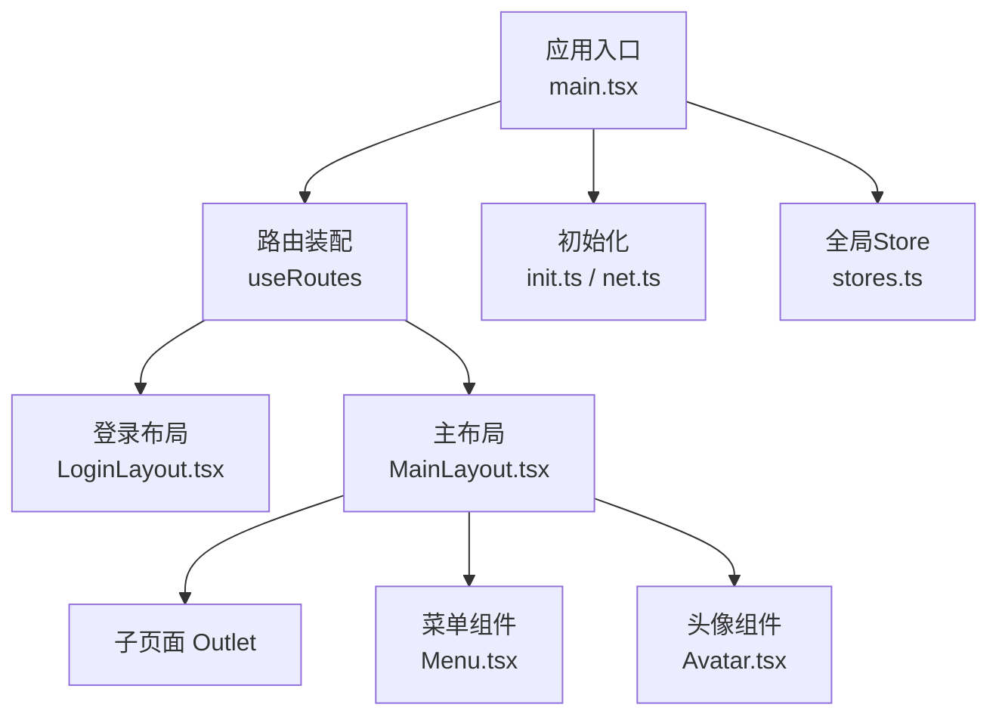
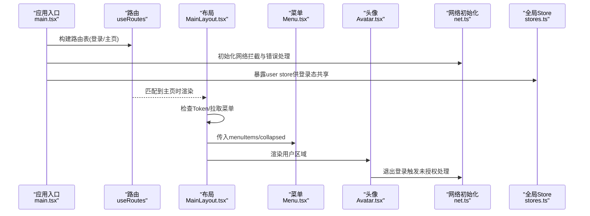
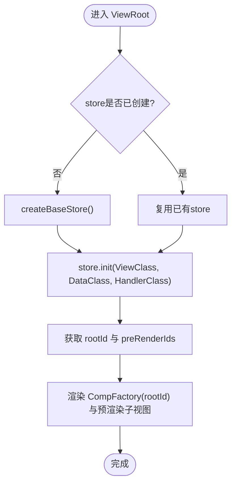
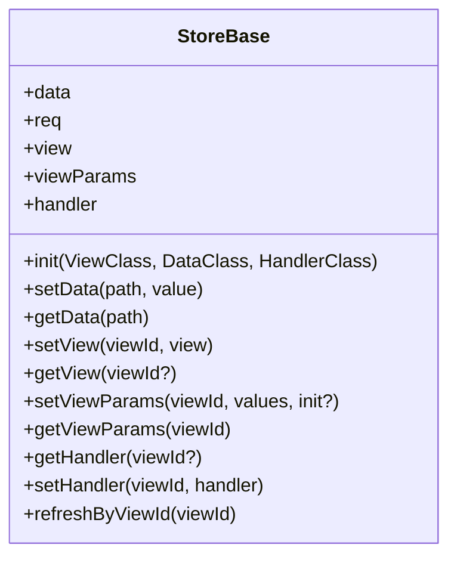
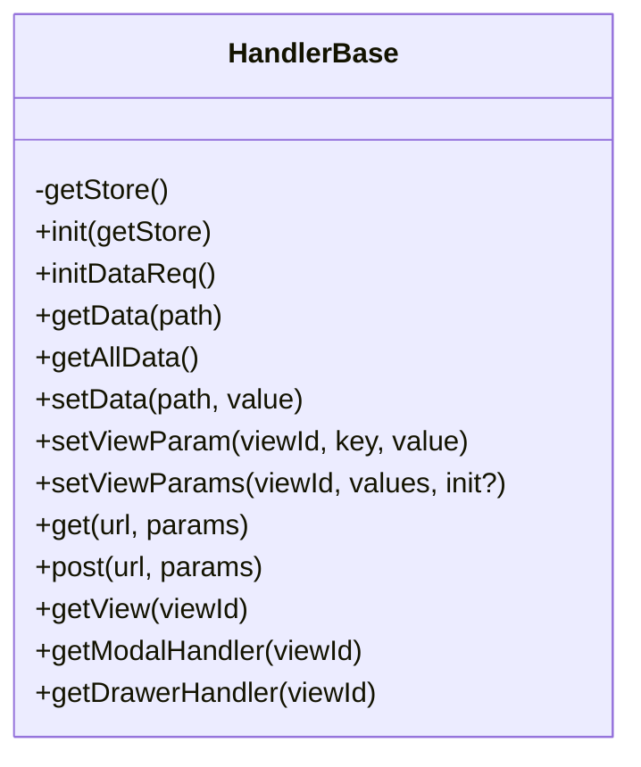
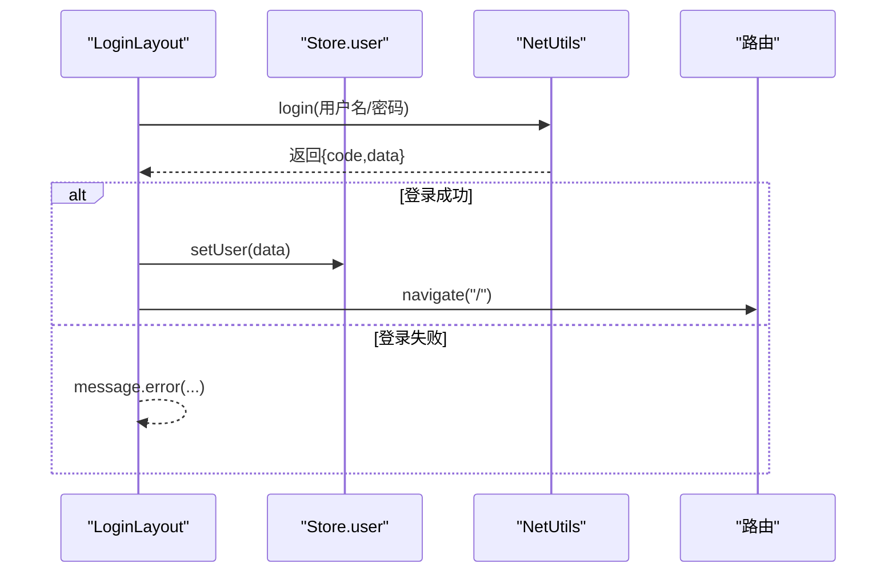
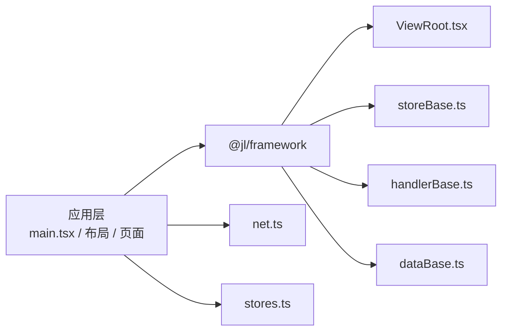

# 组件化架构

<cite>
**本文引用的文件**
- [main.tsx](file://apps/demo/src/main.tsx)
- [MainLayout.tsx](file://apps/demo/src/layouts/main/MainLayout.tsx)
- [LoginLayout.tsx](file://apps/demo/src/layouts/login/LoginLayout.tsx)
- [Menu.tsx](file://apps/demo/src/layouts/main/comp/Menu.tsx)
- [Avatar.tsx](file://apps/demo/src/layouts/main/comp/Avatar.tsx)
- [init.ts](file://apps/demo/src/init/init.ts)
- [net.ts](file://apps/demo/src/init/net.ts)
- [stores.ts](file://apps/demo/src/init/stores.ts)
- [ViewRoot.tsx](file://packages/framework/src/ViewRoot.tsx)
- [viewBase.ts](file://packages/framework/src/comp/viewBase.ts)
- [handlerBase.ts](file://packages/framework/src/handler/handlerBase.ts)
- [dataBase.ts](file://packages/framework/src/data/dataBase.ts)
- [storeBase.ts](file://packages/framework/src/stores/store/storeBase.ts)
</cite>

## 目录
1. [简介](#简介)
2. [项目结构](#项目结构)
3. [核心组件](#核心组件)
4. [架构总览](#架构总览)
5. [详细组件分析](#详细组件分析)
6. [依赖关系分析](#依赖关系分析)
7. [性能考量](#性能考量)
8. [故障排查指南](#故障排查指南)
9. [结论](#结论)
10. [附录：开发规范与集成示例](#附录开发规范与集成示例)

## 简介
本文件面向WMS Web项目的组件化架构，围绕基于React的组件化设计，系统阐述ViewRoot、StoreBase、DataBase等框架核心组件的职责与生命周期；说明组件注册、实例化与依赖管理；解析布局系统（MainLayout与LoginLayout）的实现方式；总结组件间通信机制（props传递、事件冒泡、状态共享）；并提供组件开发规范与自定义组件集成示例。

## 项目结构
应用层采用“布局 + 页面”的组织方式：
- 入口与路由：应用根组件通过BrowserRouter包裹，使用useRoutes定义登录页与主布局下的子路由。
- 布局：
  - MainLayout：包含侧边菜单、头部工具栏、内容区（Outlet），负责菜单数据获取与折叠状态。
  - LoginLayout：登录表单、网络请求、用户信息写入全局Store并跳转首页。
- 初始化：统一初始化网络配置与全局Store。
- 框架层：提供ViewRoot、StoreBase、DataBase、HandlerBase等能力，支撑视图、数据、操作的解耦与复用。

**图示来源**
- [main.tsx:11-31](file://apps/demo/src/main.tsx#L11-L31)
- [MainLayout.tsx:16-73](file://apps/demo/src/layouts/main/MainLayout.tsx#L16-L73)
- [LoginLayout.tsx:18-96](file://apps/demo/src/layouts/login/LoginLayout.tsx#L18-L96)
- [Menu.tsx:17-49](file://apps/demo/src/layouts/main/comp/Menu.tsx#L17-L49)
- [Avatar.tsx:8-44](file://apps/demo/src/layouts/main/comp/Avatar.tsx#L8-L44)
- [init.ts:3-6](file://apps/demo/src/init/init.ts#L3-L6)
- [net.ts:5-17](file://apps/demo/src/init/net.ts#L5-L17)
- [stores.ts:5-8](file://apps/demo/src/init/stores.ts#L5-L8)

**章节来源**
- [main.tsx:1-53](file://apps/demo/src/main.tsx#L1-L53)
- [MainLayout.tsx:1-77](file://apps/demo/src/layouts/main/MainLayout.tsx#L1-L77)
- [LoginLayout.tsx:1-99](file://apps/demo/src/layouts/login/LoginLayout.tsx#L1-L99)
- [Menu.tsx:1-53](file://apps/demo/src/layouts/main/comp/Menu.tsx#L1-L53)
- [Avatar.tsx:1-47](file://apps/demo/src/layouts/main/comp/Avatar.tsx#L1-L47)
- [init.ts:1-9](file://apps/demo/src/init/init.ts#L1-L9)
- [net.ts:1-20](file://apps/demo/src/init/net.ts#L1-L20)
- [stores.ts:1-11](file://apps/demo/src/init/stores.ts#L1-L11)

## 核心组件
- ViewRoot：视图渲染的根节点，负责创建Store上下文、初始化视图树、预渲染子视图，并通过CompFactory挂载具体视图。
- StoreBase：基于Zustand+Immer的状态容器，集中管理数据、视图、处理器、请求参数等，提供统一的读写与刷新接口。
- DataBase：抽象数据基类，封装活动路径等通用能力，便于在业务Data中扩展。
- HandlerBase：操作基类，封装数据读写、视图参数设置、网络请求、弹窗/抽屉处理器获取等，统一视图与数据的交互入口。

这些组件共同构成“视图-状态-操作”的三层解耦模型，使页面逻辑清晰、可测试、可复用。

**章节来源**
- [ViewRoot.tsx:10-48](file://packages/framework/src/ViewRoot.tsx#L10-L48)
- [storeBase.ts:18-57](file://packages/framework/src/stores/store/storeBase.ts#L18-L57)
- [dataBase.ts:4-17](file://packages/framework/src/data/dataBase.ts#L4-L17)
- [handlerBase.ts:10-90](file://packages/framework/src/handler/handlerBase.ts#L10-L90)
- [viewBase.ts:4-14](file://packages/framework/src/comp/viewBase.ts#L4-L14)

## 架构总览
下图展示了从应用入口到布局、再到框架层的整体调用链与数据流。

**图示来源**
- [main.tsx:11-31](file://apps/demo/src/main.tsx#L11-L31)
- [net.ts:5-17](file://apps/demo/src/init/net.ts#L5-L17)
- [stores.ts:5-8](file://apps/demo/src/init/stores.ts#L5-L8)
- [MainLayout.tsx:21-39](file://apps/demo/src/layouts/main/MainLayout.tsx#L21-L39)
- [Menu.tsx:17-49](file://apps/demo/src/layouts/main/comp/Menu.tsx#L17-L49)
- [Avatar.tsx:15-27](file://apps/demo/src/layouts/main/comp/Avatar.tsx#L15-L27)

## 详细组件分析

### 视图根节点 ViewRoot
- 职责：
  - 创建并缓存Store实例，避免StrictMode下重复创建。
  - 调用Store的init方法完成视图、数据、处理器初始化。
  - 将Store注入到StoreContext，交由CompFactory根据rootId与预渲染ID列表渲染视图树。
- 生命周期：
  - 首次渲染：创建store并执行init，返回rootId与preRenderIds。
  - 后续渲染：复用store与已初始化视图，仅按需更新。
- 关键点：
  - 使用useRef确保store单例。
  - 通过StoreContext向子树提供状态访问能力。

**图示来源**
- [ViewRoot.tsx:16-44](file://packages/framework/src/ViewRoot.tsx#L16-L44)
- [storeBase.ts:26-27](file://packages/framework/src/stores/store/storeBase.ts#L26-L27)

**章节来源**
- [ViewRoot.tsx:10-48](file://packages/framework/src/ViewRoot.tsx#L10-L48)
- [storeBase.ts:18-57](file://packages/framework/src/stores/store/storeBase.ts#L18-L57)

### 状态容器 StoreBase
- 职责：
  - 基于Zustand+Immer维护data、req、view、viewParams、handler等状态。
  - 提供setData/getData、setView/getView、getHandler/setHandler、refreshByViewId等统一API。
  - 通过init完成视图树初始化，并在HandlerBase中通过getStore访问。
- 特点：
  - 不可变更新（immer）。
  - 支持防抖设置与批量更新。
  - 集中管理视图参数与处理器，便于跨组件通信。

**图示来源**
- [storeBase.ts:18-57](file://packages/framework/src/stores/store/storeBase.ts#L18-L57)

**章节来源**
- [storeBase.ts:18-57](file://packages/framework/src/stores/store/storeBase.ts#L18-L57)

### 数据基类 DataBase
- 职责：
  - 提供静态方法active(viewId)以简化活动路径查询。
  - 作为业务Data类的基类，便于扩展字段与方法。
- 使用场景：
  - 在业务Data中继承DataBase，结合Store的数据读写API进行状态管理。

**章节来源**
- [dataBase.ts:4-17](file://packages/framework/src/data/dataBase.ts#L4-L17)

### 操作基类 HandlerBase
- 职责：
  - 封装数据读取/设置、视图参数设置、网络请求（get/post）。
  - 提供getModalHandler/getDrawerHandler以获取对应弹出层处理器。
  - 通过getStore访问Store能力，实现视图与数据解耦。
- 关键点：
  - 懒加载视图处理器：若不存在则根据View类型动态创建并缓存。
  - 统一错误处理与未授权流程（配合NetUtils）。

**图示来源**
- [handlerBase.ts:10-90](file://packages/framework/src/handler/handlerBase.ts#L10-L90)

**章节来源**
- [handlerBase.ts:10-90](file://packages/framework/src/handler/handlerBase.ts#L10-L90)

### 视图基类 ViewBase
- 职责：
  - 绑定当前视图对应的Handler与Data实例。
  - 要求子类实现getRootId以标识自身视图根节点。
- 作用：
  - 为具体视图提供统一的上下文接入点，便于在Store中管理与查找。

**章节来源**
- [viewBase.ts:4-14](file://packages/framework/src/comp/viewBase.ts#L4-L14)

### 布局系统：MainLayout 与 LoginLayout
- MainLayout：
  - 负责侧边菜单折叠、菜单数据获取、头部工具栏与内容区（Outlet）渲染。
  - 通过useEffect监听路由变化，触发Token校验与菜单刷新。
  - 子页面通过Outlet注入，保持布局一致性。
- LoginLayout：
  - 表单提交后调用NetUtils.login，成功后将用户信息写入全局Store.user，并导航至首页。
  - 使用message提示登录结果。

**图示来源**
- [LoginLayout.tsx:24-49](file://apps/demo/src/layouts/login/LoginLayout.tsx#L24-L49)
- [stores.ts:5-8](file://apps/demo/src/init/stores.ts#L5-L8)

**章节来源**
- [MainLayout.tsx:16-73](file://apps/demo/src/layouts/main/MainLayout.tsx#L16-L73)
- [LoginLayout.tsx:18-96](file://apps/demo/src/layouts/login/LoginLayout.tsx#L18-L96)

### 子组件：Menu 与 Avatar
- Menu：
  - 接收collapsed与menuItems，维护选中项并驱动路由跳转。
  - 使用SimpleBar优化长菜单滚动体验。
- Avatar：
  - 提供通知、设置、全屏与用户下拉菜单。
  - 退出登录通过NetUtils.handleUnauthorized触发未授权流程。

**章节来源**
- [Menu.tsx:17-49](file://apps/demo/src/layouts/main/comp/Menu.tsx#L17-L49)
- [Avatar.tsx:8-44](file://apps/demo/src/layouts/main/comp/Avatar.tsx#L8-L44)

## 依赖关系分析
- 应用层依赖框架层：
  - main.tsx引入布局与主题，并通过init初始化网络。
  - 布局与页面通过@jl/framework提供的NetUtils、Store能力进行交互。
- 框架层内部依赖：
  - ViewRoot依赖StoreBase、CompFactory、DataBase、HandlerBase。
  - StoreBase依赖zustand/immer与一系列工具函数（数据、视图、处理器、请求）。
  - HandlerBase依赖NetUtils与Store能力，提供统一操作入口。
  - DataBase提供活动路径等通用能力。

**图示来源**
- [main.tsx:1-31](file://apps/demo/src/main.tsx#L1-L31)
- [ViewRoot.tsx:10-48](file://packages/framework/src/ViewRoot.tsx#L10-L48)
- [storeBase.ts:18-57](file://packages/framework/src/stores/store/storeBase.ts#L18-L57)
- [handlerBase.ts:10-90](file://packages/framework/src/handler/handlerBase.ts#L10-L90)
- [dataBase.ts:4-17](file://packages/framework/src/data/dataBase.ts#L4-L17)
- [net.ts:5-17](file://apps/demo/src/init/net.ts#L5-L17)
- [stores.ts:5-8](file://apps/demo/src/init/stores.ts#L5-L8)

**章节来源**
- [main.tsx:1-53](file://apps/demo/src/main.tsx#L1-L53)
- [ViewRoot.tsx:10-48](file://packages/framework/src/ViewRoot.tsx#L10-L48)
- [storeBase.ts:18-57](file://packages/framework/src/stores/store/storeBase.ts#L18-L57)
- [handlerBase.ts:10-90](file://packages/framework/src/handler/handlerBase.ts#L10-L90)
- [dataBase.ts:4-17](file://packages/framework/src/data/dataBase.ts#L4-L17)
- [net.ts:1-20](file://apps/demo/src/init/net.ts#L1-L20)
- [stores.ts:1-11](file://apps/demo/src/init/stores.ts#L1-L11)

## 性能考量
- 视图渲染优化：
  - ViewRoot通过useRef缓存store，避免StrictMode下重复创建与初始化开销。
  - 预渲染子视图（preRenderIds）减少首屏等待。
- 状态更新优化：
  - StoreBase使用immer实现不可变更新，提升细粒度重渲染效率。
  - 提供setDataDebounce用于高频输入场景的防抖更新。
- 网络与UI：
  - 菜单与内容区使用虚拟滚动（SimpleBar）改善长列表体验。
  - 登录与菜单请求统一错误提示，避免频繁UI抖动。

[本节为通用性能建议，不直接分析具体代码]

## 故障排查指南
- 未授权与401处理：
  - 在net.ts中统一捕获401并调用NetUtils.handleUnauthorized，确保跳转登录或刷新令牌。
- 菜单数据获取失败：
  - MainLayout中捕获异常并提示错误，检查VITE_API_MENU与后端接口连通性。
- 登录失败：
  - LoginLayout中对返回码与数据结构进行校验，给出明确错误提示；确认NetUtils.login与后端契约一致。
- 视图处理器缺失：
  - HandlerBase在获取视图处理器时会抛出错误，检查视图类型映射与Store中是否已正确注册。

**章节来源**
- [net.ts:5-17](file://apps/demo/src/init/net.ts#L5-L17)
- [MainLayout.tsx:21-33](file://apps/demo/src/layouts/main/MainLayout.tsx#L21-L33)
- [LoginLayout.tsx:24-49](file://apps/demo/src/layouts/login/LoginLayout.tsx#L24-L49)
- [handlerBase.ts:61-79](file://packages/framework/src/handler/handlerBase.ts#L61-L79)

## 结论
本项目采用清晰的“布局-页面-框架”分层架构，通过ViewRoot、StoreBase、DataBase、HandlerBase等核心组件实现了视图、状态与操作的解耦。布局系统以MainLayout与LoginLayout为核心，配合路由与全局Store完成认证与导航。组件间通过props、事件与Store进行通信，具备良好的可维护性与扩展性。遵循本文档的开发规范与最佳实践，可进一步提升团队协作效率与代码质量。

[本节为总结性内容，不直接分析具体代码]

## 附录：开发规范与集成示例

### 命名约定
- 组件文件：使用PascalCase，如MainLayout.tsx、Menu.tsx。
- 组件名：与文件名一致，默认导出。
- Store：按领域划分，如stores.ts中的Store.user。
- 常量与环境变量：使用VITE_前缀，如VITE_BASE_URL、VITE_API_MENU。

### 文件结构
- 布局：layouts/{main|login}/...
- 页面：pages/{模块}/{功能}/index.tsx、view.tsx、data.tsx、handler.ts
- 初始化：src/init/{init.ts, net.ts, stores.ts}
- 框架：packages/framework/src/{ViewRoot, stores, handler, data, comp}

### 接口定义
- 视图Props：明确可选与必填字段，使用TypeScript接口描述。
- 数据模型：在interface目录下定义User、Menu等类型，供Store与组件共享。
- 处理器接口：HandlerBase提供统一方法签名，业务Handler继承并扩展。

### 组件通信机制
- Props传递：父组件通过props向子组件传递状态与回调（如Menu的collapsed与menuItems）。
- 事件冒泡：子组件通过回调向上通知（如Menu的onSelect触发路由跳转）。
- 状态共享：通过StoreBase与全局Store.user共享用户信息与菜单等数据。

### 自定义组件开发指南
- 步骤：
  1. 定义组件Props与样式文件。
  2. 在布局或页面中引入并使用。
  3. 如需与Store交互，通过StoreContext或直接导入Store模块。
  4. 如需网络请求，使用NetUtils.get/post。
- 集成示例：
  - 在MainLayout中新增子组件，通过props接收状态并渲染。
  - 在LoginLayout中集成第三方表单组件，绑定Form.Item与校验规则。

[本节为通用指导，不直接分析具体代码]