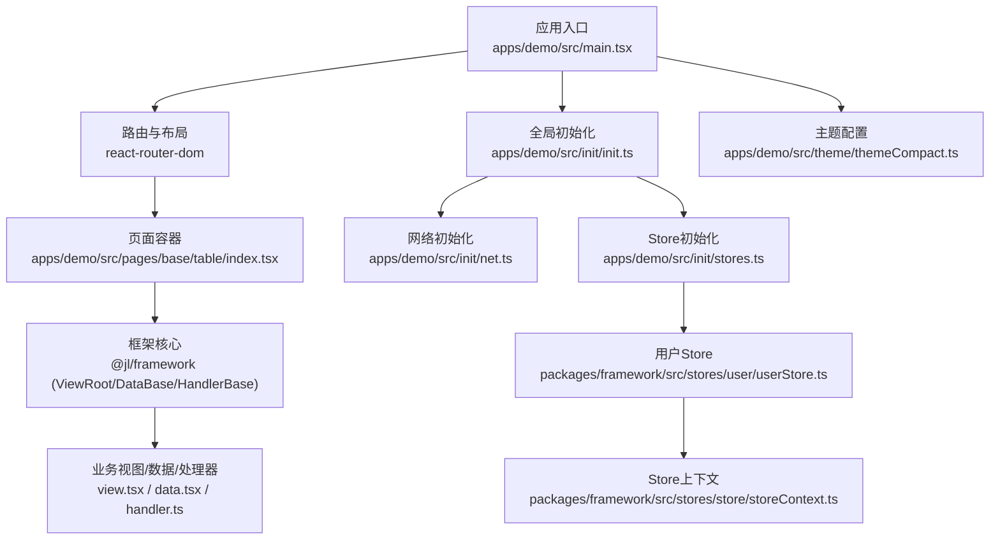
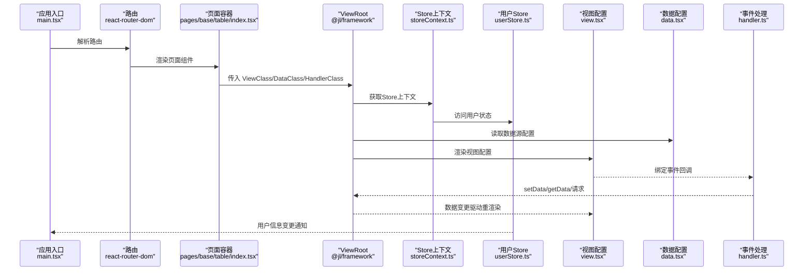
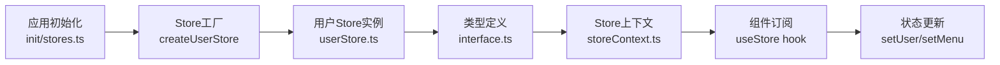
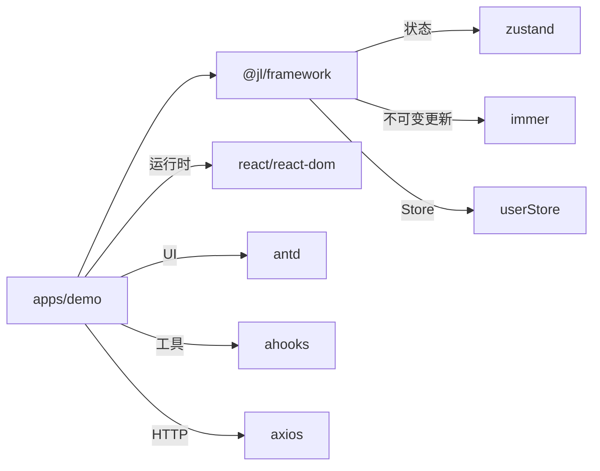

# 组件开发规范

<cite>
**本文引用的文件**
- [package.json](file://package.json)
- [apps/demo/package.json](file://apps/demo/package.json)
- [apps/demo/vite.config.ts](file://apps/demo/vite.config.ts)
- [apps/demo/src/main.tsx](file://apps/demo/src/main.tsx)
- [apps/demo/src/init/init.ts](file://apps/demo/src/init/init.ts)
- [apps/demo/src/init/net.ts](file://apps/demo/src/init/net.ts)
- [apps/demo/src/init/stores.ts](file://apps/demo/src/init/stores.ts)
- [apps/demo/src/theme/themeCompact.ts](file://apps/demo/src/theme/themeCompact.ts)
- [apps/demo/src/layouts/main/comp/Menu.tsx](file://apps/demo/src/layouts/main/comp/Menu.tsx)
- [apps/demo/src/layouts/login/LoginLayout.tsx](file://apps/demo/src/layouts/login/LoginLayout.tsx)
- [apps/demo/src/pages/base/table/index.tsx](file://apps/demo/src/pages/base/table/index.tsx)
- [apps/demo/src/pages/base/table/data.tsx](file://apps/demo/src/pages/base/table/data.tsx)
- [apps/demo/src/pages/base/table/handler.ts](file://apps/demo/src/pages/base/table/handler.ts)
- [apps/demo/src/pages/base/table/view.tsx](file://apps/demo/src/pages/base/table/view.tsx)
- [apps/demo/src/interface/user.ts](file://apps/demo/src/interface/user.ts)
- [apps/demo/src/interface/menu.ts](file://apps/demo/src/interface/menu.ts)
- [packages/framework/package.json](file://packages/framework/package.json)
- [packages/framework/src/index.ts](file://packages/framework/src/index.ts)
- [packages/framework/src/interface.ts](file://packages/framework/src/interface.ts)
- [packages/framework/src/ViewRoot.tsx](file://packages/framework/src/ViewRoot.tsx)
- [packages/framework/src/stores/store/storeBase.ts](file://packages/framework/src/stores/store/storeBase.ts)
- [packages/framework/src/stores/store/hooks/useValue.ts](file://packages/framework/src/stores/store/hooks/useValue.ts)
- [packages/framework/src/stores/store/storeContext.ts](file://packages/framework/src/stores/store/storeContext.ts)
- [packages/framework/src/stores/user/userStore.ts](file://packages/framework/src/stores/user/userStore.ts)
- [packages/framework/src/stores/user/interface.ts](file://packages/framework/src/stores/user/interface.ts)
- [docs/2.组件用法.md](file://docs/2.组件用法.md)
</cite>

## 更新摘要
**变更内容**
- 新增 Store 开发约定和最佳实践章节，包括引用稳定性要求和数据订阅模式说明
- 更新核心组件章节，增加 Store 相关组件说明
- 完善架构总览图，展示 Store 在整体架构中的位置
- 新增 Store 使用示例和最佳实践指导

## 目录
1. [引言](#引言)
2. [项目结构](#项目结构)
3. [核心组件](#核心组件)
4. [架构总览](#架构总览)
5. [详细组件分析](#详细组件分析)
6. [Store 开发约定与最佳实践](#store-开发约定与最佳实践)
7. [依赖分析](#依赖分析)
8. [性能考虑](#性能考虑)
9. [故障排查指南](#故障排查指南)
10. [结论](#结论)
11. [附录](#附录)

## 引言
本规范面向WMS Web项目的组件开发，目标是统一命名约定、文件结构与目录组织；明确组件接口定义与类型约束的最佳实践；规范生命周期管理与错误处理机制；提供测试策略与单元测试编写指南；建立文档生成与版本管理方案；并说明国际化支持与主题定制方法。同时给出完整的组件开发示例与代码模板路径，帮助团队高效、一致地构建可维护的页面与组件。

**更新** 本次更新新增了 Store 开发约定和最佳实践，包括引用稳定性要求和数据订阅模式说明，为全局状态管理提供标准化指导。

## 项目结构
本项目采用Monorepo组织：应用层位于 apps/demo，框架能力封装在 packages/framework，公共文档位于 docs。应用通过 Vite + React Router 启动，使用 @jl/framework 提供的 ViewRoot/DataBase/HandlerBase 等核心能力进行页面级数据驱动视图开发。



**图表来源**
- [apps/demo/src/main.tsx:1-53](file://apps/demo/src/main.tsx#L1-L53)
- [apps/demo/src/init/init.ts:1-9](file://apps/demo/src/init/init.ts#L1-L9)
- [apps/demo/src/init/net.ts:1-20](file://apps/demo/src/init/net.ts#L1-L20)
- [apps/demo/src/init/stores.ts:1-11](file://apps/demo/src/init/stores.ts#L1-L11)
- [apps/demo/src/theme/themeCompact.ts:1-16](file://apps/demo/src/theme/themeCompact.ts#L1-L16)
- [apps/demo/src/pages/base/table/index.tsx:1-10](file://apps/demo/src/pages/base/table/index.tsx#L1-L10)
- [packages/framework/src/stores/user/userStore.ts:1-22](file://packages/framework/src/stores/user/userStore.ts#L1-L22)
- [packages/framework/src/stores/store/storeContext.ts:1-7](file://packages/framework/src/stores/store/storeContext.ts#L1-L7)

**章节来源**
- [apps/demo/src/main.tsx:1-53](file://apps/demo/src/main.tsx#L1-L53)
- [apps/demo/vite.config.ts:1-36](file://apps/demo/vite.config.ts#L1-L36)
- [apps/demo/package.json:1-44](file://apps/demo/package.json#L1-L44)
- [package.json:1-19](file://package.json#L1-L19)

## 核心组件
- ViewRoot：页面级根组件，接收 ViewClass/DataClass/HandlerClass，负责装配视图、数据与事件处理器，驱动渲染与交互。
- DataBase：声明式数据源，集中管理各模块的数据模型、URL、键属性与路径绑定。
- HandlerBase：事件与副作用中心，提供 get/post 请求、setData/getData、Modal/Drawer 等通用操作。
- ViewBase：视图配置类，以声明式方式描述表单、表格、布局（Tab/Flex/Modal）等，并通过 getRootId 指定根节点。
- **Store**：全局状态管理，基于 Zustand + Immer 实现，提供用户信息、菜单等跨组件共享状态。

**最佳实践要点**
- 命名约定
  - 页面目录：按功能划分，如 base/table、base/form、base/modal、base/tab。
  - 每个页面三件套：index.tsx（挂载）、data.tsx（数据）、handler.ts（事件）、view.tsx（视图）。
  - 组件与类型：使用帕斯卡命名（如 Data、Handler、View），工具函数使用小驼峰。
  - Store：使用 createUserStore 工厂函数创建，遵循统一的接口定义。
- 文件结构
  - 页面级：index.tsx 仅承载 ViewRoot 装配；data.tsx 仅暴露数据配置；handler.ts 仅暴露事件；view.tsx 仅暴露视图配置。
  - 布局与菜单：layouts/main/comp 下存放可复用子组件（如 Menu）。
  - Store：在 init/stores.ts 中统一管理，通过静态类暴露。
- 接口与类型
  - 严格使用框架提供的类型（VProps、Ctrl、VType、PathKey 等），避免 any。
  - 通过泛型将 Handler 与 Data 注入 View，获得强类型提示与编译期检查。
  - Store 使用 TypeScript 泛型确保类型安全。
- 生命周期
  - 页面加载：ViewRoot 初始化 -> 读取 Data 配置 -> 渲染 View -> 触发首次数据获取（由 Data.url 或手动调用）。
  - 交互流程：用户操作 -> Handler 方法 -> setData/getData -> 视图响应更新。
  - Store 生命周期：应用启动时初始化 -> 组件订阅 -> 状态变更通知。
- 错误处理
  - 网络错误：在 netInit 中统一拦截，区分 401 未授权与业务错误，使用 message 提示。
  - 业务异常：在 Handler 中捕获并转化为友好提示，必要时回滚状态。
  - Store 错误：通过 try-catch 包裹状态更新，确保应用稳定性。

**章节来源**
- [apps/demo/src/pages/base/table/index.tsx:1-10](file://apps/demo/src/pages/base/table/index.tsx#L1-L10)
- [apps/demo/src/pages/base/table/data.tsx:1-22](file://apps/demo/src/pages/base/table/data.tsx#L1-L22)
- [apps/demo/src/pages/base/table/handler.ts:1-30](file://apps/demo/src/pages/base/table/handler.ts#L1-L30)
- [apps/demo/src/pages/base/table/view.tsx:1-86](file://apps/demo/src/pages/base/table/view.tsx#L1-L86)
- [apps/demo/src/init/stores.ts:1-11](file://apps/demo/src/init/stores.ts#L1-L11)
- [apps/demo/src/init/net.ts:1-20](file://apps/demo/src/init/net.ts#L1-L20)
- [docs/2.组件用法.md:1-455](file://docs/2.组件用法.md#L1-L455)

## 架构总览
下图展示从应用入口到页面渲染的核心调用链，以及数据与事件的流向，包含 Store 的全局状态管理。



**图表来源**
- [apps/demo/src/main.tsx:1-53](file://apps/demo/src/main.tsx#L1-L53)
- [apps/demo/src/pages/base/table/index.tsx:1-10](file://apps/demo/src/pages/base/table/index.tsx#L1-L10)
- [apps/demo/src/pages/base/table/view.tsx:1-86](file://apps/demo/src/pages/base/table/view.tsx#L1-L86)
- [apps/demo/src/pages/base/table/data.tsx:1-22](file://apps/demo/src/pages/base/table/data.tsx#L1-L22)
- [apps/demo/src/pages/base/table/handler.ts:1-30](file://apps/demo/src/pages/base/table/handler.ts#L1-L30)
- [packages/framework/src/stores/store/storeContext.ts:1-7](file://packages/framework/src/stores/store/storeContext.ts#L1-L7)
- [packages/framework/src/stores/user/userStore.ts:1-22](file://packages/framework/src/stores/user/userStore.ts#L1-L22)

## 详细组件分析

### ViewRoot 与页面装配
- 职责：作为页面根，组合 View/Data/Handler，完成数据拉取、视图渲染与事件绑定。
- 使用方式：在页面 index.tsx 中引入 ViewClass/DataClass/HandlerClass，并以 ViewRoot 包裹。
- 关键点：确保 Data 中的 id/url/keyAttr 正确；View 的 getRootId 返回根布局 id；Handler 中通过 this.get/this.post 发起请求。

**章节来源**
- [apps/demo/src/pages/base/table/index.tsx:1-10](file://apps/demo/src/pages/base/table/index.tsx#L1-L10)
- [packages/framework/src/ViewRoot.tsx](file://packages/framework/src/ViewRoot.tsx)
- [packages/framework/src/index.ts](file://packages/framework/src/index.ts)

### DataBase 数据模型
- 职责：集中声明各模块的数据源，包括主表、主表单、关联数据等。
- 关键属性：id、url、keyAttr、path（用于关联父子数据）。
- 最佳实践：为每个独立数据块定义唯一 id；通过 path 实现联动（如 mainFormData 指向 active 的主表行）。

**章节来源**
- [apps/demo/src/pages/base/table/data.tsx:1-22](file://apps/demo/src/pages/base/table/data.tsx#L1-L22)

### HandlerBase 事件与副作用
- 职责：封装常用交互与网络请求，提供 setData/getData、get/post、Modal/Drawer 控制等。
- 典型用法：按钮点击 -> Handler 方法 -> 调用 setData 或发起请求 -> 视图自动更新。
- 调试能力：printStats/resetStats 可用于统计 getData 使用情况，辅助性能优化。

**章节来源**
- [apps/demo/src/pages/base/table/handler.ts:1-30](file://apps/demo/src/pages/base/table/handler.ts#L1-L30)

### ViewBase 视图配置
- 职责：以声明式方式描述表单、表格、布局（Tab/Flex/Modal）及其项配置。
- 关键类型：VProps.Form/VProps.Table/VProps.Tab/VProps.Flex/VProps.Modal；控件类型 Ctrl；布局类型 VType。
- 最佳实践：
  - 表格：设置 rowKey、searchItems、items；字段 title/field 一一对应。
  - 表单：设置 items/toolList；toolList 中的 Button 绑定 Handler 方法。
  - 布局：Flex 组合多个子视图；Tab 切换不同 viewId；Modal 承载表单或详情。
  - getRootId：返回根布局 id，供框架定位渲染容器。

**章节来源**
- [apps/demo/src/pages/base/table/view.tsx:1-86](file://apps/demo/src/pages/base/table/view.tsx#L1-L86)
- [docs/2.组件用法.md:1-455](file://docs/2.组件用法.md#L1-L455)

### 主题与样式
- 主题配置：通过 antd ConfigProvider 注入主题对象，支持紧凑算法与组件 token 覆盖。
- 样式组织：组件样式使用 less，遵循模块化命名；菜单组件使用 SimpleBar 提升长列表滚动体验。

**章节来源**
- [apps/demo/src/main.tsx:1-53](file://apps/demo/src/main.tsx#L1-L53)
- [apps/demo/src/theme/themeCompact.ts:1-16](file://apps/demo/src/theme/themeCompact.ts#L1-L16)
- [apps/demo/src/layouts/main/comp/Menu.tsx:1-53](file://apps/demo/src/layouts/main/comp/Menu.tsx#L1-L53)

### 网络与错误处理
- 初始化：在 init.ts 中调用 netInit，统一配置 baseURL、登录页地址、登录接口及错误回调。
- 错误策略：401 走未授权处理；其他错误通过 message 提示；建议在 Handler 中捕获并转化为用户可读信息。

**章节来源**
- [apps/demo/src/init/init.ts:1-9](file://apps/demo/src/init/init.ts#L1-L9)
- [apps/demo/src/init/net.ts:1-20](file://apps/demo/src/init/net.ts#L1-L20)

## Store 开发约定与最佳实践

### Store 架构设计
项目采用基于 Zustand + Immer 的 Store 架构，提供类型安全的状态管理解决方案。



**图表来源**
- [apps/demo/src/init/stores.ts:1-11](file://apps/demo/src/init/stores.ts#L1-L11)
- [packages/framework/src/stores/user/userStore.ts:1-22](file://packages/framework/src/stores/user/userStore.ts#L1-L22)
- [packages/framework/src/stores/user/interface.ts:1-15](file://packages/framework/src/stores/user/interface.ts#L1-L15)
- [packages/framework/src/stores/store/storeContext.ts:1-7](file://packages/framework/src/stores/store/storeContext.ts#L1-L7)

### Store 开发约定

#### 1. Store 创建规范
- 使用 `createUserStore` 工厂函数创建 Store 实例
- 通过 TypeScript 泛型定义数据类型，确保类型安全
- 在应用初始化阶段创建 Store 实例，统一管理

#### 2. 类型定义规范
- 定义数据结构接口：`IUserStoreData`
- 定义操作方法接口：`IUserStoreActions`
- 组合完整 Store 接口：`IUserStoreBase`

#### 3. 引用稳定性要求
- Store 的 getter 方法必须保持引用稳定
- 查不到数据时返回 `undefined`，不可返回新建对象/数组
- 避免在 selector 中创建新对象，防止无限重渲染

#### 4. 数据订阅模式
框架提供两种数据订阅方式，**同一个数据 path 在同一页面内只允许使用其中一种**：

| 订阅方式 | 行为 | 适用场景 |
|---------|------|---------|
| `useDataState` | 本地乐观更新 + 300ms 防抖回写 store | 输入类控件自持场景（如 Input 的 value） |
| `useData` / `useDataStoreState` | 直读 store，立即回写 | 展示类组件、需要跨组件强一致的读写 |

**注意**：混用同一 path 会导致最长 300ms 的双源不一致窗口，且防抖回写可能覆盖其他组件的并发写入。

### Store 最佳实践

#### 1. 状态结构设计
```typescript
// 推荐：扁平化状态结构
interface IUserStoreData {
  user?: User;
  menu?: MenuItem[];
}

// 避免：嵌套过深的状态结构
interface BadExample {
  userInfo: {
    profile: {
      name: string;
      avatar: string;
    };
    settings: {
      theme: string;
      language: string;
    };
  };
}
```

#### 2. 操作方法设计
```typescript
// 推荐：原子化的操作方法
interface IUserStoreActions {
  setUser(user: User): void;
  getUser(): User | undefined;
  setMenu(menu: MenuItem[]): void;
  getMenu(): MenuItem[];
}

// 避免：复杂的方法签名
interface BadExample {
  updateUser(name: string, age: number, email: string): void;
}
```

#### 3. 性能优化策略
- 使用 immer 中间件进行不可变更新
- 合理拆分 Store，避免单一大 Store
- 使用 selector 精确订阅所需数据
- 避免在渲染函数中创建新的对象或数组

#### 4. 错误处理
- 在 Store 操作中捕获异常，确保应用稳定性
- 提供默认值，避免空指针异常
- 记录错误日志，便于问题排查

### Store 使用示例

#### 1. Store 创建与初始化
```typescript
// 在 init/stores.ts 中创建 Store
class Store {
  static user = createUserStore<User, MenuItem>();
}
export default Store;
```

#### 2. 组件中订阅 Store
```typescript
// 在组件中使用 Store
const LoginLayout = () => {
  const user = Store.user((state) => state.user);
  const setUser = Store.user((state) => state.setUser);
  
  // 使用 user 和 setUser
};
```

#### 3. 类型安全的 Store 使用
```typescript
// 在 interface 中定义类型
interface User {
  name: string;
  auth: string[];
  menu: [];
}

interface MenuItem {
  title: string;
  path: string;
  icon: string;
  children?: MenuItem[];
}
```

**章节来源**
- [apps/demo/src/init/stores.ts:1-11](file://apps/demo/src/init/stores.ts#L1-L11)
- [packages/framework/src/stores/user/userStore.ts:1-22](file://packages/framework/src/stores/user/userStore.ts#L1-L22)
- [packages/framework/src/stores/user/interface.ts:1-15](file://packages/framework/src/stores/user/interface.ts#L1-L15)
- [apps/demo/src/interface/user.ts:1-9](file://apps/demo/src/interface/user.ts#L1-L9)
- [apps/demo/src/interface/menu.ts:1-6](file://apps/demo/src/interface/menu.ts#L1-L6)
- [apps/demo/src/layouts/login/LoginLayout.tsx:22-23](file://apps/demo/src/layouts/login/LoginLayout.tsx#L22-L23)
- [docs/2.组件用法.md:467-477](file://docs/2.组件用法.md#L467-L477)

## 依赖分析
- 应用层依赖：React、React Router、Ant Design、ahooks、axios、lodash、simplebar-react。
- 框架层依赖：zustand、immer；对外暴露 ViewRoot/DataBase/HandlerBase/NetUtils 等能力。
- 构建与别名：vite.config.ts 中将 @jl/framework 指向源码目录，便于本地联调；同时合并框架提供的别名配置。



**图表来源**
- [apps/demo/package.json:1-44](file://apps/demo/package.json#L1-L44)
- [packages/framework/package.json:1-52](file://packages/framework/package.json#L1-L52)
- [apps/demo/vite.config.ts:1-36](file://apps/demo/vite.config.ts#L1-L36)

**章节来源**
- [apps/demo/package.json:1-44](file://apps/demo/package.json#L1-L44)
- [packages/framework/package.json:1-52](file://packages/framework/package.json#L1-L52)
- [apps/demo/vite.config.ts:1-36](file://apps/demo/vite.config.ts#L1-L36)

## 性能考虑
- 数据访问统计：使用 printStats/resetStats 监控 getData 调用频次，识别热点数据与重复请求。
- 列表渲染：表格合理设置 rowKey，减少不必要的重渲染；搜索项精简，避免过多字段导致首屏压力。
- 网络请求：尽量合并请求或使用缓存；对高频查询增加防抖/节流。
- 主题与样式：按需启用紧凑算法，减少 DOM 层级与计算开销。
- **Store 性能优化**：
  - 使用 selector 精确订阅所需数据，避免全量订阅
  - 合理拆分 Store，避免单一大 Store 导致的性能问题
  - 使用 immer 中间件进行不可变更新，提升性能
  - 避免在渲染函数中创建新的对象或数组

## 故障排查指南
- 401 未授权：检查 netInit 的错误回调是否调用 NetUtils.handleUnauthorized；确认登录态与跳转逻辑。
- 数据为空或不同步：核对 Data 的 id/url/keyAttr/path 配置；确认 View 的 dataId 与 Data 对应；检查 Handler 中 setData/getData 的路径是否正确。
- 视图不更新：确认 getRootId 返回的是根布局 id；检查事件绑定是否在 toolList 中正确指向 Handler 方法。
- 构建别名问题：确保 vite.config.ts 中 @jl/framework 指向正确的源码目录，并与框架的导出保持一致。
- **Store 相关问题**：
  - 状态不同步：检查 Store 的 selector 是否正确，避免创建新对象
  - 类型错误：确认 TypeScript 泛型定义与实际数据类型一致
  - 性能问题：检查是否存在全量订阅，优化 selector 的使用
  - 初始化问题：确认 Store 在应用启动时正确初始化

**章节来源**
- [apps/demo/src/init/net.ts:1-20](file://apps/demo/src/init/net.ts#L1-L20)
- [apps/demo/src/pages/base/table/data.tsx:1-22](file://apps/demo/src/pages/base/table/data.tsx#L1-L22)
- [apps/demo/src/pages/base/table/view.tsx:1-86](file://apps/demo/src/pages/base/table/view.tsx#L1-L86)
- [apps/demo/src/pages/base/table/handler.ts:1-30](file://apps/demo/src/pages/base/table/handler.ts#L1-L30)
- [apps/demo/vite.config.ts:1-36](file://apps/demo/vite.config.ts#L1-L36)

## 结论
通过统一的命名约定、清晰的目录组织、严格的接口与类型约束、完善的生命周期与错误处理机制，结合测试策略、文档与版本管理、国际化与主题定制，以及规范的 Store 开发约定，WMS Web 项目能够稳定、高效地交付高质量组件与页面。建议在新页面开发时严格遵循本规范，并在迭代中持续完善最佳实践与模板。

**更新** 本次新增的 Store 开发约定为全局状态管理提供了标准化指导，包括引用稳定性要求和数据订阅模式说明，有助于提升应用的稳定性和可维护性。

## 附录

### 组件命名与目录规范
- 页面目录：apps/demo/src/pages/<模块>/<页面>/
- 页面文件：index.tsx（挂载）、data.tsx（数据）、handler.ts（事件）、view.tsx（视图）
- 布局与子组件：apps/demo/src/layouts/<布局名>/comp/
- 主题与样式：apps/demo/src/theme/
- 类型声明：apps/demo/src/types/
- **Store 目录**：apps/demo/src/init/stores.ts（Store 初始化）

**章节来源**
- [apps/demo/src/pages/base/table/index.tsx:1-10](file://apps/demo/src/pages/base/table/index.tsx#L1-L10)
- [apps/demo/src/layouts/main/comp/Menu.tsx:1-53](file://apps/demo/src/layouts/main/comp/Menu.tsx#L1-L53)
- [apps/demo/src/theme/themeCompact.ts:1-16](file://apps/demo/src/theme/themeCompact.ts#L1-L16)
- [apps/demo/src/init/stores.ts:1-11](file://apps/demo/src/init/stores.ts#L1-L11)

### 接口与类型约束最佳实践
- 使用框架提供的类型：VProps、Ctrl、VType、PathKey、DataProps 等。
- 通过泛型将 Handler 与 Data 注入 View，获得强类型提示。
- 避免 any，所有字段与配置均显式声明类型。
- **Store 类型约束**：
  - 使用 TypeScript 泛型定义 Store 数据类型
  - 分离数据结构接口和方法接口
  - 确保 Store 方法的类型安全

**章节来源**
- [apps/demo/src/pages/base/table/view.tsx:1-86](file://apps/demo/src/pages/base/table/view.tsx#L1-L86)
- [apps/demo/src/pages/base/table/data.tsx:1-22](file://apps/demo/src/pages/base/table/data.tsx#L1-L22)
- [apps/demo/src/pages/base/table/handler.ts:1-30](file://apps/demo/src/pages/base/table/handler.ts#L1-L30)
- [packages/framework/src/stores/user/interface.ts:1-15](file://packages/framework/src/stores/user/interface.ts#L1-L15)

### 生命周期与错误处理机制
- 生命周期：ViewRoot 初始化 -> Data 配置 -> View 渲染 -> 事件绑定 -> 数据更新驱动重渲染。
- 错误处理：netInit 统一拦截网络错误；401 走未授权处理；业务错误通过 message 提示；Handler 中捕获并转化。
- **Store 生命周期**：应用启动时初始化 -> 组件订阅 -> 状态变更通知 -> 组件重新渲染。

**章节来源**
- [apps/demo/src/init/net.ts:1-20](file://apps/demo/src/init/net.ts#L1-L20)
- [apps/demo/src/pages/base/table/handler.ts:1-30](file://apps/demo/src/pages/base/table/handler.ts#L1-L30)

### 测试策略与单元测试指南
- 单元层面：对 Handler 的方法进行纯函数化拆分，便于断言；对 Data 配置进行快照测试，确保结构稳定。
- 集成层面：使用 Mock 服务模拟后端接口，验证 ViewRoot 装配后的完整流程。
- 覆盖率：关注关键路径（getData/setData、网络请求、Modal/Drawer 控制）的覆盖率。
- **Store 测试**：
  - 对 Store 方法进行单元测试，确保状态更新的正确性
  - 使用 Mock 数据测试组件与 Store 的交互
  - 验证 Store 的类型安全性和性能表现

### 文档生成与版本管理
- 文档：基于 docs/2.组件用法.md 维护组件用法与示例；新增组件需同步更新文档。
- 版本：框架包通过 package.json 的 version 与 exports 管理；应用通过 workspace:* 引用本地框架源码进行联调。

**章节来源**
- [docs/2.组件用法.md:1-455](file://docs/2.组件用法.md#L1-L455)
- [packages/framework/package.json:1-52](file://packages/framework/package.json#L1-L52)
- [apps/demo/package.json:1-44](file://apps/demo/package.json#L1-L44)

### 国际化支持与主题定制
- 国际化：可在 Handler 中根据语言环境选择文案；在 View 的 title/label 处引用 i18n key；在 Data 中保持字段稳定。
- 主题定制：通过 antd ConfigProvider 注入主题；在 themeCompact.ts 中调整算法与 token；菜单等组件可按需扩展样式。

**章节来源**
- [apps/demo/src/main.tsx:1-53](file://apps/demo/src/main.tsx#L1-L53)
- [apps/demo/src/theme/themeCompact.ts:1-16](file://apps/demo/src/theme/themeCompact.ts#L1-L16)
- [apps/demo/src/layouts/main/comp/Menu.tsx:1-53](file://apps/demo/src/layouts/main/comp/Menu.tsx#L1-L53)

### 完整组件开发示例与模板路径
- 页面模板：参考 apps/demo/src/pages/base/table/ 下的 index.tsx、data.tsx、handler.ts、view.tsx。
- 布局与菜单：参考 apps/demo/src/layouts/main/comp/Menu.tsx。
- 主题模板：参考 apps/demo/src/theme/themeCompact.ts。
- 网络初始化模板：参考 apps/demo/src/init/net.ts。
- **Store 模板**：参考 apps/demo/src/init/stores.ts 和 packages/framework/src/stores/user/userStore.ts。

**章节来源**
- [apps/demo/src/pages/base/table/index.tsx:1-10](file://apps/demo/src/pages/base/table/index.tsx#L1-L10)
- [apps/demo/src/pages/base/table/data.tsx:1-22](file://apps/demo/src/pages/base/table/data.tsx#L1-L22)
- [apps/demo/src/pages/base/table/handler.ts:1-30](file://apps/demo/src/pages/base/table/handler.ts#L1-L30)
- [apps/demo/src/pages/base/table/view.tsx:1-86](file://apps/demo/src/pages/base/table/view.tsx#L1-L86)
- [apps/demo/src/layouts/main/comp/Menu.tsx:1-53](file://apps/demo/src/layouts/main/comp/Menu.tsx#L1-L53)
- [apps/demo/src/theme/themeCompact.ts:1-16](file://apps/demo/src/theme/themeCompact.ts#L1-L16)
- [apps/demo/src/init/net.ts:1-20](file://apps/demo/src/init/net.ts#L1-L20)
- [apps/demo/src/init/stores.ts:1-11](file://apps/demo/src/init/stores.ts#L1-L11)
- [packages/framework/src/stores/user/userStore.ts:1-22](file://packages/framework/src/stores/user/userStore.ts#L1-L22)