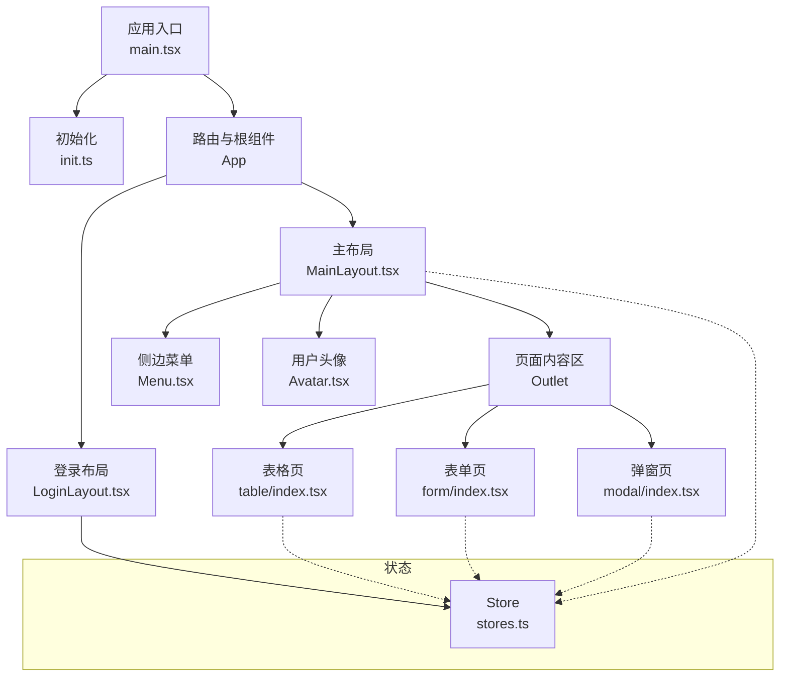
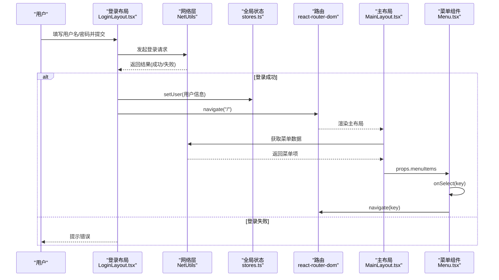
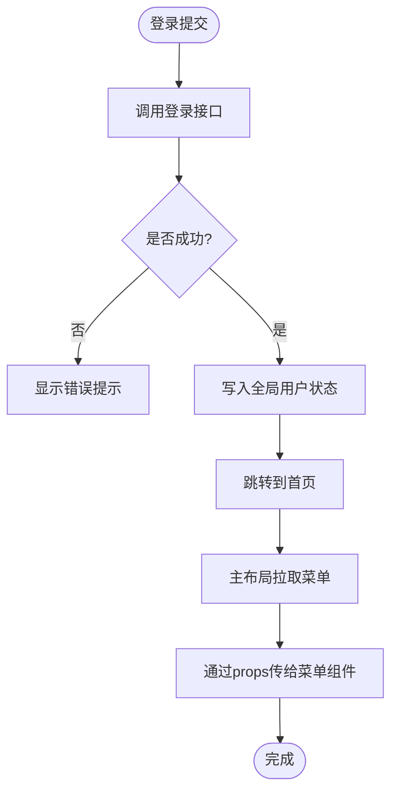
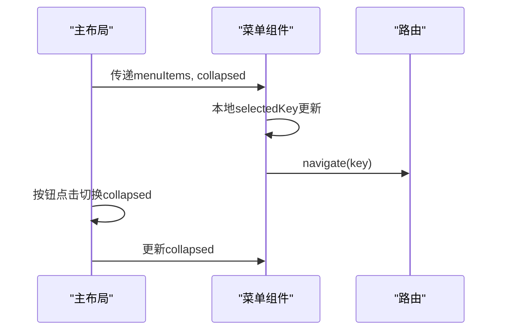
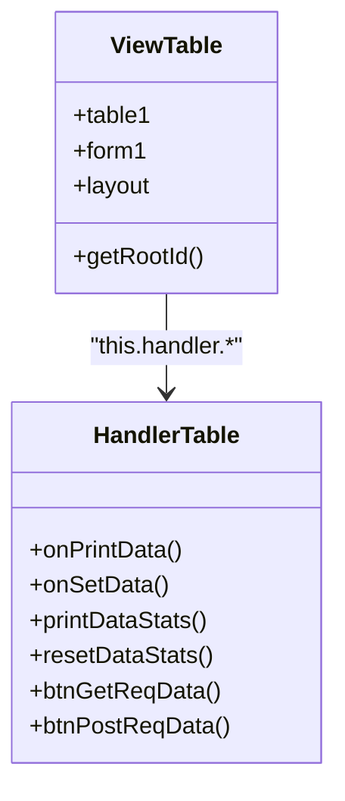
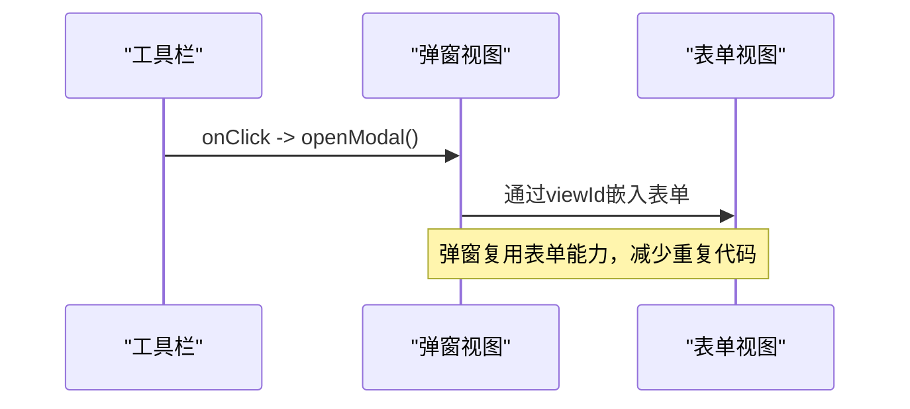
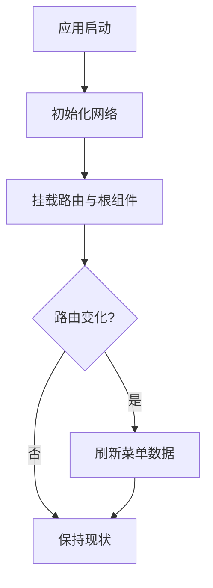
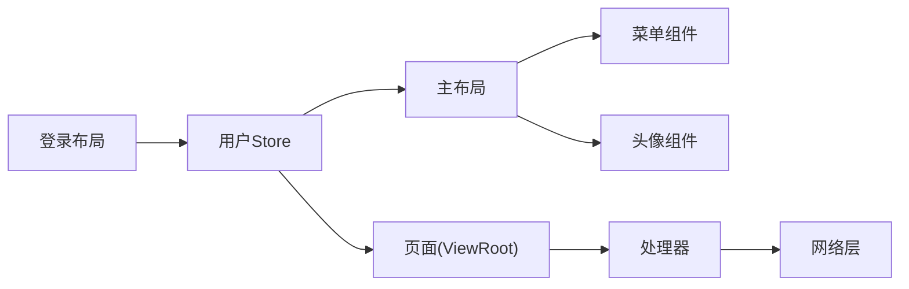

# 组件通信

<cite>
**本文引用的文件**
- [main.tsx](file://apps/demo/src/main.tsx)
- [init.ts](file://apps/demo/src/init/init.ts)
- [stores.ts](file://apps/demo/src/init/stores.ts)
- [MainLayout.tsx](file://apps/demo/src/layouts/main/MainLayout.tsx)
- [Menu.tsx](file://apps/demo/src/layouts/main/comp/Menu.tsx)
- [Avatar.tsx](file://apps/demo/src/layouts/main/comp/Avatar.tsx)
- [LoginLayout.tsx](file://apps/demo/src/layouts/login/LoginLayout.tsx)
- [table/index.tsx](file://apps/demo/src/pages/base/table/index.tsx)
- [table/view.tsx](file://apps/demo/src/pages/base/table/view.tsx)
- [table/handler.ts](file://apps/demo/src/pages/base/table/handler.ts)
- [form/index.tsx](file://apps/demo/src/pages/base/form/index.tsx)
- [form/view.tsx](file://apps/demo/src/pages/base/form/view.tsx)
- [modal/index.tsx](file://apps/demo/src/pages/base/modal/index.tsx)
- [modal/view.tsx](file://apps/demo/src/pages/base/modal/view.tsx)
- [user.ts](file://apps/demo/src/interface/user.ts)
</cite>

## 目录
1. [简介](#简介)
2. [项目结构](#项目结构)
3. [核心组件](#核心组件)
4. [架构总览](#架构总览)
5. [详细组件分析](#详细组件分析)
6. [依赖关系分析](#依赖关系分析)
7. [性能考虑](#性能考虑)
8. [故障排除指南](#故障排除指南)
9. [结论](#结论)
10. [附录](#附录)

## 简介
本文件聚焦WMS Web项目的组件通信机制，围绕以下主题展开：
- 基于Zustand的全局状态管理（用户信息、菜单等）在跨组件数据共享中的应用
- 父到子props传递、事件回调与路由导航的协作方式
- 页面内通过框架提供的ViewRoot/ViewBase/HandlerBase进行声明式视图、数据处理与事件编排
- 组件间依赖关系与生命周期协调（初始化、路由变化、网络请求）
- 最佳实践与性能优化建议
- 常见通信模式的代码路径示例与排错指引

## 项目结构
本项目采用应用级布局与页面模块分离的组织方式：
- 入口与全局配置：应用启动、路由包裹、主题与网络初始化
- 布局层：登录布局与主布局，负责整体UI骨架与全局交互（菜单折叠、头像下拉、内容区）
- 页面层：基础功能页（表单、表格、弹窗），使用统一的ViewRoot模式组织视图、数据与处理器
- 状态层：通过Zustand封装的用户Store，提供跨组件的用户信息与菜单能力

图表来源
- [main.tsx:1-53](file://apps/demo/src/main.tsx#L1-L53)
- [init.ts:1-9](file://apps/demo/src/init/init.ts#L1-L9)
- [MainLayout.tsx:1-77](file://apps/demo/src/layouts/main/MainLayout.tsx#L1-L77)
- [Menu.tsx:1-53](file://apps/demo/src/layouts/main/comp/Menu.tsx#L1-L53)
- [Avatar.tsx:1-47](file://apps/demo/src/layouts/main/comp/Avatar.tsx#L1-L47)
- [LoginLayout.tsx:1-99](file://apps/demo/src/layouts/login/LoginLayout.tsx#L1-L99)
- [table/index.tsx:1-10](file://apps/demo/src/pages/base/table/index.tsx#L1-L10)
- [form/index.tsx:1-10](file://apps/demo/src/pages/base/form/index.tsx#L1-L10)
- [modal/index.tsx:1-9](file://apps/demo/src/pages/base/modal/index.tsx#L1-L9)
- [stores.ts:1-11](file://apps/demo/src/init/stores.ts#L1-L11)

章节来源
- [main.tsx:1-53](file://apps/demo/src/main.tsx#L1-L53)
- [init.ts:1-9](file://apps/demo/src/init/init.ts#L1-L9)

## 核心组件
- 应用入口与路由
  - 负责挂载React根节点、包裹路由与主题，并触发全局初始化。
- 登录布局
  - 处理登录表单提交、调用网络接口、更新全局用户状态并跳转首页。
- 主布局
  - 维护侧边栏折叠状态、加载菜单数据、渲染头部工具区与内容区。
- 菜单组件
  - 接收父级传入的菜单项，响应选择事件并执行路由跳转。
- 头像组件
  - 提供通知、设置、全屏和用户下拉菜单；退出登录时调用统一鉴权处理。
- 页面基座（ViewRoot + ViewBase + HandlerBase）
  - 以声明式方式定义视图、数据绑定与事件处理器，解耦UI与逻辑。

章节来源
- [main.tsx:1-53](file://apps/demo/src/main.tsx#L1-L53)
- [LoginLayout.tsx:1-99](file://apps/demo/src/layouts/login/LoginLayout.tsx#L1-L99)
- [MainLayout.tsx:1-77](file://apps/demo/src/layouts/main/MainLayout.tsx#L1-L77)
- [Menu.tsx:1-53](file://apps/demo/src/layouts/main/comp/Menu.tsx#L1-L53)
- [Avatar.tsx:1-47](file://apps/demo/src/layouts/main/comp/Avatar.tsx#L1-L47)
- [table/view.tsx:1-86](file://apps/demo/src/pages/base/table/view.tsx#L1-L86)
- [table/handler.ts:1-30](file://apps/demo/src/pages/base/table/handler.ts#L1-L30)
- [form/view.tsx:1-99](file://apps/demo/src/pages/base/form/view.tsx#L1-L99)
- [modal/view.tsx:1-46](file://apps/demo/src/pages/base/modal/view.tsx#L1-L46)

## 架构总览
下图展示从登录到主页、再到具体页面的通信链路，包括Zustand状态、props传递与事件回调。

图表来源
- [LoginLayout.tsx:18-49](file://apps/demo/src/layouts/login/LoginLayout.tsx#L18-L49)
- [stores.ts:5-8](file://apps/demo/src/init/stores.ts#L5-L8)
- [MainLayout.tsx:21-39](file://apps/demo/src/layouts/main/MainLayout.tsx#L21-L39)
- [Menu.tsx:17-24](file://apps/demo/src/layouts/main/comp/Menu.tsx#L17-L24)

## 详细组件分析

### 基于Zustand的全局状态管理（用户与菜单）
- Store设计
  - 通过工厂方法创建用户Store，暴露用户数据与设置方法，供登录、布局等多处订阅与更新。
- 登录流程中的状态同步
  - 登录成功后将用户信息写入Store，随后跳转到主页；主页可据此渲染用户信息或控制权限。
- 菜单数据流
  - 主布局在路由变化时拉取菜单数据，并通过props传递给菜单组件；菜单组件内部仅维护选中态，不持有持久化数据。

图表来源
- [LoginLayout.tsx:24-49](file://apps/demo/src/layouts/login/LoginLayout.tsx#L24-L49)
- [stores.ts:5-8](file://apps/demo/src/init/stores.ts#L5-L8)
- [MainLayout.tsx:21-39](file://apps/demo/src/layouts/main/MainLayout.tsx#L21-L39)
- [Menu.tsx:17-24](file://apps/demo/src/layouts/main/comp/Menu.tsx#L17-L24)

章节来源
- [stores.ts:1-11](file://apps/demo/src/init/stores.ts#L1-L11)
- [LoginLayout.tsx:18-49](file://apps/demo/src/layouts/login/LoginLayout.tsx#L18-L49)
- [MainLayout.tsx:21-39](file://apps/demo/src/layouts/main/MainLayout.tsx#L21-L39)
- [Menu.tsx:17-24](file://apps/demo/src/layouts/main/comp/Menu.tsx#L17-L24)
- [user.ts:1-9](file://apps/demo/src/interface/user.ts#L1-L9)

### Props传递与事件回调（父到子）
- 主布局向菜单组件传递菜单项与折叠状态，菜单组件通过onSelect回调触发路由跳转。
- 主布局内部按钮点击改变collapsed状态，再向下透传至菜单组件，实现UI联动。
- 头像组件通过Dropdown的onClick回调执行退出登录等动作。

图表来源
- [MainLayout.tsx:16-55](file://apps/demo/src/layouts/main/MainLayout.tsx#L16-L55)
- [Menu.tsx:17-24](file://apps/demo/src/layouts/main/comp/Menu.tsx#L17-L24)
- [Avatar.tsx:15-27](file://apps/demo/src/layouts/main/comp/Avatar.tsx#L15-L27)

章节来源
- [MainLayout.tsx:16-55](file://apps/demo/src/layouts/main/MainLayout.tsx#L16-L55)
- [Menu.tsx:17-24](file://apps/demo/src/layouts/main/comp/Menu.tsx#L17-L24)
- [Avatar.tsx:15-27](file://apps/demo/src/layouts/main/comp/Avatar.tsx#L15-L27)

### 页面内通信：ViewRoot + ViewBase + HandlerBase
- 视图声明
  - 通过继承ViewBase，在类中声明表单、表格、布局等视图配置，并以id关联各区域。
- 数据与事件
  - 工具栏按钮的onClick直接绑定到Handler中的方法；Handler通过getData/setData访问和修改数据。
- 跨组件协作
  - 表格与表单在同一布局中通过id组合，形成“表单+表格”的组合视图；弹窗通过viewId嵌入表单视图。

图表来源
- [table/view.tsx:5-83](file://apps/demo/src/pages/base/table/view.tsx#L5-L83)
- [table/handler.ts:3-27](file://apps/demo/src/pages/base/table/handler.ts#L3-L27)

章节来源
- [table/view.tsx:5-83](file://apps/demo/src/pages/base/table/view.tsx#L5-L83)
- [table/handler.ts:3-27](file://apps/demo/src/pages/base/table/handler.ts#L3-L27)
- [table/index.tsx:5-7](file://apps/demo/src/pages/base/table/index.tsx#L5-L7)

### 弹窗与表单的组合通信
- 弹窗视图通过viewId引用表单视图，使弹窗承载表单编辑能力。
- 工具栏按钮调用handler.openModal打开弹窗，实现“操作-容器-内容”的清晰分层。

图表来源
- [modal/view.tsx:18-40](file://apps/demo/src/pages/base/modal/view.tsx#L18-L40)

章节来源
- [modal/view.tsx:18-40](file://apps/demo/src/pages/base/modal/view.tsx#L18-L40)

### 生命周期与依赖协调
- 应用启动
  - 入口先执行全局初始化（网络配置），再挂载路由与根组件。
- 路由变化
  - 主布局监听location.pathname变化，触发菜单数据刷新，确保菜单与当前路由一致。
- 网络请求
  - 登录与菜单均通过统一网络层发起，错误时给出消息提示，保证用户体验一致性。

图表来源
- [init.ts:3-6](file://apps/demo/src/init/init.ts#L3-L6)
- [main.tsx:33-52](file://apps/demo/src/main.tsx#L33-L52)
- [MainLayout.tsx:35-39](file://apps/demo/src/layouts/main/MainLayout.tsx#L35-L39)

章节来源
- [init.ts:3-6](file://apps/demo/src/init/init.ts#L3-L6)
- [main.tsx:33-52](file://apps/demo/src/main.tsx#L33-L52)
- [MainLayout.tsx:35-39](file://apps/demo/src/layouts/main/MainLayout.tsx#L35-L39)

## 依赖关系分析
- 组件耦合度
  - 主布局与菜单、头像为父子关系，通过props与回调低耦合通信。
  - 页面内通过ViewRoot聚合视图与处理器，降低页面复杂度。
- 外部依赖
  - 路由：react-router-dom用于导航与位置监听。
  - UI库：antd提供菜单、表单、弹窗等组件。
  - 状态：Zustand封装的用户Store。
  - 网络：统一网络层封装登录、鉴权与通用请求。

图表来源
- [MainLayout.tsx:16-77](file://apps/demo/src/layouts/main/MainLayout.tsx#L16-L77)
- [Menu.tsx:17-24](file://apps/demo/src/layouts/main/comp/Menu.tsx#L17-L24)
- [Avatar.tsx:15-27](file://apps/demo/src/layouts/main/comp/Avatar.tsx#L15-L27)
- [LoginLayout.tsx:22-49](file://apps/demo/src/layouts/login/LoginLayout.tsx#L22-L49)
- [table/view.tsx:5-83](file://apps/demo/src/pages/base/table/view.tsx#L5-L83)
- [table/handler.ts:3-27](file://apps/demo/src/pages/base/table/handler.ts#L3-L27)
- [stores.ts:5-8](file://apps/demo/src/init/stores.ts#L5-L8)

章节来源
- [MainLayout.tsx:16-77](file://apps/demo/src/layouts/main/MainLayout.tsx#L16-L77)
- [Menu.tsx:17-24](file://apps/demo/src/layouts/main/comp/Menu.tsx#L17-L24)
- [Avatar.tsx:15-27](file://apps/demo/src/layouts/main/comp/Avatar.tsx#L15-L27)
- [LoginLayout.tsx:22-49](file://apps/demo/src/layouts/login/LoginLayout.tsx#L22-L49)
- [table/view.tsx:5-83](file://apps/demo/src/pages/base/table/view.tsx#L5-L83)
- [table/handler.ts:3-27](file://apps/demo/src/pages/base/table/handler.ts#L3-L27)
- [stores.ts:5-8](file://apps/demo/src/init/stores.ts#L5-L8)

## 性能考虑
- 避免不必要的重渲染
  - 菜单组件仅维护选中键，菜单数据由父级注入，减少状态冗余。
  - 使用useMemoizedFn稳定函数引用，避免子组件因回调变化导致的无效重渲染。
- 合理拆分状态
  - 用户信息放入全局Store，菜单数据按路由刷新后缓存于布局层，避免频繁请求。
- 路由与副作用
  - 主布局仅在路由变化时拉取菜单，减少无关的网络开销。
- 列表与复杂视图
  - 表格/表单通过声明式配置构建，结合框架的数据绑定机制，降低手动同步成本。

[本节为通用性能建议，不直接分析具体文件]

## 故障排除指南
- 登录后未跳转或状态未生效
  - 检查登录接口返回码与数据结构，确认setUser是否正确调用。
  - 参考路径：[LoginLayout.tsx:24-49](file://apps/demo/src/layouts/login/LoginLayout.tsx#L24-L49)、[stores.ts:5-8](file://apps/demo/src/init/stores.ts#L5-L8)
- 菜单为空或无法切换
  - 确认菜单接口返回结构与字段，检查主布局是否在路由变化时刷新菜单。
  - 参考路径：[MainLayout.tsx:21-39](file://apps/demo/src/layouts/main/MainLayout.tsx#L21-L39)、[Menu.tsx:17-24](file://apps/demo/src/layouts/main/comp/Menu.tsx#L17-L24)
- 页面内数据未更新
  - 检查Handler中setData/getData使用的路径是否与视图path一致。
  - 参考路径：[table/handler.ts:8-10](file://apps/demo/src/pages/base/table/handler.ts#L8-L10)、[table/view.tsx:6-30](file://apps/demo/src/pages/base/table/view.tsx#L6-L30)
- 弹窗未打开或表单未渲染
  - 确认toolbar按钮绑定的openModal方法与弹窗viewId指向正确。
  - 参考路径：[modal/view.tsx:24-40](file://apps/demo/src/pages/base/modal/view.tsx#L24-L40)
- 退出登录无反应
  - 检查头像下拉的onClick分支是否调用统一鉴权处理。
  - 参考路径：[Avatar.tsx:15-27](file://apps/demo/src/layouts/main/comp/Avatar.tsx#L15-L27)

章节来源
- [LoginLayout.tsx:24-49](file://apps/demo/src/layouts/login/LoginLayout.tsx#L24-L49)
- [stores.ts:5-8](file://apps/demo/src/init/stores.ts#L5-L8)
- [MainLayout.tsx:21-39](file://apps/demo/src/layouts/main/MainLayout.tsx#L21-L39)
- [Menu.tsx:17-24](file://apps/demo/src/layouts/main/comp/Menu.tsx#L17-L24)
- [table/handler.ts:8-10](file://apps/demo/src/pages/base/table/handler.ts#L8-L10)
- [table/view.tsx:6-30](file://apps/demo/src/pages/base/table/view.tsx#L6-L30)
- [modal/view.tsx:24-40](file://apps/demo/src/pages/base/modal/view.tsx#L24-L40)
- [Avatar.tsx:15-27](file://apps/demo/src/layouts/main/comp/Avatar.tsx#L15-L27)

## 结论
- 本项目通过Zustand集中管理用户状态，配合路由与网络层，实现了登录到主页的完整通信闭环。
- 父到子的props传递与回调构成了清晰的UI交互链；页面内通过ViewRoot模式将视图、数据与处理器解耦，便于扩展与维护。
- 建议在后续迭代中继续遵循“状态就近、事件上抛、数据下推”的原则，并结合性能监控持续优化。

[本节为总结性内容，不直接分析具体文件]

## 附录
- 关键通信模式速查
  - 全局状态共享：登录成功后写入用户Store，多组件订阅更新。
    - 参考路径：[LoginLayout.tsx:22-49](file://apps/demo/src/layouts/login/LoginLayout.tsx#L22-L49)、[stores.ts:5-8](file://apps/demo/src/init/stores.ts#L5-L8)
  - 父到子props与回调：主布局向菜单传递菜单项与折叠状态，菜单通过回调触发路由跳转。
    - 参考路径：[MainLayout.tsx:47-55](file://apps/demo/src/layouts/main/MainLayout.tsx#L47-L55)、[Menu.tsx:17-24](file://apps/demo/src/layouts/main/comp/Menu.tsx#L17-L24)
  - 页面内声明式视图：表格/表单/弹窗通过ViewBase配置，Handler处理数据与请求。
    - 参考路径：[table/view.tsx:5-83](file://apps/demo/src/pages/base/table/view.tsx#L5-L83)、[table/handler.ts:3-27](file://apps/demo/src/pages/base/table/handler.ts#L3-L27)、[modal/view.tsx:18-40](file://apps/demo/src/pages/base/modal/view.tsx#L18-L40)
  - 生命周期协调：应用启动初始化网络，主布局监听路由变化刷新菜单。
    - 参考路径：[init.ts:3-6](file://apps/demo/src/init/init.ts#L3-L6)、[MainLayout.tsx:35-39](file://apps/demo/src/layouts/main/MainLayout.tsx#L35-L39)

[本节为补充说明，不直接分析具体文件]