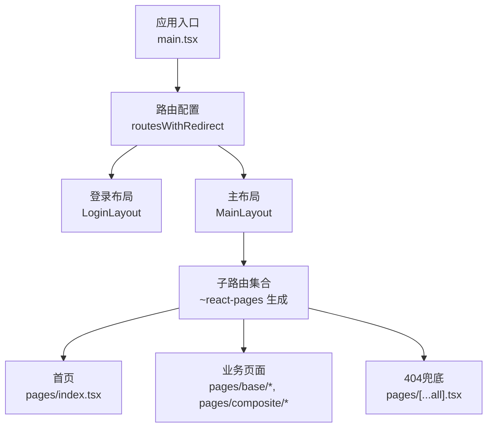
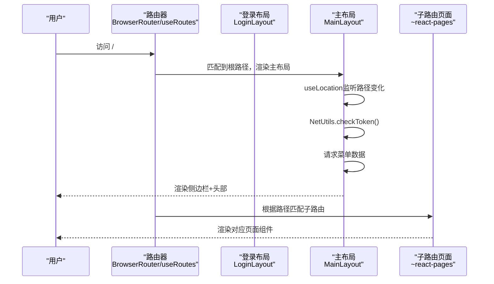
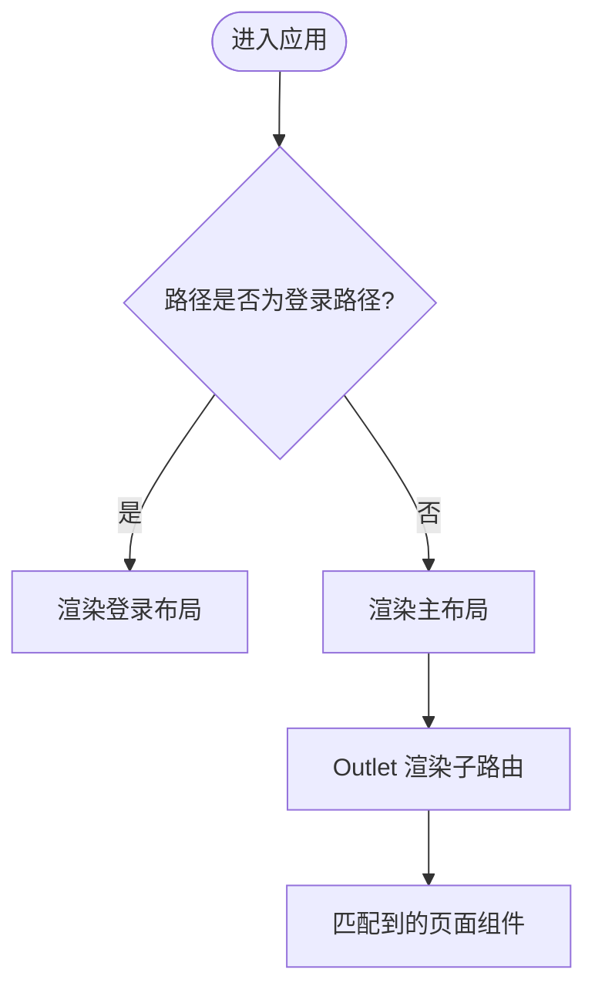
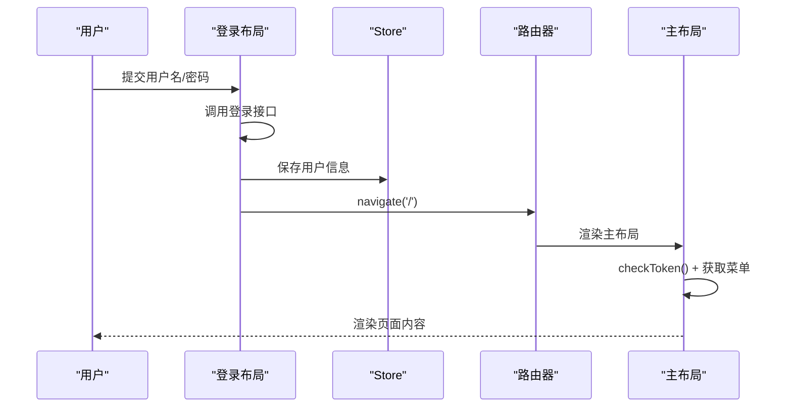
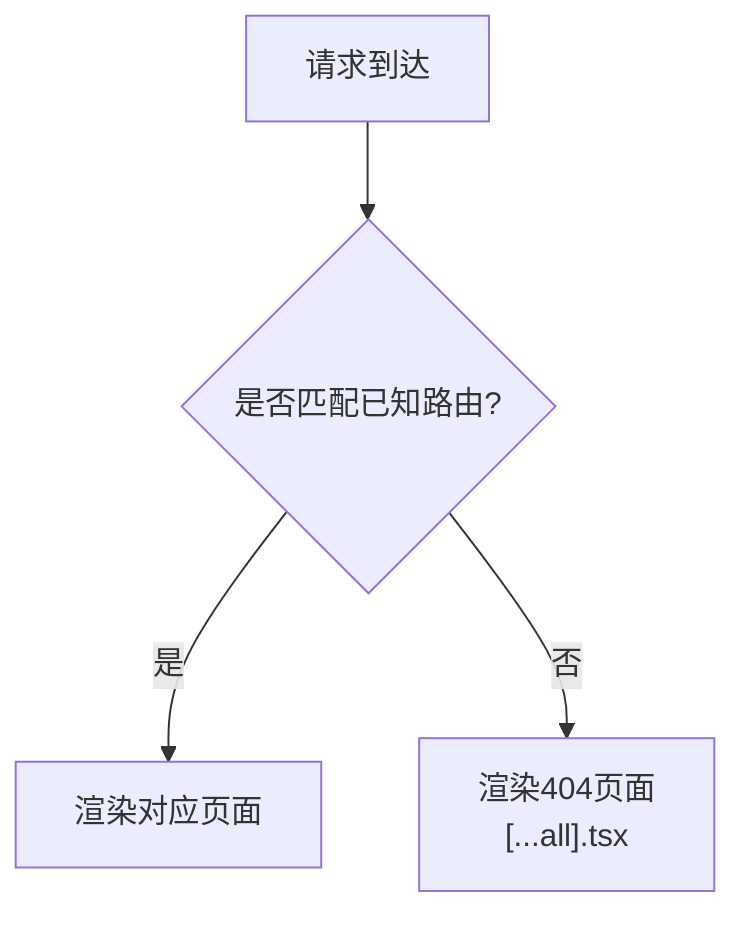
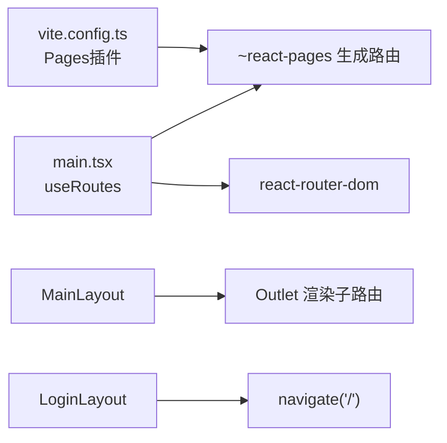

# 路由系统

<cite>
**本文引用的文件**
- [main.tsx](file://apps/demo/src/main.tsx)
- [vite.config.ts](file://apps/demo/vite.config.ts)
- [global.d.ts](file://apps/demo/src/types/global.d.ts)
- [LoginLayout.tsx](file://apps/demo/src/layouts/login/LoginLayout.tsx)
- [MainLayout.tsx](file://apps/demo/src/layouts/main/MainLayout.tsx)
- [index.tsx（首页）](file://apps/demo/src/pages/index.tsx)
- [...all].tsx（404页面）](file://apps/demo/src/pages/[...all].tsx)
- [home/index.tsx](file://apps/demo/src/pages/home/index.tsx)
- [base/table/index.tsx](file://apps/demo/src/pages/base/table/index.tsx)
- [composite/formAndTable/index.tsx](file://apps/demo/src/pages/composite/formAndTable/index.tsx)
- [stores.ts](file://apps/demo/src/init/stores.ts)
- [init.ts](file://apps/demo/src/init/init.ts)
</cite>

## 目录
1. [简介](#简介)
2. [项目结构](#项目结构)
3. [核心组件](#核心组件)
4. [架构总览](#架构总览)
5. [详细组件分析](#详细组件分析)
6. [依赖关系分析](#依赖关系分析)
7. [性能考虑](#性能考虑)
8. [故障排查指南](#故障排查指南)
9. [结论](#结论)
10. [附录](#附录)

## 简介
本文件面向WMS Web项目的路由系统，围绕基于React Router与vite-plugin-pages的“文件系统路由”方案，系统性说明：
- 页面路由、嵌套路由与动态路由的实现方式
- 路由守卫与权限控制机制（结合登录态与菜单数据）
- 路由参数传递与状态保持方案
- 404错误页与错误路由配置
- 路由优化最佳实践（代码分割与懒加载）
- 具体配置示例与常见问题解决方案

## 项目结构
本项目采用“文件系统路由”模式：在src/pages目录下按目录/文件自动生成路由表，并通过vite-plugin-pages以异步importMode开启按需加载。根入口使用react-router-dom的BrowserRouter包裹应用，并在App层通过useRoutes将路由表渲染为元素树。

图表来源
- [main.tsx:11-21](file://apps/demo/src/main.tsx#L11-L21)
- [vite.config.ts:14-18](file://apps/demo/vite.config.ts#L14-L18)
- [global.d.ts:1-5](file://apps/demo/src/types/global.d.ts#L1-L5)

章节来源
- [main.tsx:1-52](file://apps/demo/src/main.tsx#L1-L52)
- [vite.config.ts:1-36](file://apps/demo/vite.config.ts#L1-L36)
- [global.d.ts:1-12](file://apps/demo/src/types/global.d.ts#L1-L12)

## 核心组件
- 路由装配器：在App中通过useRoutes挂载路由表，支持children嵌套，实现布局级路由与页面级路由分离。
- 文件系统路由：vite-plugin-pages扫描src/pages，自动将目录映射为路由路径，并默认启用异步importMode，天然支持代码分割与懒加载。
- 全局类型声明：对~react-pages模块进行类型声明，使生成的路由具备RouteObject类型约束。
- 布局组件：
  - LoginLayout：负责登录流程与登录后跳转。
  - MainLayout：承载侧边栏、头部与内容区，使用Outlet渲染子路由页面。

章节来源
- [main.tsx:11-29](file://apps/demo/src/main.tsx#L11-L29)
- [vite.config.ts:14-18](file://apps/demo/vite.config.ts#L14-L18)
- [global.d.ts:1-5](file://apps/demo/src/types/global.d.ts#L1-L5)
- [LoginLayout.tsx:18-49](file://apps/demo/src/layouts/login/LoginLayout.tsx#L18-L49)
- [MainLayout.tsx:16-73](file://apps/demo/src/layouts/main/MainLayout.tsx#L16-L73)

## 架构总览
下图展示从浏览器访问到页面渲染的关键流程，包括登录态校验、菜单获取与子路由渲染。

图表来源
- [main.tsx:11-29](file://apps/demo/src/main.tsx#L11-L29)
- [MainLayout.tsx:21-39](file://apps/demo/src/layouts/main/MainLayout.tsx#L21-L39)
- [vite.config.ts:14-18](file://apps/demo/vite.config.ts#L14-L18)

## 详细组件分析

### 路由装配与嵌套路由
- 根路由分为两条：
  - 登录路径：由环境变量VITE_LOGIN_URL决定，渲染登录布局。
  - 根路径/：渲染主布局，并将~react-pages生成的所有页面路由作为children注入，形成嵌套路由。
- 主布局通过Outlet渲染当前匹配的子路由页面，从而实现“布局壳+内容区”的经典结构。

图表来源
- [main.tsx:11-21](file://apps/demo/src/main.tsx#L11-L21)
- [MainLayout.tsx:65-69](file://apps/demo/src/layouts/main/MainLayout.tsx#L65-L69)

章节来源
- [main.tsx:11-29](file://apps/demo/src/main.tsx#L11-L29)
- [MainLayout.tsx:16-73](file://apps/demo/src/layouts/main/MainLayout.tsx#L16-L73)

### 登录与路由守卫
- 登录流程：
  - 用户在登录布局提交表单，调用网络工具发起登录请求。
  - 成功后将用户信息写入全局Store，并使用useNavigate跳转到根路径/。
- 路由守卫思路：
  - 在主布局初始化时检查token有效性（NetUtils.checkToken），并结合菜单数据拉取逻辑，可在此处扩展未登录重定向到登录页的逻辑。
  - 建议在MainLayout中增加鉴权判断：若未登录或token失效，则导航至登录路径；否则继续渲染菜单与子路由。

图表来源
- [LoginLayout.tsx:24-49](file://apps/demo/src/layouts/login/LoginLayout.tsx#L24-L49)
- [MainLayout.tsx:21-39](file://apps/demo/src/layouts/main/MainLayout.tsx#L21-L39)

章节来源
- [LoginLayout.tsx:18-49](file://apps/demo/src/layouts/login/LoginLayout.tsx#L18-L49)
- [MainLayout.tsx:21-39](file://apps/demo/src/layouts/main/MainLayout.tsx#L21-L39)
- [stores.ts:5-8](file://apps/demo/src/init/stores.ts#L5-L8)

### 动态路由与404处理
- 动态路由：
  - 通过vite-plugin-pages的目录约定即可生成多级路由，如base/table、composite/formAndTable等。
  - 对于需要通配符的动态路由，可在pages下新增带[...param]的文件来捕获剩余路径。
- 404兜底：
  - 项目中已提供pages/[...all].tsx作为未知路由的兜底页面，用于显示“错误的路由信息”。
  - 建议将其置于路由表末尾，确保仅在无其他匹配时生效。

图表来源
- [...all].tsx:1-15](file://apps/demo/src/pages/[...all].tsx#L1-L15)

章节来源
- [...all].tsx:1-15](file://apps/demo/src/pages/[...all].tsx#L1-L15)
- [vite.config.ts:14-18](file://apps/demo/vite.config.ts#L14-L18)

### 路由参数传递与状态保持
- 路由参数：
  - 文件系统路由配合react-router的params/query能力，可在页面组件内读取URL参数。
  - 对于复杂场景，可通过store持久化关键状态（如用户信息、选中项等），避免仅依赖URL导致的状态丢失。
- 状态保持：
  - Store集中管理用户信息与菜单数据，便于跨页面共享与复用。
  - 在MainLayout中监听location.pathname变化，可在切换路由时触发必要的副作用（如刷新菜单高亮、重置视图状态等）。

章节来源
- [MainLayout.tsx:16-39](file://apps/demo/src/layouts/main/MainLayout.tsx#L16-L39)
- [stores.ts:5-8](file://apps/demo/src/init/stores.ts#L5-L8)

### 页面组织与示例
- 首页：pages/index.tsx
- 业务页面：
  - base/table/index.tsx：表格类页面示例
  - composite/formAndTable/index.tsx：表单与表格组合页面示例
  - home/index.tsx：首页占位页面

章节来源
- [index.tsx（首页）:1-9](file://apps/demo/src/pages/index.tsx#L1-L9)
- [base/table/index.tsx:1-10](file://apps/demo/src/pages/base/table/index.tsx#L1-L10)
- [composite/formAndTable/index.tsx:1-10](file://apps/demo/src/pages/composite/formAndTable/index.tsx#L1-L10)
- [home/index.tsx:1-9](file://apps/demo/src/pages/home/index.tsx#L1-L9)

## 依赖关系分析
- 构建期依赖：
  - vite-plugin-pages：扫描src/pages生成路由表，并默认启用异步importMode，实现代码分割与懒加载。
  - react-router-dom：提供BrowserRouter与useRoutes，完成运行时路由匹配与渲染。
- 运行期依赖：
  - ~react-pages：由插件生成的路由数组，被App层引入并作为useRoutes的参数。
  - 网络与存储：登录与菜单数据通过框架提供的NetUtils与Store进行交互。

图表来源
- [vite.config.ts:14-18](file://apps/demo/vite.config.ts#L14-L18)
- [main.tsx:4-29](file://apps/demo/src/main.tsx#L4-L29)
- [MainLayout.tsx:65-69](file://apps/demo/src/layouts/main/MainLayout.tsx#L65-L69)
- [LoginLayout.tsx:41-43](file://apps/demo/src/layouts/login/LoginLayout.tsx#L41-L43)

章节来源
- [vite.config.ts:1-36](file://apps/demo/vite.config.ts#L1-L36)
- [main.tsx:1-52](file://apps/demo/src/main.tsx#L1-L52)

## 性能考虑
- 代码分割与懒加载：
  - vite-plugin-pages的importMode: 'async'会为每个页面生成独立的chunk，首次只加载所需资源。
  - 建议在大型页面中使用React.lazy与Suspense进一步细化加载粒度（当前已在App层包裹Suspense）。
- 路由级优化：
  - 将公共布局与通用组件抽离，减少重复打包体积。
  - 合理使用路由层级，避免过深的嵌套导致不必要的重渲染。
- 网络与状态：
  - 在MainLayout中缓存菜单数据，避免频繁请求。
  - 对敏感操作（如token校验）做幂等与重试策略。

章节来源
- [vite.config.ts:14-18](file://apps/demo/vite.config.ts#L14-L18)
- [main.tsx:23-30](file://apps/demo/src/main.tsx#L23-L30)
- [MainLayout.tsx:21-39](file://apps/demo/src/layouts/main/MainLayout.tsx#L21-L39)

## 故障排查指南
- 404页面不生效：
  - 确认pages/[...all].tsx存在且未被更高优先级的路由匹配覆盖。
  - 检查vite-plugin-pages是否正确扫描到该文件。
- 登录后无法进入主页：
  - 检查LoginLayout中的navigate调用与MainLayout中的checkToken逻辑。
  - 确认环境变量VITE_LOGIN_URL与后端返回的用户信息格式正确。
- 菜单不显示或高亮异常：
  - 检查MainLayout中菜单数据获取与location变化监听逻辑。
  - 确认后端返回的菜单结构与前端期望一致。
- 页面加载缓慢：
  - 确认importMode为async，查看打包产物是否拆分合理。
  - 使用浏览器开发者工具的Network面板分析首屏资源大小与加载顺序。

章节来源
- [...all].tsx:1-15](file://apps/demo/src/pages/[...all].tsx#L1-L15)
- [LoginLayout.tsx:24-49](file://apps/demo/src/layouts/login/LoginLayout.tsx#L24-L49)
- [MainLayout.tsx:21-39](file://apps/demo/src/layouts/main/MainLayout.tsx#L21-L39)
- [vite.config.ts:14-18](file://apps/demo/vite.config.ts#L14-L18)

## 结论
本项目通过vite-plugin-pages与react-router-dom的组合，实现了简洁高效的文件系统路由体系。借助布局组件与Store，完成了登录态管理、菜单驱动与子路由渲染。未来可在主布局中完善鉴权拦截、在页面中规范参数传递与状态管理，并持续优化代码分割与首屏性能。

## 附录
- 环境变量与配置要点：
  - VITE_LOGIN_URL：登录页路径，用于区分登录与非登录路由。
  - VITE_API_MENU：菜单接口地址，用于动态生成侧边栏。
  - importMode: 'async'：启用页面级代码分割。
- 推荐实践：
  - 在MainLayout中统一处理鉴权与菜单加载，保证一致的导航体验。
  - 使用Store集中管理跨页面状态，避免URL过度承载状态。
  - 对大页面与第三方库进行按需引入，降低包体体积。