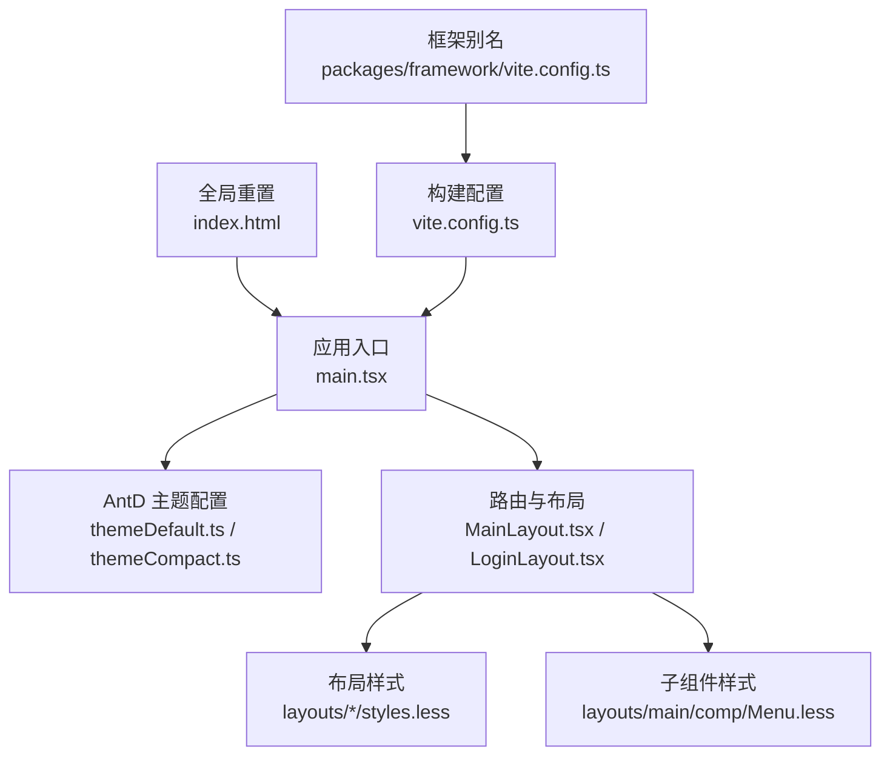
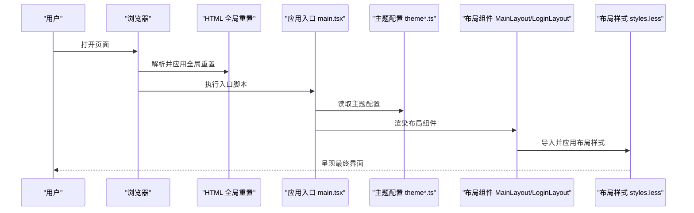
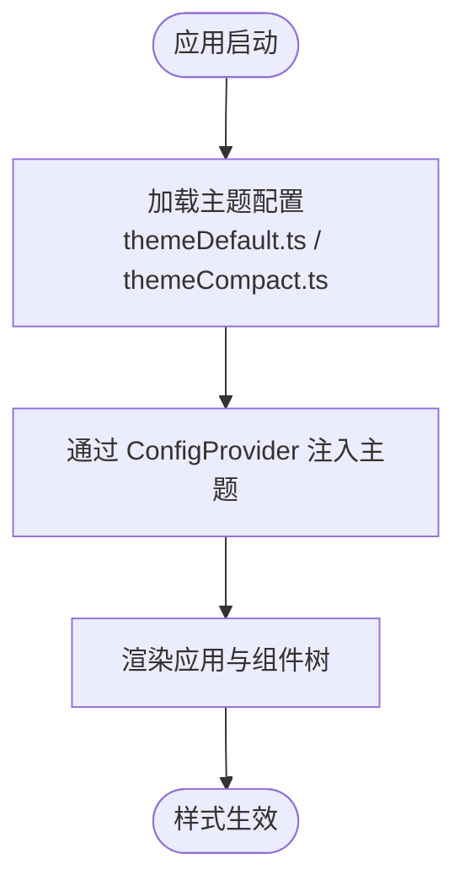
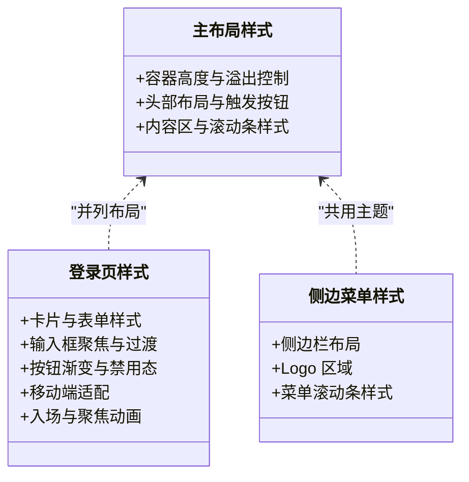
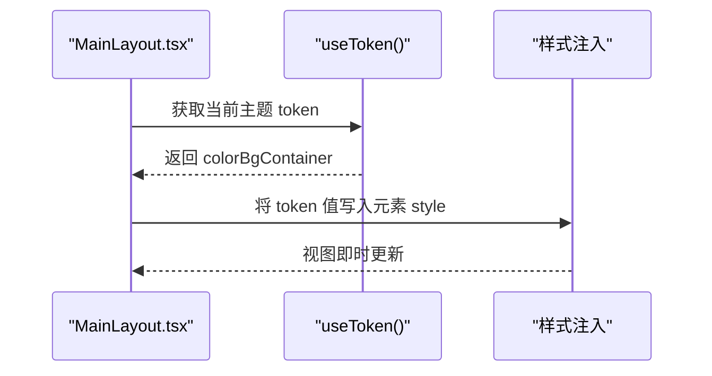
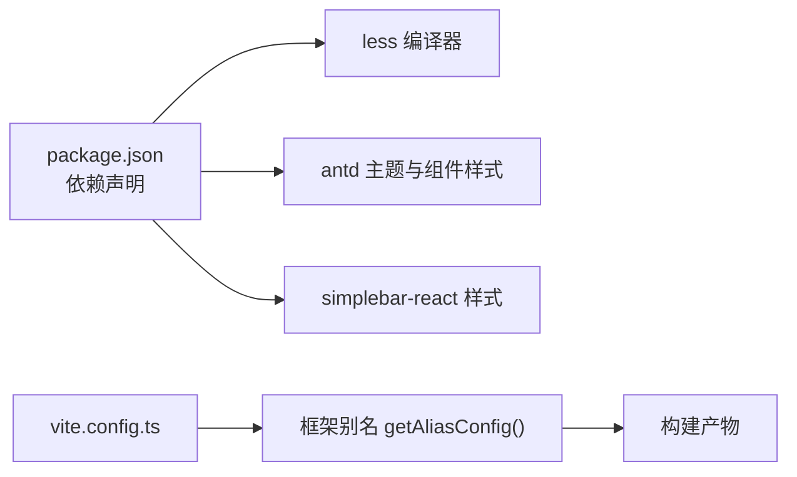

# 样式系统

<cite>
**本文引用的文件**
- [apps/demo/src/main.tsx](file://apps/demo/src/main.tsx)
- [apps/demo/src/theme/themeDefault.ts](file://apps/demo/src/theme/themeDefault.ts)
- [apps/demo/src/theme/themeCompact.ts](file://apps/demo/src/theme/themeCompact.ts)
- [apps/demo/src/layouts/main/styles.less](file://apps/demo/src/layouts/main/styles.less)
- [apps/demo/src/layouts/login/styles.less](file://apps/demo/src/layouts/login/styles.less)
- [apps/demo/src/layouts/main/comp/Menu.less](file://apps/demo/src/layouts/main/comp/Menu.less)
- [apps/demo/src/layouts/main/MainLayout.tsx](file://apps/demo/src/layouts/main/MainLayout.tsx)
- [apps/demo/src/layouts/login/LoginLayout.tsx](file://apps/demo/src/layouts/login/LoginLayout.tsx)
- [apps/demo/vite.config.ts](file://apps/demo/vite.config.ts)
- [apps/demo/package.json](file://apps/demo/package.json)
- [apps/demo/index.html](file://apps/demo/index.html)
- [packages/framework/vite.config.ts](file://packages/framework/vite.config.ts)
</cite>

## 目录
1. [简介](#简介)
2. [项目结构](#项目结构)
3. [核心组件](#核心组件)
4. [架构总览](#架构总览)
5. [详细组件分析](#详细组件分析)
6. [依赖分析](#依赖分析)
7. [性能考虑](#性能考虑)
8. [故障排查指南](#故障排查指南)
9. [结论](#结论)
10. [附录](#附录)

## 简介
本样式系统基于 Vite + React + Ant Design 构建，采用模块化 Less 样式与 Ant Design 主题系统相结合的策略。通过集中式主题配置（默认主题与紧凑主题）实现全局风格切换；通过按页面/布局组织的 .less 文件实现样式隔离与可维护性；通过 CSS Reset、响应式媒体查询与动画提升跨端体验；通过动态 token 注入与按需引入第三方滚动库样式，兼顾灵活性与性能。

## 项目结构
样式相关的关键位置与职责：
- 应用入口与主题挂载：在应用根节点使用 Ant Design 的 ConfigProvider 注入主题配置，统一控制组件外观。
- 主题定义：提供默认主题与紧凑主题两套 ThemeConfig，便于运行时或构建时切换。
- 布局样式：主布局与登录页各自拥有独立的 .less 文件，遵循“就近管理”原则，避免全局污染。
- 全局重置：index.html 内嵌基础 CSS Reset，确保多浏览器一致性。
- 构建与别名：Vite 配置中暴露框架别名，便于统一引用；Less 作为开发语言由 Vite 原生支持。

图表来源
- [apps/demo/src/main.tsx:1-30](file://apps/demo/src/main.tsx#L1-L30)
- [apps/demo/src/theme/themeDefault.ts:1-16](file://apps/demo/src/theme/themeDefault.ts#L1-L16)
- [apps/demo/src/theme/themeCompact.ts:1-16](file://apps/demo/src/theme/themeCompact.ts#L1-L16)
- [apps/demo/src/layouts/main/MainLayout.tsx:1-77](file://apps/demo/src/layouts/main/MainLayout.tsx#L1-L77)
- [apps/demo/src/layouts/login/LoginLayout.tsx:1-99](file://apps/demo/src/layouts/login/LoginLayout.tsx#L1-L99)
- [apps/demo/src/layouts/main/styles.less:1-45](file://apps/demo/src/layouts/main/styles.less#L1-L45)
- [apps/demo/src/layouts/login/styles.less:1-189](file://apps/demo/src/layouts/login/styles.less#L1-L189)
- [apps/demo/src/layouts/main/comp/Menu.less:1-31](file://apps/demo/src/layouts/main/comp/Menu.less#L1-L31)
- [apps/demo/index.html:1-154](file://apps/demo/index.html#L1-L154)
- [apps/demo/vite.config.ts:1-36](file://apps/demo/vite.config.ts#L1-L36)
- [packages/framework/vite.config.ts:1-56](file://packages/framework/vite.config.ts#L1-L56)

章节来源
- [apps/demo/src/main.tsx:1-30](file://apps/demo/src/main.tsx#L1-L30)
- [apps/demo/src/theme/themeDefault.ts:1-16](file://apps/demo/src/theme/themeDefault.ts#L1-L16)
- [apps/demo/src/theme/themeCompact.ts:1-16](file://apps/demo/src/theme/themeCompact.ts#L1-L16)
- [apps/demo/src/layouts/main/styles.less:1-45](file://apps/demo/src/layouts/main/styles.less#L1-L45)
- [apps/demo/src/layouts/login/styles.less:1-189](file://apps/demo/src/layouts/login/styles.less#L1-L189)
- [apps/demo/src/layouts/main/comp/Menu.less:1-31](file://apps/demo/src/layouts/main/comp/Menu.less#L1-L31)
- [apps/demo/index.html:1-154](file://apps/demo/index.html#L1-L154)
- [apps/demo/vite.config.ts:1-36](file://apps/demo/vite.config.ts#L1-L36)
- [packages/framework/vite.config.ts:1-56](file://packages/framework/vite.config.ts#L1-L56)

## 核心组件
- 主题系统
  - 默认主题与紧凑主题分别以独立模块导出，包含算法选择、token 覆盖与组件级覆盖点，便于扩展。
  - 应用根节点通过 ConfigProvider 注入主题，使所有 AntD 组件共享同一套视觉变量。
- 布局样式
  - 主布局样式负责整体容器、头部与内容区尺寸与滚动条样式定制。
  - 登录页样式聚焦卡片、表单、按钮与交互反馈，并内置移动端适配与动画。
- 全局重置
  - index.html 内嵌 CSS Reset，统一各浏览器默认样式差异，保证后续样式可控。
- 构建与工具链
  - Vite 原生支持 Less，无需额外插件即可编译 .less。
  - 通过框架别名统一管理源码路径，减少相对路径耦合。

章节来源
- [apps/demo/src/main.tsx:1-30](file://apps/demo/src/main.tsx#L1-L30)
- [apps/demo/src/theme/themeDefault.ts:1-16](file://apps/demo/src/theme/themeDefault.ts#L1-L16)
- [apps/demo/src/theme/themeCompact.ts:1-16](file://apps/demo/src/theme/themeCompact.ts#L1-L16)
- [apps/demo/src/layouts/main/styles.less:1-45](file://apps/demo/src/layouts/main/styles.less#L1-L45)
- [apps/demo/src/layouts/login/styles.less:1-189](file://apps/demo/src/layouts/login/styles.less#L1-L189)
- [apps/demo/index.html:1-154](file://apps/demo/index.html#L1-L154)
- [apps/demo/vite.config.ts:1-36](file://apps/demo/vite.config.ts#L1-L36)

## 架构总览
下图展示了从应用启动到样式生效的整体流程：入口渲染时注入主题，布局组件加载对应 .less 样式，全局重置在 HTML 层生效，最终形成一致的 UI 表现。

图表来源
- [apps/demo/index.html:1-154](file://apps/demo/index.html#L1-L154)
- [apps/demo/src/main.tsx:1-30](file://apps/demo/src/main.tsx#L1-L30)
- [apps/demo/src/theme/themeDefault.ts:1-16](file://apps/demo/src/theme/themeDefault.ts#L1-L16)
- [apps/demo/src/theme/themeCompact.ts:1-16](file://apps/demo/src/theme/themeCompact.ts#L1-L16)
- [apps/demo/src/layouts/main/MainLayout.tsx:1-77](file://apps/demo/src/layouts/main/MainLayout.tsx#L1-L77)
- [apps/demo/src/layouts/login/LoginLayout.tsx:1-99](file://apps/demo/src/layouts/login/LoginLayout.tsx#L1-L99)
- [apps/demo/src/layouts/main/styles.less:1-45](file://apps/demo/src/layouts/main/styles.less#L1-L45)
- [apps/demo/src/layouts/login/styles.less:1-189](file://apps/demo/src/layouts/login/styles.less#L1-L189)

## 详细组件分析

### 主题系统与切换机制
- 设计要点
  - 将主题拆分为独立模块，分别提供默认与紧凑两种算法，并通过 token 与 components 进行细粒度覆盖。
  - 在应用根节点通过 ConfigProvider 注入主题，确保全局一致。
- 实现要点
  - 主题模块导出 ThemeConfig，包含算法、圆角等 token 以及组件级覆盖占位。
  - 入口文件引入并传入 ConfigProvider 的 theme 属性。
- 扩展建议
  - 新增主题只需新增一个 ThemeConfig 模块并在入口替换即可。
  - 可在运行时根据用户偏好或环境变量切换主题。

图表来源
- [apps/demo/src/theme/themeDefault.ts:1-16](file://apps/demo/src/theme/themeDefault.ts#L1-L16)
- [apps/demo/src/theme/themeCompact.ts:1-16](file://apps/demo/src/theme/themeCompact.ts#L1-L16)
- [apps/demo/src/main.tsx:1-30](file://apps/demo/src/main.tsx#L1-L30)

章节来源
- [apps/demo/src/theme/themeDefault.ts:1-16](file://apps/demo/src/theme/themeDefault.ts#L1-L16)
- [apps/demo/src/theme/themeCompact.ts:1-16](file://apps/demo/src/theme/themeCompact.ts#L1-L16)
- [apps/demo/src/main.tsx:1-30](file://apps/demo/src/main.tsx#L1-L30)

### 布局样式与组件样式组织
- 主布局样式
  - 定义容器高度、头部与内容区布局，并对第三方滚动条进行主题化定制。
  - 通过嵌套规则组织 Header、Tab 区域与用户信息区域，保持可读性。
- 登录页样式
  - 使用渐变背景、毛玻璃卡片、输入框聚焦动效与按钮过渡效果增强体验。
  - 通过媒体查询实现移动端适配，调整间距、字号与按钮尺寸。
- 侧边菜单样式
  - 针对侧边栏与菜单滚动条进行样式定制，保证与整体主题一致。

图表来源
- [apps/demo/src/layouts/main/styles.less:1-45](file://apps/demo/src/layouts/main/styles.less#L1-L45)
- [apps/demo/src/layouts/login/styles.less:1-189](file://apps/demo/src/layouts/login/styles.less#L1-L189)
- [apps/demo/src/layouts/main/comp/Menu.less:1-31](file://apps/demo/src/layouts/main/comp/Menu.less#L1-L31)

章节来源
- [apps/demo/src/layouts/main/styles.less:1-45](file://apps/demo/src/layouts/main/styles.less#L1-L45)
- [apps/demo/src/layouts/login/styles.less:1-189](file://apps/demo/src/layouts/login/styles.less#L1-L189)
- [apps/demo/src/layouts/main/comp/Menu.less:1-31](file://apps/demo/src/layouts/main/comp/Menu.less#L1-L31)

### 动态样式与 Token 使用
- 通过 Ant Design 的 useToken 获取当前主题 token，并将其应用到布局的背景色等样式上，确保组件与主题同步。
- 在布局组件中直接读取 colorBgContainer 并注入到 style 中，实现运行时动态样式更新。

图表来源
- [apps/demo/src/layouts/main/MainLayout.tsx:41-67](file://apps/demo/src/layouts/main/MainLayout.tsx#L41-L67)

章节来源
- [apps/demo/src/layouts/main/MainLayout.tsx:41-67](file://apps/demo/src/layouts/main/MainLayout.tsx#L41-L67)

### Less 预处理器在项目中的使用
- 语言与工具链
  - 项目依赖 less 并通过 Vite 原生支持编译 .less 文件，无需额外插件。
- 实践方式
  - 使用嵌套规则组织样式，提高可读性与可维护性。
  - 使用媒体查询实现响应式适配。
  - 对第三方组件滚动条等细节进行主题化覆盖。
- 最佳实践
  - 样式文件与组件就近放置，遵循“就近管理”原则。
  - 避免在全局文件中编写业务样式，尽量模块化。

章节来源
- [apps/demo/package.json:27-43](file://apps/demo/package.json#L27-L43)
- [apps/demo/src/layouts/main/styles.less:1-45](file://apps/demo/src/layouts/main/styles.less#L1-L45)
- [apps/demo/src/layouts/login/styles.less:1-189](file://apps/demo/src/layouts/login/styles.less#L1-L189)
- [apps/demo/src/layouts/main/comp/Menu.less:1-31](file://apps/demo/src/layouts/main/comp/Menu.less#L1-L31)

### 响应式设计与移动端适配
- 登录页通过媒体查询在小屏设备上调整内边距、字号与按钮尺寸，保证触控友好。
- 主布局与侧边栏在不同屏幕下保持合理的滚动与展示区域。
- 建议在新增页面时优先采用弹性布局与相对单位，配合媒体查询完成适配。

章节来源
- [apps/demo/src/layouts/login/styles.less:126-150](file://apps/demo/src/layouts/login/styles.less#L126-L150)
- [apps/demo/src/layouts/main/styles.less:1-45](file://apps/demo/src/layouts/main/styles.less#L1-L45)
- [apps/demo/src/layouts/main/comp/Menu.less:1-31](file://apps/demo/src/layouts/main/comp/Menu.less#L1-L31)

### 样式调试与开发技巧
- 浏览器开发者工具
  - 使用 Elements 面板检查计算样式与层级关系，定位冲突。
  - 使用 Computed 面板查看最终渲染值，验证媒体查询是否生效。
- 主题调试
  - 在入口临时切换主题模块，快速对比不同算法与 token 的效果。
- 性能观察
  - 使用 Performance 面板观察样式重排与重绘，尽量减少复杂动画与过度嵌套。

[本节为通用指导，不直接分析具体文件]

## 依赖分析
样式相关的依赖与集成点：
- 构建与语言
  - Vite 原生支持 Less，无需额外插件。
  - 项目声明 less 依赖，确保编译链路完整。
- 主题与组件
  - Ant Design 提供主题系统与组件样式，通过 ConfigProvider 注入。
- 第三方滚动库
  - simplebar-react 样式通过 import 引入，用于内容区滚动优化。
- 框架别名
  - 通过 packages/framework 的 vite.config 暴露别名，统一源码引用路径。

图表来源
- [apps/demo/package.json:15-43](file://apps/demo/package.json#L15-L43)
- [apps/demo/vite.config.ts:1-36](file://apps/demo/vite.config.ts#L1-L36)
- [packages/framework/vite.config.ts:1-56](file://packages/framework/vite.config.ts#L1-L56)

章节来源
- [apps/demo/package.json:15-43](file://apps/demo/package.json#L15-L43)
- [apps/demo/vite.config.ts:1-36](file://apps/demo/vite.config.ts#L1-L36)
- [packages/framework/vite.config.ts:1-56](file://packages/framework/vite.config.ts#L1-L56)

## 性能考虑
- 样式体积
  - 仅引入必要的样式文件，避免重复导入。
  - 合理使用媒体查询与动画，避免不必要的重排。
- 主题渲染
  - 通过 Ant Design 的主题系统批量生成样式，减少自定义 CSS 复杂度。
- 滚动性能
  - 使用 simplebar-react 优化长列表滚动体验，注意其样式仅在需要时引入。
- 构建优化
  - 利用 Vite 的按需编译与缓存，提升开发体验与构建速度。

[本节为通用指导，不直接分析具体文件]

## 故障排查指南
- 样式未生效
  - 确认 .less 文件已正确导入到对应组件。
  - 检查类名是否与 DOM 结构匹配，避免命名冲突。
- 主题不生效
  - 确认 ConfigProvider 包裹了应用根节点，且 theme 参数正确传入。
  - 检查是否存在更具体的选择器覆盖了主题 token。
- 移动端适配异常
  - 检查媒体查询断点是否符合预期，确认视口 meta 标签存在。
  - 使用浏览器设备模拟模式逐项验证。
- 滚动条样式无效
  - 确认第三方滚动库样式已引入，且选择器优先级足够。

章节来源
- [apps/demo/src/main.tsx:1-30](file://apps/demo/src/main.tsx#L1-L30)
- [apps/demo/src/layouts/main/styles.less:1-45](file://apps/demo/src/layouts/main/styles.less#L1-L45)
- [apps/demo/src/layouts/login/styles.less:1-189](file://apps/demo/src/layouts/login/styles.less#L1-L189)
- [apps/demo/src/layouts/main/comp/Menu.less:1-31](file://apps/demo/src/layouts/main/comp/Menu.less#L1-L31)

## 结论
本项目采用“集中式主题 + 模块化样式”的架构，结合 Ant Design 的主题系统与 Less 的模块化能力，实现了清晰、可扩展且易维护的样式体系。通过全局重置、响应式适配与动画增强用户体验；通过动态 token 注入与第三方样式按需引入，兼顾灵活性与性能。未来可在运行时主题切换、样式自动化测试与性能监控方面进一步演进。

[本节为总结性内容，不直接分析具体文件]

## 附录
- Less 使用建议
  - 使用嵌套与媒体查询组织样式，保持文件内聚。
  - 避免过深嵌套，控制选择器层级以提升可维护性。
- 主题定制建议
  - 优先通过 token 与 components 覆盖，减少手写 CSS。
  - 新增主题时复用现有结构，保持一致性。
- 样式隔离建议
  - 组件样式就近管理，避免全局污染。
  - 对第三方组件样式覆盖时，明确作用域与优先级。

[本节为通用指导，不直接分析具体文件]