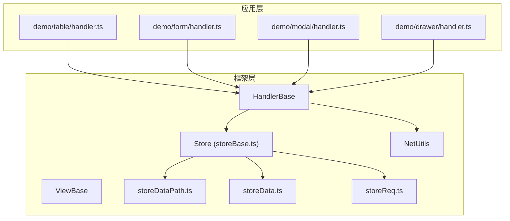
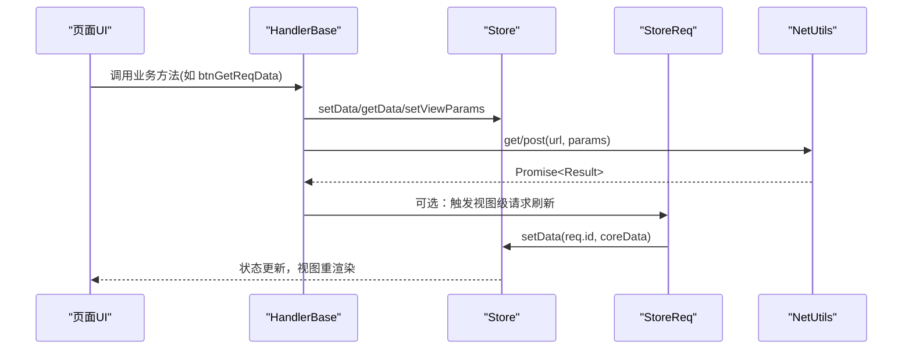
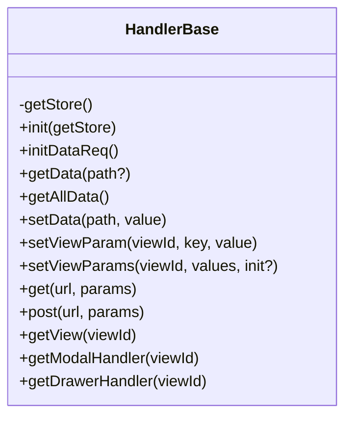
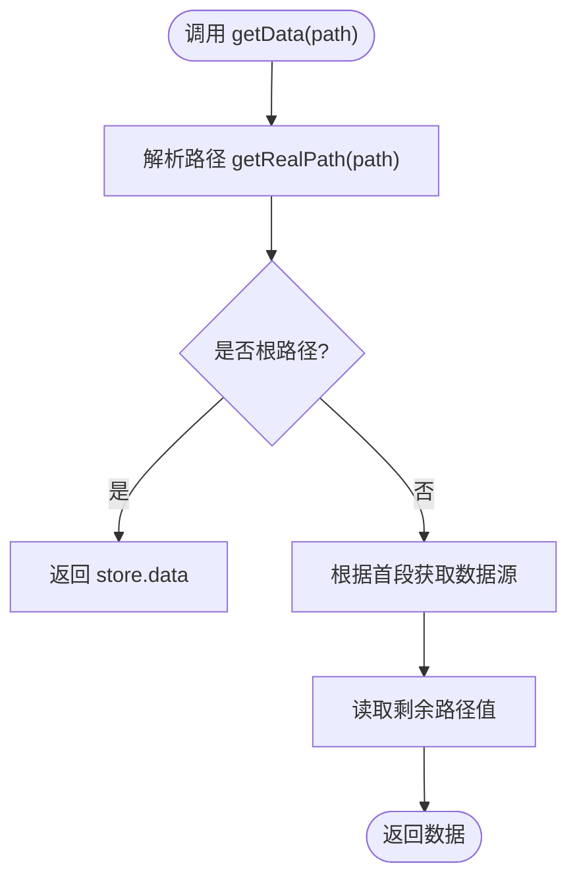
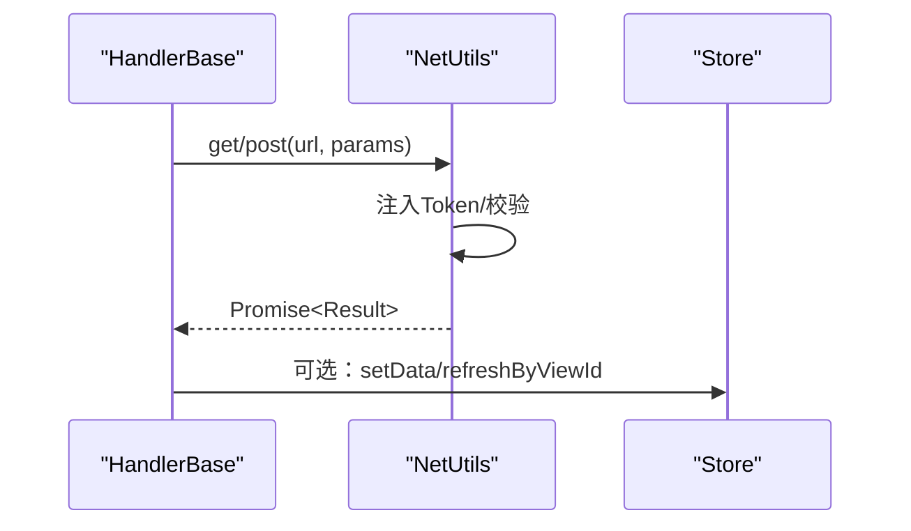
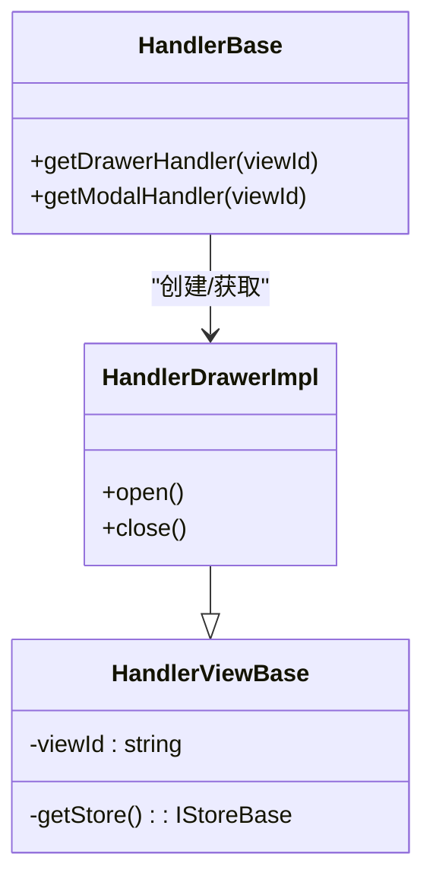
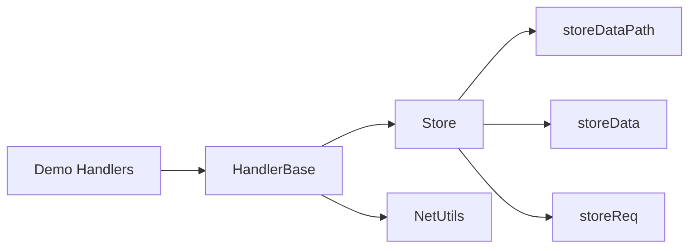

# 业务逻辑处理

<cite>
**本文引用的文件**
- [packages/framework/src/handler/handlerBase.ts](file://packages/framework/src/handler/handlerBase.ts)
- [packages/framework/src/handler/handlerViewBase.ts](file://packages/framework/src/handler/handlerViewBase.ts)
- [packages/framework/src/stores/store/interface.ts](file://packages/framework/src/stores/store/interface.ts)
- [packages/framework/src/stores/store/storeBase.ts](file://packages/framework/src/stores/store/storeBase.ts)
- [packages/framework/src/stores/store/utils/storeData.ts](file://packages/framework/src/stores/store/utils/storeData.ts)
- [packages/framework/src/stores/store/utils/storeDataPath.ts](file://packages/framework/src/stores/store/utils/storeDataPath.ts)
- [packages/framework/src/stores/store/utils/storeReq.ts](file://packages/framework/src/stores/store/utils/storeReq.ts)
- [packages/framework/src/stores/store/utils/storeInit.ts](file://packages/framework/src/stores/store/utils/storeInit.ts)
- [packages/framework/src/comp/viewBase.ts](file://packages/framework/src/comp/viewBase.ts)
- [packages/framework/src/comp/view/drawer/handler/handlerDrawer.tsx](file://packages/framework/src/comp/view/drawer/handler/handlerDrawer.tsx)
- [packages/framework/src/index.ts](file://packages/framework/src/index.ts)
- [packages/framework/src/utils/netUtils/index.ts](file://packages/framework/src/utils/netUtils/index.ts)
- [apps/demo/src/pages/base/table/handler.ts](file://apps/demo/src/pages/base/table/handler.ts)
- [apps/demo/src/pages/base/form/handler.ts](file://apps/demo/src/pages/base/form/handler.ts)
- [apps/demo/src/pages/base/modal/handler.ts](file://apps/demo/src/pages/base/modal/handler.ts)
- [apps/demo/src/pages/base/drawer/handler.ts](file://apps/demo/src/pages/base/drawer/handler.ts)
- [apps/demo/src/init/net.ts](file://apps/demo/src/init/net.ts)
</cite>

## 目录
1. [简介](#简介)
2. [项目结构](#项目结构)
3. [核心组件](#核心组件)
4. [架构总览](#架构总览)
5. [详细组件分析](#详细组件分析)
6. [依赖关系分析](#依赖关系分析)
7. [性能考量](#性能考量)
8. [故障排查指南](#故障排查指南)
9. [结论](#结论)
10. [附录：API参考与示例](#附录api参考与示例)

## 简介
本文件围绕业务逻辑处理基类 HandlerBase 的设计理念、使用模式与扩展机制进行系统化说明，涵盖方法组织、错误处理、异步操作管理、数据与视图参数管理、弹窗/抽屉等视图控件的封装与复用。同时提供完整的 API 参考（生命周期方法、工具方法、事件处理），并结合 demo 中的实际页面展示复杂业务流程的处理方式，最后给出测试策略与调试技巧。

## 项目结构
框架将“视图-数据-处理器”解耦：
- ViewBase：视图容器，持有 handler 与 data 引用，负责渲染与根节点标识。
- HandlerBase：业务逻辑基类，统一数据读写、网络请求、视图参数设置、视图控件控制等能力。
- Store：基于 zustand + immer 的状态管理，集中维护 data、req、view、viewParams、handler 等状态，并提供初始化、数据存取、视图参数、请求触发等能力。
- NetUtils：网络层封装，提供统一的 get/post、鉴权、错误处理与 Token 管理。
- Demo 页面：通过继承 HandlerBase 实现具体业务逻辑，调用基类提供的能力完成交互与数据流。

图表来源
- [packages/framework/src/handler/handlerBase.ts:10-90](file://packages/framework/src/handler/handlerBase.ts#L10-L90)
- [packages/framework/src/stores/store/storeBase.ts:18-53](file://packages/framework/src/stores/store/storeBase.ts#L18-L53)
- [packages/framework/src/stores/store/utils/storeData.ts:57-84](file://packages/framework/src/stores/store/utils/storeData.ts#L57-L84)
- [packages/framework/src/stores/store/utils/storeDataPath.ts:13-58](file://packages/framework/src/stores/store/utils/storeDataPath.ts#L13-L58)
- [packages/framework/src/stores/store/utils/storeReq.ts:142-181](file://packages/framework/src/stores/store/utils/storeReq.ts#L142-L181)
- [packages/framework/src/utils/netUtils/index.ts:107-113](file://packages/framework/src/utils/netUtils/index.ts#L107-L113)

章节来源
- [packages/framework/src/handler/handlerBase.ts:10-90](file://packages/framework/src/handler/handlerBase.ts#L10-L90)
- [packages/framework/src/stores/store/storeBase.ts:18-53](file://packages/framework/src/stores/store/storeBase.ts#L18-L53)
- [packages/framework/src/index.ts:15-25](file://packages/framework/src/index.ts#L15-L25)

## 核心组件
- HandlerBase：业务逻辑入口，提供 init、initDataReq、getData/getAllData/setData、setViewParam/setViewParams、get/post、getView、getModalHandler/getDrawerHandler 等方法。
- HandlerViewBase：视图控件的通用处理器基类，封装 viewId 与 getStore，供 Modal/Drawer 等控件复用。
- Store：集中管理数据、请求、视图与处理器；提供 setData/getData、setViewParams/getViewParams、refreshByViewId 等能力。
- NetUtils：网络请求封装，支持拦截器、Token 注入、错误回调与统一响应处理。
- Demo Handlers：各页面通过继承 HandlerBase 实现具体业务方法，如表单提交、表格数据获取、弹窗/抽屉控制等。

章节来源
- [packages/framework/src/handler/handlerBase.ts:10-90](file://packages/framework/src/handler/handlerBase.ts#L10-L90)
- [packages/framework/src/handler/handlerViewBase.ts:6-15](file://packages/framework/src/handler/handlerViewBase.ts#L6-L15)
- [packages/framework/src/stores/store/storeBase.ts:18-53](file://packages/framework/src/stores/store/storeBase.ts#L18-L53)
- [packages/framework/src/utils/netUtils/index.ts:23-113](file://packages/framework/src/utils/netUtils/index.ts#L23-L113)
- [apps/demo/src/pages/base/table/handler.ts:3-27](file://apps/demo/src/pages/base/table/handler.ts#L3-L27)
- [apps/demo/src/pages/base/form/handler.ts:3-15](file://apps/demo/src/pages/base/form/handler.ts#L3-L15)
- [apps/demo/src/pages/base/modal/handler.ts:3-8](file://apps/demo/src/pages/base/modal/handler.ts#L3-L8)
- [apps/demo/src/pages/base/drawer/handler.ts:3-8](file://apps/demo/src/pages/base/drawer/handler.ts#L3-L8)

## 架构总览
HandlerBase 作为业务逻辑的统一门面，屏蔽了 Store 与网络层的细节，向上暴露简洁的 API。Store 负责状态与请求编排，NetUtils 负责 HTTP 通信与鉴权。视图控件（Modal/Drawer）通过 HandlerViewBase 暴露 open/close 等能力，由 HandlerBase 动态创建并缓存到 Store 中，便于跨视图调用。

图表来源
- [packages/framework/src/handler/handlerBase.ts:21-53](file://packages/framework/src/handler/handlerBase.ts#L21-L53)
- [packages/framework/src/stores/store/utils/storeReq.ts:142-181](file://packages/framework/src/stores/store/utils/storeReq.ts#L142-L181)
- [packages/framework/src/utils/netUtils/index.ts:107-113](file://packages/framework/src/utils/netUtils/index.ts#L107-L113)

## 详细组件分析

### HandlerBase：业务逻辑基类
- 生命周期
  - init(getStore)：在 Store 初始化时注入 zGet/zSet 访问器，使 Handler 能访问 Store。
  - initDataReq()：可重写以集中触发初始数据请求。
- 数据访问
  - getData(path?)：按路径读取数据，支持特殊引用路径（如 @Data/@Req/@View）。
  - getAllData()：返回完整数据树。
  - setData(path, value)：写入数据，内部走 Store.setData。
- 视图参数
  - setViewParam(viewId, key, value)：设置单个视图参数。
  - setViewParams(viewId, values, init?)：批量设置视图参数，支持初始化标记。
- 网络请求
  - get/post：封装 NetUtils.get/post，返回 Promise<Result>。
- 视图与控件
  - getView(viewId)：获取视图结构信息。
  - getModalHandler/getDrawerHandler：根据 viewId 获取或创建对应控件处理器，用于打开/关闭弹窗或抽屉。
- 错误处理
  - 当视图或控件处理器不存在时抛出明确错误，便于定位问题。

图表来源
- [packages/framework/src/handler/handlerBase.ts:10-90](file://packages/framework/src/handler/handlerBase.ts#L10-L90)

章节来源
- [packages/framework/src/handler/handlerBase.ts:10-90](file://packages/framework/src/handler/handlerBase.ts#L10-L90)

### Store：状态与请求编排
- 数据结构
  - data：业务数据树。
  - req：请求配置与结果缓存。
  - view：视图实例与结构。
  - viewParams：视图参数集合。
  - handler：视图控件处理器集合。
- 关键能力
  - setData/getData：支持路径解析与引用替换（@Active/@Data/@Req/@View）。
  - setViewParams/getViewParams：视图参数读写。
  - refreshByViewId：按视图ID重新发送请求。
  - init：初始化视图、数据与请求。
- 路径解析
  - getRealPath：将引用路径转换为真实路径，支持焦点行、根节点等。
  - getDataSource：根据 PathKey 返回对应的数据源（data/req/view/viewParams）。

图表来源
- [packages/framework/src/stores/store/utils/storeDataPath.ts:13-58](file://packages/framework/src/stores/store/utils/storeDataPath.ts#L13-L58)
- [packages/framework/src/stores/store/utils/storeData.ts:57-68](file://packages/framework/src/stores/store/utils/storeData.ts#L57-L68)

章节来源
- [packages/framework/src/stores/store/storeBase.ts:18-53](file://packages/framework/src/stores/store/storeBase.ts#L18-L53)
- [packages/framework/src/stores/store/utils/storeDataPath.ts:13-58](file://packages/framework/src/stores/store/utils/storeDataPath.ts#L13-L58)
- [packages/framework/src/stores/store/utils/storeData.ts:57-84](file://packages/framework/src/stores/store/utils/storeData.ts#L57-L84)

### 网络层 NetUtils：统一请求与鉴权
- 初始化：配置 baseURL、loginUrl、loginAPI、错误回调、Token 过期时间。
- 拦截器：自动注入 Authorization 头，处理未授权跳转。
- 响应处理：提取 token、格式化数据、统一返回 Result。
- 便捷方法：get/post 直接返回 Promise<Result>。

图表来源
- [packages/framework/src/utils/netUtils/index.ts:23-113](file://packages/framework/src/utils/netUtils/index.ts#L23-L113)
- [packages/framework/src/handler/handlerBase.ts:47-53](file://packages/framework/src/handler/handlerBase.ts#L47-L53)

章节来源
- [packages/framework/src/utils/netUtils/index.ts:23-113](file://packages/framework/src/utils/netUtils/index.ts#L23-L113)
- [apps/demo/src/init/net.ts:5-16](file://apps/demo/src/init/net.ts#L5-L16)

### 视图控件处理器：Modal/Drawer
- HandlerViewBase：提供 viewId 与 getStore，供控件处理器统一访问 Store。
- HandlerDrawerImpl：通过设置视图参数 ParamKey.Open 控制抽屉开关。
- HandlerBase.getModalHandler/getDrawerHandler：按需创建并缓存控件处理器，避免重复实例化。

图表来源
- [packages/framework/src/handler/handlerViewBase.ts:6-15](file://packages/framework/src/handler/handlerViewBase.ts#L6-L15)
- [packages/framework/src/comp/view/drawer/handler/handlerDrawer.tsx:9-16](file://packages/framework/src/comp/view/drawer/handler/handlerDrawer.tsx#L9-L16)
- [packages/framework/src/handler/handlerBase.ts:61-89](file://packages/framework/src/handler/handlerBase.ts#L61-L89)

章节来源
- [packages/framework/src/handler/handlerViewBase.ts:6-15](file://packages/framework/src/handler/handlerViewBase.ts#L6-L15)
- [packages/framework/src/comp/view/drawer/handler/handlerDrawer.tsx:9-16](file://packages/framework/src/comp/view/drawer/handler/handlerDrawer.tsx#L9-L16)
- [packages/framework/src/handler/handlerBase.ts:61-89](file://packages/framework/src/handler/handlerBase.ts#L61-L89)

### 业务示例与复用机制
- 表格页：演示打印数据、设置表单数据、GET/POST 请求、性能统计。
- 表单页：演示设置表单字段、发起 GET/POST 请求。
- 弹窗/抽屉：通过 getModalHandler/getDrawerHandler 控制显示/隐藏。
- 复用机制：所有页面 Handler 均继承自 HandlerBase，共享数据读写、网络请求、视图参数与控件控制能力；Store 统一管理状态，保证跨组件一致性。

章节来源
- [apps/demo/src/pages/base/table/handler.ts:3-27](file://apps/demo/src/pages/base/table/handler.ts#L3-L27)
- [apps/demo/src/pages/base/form/handler.ts:3-15](file://apps/demo/src/pages/base/form/handler.ts#L3-L15)
- [apps/demo/src/pages/base/modal/handler.ts:3-8](file://apps/demo/src/pages/base/modal/handler.ts#L3-L8)
- [apps/demo/src/pages/base/drawer/handler.ts:3-8](file://apps/demo/src/pages/base/drawer/handler.ts#L3-L8)

## 依赖关系分析
- HandlerBase 依赖 Store 与 NetUtils，并通过 Store 间接依赖数据路径解析与请求编排。
- Store 依赖数据路径解析、数据操作与请求模块，形成清晰的分层。
- Demo Handlers 仅依赖 HandlerBase，降低耦合度，提升可测试性。

图表来源
- [packages/framework/src/handler/handlerBase.ts:10-90](file://packages/framework/src/handler/handlerBase.ts#L10-L90)
- [packages/framework/src/stores/store/storeBase.ts:18-53](file://packages/framework/src/stores/store/storeBase.ts#L18-L53)
- [packages/framework/src/stores/store/utils/storeDataPath.ts:13-58](file://packages/framework/src/stores/store/utils/storeDataPath.ts#L13-L58)
- [packages/framework/src/stores/store/utils/storeData.ts:57-84](file://packages/framework/src/stores/store/utils/storeData.ts#L57-L84)
- [packages/framework/src/stores/store/utils/storeReq.ts:142-181](file://packages/framework/src/stores/store/utils/storeReq.ts#L142-L181)

章节来源
- [packages/framework/src/handler/handlerBase.ts:10-90](file://packages/framework/src/handler/handlerBase.ts#L10-L90)
- [packages/framework/src/stores/store/storeBase.ts:18-53](file://packages/framework/src/stores/store/storeBase.ts#L18-L53)

## 性能考量
- 数据读取优化：getData 使用 getRealPath 与 getDataSource 快速定位数据源，减少不必要的遍历。
- 防抖更新：Store 提供 setDataDebounce，结合 useDataState 在 UI 层做本地缓存与延迟更新，降低频繁 setState 带来的重渲染开销。
- 请求编排：StoreReq 支持父子请求链式触发，避免重复请求与竞态条件。
- 性能追踪：导出 printStats/resetStats，可对 getData 等热点方法进行性能监控。

章节来源
- [packages/framework/src/stores/store/utils/storeDataPath.ts:13-58](file://packages/framework/src/stores/store/utils/storeDataPath.ts#L13-L58)
- [packages/framework/src/stores/store/utils/storeData.ts:57-84](file://packages/framework/src/stores/store/utils/storeData.ts#L57-L84)
- [packages/framework/src/stores/store/utils/storeReq.ts:142-181](file://packages/framework/src/stores/store/utils/storeReq.ts#L142-L181)
- [packages/framework/src/index.ts:67-68](file://packages/framework/src/index.ts#L67-L68)

## 故障排查指南
- 视图或控件处理器不存在：HandlerBase 在获取视图处理器时会抛出明确错误，检查 viewId 是否正确、视图是否已注册。
- 网络错误与未授权：NetUtils 的错误回调统一处理，401 会触发跳转登录；确认环境变量与后端接口配置。
- 数据路径异常：使用 PathKey 与 PathSplit 正确构造路径；通过 printStats 跟踪 getData 耗时与失败点。
- 请求未触发：确认 initDataReq 是否被调用，或 refreshByViewId 是否正确使用。

章节来源
- [packages/framework/src/handler/handlerBase.ts:61-79](file://packages/framework/src/handler/handlerBase.ts#L61-L79)
- [packages/framework/src/utils/netUtils/index.ts:23-113](file://packages/framework/src/utils/netUtils/index.ts#L23-L113)
- [apps/demo/src/init/net.ts:5-16](file://apps/demo/src/init/net.ts#L5-L16)
- [packages/framework/src/stores/store/utils/storeReq.ts:142-181](file://packages/framework/src/stores/store/utils/storeReq.ts#L142-L181)

## 结论
HandlerBase 提供了统一、简洁且可扩展的业务逻辑基类，结合 Store 与 NetUtils，实现了数据、视图与网络的清晰分层。通过路径解析、请求编排与控件处理器复用，开发者可以专注于业务实现，获得一致的开发体验与良好的可维护性。

## 附录：API参考与示例

### HandlerBase API 参考
- 生命周期
  - init(getStore)：注入 Store 访问器。
  - initDataReq()：重写以集中触发初始请求。
- 数据访问
  - getData(path?)：按路径读取数据，支持 @Data/@Req/@View/@Active 等引用。
  - getAllData()：返回完整数据树。
  - setData(path, value)：写入数据。
- 视图参数
  - setViewParam(viewId, key, value)：设置单个视图参数。
  - setViewParams(viewId, values, init?)：批量设置视图参数。
- 网络请求
  - get(url, params)：GET 请求，返回 Promise<Result>。
  - post(url, params)：POST 请求，返回 Promise<Result>。
- 视图与控件
  - getView(viewId)：获取视图结构。
  - getModalHandler(viewId)：获取弹窗处理器。
  - getDrawerHandler(viewId)：获取抽屉处理器。

章节来源
- [packages/framework/src/handler/handlerBase.ts:10-90](file://packages/framework/src/handler/handlerBase.ts#L10-L90)
- [packages/framework/src/stores/store/interface.ts:56-72](file://packages/framework/src/stores/store/interface.ts#L56-L72)

### Store API 参考
- 数据
  - setData(path, value) / getData(path) / setDataByFn / setDataDebounce
- 视图
  - setView(viewId, view) / getView(viewId)
  - setViewParams(viewId, values, init?) / getViewParams(viewId) / getViewParamByKey(viewId, key)
- 处理器
  - getHandler(viewId) / setHandler(viewId, handler)
- 请求
  - getReqParams(viewId) / refreshByViewId(viewId)

章节来源
- [packages/framework/src/stores/store/storeBase.ts:18-53](file://packages/framework/src/stores/store/storeBase.ts#L18-L53)
- [packages/framework/src/stores/store/interface.ts:87-130](file://packages/framework/src/stores/store/interface.ts#L87-L130)

### 网络层 API 参考
- NetUtils.init(baseURL, loginUrl, loginAPI, errorHandler, tokenExpireTime)
- NetUtils.get(url, params) / NetUtils.post(url, data)
- NetUtils.checkToken() / NetUtils.handleUnauthorized()

章节来源
- [packages/framework/src/utils/netUtils/index.ts:23-113](file://packages/framework/src/utils/netUtils/index.ts#L23-L113)
- [apps/demo/src/init/net.ts:5-16](file://apps/demo/src/init/net.ts#L5-L16)

### 实际业务示例
- 表格页：打印数据、设置表单字段、GET/POST 请求、性能统计。
- 表单页：设置表单字段、发起请求。
- 弹窗/抽屉：通过 getModalHandler/getDrawerHandler 控制显示/隐藏。

章节来源
- [apps/demo/src/pages/base/table/handler.ts:3-27](file://apps/demo/src/pages/base/table/handler.ts#L3-L27)
- [apps/demo/src/pages/base/form/handler.ts:3-15](file://apps/demo/src/pages/base/form/handler.ts#L3-L15)
- [apps/demo/src/pages/base/modal/handler.ts:3-8](file://apps/demo/src/pages/base/modal/handler.ts#L3-L8)
- [apps/demo/src/pages/base/drawer/handler.ts:3-8](file://apps/demo/src/pages/base/drawer/handler.ts#L3-L8)

### 测试策略与调试技巧
- 单元测试
  - 对 Handler 子类的方法进行断言，模拟 Store 的 setData/getData 行为。
  - 对 NetUtils 的请求进行 Mock，验证参数与返回值。
- 集成测试
  - 使用 Store 的 init 流程，验证视图初始化与请求编排。
- 调试技巧
  - 使用 printStats/resetStats 跟踪 getData 等热点方法。
  - 通过 console.log 输出 PathKey 相关路径，确保引用路径正确。
  - 在 NetUtils 的错误回调中记录上下文，便于定位网络问题。

章节来源
- [packages/framework/src/index.ts:67-68](file://packages/framework/src/index.ts#L67-L68)
- [packages/framework/src/stores/store/utils/storeDataPath.ts:13-58](file://packages/framework/src/stores/store/utils/storeDataPath.ts#L13-L58)
- [packages/framework/src/utils/netUtils/index.ts:23-113](file://packages/framework/src/utils/netUtils/index.ts#L23-L113)