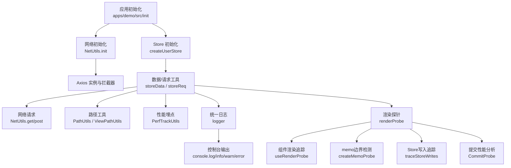
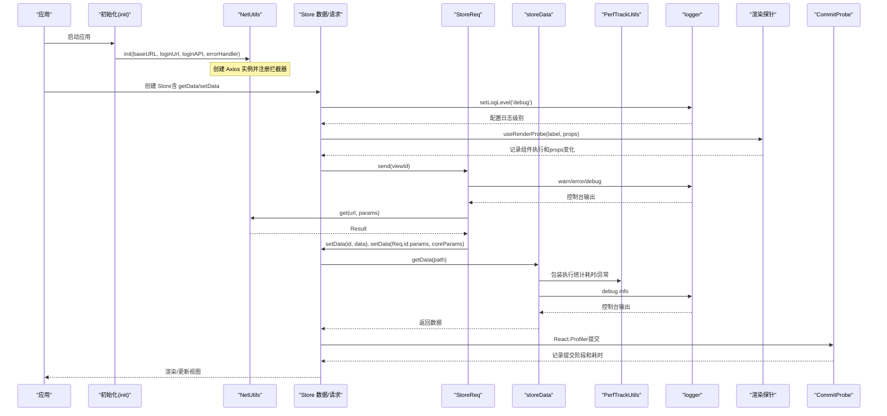
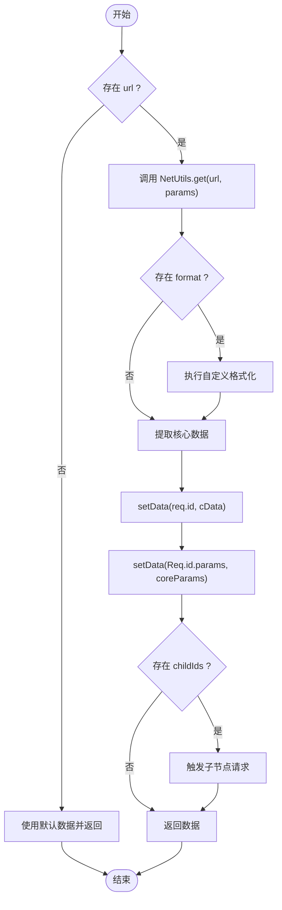
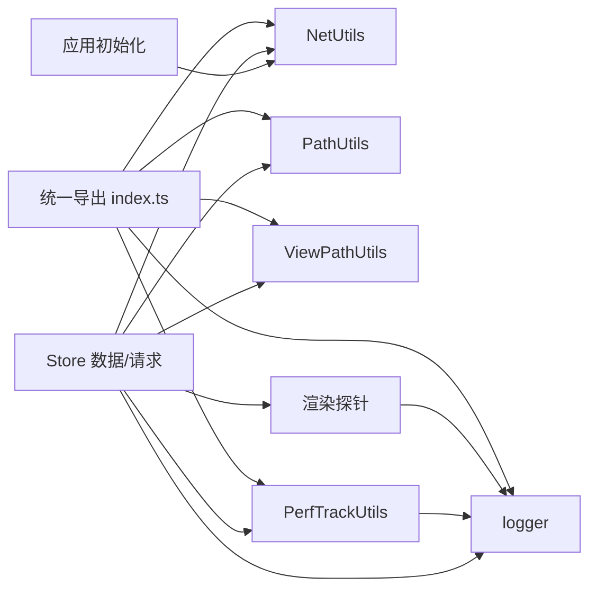

# 工具函数库

<cite>
**本文引用的文件**
- [apps/demo/src/init/net.ts](file://apps/demo/src/init/net.ts)
- [apps/demo/src/init/init.ts](file://apps/demo/src/init/init.ts)
- [packages/framework/src/index.ts](file://packages/framework/src/index.ts)
- [packages/framework/src/utils/netUtils/index.ts](file://packages/framework/src/utils/netUtils/index.ts)
- [packages/framework/src/utils/pathUtils/index.ts](file://packages/framework/src/utils/pathUtils/index.ts)
- [packages/framework/src/utils/viewPathUtils/index.ts](file://packages/framework/src/utils/viewPathUtils/index.ts)
- [packages/framework/src/utils/sysUtils/perfTrackerUtils.ts](file://packages/framework/src/utils/sysUtils/perfTrackerUtils.ts)
- [packages/framework/src/utils/sysUtils/logger.ts](file://packages/framework/src/utils/sysUtils/logger.ts)
- [packages/framework/src/stores/store/utils/storeData.ts](file://packages/framework/src/stores/store/utils/storeData.ts)
- [packages/framework/src/stores/store/utils/storeReq.ts](file://packages/framework/src/stores/store/utils/storeReq.ts)
- [packages/framework/src/utils/renderProbe.ts](file://packages/framework/src/utils/renderProbe.ts)
- [packages/framework/src/utils/renderProbeCommit.tsx](file://packages/framework/src/utils/renderProbeCommit.tsx)
</cite>

## 更新摘要
**所做更改**
- 新增渲染探针系统(renderProbe)的详细说明，包括组件级渲染追踪、React.memo边界检测、Store写入追踪和提交性能分析
- 在核心组件部分添加渲染探针相关组件描述
- 更新架构总览图以包含渲染探针系统集成
- 在详细组件分析章节增加renderProbe和CommitProbe API说明
- 在依赖关系分析中添加渲染探针相关依赖
- 更新性能考量章节，包含渲染性能优化建议

## 目录
1. [简介](#简介)
2. [项目结构](#项目结构)
3. [核心组件](#核心组件)
4. [架构总览](#架构总览)
5. [详细组件分析](#详细组件分析)
6. [依赖关系分析](#依赖关系分析)
7. [性能考量](#性能考量)
8. [故障排查指南](#故障排查指南)
9. [结论](#结论)
10. [附录](#附录)

## 简介
本工具函数库为前端应用提供网络请求、路径处理、性能监控、统一日志管理和渲染诊断等通用能力，并通过统一的导出入口对外暴露。其设计目标是：
- 统一网络层封装与错误处理，简化业务调用
- 提供稳定可靠的路径计算与视图路径工具
- 以无侵入方式对关键函数进行性能埋点与统计
- 通过 Store 数据/请求工具将网络结果与状态管理打通
- 提供集中式日志管理功能，支持可配置的日志级别和运行时调整
- **新增** 提供完整的渲染诊断工具链，帮助定位组件渲染问题、追踪数据变更来源和分析提交性能

## 项目结构
- 应用初始化入口位于 apps/demo/src/init，负责启动时配置网络模块
- 框架核心工具集中在 packages/framework/src/utils，包含 netUtils、pathUtils、viewPathUtils、sysUtils 等
- sysUtils 目录包含统一日志系统和性能监控工具
- utils 目录下新增 renderProbe.ts 和 renderProbeCommit.tsx，提供完整的渲染诊断能力
- 数据与请求工具位于 stores/store/utils，用于在 Store 中读写数据并触发请求
- 统一导出由 packages/framework/src/index.ts 完成，便于外部按需引入

```mermaid
graph TB
A["应用初始化<br/>apps/demo/src/init"] --> B["网络初始化<br/>NetUtils.init"]
B --> C["Axios 实例与拦截器"]
A --> D["Store 初始化<br/>createUserStore"]
D --> E["数据/请求工具<br/>storeData / storeReq"]
E --> F["网络请求<br/>NetUtils.get/post"]
E --> G["路径工具<br/>PathUtils / ViewPathUtils"]
E --> H["性能埋点<br/>PerfTrackUtils"]
E --> I["统一日志<br/>logger"]
I --> J["控制台输出<br/>console.log/info/warn/error"]
E --> K["渲染探针<br/>renderProbe"]
K --> L["组件渲染追踪<br/>useRenderProbe"]
K --> M["memo边界检测<br/>createMemoProbe"]
K --> N["Store写入追踪<br/>traceStoreWrites"]
K --> O["提交性能分析<br/>CommitProbe"]
```

**图表来源**
- [apps/demo/src/init/net.ts:5-17](file://apps/demo/src/init/net.ts#L5-L17)
- [packages/framework/src/utils/netUtils/index.ts:23-72](file://packages/framework/src/utils/netUtils/index.ts#L23-L72)
- [packages/framework/src/stores/store/utils/storeData.ts:57-68](file://packages/framework/src/stores/store/utils/storeData.ts#L57-L68)
- [packages/framework/src/stores/store/utils/storeReq.ts:142-180](file://packages/framework/src/stores/store/utils/storeReq.ts#L142-L180)
- [packages/framework/src/utils/sysUtils/logger.ts:44-65](file://packages/framework/src/utils/sysUtils/logger.ts#L44-L65)
- [packages/framework/src/utils/renderProbe.ts:61-76](file://packages/framework/src/utils/renderProbe.ts#L61-L76)
- [packages/framework/src/utils/renderProbeCommit.tsx:10-22](file://packages/framework/src/utils/renderProbeCommit.tsx#L10-L22)

**章节来源**
- [apps/demo/src/init/init.ts:1-8](file://apps/demo/src/init/init.ts#L1-L8)
- [apps/demo/src/init/net.ts:1-20](file://apps/demo/src/init/net.ts#L1-L20)
- [packages/framework/src/index.ts:1-78](file://packages/framework/src/index.ts#L1-L78)

## 核心组件
- 网络请求工具 NetUtils：基于 Axios，提供初始化、登录、鉴权、GET/POST 等方法，内置请求/响应拦截器与统一错误回调
- 路径工具 PathUtils：支持路径合并、相等性比较、字符串化，以及根据视图项计算路径
- 视图路径工具 ViewPathUtils：生成与焦点行相关的数据路径
- 性能监控 PerfTrackUtils：对任意函数进行包装，统计调用次数、耗时、异常等指标，并提供打印与清零能力
- 统一日志工具 logger：提供集中式日志管理功能，支持可配置的日志级别和运行时调整
- **渲染探针系统**：提供完整的组件渲染诊断能力，包括组件执行计数、props变化追踪、memo边界检测和提交性能分析
- Store 数据/请求工具：在 Store 上下文中读取/设置数据，并根据视图配置发起网络请求，自动处理子节点级联请求

**章节来源**
- [packages/framework/src/utils/netUtils/index.ts:1-117](file://packages/framework/src/utils/netUtils/index.ts#L1-L117)
- [packages/framework/src/utils/pathUtils/index.ts:1-85](file://packages/framework/src/utils/pathUtils/index.ts#L1-L85)
- [packages/framework/src/utils/viewPathUtils/index.ts:1-12](file://packages/framework/src/utils/viewPathUtils/index.ts#L1-L12)
- [packages/framework/src/utils/sysUtils/perfTrackerUtils.ts:1-176](file://packages/framework/src/utils/sysUtils/perfTrackerUtils.ts#L1-L176)
- [packages/framework/src/utils/sysUtils/logger.ts:1-68](file://packages/framework/src/utils/sysUtils/logger.ts#L1-L68)
- [packages/framework/src/utils/renderProbe.ts:1-137](file://packages/framework/src/utils/renderProbe.ts#L1-L137)
- [packages/framework/src/utils/renderProbeCommit.tsx:1-23](file://packages/framework/src/utils/renderProbeCommit.tsx#L1-L23)
- [packages/framework/src/stores/store/utils/storeData.ts:1-154](file://packages/framework/src/stores/store/utils/storeData.ts#L1-L154)
- [packages/framework/src/stores/store/utils/storeReq.ts:1-288](file://packages/framework/src/stores/store/utils/storeReq.ts#L1-L288)

## 架构总览
下图展示了从应用初始化到数据获取的完整链路，包括网络层、Store 数据层、性能埋点、统一日志系统和渲染诊断系统的协作关系。

```mermaid
sequenceDiagram
participant App as "应用"
participant Init as "初始化(init)"
participant Net as "NetUtils"
participant Store as "Store 数据/请求"
participant Req as "StoreReq"
participant Data as "storeData"
participant Perf as "PerfTrackUtils"
participant Log as "logger"
participant Probe as "渲染探针"
participant Commit as "CommitProbe"
App->>Init : 启动应用
Init->>Net : init(baseURL, loginUrl, loginAPI, errorHandler)
Note over Net : 创建 Axios 实例并注册拦截器
App->>Store : 创建 Store含 getData/setData
Store->>Log : setLogLevel('debug')
Log-->>Store : 配置日志级别
Store->>Probe : useRenderProbe(label, props)
Probe-->>Store : 记录组件执行和props变化
Store->>Req : send(viewId)
Req->>Log : warn/error/debug
Log-->>Req : 控制台输出
Req->>Net : get(url, params)
Net-->>Req : Result
Req->>Store : setData(id, data), setData(Req.id.params, coreParams)
Store->>Data : getData(path)
Data->>Perf : 包装执行统计耗时/异常
Data->>Log : debug info
Log-->>Data : 控制台输出
Data-->>Store : 返回数据
Store->>Commit : React.Profiler提交
Commit-->>Store : 记录提交阶段和耗时
Store-->>App : 渲染/更新视图
```

**图表来源**
- [apps/demo/src/init/init.ts:1-8](file://apps/demo/src/init/init.ts#L1-L8)
- [apps/demo/src/init/net.ts:5-17](file://apps/demo/src/init/net.ts#L5-L17)
- [packages/framework/src/utils/netUtils/index.ts:23-113](file://packages/framework/src/utils/netUtils/index.ts#L23-L113)
- [packages/framework/src/stores/store/utils/storeReq.ts:142-208](file://packages/framework/src/stores/store/utils/storeReq.ts#L142-L208)
- [packages/framework/src/stores/store/utils/storeData.ts:57-68](file://packages/framework/src/stores/store/utils/storeData.ts#L57-L68)
- [packages/framework/src/utils/sysUtils/perfTrackerUtils.ts:40-82](file://packages/framework/src/utils/sysUtils/perfTrackerUtils.ts#L40-L82)
- [packages/framework/src/utils/sysUtils/logger.ts:44-65](file://packages/framework/src/utils/sysUtils/logger.ts#L44-L65)
- [packages/framework/src/utils/renderProbe.ts:61-76](file://packages/framework/src/utils/renderProbe.ts#L61-L76)
- [packages/framework/src/utils/renderProbeCommit.tsx:10-22](file://packages/framework/src/utils/renderProbeCommit.tsx#L10-L22)

## 详细组件分析

### 网络请求工具 NetUtils
- 职责
  - 初始化基础 URL、登录页地址、登录接口、Token 过期时间
  - 创建 Axios 实例并注入请求/响应拦截器
  - 统一错误处理回调，支持 401 未授权跳转
  - 提供登录、令牌检查、GET/POST 便捷方法
- API 概览
  - init(baseURL, loginUrl, loginAPI, errorHandler, tokenExpireTime?)
    - 参数
      - baseURL: string
      - loginUrl: string
      - loginAPI: string
      - errorHandler(code, message, type): void
      - tokenExpireTime?: number（默认 7200000）
    - 返回: void
  - login(data): Promise<Result<T>>
  - checkToken(): void
  - handleUnauthorized(): void
  - get(url, params?): Promise<Result<any>>
  - post(url, data?): Promise<Result<any>>
- 使用示例（概念性）
  - 应用启动时调用 init，传入环境变量中的基础地址、登录页与登录接口，并实现错误提示逻辑
  - 业务页面调用 get/post 获取数据，或调用 login 完成登录后刷新 Token
- 注意事项
  - 请求头需携带 Authorization；若缺失会触发 401 错误回调
  - 跨域需服务端暴露必要的响应头以便读取 Token

**章节来源**
- [packages/framework/src/utils/netUtils/index.ts:1-117](file://packages/framework/src/utils/netUtils/index.ts#L1-L117)
- [apps/demo/src/init/net.ts:5-17](file://apps/demo/src/init/net.ts#L5-L17)

### 路径工具 PathUtils
- 职责
  - 根据视图项与基础路径计算最终路径
  - 合并多个路径片段
  - 判断路径是否相等
  - 将路径转换为字符串
- API 概览
  - itemPath(item, ...paths): DPath
  - mergePath(...paths): DPath
  - equal(path1, path2): boolean
  - toString(path): string
- 使用示例（概念性）
  - 在表单/表格字段中，通过 itemPath 快速得到字段对应的数据路径
  - 在复杂嵌套结构中，使用 mergePath 拼接多层路径

**章节来源**
- [packages/framework/src/utils/pathUtils/index.ts:1-85](file://packages/framework/src/utils/pathUtils/index.ts#L1-L85)

### 视图路径工具 ViewPathUtils
- 职责
  - 生成与"焦点行"相关的数据路径前缀，便于在 Store 中存取当前选中行的数据
- API 概览
  - active(viewId): string
- 使用示例（概念性）
  - 在表格选择行变化时，写入 Store 的对应路径，供其他组件读取

**章节来源**
- [packages/framework/src/utils/viewPathUtils/index.ts:1-12](file://packages/framework/src/utils/viewPathUtils/index.ts#L1-L12)

### 性能监控 PerfTrackUtils
- 职责
  - 对任意函数进行包装，记录调用次数、总耗时、最小/最大耗时、异常次数、上次耗时
  - 提供按 ID 或全部打印统计信息的能力
  - 支持按 ID 或全部清零统计
- API 概览
  - PerfTrackUtils<T>(id, func): T
    - 参数
      - id: string（唯一标识）
      - func: T（原始函数）
    - 返回: T（签名一致的包装函数）
  - printStats(id?: string): void
  - resetStats(id?: string): void
- 使用示例（概念性）
  - 对 getData、fetchData 等关键函数进行包装，运行后调用 printStats 查看性能摘要
- 设计要点
  - 使用 Map 存储各 ID 的统计数据，避免相互污染
  - 通过 try/finally 保证异常不影响原始行为，同时准确统计异常次数

**章节来源**
- [packages/framework/src/utils/sysUtils/perfTrackerUtils.ts:1-176](file://packages/framework/src/utils/sysUtils/perfTrackerUtils.ts#L1-L176)

### 统一日志工具 logger
- 职责
  - 提供集中式日志管理功能，所有调试输出统一收敛到此工具
  - 支持多种日志级别：debug、info、warn、error、silent
  - 通过环境变量 VITE_LOG_LEVEL 控制输出级别，支持运行时动态调整
  - 开发环境默认 debug 级别，生产环境默认 warn 级别
- API 概览
  - logger.debug(...args): void
  - logger.info(...args): void
  - logger.warn(...args): void
  - logger.error(...args): void
  - setLogLevel(level: LogLevel): void
  - getLogLevel(): LogLevel
  - LogLevel: 'debug' | 'info' | 'warn' | 'error' | 'silent'
- 使用示例（概念性）
  - 在应用启动时设置日志级别：`setLogLevel('debug')`
  - 在关键位置输出调试信息：`logger.debug('调试信息', { detail: data })`
  - 在生产环境输出警告和错误：`logger.warn('警告信息')`, `logger.error('错误信息', error)`
- 设计要点
  - 基于环境变量配置，构建期注入，无需第三方日志框架
  - 运行时可通过 setLogLevel 动态调整日志级别
  - 使用 console.log/console.info/console.warn/console.error 作为底层输出
  - 通过 LEVEL_WEIGHT 机制实现日志级别的优先级控制

**章节来源**
- [packages/framework/src/utils/sysUtils/logger.ts:1-68](file://packages/framework/src/utils/sysUtils/logger.ts#L1-L68)
- [packages/framework/src/index.ts:9-11](file://packages/framework/src/index.ts#L9-L11)

### 渲染探针系统
- 职责
  - 提供完整的组件渲染诊断能力，帮助定位渲染性能问题和数据变更来源
  - 支持组件函数执行计数和 props 变化追踪
  - 提供 React.memo 边界检测，识别哪些 props 导致 memo 失效
  - 追踪 Store 写入操作，定位数据变更的调用栈
  - 分析 React 提交阶段的性能表现
- API 概览
  - useRenderProbe(label: string, props?: object): void
    - 在组件函数体首行调用，记录组件执行次数和 props 变化
  - createMemoProbe
(name: string): (prev: P, next: P) => boolean
    - 包装 React.memo 的比较函数，记录 memo 边界被打破的原因
  - traceStoreWrites<T>(useStore: StoreApi<T>, label?: string): () => void
    - 临时包装 zustand store 的 setState，记录每次写入的调用栈
  - traceStoreNotify<T>(useStore: StoreApi<T>, label?: string): () => void
    - 通过 subscribe 观察 store 通知，记录变化切片
  - setProbeEnabled(value: boolean): void
    - 运行时开启/关闭探针功能
  - probeEnabled(): boolean
    - 查询探针是否启用
- 使用示例（概念性）
  - 在组件中使用：`useRenderProbe('MyComponent', props)`
  - 包装 memo：`React.memo(Component, createMemoProbe('MyComponent'))`
  - 追踪 store 写入：`const cleanup = traceStoreWrites(useStore, 'userStore')`
  - 分析提交性能：`<CommitProbe id="table1"><Table /></CommitProbe>`
- 设计要点
  - 通过 localStorage 控制开关，默认关闭避免影响生产性能
  - 使用 console.debug 输出，配合日志级别控制
  - 浅比较 props，与 React.memo 默认比较语义一致
  - 捕获调用栈信息，帮助定位数据来源

**章节来源**
- [packages/framework/src/utils/renderProbe.ts:1-137](file://packages/framework/src/utils/renderProbe.ts#L1-L137)
- [packages/framework/src/utils/renderProbeCommit.tsx:1-23](file://packages/framework/src/utils/renderProbeCommit.tsx#L1-L23)

### CommitProbe 组件
- 职责
  - 基于 React.Profiler 的提交性能分析组件
  - 统计组件提交的批次、阶段（mount/update）和实际耗时
  - 仅在探针开启时输出调试信息，不影响生产环境性能
- API 概览
  - CommitProbe({ id: string, children?: ReactNode }): ReactNode
    - 参数
      - id: string（组件唯一标识）
      - children: ReactNode（要分析的子树）
    - 返回: ReactNode（包裹后的子树）
- 使用示例（概念性）
  - 包裹需要分析的组件：`<CommitProbe id="table1"><Table /></CommitProbe>`
  - 在控制台查看提交性能：`[renderProbe] commit table1 update 本次提交耗时 15.2ms`
- 设计要点
  - 使用 Profiler 的 onRender 回调收集提交信息
  - 通过 probeEnabled() 检查探针开关，避免不必要的性能开销
  - 输出格式化的调试信息，便于性能分析

**章节来源**
- [packages/framework/src/utils/renderProbeCommit.tsx:1-23](file://packages/framework/src/utils/renderProbeCommit.tsx#L1-L23)

### Store 数据与请求工具
- 职责
  - 初始化数据与请求配置，构建父子依赖关系
  - 提供 getData/setData 在 Store 中读写数据
  - 根据视图配置发起网络请求，格式化并缓存数据，触发子节点请求
  - 集成统一日志系统，在所有关键操作中使用 logger 输出调试信息
- 关键流程
  - initDataAndReq：扫描声明的请求节点，建立 parentIds/childIds 依赖图
  - getData：解析真实路径，优先取数据源，否则回退到 Store 数据
  - setData：根据路径更新 Store 数据
  - StoreReq.send/getReqData：根据 viewId 找到请求配置，调用 NetUtils 获取数据，格式化后存入 Store，并递归触发子请求
- 流程图（getReqData 核心逻辑）

```mermaid
flowchart TD
Start(["开始"]) --> CheckUrl{"存在 url ?"}
CheckUrl --> |否| UseDefault["使用默认数据并返回"]
CheckUrl --> |是| DoGet["调用 NetUtils.get(url, params)"]
DoGet --> Format{"存在 format ?"}
Format --> |是| ApplyFormat["执行自定义格式化"]
Format --> |否| ExtractCore["提取核心数据"]
ApplyFormat --> ExtractCore
ExtractCore --> SetData["setData(req.id, cData)"]
SetData --> SetParams["setData(Req.id.params, coreParams)"]
SetParams --> ChildCheck{"存在 childIds ?"}
ChildCheck --> |是| TriggerChild["触发子节点请求"]
ChildCheck --> |否| ReturnData["返回数据"]
TriggerChild --> ReturnData
UseDefault --> End(["结束"])
ReturnData --> End
```

**图表来源**
- [packages/framework/src/stores/store/utils/storeReq.ts:142-180](file://packages/framework/src/stores/store/utils/storeReq.ts#L142-L180)
- [packages/framework/src/stores/store/utils/storeReq.ts:186-190](file://packages/framework/src/stores/store/utils/storeReq.ts#L186-L190)
- [packages/framework/src/stores/store/utils/storeData.ts:57-68](file://packages/framework/src/stores/store/utils/storeData.ts#L57-L68)

**章节来源**
- [packages/framework/src/stores/store/utils/storeData.ts:1-154](file://packages/framework/src/stores/store/utils/storeData.ts#L1-L154)
- [packages/framework/src/stores/store/utils/storeReq.ts:1-288](file://packages/framework/src/stores/store/utils/storeReq.ts#L1-L288)

## 依赖关系分析
- 应用初始化依赖 NetUtils 初始化网络层
- Store 数据/请求工具依赖 NetUtils 发送请求，依赖 PathUtils/ViewPathUtils 构造路径
- 统一日志系统被广泛集成：Store 数据/请求工具、性能监控工具都依赖 logger 输出调试信息
- 性能监控贯穿关键函数，通过 PerfTrackUtils 包装
- 渲染探针系统独立于主要业务流程，通过运行时开关控制，不影响生产环境性能
- 统一导出由 index.ts 聚合，便于外部引用

```mermaid
graph LR
Init["应用初始化"] --> Net["NetUtils"]
Store["Store 数据/请求"] --> Net
Store --> Path["PathUtils"]
Store --> VPath["ViewPathUtils"]
Store --> Perf["PerfTrackUtils"]
Store --> Log["logger"]
Perf --> Log
Store --> Probe["渲染探针"]
Probe --> Log
Index["统一导出 index.ts"] --> Net
Index --> Path
Index --> VPath
Index --> Perf
Index --> Log
```

**图表来源**
- [packages/framework/src/index.ts:1-78](file://packages/framework/src/index.ts#L1-L78)
- [packages/framework/src/utils/netUtils/index.ts:1-117](file://packages/framework/src/utils/netUtils/index.ts#L1-L117)
- [packages/framework/src/utils/pathUtils/index.ts:1-85](file://packages/framework/src/utils/pathUtils/index.ts#L1-L85)
- [packages/framework/src/utils/viewPathUtils/index.ts:1-12](file://packages/framework/src/utils/viewPathUtils/index.ts#L1-L12)
- [packages/framework/src/utils/sysUtils/perfTrackerUtils.ts:1-176](file://packages/framework/src/utils/sysUtils/perfTrackerUtils.ts#L1-L176)
- [packages/framework/src/utils/sysUtils/logger.ts:1-68](file://packages/framework/src/utils/sysUtils/logger.ts#L1-L68)
- [packages/framework/src/utils/renderProbe.ts:1-137](file://packages/framework/src/utils/renderProbe.ts#L1-L137)

**章节来源**
- [packages/framework/src/index.ts:1-78](file://packages/framework/src/index.ts#L1-L78)

## 性能考量
- 使用 PerfTrackUtils 对热点函数（如 getData、fetchData）进行包装，定期调用 printStats 观察平均耗时与异常率
- 合理拆分请求与数据处理逻辑，减少单次函数执行时长
- 利用 Store 的父子依赖机制批量触发子请求，避免重复请求
- 在网络层设置合理的超时时间与重试策略（可在业务侧扩展）
- 对大数据集进行分页或懒加载，降低内存占用
- 日志性能优化：通过日志级别控制减少不必要的日志输出，生产环境建议使用 warn 或 error 级别
- **渲染性能优化**：
  - 使用 useRenderProbe 定位频繁渲染的组件
  - 通过 createMemoProbe 优化 memo 边界，减少不必要的重渲染
  - 使用 CommitProbe 分析提交性能，识别慢提交
  - 通过 traceStoreWrites 优化数据更新策略，减少不必要的 store 写入
  - 合理使用 React.memo、useMemo、useCallback 等优化手段

## 故障排查指南
- 401 未授权
  - 现象：请求被拒绝，触发错误回调
  - 排查：确认已调用 NetUtils.init，且 Token 已正确设置；必要时调用 handleUnauthorized 跳转登录
- 请求失败
  - 现象：网络错误或响应异常
  - 排查：检查 baseURL、url、params；查看 errorHandler 输出的 code 与 message
- 数据未更新
  - 现象：界面未反映最新数据
  - 排查：确认 setData 路径是否正确；使用 PathUtils.toString 校验路径；检查 Store 中对应键是否存在
- 性能问题
  - 现象：页面卡顿或响应慢
  - 排查：使用 PerfTrackUtils 包装关键函数，调用 printStats 定位瓶颈；优化数据处理逻辑
- 日志相关问题
  - 现象：日志输出不符合预期
  - 排查：检查 VITE_LOG_LEVEL 环境变量配置；使用 getLogLevel() 查询当前日志级别；通过 setLogLevel() 动态调整
  - 现象：生产环境日志过多影响性能
  - 排查：确保生产环境设置合适的日志级别（建议 warn 或 error）；检查是否有调试代码未移除
- **渲染性能问题**
  - 现象：组件频繁重渲染或提交缓慢
  - 排查：使用 useRenderProbe 记录组件执行次数；通过 createMemoProbe 检查 memo 边界；使用 CommitProbe 分析提交性能
  - 现象：数据变更后组件过度更新
  - 排查：使用 traceStoreWrites 追踪数据变更来源；通过 traceStoreNotify 分析 store 通知成本；优化 selector 和数据结构设计

**章节来源**
- [packages/framework/src/utils/netUtils/index.ts:23-72](file://packages/framework/src/utils/netUtils/index.ts#L23-L72)
- [packages/framework/src/utils/sysUtils/perfTrackerUtils.ts:106-134](file://packages/framework/src/utils/sysUtils/perfTrackerUtils.ts#L106-L134)
- [packages/framework/src/utils/sysUtils/logger.ts:18-39](file://packages/framework/src/utils/sysUtils/logger.ts#L18-L39)
- [packages/framework/src/utils/renderProbe.ts:33-44](file://packages/framework/src/utils/renderProbe.ts#L33-L44)

## 结论
本工具函数库围绕网络、路径、性能、日志和渲染诊断五大维度提供了稳定、可复用的能力，并通过 Store 数据/请求工具将状态管理与网络请求无缝衔接。**新增的渲染探针系统**为整个框架提供了完整的组件渲染诊断能力，帮助开发者快速定位渲染性能问题、追踪数据变更来源和分析提交性能。借助统一的导出入口与清晰的职责划分，开发者可以快速集成并扩展功能。建议在项目中广泛采用 PerfTrackUtils 进行性能观测，结合 Store 的依赖机制优化请求策略，使用 logger 统一管理调试输出，并利用渲染探针系统深入分析组件渲染行为，以获得更好的用户体验和可维护性。

## 附录
- 常见用法速查
  - 初始化网络：在应用启动时调用 NetUtils.init，并实现错误提示
  - 发起请求：使用 NetUtils.get/post 获取数据
  - 读写数据：通过 Store 的 getData/setData 操作状态
  - 性能观测：用 PerfTrackUtils 包装关键函数，调用 printStats 查看统计
  - 日志管理：使用 setLogLevel 设置日志级别，通过 logger.debug/info/warn/error 输出日志
  - **渲染诊断**：使用 useRenderProbe 追踪组件执行，createMemoProbe 优化 memo 边界，CommitProbe 分析提交性能
- 最佳实践
  - 将网络错误集中处理，避免分散在各处
  - 使用 PathUtils 统一管理路径，减少硬编码
  - 对高频调用的函数进行性能埋点，持续优化
  - 使用统一日志系统：避免直接使用 console，通过 logger 统一管理日志输出
  - 合理配置日志级别：开发环境使用 debug，生产环境使用 warn 或 error
  - **合理使用渲染探针**：仅在开发和测试环境开启，生产环境默认关闭以避免性能影响
- 日志级别说明
  - debug：详细的调试信息，仅在开发环境使用
  - info：一般信息，可用于跟踪程序执行流程
  - warn：警告信息，表示潜在问题但不影响程序运行
  - error：错误信息，表示程序执行中出现的问题
  - silent：静默模式，不输出任何日志
- **渲染探针开关说明**
  - 默认关闭：通过 localStorage.setItem('renderProbe', '1') 或 setProbeEnabled(true) 开启
  - 持久化：开关状态保存在 localStorage，刷新后保持
  - 零开销：关闭时仅有一次布尔判断，可长期保留在组件中不摘除