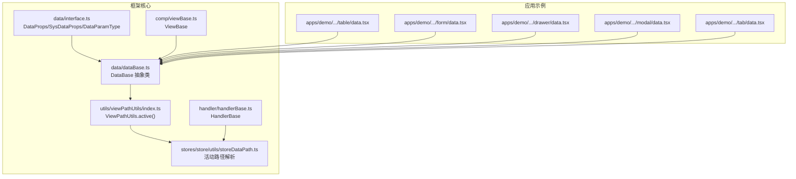
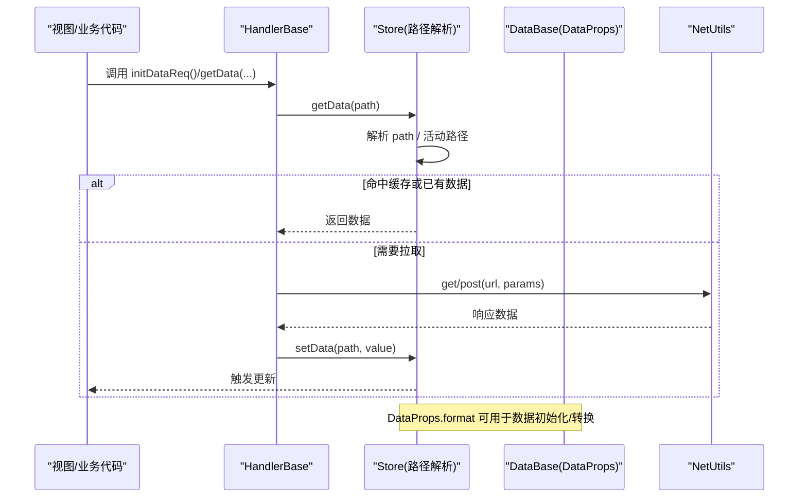
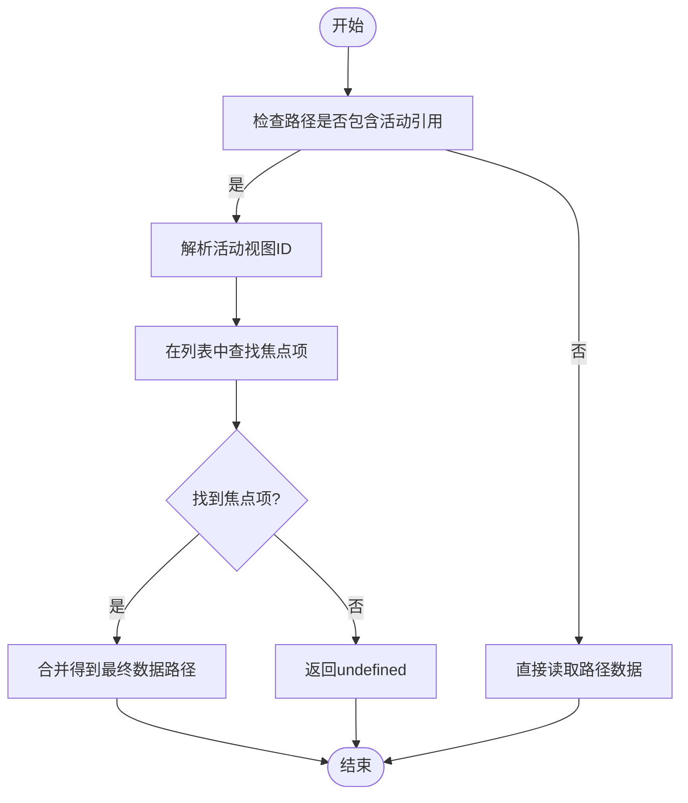
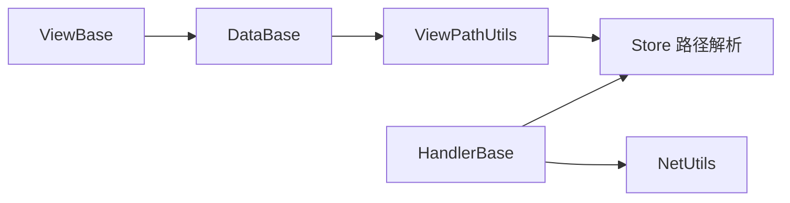

# 数据模型

<cite>
**本文引用的文件**
- [packages/framework/src/data/interface.ts](file://packages/framework/src/data/interface.ts)
- [packages/framework/src/data/dataBase.ts](file://packages/framework/src/data/dataBase.ts)
- [packages/framework/src/utils/viewPathUtils/index.ts](file://packages/framework/src/utils/viewPathUtils/index.ts)
- [packages/framework/src/stores/store/utils/storeDataPath.ts](file://packages/framework/src/stores/store/utils/storeDataPath.ts)
- [packages/framework/src/handler/handlerBase.ts](file://packages/framework/src/handler/handlerBase.ts)
- [packages/framework/src/comp/viewBase.ts](file://packages/framework/src/comp/viewBase.ts)
- [packages/framework/src/index.ts](file://packages/framework/src/index.ts)
- [apps/demo/src/pages/base/table/data.tsx](file://apps/demo/src/pages/base/table/data.tsx)
- [apps/demo/src/pages/base/form/data.tsx](file://apps/demo/src/pages/base/form/data.tsx)
- [apps/demo/src/pages/base/drawer/data.tsx](file://apps/demo/src/pages/base/drawer/data.tsx)
- [apps/demo/src/pages/base/modal/data.tsx](file://apps/demo/src/pages/base/modal/data.tsx)
- [apps/demo/src/pages/base/tab/data.tsx](file://apps/demo/src/pages/base/tab/data.tsx)
</cite>

## 目录
1. [简介](#简介)
2. [项目结构](#项目结构)
3. [核心组件](#核心组件)
4. [架构总览](#架构总览)
5. [详细组件分析](#详细组件分析)
6. [依赖关系分析](#依赖关系分析)
7. [性能考量](#性能考量)
8. [故障排查指南](#故障排查指南)
9. [结论](#结论)
10. [附录：API参考与示例](#附录api参考与示例)

## 简介
本模块提供统一的数据模型抽象，用于声明式地定义视图所需的数据来源、参数、默认值、主键以及数据转换逻辑。通过 DataBase 基类与 DataProps 接口，开发者可以以最小成本完成数据模型的扩展与复用；结合框架的 Store 与 Handler，实现“声明即运行”的数据加载、引用与更新机制。

## 项目结构
数据模型相关代码主要位于 packages/framework/src/data 目录，并在 apps/demo 中以具体页面为例展示如何使用。整体组织方式如下：
- 类型定义：packages/framework/src/data/interface.ts
- 基类实现：packages/framework/src/data/dataBase.ts
- 路径工具：packages/framework/src/utils/viewPathUtils/index.ts
- 运行时解析：packages/framework/src/stores/store/utils/storeDataPath.ts
- 使用示例：apps/demo/src/pages/base/* 下的 data.tsx

图表来源
- [packages/framework/src/data/interface.ts:1-38](file://packages/framework/src/data/interface.ts#L1-L38)
- [packages/framework/src/data/dataBase.ts:1-18](file://packages/framework/src/data/dataBase.ts#L1-L18)
- [packages/framework/src/utils/viewPathUtils/index.ts:1-11](file://packages/framework/src/utils/viewPathUtils/index.ts#L1-L11)
- [packages/framework/src/stores/store/utils/storeDataPath.ts:90-116](file://packages/framework/src/stores/store/utils/storeDataPath.ts#L90-L116)
- [packages/framework/src/handler/handlerBase.ts:1-92](file://packages/framework/src/handler/handlerBase.ts#L1-L92)
- [packages/framework/src/comp/viewBase.ts:1-17](file://packages/framework/src/comp/viewBase.ts#L1-L17)
- [apps/demo/src/pages/base/table/data.tsx:1-21](file://apps/demo/src/pages/base/table/data.tsx#L1-L21)
- [apps/demo/src/pages/base/form/data.tsx:1-10](file://apps/demo/src/pages/base/form/data.tsx#L1-L10)
- [apps/demo/src/pages/base/drawer/data.tsx:1-10](file://apps/demo/src/pages/base/drawer/data.tsx#L1-L10)
- [apps/demo/src/pages/base/modal/data.tsx:1-10](file://apps/demo/src/pages/base/modal/data.tsx#L1-L10)
- [apps/demo/src/pages/base/tab/data.tsx:1-16](file://apps/demo/src/pages/base/tab/data.tsx#L1-L16)

章节来源
- [packages/framework/src/data/interface.ts:1-38](file://packages/framework/src/data/interface.ts#L1-L38)
- [packages/framework/src/data/dataBase.ts:1-18](file://packages/framework/src/data/dataBase.ts#L1-L18)
- [packages/framework/src/utils/viewPathUtils/index.ts:1-11](file://packages/framework/src/utils/viewPathUtils/index.ts#L1-L11)
- [packages/framework/src/stores/store/utils/storeDataPath.ts:90-116](file://packages/framework/src/stores/store/utils/storeDataPath.ts#L90-L116)
- [packages/framework/src/handler/handlerBase.ts:1-92](file://packages/framework/src/handler/handlerBase.ts#L1-L92)
- [packages/framework/src/comp/viewBase.ts:1-17](file://packages/framework/src/comp/viewBase.ts#L1-L17)
- [apps/demo/src/pages/base/table/data.tsx:1-21](file://apps/demo/src/pages/base/table/data.tsx#L1-L21)
- [apps/demo/src/pages/base/form/data.tsx:1-10](file://apps/demo/src/pages/base/form/data.tsx#L1-L10)
- [apps/demo/src/pages/base/drawer/data.tsx:1-10](file://apps/demo/src/pages/base/drawer/data.tsx#L1-L10)
- [apps/demo/src/pages/base/modal/data.tsx:1-10](file://apps/demo/src/pages/base/modal/data.tsx#L1-L10)
- [apps/demo/src/pages/base/tab/data.tsx:1-16](file://apps/demo/src/pages/base/tab/data.tsx#L1-L16)

## 核心组件
- DataProps：数据模型的核心类型，描述数据来源、请求参数、默认值、主键与格式化函数。
- SysDataProps：系统内部使用的增强类型，包含父子引用与搜索条件等元信息。
- DataParamType：描述数据请求参数的字段、值或数据引用路径。
- DataBase：抽象基类，提供静态方法 active(viewId) 生成“活动行”路径引用，并允许任意属性名映射为 DataProps。
- ViewPathUtils：提供构造活动路径的工具方法。
- Store 路径解析：在运行时将活动路径解析为实际的数据路径（如列表中的焦点项）。

章节来源
- [packages/framework/src/data/interface.ts:1-38](file://packages/framework/src/data/interface.ts#L1-L38)
- [packages/framework/src/data/dataBase.ts:1-18](file://packages/framework/src/data/dataBase.ts#L1-L18)
- [packages/framework/src/utils/viewPathUtils/index.ts:1-11](file://packages/framework/src/utils/viewPathUtils/index.ts#L1-L11)
- [packages/framework/src/stores/store/utils/storeDataPath.ts:90-116](file://packages/framework/src/stores/store/utils/storeDataPath.ts#L90-L116)

## 架构总览
数据模型在框架中处于“声明层”，与“运行时层”（Store）和“操作层”（Handler）协作：
- 声明层：通过继承 DataBase 定义数据模型，声明 id、url、params、defaultData、keyAttr、format 等。
- 运行时层：Store 根据 DataProps 的路径与活动路径解析出真实数据位置，支持引用与缓存。
- 操作层：Handler 暴露 getData/getAllData/setData 等方法，驱动数据读写与网络请求。

图表来源
- [packages/framework/src/handler/handlerBase.ts:1-92](file://packages/framework/src/handler/handlerBase.ts#L1-L92)
- [packages/framework/src/stores/store/utils/storeDataPath.ts:90-116](file://packages/framework/src/stores/store/utils/storeDataPath.ts#L90-L116)
- [packages/framework/src/data/interface.ts:1-38](file://packages/framework/src/data/interface.ts#L1-L38)

## 详细组件分析

### DataBase 基类与设计理念
- 设计理念
  - 以“声明式”为主：通过 DataProps 声明数据来源与行为，减少样板代码。
  - 以“引用”为核心：通过 path 与活动路径，实现跨组件数据共享与联动。
  - 以“可扩展”为目标：任意属性名均可映射为 DataProps，便于组合多个数据源。
- 关键能力
  - 静态方法 active(viewId)：生成活动行路径引用，配合 Store 解析到具体数据项。
  - 索引签名 [key: string]: DataProps：允许自由扩展数据模型字段。
- 典型用法
  - 在页面级 Data 类中声明 mainTable/mainForm 等数据源，并通过 keyAttr 指定主键。
  - 使用 DataBase.active(this.mainTable.id) 作为子表单的数据来源路径。

章节来源
- [packages/framework/src/data/dataBase.ts:1-18](file://packages/framework/src/data/dataBase.ts#L1-L18)
- [packages/framework/src/utils/viewPathUtils/index.ts:1-11](file://packages/framework/src/utils/viewPathUtils/index.ts#L1-L11)
- [apps/demo/src/pages/base/table/data.tsx:1-21](file://apps/demo/src/pages/base/table/data.tsx#L1-L21)

### DataProps 接口详解
- 字段说明
  - id：数据源唯一标识，用于注册与查找。
  - path：数据引用路径，若已存在则跳过请求，优先使用本地数据。
  - url：数据请求地址。
  - params：请求参数数组，支持固定值或数据引用路径。
  - defaultData：默认数据，用于无后端场景或占位。
  - keyAttr：主键，支持字符串或字符串数组，未设置时由系统分配唯一ID。
  - format：数据初始化/转换函数，接收原始数据并返回标准化后的数据。
- 扩展机制
  - 通过继承 DataBase 并添加任意 DataProps 字段，即可扩展新的数据源。
  - 借助 SysDataProps 可在系统内部维护父子引用与搜索条件等元信息。

章节来源
- [packages/framework/src/data/interface.ts:1-38](file://packages/framework/src/data/interface.ts#L1-L38)

### 活动路径与数据解析流程
- 活动路径概念
  - 通过 PathKey.Active + viewId 的形式表示“某视图的当前选中项”。
  - DataBase.active(viewId) 是便捷构造器。
- 解析过程
  - Store 在读取数据时，遇到活动路径会递归解析到具体的数据项路径。
  - 若找到对应项，则返回该路径；否则返回 undefined。
- 流程图

图表来源
- [packages/framework/src/utils/viewPathUtils/index.ts:1-11](file://packages/framework/src/utils/viewPathUtils/index.ts#L1-L11)
- [packages/framework/src/stores/store/utils/storeDataPath.ts:90-116](file://packages/framework/src/stores/store/utils/storeDataPath.ts#L90-L116)

### 数据模型示例（来自 demo）
- 表格数据源：声明 mainTable，设置 id、url、keyAttr。
- 表单数据源：声明 mainForm，设置 id、url。
- 联动数据源：mainFormData 通过 path 引用 mainTable 的活动行，实现“点击表格行打开表单并预填数据”。

章节来源
- [apps/demo/src/pages/base/table/data.tsx:1-21](file://apps/demo/src/pages/base/table/data.tsx#L1-L21)
- [apps/demo/src/pages/base/form/data.tsx:1-10](file://apps/demo/src/pages/base/form/data.tsx#L1-L10)
- [apps/demo/src/pages/base/drawer/data.tsx:1-10](file://apps/demo/src/pages/base/drawer/data.tsx#L1-L10)
- [apps/demo/src/pages/base/modal/data.tsx:1-10](file://apps/demo/src/pages/base/modal/data.tsx#L1-L10)
- [apps/demo/src/pages/base/tab/data.tsx:1-16](file://apps/demo/src/pages/base/tab/data.tsx#L1-L16)

### 与 Handler 和 ViewBase 的关系
- ViewBase 持有 handler 与 data，确保视图能访问数据模型与操作入口。
- HandlerBase 封装了数据获取、设置与网络请求，屏蔽底层 Store 细节。
- 三者共同构成“视图-数据-操作”的闭环。

章节来源
- [packages/framework/src/comp/viewBase.ts:1-17](file://packages/framework/src/comp/viewBase.ts#L1-L17)
- [packages/framework/src/handler/handlerBase.ts:1-92](file://packages/framework/src/handler/handlerBase.ts#L1-L92)

## 依赖关系分析
- 模块内依赖
  - DataBase 依赖 ViewPathUtils 生成活动路径。
  - Store 路径解析依赖 PathKey、PathSplit 等常量进行活动路径识别与合并。
  - HandlerBase 依赖 NetUtils 执行网络请求，并通过 Store 读写数据。
- 外部依赖
  - lodash 用于对象/数组操作。
  - 框架内部 store 接口定义（DPath、IStoreBase 等）。

图表来源
- [packages/framework/src/data/dataBase.ts:1-18](file://packages/framework/src/data/dataBase.ts#L1-L18)
- [packages/framework/src/utils/viewPathUtils/index.ts:1-11](file://packages/framework/src/utils/viewPathUtils/index.ts#L1-L11)
- [packages/framework/src/stores/store/utils/storeDataPath.ts:90-116](file://packages/framework/src/stores/store/utils/storeDataPath.ts#L90-L116)
- [packages/framework/src/handler/handlerBase.ts:1-92](file://packages/framework/src/handler/handlerBase.ts#L1-L92)
- [packages/framework/src/comp/viewBase.ts:1-17](file://packages/framework/src/comp/viewBase.ts#L1-L17)

章节来源
- [packages/framework/src/data/dataBase.ts:1-18](file://packages/framework/src/data/dataBase.ts#L1-L18)
- [packages/framework/src/utils/viewPathUtils/index.ts:1-11](file://packages/framework/src/utils/viewPathUtils/index.ts#L1-L11)
- [packages/framework/src/stores/store/utils/storeDataPath.ts:90-116](file://packages/framework/src/stores/store/utils/storeDataPath.ts#L90-L116)
- [packages/framework/src/handler/handlerBase.ts:1-92](file://packages/framework/src/handler/handlerBase.ts#L1-L92)
- [packages/framework/src/comp/viewBase.ts:1-17](file://packages/framework/src/comp/viewBase.ts#L1-L17)

## 性能考量
- 避免重复请求：利用 path 引用，当本地已有数据时跳过网络请求。
- 合理设置 keyAttr：明确主键可提升列表渲染与状态同步效率。
- 控制活动路径深度：Store 对活动路径解析设置了最大深度限制，防止循环引用导致性能问题。
- 使用 format 做轻量转换：在数据进入 Store 前进行必要清洗，减少后续计算开销。

[本节为通用指导，不直接分析具体文件]

## 故障排查指南
- 常见问题
  - 活动路径无法解析：检查是否正确使用了 DataBase.active(viewId)，并确保目标视图已加载且存在焦点项。
  - 数据未更新：确认 path 指向正确，且 Store 中已有数据；必要时检查 keyAttr 是否与后端一致。
  - 请求参数错误：核对 params 的 field/value/path 配置，避免冲突。
- 定位建议
  - 通过 Handler.getData/setData 观察数据变化。
  - 检查 Store 中 view/handler 的状态，确认视图与处理器已正确注册。

章节来源
- [packages/framework/src/handler/handlerBase.ts:1-92](file://packages/framework/src/handler/handlerBase.ts#L1-L92)
- [packages/framework/src/stores/store/utils/storeDataPath.ts:90-116](file://packages/framework/src/stores/store/utils/storeDataPath.ts#L90-L116)

## 结论
数据模型模块通过 DataProps 与 DataBase 提供了简洁而强大的声明式数据管理能力。结合活动路径与 Store 解析机制，实现了跨组件的数据共享与联动；Handler 则屏蔽了底层细节，使业务代码专注于领域逻辑。遵循本文档的最佳实践，可以在保证可维护性的同时快速构建复杂的数据交互场景。

[本节为总结性内容，不直接分析具体文件]

## 附录：API参考与示例

### API 参考
- DataProps
  - id: string
  - path?: DPath
  - url?: string
  - params?: DataParamType[]
  - defaultData?: any
  - keyAttr?: string | string[]
  - format?(data: any): any
- SysDataProps（系统内部）
  - parentIds: string[]
  - childIds: string[]
  - criteria: Record<string, any>
- DataParamType
  - field: string
  - value?: any
  - path?: DPath
- DataBase
  - static active(viewId: string): string
- HandlerBase（常用）
  - init(getStore)
  - initDataReq()
  - getData(path?)
  - getAllData()
  - setData(path, value)
  - setViewParam(viewId, key, value)
  - setViewParams(viewId, values, init?)
  - get(url, params?)
  - post(url, params?)
  - getView(viewId)
  - getModalHandler(viewId)
  - getDrawerHandler(viewId)

章节来源
- [packages/framework/src/data/interface.ts:1-38](file://packages/framework/src/data/interface.ts#L1-L38)
- [packages/framework/src/data/dataBase.ts:1-18](file://packages/framework/src/data/dataBase.ts#L1-L18)
- [packages/framework/src/handler/handlerBase.ts:1-92](file://packages/framework/src/handler/handlerBase.ts#L1-L92)
- [packages/framework/src/index.ts:1-69](file://packages/framework/src/index.ts#L1-L69)

### 数据模型定义与验证规则
- 定义数据模型
  - 继承 DataBase，声明多个 DataProps 字段（如 mainTable/mainForm）。
  - 使用 keyAttr 指定主键，便于列表与表单联动。
- 验证规则
  - 建议在 format 中进行数据校验与规范化，确保进入 Store 的数据符合预期。
  - 对于必填字段，可在 UI 层结合表单控件进行二次校验。

章节来源
- [packages/framework/src/data/interface.ts:1-38](file://packages/framework/src/data/interface.ts#L1-L38)
- [apps/demo/src/pages/base/table/data.tsx:1-21](file://apps/demo/src/pages/base/table/data.tsx#L1-L21)

### 数据转换逻辑
- 使用 format 对原始数据进行清洗、映射与格式化。
- 在复杂场景中，可将转换逻辑抽离为独立函数，保持 DataProps 简洁。

章节来源
- [packages/framework/src/data/interface.ts:1-38](file://packages/framework/src/data/interface.ts#L1-L38)

### 版本管理与迁移策略
- 版本管理
  - 通过 DataProps.id 稳定标识数据源，便于在不同版本间进行兼容。
  - 在 format 中处理历史数据结构差异，逐步过渡到新格式。
- 迁移策略
  - 新增字段时保持向后兼容，旧客户端仍可正常渲染。
  - 对关键字段变更，采用渐进式迁移：先兼容旧结构，再在合适时机废弃旧字段。

[本节为通用指导，不直接分析具体文件]