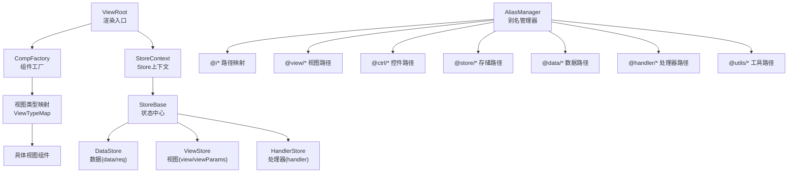
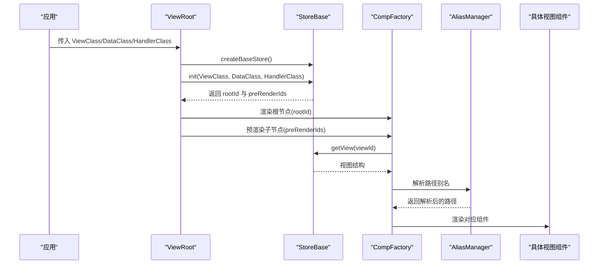
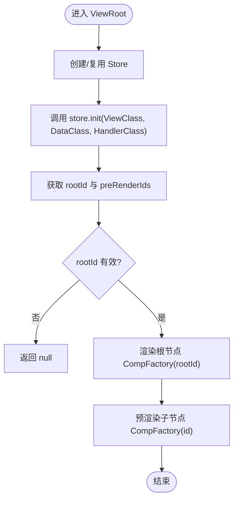
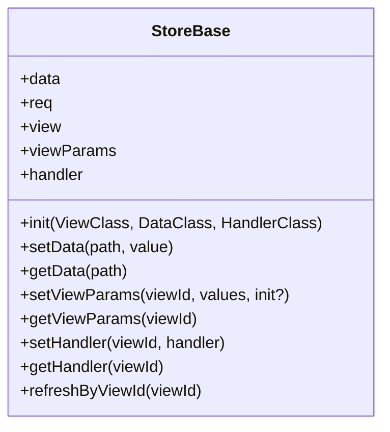
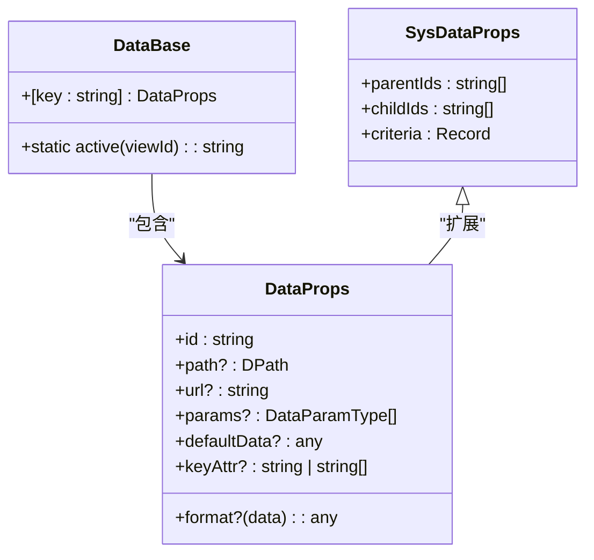
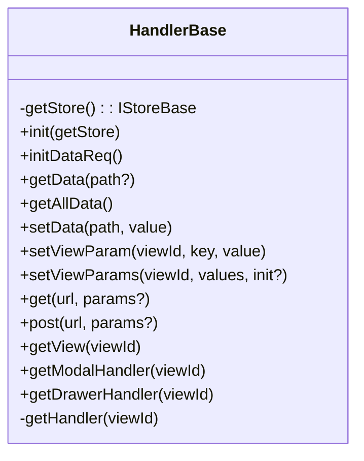
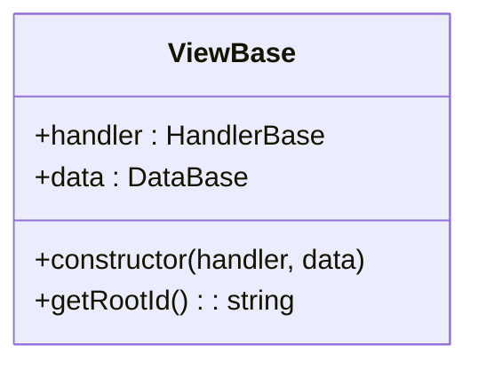
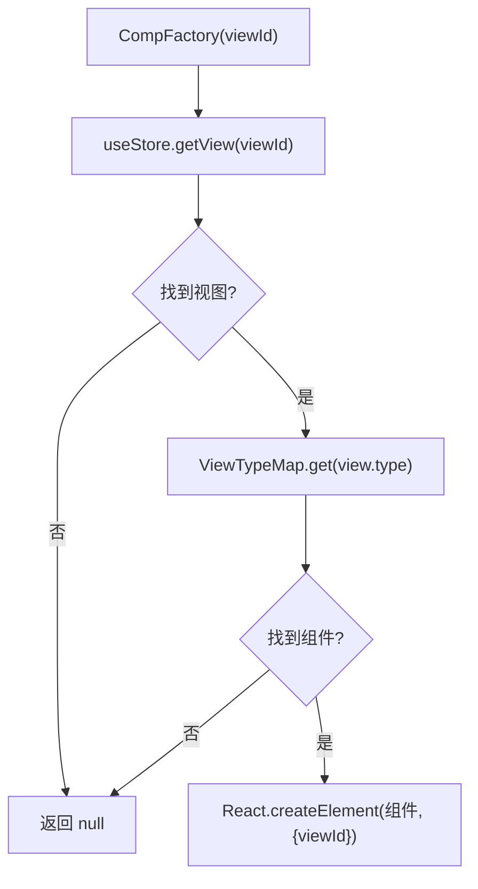
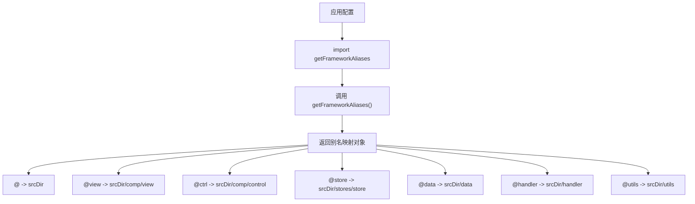
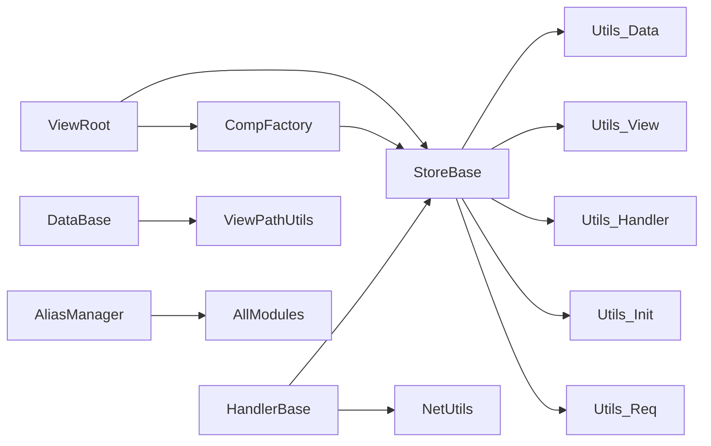

# 框架核心

<cite>
**本文引用的文件**
- [ViewRoot.tsx](file://packages/framework/src/ViewRoot.tsx)
- [index.ts](file://packages/framework/src/index.ts)
- [interface.ts](file://packages/framework/src/interface.ts)
- [compFactory.ts](file://packages/framework/src/comp/compFactory.ts)
- [viewBase.ts](file://packages/framework/src/comp/viewBase.ts)
- [handlerBase.ts](file://packages/framework/src/handler/handlerBase.ts)
- [dataBase.ts](file://packages/framework/src/data/dataBase.ts)
- [storeBase.ts](file://packages/framework/src/stores/store/storeBase.ts)
- [alias.ts](file://packages/framework/alias.ts)
</cite>

## 更新摘要
**所做更改**
- 新增集中式别名管理功能章节，详细说明 getFrameworkAliases() 函数及其标准化路径映射
- 更新项目结构部分，包含 alias.ts 文件的职责说明
- 在依赖关系分析中增加别名管理模块的依赖关系
- 在集成指南中添加别名配置的最佳实践

## 目录
1. [简介](#简介)
2. [项目结构](#项目结构)
3. [核心组件](#核心组件)
4. [架构总览](#架构总览)
5. [详细组件分析](#详细组件分析)
6. [依赖关系分析](#依赖关系分析)
7. [性能考虑](#性能考虑)
8. [故障排查指南](#故障排查指南)
9. [结论](#结论)
10. [附录：API参考与使用示例](#附录api参考与使用示例)

## 简介
本框架围绕"视图-状态-数据-处理器"的分层设计，提供一套可复用的前端核心能力。核心包括：
- ViewRoot 视图渲染引擎：负责创建 Store、初始化视图树、挂载根节点并预渲染子节点。
- StoreBase 状态管理基类：基于 Zustand + immer，统一管理 data、req、view、viewParams、handler 等全局状态，并提供便捷 API。
- DataBase 数据模型基类：声明式的数据描述（路径、URL、参数、默认值、格式化等），并封装常用工具方法。
- HandlerBase 业务逻辑基类：封装数据读写、视图参数设置、网络请求、弹窗/抽屉等视图控制器获取。
- **集中式别名管理**：通过统一的 getFrameworkAliases() 函数提供标准化的路径映射配置，确保框架内部与各应用间的路径解析一致性。

该框架通过工厂模式注册视图类型与处理器，结合上下文注入 Store，实现低耦合的组件化开发。

## 项目结构
框架核心位于 packages/framework/src，关键目录与职责如下：
- comp：组件工厂与视图基类，负责按类型渲染具体组件。
- handler：处理器基类与视图处理器基类，承载业务逻辑与视图控制。
- data：数据模型基类与数据结构定义，描述数据源与请求配置。
- stores：状态管理实现，基于 Zustand 的 Store 工厂与工具函数。
- utils：工具函数集合，提供网络请求、路径处理等通用能力。
- 顶层：ViewRoot 入口组件、对外导出 index.ts、通用接口 interface.ts。
- **别名配置**：alias.ts 提供集中式的框架路径别名管理，供各应用统一引用。

**图表来源**
- [ViewRoot.tsx:10-48](file://packages/framework/src/ViewRoot.tsx#L10-L48)
- [compFactory.ts:33-59](file://packages/framework/src/comp/compFactory.ts#L33-L59)
- [storeBase.ts:18-57](file://packages/framework/src/stores/store/storeBase.ts#L18-L57)
- [alias.ts:11-21](file://packages/framework/alias.ts#L11-L21)

**章节来源**
- [ViewRoot.tsx:10-48](file://packages/framework/src/ViewRoot.tsx#L10-L48)
- [compFactory.ts:33-59](file://packages/framework/src/comp/compFactory.ts#L33-L59)
- [storeBase.ts:18-57](file://packages/framework/src/stores/store/storeBase.ts#L18-L57)
- [alias.ts:11-21](file://packages/framework/alias.ts#L11-L21)

## 核心组件
- ViewRoot：应用级根组件，创建并缓存 Store，初始化视图树，渲染根节点与预渲染子节点。
- StoreBase：统一的状态容器，暴露 init、setData/getData、setView/getView、setHandler/getHandler、refreshByViewId 等方法。
- DataBase：数据模型基类，提供静态方法与索引签名，用于声明数据项的路径、URL、参数、默认值、格式化等。
- HandlerBase：业务逻辑基类，提供 getData/setData、setViewParam(s)、getModalHandler/getDrawerHandler、get/post 等能力。
- ViewBase：视图基类，持有 handler 与 data 引用，要求实现 getRootId。
- **AliasManager**：集中式别名管理器，提供 getFrameworkAliases() 函数，标准化 @、@view、@ctrl、@store、@data、@handler、@utils 等路径映射。

**章节来源**
- [ViewRoot.tsx:10-48](file://packages/framework/src/ViewRoot.tsx#L10-L48)
- [storeBase.ts:18-57](file://packages/framework/src/stores/store/storeBase.ts#L18-L57)
- [dataBase.ts:4-17](file://packages/framework/src/data/dataBase.ts#L4-L17)
- [handlerBase.ts:10-90](file://packages/framework/src/handler/handlerBase.ts#L10-L90)
- [viewBase.ts:4-16](file://packages/framework/src/comp/viewBase.ts#L4-L16)
- [alias.ts:11-21](file://packages/framework/alias.ts#L11-L21)

## 架构总览
整体采用"根组件驱动 + 工厂渲染 + 集中式状态"的模式：
- ViewRoot 在首次渲染时创建 Store，调用 store.init(ViewClass, DataClass, HandlerClass) 完成视图树初始化，返回根 viewId 与预渲染子节点列表。
- CompFactory 根据当前 viewId 从 Store 中读取视图结构，查找对应组件并渲染。
- StoreBase 维护 data、req、view、viewParams、handler 五大块状态，并通过 utils 模块提供读写与请求刷新能力。
- HandlerBase 作为业务层桥接，屏蔽 Store 细节，向上提供简洁 API；同时支持动态获取 Modal/Drawer 等视图处理器。
- **AliasManager** 为整个框架提供统一的路径别名配置，确保各应用与框架源码间的模块导入一致性。

**图表来源**
- [ViewRoot.tsx:20-43](file://packages/framework/src/ViewRoot.tsx#L20-L43)
- [compFactory.ts:42-56](file://packages/framework/src/comp/compFactory.ts#L42-L56)
- [storeBase.ts:18-57](file://packages/framework/src/stores/store/storeBase.ts#L18-L57)
- [alias.ts:11-21](file://packages/framework/alias.ts#L11-L21)

## 详细组件分析

### ViewRoot 视图渲染引擎
- 职责：创建并缓存 Store；初始化视图树；渲染根节点与预渲染子节点；将 Store 注入上下文。
- 生命周期：
  - 首次渲染：创建 Store 并调用 init，得到 rootId 与 preRenderIds。
  - 后续渲染：复用已创建的 Store，避免重复初始化。
- 关键点：
  - 使用 useRef 确保 StrictMode 下不重复创建 Store。
  - 若未解析到 rootId 或 Store 为空，返回 null。
  - 通过 StoreContext 向子树注入 useStore。

**图表来源**
- [ViewRoot.tsx:16-43](file://packages/framework/src/ViewRoot.tsx#L16-L43)

**章节来源**
- [ViewRoot.tsx:10-48](file://packages/framework/src/ViewRoot.tsx#L10-L48)

### StoreBase 状态管理基类
- 职责：集中管理 data、req、view、viewParams、handler；提供初始化、读写、刷新等 API。
- 核心字段：
  - data：业务数据集合。
  - req：数据请求元信息（含父/子引用、搜索条件等）。
  - view：视图实例与结构。
  - viewParams：视图参数。
  - handler：视图处理器实例。
- 关键方法：
  - init(ViewClass, DataClass, HandlerClass)：初始化视图树，返回 [view, preRenderIds]。
  - setData/getData/setDataByFn/setDataDebounce：数据写入与读取。
  - setView/getView/setViewParams/getViewParams：视图结构与参数管理。
  - setHandler/getHandler：视图处理器管理。
  - refreshByViewId：根据视图ID重新发送请求。
- 设计要点：
  - 基于 Zustand + immer，保证不可变更新与细粒度订阅。
  - 通过 utils 模块解耦数据、视图、请求等逻辑。

**图表来源**
- [storeBase.ts:18-57](file://packages/framework/src/stores/store/storeBase.ts#L18-L57)

**章节来源**
- [storeBase.ts:18-57](file://packages/framework/src/stores/store/storeBase.ts#L18-L57)

### DataBase 数据模型基类
- 职责：声明数据项的结构与行为，提供静态工具方法（如 active 路径生成）。
- 主要属性（通过索引签名扩展）：
  - id：唯一标识。
  - path：数据路径引用。
  - url：请求地址。
  - params：请求参数数组（支持固定值或数据引用）。
  - defaultData：默认数据。
  - keyAttr：主键字段或组合键。
  - format：数据格式化函数。
- 系统增强（SysDataProps）：
  - parentIds/childIds：父子引用关系。
  - criteria：搜索条件。

**图表来源**
- [dataBase.ts:4-17](file://packages/framework/src/data/dataBase.ts#L4-L17)

**章节来源**
- [dataBase.ts:4-17](file://packages/framework/src/data/dataBase.ts#L4-L17)

### HandlerBase 业务逻辑基类
- 职责：为业务代码提供统一的 API，屏蔽 Store 细节；提供网络请求与视图控制器访问。
- 关键能力：
  - initDataReq：触发所有数据请求的钩子。
  - getData/getAllData/setData：数据读写。
  - setViewParam/setViewParams：设置视图参数。
  - get/post：网络请求封装。
  - getModalHandler/getDrawerHandler：获取弹窗/侧边栏处理器。
  - getHandler(viewId)：懒加载并缓存视图处理器。
- 错误处理：
  - 当视图或处理器不存在时抛出明确错误信息，便于定位问题。

**图表来源**
- [handlerBase.ts:10-90](file://packages/framework/src/handler/handlerBase.ts#L10-L90)

**章节来源**
- [handlerBase.ts:10-90](file://packages/framework/src/handler/handlerBase.ts#L10-L90)

### ViewBase 视图基类
- 职责：为视图类提供 handler 与 data 的强类型引用，并要求实现 getRootId 以返回根节点 ID。
- 生命周期：由 Store 初始化阶段构造，并在渲染阶段通过 CompFactory 使用。

**图表来源**
- [viewBase.ts:4-16](file://packages/framework/src/comp/viewBase.ts#L4-L16)

**章节来源**
- [viewBase.ts:4-16](file://packages/framework/src/comp/viewBase.ts#L4-L16)

### 组件工厂与类型映射
- CompFactory：根据 viewId 从 Store 中读取视图结构，查找对应组件并渲染。
- 类型映射：通过 ViewTypeMap 将视图类型与组件/处理器关联，支持 LayoutModal、LayoutDrawer 等布局型视图。

**图表来源**
- [compFactory.ts:42-56](file://packages/framework/src/comp/compFactory.ts#L42-L56)
- [compFactory.ts:33-35](file://packages/framework/src/comp/compFactory.ts#L33-L35)

**章节来源**
- [compFactory.ts:33-59](file://packages/framework/src/comp/compFactory.ts#L33-L59)

### 集中式别名管理
- 职责：提供统一的框架路径别名配置，确保各应用与框架源码间的模块导入一致性。
- 核心功能：
  - getFrameworkAliases()：返回标准化的路径映射对象。
  - 支持的别名：@、@view、@ctrl、@store、@data、@handler、@utils。
  - 自动计算 srcDir 路径，确保在不同环境下都能正确解析。
- 使用方式：
  - 在应用的 vite.config.ts 中引入并使用 getFrameworkAliases()。
  - 与 TypeScript 的 paths 配置保持同步，确保类型检查正确性。

**图表来源**
- [alias.ts:11-21](file://packages/framework/alias.ts#L11-L21)

**章节来源**
- [alias.ts:11-21](file://packages/framework/alias.ts#L11-L21)

## 依赖关系分析
- ViewRoot 依赖 StoreBase 进行状态管理与视图初始化，依赖 CompFactory 进行组件渲染。
- StoreBase 依赖 utils 模块（storeData、storeView、storeHandler、storeInit、storeReq）实现具体逻辑。
- HandlerBase 依赖 NetUtils 进行网络请求，依赖 StoreBase 提供的能力。
- DataBase 依赖 ViewPathUtils 提供活动路径工具。
- **AliasManager** 为整个框架提供统一的路径解析服务，被各模块间接依赖。
- 对外导出集中在 index.ts，统一暴露核心类型与组件。

**图表来源**
- [ViewRoot.tsx:1-48](file://packages/framework/src/ViewRoot.tsx#L1-L48)
- [storeBase.ts:1-57](file://packages/framework/src/stores/store/storeBase.ts#L1-L57)
- [handlerBase.ts:1-90](file://packages/framework/src/handler/handlerBase.ts#L1-L90)
- [dataBase.ts:1-17](file://packages/framework/src/data/dataBase.ts#L1-L17)
- [alias.ts:1-21](file://packages/framework/alias.ts#L1-L21)
- [index.ts:1-69](file://packages/framework/src/index.ts#L1-L69)

**章节来源**
- [index.ts:1-69](file://packages/framework/src/index.ts#L1-L69)

## 性能考虑
- Store 单例：ViewRoot 使用 useRef 确保 Store 仅创建一次，避免 StrictMode 下的重复初始化与不必要的重渲染。
- 不可变更新：StoreBase 基于 immer，减少手动合并成本，提升更新效率。
- 预渲染子节点：ViewRoot 在初始化时返回 preRenderIds，提前渲染必要子节点，降低首屏延迟。
- 防抖设置：setDataDebounce 提供防抖写入，适合高频输入场景。
- 按需加载处理器：HandlerBase 的 getHandler 懒加载并缓存视图处理器，避免无谓实例化。
- **别名优化**：集中式别名管理减少重复配置，提高构建时的模块解析效率。

## 故障排查指南
- 视图或处理器不存在：
  - 现象：抛出"对应的handler不存在"错误。
  - 排查：确认 viewId 是否正确；检查 ViewTypeMap 是否注册了对应处理器；确保 Store 已正确初始化。
- 根节点未渲染：
  - 现象：ViewRoot 返回 null。
  - 排查：检查 init 返回值中的 rootId 是否为字符串；确认 Store 已成功创建。
- 数据未更新：
  - 现象：界面未反映最新数据。
  - 排查：确认使用了正确的 setData/getData 路径；必要时使用 setDataByFn 进行函数式更新；检查是否存在防抖导致延迟。
- 请求未刷新：
  - 现象：数据陈旧。
  - 排查：调用 refreshByViewId 触发重新请求；检查 getReqParams 是否正确组装参数。
- **别名解析失败**：
  - 现象：模块导入时报错找不到模块。
  - 排查：确认应用的 vite.config.ts 中已正确引入 getFrameworkAliases()；检查 TypeScript 的 paths 配置是否与别名一致。

**章节来源**
- [handlerBase.ts:61-79](file://packages/framework/src/handler/handlerBase.ts#L61-L79)
- [ViewRoot.tsx:34-36](file://packages/framework/src/ViewRoot.tsx#L34-L36)
- [storeBase.ts:44-52](file://packages/framework/src/stores/store/storeBase.ts#L44-L52)
- [alias.ts:11-21](file://packages/framework/alias.ts#L11-L21)

## 结论
本框架通过清晰的层次划分与工厂模式，实现了视图、状态、数据与处理的解耦。ViewRoot 作为入口协调 Store 与组件渲染；StoreBase 提供统一的状态管理能力；DataBase 与 HandlerBase 分别承担数据建模与业务逻辑封装。**新增的集中式别名管理功能**进一步简化了配置复杂度，确保了框架与各应用间的模块导入一致性。借助类型系统与工具函数，开发者可以高效构建可维护的前端应用。

## 附录：API参考与使用示例

### ViewRoot
- 作用：应用根组件，负责 Store 创建与视图树初始化。
- 参数：
  - ViewClass：视图类构造函数。
  - DataClass：数据类构造函数。
  - HandlerClass：处理器类构造函数。
- 返回值：渲染根节点与预渲染子节点。
- 使用要点：
  - 确保传入的类符合泛型约束。
  - 在 StrictMode 下仍保证 Store 单例。

**章节来源**
- [ViewRoot.tsx:10-48](file://packages/framework/src/ViewRoot.tsx#L10-L48)

### StoreBase
- 作用：集中状态管理，提供数据、视图、处理器与请求相关 API。
- 关键方法：
  - init(ViewClass, DataClass, HandlerClass)：初始化视图树。
  - setData/getData/setDataByFn/setDataDebounce：数据读写。
  - setView/getView/setViewParams/getViewParams：视图结构与参数。
  - setHandler/getHandler：处理器管理。
  - refreshByViewId(viewId)：刷新指定视图的请求。
- 使用要点：
  - 通过 ViewRoot 注入 useStore 后在组件内使用。
  - 复杂数据更新建议使用 setDataByFn。

**章节来源**
- [storeBase.ts:18-57](file://packages/framework/src/stores/store/storeBase.ts#L18-L57)

### DataBase
- 作用：声明数据模型，提供静态工具方法。
- 常用属性：
  - id、path、url、params、defaultData、keyAttr、format。
- 静态方法：
  - active(viewId)：生成活动路径引用。
- 使用要点：
  - 通过索引签名扩展自定义字段。
  - 结合 SysDataProps 管理父子引用与搜索条件。

**章节来源**
- [dataBase.ts:4-17](file://packages/framework/src/data/dataBase.ts#L4-L17)

### HandlerBase
- 作用：业务逻辑基类，提供数据、视图参数、网络请求与视图控制器访问。
- 关键方法：
  - initDataReq：触发全部数据请求。
  - getData/getAllData/setData：数据读写。
  - setViewParam/setViewParams：视图参数设置。
  - get/post：网络请求。
  - getModalHandler/getDrawerHandler：获取弹窗/侧边栏处理器。
- 错误处理：
  - 当视图或处理器不存在时抛出错误，便于快速定位。

**章节来源**
- [handlerBase.ts:10-90](file://packages/framework/src/handler/handlerBase.ts#L10-L90)

### ViewBase
- 作用：视图基类，持有 handler 与 data 引用，要求实现 getRootId。
- 使用要点：
  - 子类需实现 getRootId 返回根节点 ID。
  - 通过泛型约束 handler 与 data 的类型。

**章节来源**
- [viewBase.ts:4-16](file://packages/framework/src/comp/viewBase.ts#L4-L16)

### 组件工厂 CompFactory
- 作用：根据 viewId 渲染对应组件。
- 流程：
  - 从 Store 获取视图结构。
  - 查找类型映射并渲染组件。
- 使用要点：
  - 确保视图类型已在映射表中注册。

**章节来源**
- [compFactory.ts:33-59](file://packages/framework/src/comp/compFactory.ts#L33-L59)

### 集中式别名管理 getFrameworkAliases
- 作用：提供统一的框架路径别名配置，确保各应用与框架源码间的模块导入一致性。
- 返回值：包含以下别名的映射对象：
  - @：指向框架源码根目录 (srcDir)
  - @view：指向视图组件目录 (srcDir/comp/view)
  - @ctrl：指向控件组件目录 (srcDir/comp/control)
  - @store：指向状态管理目录 (srcDir/stores/store)
  - @data：指向数据模型目录 (srcDir/data)
  - @handler：指向处理器目录 (srcDir/handler)
  - @utils：指向工具函数目录 (srcDir/utils)
- 使用要点：
  - 在应用的 vite.config.ts 中引入并使用。
  - 与 TypeScript 的 paths 配置保持同步。

**章节来源**
- [alias.ts:11-21](file://packages/framework/alias.ts#L11-L21)

### 集成指南与最佳实践
- 组件注册机制：
  - 通过 ViewTypeMap 将视图类型与组件/处理器关联，新增视图时需注册。
- 事件处理机制：
  - 在 HandlerBase 中封装业务逻辑，通过 setViewParam(s) 更新视图参数，触发 UI 变化。
- 错误处理策略：
  - 对缺失的视图或处理器抛出明确错误；在业务层捕获并提示用户。
- 性能优化建议：
  - 使用 setDataDebounce 处理高频输入。
  - 合理使用预渲染子节点减少首屏等待。
  - 避免在渲染中执行昂贵计算，移至数据处理层。
- **别名配置最佳实践**：
  - 在应用的 vite.config.ts 中直接复用 getFrameworkAliases()，避免重复配置。
  - 确保 TypeScript 的 paths 配置与运行时别名保持一致。
  - 利用集中式管理简化多应用环境下的配置维护。

**章节来源**
- [compFactory.ts:33-59](file://packages/framework/src/comp/compFactory.ts#L33-L59)
- [handlerBase.ts:10-90](file://packages/framework/src/handler/handlerBase.ts#L10-L90)
- [storeBase.ts:18-57](file://packages/framework/src/stores/store/storeBase.ts#L18-L57)
- [alias.ts:11-21](file://packages/framework/alias.ts#L11-L21)