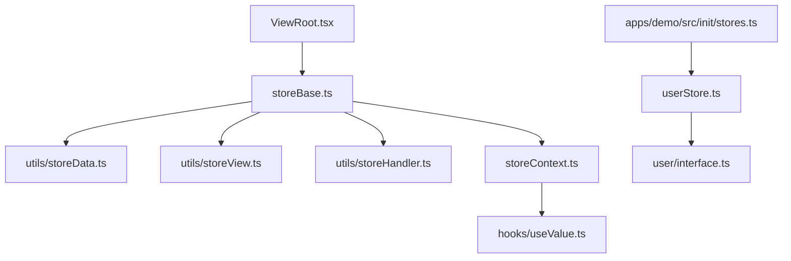
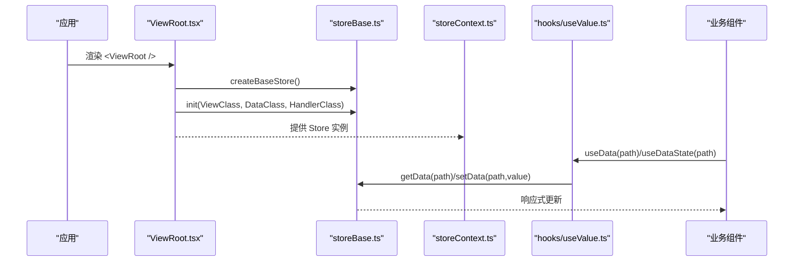
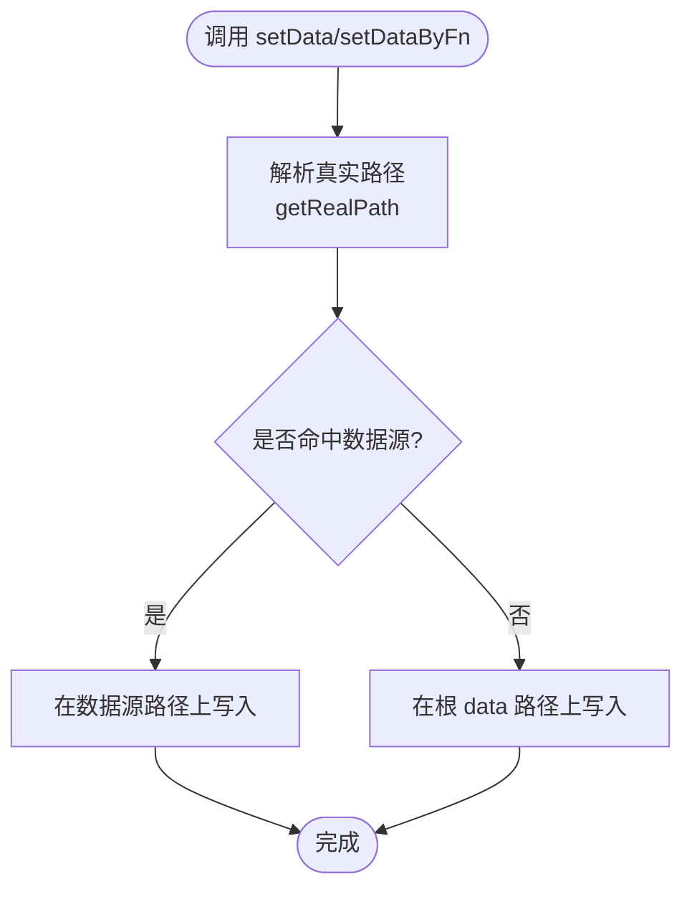
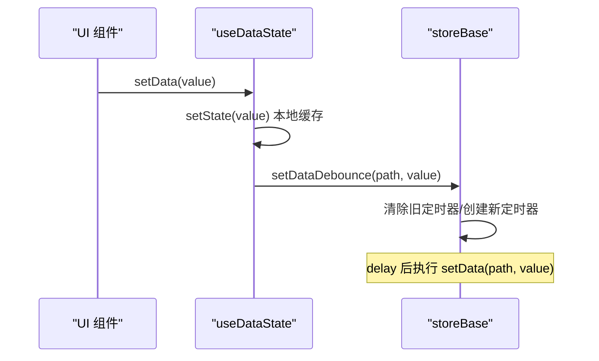
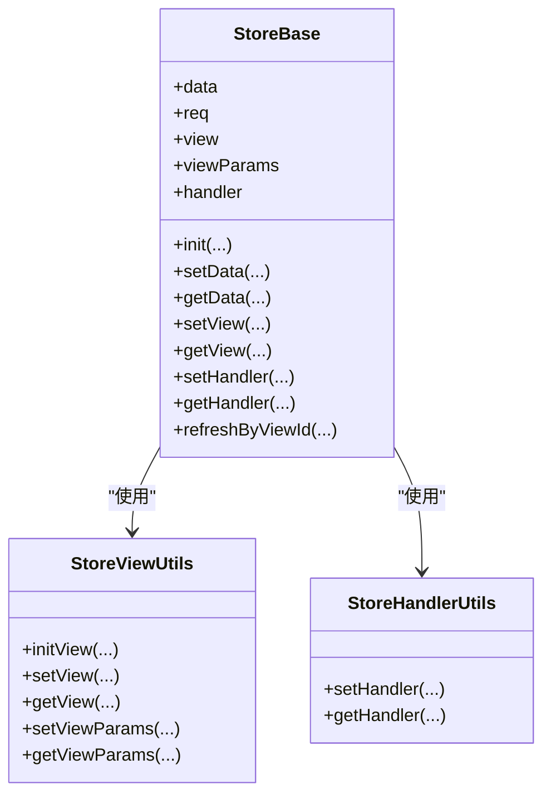
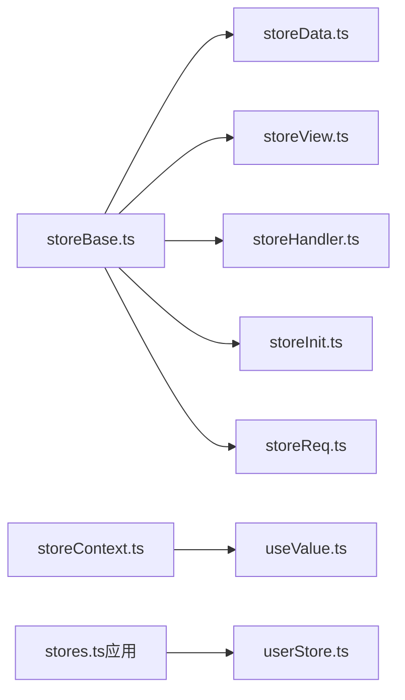

# 状态管理

<cite>
**本文引用的文件**
- [storeBase.ts](file://packages/framework/src/stores/store/storeBase.ts)
- [interface.ts](file://packages/framework/src/stores/store/interface.ts)
- [storeData.ts](file://packages/framework/src/stores/store/utils/storeData.ts)
- [storeView.ts](file://packages/framework/src/stores/store/utils/storeView.ts)
- [storeHandler.ts](file://packages/framework/src/stores/store/utils/storeHandler.ts)
- [storeContext.ts](file://packages/framework/src/stores/store/storeContext.ts)
- [useValue.ts](file://packages/framework/src/stores/store/hooks/useValue.ts)
- [userStore.ts](file://packages/framework/src/stores/user/userStore.ts)
- [interface.ts（用户）](file://packages/framework/src/stores/user/interface.ts)
- [stores.ts（应用初始化）](file://apps/demo/src/init/stores.ts)
- [ViewRoot.tsx](file://packages/framework/src/ViewRoot.tsx)
</cite>

## 目录
1. [简介](#简介)
2. [项目结构](#项目结构)
3. [核心组件](#核心组件)
4. [架构总览](#架构总览)
5. [详细组件分析](#详细组件分析)
6. [依赖关系分析](#依赖关系分析)
7. [性能考量](#性能考量)
8. [故障排查指南](#故障排查指南)
9. [结论](#结论)
10. [附录：API参考与使用示例](#附录api参考与使用示例)

## 简介
本模块基于 Zustand 构建，提供统一的 StoreBase 基类能力，封装了“数据、视图、处理器、请求参数”等状态的管理，并通过 React Context 注入到组件树中。同时提供用户级 store 的通用模板，便于在业务中快速创建全局状态。文档将深入解释 StoreBase 的实现原理、数据绑定与响应式更新机制、Zustand 集成方案、API 参考与最佳实践，并给出常见问题的解决方案。

## 项目结构
状态管理相关代码主要位于 packages/framework/src/stores 目录下，包含：
- store：StoreBase 基类及其工具方法（数据、视图、处理器、请求等）
- user：用户级 store 的工厂方法与类型定义
- hooks：React 钩子，用于订阅和更新状态
- ViewRoot：将 StoreBase 实例挂载到 React 树的入口

图表来源
- [ViewRoot.tsx:1-48](file://packages/framework/src/ViewRoot.tsx#L1-L48)
- [storeBase.ts:1-58](file://packages/framework/src/stores/store/storeBase.ts#L1-L58)
- [storeData.ts:1-147](file://packages/framework/src/stores/store/utils/storeData.ts#L1-L147)
- [storeView.ts:1-128](file://packages/framework/src/stores/store/utils/storeView.ts#L1-L128)
- [storeHandler.ts:1-25](file://packages/framework/src/stores/store/utils/storeHandler.ts#L1-L25)
- [storeContext.ts:1-7](file://packages/framework/src/stores/store/storeContext.ts#L1-L7)
- [useValue.ts:1-63](file://packages/framework/src/stores/store/hooks/useValue.ts#L1-L63)
- [userStore.ts:1-22](file://packages/framework/src/stores/user/userStore.ts#L1-L22)
- [interface.ts（用户）:1-15](file://packages/framework/src/stores/user/interface.ts#L1-L15)
- [stores.ts（应用初始化）:1-11](file://apps/demo/src/init/stores.ts#L1-L11)

章节来源
- [ViewRoot.tsx:1-48](file://packages/framework/src/ViewRoot.tsx#L1-L48)
- [storeBase.ts:1-58](file://packages/framework/src/stores/store/storeBase.ts#L1-L58)

## 核心组件
- StoreBase 基类：通过 create + immer 创建统一的状态容器，暴露 data、req、view、viewParams、handler 以及一系列操作方法（setData/getData、setView/getView、setHandler/getHandler、init、refreshByViewId 等）。
- 工具层：
  - storeData：路径解析、数据读写、防抖更新、请求节点初始化与父子关系计算。
  - storeView：视图对象注册、视图参数管理与焦点联动。
  - storeHandler：视图处理器对象的存取。
- React 集成：
  - storeContext：将 Zustand store 以 Context 形式注入。
  - useValue：提供 useData、useDataState、useDataStoreState 等钩子，支持本地缓存与防抖更新。
- 用户级 store：
  - userStore：基于泛型的用户信息/菜单信息 store 工厂。
  - 应用初始化：在 demo 应用中统一创建并导出 Store 单例。

章节来源
- [storeBase.ts:1-58](file://packages/framework/src/stores/store/storeBase.ts#L1-L58)
- [storeData.ts:1-147](file://packages/framework/src/stores/store/utils/storeData.ts#L1-L147)
- [storeView.ts:1-128](file://packages/framework/src/stores/store/utils/storeView.ts#L1-L128)
- [storeHandler.ts:1-25](file://packages/framework/src/stores/store/utils/storeHandler.ts#L1-L25)
- [storeContext.ts:1-7](file://packages/framework/src/stores/store/storeContext.ts#L1-L7)
- [useValue.ts:1-63](file://packages/framework/src/stores/store/hooks/useValue.ts#L1-L63)
- [userStore.ts:1-22](file://packages/framework/src/stores/user/userStore.ts#L1-L22)
- [interface.ts（用户）:1-15](file://packages/framework/src/stores/user/interface.ts#L1-L15)
- [stores.ts（应用初始化）:1-11](file://apps/demo/src/init/stores.ts#L1-L11)

## 架构总览
StoreBase 作为根状态容器，被 ViewRoot 在渲染时创建并注入到 Context 中；业务组件通过 hooks 订阅所需字段，触发 zustand 的细粒度更新。数据读写通过 storeData 工具进行路径解析与落库，视图与处理器分别维护在 view 与 handler 命名空间下，请求参数由 storeReq 统一管理。

图表来源
- [ViewRoot.tsx:1-48](file://packages/framework/src/ViewRoot.tsx#L1-L48)
- [storeBase.ts:1-58](file://packages/framework/src/stores/store/storeBase.ts#L1-L58)
- [storeContext.ts:1-7](file://packages/framework/src/stores/store/storeContext.ts#L1-L7)
- [useValue.ts:1-63](file://packages/framework/src/stores/store/hooks/useValue.ts#L1-L63)

## 详细组件分析

### StoreBase 基类实现原理
- 使用 Zustand 的 create 与 immer 中间件，提供不可变更新的便捷 API。
- 状态结构：
  - data：业务数据树，支持按 id 或路径访问。
  - req：数据请求配置与状态。
  - view：视图实例与元信息。
  - viewParams：视图参数集合，支持焦点联动。
  - handler：视图处理器实例集合。
- 关键方法：
  - init：初始化视图、数据与处理器，返回根视图 ID 与预渲染 IDs。
  - setData/getData：基于路径的数据读写，支持函数式更新与防抖。
  - setView/getView：视图实例的注册与获取。
  - setHandler/getHandler：处理器实例的注册与获取。
  - refreshByViewId/getReqParams：根据视图刷新请求与获取请求参数。

图表来源
- [storeData.ts:57-116](file://packages/framework/src/stores/store/utils/storeData.ts#L57-L116)
- [storeBase.ts:43-47](file://packages/framework/src/stores/store/storeBase.ts#L43-L47)

章节来源
- [storeBase.ts:1-58](file://packages/framework/src/stores/store/storeBase.ts#L1-L58)
- [storeData.ts:1-147](file://packages/framework/src/stores/store/utils/storeData.ts#L1-L147)

### 数据绑定与响应式更新
- 读取：useData/useDataById 通过 Zustand selector 精确订阅 path 对应的值，避免无关重渲染。
- 立即更新：useDataStoreState 直接调用 setData，触发最小化更新。
- 本地缓存+防抖：useDataState 在组件内缓存值，并通过 setDataDebounce 延迟提交到 store，减少频繁更新带来的开销。
- 防抖实现：基于 Map 记录每个 path 的定时器，重复设置会取消旧定时器，最终合并为一次更新。

图表来源
- [useValue.ts:10-28](file://packages/framework/src/stores/store/hooks/useValue.ts#L10-L28)
- [storeData.ts:118-147](file://packages/framework/src/stores/store/utils/storeData.ts#L118-L147)

章节来源
- [useValue.ts:1-63](file://packages/framework/src/stores/store/hooks/useValue.ts#L1-L63)
- [storeData.ts:118-147](file://packages/framework/src/stores/store/utils/storeData.ts#L118-L147)

### 视图与处理器管理
- 视图管理：
  - initView：扫描视图对象，收集所有带 id 的视图项，并以 id 为键存入 view 命名空间。
  - setView/getView：按 id 存取视图实例。
  - setViewParams/getViewParams：批量或单项设置视图参数，支持焦点 Active 自动计算 ActivePath。
- 处理器管理：
  - setHandler/getHandler：按视图 id 存取处理器实例，便于在视图中调用业务逻辑。

图表来源
- [storeBase.ts:18-54](file://packages/framework/src/stores/store/storeBase.ts#L18-L54)
- [storeView.ts:7-128](file://packages/framework/src/stores/store/utils/storeView.ts#L7-L128)
- [storeHandler.ts:4-24](file://packages/framework/src/stores/store/utils/storeHandler.ts#L4-L24)

章节来源
- [storeView.ts:1-128](file://packages/framework/src/stores/store/utils/storeView.ts#L1-L128)
- [storeHandler.ts:1-25](file://packages/framework/src/stores/store/utils/storeHandler.ts#L1-L25)

### Zustand 集成方案
- 创建方式：
  - StoreBase：createBaseStore 返回一个已绑定的 Zustand store，并在 ViewRoot 中确保只创建一次。
  - 用户级 store：createUserStore 工厂方法，结合 immer 中间件，提供类型安全的 user/menu 状态。
- 订阅与更新：
  - 通过 Context 注入 store，组件使用 hooks 订阅具体字段。
  - 使用 immer 允许直接修改嵌套结构，内部转换为不可变更新。
- 性能优化：
  - 选择器订阅：useData/useDataStoreState 仅订阅需要的 path。
  - 防抖更新：setDataDebounce 降低高频输入导致的频繁更新。
  - 严格模式安全：ViewRoot 使用 useRef 保证 store 唯一性。

章节来源
- [storeBase.ts:18-54](file://packages/framework/src/stores/store/storeBase.ts#L18-L54)
- [userStore.ts:1-22](file://packages/framework/src/stores/user/userStore.ts#L1-L22)
- [ViewRoot.tsx:16-32](file://packages/framework/src/ViewRoot.tsx#L16-L32)
- [useValue.ts:10-43](file://packages/framework/src/stores/store/hooks/useValue.ts#L10-L43)

### 实际使用示例（步骤说明）
- 在应用初始化处创建用户级 store 并导出单例：
  - 在 apps/demo/src/init/stores.ts 中通过 createUserStore<User, MenuItem>() 创建 Store.user。
- 在页面中使用 StoreBase：
  - 通过 ViewRoot 包裹页面，传入 ViewClass/DataClass/HandlerClass，自动初始化 store 并注入 Context。
  - 在组件中通过 useData/useDataState/useDataStoreState 读取或更新数据。
- 在业务逻辑中操作视图与处理器：
  - 使用 setView/getView 管理视图实例。
  - 使用 setHandler/getHandler 管理处理器实例。
  - 使用 refreshByViewId/getReqParams 控制数据请求。

章节来源
- [stores.ts（应用初始化）:1-11](file://apps/demo/src/init/stores.ts#L1-L11)
- [ViewRoot.tsx:10-48](file://packages/framework/src/ViewRoot.tsx#L10-L48)
- [useValue.ts:10-63](file://packages/framework/src/stores/store/hooks/useValue.ts#L10-L63)

## 依赖关系分析
- StoreBase 依赖：
  - utils/storeData：数据路径解析与读写、防抖、请求节点初始化。
  - utils/storeView：视图与视图参数的增删改查。
  - utils/storeHandler：处理器实例的存取。
  - utils/storeInit：视图、数据、处理器的初始化流程（由 storeBase 调用）。
  - utils/storeReq：请求参数管理与刷新（由 storebase 暴露 refreshByViewId）。
- React 集成依赖：
  - storeContext：提供 Zustand store 上下文。
  - hooks/useValue：提供数据订阅与更新钩子。
- 用户级 store：
  - userStore：基于泛型与 immer 的用户/菜单状态。
  - 应用初始化：demo 中统一创建并导出 Store。

图表来源
- [storeBase.ts:1-58](file://packages/framework/src/stores/store/storeBase.ts#L1-L58)
- [storeData.ts:1-147](file://packages/framework/src/stores/store/utils/storeData.ts#L1-L147)
- [storeView.ts:1-128](file://packages/framework/src/stores/store/utils/storeView.ts#L1-L128)
- [storeHandler.ts:1-25](file://packages/framework/src/stores/store/utils/storeHandler.ts#L1-L25)
- [storeContext.ts:1-7](file://packages/framework/src/stores/store/storeContext.ts#L1-L7)
- [useValue.ts:1-63](file://packages/framework/src/stores/store/hooks/useValue.ts#L1-L63)
- [stores.ts（应用初始化）:1-11](file://apps/demo/src/init/stores.ts#L1-L11)
- [userStore.ts:1-22](file://packages/framework/src/stores/user/userStore.ts#L1-L22)

章节来源
- [storeBase.ts:1-58](file://packages/framework/src/stores/store/storeBase.ts#L1-L58)
- [storeData.ts:1-147](file://packages/framework/src/stores/store/utils/storeData.ts#L1-L147)
- [storeView.ts:1-128](file://packages/framework/src/stores/store/utils/storeView.ts#L1-L128)
- [storeHandler.ts:1-25](file://packages/framework/src/stores/store/utils/storeHandler.ts#L1-L25)
- [storeContext.ts:1-7](file://packages/framework/src/stores/store/storeContext.ts#L1-L7)
- [useValue.ts:1-63](file://packages/framework/src/stores/store/hooks/useValue.ts#L1-L63)
- [stores.ts（应用初始化）:1-11](file://apps/demo/src/init/stores.ts#L1-L11)
- [userStore.ts:1-22](file://packages/framework/src/stores/user/userStore.ts#L1-L22)

## 性能考量
- 选择器订阅：通过 useData/useDataStoreState 精确订阅 path，避免整棵状态树变更导致的重渲染。
- 防抖更新：setDataDebounce 对高频输入进行节流，减少不必要的 store 更新与渲染。
- 不可变更新：immer 中间件简化嵌套更新的同时保持最小化 diff。
- 严格模式安全：ViewRoot 使用 useRef 确保 store 唯一，避免 StrictMode 下的重复创建。
- 视图参数联动：Active 与 ActivePath 的自动计算减少额外逻辑。

[本节为通用性能建议，不直接分析具体文件]

## 故障排查指南
- 未确认的 viewId：当 getView 传入空或不存在的 viewId 时会抛出错误，需检查视图初始化是否正确。
- 数据请求节点不存在：初始化阶段若父节点不存在会发出警告并跳过，需检查 DataProps 中的 path/id 配置。
- 重复的数据请求 id：初始化时若检测到重复 id 会跳过并警告，需确保 id 唯一。
- 防抖未生效：检查 setDataDebounce 的 path 是否一致，Map 中 key 由路径字符串生成，不一致会导致多个定时器并存。

章节来源
- [storeView.ts:39-45](file://packages/framework/src/stores/store/utils/storeView.ts#L39-L45)
- [storeData.ts:14-24](file://packages/framework/src/stores/store/utils/storeData.ts#L14-L24)
- [storeData.ts:26-51](file://packages/framework/src/stores/store/utils/storeData.ts#L26-L51)
- [storeData.ts:118-147](file://packages/framework/src/stores/store/utils/storeData.ts#L118-L147)

## 结论
该状态管理模块以 StoreBase 为核心，结合 Zustand 与 immer，提供了统一的数据、视图、处理器与请求管理能力。通过 React Context 与 hooks 实现细粒度订阅与响应式更新，配合防抖与选择器优化性能。用户级 store 工厂方法进一步简化了全局状态的创建与管理。遵循本文的最佳实践可有效提升可维护性与运行效率。

[本节为总结性内容，不直接分析具体文件]

## 附录：API参考与使用示例

### StoreBase 接口概览（IStoreBase）
- 数据
  - setData(path, value)：设置指定路径的数据。
  - setDataByFn(path, fn)：以函数方式读取并更新数据。
  - setDataDebounce(path, value)：防抖设置数据。
  - getData(path)：读取指定路径的数据。
- 视图
  - setView(viewId, view)：注册视图实例。
  - getView(viewId)：获取视图实例。
  - setViewParams(viewId, values, init?)：批量设置视图参数。
  - setViewParamByKey(viewId, key, value)：设置单个视图参数。
  - getViewParams(viewId)：获取视图参数。
  - getViewParamByKey(viewId, key)：获取单个视图参数。
- 处理器
  - setHandler(viewId, handler)：注册处理器实例。
  - getHandler(viewId)：获取处理器实例。
- 初始化与请求
  - init(ViewClass, DataClass, HandlerClass)：初始化视图、数据与处理器。
  - getReqParams(viewId)：获取视图的请求参数。
  - refreshByViewId(viewId)：根据视图刷新请求。

章节来源
- [interface.ts:74-133](file://packages/framework/src/stores/store/interface.ts#L74-L133)
- [storeBase.ts:18-54](file://packages/framework/src/stores/store/storeBase.ts#L18-L54)

### 用户级 store 接口（IUserStoreBase）
- 数据
  - user：当前用户信息。
  - menu：菜单列表。
- 动作
  - setUser(user)：设置用户信息。
  - getUser()：获取用户信息。
  - setMenu(menu)：设置菜单列表。
  - getMenu()：获取菜单列表。

章节来源
- [interface.ts（用户）:1-15](file://packages/framework/src/stores/user/interface.ts#L1-L15)
- [userStore.ts:5-18](file://packages/framework/src/stores/user/userStore.ts#L5-L18)

### React 钩子（hooks）
- useData(path)：订阅指定路径的数据。
- useDataById(id)：根据 id 获取数据。
- useDataState(path)：本地缓存 + 防抖更新。
- useDataStoreState(path)：立即更新 store。

章节来源
- [useValue.ts:10-63](file://packages/framework/src/stores/store/hooks/useValue.ts#L10-L63)

### 使用示例（步骤说明）
- 创建用户级 store：
  - 在应用初始化文件中通过 createUserStore<User, MenuItem>() 创建 Store.user。
- 在页面中使用 StoreBase：
  - 使用 ViewRoot 包裹页面，传入 ViewClass/DataClass/HandlerClass。
  - 在组件中通过 useData/useDataState/useDataStoreState 读取或更新数据。
- 管理视图与处理器：
  - 使用 setView/getView 管理视图实例。
  - 使用 setHandler/getHandler 管理处理器实例。
  - 使用 refreshByViewId/getReqParams 控制数据请求。

章节来源
- [stores.ts（应用初始化）:1-11](file://apps/demo/src/init/stores.ts#L1-L11)
- [ViewRoot.tsx:10-48](file://packages/framework/src/ViewRoot.tsx#L10-L48)
- [useValue.ts:10-63](file://packages/framework/src/stores/store/hooks/useValue.ts#L10-L63)