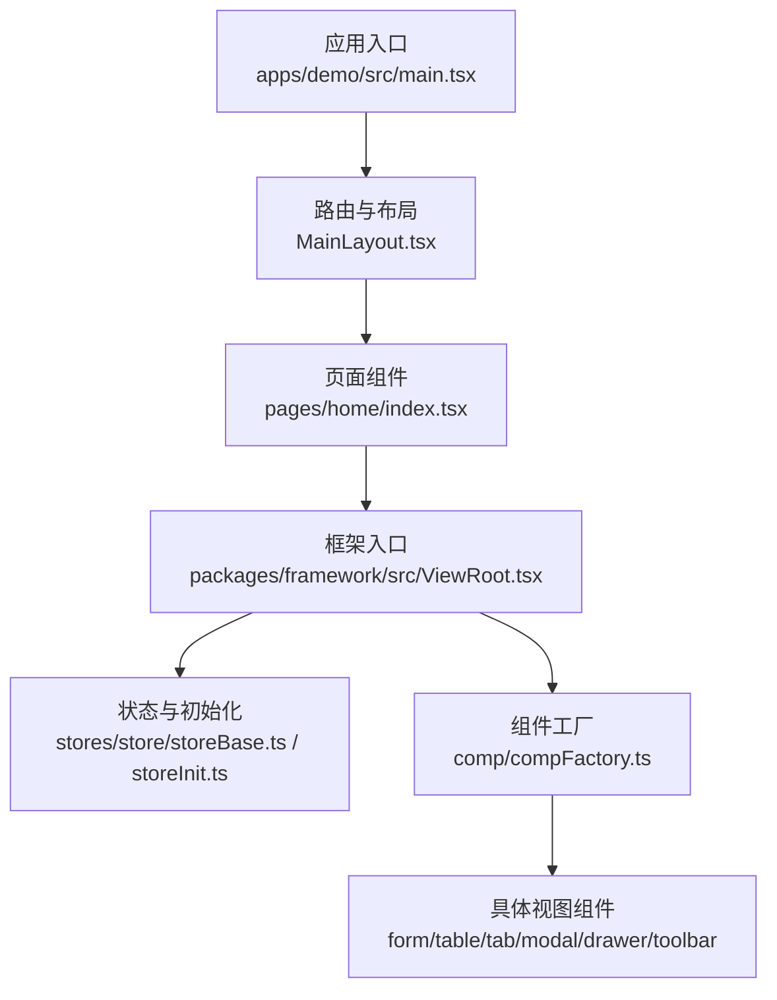
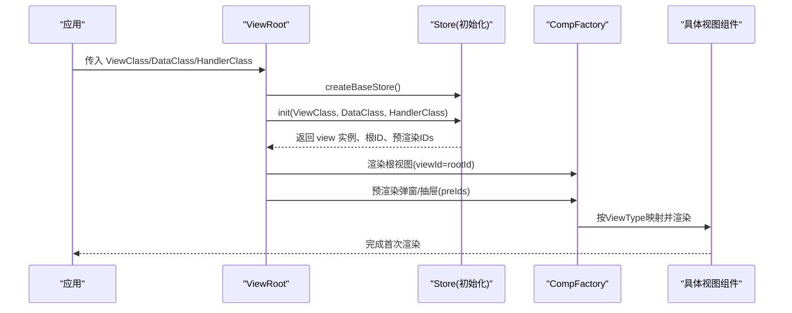
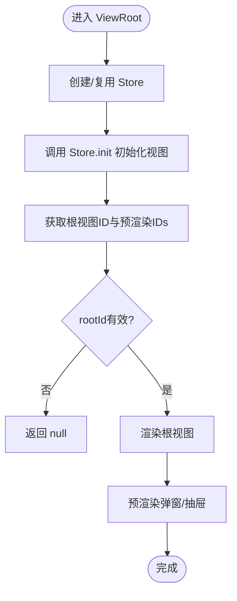
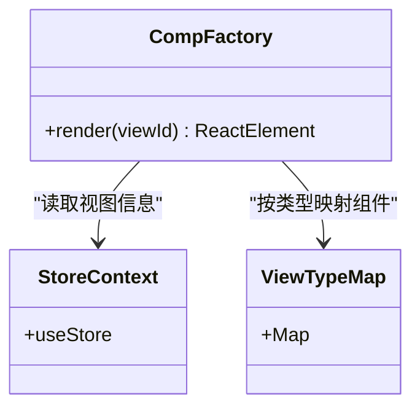
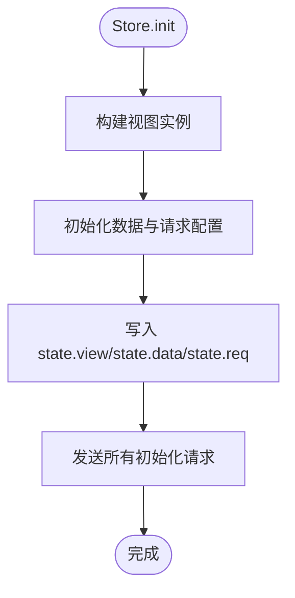
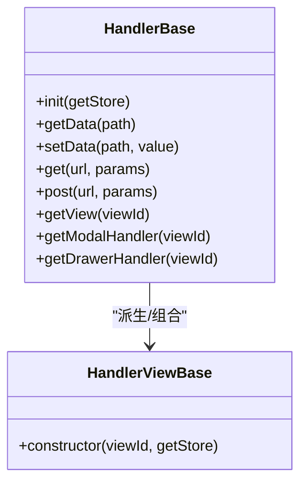
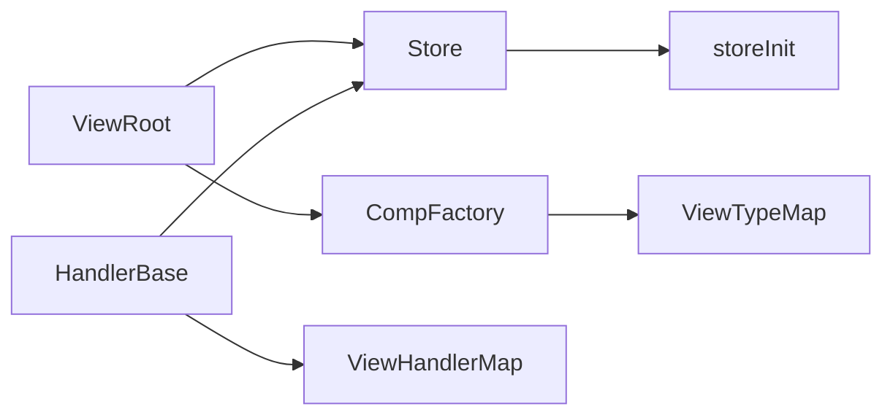

# 视图渲染引擎

<cite>
**本文引用的文件**
- [ViewRoot.tsx](file://packages/framework/src/ViewRoot.tsx)
- [compFactory.ts](file://packages/framework/src/comp/compFactory.ts)
- [interface.ts](file://packages/framework/src/interface.ts)
- [viewBase.ts](file://packages/framework/src/comp/viewBase.ts)
- [handlerBase.ts](file://packages/framework/src/handler/handlerBase.ts)
- [handlerViewBase.ts](file://packages/framework/src/handler/handlerViewBase.ts)
- [storeBase.ts](file://packages/framework/src/stores/store/storeBase.ts)
- [storeInit.ts](file://packages/framework/src/stores/store/utils/storeInit.ts)
- [storeHandler.ts](file://packages/framework/src/stores/store/utils/storeHandler.ts)
- [storeContext.ts](file://packages/framework/src/stores/store/storeContext.ts)
- [dataBase.ts](file://packages/framework/src/data/dataBase.ts)
- [controlInterface.ts](file://packages/framework/src/comp/control/interface.ts)
- [formInterface.ts](file://packages/framework/src/comp/view/form/interface.ts)
- [tableInterface.ts](file://packages/framework/src/comp/view/table/interface.ts)
- [viewTypeInterface.ts](file://packages/framework/src/comp/view/interface.ts)
- [2.组件用法.md](file://docs/2.组件用法.md)
</cite>

## 目录
1. [简介](#简介)
2. [项目结构](#项目结构)
3. [核心组件](#核心组件)
4. [架构总览](#架构总览)
5. [详细组件分析](#详细组件分析)
6. [依赖关系分析](#依赖关系分析)
7. [性能考虑](#性能考虑)
8. [故障排查指南](#故障排查指南)
9. [结论](#结论)
10. [附录：API参考与配置语法](#附录api参考与配置语法)

## 简介
本文件面向使用框架的开发者，系统化阐述“视图渲染引擎”的设计与实现。重点覆盖：
- ViewRoot 的核心职责：创建并缓存 Store、初始化视图树、预渲染弹窗/抽屉等
- 视图配置解析：类型枚举、基础属性、数据绑定路径、事件处理
- 动态渲染机制：基于 CompFactory 的类型分发与按需挂载
- 生命周期管理：Store 初始化、视图实例化、请求调度、预渲染策略
- API 参考：ViewProps、控件配置、Handler 方法、Store 能力
- 最佳实践：性能优化、错误处理、可维护性建议

## 项目结构
仓库采用 monorepo 组织，框架核心位于 packages/framework/src，示例应用位于 apps/demo/src。框架通过统一的 ViewRoot 作为入口，将视图、数据、处理器与状态管理解耦，并通过 CompFactory 根据视图类型动态渲染具体组件。



图示来源
- [main.tsx:1-53](file://apps/demo/src/main.tsx#L1-L53)
- [MainLayout.tsx:1-77](file://apps/demo/src/layouts/main/MainLayout.tsx#L1-L77)
- [ViewRoot.tsx:1-48](file://packages/framework/src/ViewRoot.tsx#L1-L48)
- [storeBase.ts:1-57](file://packages/framework/src/stores/store/storeBase.ts#L1-L57)
- [compFactory.ts:1-59](file://packages/framework/src/comp/compFactory.ts#L1-L59)

章节来源
- [main.tsx:1-53](file://apps/demo/src/main.tsx#L1-L53)
- [MainLayout.tsx:1-77](file://apps/demo/src/layouts/main/MainLayout.tsx#L1-L77)

## 核心组件
- ViewRoot：视图渲染根节点，负责创建/复用 Store、初始化视图树、返回根 ID 与预渲染 ID 列表，并通过 Context 注入 Store 给子组件。
- CompFactory：根据视图类型（ViewType）映射到具体 React 组件，完成动态渲染。
- Store（Zustand + immer）：集中管理 data、req、view、viewParams、handler，并提供统一的数据读写、视图参数设置、请求刷新等方法。
- HandlerBase：业务处理器基类，封装数据读写、网络请求、视图参数操作、获取弹窗/抽屉 handler 等能力。
- ViewBase：视图抽象基类，持有 handler 与 data 引用，并要求实现 getRootId。
- 视图类型与控件接口：定义 ViewType、Ctrl 枚举及各类视图/控件的配置结构。

章节来源
- [ViewRoot.tsx:1-48](file://packages/framework/src/ViewRoot.tsx#L1-L48)
- [compFactory.ts:1-59](file://packages/framework/src/comp/compFactory.ts#L1-L59)
- [storeBase.ts:1-57](file://packages/framework/src/stores/store/storeBase.ts#L1-L57)
- [handlerBase.ts:1-92](file://packages/framework/src/handler/handlerBase.ts#L1-L92)
- [viewBase.ts:1-16](file://packages/framework/src/comp/viewBase.ts#L1-L16)
- [viewTypeInterface.ts:1-109](file://packages/framework/src/comp/view/interface.ts#L1-L109)
- [controlInterface.ts:1-90](file://packages/framework/src/comp/control/interface.ts#L1-L90)

## 架构总览
下图展示了从应用启动到视图渲染的关键流程：应用入口包裹路由与主题，进入框架后由 ViewRoot 创建 Store 并初始化视图树；CompFactory 根据视图类型渲染对应组件；Store 提供数据与请求能力，Handler 协调业务逻辑。



图示来源
- [ViewRoot.tsx:1-48](file://packages/framework/src/ViewRoot.tsx#L1-L48)
- [storeInit.ts:1-70](file://packages/framework/src/stores/store/utils/storeInit.ts#L1-L70)
- [compFactory.ts:1-59](file://packages/framework/src/comp/compFactory.ts#L1-L59)

## 详细组件分析

### ViewRoot：渲染根节点与生命周期
- 职责
  - 使用 useRef 确保 Store 仅创建一次，避免 StrictMode 下重复初始化
  - 调用 Store.init 完成视图、数据、请求的初始化
  - 返回根视图 ID 与预渲染 IDs（如 Modal/Drawer），提前挂载以提升交互体验
  - 通过 StoreContext 向子树注入 useStore，供各组件订阅与更新
- 关键点
  - 若未正确初始化或 rootId 无效，返回 null 安全降级
  - 预渲染策略：在初始化阶段识别需要立即挂载的视图类型，减少用户等待



图示来源
- [ViewRoot.tsx:1-48](file://packages/framework/src/ViewRoot.tsx#L1-L48)
- [storeInit.ts:1-70](file://packages/framework/src/stores/store/utils/storeInit.ts#L1-L70)

章节来源
- [ViewRoot.tsx:1-48](file://packages/framework/src/ViewRoot.tsx#L1-L48)
- [storeInit.ts:1-70](file://packages/framework/src/stores/store/utils/storeInit.ts#L1-L70)

### CompFactory：类型分发与动态渲染
- 职责
  - 维护 ViewType 到 React 组件的映射表
  - 从 Store 中读取指定 viewId 的视图信息，匹配对应组件并渲染
  - 支持系统内置视图类型：表格、表单、工具栏、Flex/Tab 布局、Modal/Drawer
- 关键点
  - 若视图不存在或类型未知，返回 null 避免报错
  - 通过 viewId 精确挂载，便于按需渲染与隔离



图示来源
- [compFactory.ts:1-59](file://packages/framework/src/comp/compFactory.ts#L1-L59)
- [storeContext.ts:1-7](file://packages/framework/src/stores/store/storeContext.ts#L1-L7)

章节来源
- [compFactory.ts:1-59](file://packages/framework/src/comp/compFactory.ts#L1-L59)

### Store：状态、数据与请求中心
- 职责
  - 管理 data、req、view、viewParams、handler 五大域
  - 提供 setData/getData、setViewParam/getViewParam、refreshByViewId 等能力
  - 通过 immer 中间件保证不可变更新与高效 diff
- 关键点
  - init 方法串联视图初始化、数据源初始化、请求调度
  - 预渲染：自动收集 Modal/Drawer 的 ID，提前挂载



图示来源
- [storeBase.ts:1-57](file://packages/framework/src/stores/store/storeBase.ts#L1-L57)
- [storeInit.ts:1-70](file://packages/framework/src/stores/store/utils/storeInit.ts#L1-L70)

章节来源
- [storeBase.ts:1-57](file://packages/framework/src/stores/store/storeBase.ts#L1-L57)
- [storeInit.ts:1-70](file://packages/framework/src/stores/store/utils/storeInit.ts#L1-L70)

### HandlerBase：业务处理器与能力封装
- 职责
  - 提供 getData/setData、setViewParam/setViewParams 等数据与视图参数操作
  - 封装 get/post 网络请求
  - 提供 getModalHandler/getDrawerHandler 以获取弹窗/抽屉的控制器
- 关键点
  - 通过 getHandler 懒加载并缓存特定视图类型的 handler
  - 错误提示：当找不到对应 handler 时抛出明确错误



图示来源
- [handlerBase.ts:1-92](file://packages/framework/src/handler/handlerBase.ts#L1-L92)
- [handlerViewBase.ts:1-17](file://packages/framework/src/handler/handlerViewBase.ts#L1-L17)
- [storeHandler.ts:1-24](file://packages/framework/src/stores/store/utils/storeHandler.ts#L1-L24)

章节来源
- [handlerBase.ts:1-92](file://packages/framework/src/handler/handlerBase.ts#L1-L92)
- [handlerViewBase.ts:1-17](file://packages/framework/src/handler/handlerViewBase.ts#L1-L17)
- [storeHandler.ts:1-24](file://packages/framework/src/stores/store/utils/storeHandler.ts#L1-L24)

### 视图配置与控件体系
- 视图类型（ViewType）：包含表格、表单、工具栏、Flex/Tab 布局、Modal/Drawer 等
- 控件类型（Ctrl）：文本、输入、按钮、选择、开关、单选、复选、日期、时间、链接、上传等
- 视图结构：每个视图具备 id、type、path（数据绑定路径）、items（子项/列/字段）等
- 表单与表格：
  - 表单：items 为字段数组，toolList 为工具栏按钮集合
  - 表格：items 为列定义，searchItems 为搜索面板配置，height 控制高度

```mermaid
erDiagram
VIEW_STRUCT_BASE {
string id
enum type
string dataId
}
VIEW_ITEM {
string title
string field
CtrlStructType ctrl
DPath path
}
VIEW_FORM_PROPS {
enum type=Form
items FormItemProps[]
toolList ButtonProps[]
}
VIEW_TABLE_PROPS {
enum type=Table
items TableItemProps[]
searchItems SearchPlaneItem[]
number|string height
}
VIEW_STRUCT_BASE ||--o{ VIEW_ITEM : "包含"
VIEW_FORM_PROPS ||--|| VIEW_STRUCT_BASE : "继承"
VIEW_TABLE_PROPS ||--|| VIEW_STRUCT_BASE : "继承"
```

图示来源
- [viewTypeInterface.ts:1-109](file://packages/framework/src/comp/view/interface.ts#L1-L109)
- [controlInterface.ts:1-90](file://packages/framework/src/comp/control/interface.ts#L1-L90)
- [formInterface.ts:1-13](file://packages/framework/src/comp/view/form/interface.ts#L1-L13)
- [tableInterface.ts:1-28](file://packages/framework/src/comp/view/table/interface.ts#L1-L28)

章节来源
- [viewTypeInterface.ts:1-109](file://packages/framework/src/comp/view/interface.ts#L1-L109)
- [controlInterface.ts:1-90](file://packages/framework/src/comp/control/interface.ts#L1-L90)
- [formInterface.ts:1-13](file://packages/framework/src/comp/view/form/interface.ts#L1-L13)
- [tableInterface.ts:1-28](file://packages/framework/src/comp/view/table/interface.ts#L1-L28)

### 数据绑定与事件处理
- 数据绑定
  - 通过 path（DPath）将控件值与 Store 中的数据结构进行双向绑定
  - 表单/表格字段通过 items 的 path 指向具体数据位置
- 事件处理
  - 控件 onChange 回调用于响应值变化
  - 工具栏按钮 onClick 可调用 Handler 方法触发业务逻辑
- 视图参数
  - setViewParam/setViewParams 用于跨组件传递参数
  - 通过 Handler 暴露的方法统一访问与修改

章节来源
- [controlInterface.ts:1-90](file://packages/framework/src/comp/control/interface.ts#L1-L90)
- [handlerBase.ts:1-92](file://packages/framework/src/handler/handlerBase.ts#L1-L92)

### 自定义视图组件示例
- 步骤概览
  - 定义视图类继承 ViewBase，声明 form/table/tab/layout/modal 等属性
  - 通过 getRootId 返回根视图 ID
  - 在页面中使用 ViewRoot 传入 ViewClass/DataClass/HandlerClass 完成渲染
- 参考文档
  - 完整视图配置示例见文档“视图配置 (View)”部分

章节来源
- [2.组件用法.md:347-428](file://docs/2.组件用法.md#L347-L428)

## 依赖关系分析
- ViewRoot 依赖 Store 初始化与上下文注入
- CompFactory 依赖 ViewType 映射与 Store 提供的视图元信息
- HandlerBase 依赖 Store 的数据与请求能力，以及 ViewHandlerMap 获取特定视图的 handler
- Store 依赖 immer 与 zustand，统一管理状态变更与副作用



图示来源
- [ViewRoot.tsx:1-48](file://packages/framework/src/ViewRoot.tsx#L1-L48)
- [compFactory.ts:1-59](file://packages/framework/src/comp/compFactory.ts#L1-L59)
- [storeBase.ts:1-57](file://packages/framework/src/stores/store/storeBase.ts#L1-L57)
- [handlerBase.ts:1-92](file://packages/framework/src/handler/handlerBase.ts#L1-L92)

章节来源
- [ViewRoot.tsx:1-48](file://packages/framework/src/ViewRoot.tsx#L1-L48)
- [compFactory.ts:1-59](file://packages/framework/src/comp/compFactory.ts#L1-L59)
- [storeBase.ts:1-57](file://packages/framework/src/stores/store/storeBase.ts#L1-L57)
- [handlerBase.ts:1-92](file://packages/framework/src/handler/handlerBase.ts#L1-L92)

## 性能考虑
- Store 单例与惰性初始化：通过 useRef 确保 Store 只创建一次，避免 StrictMode 下的重复初始化开销
- 预渲染策略：对 Modal/Drawer 等需要即时响应的视图进行预渲染，降低交互延迟
- 不可变更新：使用 immer 中间件提升状态更新的效率与可预测性
- 按需渲染：CompFactory 基于 viewId 精确挂载，避免无关组件重渲染
- 数据与请求分离：Store 将 data 与 req 分域管理，便于独立优化与调试

[本节为通用指导，不直接分析具体文件]

## 故障排查指南
- 视图未渲染
  - 检查 ViewRoot 是否正确传入 ViewClass/DataClass/HandlerClass
  - 确认 Store.init 是否成功返回 rootId
- 类型映射失败
  - 检查 ViewType 是否在 ViewTypeMap 中注册
  - 确认视图配置中的 type 与枚举一致
- Handler 缺失
  - 当通过 getModalHandler/getDrawerHandler 获取不到 handler 时会抛出错误
  - 检查对应视图类型是否在 ViewHandlerMap 中映射
- 数据绑定异常
  - 校验 path 是否与 Store 中的数据层级一致
  - 使用 getData 与 getAllData 辅助定位数据状态

章节来源
- [handlerBase.ts:1-92](file://packages/framework/src/handler/handlerBase.ts#L1-L92)
- [compFactory.ts:1-59](file://packages/framework/src/comp/compFactory.ts#L1-L59)
- [storeBase.ts:1-57](file://packages/framework/src/stores/store/storeBase.ts#L1-L57)

## 结论
该视图渲染引擎通过 ViewRoot 统一入口、Store 集中状态、CompFactory 动态渲染与 HandlerBase 业务封装，实现了高内聚、低耦合的可扩展视图体系。配合完善的配置结构与预渲染策略，既能满足复杂业务场景，又具备良好的性能与维护性。建议在开发中遵循配置规范、合理使用数据绑定与事件处理，并结合性能优化策略持续提升用户体验。

[本节为总结，不直接分析具体文件]

## 附录：API参考与配置语法

### ViewRoot 使用方式
- 传入参数
  - ViewClass：视图类构造器
  - DataClass：数据类构造器
  - HandlerClass：处理器类构造器
- 行为
  - 创建并缓存 Store，初始化视图树
  - 返回根视图与预渲染视图的 ID
  - 通过 Context 注入 useStore

章节来源
- [ViewRoot.tsx:1-48](file://packages/framework/src/ViewRoot.tsx#L1-L48)
- [interface.ts:1-35](file://packages/framework/src/interface.ts#L1-L35)

### Store API
- 数据
  - setData(path, value)：设置数据
  - getData(path)：获取数据
  - setDataByFn(path, fn)：函数式更新数据
  - setDataDebounce(path, value)：防抖设置数据
- 视图参数
  - setViewParamByKey(viewId, key, value)
  - setViewParams(viewId, values, init?)
  - getViewParamByKey(viewId, key)
  - getViewParams(viewId)
- 视图
  - setView(viewId, view)
  - getView(viewId)
- 处理器
  - setHandler(viewId, handler)
  - getHandler(viewId)
- 请求
  - getReqParams(viewId)
  - refreshByViewId(viewId)

章节来源
- [storeBase.ts:1-57](file://packages/framework/src/stores/store/storeBase.ts#L1-L57)

### HandlerBase API
- 数据
  - getData(path)
  - getAllData()
  - setData(path, value)
- 视图参数
  - setViewParam(viewId, key, value)
  - setViewParams(viewId, values, init?)
- 网络
  - get(url, params)
  - post(url, params)
- 视图与处理器
  - getView(viewId)
  - getModalHandler(viewId)
  - getDrawerHandler(viewId)

章节来源
- [handlerBase.ts:1-92](file://packages/framework/src/handler/handlerBase.ts#L1-L92)

### 视图配置语法
- 基础属性
  - id：唯一标识
  - type：视图类型（ViewType）
  - dataId：可选数据关联
  - path：数据绑定路径（DPath）
- 表单（Form）
  - items：字段数组（FormItemProps）
  - toolList：工具栏按钮（ButtonProps）
- 表格（Table）
  - items：列定义（TableItemProps）
  - searchItems：搜索面板配置
  - height：高度（number|string）
- 控件（Ctrl）
  - 类型：Text/Input/Button/Select/Switch/Radio/Checkbox/Date/Time/Link/Upload
  - 交互：onChange(value, name?)

章节来源
- [viewTypeInterface.ts:1-109](file://packages/framework/src/comp/view/interface.ts#L1-L109)
- [formInterface.ts:1-13](file://packages/framework/src/comp/view/form/interface.ts#L1-L13)
- [tableInterface.ts:1-28](file://packages/framework/src/comp/view/table/interface.ts#L1-L28)
- [controlInterface.ts:1-90](file://packages/framework/src/comp/control/interface.ts#L1-L90)

### 自定义视图组件最佳实践
- 继承 ViewBase，实现 getRootId
- 合理拆分 form/table/tab/layout/modal 等模块，保持配置清晰
- 使用 Handler 封装业务逻辑，避免在视图中直接操作数据
- 利用预渲染与按需渲染提升性能
- 通过 path 进行数据绑定，避免深层嵌套导致的性能问题

章节来源
- [2.组件用法.md:347-428](file://docs/2.组件用法.md#L347-L428)
- [viewBase.ts:1-16](file://packages/framework/src/comp/viewBase.ts#L1-L16)