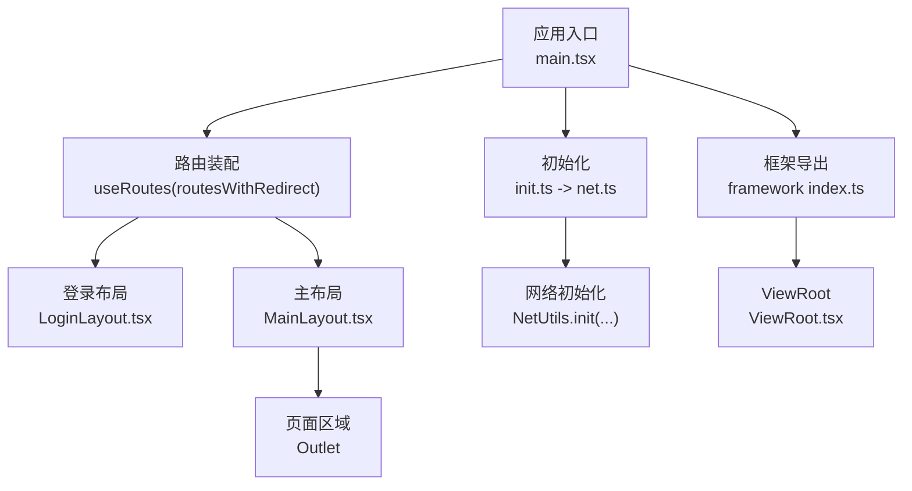
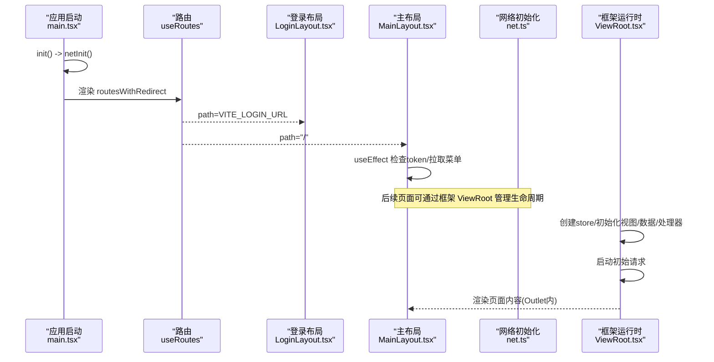
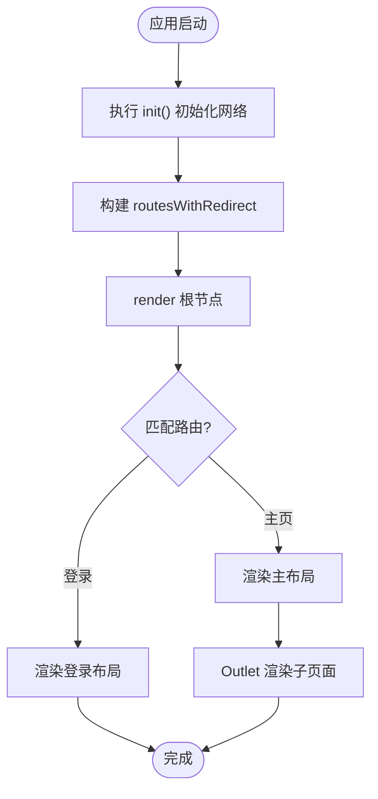
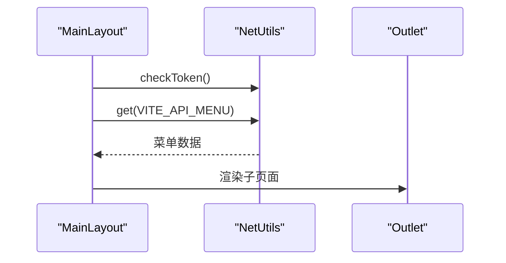
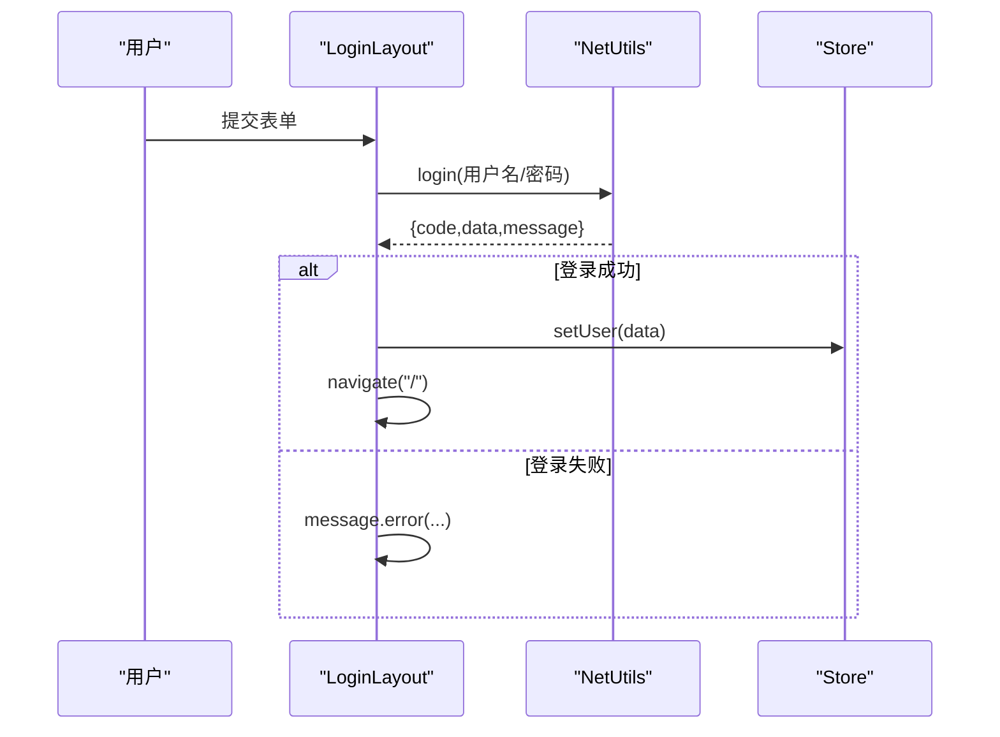
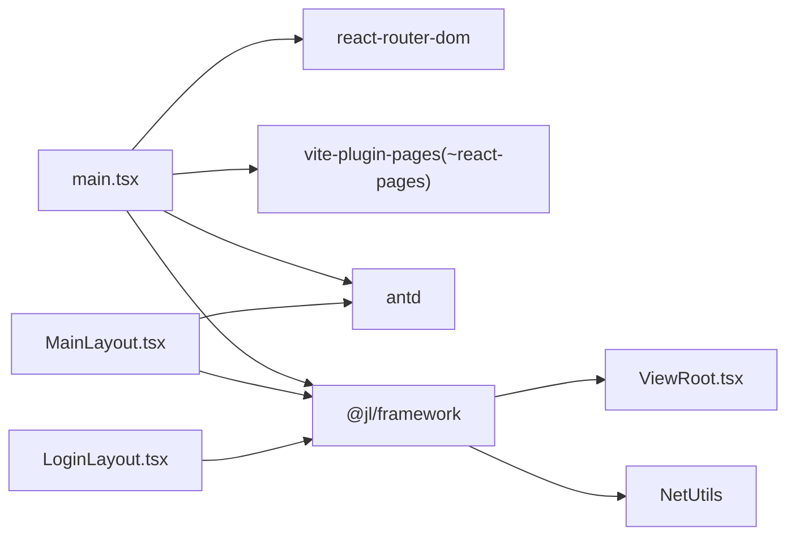

# 页面运行时管理

<cite>
**本文引用的文件**
- [main.tsx](file://apps/demo/src/main.tsx)
- [vite.config.ts](file://apps/demo/vite.config.ts)
- [global.d.ts](file://apps/demo/src/types/global.d.ts)
- [init.ts](file://apps/demo/src/init/init.ts)
- [net.ts](file://apps/demo/src/init/net.ts)
- [stores.ts](file://apps/demo/src/init/stores.ts)
- [MainLayout.tsx](file://apps/demo/src/layouts/main/MainLayout.tsx)
- [LoginLayout.tsx](file://apps/demo/src/layouts/login/LoginLayout.tsx)
- [index.tsx](file://apps/demo/src/pages/index.tsx)
- [...all].tsx](file://apps/demo/src/pages/[...all].tsx)
- [framework index.ts](file://packages/framework/src/index.ts)
- [ViewRoot.tsx](file://packages/framework/src/ViewRoot.tsx)
- [interface.ts](file://packages/framework/src/interface.ts)
</cite>

## 目录
1. [简介](#简介)
2. [项目结构](#项目结构)
3. [核心组件](#核心组件)
4. [架构总览](#架构总览)
5. [详细组件分析](#详细组件分析)
6. [依赖关系分析](#依赖关系分析)
7. [性能考量](#性能考量)
8. [故障排查指南](#故障排查指南)
9. [结论](#结论)
10. [附录](#附录)

## 简介
本文件聚焦“页面运行时管理”，围绕应用启动、路由装配、布局渲染、网络初始化与鉴权、以及框架提供的 ViewRoot 运行时生命周期，系统化说明前端在运行时的关键流程与职责边界。目标是帮助读者理解从入口到页面渲染的完整链路，并掌握常见问题定位方法。

## 项目结构
- 应用入口与路由装配：应用通过 React Router 进行路由配置，结合 vite-plugin-pages 自动将 src/pages 下的文件映射为路由表，并在入口中组合登录页与主布局。
- 布局层：提供登录布局与主布局，主布局承载侧边菜单、头部与内容区（Outlet），用于承载业务页面。
- 初始化与网络：统一在网络层初始化请求基地址、登录地址、登录接口与错误处理回调；同时注入全局 Store 能力。
- 框架运行时：框架提供 ViewRoot 作为页面级根节点，负责创建 store、初始化视图/数据/处理器、启动请求、并在卸载时释放资源。



图表来源
- [main.tsx:11-31](file://apps/demo/src/main.tsx#L11-L31)
- [vite.config.ts:14-20](file://apps/demo/vite.config.ts#L14-L20)
- [MainLayout.tsx:45-72](file://apps/demo/src/layouts/main/MainLayout.tsx#L45-L72)
- [net.ts:5-17](file://apps/demo/src/init/net.ts#L5-L17)
- [framework index.ts:16-17](file://packages/framework/src/index.ts#L16-L17)
- [ViewRoot.tsx:10-55](file://packages/framework/src/ViewRoot.tsx#L10-L55)

章节来源
- [main.tsx:1-53](file://apps/demo/src/main.tsx#L1-L53)
- [vite.config.ts:1-38](file://apps/demo/vite.config.ts#L1-L38)
- [global.d.ts:1-12](file://apps/demo/src/types/global.d.ts#L1-L12)

## 核心组件
- 应用入口 App：使用 useRoutes 动态组装路由，包裹 Suspense 与 ConfigProvider，完成主题与加载态。
- 路由与页面：vite-plugin-pages 自动生成路由表，排除 data/view/handler 等 schema 文件；兜底路由捕获未知路径。
- 布局组件：登录布局负责登录表单与跳转；主布局负责菜单、头部与内容区渲染，并通过 Outlet 挂载子页面。
- 网络初始化：集中配置基础 URL、登录地址、登录接口与 401 处理回调，统一错误提示。
- 框架 ViewRoot：页面级运行时容器，负责 store 创建、视图/数据/处理器初始化、预渲染、请求启动与资源释放。

章节来源
- [main.tsx:23-31](file://apps/demo/src/main.tsx#L23-L31)
- [vite.config.ts:14-20](file://apps/demo/vite.config.ts#L14-L20)
- [...all].tsx:1-15](file://apps/demo/src/pages/[...all].tsx#L1-L15)
- [MainLayout.tsx:16-76](file://apps/demo/src/layouts/main/MainLayout.tsx#L16-L76)
- [LoginLayout.tsx:18-99](file://apps/demo/src/layouts/login/LoginLayout.tsx#L18-L99)
- [net.ts:5-17](file://apps/demo/src/init/net.ts#L5-L17)
- [ViewRoot.tsx:10-55](file://packages/framework/src/ViewRoot.tsx#L10-L55)

## 架构总览
下图展示从应用启动到页面渲染的关键路径，包括路由装配、布局渲染、网络初始化与框架运行时生命周期。



图表来源
- [main.tsx:33-52](file://apps/demo/src/main.tsx#L33-L52)
- [net.ts:5-17](file://apps/demo/src/init/net.ts#L5-L17)
- [MainLayout.tsx:21-39](file://apps/demo/src/layouts/main/MainLayout.tsx#L21-L39)
- [ViewRoot.tsx:16-40](file://packages/framework/src/ViewRoot.tsx#L16-L40)

## 详细组件分析

### 应用入口与路由装配
- 作用：挂载 React 根节点、配置路由、注入主题与加载态。
- 关键点：
  - 使用 useRoutes 将静态路由与 pages 插件生成的路由合并，形成登录与主布局两级结构。
  - 通过 Suspense 包裹整体路由输出，提供加载占位。
  - 通过 ConfigProvider 注入主题，保证 UI 一致性。
  - 在开发模式下监听 HMR 事件，避免重复挂载导致内存泄漏。



图表来源
- [main.tsx:11-31](file://apps/demo/src/main.tsx#L11-L31)
- [main.tsx:33-52](file://apps/demo/src/main.tsx#L33-L52)

章节来源
- [main.tsx:1-53](file://apps/demo/src/main.tsx#L1-L53)
- [global.d.ts:1-12](file://apps/demo/src/types/global.d.ts#L1-L12)

### 页面路由生成与排除规则
- 作用：基于文件系统约定式路由，减少手动维护成本。
- 关键点：
  - 指定目录与扩展名，开启异步导入提升首屏性能。
  - 排除 data/view/handler 等 schema 文件，避免误生成路由。
  - 提供类型声明，使 ~react-pages 可被 TS 识别。

章节来源
- [vite.config.ts:14-20](file://apps/demo/vite.config.ts#L14-L20)
- [global.d.ts:1-12](file://apps/demo/src/types/global.d.ts#L1-L12)

### 主布局与页面挂载
- 作用：承载侧边菜单、头部与内容区，负责菜单数据获取与 Token 校验。
- 关键点：
  - 使用 Ant Design Layout 组织布局结构。
  - 通过 NetUtils 获取菜单数据并处理错误提示。
  - 使用 Outlet 挂载子页面，支持嵌套路由。
  - 监听路由变化，确保在不同页面下正确刷新菜单状态。



图表来源
- [MainLayout.tsx:21-39](file://apps/demo/src/layouts/main/MainLayout.tsx#L21-L39)
- [MainLayout.tsx:45-72](file://apps/demo/src/layouts/main/MainLayout.tsx#L45-L72)

章节来源
- [MainLayout.tsx:16-76](file://apps/demo/src/layouts/main/MainLayout.tsx#L16-L76)

### 登录流程与鉴权
- 作用：用户输入凭据，调用登录接口，成功后写入用户信息并跳转首页。
- 关键点：
  - 使用 NetUtils.login 发起登录请求。
  - 根据返回码与消息提示失败原因。
  - 成功时将用户信息写入 Store 并导航至首页。



图表来源
- [LoginLayout.tsx:24-49](file://apps/demo/src/layouts/login/LoginLayout.tsx#L24-L49)

章节来源
- [LoginLayout.tsx:18-99](file://apps/demo/src/layouts/login/LoginLayout.tsx#L18-L99)
- [stores.ts:5-8](file://apps/demo/src/init/stores.ts#L5-L8)

### 网络初始化与错误处理
- 作用：集中配置网络请求的基础参数与异常处理策略。
- 关键点：
  - 设置基础 URL、登录地址、登录接口。
  - 对 401 未授权场景统一处理（如跳转登录）。
  - 统一错误提示，便于调试与用户体验优化。

章节来源
- [net.ts:5-17](file://apps/demo/src/init/net.ts#L5-L17)
- [init.ts:3-6](file://apps/demo/src/init/init.ts#L3-L6)

### 框架 ViewRoot 运行时生命周期
- 作用：作为页面级根节点，统一管理 store、视图、数据与处理器，控制请求生命周期与资源释放。
- 关键点：
  - 使用 useMemo 创建 store，避免重复创建。
  - 在 effect 中初始化视图/数据/处理器，并提交预渲染结果。
  - 启动初始请求，确保页面数据就绪。
  - 在卸载或重跑时调用 dispose，释放防抖输入与进行中请求。

```mermaid
classDiagram
class ViewRoot {
+props : ViewProps
-store : StoreApi
-pageInfo : {rootId, preIds}
+render() : ReactElement|null
}
class Store {
+getState().init(ViewClass, DataClass, HandlerClass)
+getState().startRequests()
+getState().dispose()
}
ViewRoot --> Store : "创建/使用"
```

图表来源
- [ViewRoot.tsx:10-55](file://packages/framework/src/ViewRoot.tsx#L10-L55)
- [interface.ts:20-34](file://packages/framework/src/interface.ts#L20-L34)

章节来源
- [ViewRoot.tsx:10-55](file://packages/framework/src/ViewRoot.tsx#L10-L55)
- [interface.ts:1-35](file://packages/framework/src/interface.ts#L1-L35)
- [framework index.ts:1-78](file://packages/framework/src/index.ts#L1-L78)

### 兜底路由与错误页
- 作用：捕获未匹配的路径，提供友好的错误提示。
- 关键点：
  - 使用通配符路由实现兜底。
  - 显示明确的错误文案，便于快速定位问题。

章节来源
- [...all].tsx:1-15](file://apps/demo/src/pages/[...all].tsx#L1-L15)

## 依赖关系分析
- 入口依赖：React、React Router、Ant Design、vite-plugin-pages、@jl/framework。
- 路由依赖：~react-pages 由 vite-plugin-pages 生成，类型声明在 global.d.ts。
- 布局依赖：Ant Design Layout、ahooks、simplebar-react。
- 网络依赖：@jl/framework 的 NetUtils，统一封装请求与鉴权。
- 框架依赖：ViewRoot、HandlerBase、DataBase、Store 工具等。



图表来源
- [main.tsx:1-10](file://apps/demo/src/main.tsx#L1-L10)
- [vite.config.ts:1-6](file://apps/demo/vite.config.ts#L1-L6)
- [MainLayout.tsx:1-12](file://apps/demo/src/layouts/main/MainLayout.tsx#L1-L12)
- [LoginLayout.tsx:1-9](file://apps/demo/src/layouts/login/LoginLayout.tsx#L1-L9)
- [framework index.ts:1-17](file://packages/framework/src/index.ts#L1-L17)

章节来源
- [package.json:15-25](file://apps/demo/package.json#L15-L25)
- [vite.config.ts:25-31](file://apps/demo/vite.config.ts#L25-L31)

## 性能考量
- 路由懒加载：vite-plugin-pages 启用 importMode: 'async'，按路由拆分代码，降低首屏体积。
- 骨架与占位：Suspense 提供加载占位，提升感知性能。
- 列表滚动：主布局内容区使用虚拟滚动库优化长列表体验。
- 请求去抖与取消：框架 ViewRoot 在卸载时释放防抖输入与进行中请求，避免无效计算与内存占用。
- 主题与样式：通过 ConfigProvider 统一主题，减少重复样式计算。

[本节为通用指导，不直接分析具体文件]

## 故障排查指南
- 401 未授权：检查网络初始化是否正确配置登录地址与回调，确认 401 分支是否触发跳转或刷新逻辑。
- 菜单为空：检查 VITE_API_MENU 是否可达，服务端返回码是否为 200，错误提示是否被拦截。
- 路由不生效：确认 vite-plugin-pages 排除规则未误排除页面文件，检查 ~react-pages 类型声明是否存在。
- 页面不更新：检查 ViewRoot 的 effect 依赖是否合理，确保 store 初始化与 startRequests 顺序正确。
- 内存泄漏：确认 HMR 环境下 root.unmount 是否执行，避免重复挂载。

章节来源
- [net.ts:5-17](file://apps/demo/src/init/net.ts#L5-L17)
- [MainLayout.tsx:21-39](file://apps/demo/src/layouts/main/MainLayout.tsx#L21-L39)
- [main.tsx:39-44](file://apps/demo/src/main.tsx#L39-L44)
- [ViewRoot.tsx:25-40](file://packages/framework/src/ViewRoot.tsx#L25-L40)

## 结论
本项目通过约定式路由、布局分层与框架 ViewRoot 的运行时管理，实现了清晰的页面生命周期与资源管理。入口负责装配与挂载，布局负责导航与上下文，框架负责页面级数据与交互的生命周期。配合统一的网络初始化与错误处理，提升了可维护性与用户体验。建议在生产环境关注路由懒加载、请求取消与内存释放，持续优化首屏与交互性能。

## 附录
- 环境变量：VITE_BASE_URL、VITE_LOGIN_URL、VITE_API_LOGIN、VITE_API_MENU、VITE_SERVER_PORT、VITE_ENV。
- 脚本命令：dev、build、preview 等，详见 package.json scripts。

章节来源
- [vite.config.ts:22-35](file://apps/demo/vite.config.ts#L22-L35)
- [package.json:6-13](file://apps/demo/package.json#L6-L13)