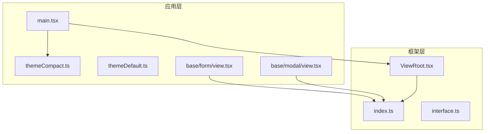
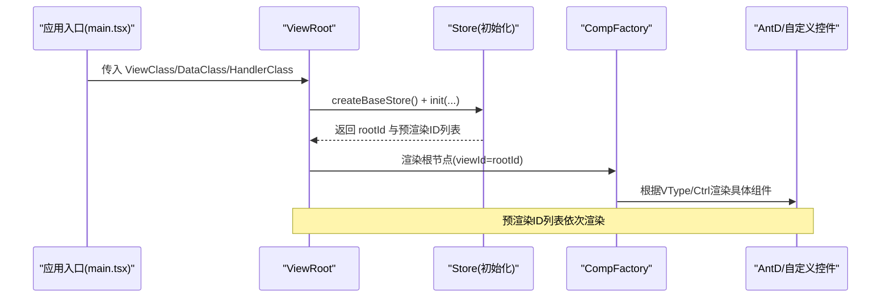
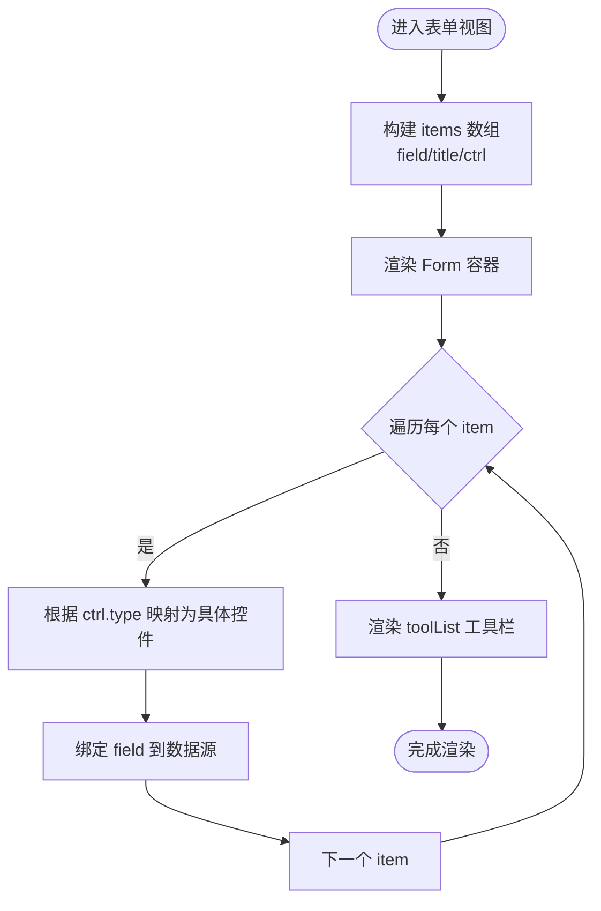
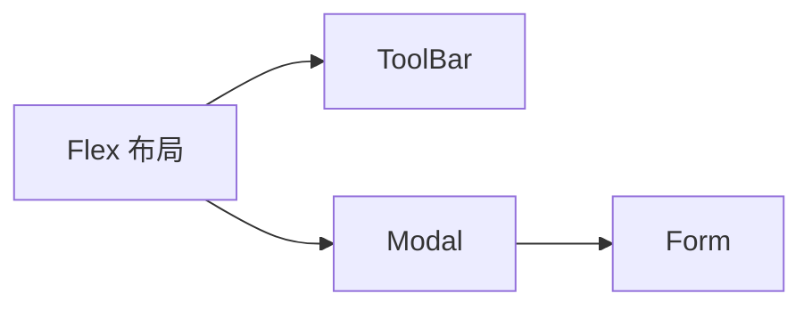
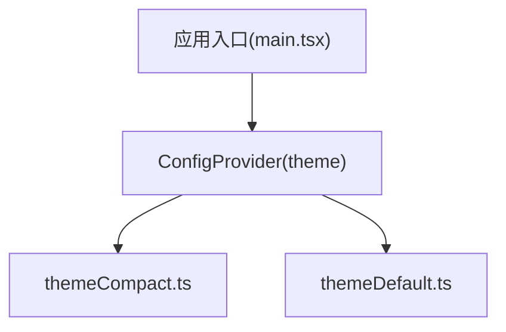
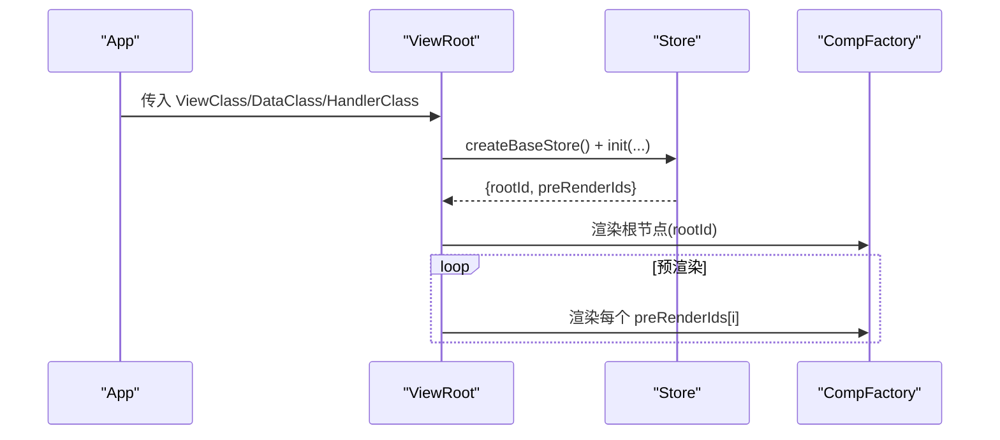
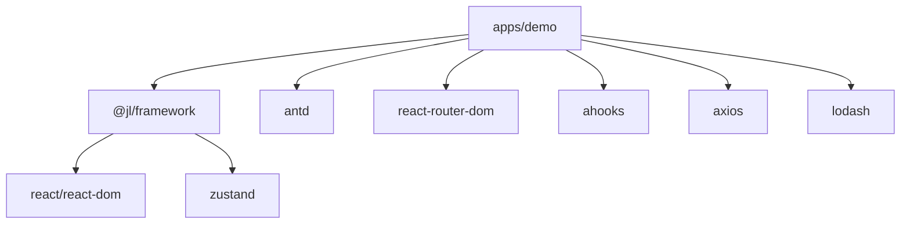

# 基础组件

<cite>
**本文引用的文件**
- [apps/demo/src/main.tsx](file://apps/demo/src/main.tsx)
- [apps/demo/package.json](file://apps/demo/package.json)
- [apps/demo/src/theme/themeCompact.ts](file://apps/demo/src/theme/themeCompact.ts)
- [apps/demo/src/theme/themeDefault.ts](file://apps/demo/src/theme/themeDefault.ts)
- [packages/framework/src/index.ts](file://packages/framework/src/index.ts)
- [packages/framework/src/interface.ts](file://packages/framework/src/interface.ts)
- [packages/framework/src/ViewRoot.tsx](file://packages/framework/src/ViewRoot.tsx)
- [apps/demo/src/pages/base/form/view.tsx](file://apps/demo/src/pages/base/form/view.tsx)
- [apps/demo/src/pages/base/modal/view.tsx](file://apps/demo/src/pages/base/modal/view.tsx)
</cite>

## 目录
1. [简介](#简介)
2. [项目结构](#项目结构)
3. [核心组件](#核心组件)
4. [架构总览](#架构总览)
5. [详细组件分析](#详细组件分析)
6. [依赖关系分析](#依赖关系分析)
7. [性能考虑](#性能考虑)
8. [故障排查指南](#故障排查指南)
9. [结论](#结论)
10. [附录](#附录)

## 简介
本章节面向使用与二次开发团队，系统化梳理本项目中的“基础UI组件”能力。项目采用声明式视图配置驱动渲染的方式，通过统一的控件枚举、视图类型与工厂机制，将常用表单与展示类组件（如按钮、输入框、选择器、日期/时间选择器等）以数据驱动的形式组合到页面中。同时提供主题定制入口与响应式布局能力，便于在不同业务场景下快速构建一致的用户界面。

## 项目结构
- 应用层（apps/demo）：负责路由、布局、主题与示例页面，演示如何使用框架提供的视图与控件。
- 框架层（packages/framework）：提供统一的基础设施，包括根视图容器、视图基类、控件与视图类型定义、工厂方法、状态管理与工具等。

图表来源
- [apps/demo/src/main.tsx:1-53](file://apps/demo/src/main.tsx#L1-L53)
- [apps/demo/src/theme/themeCompact.ts:1-16](file://apps/demo/src/theme/themeCompact.ts#L1-L16)
- [apps/demo/src/theme/themeDefault.ts:1-16](file://apps/demo/src/theme/themeDefault.ts#L1-L16)
- [packages/framework/src/index.ts:1-69](file://packages/framework/src/index.ts#L1-L69)
- [packages/framework/src/ViewRoot.tsx:1-49](file://packages/framework/src/ViewRoot.tsx#L1-L49)

章节来源
- [apps/demo/src/main.tsx:1-53](file://apps/demo/src/main.tsx#L1-L53)
- [apps/demo/package.json:1-44](file://apps/demo/package.json#L1-L44)

## 核心组件
- 根视图容器 ViewRoot：负责创建并注入全局 Store，初始化视图树，并渲染根节点及其预渲染子节点。
- 视图基类 ViewBase：用于声明式定义页面结构与控件配置，结合 VType/Ctrl 枚举进行组合。
- 控件与视图类型：
  - 视图类型 VType：包含布局（Flex、Modal、Drawer、Tab）、工具栏、表单、表格等。
  - 控件类型 Ctrl：包含 Button、Input、Select、Switch、Radio、Checkbox、Date、DateRange、Time、TimeRange、Link、Upload 等。
- 主题系统：通过 antd ConfigProvider 注入主题配置，支持紧凑/默认主题切换。

章节来源
- [packages/framework/src/index.ts:1-69](file://packages/framework/src/index.ts#L1-L69)
- [packages/framework/src/interface.ts:1-35](file://packages/framework/src/interface.ts#L1-L35)
- [apps/demo/src/main.tsx:1-53](file://apps/demo/src/main.tsx#L1-L53)

## 架构总览
下图展示了从应用启动到视图渲染的关键流程：应用入口引入主题与路由，挂载根视图；根视图创建 Store 并初始化视图树；工厂根据配置渲染具体控件。

图表来源
- [apps/demo/src/main.tsx:1-53](file://apps/demo/src/main.tsx#L1-L53)
- [packages/framework/src/ViewRoot.tsx:1-49](file://packages/framework/src/ViewRoot.tsx#L1-L49)
- [packages/framework/src/index.ts:1-69](file://packages/framework/src/index.ts#L1-L69)

## 详细组件分析

### 表单与控件（Form 及 Ctrl.*）
- 用途：通过声明式 items 数组描述表单字段，支持多种控件类型（文本、输入、选择、开关、单选、复选、日期/时间范围、链接、上传等）。
- 关键特性：
  - 字段映射：每个 item 通过 field 绑定数据路径，title 作为标签。
  - 控件扩展：通过 ctrl.type 指定具体控件，并可携带 items、href 等属性。
  - 工具栏：toolList 可放置按钮等操作项，绑定 handler 回调。
- 使用示例参考：
  - 表单页：[apps/demo/src/pages/base/form/view.tsx:1-99](file://apps/demo/src/pages/base/form/view.tsx#L1-L99)
  - 弹出框内嵌表单：[apps/demo/src/pages/base/modal/view.tsx:1-46](file://apps/demo/src/pages/base/modal/view.tsx#L1-L46)

图表来源
- [apps/demo/src/pages/base/form/view.tsx:1-99](file://apps/demo/src/pages/base/form/view.tsx#L1-L99)

章节来源
- [apps/demo/src/pages/base/form/view.tsx:1-99](file://apps/demo/src/pages/base/form/view.tsx#L1-L99)
- [apps/demo/src/pages/base/modal/view.tsx:1-46](file://apps/demo/src/pages/base/modal/view.tsx#L1-L46)
- [packages/framework/src/index.ts:1-69](file://packages/framework/src/index.ts#L1-L69)

### 布局与容器（Flex、Modal、Drawer、Tab、ToolBar）
- Flex：用于组合多个子视图或控件，形成灵活的页面布局。
- Modal/Drawer：弹窗与侧边抽屉，常用于承载表单或详情内容。
- Tab：多标签页容器，适合复杂页面的分区展示。
- ToolBar：顶部工具栏，集中放置操作按钮。
- 使用示例参考：
  - 在 Modal 中嵌入 Form：[apps/demo/src/pages/base/modal/view.tsx:1-46](file://apps/demo/src/pages/base/modal/view.tsx#L1-L46)
  - 在 Flex 中组合 Toolbar 与 Modal：同上

图表来源
- [apps/demo/src/pages/base/modal/view.tsx:1-46](file://apps/demo/src/pages/base/modal/view.tsx#L1-L46)

章节来源
- [apps/demo/src/pages/base/modal/view.tsx:1-46](file://apps/demo/src/pages/base/modal/view.tsx#L1-L46)

### 主题与样式定制
- 通过 antd 的 ConfigProvider 注入主题配置，支持紧凑算法与 token 覆盖。
- 项目内置两种主题：紧凑主题与默认主题，可在不同环境或用户偏好间切换。
- 使用位置：应用入口挂载时包裹整个应用。

图表来源
- [apps/demo/src/main.tsx:1-53](file://apps/demo/src/main.tsx#L1-L53)
- [apps/demo/src/theme/themeCompact.ts:1-16](file://apps/demo/src/theme/themeCompact.ts#L1-L16)
- [apps/demo/src/theme/themeDefault.ts:1-16](file://apps/demo/src/theme/themeDefault.ts#L1-L16)

章节来源
- [apps/demo/src/main.tsx:1-53](file://apps/demo/src/main.tsx#L1-L53)
- [apps/demo/src/theme/themeCompact.ts:1-16](file://apps/demo/src/theme/themeCompact.ts#L1-L16)
- [apps/demo/src/theme/themeDefault.ts:1-16](file://apps/demo/src/theme/themeDefault.ts#L1-L16)

### 根视图与渲染管线
- ViewRoot 负责：
  - 创建并缓存 Store，避免 StrictMode 重复初始化。
  - 调用 store.init 获取根视图 ID 与预渲染 ID 列表。
  - 通过 CompFactory 按 viewId 渲染对应组件。
- 该设计使页面结构完全由配置驱动，降低样板代码，提升一致性。

图表来源
- [packages/framework/src/ViewRoot.tsx:1-49](file://packages/framework/src/ViewRoot.tsx#L1-L49)

章节来源
- [packages/framework/src/ViewRoot.tsx:1-49](file://packages/framework/src/ViewRoot.tsx#L1-L49)
- [packages/framework/src/index.ts:1-69](file://packages/framework/src/index.ts#L1-L69)

## 依赖关系分析
- 应用依赖：
  - antd、@ant-design/icons、react-router-dom、ahooks、axios、lodash、simplebar-react 等。
  - 通过 workspace 方式引入 @jl/framework。
- 框架导出：
  - 视图类型 VType、控件类型 Ctrl、视图基类 ViewBase、根视图 ViewRoot、数据处理与工具类等。

图表来源
- [apps/demo/package.json:1-44](file://apps/demo/package.json#L1-L44)
- [packages/framework/package.json:1-52](file://packages/framework/package.json#L1-L52)
- [packages/framework/src/index.ts:1-69](file://packages/framework/src/index.ts#L1-L69)

章节来源
- [apps/demo/package.json:1-44](file://apps/demo/package.json#L1-L44)
- [packages/framework/package.json:1-52](file://packages/framework/package.json#L1-L52)
- [packages/framework/src/index.ts:1-69](file://packages/framework/src/index.ts#L1-L69)

## 性能考虑
- 根视图 Store 单例化：通过 useRef 确保 Store 仅创建一次，避免 StrictMode 下的重复初始化开销。
- 预渲染子节点：在初始化阶段计算并渲染必要的子节点，减少首屏重排。
- 按需加载与路由懒加载：结合 react-router 的路由拆分与 Suspense 使用，降低初始包体。
- 主题与样式：使用紧凑算法减少间距与尺寸，有助于在小屏设备上获得更好的信息密度。

章节来源
- [packages/framework/src/ViewRoot.tsx:1-49](file://packages/framework/src/ViewRoot.tsx#L1-L49)
- [apps/demo/src/main.tsx:1-53](file://apps/demo/src/main.tsx#L1-L53)

## 故障排查指南
- 根视图未渲染：检查 ViewRoot 是否收到有效的 ViewClass/DataClass/HandlerClass，以及 store.init 是否正确返回 rootId。
- 主题不生效：确认应用入口已用 ConfigProvider 包裹且 theme 正确传入；检查 theme 文件中 components/token 配置是否覆盖预期。
- 控件不显示：核对 items 中 ctrl.type 是否与 VType/Ctrl 枚举匹配；确认 field 与数据源路径一致。
- 弹窗/抽屉无法打开：检查布局结构中 Modal/Drawer 的 viewId 是否正确指向目标视图，并在工具栏中触发正确的 handler。

章节来源
- [packages/framework/src/ViewRoot.tsx:1-49](file://packages/framework/src/ViewRoot.tsx#L1-L49)
- [apps/demo/src/main.tsx:1-53](file://apps/demo/src/main.tsx#L1-L53)
- [apps/demo/src/pages/base/modal/view.tsx:1-46](file://apps/demo/src/pages/base/modal/view.tsx#L1-L46)

## 结论
本项目通过“配置驱动 + 工厂渲染”的方式，将常用表单与展示类组件抽象为统一的控件与视图类型，配合主题系统与根视图容器，实现了高内聚、低耦合的基础组件体系。借助声明式配置，开发者可以快速组合出复杂的页面结构，同时保持风格一致与维护成本可控。

## 附录
- 常用控件清单（基于示例与类型导出）：Button、Input、Select、Switch、Radio、Checkbox、Date、DateRange、Time、TimeRange、Link、Upload。
- 布局与容器：Flex、Modal、Drawer、Tab、ToolBar。
- 主题：紧凑主题与默认主题，可通过 ConfigProvider 切换。
- 参考实现：
  - 表单与控件组合：[apps/demo/src/pages/base/form/view.tsx:1-99](file://apps/demo/src/pages/base/form/view.tsx#L1-L99)
  - 弹窗内嵌表单：[apps/demo/src/pages/base/modal/view.tsx:1-46](file://apps/demo/src/pages/base/modal/view.tsx#L1-L46)
  - 主题配置：[apps/demo/src/theme/themeCompact.ts:1-16](file://apps/demo/src/theme/themeCompact.ts#L1-L16)、[apps/demo/src/theme/themeDefault.ts:1-16](file://apps/demo/src/theme/themeDefault.ts#L1-L16)
  - 框架导出与类型：[packages/framework/src/index.ts:1-69](file://packages/framework/src/index.ts#L1-L69)