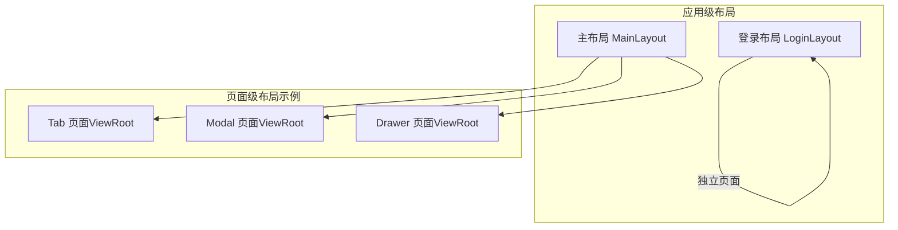
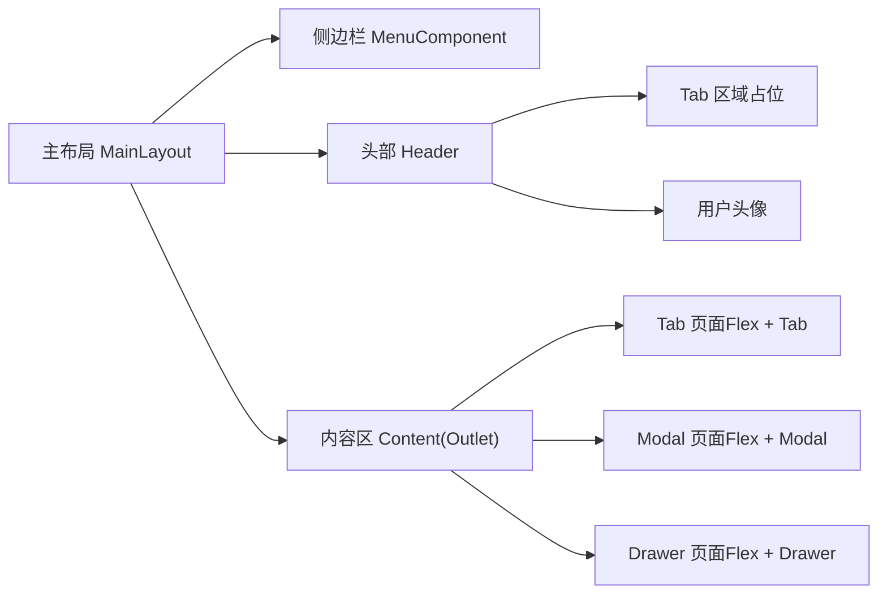
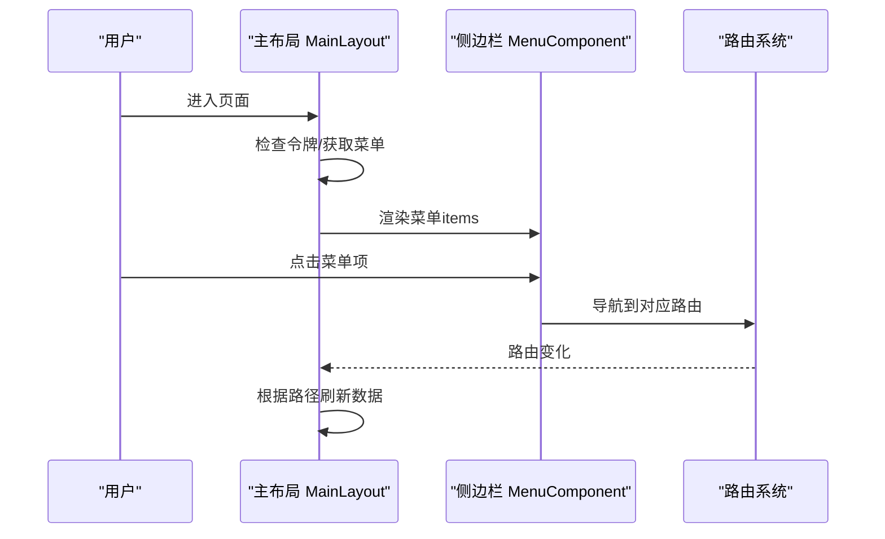
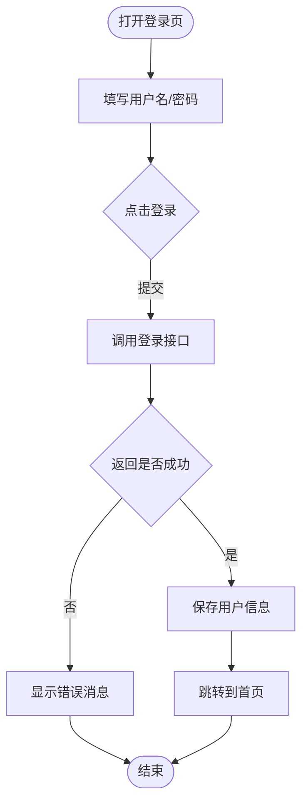
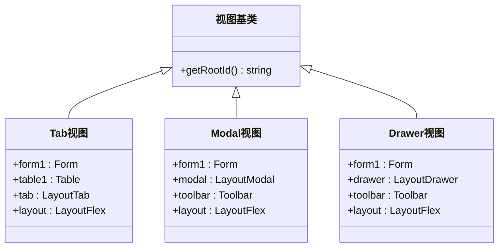
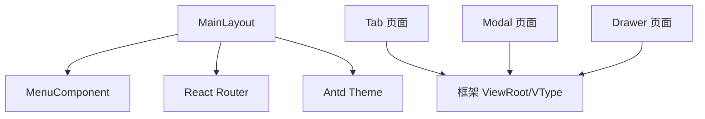

# 布局组件

<cite>
**本文引用的文件**
- [MainLayout.tsx](file://apps/demo/src/layouts/main/MainLayout.tsx)
- [Menu.tsx](file://apps/demo/src/layouts/main/comp/Menu.tsx)
- [styles.less（主布局）](file://apps/demo/src/layouts/main/styles.less)
- [Menu.less](file://apps/demo/src/layouts/main/comp/Menu.less)
- [LoginLayout.tsx](file://apps/demo/src/layouts/login/LoginLayout.tsx)
- [styles.less（登录布局）](file://apps/demo/src/layouts/login/styles.less)
- [Tab 页面入口](file://apps/demo/src/pages/base/tab/index.tsx)
- [Tab 视图定义](file://apps/demo/src/pages/base/tab/view.tsx)
- [Modal 页面入口](file://apps/demo/src/pages/base/modal/index.tsx)
- [Modal 视图定义](file://apps/demo/src/pages/base/modal/view.tsx)
- [Drawer 页面入口](file://apps/demo/src/pages/base/drawer/index.tsx)
- [Drawer 视图定义](file://apps/demo/src/pages/base/drawer/view.tsx)
</cite>

## 目录
1. [简介](#简介)
2. [项目结构](#项目结构)
3. [核心组件](#核心组件)
4. [架构总览](#架构总览)
5. [详细组件分析](#详细组件分析)
6. [依赖关系分析](#依赖关系分析)
7. [性能考虑](#性能考虑)
8. [故障排查指南](#故障排查指南)
9. [结论](#结论)
10. [附录](#附录)

## 简介
本章节面向项目中与“布局”相关的容器与组合能力，涵盖：
- 应用级布局：主布局（侧边栏 + 顶部导航 + 内容区）、登录布局
- 页面内布局：Flex 容器、Tab 标签页、Modal 模态框、Drawer 抽屉
- 配置项、嵌套结构、尺寸控制、交互行为、响应式模式、性能与最佳实践

## 项目结构
- 应用级布局位于 layouts 目录：
  - 主布局：包含可折叠侧边栏、顶部区域（触发按钮、Tab 区域占位、用户头像）、内容区（路由 Outlet 滚动容器）
  - 登录布局：居中卡片表单，带渐变背景与响应式样式
- 页面级布局通过框架的 ViewRoot 组织，使用 VType 声明式配置 Flex、Tab、Modal、Drawer 等布局容器，并嵌入表单、表格等业务组件

图表来源
- [MainLayout.tsx:1-77](file://apps/demo/src/layouts/main/MainLayout.tsx#L1-L77)
- [LoginLayout.tsx:1-99](file://apps/demo/src/layouts/login/LoginLayout.tsx#L1-L99)
- [Tab 视图定义:1-60](file://apps/demo/src/pages/base/tab/view.tsx#L1-L60)
- [Modal 视图定义:1-46](file://apps/demo/src/pages/base/modal/view.tsx#L1-L46)
- [Drawer 视图定义:1-47](file://apps/demo/src/pages/base/drawer/view.tsx#L1-L47)

章节来源
- [MainLayout.tsx:1-77](file://apps/demo/src/layouts/main/MainLayout.tsx#L1-L77)
- [LoginLayout.tsx:1-99](file://apps/demo/src/layouts/login/LoginLayout.tsx#L1-L99)

## 核心组件
- 主布局（MainLayout）
  - 结构：侧边栏（菜单）+ 头部（折叠按钮、Tab 区域、用户头像）+ 内容区（Outlet 滚动容器）
  - 状态：侧边栏折叠/展开、菜单数据加载、路由变化时刷新
  - 主题：使用 Ant Design 主题 token 控制背景色
- 登录布局（LoginLayout）
  - 结构：全屏渐变背景 + 居中卡片 + 表单（用户名/密码）+ 登录按钮
  - 交互：提交后调用登录接口，成功后写入用户信息并跳转首页
- 页面级布局容器（基于框架）
  - Flex：用于将多个子视图按行/列排列
  - Tab：将多个子视图以标签页形式组织
  - Modal：以模态框承载子视图
  - Drawer：以抽屉形式承载子视图，支持宽度配置

章节来源
- [MainLayout.tsx:1-77](file://apps/demo/src/layouts/main/MainLayout.tsx#L1-L77)
- [LoginLayout.tsx:1-99](file://apps/demo/src/layouts/login/LoginLayout.tsx#L1-L99)
- [Tab 视图定义:1-60](file://apps/demo/src/pages/base/tab/view.tsx#L1-L60)
- [Modal 视图定义:1-46](file://apps/demo/src/pages/base/modal/view.tsx#L1-L46)
- [Drawer 视图定义:1-47](file://apps/demo/src/pages/base/drawer/view.tsx#L1-L47)

## 架构总览
下图展示了主布局与页面级布局的组合方式，以及各容器之间的嵌套关系。

图表来源
- [MainLayout.tsx:1-77](file://apps/demo/src/layouts/main/MainLayout.tsx#L1-L77)
- [Menu.tsx:1-53](file://apps/demo/src/layouts/main/comp/Menu.tsx#L1-L53)
- [Tab 视图定义:1-60](file://apps/demo/src/pages/base/tab/view.tsx#L1-L60)
- [Modal 视图定义:1-46](file://apps/demo/src/pages/base/modal/view.tsx#L1-L46)
- [Drawer 视图定义:1-47](file://apps/demo/src/pages/base/drawer/view.tsx#L1-L47)

## 详细组件分析

### 主布局（MainLayout）
- 结构与职责
  - 侧边栏：可折叠，承载菜单；菜单项点击后切换路由
  - 头部：折叠按钮、Tab 区域占位、用户头像
  - 内容区：包裹路由 Outlet，提供滚动容器
- 关键配置与行为
  - 侧边栏折叠：通过状态控制 collapsed，切换图标与菜单宽度
  - 菜单数据：异步获取菜单，失败时提示错误
  - 路由联动：监听路由变化，必要时刷新菜单或校验令牌
  - 主题背景：使用主题 token 设置头部和内容区背景
- 尺寸与滚动
  - 内容区高度限制为视口减去头部高度，内部使用滚动容器
- 响应式
  - 通过 CSS 控制最小/最大高度与溢出隐藏，保证全高布局

图表来源
- [MainLayout.tsx:1-77](file://apps/demo/src/layouts/main/MainLayout.tsx#L1-L77)
- [Menu.tsx:1-53](file://apps/demo/src/layouts/main/comp/Menu.tsx#L1-L53)

章节来源
- [MainLayout.tsx:1-77](file://apps/demo/src/layouts/main/MainLayout.tsx#L1-L77)
- [Menu.tsx:1-53](file://apps/demo/src/layouts/main/comp/Menu.tsx#L1-L53)
- [styles.less（主布局）:1-45](file://apps/demo/src/layouts/main/styles.less#L1-L45)
- [Menu.less:1-31](file://apps/demo/src/layouts/main/comp/Menu.less#L1-L31)

### 登录布局（LoginLayout）
- 结构与职责
  - 全屏渐变背景 + 居中卡片
  - 表单：用户名、密码，带基础校验规则
  - 操作：登录按钮触发登录流程，成功后跳转首页
- 交互与错误处理
  - 登录请求失败或返回异常时显示错误消息
  - 成功时更新用户信息并导航至首页
- 响应式
  - 小屏下调整内边距、字号与按钮高度，提升可用性

图表来源
- [LoginLayout.tsx:1-99](file://apps/demo/src/layouts/login/LoginLayout.tsx#L1-L99)
- [styles.less（登录布局）:1-189](file://apps/demo/src/layouts/login/styles.less#L1-L189)

章节来源
- [LoginLayout.tsx:1-99](file://apps/demo/src/layouts/login/LoginLayout.tsx#L1-L99)
- [styles.less（登录布局）:1-189](file://apps/demo/src/layouts/login/styles.less#L1-L189)

### 页面级布局容器（Flex / Tab / Modal / Drawer）
- 通用组织方式
  - 每个页面通过 ViewRoot 挂载，并在 View 类中声明布局树
  - 使用 VType 指定容器类型，通过 items 或 viewId 建立父子关系
- Flex 容器
  - 作用：将多个子视图按行/列排列
  - 典型用法：在页面根节点声明一个 Flex，并将工具栏、内容区等作为子项
- Tab 标签页
  - 作用：将多个子视图以标签页形式组织
  - 配置要点：为每个 tab 指定 key、label 与关联的 viewId
- Modal 模态框
  - 作用：以模态框承载子视图（如表单）
  - 配置要点：指定 viewId，配合工具栏按钮触发打开
- Drawer 抽屉
  - 作用：以抽屉形式承载子视图（如表单），支持宽度配置
  - 配置要点：指定 width 与 viewId，配合工具栏按钮触发打开

图表来源
- [Tab 视图定义:1-60](file://apps/demo/src/pages/base/tab/view.tsx#L1-L60)
- [Modal 视图定义:1-46](file://apps/demo/src/pages/base/modal/view.tsx#L1-L46)
- [Drawer 视图定义:1-47](file://apps/demo/src/pages/base/drawer/view.tsx#L1-L47)

章节来源
- [Tab 页面入口:1-9](file://apps/demo/src/pages/base/tab/index.tsx#L1-L9)
- [Tab 视图定义:1-60](file://apps/demo/src/pages/base/tab/view.tsx#L1-L60)
- [Modal 页面入口:1-9](file://apps/demo/src/pages/base/modal/index.tsx#L1-L9)
- [Modal 视图定义:1-46](file://apps/demo/src/pages/base/modal/view.tsx#L1-L46)
- [Drawer 页面入口:1-10](file://apps/demo/src/pages/base/drawer/index.tsx#L1-L10)
- [Drawer 视图定义:1-47](file://apps/demo/src/pages/base/drawer/view.tsx#L1-L47)

## 依赖关系分析
- 主布局依赖
  - 侧边栏组件：负责菜单渲染与路由跳转
  - 路由系统：监听路径变化，驱动内容区切换
  - 主题系统：通过 token 控制颜色
- 页面级布局依赖
  - 框架提供的 ViewRoot 与 VType 体系，用于声明式构建布局树
  - 业务组件（Form/Table）作为子视图被容器引用

图表来源
- [MainLayout.tsx:1-77](file://apps/demo/src/layouts/main/MainLayout.tsx#L1-L77)
- [Menu.tsx:1-53](file://apps/demo/src/layouts/main/comp/Menu.tsx#L1-L53)
- [Tab 视图定义:1-60](file://apps/demo/src/pages/base/tab/view.tsx#L1-L60)
- [Modal 视图定义:1-46](file://apps/demo/src/pages/base/modal/view.tsx#L1-L46)
- [Drawer 视图定义:1-47](file://apps/demo/src/pages/base/drawer/view.tsx#L1-L47)

章节来源
- [MainLayout.tsx:1-77](file://apps/demo/src/layouts/main/MainLayout.tsx#L1-L77)
- [Menu.tsx:1-53](file://apps/demo/src/layouts/main/comp/Menu.tsx#L1-L53)
- [Tab 视图定义:1-60](file://apps/demo/src/pages/base/tab/view.tsx#L1-L60)
- [Modal 视图定义:1-46](file://apps/demo/src/pages/base/modal/view.tsx#L1-L46)
- [Drawer 视图定义:1-47](file://apps/demo/src/pages/base/drawer/view.tsx#L1-L47)

## 性能考虑
- 滚动性能
  - 内容区与侧边栏均使用滚动容器，避免整页滚动带来的重排与抖动
- 渲染优化
  - 菜单项与页面内容按需渲染，减少首屏压力
  - 使用路由懒加载（由路由层保障）降低初始包体
- 交互体验
  - 折叠/展开侧边栏仅改变布局状态，不重建整个页面
  - 模态框与抽屉仅在触发时渲染，避免常驻开销
- 样式与动画
  - 登录页使用轻量动画与过渡，注意在小屏设备上保持流畅

[本节为通用指导，无需特定文件来源]

## 故障排查指南
- 主布局
  - 菜单数据为空：检查网络请求与错误提示逻辑，确认 API 返回码与数据结构
  - 内容区高度异常：检查头部高度与内容区滚动容器的高度计算是否正确
- 登录布局
  - 登录失败：查看接口返回信息与错误消息展示逻辑
  - 登录后未跳转：检查用户信息写入与路由跳转顺序
- 页面级布局
  - Tab/Modal/Drawer 未显示：确认 viewId 引用是否正确，容器 items 是否包含对应子视图
  - 抽屉宽度异常：检查 width 配置是否合理，是否与内容宽度冲突

章节来源
- [MainLayout.tsx:1-77](file://apps/demo/src/layouts/main/MainLayout.tsx#L1-L77)
- [LoginLayout.tsx:1-99](file://apps/demo/src/layouts/login/LoginLayout.tsx#L1-L99)
- [Tab 视图定义:1-60](file://apps/demo/src/pages/base/tab/view.tsx#L1-L60)
- [Modal 视图定义:1-46](file://apps/demo/src/pages/base/modal/view.tsx#L1-L46)
- [Drawer 视图定义:1-47](file://apps/demo/src/pages/base/drawer/view.tsx#L1-L47)

## 结论
- 主布局提供了稳定的应用外壳，结合侧边栏、头部与内容区，满足后台管理常见需求
- 页面级布局通过声明式配置快速组合 Flex、Tab、Modal、Drawer，便于扩展与维护
- 通过合理的滚动容器、主题系统与路由联动，兼顾了性能与用户体验
- 建议在实际项目中遵循上述最佳实践，确保布局一致性与可维护性

[本节为总结性内容，无需特定文件来源]

## 附录
- 常用配置速查
  - Flex：用于排列多个子视图，适合工具栏 + 内容的横向布局
  - Tab：为每个标签页配置 key、label 与 viewId，实现多视图切换
  - Modal：以 viewId 绑定子视图，通过工具栏按钮触发打开
  - Drawer：以 viewId 绑定子视图，支持 width 控制宽度，适合编辑场景
- 响应式设计建议
  - 使用媒体查询调整间距、字号与控件尺寸
  - 在小屏设备上优先保证核心功能可用，适当简化布局复杂度

[本节为补充说明，无需特定文件来源]