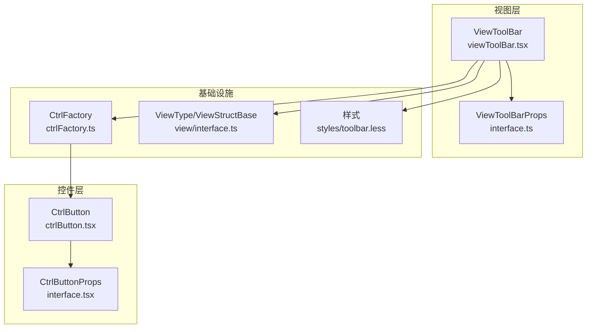
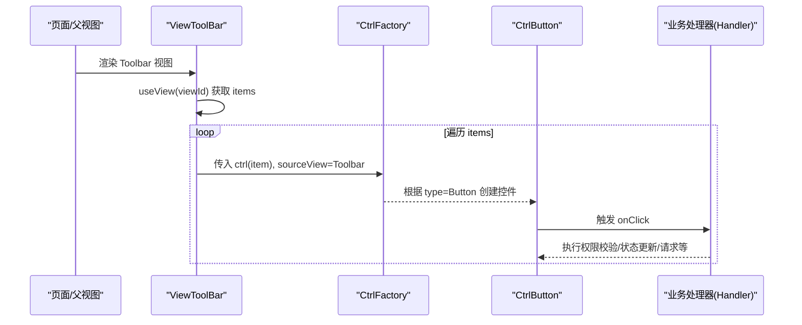
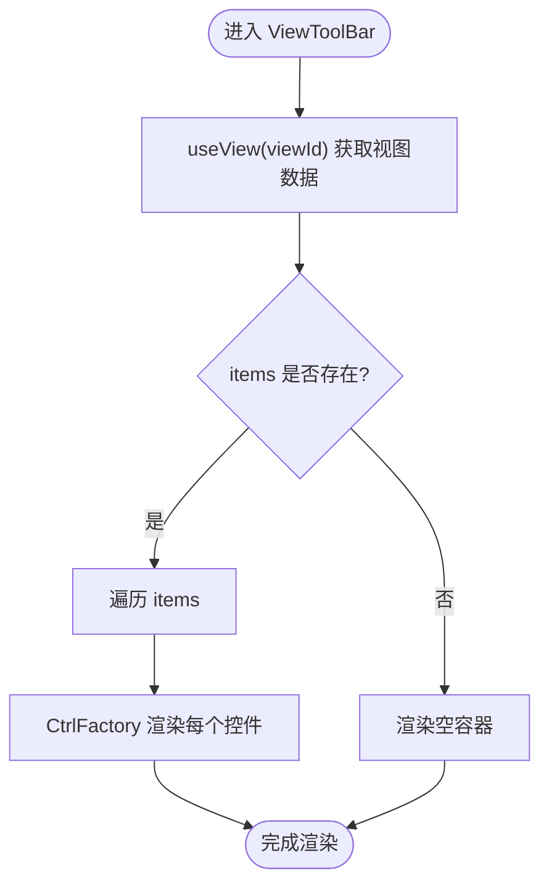
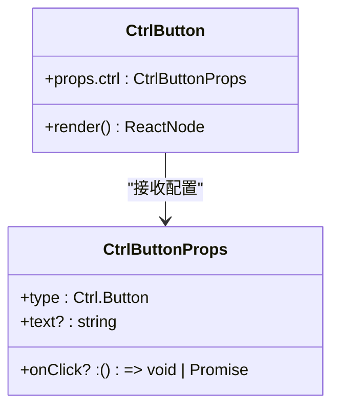
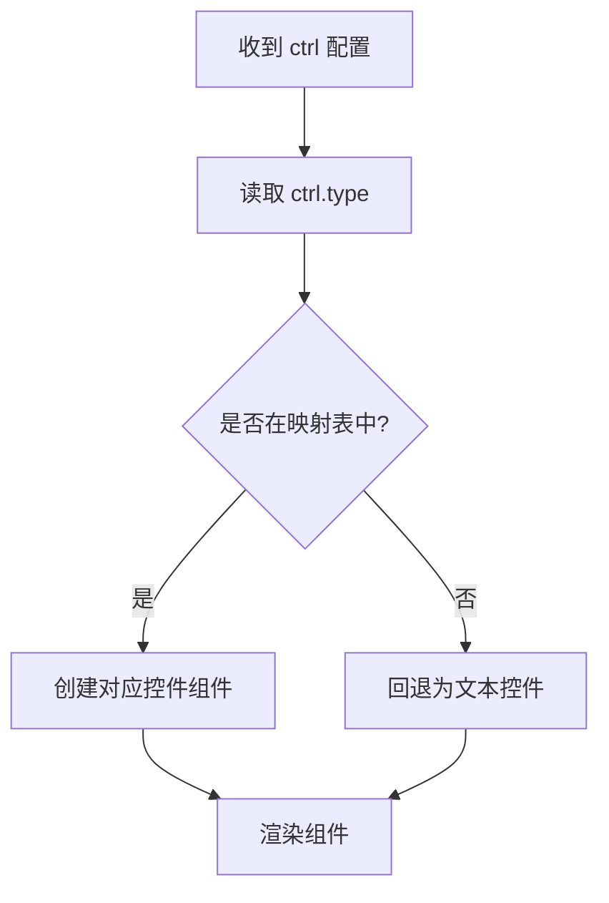
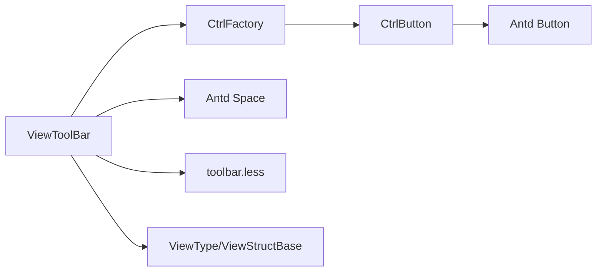

# 工具栏组件

<cite>
**本文引用的文件**
- [packages/framework/src/comp/view/toolbar/interface.ts](file://packages/framework/src/comp/view/toolbar/interface.ts)
- [packages/framework/src/comp/view/toolbar/viewToolBar.tsx](file://packages/framework/src/comp/view/toolbar/viewToolBar.tsx)
- [packages/framework/src/comp/view/toolbar/styles/toolbar.less](file://packages/framework/src/comp/view/toolbar/styles/toolbar.less)
- [packages/framework/src/comp/control/button/interface.tsx](file://packages/framework/src/comp/control/button/interface.tsx)
- [packages/framework/src/comp/control/button/ctrlButton.tsx](file://packages/framework/src/comp/control/button/ctrlButton.tsx)
- [packages/framework/src/comp/ctrlFactory.ts](file://packages/framework/src/comp/ctrlFactory.ts)
- [packages/framework/src/comp/view/interface.ts](file://packages/framework/src/comp/view/interface.ts)
- [packages/framework/src/index.ts](file://packages/framework/src/index.ts)
- [docs/2.组件用法.md](file://docs/2.组件用法.md)
</cite>

## 目录
1. [简介](#简介)
2. [项目结构](#项目结构)
3. [核心组件](#核心组件)
4. [架构总览](#架构总览)
5. [详细组件分析](#详细组件分析)
6. [依赖关系分析](#依赖关系分析)
7. [性能考量](#性能考量)
8. [故障排查指南](#故障排查指南)
9. [结论](#结论)
10. [附录](#附录)

## 简介
本章节面向使用与二次开发该框架的工程师，系统化说明“工具栏组件”的配置、渲染机制、按钮操作、事件处理以及与业务逻辑的集成方式。工具栏以声明式配置驱动，通过统一的控件工厂将按钮等控件渲染到页面顶部区域，便于在表格页、表单页或自定义页面中统一放置操作入口。

## 项目结构
工具栏相关代码位于框架包内，采用“视图-控件-工厂”的分层组织：
- 视图定义：工具栏视图类型、属性接口
- 视图实现：工具栏容器与布局
- 控件定义：按钮控件的类型与实现
- 控件工厂：根据配置动态创建控件实例
- 样式：工具栏容器与间距样式

图表来源
- [packages/framework/src/comp/view/toolbar/viewToolBar.tsx:1-24](file://packages/framework/src/comp/view/toolbar/viewToolBar.tsx#L1-L24)
- [packages/framework/src/comp/view/toolbar/interface.ts:1-11](file://packages/framework/src/comp/view/toolbar/interface.ts#L1-L11)
- [packages/framework/src/comp/control/button/ctrlButton.tsx:1-22](file://packages/framework/src/comp/control/button/ctrlButton.tsx#L1-L22)
- [packages/framework/src/comp/control/button/interface.tsx:1-8](file://packages/framework/src/comp/control/button/interface.tsx#L1-L8)
- [packages/framework/src/comp/ctrlFactory.ts:1-44](file://packages/framework/src/comp/ctrlFactory.ts#L1-L44)
- [packages/framework/src/comp/view/interface.ts:1-109](file://packages/framework/src/comp/view/interface.ts#L1-L109)
- [packages/framework/src/comp/view/toolbar/styles/toolbar.less:1-10](file://packages/framework/src/comp/view/toolbar/styles/toolbar.less#L1-L10)

章节来源
- [packages/framework/src/comp/view/toolbar/viewToolBar.tsx:1-24](file://packages/framework/src/comp/view/toolbar/viewToolBar.tsx#L1-L24)
- [packages/framework/src/comp/view/toolbar/interface.ts:1-11](file://packages/framework/src/comp/view/toolbar/interface.ts#L1-L11)
- [packages/framework/src/comp/ctrlFactory.ts:1-44](file://packages/framework/src/comp/ctrlFactory.ts#L1-L44)
- [packages/framework/src/comp/view/interface.ts:1-109](file://packages/framework/src/comp/view/interface.ts#L1-L109)
- [packages/framework/src/comp/view/toolbar/styles/toolbar.less:1-10](file://packages/framework/src/comp/view/toolbar/styles/toolbar.less#L1-L10)

## 核心组件
- 工具栏视图（ViewToolBar）
  - 职责：读取当前视图配置中的 items，使用 Ant Design Space 进行横向排列，并通过控件工厂将每个 item 渲染为具体控件（如按钮）。
  - 关键特性：基于 useView 获取视图数据；支持空数组与 undefined 的安全渲染；提供容器与间距样式类名。
- 按钮控件（CtrlButton）
  - 职责：将配置项渲染为可点击按钮，绑定 onClick 回调，文本来自 text 字段。
  - 关键特性：当 ctrl 未定义时不渲染任何内容；默认使用 Ant Design Button。
- 控件工厂（CtrlFactory）
  - 职责：根据 ctrl.type 映射到具体控件组件并渲染。
  - 关键特性：集中维护控件类型映射；未知类型回退为文本控件；统一传入 props。

章节来源
- [packages/framework/src/comp/view/toolbar/viewToolBar.tsx:1-24](file://packages/framework/src/comp/view/toolbar/viewToolBar.tsx#L1-L24)
- [packages/framework/src/comp/control/button/ctrlButton.tsx:1-22](file://packages/framework/src/comp/control/button/ctrlButton.tsx#L1-L22)
- [packages/framework/src/comp/ctrlFactory.ts:1-44](file://packages/framework/src/comp/ctrlFactory.ts#L1-L44)

## 架构总览
工具栏通过“配置驱动 + 控件工厂”的方式工作：
- 页面在视图配置中声明一个类型为 ViewType.Toolbar 的视图节点，并提供 items 数组。
- 工具栏视图读取 items，遍历并使用 CtrlFactory 将每个 item 渲染为对应控件。
- 按钮控件负责将 onClick 事件与业务处理器对接，完成权限控制、状态同步等操作。

图表来源
- [packages/framework/src/comp/view/toolbar/viewToolBar.tsx:1-24](file://packages/framework/src/comp/view/toolbar/viewToolBar.tsx#L1-L24)
- [packages/framework/src/comp/ctrlFactory.ts:1-44](file://packages/framework/src/comp/ctrlFactory.ts#L1-L44)
- [packages/framework/src/comp/control/button/ctrlButton.tsx:1-22](file://packages/framework/src/comp/control/button/ctrlButton.tsx#L1-L22)

## 详细组件分析

### 工具栏视图（ViewToolBar）
- 配置项
  - id：唯一标识，用于视图树引用与数据绑定
  - type：固定为 ViewType.Toolbar
  - items：按钮控件配置数组，元素类型为 CtrlButtonProps
- 渲染逻辑
  - 使用 Ant Design Space 作为容器，保证按钮间间距一致
  - 对 items 进行安全遍历，空值情况下不报错
  - 通过 CtrlFactory 将每个 item 渲染为具体控件，并传递 sourceView=Toolbar 以便后续上下文识别
- 样式
  - 容器背景白色，上下留白，底部外边距
  - Space 宽度占满，左对齐

图表来源
- [packages/framework/src/comp/view/toolbar/viewToolBar.tsx:1-24](file://packages/framework/src/comp/view/toolbar/viewToolBar.tsx#L1-L24)
- [packages/framework/src/comp/view/toolbar/styles/toolbar.less:1-10](file://packages/framework/src/comp/view/toolbar/styles/toolbar.less#L1-L10)

章节来源
- [packages/framework/src/comp/view/toolbar/viewToolBar.tsx:1-24](file://packages/framework/src/comp/view/toolbar/viewToolBar.tsx#L1-L24)
- [packages/framework/src/comp/view/toolbar/interface.ts:1-11](file://packages/framework/src/comp/view/toolbar/interface.ts#L1-L11)
- [packages/framework/src/comp/view/toolbar/styles/toolbar.less:1-10](file://packages/framework/src/comp/view/toolbar/styles/toolbar.less#L1-L10)

### 按钮控件（CtrlButton）
- 配置项
  - type：固定为 Ctrl.Button
  - text：按钮显示文本
  - onClick：点击回调，可为同步或异步函数
- 行为
  - 若 ctrl 未定义则不渲染
  - 将 onClick 透传给底层 Button，text 作为按钮文案
- 扩展点
  - 可在 onClick 中调用 Handler 方法，实现权限判断、数据提交、弹窗打开等

图表来源
- [packages/framework/src/comp/control/button/ctrlButton.tsx:1-22](file://packages/framework/src/comp/control/button/ctrlButton.tsx#L1-L22)
- [packages/framework/src/comp/control/button/interface.tsx:1-8](file://packages/framework/src/comp/control/button/interface.tsx#L1-L8)

章节来源
- [packages/framework/src/comp/control/button/ctrlButton.tsx:1-22](file://packages/framework/src/comp/control/button/ctrlButton.tsx#L1-L22)
- [packages/framework/src/comp/control/button/interface.tsx:1-8](file://packages/framework/src/comp/control/button/interface.tsx#L1-L8)

### 控件工厂（CtrlFactory）
- 作用
  - 根据 ctrl.type 选择对应控件组件并渲染
  - 维护控件类型到组件的映射表
  - 对未知类型进行降级处理（回退为文本控件）
- 与工具栏的关系
  - 工具栏通过 CtrlFactory 将 items 中的每个配置项渲染为具体控件
  - 通过 sourceView 参数区分不同上下文（例如 Toolbar、Table）

图表来源
- [packages/framework/src/comp/ctrlFactory.ts:1-44](file://packages/framework/src/comp/ctrlFactory.ts#L1-L44)

章节来源
- [packages/framework/src/comp/ctrlFactory.ts:1-44](file://packages/framework/src/comp/ctrlFactory.ts#L1-L44)

### 视图类型与导出
- 视图类型枚举包含 Toolbar，用于标识工具栏视图
- 框架对外暴露 VProps.ToolBar 类型别名，便于在页面配置中使用

章节来源
- [packages/framework/src/comp/view/interface.ts:1-109](file://packages/framework/src/comp/view/interface.ts#L1-L109)
- [packages/framework/src/index.ts:37-68](file://packages/framework/src/index.ts#L37-L68)

## 依赖关系分析
- 视图层依赖
  - ViewToolBar 依赖 useView 获取配置、Ant Design Space 布局、CtrlFactory 渲染控件、样式文件
- 控件层依赖
  - CtrlButton 依赖 Ant Design Button 与 lodash 的 isUndefined
- 基础设施依赖
  - CtrlFactory 维护控件类型映射，集中管理控件创建
  - view/interface.ts 定义 ViewType 与基础视图结构
  - index.ts 暴露 VProps.ToolBar 类型别名

图表来源
- [packages/framework/src/comp/view/toolbar/viewToolBar.tsx:1-24](file://packages/framework/src/comp/view/toolbar/viewToolBar.tsx#L1-L24)
- [packages/framework/src/comp/ctrlFactory.ts:1-44](file://packages/framework/src/comp/ctrlFactory.ts#L1-L44)
- [packages/framework/src/comp/control/button/ctrlButton.tsx:1-22](file://packages/framework/src/comp/control/button/ctrlButton.tsx#L1-L22)
- [packages/framework/src/comp/view/interface.ts:1-109](file://packages/framework/src/comp/view/interface.ts#L1-L109)
- [packages/framework/src/comp/view/toolbar/styles/toolbar.less:1-10](file://packages/framework/src/comp/view/toolbar/styles/toolbar.less#L1-L10)

章节来源
- [packages/framework/src/comp/view/toolbar/viewToolBar.tsx:1-24](file://packages/framework/src/comp/view/toolbar/viewToolBar.tsx#L1-L24)
- [packages/framework/src/comp/ctrlFactory.ts:1-44](file://packages/framework/src/comp/ctrlFactory.ts#L1-L44)
- [packages/framework/src/comp/control/button/ctrlButton.tsx:1-22](file://packages/framework/src/comp/control/button/ctrlButton.tsx#L1-L22)
- [packages/framework/src/comp/view/interface.ts:1-109](file://packages/framework/src/comp/view/interface.ts#L1-L109)
- [packages/framework/src/comp/view/toolbar/styles/toolbar.less:1-10](file://packages/framework/src/comp/view/toolbar/styles/toolbar.less#L1-L10)

## 性能考量
- 渲染效率
  - 工具栏仅渲染 items 中的控件，避免无关开销
  - 使用 key={index} 渲染列表，适合静态或少量变更场景；若 items 频繁重排，建议引入稳定 key
- 事件处理
  - 按钮 onClick 可直接调用异步函数，注意在 Handler 中做好加载态与错误处理
- 样式影响
  - 容器 padding/margin 较小，不会造成明显布局抖动
- 扩展建议
  - 如需更复杂菜单，可在工具栏中嵌入下拉菜单控件（通过新增控件类型并在 CtrlFactory 中注册）

[本节为通用性能指导，不直接分析具体文件]

## 故障排查指南
- 工具栏不显示
  - 检查视图配置是否包含 type=ViewType.Toolbar 且 items 存在
  - 确认 useView(viewId) 能正确获取到当前视图数据
  - 参考：[packages/framework/src/comp/view/toolbar/viewToolBar.tsx:1-24](file://packages/framework/src/comp/view/toolbar/viewToolBar.tsx#L1-L24)
- 按钮不渲染或无文案
  - 检查 items 中每个 ctrl 是否定义了 type=Ctrl.Button 与 text
  - 若 ctrl 为 undefined，控件会跳过渲染
  - 参考：[packages/framework/src/comp/control/button/ctrlButton.tsx:1-22](file://packages/framework/src/comp/control/button/ctrlButton.tsx#L1-L22)
- 点击无效或报错
  - 确保 onClick 已正确绑定到 Handler 方法
  - 在 Handler 中处理异常与加载状态
  - 参考：[docs/2.组件用法.md:250-278](file://docs/2.组件用法.md#L250-L278)
- 样式异常
  - 检查 toolbar.less 是否被正确引入
  - 调整容器与间距以满足布局需求
  - 参考：[packages/framework/src/comp/view/toolbar/styles/toolbar.less:1-10](file://packages/framework/src/comp/view/toolbar/styles/toolbar.less#L1-L10)

章节来源
- [packages/framework/src/comp/view/toolbar/viewToolBar.tsx:1-24](file://packages/framework/src/comp/view/toolbar/viewToolBar.tsx#L1-L24)
- [packages/framework/src/comp/control/button/ctrlButton.tsx:1-22](file://packages/framework/src/comp/control/button/ctrlButton.tsx#L1-L22)
- [docs/2.组件用法.md:250-278](file://docs/2.组件用法.md#L250-L278)
- [packages/framework/src/comp/view/toolbar/styles/toolbar.less:1-10](file://packages/framework/src/comp/view/toolbar/styles/toolbar.less#L1-L10)

## 结论
工具栏组件通过声明式配置与控件工厂实现了高度可扩展的操作区。其优势在于：
- 配置驱动：只需在 items 中声明按钮即可快速构建工具栏
- 易于扩展：新增控件类型后，无需改动工具栏即可生效
- 与业务解耦：按钮事件统一交由 Handler 处理，便于权限控制、状态同步与网络请求

在实际项目中，推荐将工具栏置于表格或表单上方，作为全局操作入口；对于复杂菜单，可通过新增控件类型并在工厂中注册来实现。

[本节为总结性内容，不直接分析具体文件]

## 附录

### 配置选项总览（工具栏）
- id：字符串，视图唯一标识
- type：固定为 ViewType.Toolbar
- items：数组，元素为 CtrlButtonProps（type=Ctrl.Button，可选 text、onClick）

章节来源
- [packages/framework/src/comp/view/toolbar/interface.ts:1-11](file://packages/framework/src/comp/view/toolbar/interface.ts#L1-L11)
- [packages/framework/src/comp/control/button/interface.tsx:1-8](file://packages/framework/src/comp/control/button/interface.tsx#L1-L8)

### 按钮控件配置选项
- type：固定为 Ctrl.Button
- text：按钮文案
- onClick：点击回调，支持同步与异步

章节来源
- [packages/framework/src/comp/control/button/interface.tsx:1-8](file://packages/framework/src/comp/control/button/interface.tsx#L1-L8)

### 在页面中集成工具栏的最佳实践
- 将工具栏作为独立视图节点，放置在表单或表格之前
- 通过 Handler 统一管理按钮事件，实现权限校验、数据提交、弹窗控制等
- 使用 VProps.ToolBar 类型进行类型约束，提升可维护性

章节来源
- [packages/framework/src/index.ts:37-68](file://packages/framework/src/index.ts#L37-L68)
- [docs/2.组件用法.md:347-428](file://docs/2.组件用法.md#L347-L428)

### 常见使用模式与示例路径
- 按钮事件示例（打开弹窗、设置数据、GET/POST 请求）
  - 参考：[docs/2.组件用法.md:250-278](file://docs/2.组件用法.md#L250-L278)
- 完整视图配置示例（含表单、表格、Tab、Modal、Flex 等）
  - 参考：[docs/2.组件用法.md:347-428](file://docs/2.组件用法.md#L347-L428)