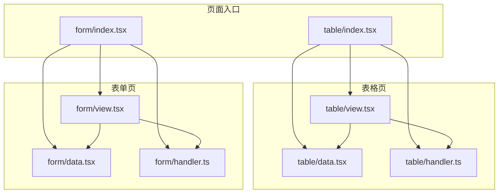
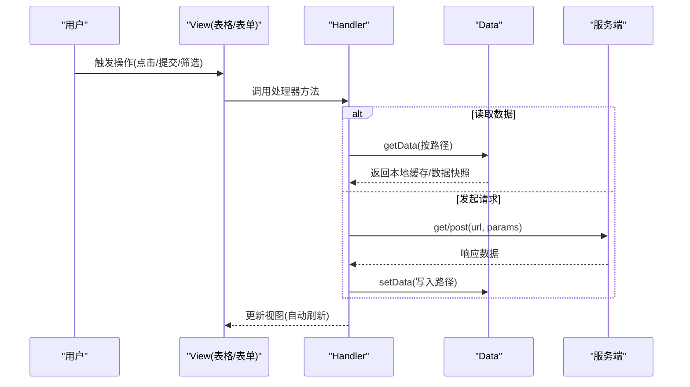
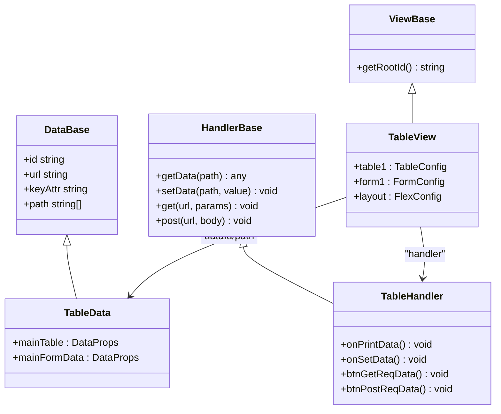

# 数据组件

<cite>
**本文引用的文件**
- [apps/demo/src/pages/base/table/index.tsx](file://apps/demo/src/pages/base/table/index.tsx)
- [apps/demo/src/pages/base/table/data.tsx](file://apps/demo/src/pages/base/table/data.tsx)
- [apps/demo/src/pages/base/table/handler.ts](file://apps/demo/src/pages/base/table/handler.ts)
- [apps/demo/src/pages/base/table/view.tsx](file://apps/demo/src/pages/base/table/view.tsx)
- [apps/demo/src/pages/base/form/index.tsx](file://apps/demo/src/pages/base/form/index.tsx)
- [apps/demo/src/pages/base/form/data.tsx](file://apps/demo/src/pages/base/form/data.tsx)
- [apps/demo/src/pages/base/form/handler.ts](file://apps/demo/src/pages/base/form/handler.ts)
- [apps/demo/src/pages/base/form/view.tsx](file://apps/demo/src/pages/base/form/view.tsx)
- [apps/demo/src/pages/composite/formAndTable/index.tsx](file://apps/demo/src/pages/composite/formAndTable/index.tsx)
- [docs/2.组件用法.md](file://docs/2.组件用法.md)
</cite>

## 目录
1. [简介](#简介)
2. [项目结构](#项目结构)
3. [核心组件](#核心组件)
4. [架构总览](#架构总览)
5. [详细组件分析](#详细组件分析)
6. [依赖关系分析](#依赖关系分析)
7. [性能考虑](#性能考虑)
8. [故障排查指南](#故障排查指南)
9. [结论](#结论)
10. [附录](#附录)

## 简介
本章节面向“数据组件”的使用与集成，聚焦表格、表单、工具栏等核心业务组件的数据绑定、列配置、表单验证、工具栏操作等能力，并结合复杂数据场景给出使用示例与性能优化策略。同时说明数据组件与状态管理（Data/Handler/View）的协作方式，帮助读者快速构建可维护、可扩展的数据驱动页面。

## 项目结构
本项目采用“视图-数据-处理器”三段式组织：
- View：声明式配置 UI（表格列、表单字段、布局、工具栏等）
- Data：声明数据源、路径、键属性等
- Handler：处理用户交互、网络请求、数据读写

图表来源
- [apps/demo/src/pages/base/table/index.tsx:1-10](file://apps/demo/src/pages/base/table/index.tsx#L1-L10)
- [apps/demo/src/pages/base/form/index.tsx:1-10](file://apps/demo/src/pages/base/form/index.tsx#L1-L10)
- [apps/demo/src/pages/base/table/view.tsx:1-86](file://apps/demo/src/pages/base/table/view.tsx#L1-L86)
- [apps/demo/src/pages/base/table/data.tsx:1-22](file://apps/demo/src/pages/base/table/data.tsx#L1-L22)
- [apps/demo/src/pages/base/table/handler.ts:1-30](file://apps/demo/src/pages/base/table/handler.ts#L1-L30)
- [apps/demo/src/pages/base/form/view.tsx:1-99](file://apps/demo/src/pages/base/form/view.tsx#L1-L99)
- [apps/demo/src/pages/base/form/data.tsx:1-10](file://apps/demo/src/pages/base/form/data.tsx#L1-L10)
- [apps/demo/src/pages/base/form/handler.ts:1-18](file://apps/demo/src/pages/base/form/handler.ts#L1-L18)

章节来源
- [apps/demo/src/pages/base/table/index.tsx:1-10](file://apps/demo/src/pages/base/table/index.tsx#L1-L10)
- [apps/demo/src/pages/base/form/index.tsx:1-10](file://apps/demo/src/pages/base/form/index.tsx#L1-L10)

## 核心组件
- 表格 Table：用于展示结构化数据，支持搜索项、列定义、行键、分页等；通过 dataId 关联数据源。
- 表单 Form：用于录入与编辑数据，支持多种控件类型（文本、输入框、选择、开关、单选、复选、日期、时间、链接、上传等），以及工具栏按钮。
- 工具栏 Toolbar：以 toolList 形式挂载在表单或表格上，提供操作入口（如打印、设置数据、发起请求等）。
- 布局 Layout：Flex、Tab、Modal 等组合多个子视图，形成复合页面。
- 框架核心 ViewRoot：将 View/Data/Handler 装配为可运行页面。

章节来源
- [docs/2.组件用法.md:1-455](file://docs/2.组件用法.md#L1-L455)

## 架构总览
页面通过 ViewRoot 注入 View、Data、Handler，由 View 声明 UI 结构与数据绑定路径，Data 声明数据源与路径映射，Handler 负责事件与数据读写。

图表来源
- [apps/demo/src/pages/base/table/handler.ts:1-30](file://apps/demo/src/pages/base/table/handler.ts#L1-L30)
- [apps/demo/src/pages/base/form/handler.ts:1-18](file://apps/demo/src/pages/base/form/handler.ts#L1-L18)
- [apps/demo/src/pages/base/table/data.tsx:1-22](file://apps/demo/src/pages/base/table/data.tsx#L1-L22)
- [apps/demo/src/pages/base/form/data.tsx:1-10](file://apps/demo/src/pages/base/form/data.tsx#L1-L10)

## 详细组件分析

### 表格组件（Table）
- 数据绑定
  - 通过 dataId 指向 Data 中声明的数据节点，实现表格与数据的解耦。
  - 使用 keyAttr 指定行唯一标识，便于高效渲染与更新。
- 列配置
  - items 定义列标题与字段映射，支持多列展示。
  - searchItems 定义查询条件，与后端接口配合完成筛选。
- 工具栏操作
  - 可在表格上方或内部添加按钮，触发 Handler 中的方法（如获取数据、打印统计等）。
- 复杂数据场景
  - 结合 Tab/Flex 布局，将表格与其他视图组合，形成多标签或多区域页面。
- 性能优化建议
  - 合理设置 keyAttr，避免不必要的重渲染。
  - 对大列表启用虚拟滚动（若底层支持）。
  - 按需加载列与搜索项，减少首屏开销。
  - 使用分页或增量加载降低单次数据量。

章节来源
- [apps/demo/src/pages/base/table/view.tsx:1-86](file://apps/demo/src/pages/base/table/view.tsx#L1-L86)
- [apps/demo/src/pages/base/table/data.tsx:1-22](file://apps/demo/src/pages/base/table/data.tsx#L1-L22)
- [apps/demo/src/pages/base/table/handler.ts:1-30](file://apps/demo/src/pages/base/table/handler.ts#L1-L30)

### 表单组件（Form）
- 数据绑定
  - 通过 path 或 dataId 将表单字段与数据模型绑定，支持嵌套路径。
- 控件与验证
  - 支持 Text、Input、Select、Switch、Radio、Checkbox、Date、DateRange、Time、TimeRange、Link、Upload 等多种控件。
  - 可通过控件配置扩展校验规则（如必填、格式校验等，具体以框架实现为准）。
- 工具栏操作
  - toolList 提供常用操作入口，如设置数据、发起 GET/POST 请求等。
- 复杂数据场景
  - 与表格联动：表单作为新增/编辑弹窗或抽屉，提交后刷新表格数据。
  - 与布局组合：Tab/Flex/Modal 组合多视图，提升信息密度与交互效率。
- 性能优化建议
  - 延迟加载选项数据（下拉、单选、复选等）。
  - 拆分长表单为多步骤或分块展示。
  - 防抖/节流输入事件，减少频繁更新。

章节来源
- [apps/demo/src/pages/base/form/view.tsx:1-99](file://apps/demo/src/pages/base/form/view.tsx#L1-L99)
- [apps/demo/src/pages/base/form/data.tsx:1-10](file://apps/demo/src/pages/base/form/data.tsx#L1-L10)
- [apps/demo/src/pages/base/form/handler.ts:1-18](file://apps/demo/src/pages/base/form/handler.ts#L1-L18)

### 工具栏（Toolbar）
- 位置与用途
  - 通常位于表单顶部或表格操作区，提供统一的操作入口。
- 常见操作
  - 打印/导出、打开弹窗、设置数据、发起网络请求等。
- 与 Handler 集成
  - 按钮 onClick 直接绑定到 Handler 方法，保持 UI 与逻辑分离。

章节来源
- [apps/demo/src/pages/base/table/view.tsx:1-86](file://apps/demo/src/pages/base/table/view.tsx#L1-L86)
- [apps/demo/src/pages/base/form/view.tsx:1-99](file://apps/demo/src/pages/base/form/view.tsx#L1-L99)
- [docs/2.组件用法.md:1-455](file://docs/2.组件用法.md#L1-L455)

### 布局组件（Layout）
- Flex：横向/纵向排列多个子视图，适合主从结构。
- Tab：多标签页切换，适合并列功能模块。
- Modal：弹窗承载表单或详情，适合轻量编辑与确认。

章节来源
- [docs/2.组件用法.md:1-455](file://docs/2.组件用法.md#L1-L455)

### 复合场景：表单+表格
- 典型流程
  - 表格展示数据，表单用于新增/编辑，提交后刷新表格。
  - 通过 Data 的路径与 keyAttr 保证数据一致性。
  - 通过 Handler 协调请求与状态更新。
- 参考入口
  - 复合页面入口文件用于组织组合视图。

章节来源
- [apps/demo/src/pages/composite/formAndTable/index.tsx:1-10](file://apps/demo/src/pages/composite/formAndTable/index.tsx#L1-L10)

## 依赖关系分析
- View 依赖 Data 与 Handler：
  - View 通过 dataId/path 绑定 Data 中的数据节点。
  - View 通过 handler 引用事件处理方法。
- Data 声明数据源与路径：
  - 使用 id/url/keyAttr/path 描述数据来源与定位。
- Handler 封装业务逻辑：
  - 提供 getData/setData/get/post 等方法，与 Data 协同工作。

图表来源
- [apps/demo/src/pages/base/table/view.tsx:1-86](file://apps/demo/src/pages/base/table/view.tsx#L1-L86)
- [apps/demo/src/pages/base/table/data.tsx:1-22](file://apps/demo/src/pages/base/table/data.tsx#L1-L22)
- [apps/demo/src/pages/base/table/handler.ts:1-30](file://apps/demo/src/pages/base/table/handler.ts#L1-L30)

章节来源
- [apps/demo/src/pages/base/table/view.tsx:1-86](file://apps/demo/src/pages/base/table/view.tsx#L1-L86)
- [apps/demo/src/pages/base/table/data.tsx:1-22](file://apps/demo/src/pages/base/table/data.tsx#L1-L22)
- [apps/demo/src/pages/base/table/handler.ts:1-30](file://apps/demo/src/pages/base/table/handler.ts#L1-L30)

## 性能考虑
- 表格
  - 明确 keyAttr，减少重复渲染。
  - 合理使用分页与懒加载，控制单次数据量。
  - 仅渲染可见列，隐藏不常用列。
- 表单
  - 对输入事件做防抖/节流。
  - 下拉/选择类控件延迟加载选项。
  - 长表单拆分为多步骤或分组。
- 数据流
  - 最小化 setData 调用频率，批量更新。
  - 利用 getData 统计与重置能力进行性能观测与调优。
- 网络请求
  - 合并请求、去重请求、缓存热点数据。
  - 错误重试与超时控制。

[本节为通用指导，无需特定文件引用]

## 故障排查指南
- 数据未更新
  - 检查 Data 的 path/dataId 是否与 View 一致。
  - 确认 Handler 是否正确调用 setData/getData。
- 表格行无法选中/高亮
  - 检查 keyAttr 是否唯一且稳定。
- 表单字段无值或值异常
  - 核对 field 与数据模型字段名一致。
  - 检查控件类型与数据类型匹配。
- 工具栏按钮无效
  - 确认 onClick 绑定的 Handler 方法存在并可执行。
- 性能问题
  - 使用 printStats/resetStats 观察 getData 使用情况，定位瓶颈。

章节来源
- [apps/demo/src/pages/base/table/handler.ts:1-30](file://apps/demo/src/pages/base/table/handler.ts#L1-L30)
- [apps/demo/src/pages/base/form/handler.ts:1-18](file://apps/demo/src/pages/base/form/handler.ts#L1-L18)

## 结论
通过 View/Data/Handler 的清晰分层，数据组件实现了声明式 UI、集中式数据与可复用逻辑的良好解耦。表格与表单在复杂场景中可灵活组合，借助工具栏与布局组件构建丰富的业务界面。遵循本文的性能与排错建议，可进一步提升稳定性与用户体验。

[本节为总结性内容，无需特定文件引用]

## 附录
- 快速上手
  - 使用 ViewRoot 装配 View/Data/Handler，即可运行页面。
- 更多控件与布局
  - 参考文档中的完整示例，了解各类控件与布局的配置方式。

章节来源
- [apps/demo/src/pages/base/table/index.tsx:1-10](file://apps/demo/src/pages/base/table/index.tsx#L1-L10)
- [apps/demo/src/pages/base/form/index.tsx:1-10](file://apps/demo/src/pages/base/form/index.tsx#L1-L10)
- [docs/2.组件用法.md:1-455](file://docs/2.组件用法.md#L1-L455)