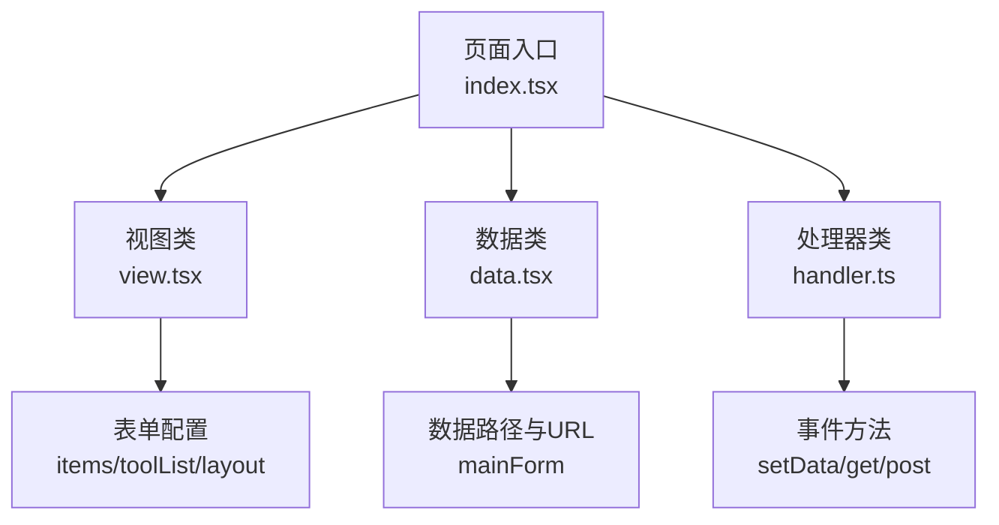
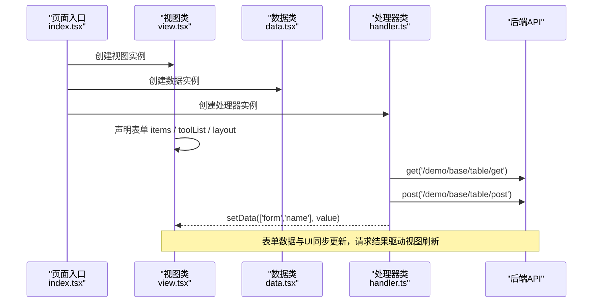
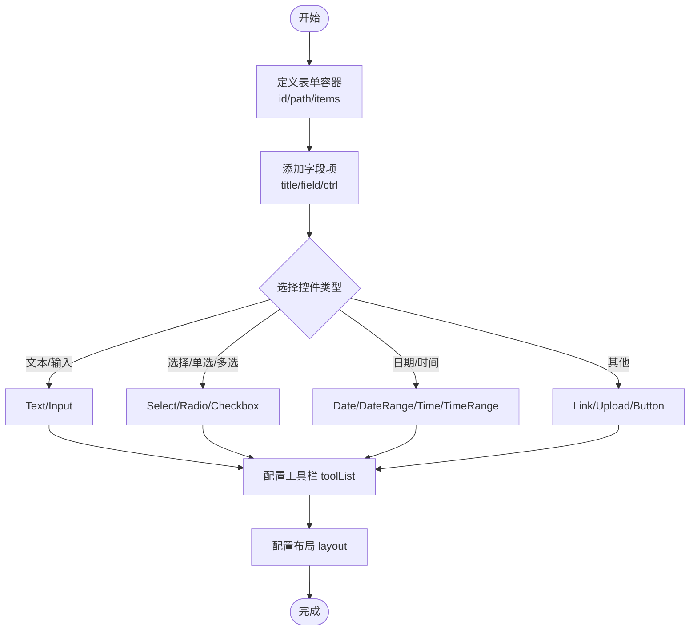
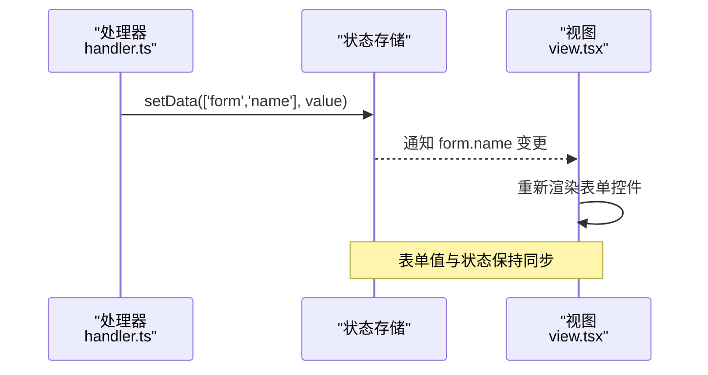
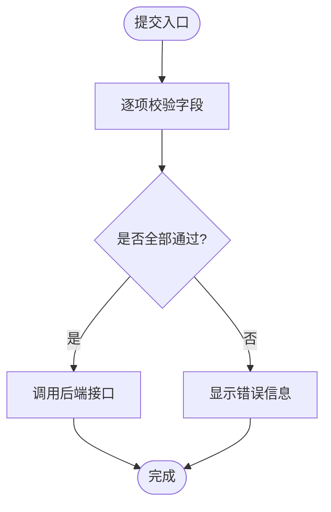
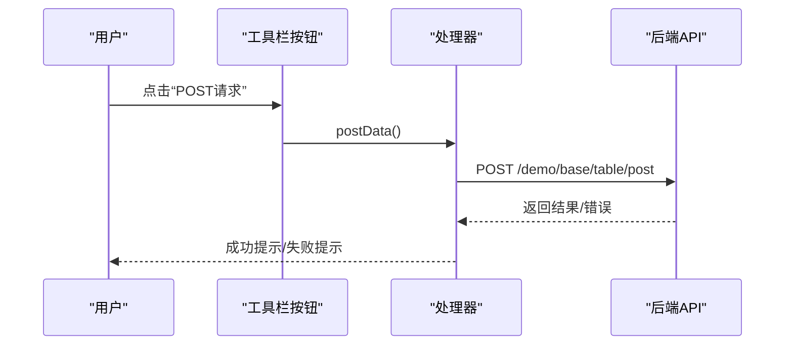
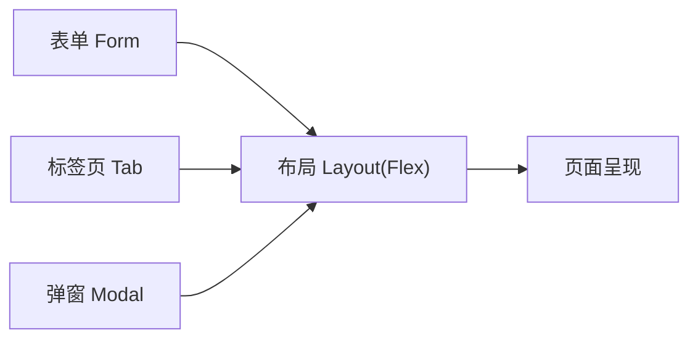
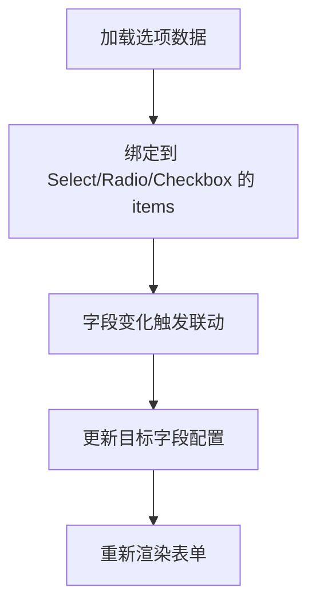
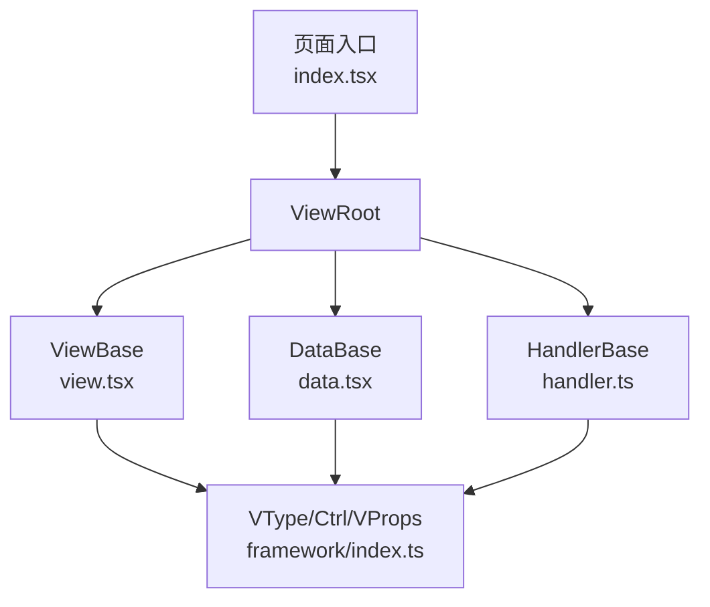

# 表单组件

<cite>
**本文引用的文件**   
- [apps/demo/src/pages/base/form/index.tsx](file://apps/demo/src/pages/base/form/index.tsx)
- [apps/demo/src/pages/base/form/view.tsx](file://apps/demo/src/pages/base/form/view.tsx)
- [apps/demo/src/pages/base/form/data.tsx](file://apps/demo/src/pages/base/form/data.tsx)
- [apps/demo/src/pages/base/form/handler.ts](file://apps/demo/src/pages/base/form/handler.ts)
- [packages/framework/src/index.ts](file://packages/framework/src/index.ts)
- [packages/framework/src/interface.ts](file://packages/framework/src/interface.ts)
- [docs/2.组件用法.md](file://docs/2.组件用法.md)
</cite>

## 目录
1. [简介](#简介)
2. [项目结构](#项目结构)
3. [核心组件](#核心组件)
4. [架构总览](#架构总览)
5. [详细组件分析](#详细组件分析)
6. [依赖分析](#依赖分析)
7. [性能考虑](#性能考虑)
8. [故障排查指南](#故障排查指南)
9. [结论](#结论)
10. [附录](#附录)

## 简介
本章节面向使用本框架的开发者，系统化说明表单组件的使用方式与最佳实践。内容涵盖：
- 字段配置：如何通过声明式配置定义表单结构与控件类型
- 验证规则：如何为不同控件设置校验逻辑（结合框架能力）
- 数据绑定：表单数据与视图、处理器之间的双向绑定机制
- 提交处理：通过工具栏按钮触发 GET/POST 等请求，并处理响应与错误
- 复杂布局与交互：Flex 布局、Tab、Modal 等组合使用
- 高级用法：异步数据加载、动态字段、联动控制等

## 项目结构
示例页面采用“View-Data-Handler”三段式组织，配合根容器 ViewRoot 进行装配：
- index.tsx：页面入口，注入 View/Data/Handler
- view.tsx：声明表单结构、控件类型、工具栏按钮与布局
- data.tsx：声明数据源与接口地址
- handler.ts：事件处理、数据设置、网络请求

图表来源
- [apps/demo/src/pages/base/form/index.tsx:1-10](file://apps/demo/src/pages/base/form/index.tsx#L1-L10)
- [apps/demo/src/pages/base/form/view.tsx:1-99](file://apps/demo/src/pages/base/form/view.tsx#L1-L99)
- [apps/demo/src/pages/base/form/data.tsx:1-10](file://apps/demo/src/pages/base/form/data.tsx#L1-L10)
- [apps/demo/src/pages/base/form/handler.ts:1-18](file://apps/demo/src/pages/base/form/handler.ts#L1-L18)

章节来源
- [apps/demo/src/pages/base/form/index.tsx:1-10](file://apps/demo/src/pages/base/form/index.tsx#L1-L10)
- [apps/demo/src/pages/base/form/view.tsx:1-99](file://apps/demo/src/pages/base/form/view.tsx#L1-L99)
- [apps/demo/src/pages/base/form/data.tsx:1-10](file://apps/demo/src/pages/base/form/data.tsx#L1-L10)
- [apps/demo/src/pages/base/form/handler.ts:1-18](file://apps/demo/src/pages/base/form/handler.ts#L1-L18)

## 核心组件
- ViewRoot：页面根容器，负责将 ViewClass、DataClass、HandlerClass 组装成可运行的页面实例
- ViewBase：视图基类，提供表单、表格、布局等视图结构的声明与渲染
- DataBase：数据基类，管理数据路径、接口地址、键属性等
- HandlerBase：处理器基类，提供 setData、get、post 等通用方法与上下文

这些导出在框架入口中统一暴露，便于在业务页面按需引入。

章节来源
- [packages/framework/src/index.ts:1-69](file://packages/framework/src/index.ts#L1-L69)
- [packages/framework/src/interface.ts:1-35](file://packages/framework/src/interface.ts#L1-L35)

## 架构总览
下图展示了表单从声明到交互的完整链路：页面入口装配 -> 视图声明表单结构 -> 数据层绑定路径与接口 -> 处理器响应事件并发起请求。

图表来源
- [apps/demo/src/pages/base/form/index.tsx:1-10](file://apps/demo/src/pages/base/form/index.tsx#L1-L10)
- [apps/demo/src/pages/base/form/view.tsx:1-99](file://apps/demo/src/pages/base/form/view.tsx#L1-L99)
- [apps/demo/src/pages/base/form/data.tsx:1-10](file://apps/demo/src/pages/base/form/data.tsx#L1-L10)
- [apps/demo/src/pages/base/form/handler.ts:1-18](file://apps/demo/src/pages/base/form/handler.ts#L1-L18)

## 详细组件分析

### 表单结构与控件配置
- 表单容器：通过 VType.Form 声明，指定 id、path 与 items
- 字段项 items：每个元素包含 title、field，以及可选 ctrl 配置控件类型与参数
- 支持的控件类型（部分）：Text、Input、Select、Switch、Radio、Checkbox、Date、DateRange、Time、TimeRange、Link、Upload、Button
- 工具栏 toolList：用于放置操作按钮，如设置数据、GET/POST 请求
- 布局 layout：使用 Flex 将表单与其他视图组合

图表来源
- [apps/demo/src/pages/base/form/view.tsx:12-87](file://apps/demo/src/pages/base/form/view.tsx#L12-L87)
- [docs/2.组件用法.md:86-278](file://docs/2.组件用法.md#L86-L278)

章节来源
- [apps/demo/src/pages/base/form/view.tsx:12-87](file://apps/demo/src/pages/base/form/view.tsx#L12-L87)
- [docs/2.组件用法.md:86-278](file://docs/2.组件用法.md#L86-L278)

### 数据绑定与路径映射
- path：表单数据挂载到全局数据的指定路径，例如 ['form']
- field：字段名对应数据路径下的键名
- setData：通过处理器方法按路径设置值，实现表单数据与 UI 的双向绑定
- mainForm：数据类中声明表单的数据源与接口地址，便于后续自动拉取或提交

图表来源
- [apps/demo/src/pages/base/form/handler.ts:4-6](file://apps/demo/src/pages/base/form/handler.ts#L4-L6)
- [apps/demo/src/pages/base/form/view.tsx:12-16](file://apps/demo/src/pages/base/form/view.tsx#L12-L16)
- [apps/demo/src/pages/base/form/data.tsx:3-7](file://apps/demo/src/pages/base/form/data.tsx#L3-L7)

章节来源
- [apps/demo/src/pages/base/form/handler.ts:4-6](file://apps/demo/src/pages/base/form/handler.ts#L4-L6)
- [apps/demo/src/pages/base/form/view.tsx:12-16](file://apps/demo/src/pages/base/form/view.tsx#L12-L16)
- [apps/demo/src/pages/base/form/data.tsx:3-7](file://apps/demo/src/pages/base/form/data.tsx#L3-L7)

### 表单验证规则
- 字段级验证：可在控件 ctrl 中配置校验规则（如必填、长度、格式等），具体规则由控件类型决定
- 自定义验证：可通过处理器在提交前对数据进行校验，返回错误提示或阻止提交
- 批量验证：遍历 items 逐项校验，汇总错误信息并展示

图表来源
- [apps/demo/src/pages/base/form/view.tsx:70-86](file://apps/demo/src/pages/base/form/view.tsx#L70-L86)
- [apps/demo/src/pages/base/form/handler.ts:8-14](file://apps/demo/src/pages/base/form/handler.ts#L8-L14)

章节来源
- [apps/demo/src/pages/base/form/view.tsx:70-86](file://apps/demo/src/pages/base/form/view.tsx#L70-L86)
- [apps/demo/src/pages/base/form/handler.ts:8-14](file://apps/demo/src/pages/base/form/handler.ts#L8-L14)

### 提交处理与后端集成
- GET 请求：通过处理器 get 方法携带查询参数，常用于获取表格或筛选数据
- POST 请求：通过处理器 post 方法提交表单数据，常用于保存或更新
- 错误处理：建议在请求前后增加 loading 状态与异常捕获，统一提示用户

图表来源
- [apps/demo/src/pages/base/form/view.tsx:70-86](file://apps/demo/src/pages/base/form/view.tsx#L70-L86)
- [apps/demo/src/pages/base/form/handler.ts:12-14](file://apps/demo/src/pages/base/form/handler.ts#L12-L14)

章节来源
- [apps/demo/src/pages/base/form/view.tsx:70-86](file://apps/demo/src/pages/base/form/view.tsx#L70-L86)
- [apps/demo/src/pages/base/form/handler.ts:12-14](file://apps/demo/src/pages/base/form/handler.ts#L12-L14)

### 复杂布局与交互
- Flex 布局：将表单与其他视图（如 Tab、Table）组合在同一页面
- Tab 切换：通过 LayoutTab 将多个子视图放入标签页
- Modal 弹窗：通过 LayoutModal 将表单嵌入弹窗，实现新增/编辑场景
- 联动逻辑：根据某字段变化动态修改其他字段的可见性、禁用状态或选项集

图表来源
- [apps/demo/src/pages/base/form/view.tsx:89-95](file://apps/demo/src/pages/base/form/view.tsx#L89-L95)
- [docs/2.组件用法.md:280-327](file://docs/2.组件用法.md#L280-L327)

章节来源
- [apps/demo/src/pages/base/form/view.tsx:89-95](file://apps/demo/src/pages/base/form/view.tsx#L89-L95)
- [docs/2.组件用法.md:280-327](file://docs/2.组件用法.md#L280-L327)

### 高级用法示例
- 异步数据加载：在处理器中通过 get 方法加载下拉选项或关联数据，再写入表单字段
- 动态字段：根据条件增删 items 中的字段，或动态调整控件配置
- 联动控制：监听字段变化，动态更新其他字段的 items、disabled、visible 等

图表来源
- [apps/demo/src/pages/base/form/view.tsx:5-37](file://apps/demo/src/pages/base/form/view.tsx#L5-L37)
- [apps/demo/src/pages/base/form/handler.ts:8-14](file://apps/demo/src/pages/base/form/handler.ts#L8-L14)

章节来源
- [apps/demo/src/pages/base/form/view.tsx:5-37](file://apps/demo/src/pages/base/form/view.tsx#L5-L37)
- [apps/demo/src/pages/base/form/handler.ts:8-14](file://apps/demo/src/pages/base/form/handler.ts#L8-L14)

## 依赖分析
- 页面入口依赖 ViewRoot 进行装配
- 视图层依赖 Ctrl、VType、ViewBase 等类型与基类
- 数据层依赖 DataBase 与 DataProps 类型
- 处理器依赖 HandlerBase 提供的通用方法

图表来源
- [apps/demo/src/pages/base/form/index.tsx:1-10](file://apps/demo/src/pages/base/form/index.tsx#L1-L10)
- [packages/framework/src/index.ts:1-69](file://packages/framework/src/index.ts#L1-L69)

章节来源
- [apps/demo/src/pages/base/form/index.tsx:1-10](file://apps/demo/src/pages/base/form/index.tsx#L1-L10)
- [packages/framework/src/index.ts:1-69](file://packages/framework/src/index.ts#L1-L69)

## 性能考虑
- 避免在 items 中频繁重建大数组：将 options 等静态数据提升到组件外部或缓存
- 减少不必要的重渲染：仅在必要字段变化时更新相关控件
- 合理使用懒加载：对于大型下拉选项，采用分页或搜索后加载
- 合并多次 setData：批量更新时尽量合并，减少状态变更次数

[本节为通用建议，不直接分析具体文件]

## 故障排查指南
- 表单无数据：检查 path 是否与数据路径一致；确认 mainForm.url 是否正确
- 控件不生效：确认 ctrl.type 是否为支持的控件类型；检查 items 配置是否完整
- 请求失败：检查处理器中的 URL 与方法；查看网络响应与错误提示
- 联动无效：确认字段变化事件是否绑定正确；检查目标字段配置更新逻辑

章节来源
- [apps/demo/src/pages/base/form/data.tsx:3-7](file://apps/demo/src/pages/base/form/data.tsx#L3-L7)
- [apps/demo/src/pages/base/form/handler.ts:8-14](file://apps/demo/src/pages/base/form/handler.ts#L8-L14)
- [apps/demo/src/pages/base/form/view.tsx:12-87](file://apps/demo/src/pages/base/form/view.tsx#L12-L87)

## 结论
本框架通过声明式的表单配置与统一的 View-Data-Handler 模式，提供了强大的表单能力。借助丰富的控件类型、灵活的布局组合与完善的处理器方法，可以快速构建复杂的业务表单，并与后端 API 无缝集成。建议在实际项目中遵循本文的最佳实践，确保表单的可维护性与用户体验。

[本节为总结性内容，不直接分析具体文件]

## 附录
- 常用控件参考：Text、Input、Select、Switch、Radio、Checkbox、Date、DateRange、Time、TimeRange、Link、Upload、Button
- 布局组件参考：Tab、Flex、Modal
- 框架核心：ViewRoot、ViewBase、DataBase、HandlerBase

章节来源
- [docs/2.组件用法.md:86-327](file://docs/2.组件用法.md#L86-L327)
- [packages/framework/src/index.ts:1-69](file://packages/framework/src/index.ts#L1-L69)