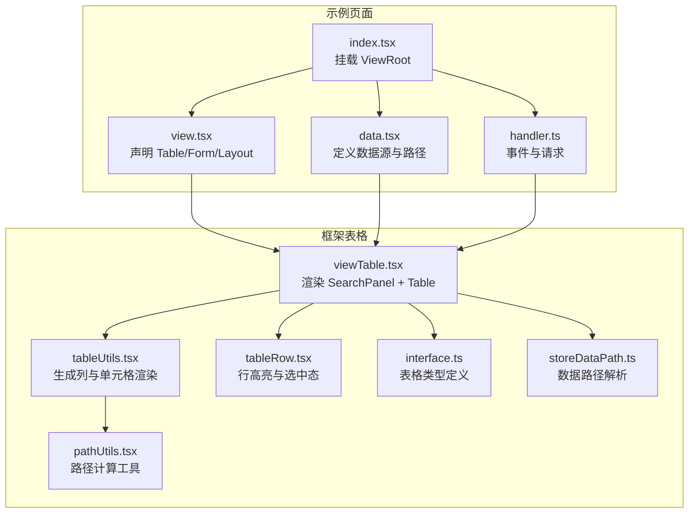
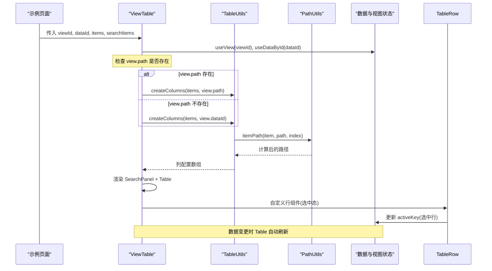
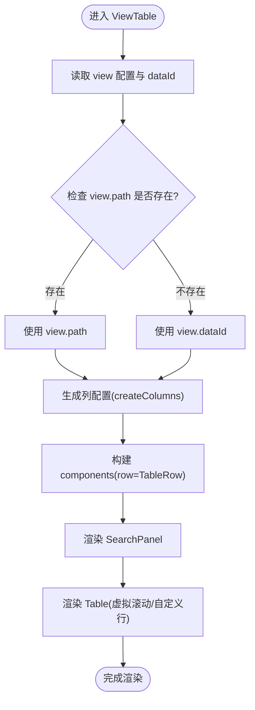
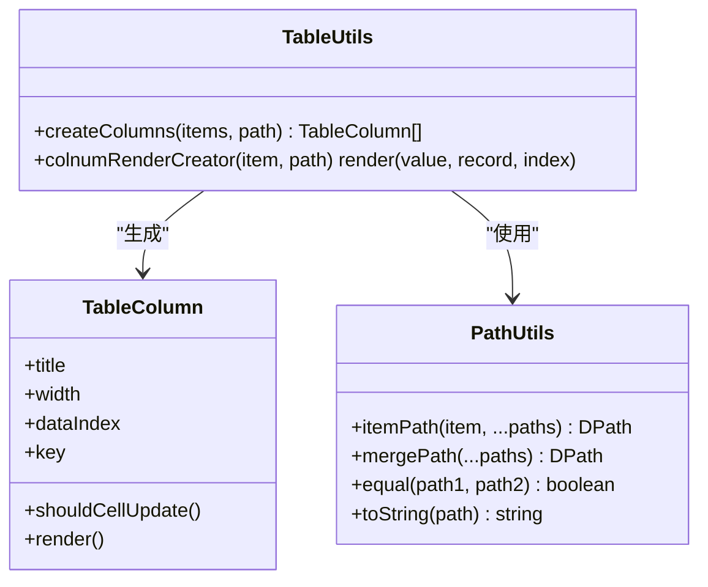
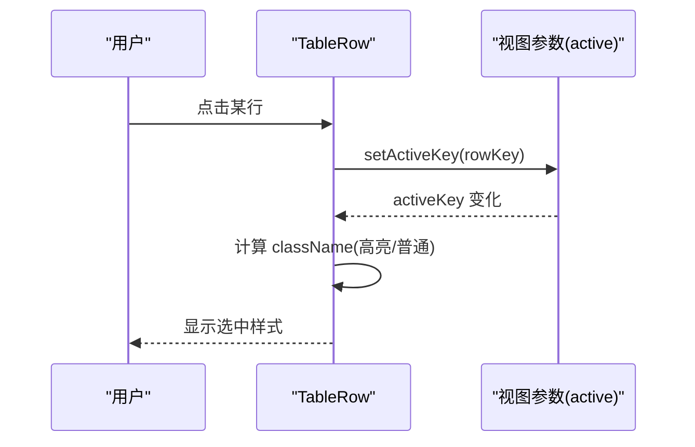
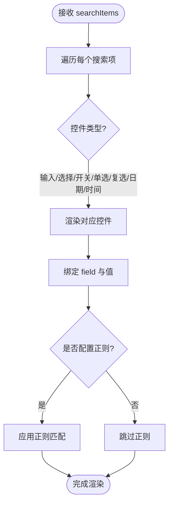
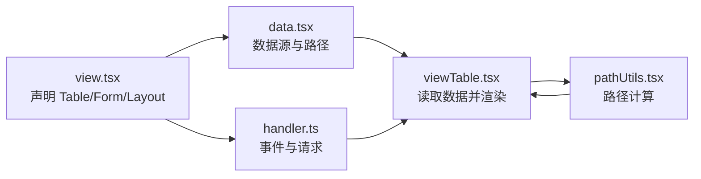
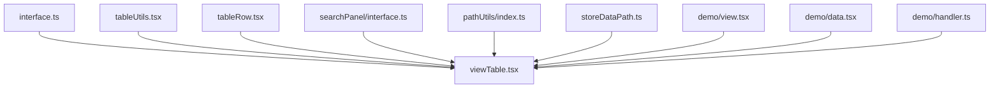

# 表格组件

<cite>
**本文引用的文件**
- [apps/demo/src/pages/base/table/index.tsx](file://apps/demo/src/pages/base/table/index.tsx)
- [apps/demo/src/pages/base/table/view.tsx](file://apps/demo/src/pages/base/table/view.tsx)
- [apps/demo/src/pages/base/table/data.tsx](file://apps/demo/src/pages/base/table/data.tsx)
- [apps/demo/src/pages/base/table/handler.ts](file://apps/demo/src/pages/base/table/handler.ts)
- [packages/framework/src/comp/view/table/viewTable.tsx](file://packages/framework/src/comp/view/table/viewTable.tsx)
- [packages/framework/src/comp/view/table/interface.ts](file://packages/framework/src/comp/view/table/interface.ts)
- [packages/framework/src/comp/view/table/utils/tableUtils.tsx](file://packages/framework/src/comp/view/table/utils/tableUtils.tsx)
- [packages/framework/src/comp/view/table/comp/basetable/tableRow.tsx](file://packages/framework/src/comp/view/table/comp/basetable/tableRow.tsx)
- [packages/framework/src/comp/view/comp/searchPanel/interface.ts](file://packages/framework/src/comp/view/comp/searchPanel/interface.ts)
- [packages/framework/src/utils/pathUtils/index.ts](file://packages/framework/src/utils/pathUtils/index.ts)
- [packages/framework/src/stores/store/utils/storeDataPath.ts](file://packages/framework/src/stores/store/utils/storeDataPath.ts)
</cite>

## 更新摘要
**变更内容**
- 增强了表格组件的数据绑定逻辑，新增单元格数据路径降级机制
- 当view.path未定义时，自动使用view.dataId作为基础路径
- 提高了表格组件在不同数据结构配置下的兼容性
- 更新了相关架构图和流程图以反映新的数据绑定机制

## 目录
1. [简介](#简介)
2. [项目结构](#项目结构)
3. [核心组件](#核心组件)
4. [架构总览](#架构总览)
5. [详细组件分析](#详细组件分析)
6. [依赖关系分析](#依赖关系分析)
7. [性能考量](#性能考量)
8. [故障排查指南](#故障排查指南)
9. [结论](#结论)
10. [附录](#附录)

## 简介
本章节面向使用与二次开发该框架中"表格组件"的读者，系统性说明如何通过声明式配置生成复杂表格界面，包括列定义、搜索面板、数据绑定、行选择、虚拟滚动等能力；并结合示例页面展示与状态管理的数据同步机制。文档同时提供性能优化建议与最佳实践，帮助你在大数据量场景下获得稳定流畅的体验。

**最新更新**：表格组件现已支持智能数据路径降级机制，当未显式配置path时会自动回退到dataId，确保在各种数据结构配置下都能正确获取单元格数据。

## 项目结构
示例页面通过 ViewRoot 将视图、数据与处理器组合，形成典型的 MVC-like 结构：
- 视图层（View）：声明表格、表单及布局等 UI 配置
- 数据层（Data）：定义数据源、路径映射与键属性
- 处理层（Handler）：封装交互逻辑与数据请求

**图表来源**
- [apps/demo/src/pages/base/table/index.tsx:1-10](file://apps/demo/src/pages/base/table/index.tsx#L1-L10)
- [apps/demo/src/pages/base/table/view.tsx:1-86](file://apps/demo/src/pages/base/table/view.tsx#L1-L86)
- [apps/demo/src/pages/base/table/data.tsx:1-22](file://apps/demo/src/pages/base/table/data.tsx#L1-L22)
- [apps/demo/src/pages/base/table/handler.ts:1-30](file://apps/demo/src/pages/base/table/handler.ts#L1-L30)
- [packages/framework/src/comp/view/table/viewTable.tsx:1-52](file://packages/framework/src/comp/view/table/viewTable.tsx#L1-L52)
- [packages/framework/src/comp/view/table/utils/tableUtils.tsx:1-42](file://packages/framework/src/comp/view/table/utils/tableUtils.tsx#L1-L42)
- [packages/framework/src/comp/view/table/comp/basetable/tableRow.tsx:1-38](file://packages/framework/src/comp/view/table/comp/basetable/tableRow.tsx#L1-L38)
- [packages/framework/src/comp/view/table/interface.ts:1-28](file://packages/framework/src/comp/view/table/interface.ts#L1-L28)
- [packages/framework/src/utils/pathUtils/index.ts:1-84](file://packages/framework/src/utils/pathUtils/index.ts#L1-L84)
- [packages/framework/src/stores/store/utils/storeDataPath.ts:150-182](file://packages/framework/src/stores/store/utils/storeDataPath.ts#L150-L182)

**章节来源**
- [apps/demo/src/pages/base/table/index.tsx:1-10](file://apps/demo/src/pages/base/table/index.tsx#L1-L10)
- [apps/demo/src/pages/base/table/view.tsx:1-86](file://apps/demo/src/pages/base/table/view.tsx#L1-L86)
- [apps/demo/src/pages/base/table/data.tsx:1-22](file://apps/demo/src/pages/base/table/data.tsx#L1-L22)
- [apps/demo/src/pages/base/table/handler.ts:1-30](file://apps/demo/src/pages/base/table/handler.ts#L1-L30)

## 核心组件
- 表格视图组件：负责读取视图配置与数据，组装列、搜索面板与 Ant Design Table，并启用虚拟滚动与自定义行组件。
- 列工具类：根据声明式 items 生成列配置，并为每个单元格注入可编辑控件渲染。
- 行组件：实现行点击选中态与样式切换，并与视图参数联动。
- 搜索面板接口：定义搜索项字段、控件类型与正则匹配能力。
- **新增**：路径计算工具类：提供智能路径合并与降级机制，确保数据绑定的稳定性。

**章节来源**
- [packages/framework/src/comp/view/table/viewTable.tsx:1-52](file://packages/framework/src/comp/view/table/viewTable.tsx#L1-L52)
- [packages/framework/src/comp/view/table/utils/tableUtils.tsx:1-42](file://packages/framework/src/comp/view/table/utils/tableUtils.tsx#L1-L42)
- [packages/framework/src/comp/view/table/comp/basetable/tableRow.tsx:1-38](file://packages/framework/src/comp/view/table/comp/basetable/tableRow.tsx#L1-L38)
- [packages/framework/src/comp/view/comp/searchPanel/interface.ts:1-61](file://packages/framework/src/comp/view/comp/searchPanel/interface.ts#L1-L61)
- [packages/framework/src/utils/pathUtils/index.ts:1-84](file://packages/framework/src/utils/pathUtils/index.ts#L1-L84)

## 架构总览
下图展示了从页面到框架表格的调用链路与数据流向，包含新增的路径降级机制：

**图表来源**
- [packages/framework/src/comp/view/table/viewTable.tsx:14-47](file://packages/framework/src/comp/view/table/viewTable.tsx#L14-L47)
- [packages/framework/src/comp/view/table/utils/tableUtils.tsx:11-28](file://packages/framework/src/comp/view/table/utils/tableUtils.tsx#L11-L28)
- [packages/framework/src/utils/pathUtils/index.ts:13-25](file://packages/framework/src/utils/pathUtils/index.ts#L13-L25)
- [packages/framework/src/comp/view/table/comp/basetable/tableRow.tsx:15-33](file://packages/framework/src/comp/view/table/comp/basetable/tableRow.tsx#L15-L33)

## 详细组件分析

### 表格视图（ViewTable）
- 职责
  - 读取视图配置与数据源
  - 生成列配置并注入虚拟滚动、自定义行组件
  - 渲染搜索面板与表格主体
- 关键行为
  - 使用 useMemo 缓存列配置，避免重复计算
  - 通过 useRef 缓存滚动高度与组件实例
  - 将数据以数组形式传递给 dataSource，确保空数据安全
  - 开启虚拟滚动以提升大数据渲染性能
  - **新增**：智能路径降级机制，当view.path未定义时自动使用view.dataId作为基础路径

**图表来源**
- [packages/framework/src/comp/view/table/viewTable.tsx:14-47](file://packages/framework/src/comp/view/table/viewTable.tsx#L14-L47)

**章节来源**
- [packages/framework/src/comp/view/table/viewTable.tsx:1-52](file://packages/framework/src/comp/view/table/viewTable.tsx#L1-L52)

### 列生成工具（TableUtils）
- 职责
  - 将声明式 items 转换为 Ant Design Table 的 columns
  - 为每个单元格创建渲染函数，支持在单元格内嵌入任意控件
- 关键点
  - 基于 field 作为 dataIndex，结合 index 生成稳定 key
  - shouldCellUpdate 固定返回 false，减少不必要的重渲染
  - 通过 CtrlFactory 将 item.ctrl 或默认文本控件注入到单元格
  - **增强**：与 PathUtils 集成，支持智能路径计算

**图表来源**
- [packages/framework/src/comp/view/table/utils/tableUtils.tsx:9-41](file://packages/framework/src/comp/view/table/utils/tableUtils.tsx#L9-L41)
- [packages/framework/src/utils/pathUtils/index.ts:6-84](file://packages/framework/src/utils/pathUtils/index.ts#L6-L84)

**章节来源**
- [packages/framework/src/comp/view/table/utils/tableUtils.tsx:1-42](file://packages/framework/src/comp/view/table/utils/tableUtils.tsx#L1-L42)
- [packages/framework/src/utils/pathUtils/index.ts:1-84](file://packages/framework/src/utils/pathUtils/index.ts#L1-L84)

### 路径计算工具（PathUtils）
- 职责
  - 计算单元格数据的实际路径
  - 支持路径合并、比较与转换
  - 提供智能路径降级机制
- 关键功能
  - itemPath：根据item配置和基础路径计算最终路径
  - mergePath：合并多个路径段
  - equal：比较两个路径是否相等
  - toString：将路径转换为字符串表示

**新增功能**：当item.path未定义且没有提供基础路径时，直接返回item.field，确保基本的字段访问能力。

**章节来源**
- [packages/framework/src/utils/pathUtils/index.ts:1-84](file://packages/framework/src/utils/pathUtils/index.ts#L1-L84)

### 行组件（TableRow）
- 职责
  - 监听行点击，更新当前激活行的 key
  - 根据激活状态切换 CSS 类名，实现视觉高亮
- 关键点
  - 通过 useParamByKey 与视图参数联动，保证跨组件共享选中态
  - 使用 useMemoizedFn 优化回调引用稳定性

**图表来源**
- [packages/framework/src/comp/view/table/comp/basetable/tableRow.tsx:15-33](file://packages/framework/src/comp/view/table/comp/basetable/tableRow.tsx#L15-L33)

**章节来源**
- [packages/framework/src/comp/view/table/comp/basetable/tableRow.tsx:1-38](file://packages/framework/src/comp/view/table/comp/basetable/tableRow.tsx#L1-L38)

### 搜索面板（SearchPanel）
- 职责
  - 根据 searchItems 渲染多种控件（输入框、选择器、开关、单选、复选、日期、时间等）
  - 支持正则表达式快速匹配
- 配置项
  - title：标题
  - field：绑定的字段
  - ctrl：具体控件配置
  - regExp：用于快速匹配的正则

**图表来源**
- [packages/framework/src/comp/view/comp/searchPanel/interface.ts:31-60](file://packages/framework/src/comp/view/comp/searchPanel/interface.ts#L31-L60)

**章节来源**
- [packages/framework/src/comp/view/comp/searchPanel/interface.ts:1-61](file://packages/framework/src/comp/view/comp/searchPanel/interface.ts#L1-L61)

### 示例页面集成（View/Data/Handler）
- 视图（View）
  - 声明 table1 的 items 与 searchItems，绑定 dataId
  - 声明 form1 的工具栏按钮，触发打印、设置数据、网络请求等操作
  - 使用 Flex 布局将表单与表格并列
- 数据（Data）
  - 定义 mainTable 的数据源地址与主键字段
  - 通过路径关联表单数据与表格活动行数据
- 处理器（Handler）
  - 提供打印数据、设置表单数据、获取/重置统计数据、发起 GET/POST 请求等方法

**图表来源**
- [apps/demo/src/pages/base/table/view.tsx:5-82](file://apps/demo/src/pages/base/table/view.tsx#L5-L82)
- [apps/demo/src/pages/base/table/data.tsx:3-18](file://apps/demo/src/pages/base/table/data.tsx#L3-L18)
- [apps/demo/src/pages/base/table/handler.ts:3-26](file://apps/demo/src/pages/base/table/handler.ts#L3-L26)
- [packages/framework/src/comp/view/table/viewTable.tsx:14-47](file://packages/framework/src/comp/view/table/viewTable.tsx#L14-L47)
- [packages/framework/src/utils/pathUtils/index.ts:13-25](file://packages/framework/src/utils/pathUtils/index.ts#L13-L25)

**章节来源**
- [apps/demo/src/pages/base/table/view.tsx:1-88](file://apps/demo/src/pages/base/table/view.tsx#L1-L88)
- [apps/demo/src/pages/base/table/data.tsx:1-35](file://apps/demo/src/pages/base/table/data.tsx#L1-L35)
- [apps/demo/src/pages/base/table/handler.ts:1-30](file://apps/demo/src/pages/base/table/handler.ts#L1-L30)

## 依赖关系分析
- 视图层依赖
  - viewTable.tsx 依赖 interface.ts 的类型定义、utils/tableUtils.tsx 的列生成、comp/basetable/tableRow.tsx 的行组件以及搜索面板接口
  - **新增**：依赖 pathUtils.tsx 进行路径计算，依赖 storeDataPath.ts 进行数据路径解析
- 示例页依赖
  - 示例页面的 view.tsx 通过 data.tsx 提供的数据源与 handler.ts 的事件驱动表格与表单工作

**图表来源**
- [packages/framework/src/comp/view/table/interface.ts:1-28](file://packages/framework/src/comp/view/table/interface.ts#L1-L28)
- [packages/framework/src/comp/view/table/viewTable.tsx:1-52](file://packages/framework/src/comp/view/table/viewTable.tsx#L1-L52)
- [packages/framework/src/comp/view/table/utils/tableUtils.tsx:1-42](file://packages/framework/src/comp/view/table/utils/tableUtils.tsx#L1-L42)
- [packages/framework/src/comp/view/table/comp/basetable/tableRow.tsx:1-38](file://packages/framework/src/comp/view/table/comp/basetable/tableRow.tsx#L1-L38)
- [packages/framework/src/comp/view/comp/searchPanel/interface.ts:1-61](file://packages/framework/src/comp/view/comp/searchPanel/interface.ts#L1-L61)
- [packages/framework/src/utils/pathUtils/index.ts:1-84](file://packages/framework/src/utils/pathUtils/index.ts#L1-L84)
- [packages/framework/src/stores/store/utils/storeDataPath.ts:150-182](file://packages/framework/src/stores/store/utils/storeDataPath.ts#L150-L182)
- [apps/demo/src/pages/base/table/view.tsx:1-88](file://apps/demo/src/pages/base/table/view.tsx#L1-L88)
- [apps/demo/src/pages/base/table/data.tsx:1-35](file://apps/demo/src/pages/base/table/data.tsx#L1-L35)
- [apps/demo/src/pages/base/table/handler.ts:1-30](file://apps/demo/src/pages/base/table/handler.ts#L1-L30)

**章节来源**
- [packages/framework/src/comp/view/table/viewTable.tsx:1-52](file://packages/framework/src/comp/view/table/viewTable.tsx#L1-L52)
- [packages/framework/src/comp/view/table/interface.ts:1-28](file://packages/framework/src/comp/view/table/interface.ts#L1-L28)
- [packages/framework/src/comp/view/table/utils/tableUtils.tsx:1-42](file://packages/framework/src/comp/view/table/utils/tableUtils.tsx#L1-L42)
- [packages/framework/src/comp/view/table/comp/basetable/tableRow.tsx:1-38](file://packages/framework/src/comp/view/table/comp/basetable/tableRow.tsx#L1-L38)
- [packages/framework/src/comp/view/comp/searchPanel/interface.ts:1-61](file://packages/framework/src/comp/view/comp/searchPanel/interface.ts#L1-L61)
- [packages/framework/src/utils/pathUtils/index.ts:1-84](file://packages/framework/src/utils/pathUtils/index.ts#L1-L84)
- [packages/framework/src/stores/store/utils/storeDataPath.ts:150-182](file://packages/framework/src/stores/store/utils/storeDataPath.ts#L150-L182)
- [apps/demo/src/pages/base/table/view.tsx:1-88](file://apps/demo/src/pages/base/table/view.tsx#L1-L88)
- [apps/demo/src/pages/base/table/data.tsx:1-35](file://apps/demo/src/pages/base/table/data.tsx#L1-L35)
- [apps/demo/src/pages/base/table/handler.ts:1-30](file://apps/demo/src/pages/base/table/handler.ts#L1-L30)

## 性能考量
- 虚拟滚动：已启用虚拟列表，适合大数据量场景，降低首屏与滚动时的渲染压力
- 列配置缓存：通过 useMemo 缓存列配置，避免每次渲染重新计算
- 单元格更新策略：shouldCellUpdate 固定返回 false，减少细粒度重渲染开销
- 行组件优化：使用 useMemoizedFn 稳定回调引用，避免不必要重渲染
- 数据绑定：dataSource 仅在数据变化时更新，配合稳定的 rowKey 提升 diff 效率
- **新增**：路径计算缓存：PathUtils 内部对字面量路径进行缓存，避免重复计算
- 建议
  - 合理设置列宽 width，避免频繁计算布局
  - 控制 searchItems 数量与复杂度，必要时分页加载或延迟渲染
  - 对复杂单元格内容考虑懒加载或虚拟化
  - 充分利用路径降级机制，减少不必要的path配置

## 故障排查指南
- 表格无数据
  - 检查 dataId 是否正确绑定，确认数据源 URL 与 keyAttr 配置
  - 确认 useDataById 返回的是数组类型
  - **新增**：检查view.path配置，如未配置将自动使用view.dataId
- 列未显示或内容异常
  - 检查 items 中的 field 是否与数据字段一致
  - 若使用自定义控件，确认 ctrl 配置正确且可渲染
  - **新增**：验证路径计算结果，确认PathUtils能正确生成单元格路径
- 搜索无效
  - 确认 searchItems 的 field 与后端查询字段一致
  - 如需精确匹配，可在搜索项中配置 regExp
- 行选中态不生效
  - 检查 TableRow 是否被正确注入为自定义行组件
  - 确认视图参数 activeKey 的读写路径正确
  - **新增**：检查getActivePath函数是否正确处理路径降级
- 性能问题
  - 评估数据量与列数量，必要时拆分视图或使用分页
  - 检查是否存在大量昂贵的单元格渲染逻辑
  - **新增**：监控路径计算频率，避免过多重复计算

**章节来源**
- [packages/framework/src/comp/view/table/viewTable.tsx:14-47](file://packages/framework/src/comp/view/table/viewTable.tsx#L14-L47)
- [packages/framework/src/comp/view/table/utils/tableUtils.tsx:11-28](file://packages/framework/src/comp/view/table/utils/tableUtils.tsx#L11-L28)
- [packages/framework/src/comp/view/table/comp/basetable/tableRow.tsx:15-33](file://packages/framework/src/comp/view/table/comp/basetable/tableRow.tsx#L15-L33)
- [packages/framework/src/comp/view/comp/searchPanel/interface.ts:31-60](file://packages/framework/src/comp/view/comp/searchPanel/interface.ts#L31-L60)
- [packages/framework/src/utils/pathUtils/index.ts:13-25](file://packages/framework/src/utils/pathUtils/index.ts#L13-L25)
- [packages/framework/src/stores/store/utils/storeDataPath.ts:150-182](file://packages/framework/src/stores/store/utils/storeDataPath.ts#L150-L182)

## 结论
该表格组件通过声明式配置实现了列定义、搜索面板、行选择与虚拟滚动等核心能力，并与框架的数据与视图状态紧密集成。**最新增强**的智能路径降级机制进一步提升了组件的兼容性和易用性，即使在没有显式path配置的情况下也能正常工作。借助工具类与自定义行组件，开发者可以以较低成本构建复杂的表格界面。在生产环境中，建议关注数据量、列复杂度与单元格渲染成本，按需采用分页、懒加载与虚拟化等手段保障性能。

## 附录
- 常用配置要点
  - 表格列：items 中设置 title、field、width 等
  - 搜索项：searchItems 中设置 title、field、ctrl、regExp
  - 数据源：data.tsx 中配置 url 与 keyAttr
  - 行选择：通过 TableRow 与视图参数 activeKey 联动
  - **新增**：路径配置：可选配置path，未配置时自动使用dataId
- 与状态管理的集成
  - 使用 useView/useDataById 读取视图与数据
  - Handler 中通过 get/post 等方法触发数据更新，视图自动响应
  - **新增**：PathUtils 提供智能路径计算，支持路径降级
- 路径降级机制说明
  - 优先级：view.path > view.dataId > 直接使用field
  - 适用场景：简化配置，提高组件灵活性
  - 注意事项：确保数据结构与路径配置匹配