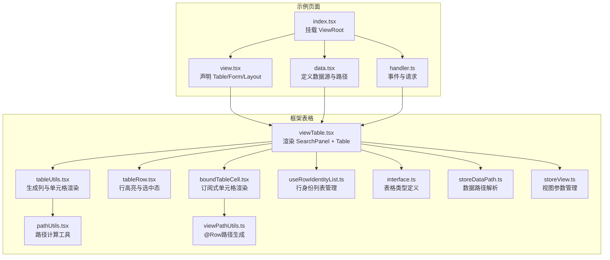
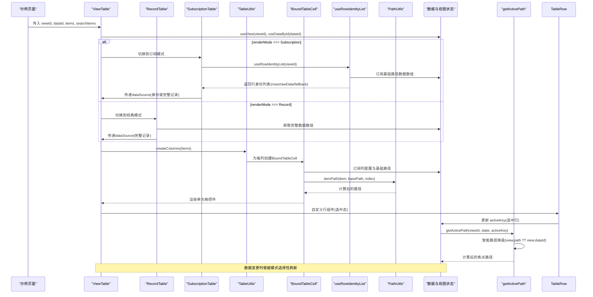
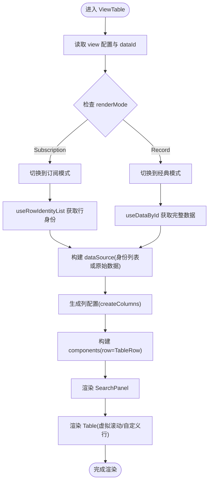
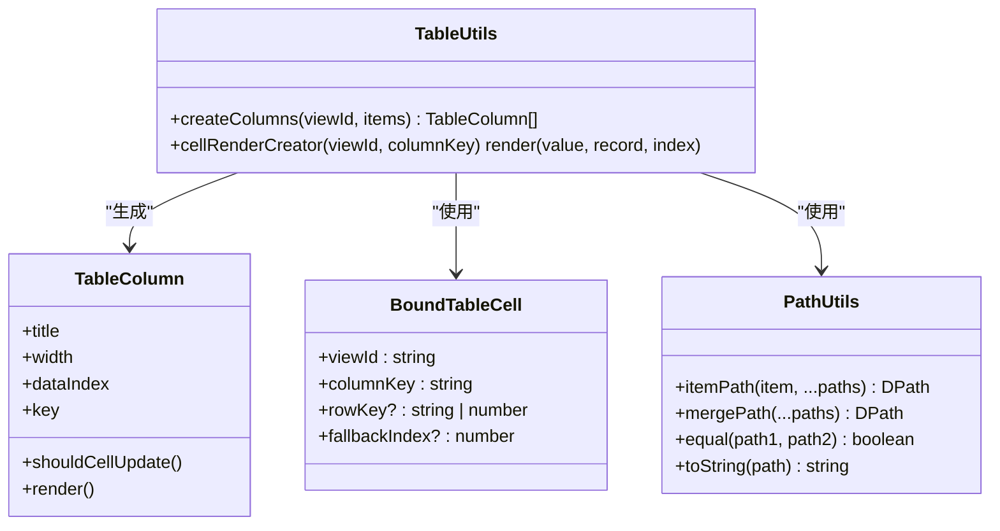
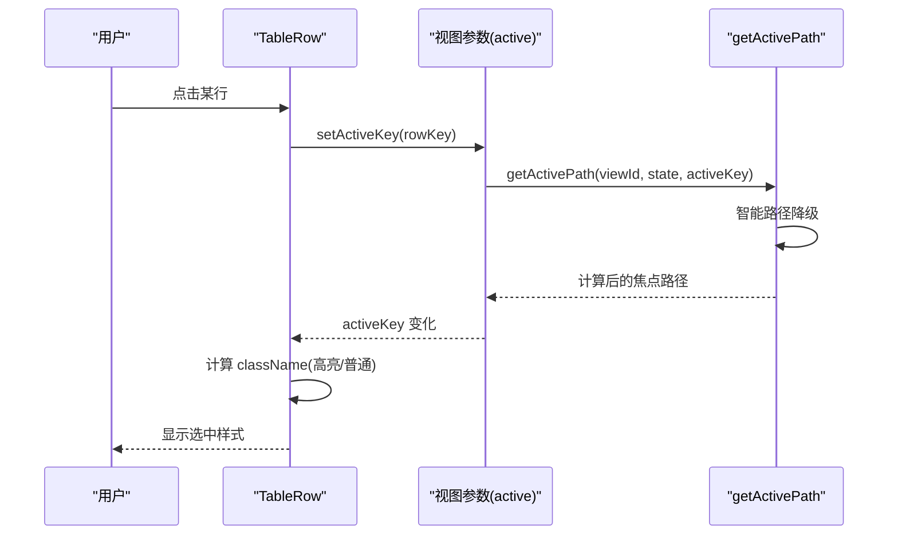
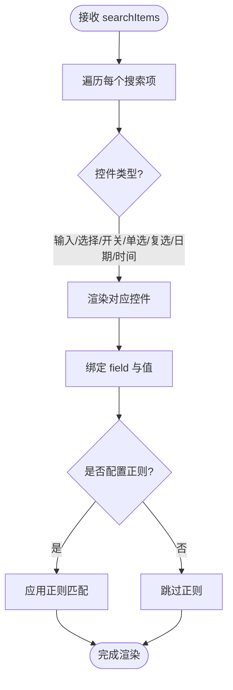
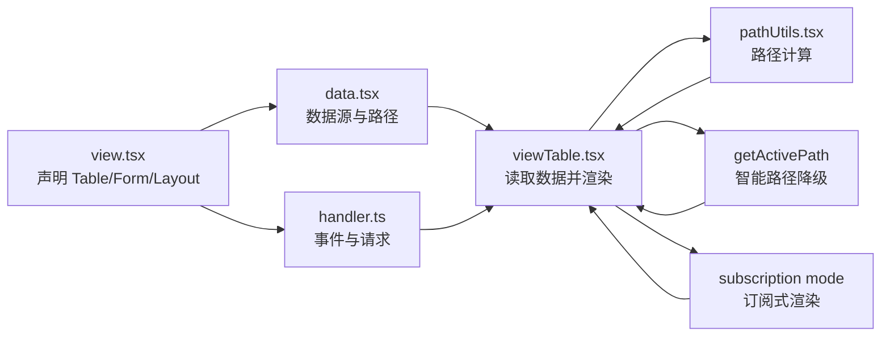
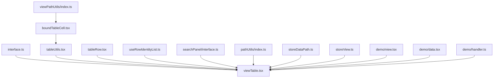

# 表格组件

<cite>
**本文引用的文件**
- [apps/demo/src/pages/base/table/index.tsx](file://apps/demo/src/pages/base/table/index.tsx)
- [apps/demo/src/pages/base/table/view.tsx](file://apps/demo/src/pages/base/table/view.tsx)
- [apps/demo/src/pages/base/table/data.tsx](file://apps/demo/src/pages/base/table/data.tsx)
- [apps/demo/src/pages/base/table/handler.ts](file://apps/demo/src/pages/base/table/handler.ts)
- [packages/framework/src/comp/view/table/viewTable.tsx](file://packages/framework/src/comp/view/table/viewTable.tsx)
- [packages/framework/src/comp/view/table/interface.ts](file://packages/framework/src/comp/view/table/interface.ts)
- [packages/framework/src/comp/view/table/utils/tableUtils.tsx](file://packages/framework/src/comp/view/table/utils/tableUtils.tsx)
- [packages/framework/src/comp/view/table/comp/basetable/tableRow.tsx](file://packages/framework/src/comp/view/table/comp/basetable/tableRow.tsx)
- [packages/framework/src/comp/view/table/comp/basetable/boundTableCell.tsx](file://packages/framework/src/comp/view/table/comp/basetable/boundTableCell.tsx)
- [packages/framework/src/comp/view/table/utils/useRowIdentityList.ts](file://packages/framework/src/comp/view/table/utils/useRowIdentityList.ts)
- [packages/framework/src/comp/view/comp/searchPanel/interface.ts](file://packages/framework/src/comp/view/comp/searchPanel/interface.ts)
- [packages/framework/src/utils/pathUtils/index.ts](file://packages/framework/src/utils/pathUtils/index.ts)
- [packages/framework/src/stores/store/utils/storeDataPath.ts](file://packages/framework/src/stores/store/utils/storeDataPath.ts)
- [packages/framework/src/stores/store/utils/storeView.ts](file://packages/framework/src/stores/store/utils/storeView.ts)
- [packages/framework/src/stores/store/utils/storeDataPath.test.ts](file://packages/framework/src/stores/store/utils/storeDataPath.test.ts)
- [packages/framework/src/utils/viewPathUtils/index.ts](file://packages/framework/src/utils/viewPathUtils/index.ts)
</cite>

## 更新摘要
**变更内容**
- 新增订阅式渲染模式（RenderMode.Subscription），支持细粒度单元格更新，显著提升大数据表格性能
- 引入 BoundTableCell 组件，实现按身份绑定的单元格渲染，隔离行内其他字段修改的影响
- 新增 useRowIdentityList Hook，提供结构订阅模式下的行身份列表管理
- 实现双模式渲染支持，根据配置自动选择经典模式或订阅模式
- 增强路径计算机制，支持 @Row 引用解析和智能路径降级

## 目录
1. [简介](#简介)
2. [项目结构](#项目结构)
3. [核心组件](#核心组件)
4. [架构总览](#架构总览)
5. [详细组件分析](#详细组件分析)
6. [依赖关系分析](#依赖关系分析)
7. [性能考量](#性能考量)
8. [故障排查指南](#故障排查指南)
9. [结论](#结论)
10. [附录](#附录)

## 简介
本章节面向使用与二次开发该框架中"表格组件"的读者，系统性说明如何通过声明式配置生成复杂表格界面，包括列定义、搜索面板、数据绑定、行选择、虚拟滚动等能力；并结合示例页面展示与状态管理的数据同步机制。文档同时提供性能优化建议与最佳实践，帮助你在大数据量场景下获得稳定流畅的体验。

**最新更新**：表格组件现已支持订阅式渲染模式，通过 RenderMode.Subscription 启用细粒度单元格更新，避免全表重渲染，大幅提升频繁编辑场景下的性能表现。新增的 BoundTableCell 组件和 useRowIdentityList Hook 实现了行列分离的架构设计。

## 项目结构
示例页面通过 ViewRoot 将视图、数据与处理器组合，形成典型的 MVC-like 结构：
- 视图层（View）：声明表格、表单及布局等 UI 配置
- 数据层（Data）：定义数据源、路径映射与键属性
- 处理层（Handler）：封装交互逻辑与数据请求

```mermaid
graph TB
subgraph "示例页面"
A["index.tsx<br/>挂载 ViewRoot"] --> B["view.tsx<br/>声明 Table/Form/Layout"]
A --> C["data.tsx<br/>定义数据源与路径"]
A --> D["handler.ts<br/>事件与请求"]
end
subgraph "框架表格"
E["viewTable.tsx<br/>渲染 SearchPanel + Table"]
F["tableUtils.tsx<br/>生成列与单元格渲染"]
G["tableRow.tsx<br/>行高亮与选中态"]
H["boundTableCell.tsx<br/>订阅式单元格渲染"]
I["useRowIdentityList.ts<br/>行身份列表管理"]
J["interface.ts<br/>表格类型定义"]
K["pathUtils.tsx<br/>路径计算工具"]
L["storeDataPath.ts<br/>数据路径解析"]
M["storeView.ts<br/>视图参数管理"]
N["viewPathUtils.ts<br/>@Row路径生成"]
end
B --> E
C --> E
D --> E
E --> F
E --> G
E --> H
E --> I
E --> J
F --> K
E --> L
E --> M
H --> N
```

**图表来源**
- [apps/demo/src/pages/base/table/index.tsx:1-10](file://apps/demo/src/pages/base/table/index.tsx#L1-L10)
- [apps/demo/src/pages/base/table/view.tsx:1-91](file://apps/demo/src/pages/base/table/view.tsx#L1-L91)
- [apps/demo/src/pages/base/table/data.tsx:1-22](file://apps/demo/src/pages/base/table/data.tsx#L1-L22)
- [apps/demo/src/pages/base/table/handler.ts:1-30](file://apps/demo/src/pages/base/table/handler.ts#L1-L30)
- [packages/framework/src/comp/view/table/viewTable.tsx:1-109](file://packages/framework/src/comp/view/table/viewTable.tsx#L1-L109)
- [packages/framework/src/comp/view/table/utils/tableUtils.tsx:1-53](file://packages/framework/src/comp/view/table/utils/tableUtils.tsx#L1-L53)
- [packages/framework/src/comp/view/table/comp/basetable/tableRow.tsx:1-41](file://packages/framework/src/comp/view/table/comp/basetable/tableRow.tsx#L1-L41)
- [packages/framework/src/comp/view/table/comp/basetable/boundTableCell.tsx:1-106](file://packages/framework/src/comp/view/table/comp/basetable/boundTableCell.tsx#L1-L106)
- [packages/framework/src/comp/view/table/utils/useRowIdentityList.ts:1-152](file://packages/framework/src/comp/view/table/utils/useRowIdentityList.ts#L1-L152)

**章节来源**
- [apps/demo/src/pages/base/table/index.tsx:1-10](file://apps/demo/src/pages/base/table/index.tsx#L1-L10)
- [apps/demo/src/pages/base/table/view.tsx:1-91](file://apps/demo/src/pages/base/table/view.tsx#L1-L91)
- [apps/demo/src/pages/base/table/data.tsx:1-22](file://apps/demo/src/pages/base/table/data.tsx#L1-L22)
- [apps/demo/src/pages/base/table/handler.ts:1-30](file://apps/demo/src/pages/base/table/handler.ts#L1-L30)

## 核心组件
- 表格视图组件：负责读取视图配置与数据，组装列、搜索面板与 Ant Design Table，并启用虚拟滚动与自定义行组件。
- 列工具类：根据声明式 items 生成列配置，并为每个单元格注入可编辑控件渲染。
- **新增**：订阅式单元格组件（BoundTableCell）：实现按身份绑定的单元格渲染，支持细粒度更新隔离。
- **新增**：行身份列表管理（useRowIdentityList）：提供结构订阅模式下的行身份列表管理。
- 行组件：实现行点击选中态与样式切换，并与视图参数联动。
- 搜索面板接口：定义搜索项字段、控件类型与正则匹配能力。
- **增强**：路径计算工具类：提供智能路径合并与降级机制，确保数据绑定的稳定性。
- **新增**：活动路径管理器：getActivePath 函数支持智能路径降级，提升焦点行计算的灵活性。

**章节来源**
- [packages/framework/src/comp/view/table/viewTable.tsx:1-109](file://packages/framework/src/comp/view/table/viewTable.tsx#L1-L109)
- [packages/framework/src/comp/view/table/utils/tableUtils.tsx:1-53](file://packages/framework/src/comp/view/table/utils/tableUtils.tsx#L1-L53)
- [packages/framework/src/comp/view/table/comp/basetable/boundTableCell.tsx:1-106](file://packages/framework/src/comp/view/table/comp/basetable/boundTableCell.tsx#L1-L106)
- [packages/framework/src/comp/view/table/utils/useRowIdentityList.ts:1-152](file://packages/framework/src/comp/view/table/utils/useRowIdentityList.ts#L1-L152)
- [packages/framework/src/comp/view/table/comp/basetable/tableRow.tsx:1-41](file://packages/framework/src/comp/view/table/comp/basetable/tableRow.tsx#L1-L41)
- [packages/framework/src/comp/view/comp/searchPanel/interface.ts:1-61](file://packages/framework/src/comp/view/comp/searchPanel/interface.ts#L1-L61)
- [packages/framework/src/utils/pathUtils/index.ts:1-84](file://packages/framework/src/utils/pathUtils/index.ts#L1-L84)
- [packages/framework/src/stores/store/utils/storeDataPath.ts:146-181](file://packages/framework/src/stores/store/utils/storeDataPath.ts#L146-L181)

## 架构总览
下图展示了从页面到框架表格的调用链路与数据流向，包含新增的订阅式渲染模式和双模式支持：

```mermaid
sequenceDiagram
participant Page as "示例页面"
participant View as "ViewTable"
participant RecordMode as "RecordTable"
participant SubMode as "SubscriptionTable"
participant Utils as "TableUtils"
participant Cell as "BoundTableCell"
participant Identity as "useRowIdentityList"
participant PathUtil as "PathUtils"
participant Store as "数据与视图状态"
participant ActivePath as "getActivePath"
Page->>View : 传入 viewId, dataId, items, searchItems
View->>Store : useView(viewId), useDataById(dataId)
alt renderMode === Subscription
View->>SubMode : 切换到订阅模式
SubMode->>Identity : useRowIdentityList(viewId)
Identity->>Store : 订阅基础路径数据数组
Identity-->>SubMode : 返回行身份列表(rows/rawData/fallback)
SubMode->>View : 传递dataSource(身份或完整记录)
else renderMode === Record
View->>RecordMode : 切换到经典模式
RecordMode->>Store : 获取完整数据数组
RecordMode->>View : 传递dataSource(完整记录)
end
View->>Utils : createColumns(items)
Utils->>Cell : 为每列创建BoundTableCell
Cell->>Store : 订阅列配置与基础路径
Cell->>PathUtil : itemPath(item, basePath, index)
PathUtil-->>Cell : 计算后的路径
Cell-->>View : 渲染单元格控件
View->>TableRow : 自定义行组件(选中态)
TableRow->>Store : 更新 activeKey(选中行)
Store->>ActivePath : getActivePath(viewId, state, activeKey)
ActivePath->>ActivePath : 智能路径降级(view.path ?? view.dataId)
ActivePath-->>Store : 计算后的焦点路径
Note over View,Store : 数据变更时根据模式选择性刷新
```

**图表来源**
- [packages/framework/src/comp/view/table/viewTable.tsx:69-106](file://packages/framework/src/comp/view/table/viewTable.tsx#L69-L106)
- [packages/framework/src/comp/view/table/utils/tableUtils.tsx:10-51](file://packages/framework/src/comp/view/table/utils/tableUtils.tsx#L10-L51)
- [packages/framework/src/comp/view/table/comp/basetable/boundTableCell.tsx:48-99](file://packages/framework/src/comp/view/table/comp/basetable/boundTableCell.tsx#L48-L99)
- [packages/framework/src/comp/view/table/utils/useRowIdentityList.ts:55-148](file://packages/framework/src/comp/view/table/utils/useRowIdentityList.ts#L55-L148)
- [packages/framework/src/utils/pathUtils/index.ts:13-25](file://packages/framework/src/utils/pathUtils/index.ts#L13-L25)
- [packages/framework/src/comp/view/table/comp/basetable/tableRow.tsx:15-33](file://packages/framework/src/comp/view/table/comp/basetable/tableRow.tsx#L15-L33)
- [packages/framework/src/stores/store/utils/storeDataPath.ts:146-181](file://packages/framework/src/stores/store/utils/storeDataPath.ts#L146-L181)

## 详细组件分析

### 表格视图（ViewTable）
- 职责
  - 读取视图配置与数据源
  - 根据 renderMode 选择渲染模式（经典模式或订阅模式）
  - 生成列配置并注入虚拟滚动、自定义行组件
  - 渲染搜索面板与表格主体
- 关键行为
  - 使用 useMemo 缓存列配置，避免重复计算
  - 通过 useRef 缓存滚动高度与组件实例
  - 将数据以数组形式传递给 dataSource，确保空数据安全
  - 开启虚拟滚动以提升大数据渲染性能
  - **新增**：双模式渲染支持，根据配置自动选择 Record 或 Subscription 模式
  - **增强**：智能路径降级机制，当view.path未定义时自动使用view.dataId作为基础路径

```mermaid
flowchart TD
Start(["进入 ViewTable"]) --> ReadCfg["读取 view 配置与 dataId"]
ReadCfg --> CheckMode{"检查 renderMode"}
CheckMode --> |Subscription| SubMode["切换到订阅模式"]
CheckMode --> |Record| RecMode["切换到经典模式"]
SubMode --> GetIdentity["useRowIdentityList 获取行身份"]
GetIdentity --> BuildDS["构建 dataSource(身份列表或原始数据)"]
RecMode --> GetData["useDataById 获取完整数据"]
GetData --> BuildDS
BuildDS --> GenCols["生成列配置(createColumns)"]
GenCols --> BuildComp["构建 components(row=TableRow)"]
BuildComp --> RenderSP["渲染 SearchPanel"]
RenderSP --> RenderTable["渲染 Table(虚拟滚动/自定义行)"]
RenderTable --> End(["完成渲染"])
```

**图表来源**
- [packages/framework/src/comp/view/table/viewTable.tsx:69-106](file://packages/framework/src/comp/view/table/viewTable.tsx#L69-L106)

**章节来源**
- [packages/framework/src/comp/view/table/viewTable.tsx:1-109](file://packages/framework/src/comp/view/table/viewTable.tsx#L1-L109)

### 订阅式渲染模式（Subscription Mode）
- 职责
  - 提供高性能的表格渲染模式，避免全表重渲染
  - 通过行身份列表管理，实现行列分离的架构
  - 支持细粒度单元格更新，仅更新变化的字段
- 关键特性
  - 使用 useRowIdentityList 获取行身份列表
  - 自动检测行键有效性，无效时回退到经典模式
  - 通过 @Row 引用实现精确的数据寻址
  - 保持行身份对象跨版本复用，减少内存分配

**新增功能**：结构订阅模式
- 行身份列表：仅包含 {key: rowKey} 的轻量级对象
- 字段值订阅：单元格控件通过 @Row 路径自行订阅数据
- 性能优化：字段编辑不带动表格外壳更新
- 自动回退：行键缺失/重复/非字符串时自动回退经典模式

**章节来源**
- [packages/framework/src/comp/view/table/viewTable.tsx:81-97](file://packages/framework/src/comp/view/table/viewTable.tsx#L81-L97)
- [packages/framework/src/comp/view/table/utils/useRowIdentityList.ts:1-152](file://packages/framework/src/comp/view/table/utils/useRowIdentityList.ts#L1-L152)

### 订阅式单元格组件（BoundTableCell）
- 职责
  - 实现按身份绑定的单元格渲染
  - 通过 memo 隔离行内其他字段修改的影响
  - 支持 @Row 引用和智能路径降级
- 关键特性
  - props 仅包含稳定身份（viewId/columnKey/rowKey）
  - 内部订阅列配置和基础路径，不受父组件更新影响
  - 优先使用 @Row 身份寻址，回退时使用下标寻址
  - 与 CtrlFactory 集成，支持任意控件渲染

**新增功能**：单元格隔离机制
- memo 包装：防止行外壳重渲染时不必要的单元格更新
- 路径订阅：单元格控件通过 useData 独立订阅字段值
- 身份优先：优先使用 rowKey 进行数据寻址，保证列表重排后仍指向正确记录

**章节来源**
- [packages/framework/src/comp/view/table/comp/basetable/boundTableCell.tsx:1-106](file://packages/framework/src/comp/view/table/comp/basetable/boundTableCell.tsx#L1-L106)

### 行身份列表管理（useRowIdentityList）
- 职责
  - 订阅表格基础路径下的数据数组
  - 提取有序行键序列，生成仅含行身份的 dataSource
  - 管理行身份对象池，实现对象复用
- 关键特性
  - 数据数组引用未变化时直接复用上次结果
  - 行键序列不变时复用行列表引用，避免不必要的重建
  - 行身份对象按键值跨版本复用，减少内存分配
  - 自动检测行键有效性，标记 fallback 状态

**新增功能**：结构订阅核心逻辑
- 行身份提取：从完整数据数组中提取 {key: rowKey} 的轻量级对象
- 对象池管理：使用 Map 缓存行身份对象，支持清理已删除的行
- 性能优化：通过 ref 缓存保证同输入返回同引用，满足 zustand v5 要求

**章节来源**
- [packages/framework/src/comp/view/table/utils/useRowIdentityList.ts:1-152](file://packages/framework/src/comp/view/table/utils/useRowIdentityList.ts#L1-L152)

### 列生成工具（TableUtils）
- 职责
  - 将声明式 items 转换为 Ant Design Table 的 columns
  - 为每个单元格创建渲染函数，支持在单元格内嵌入任意控件
- 关键点
  - 基于 field 作为 dataIndex，结合 index 生成稳定 key
  - shouldCellUpdate 固定返回 false，减少不必要的重渲染
  - 通过 CtrlFactory 将 item.ctrl 或默认文本控件注入到单元格
  - **增强**：与 PathUtils 集成，支持智能路径计算
  - **新增**：支持 BoundTableCell 组件，实现订阅式渲染

```mermaid
classDiagram
class TableUtils {
+createColumns(viewId, items) TableColumn[]
+cellRenderCreator(viewId, columnKey) render(value, record, index)
}
class BoundTableCell {
+viewId : string
+columnKey : string
+rowKey? : string | number
+fallbackIndex? : number
}
class PathUtils {
+itemPath(item, ...paths) DPath
+mergePath(...paths) DPath
+equal(path1, path2) boolean
+toString(path) string
}
class TableColumn {
+title
+width
+dataIndex
+key
+shouldCellUpdate()
+render()
}
TableUtils --> TableColumn : "生成"
TableUtils --> BoundTableCell : "使用"
TableUtils --> PathUtils : "使用"
```

**图表来源**
- [packages/framework/src/comp/view/table/utils/tableUtils.tsx:10-51](file://packages/framework/src/comp/view/table/utils/tableUtils.tsx#L10-L51)
- [packages/framework/src/comp/view/table/comp/basetable/boundTableCell.tsx:10-34](file://packages/framework/src/comp/view/table/comp/basetable/boundTableCell.tsx#L10-L34)
- [packages/framework/src/utils/pathUtils/index.ts:6-84](file://packages/framework/src/utils/pathUtils/index.ts#L6-L84)

**章节来源**
- [packages/framework/src/comp/view/table/utils/tableUtils.tsx:1-53](file://packages/framework/src/comp/view/table/utils/tableUtils.tsx#L1-L53)
- [packages/framework/src/utils/pathUtils/index.ts:1-84](file://packages/framework/src/utils/pathUtils/index.ts#L1-L84)

### 活动路径管理器（getActivePath）
- 职责
  - 根据视图ID和活动行key计算实际的数据路径
  - 支持智能路径降级机制，提升配置灵活性
  - 提供循环引用防护和性能优化
- 关键功能
  - 智能路径降级：当view.path未定义时自动回退到view.dataId
  - @Active引用解析：支持跨视图的焦点行引用
  - 循环引用防护：防止深度超过32层的递归调用
  - 性能优化：使用引用级缓存索引实现O(1)查找

**新增功能**：智能路径降级机制
- 优先级：view.path > view.dataId > undefined
- 适用场景：简化表格配置，无需显式声明path
- 兼容性：与ViewTable列取数约定保持一致

**章节来源**
- [packages/framework/src/stores/store/utils/storeDataPath.ts:146-181](file://packages/framework/src/stores/store/utils/storeDataPath.ts#L146-L181)

### 行组件（TableRow）
- 职责
  - 监听行点击，更新当前激活行的 key
  - 根据激活状态切换 CSS 类名，实现视觉高亮
- 关键点
  - 通过 useParamByKey 与视图参数联动，保证跨组件共享选中态
  - 使用 useMemoizedFn 优化回调引用稳定性
  - **增强**：与getActivePath集成，支持智能路径降级

```mermaid
sequenceDiagram
participant User as "用户"
participant Row as "TableRow"
participant Store as "视图参数(active)"
participant ActivePath as "getActivePath"
User->>Row : 点击某行
Row->>Store : setActiveKey(rowKey)
Store->>ActivePath : getActivePath(viewId, state, activeKey)
ActivePath->>ActivePath : 智能路径降级
ActivePath-->>Store : 计算后的焦点路径
Store-->>Row : activeKey 变化
Row->>Row : 计算 className(高亮/普通)
Row-->>User : 显示选中样式
```

**图表来源**
- [packages/framework/src/comp/view/table/comp/basetable/tableRow.tsx:15-33](file://packages/framework/src/comp/view/table/comp/basetable/tableRow.tsx#L15-L33)
- [packages/framework/src/stores/store/utils/storeDataPath.ts:146-181](file://packages/framework/src/stores/store/utils/storeDataPath.ts#L146-L181)

**章节来源**
- [packages/framework/src/comp/view/table/comp/basetable/tableRow.tsx:1-41](file://packages/framework/src/comp/view/table/comp/basetable/tableRow.tsx#L1-L41)

### 搜索面板（SearchPanel）
- 职责
  - 根据 searchItems 渲染多种控件（输入框、选择器、开关、单选、复选、日期、时间等）
  - 支持正则表达式快速匹配
- 配置项
  - title：标题
  - field：绑定的字段
  - ctrl：具体控件配置
  - regExp：用于快速匹配的正则

```mermaid
flowchart TD
S(["接收 searchItems"]) --> ForEach["遍历每个搜索项"]
ForEach --> Type{"控件类型?"}
Type --> |输入/选择/开关/单选/复选/日期/时间| RenderCtrl["渲染对应控件"]
RenderCtrl --> BindField["绑定 field 与值"]
BindField --> RegCheck{"是否配置正则?"}
RegCheck --> |是| ApplyReg["应用正则匹配"]
RegCheck --> |否| SkipReg["跳过正则"]
ApplyReg --> Done(["完成渲染"])
SkipReg --> Done
```

**图表来源**
- [packages/framework/src/comp/view/comp/searchPanel/interface.ts:31-60](file://packages/framework/src/comp/view/comp/searchPanel/interface.ts#L31-L60)

**章节来源**
- [packages/framework/src/comp/view/comp/searchPanel/interface.ts:1-61](file://packages/framework/src/comp/view/comp/searchPanel/interface.ts#L1-L61)

### 示例页面集成（View/Data/Handler）
- 视图（View）
  - 声明 table1 的 items 与 searchItems，绑定 dataId
  - **新增**：启用订阅式渲染模式（renderMode: RenderMode.Subscription）
  - 声明 form1 的工具栏按钮，触发打印、设置数据、网络请求等操作
  - 使用 Flex 布局将表单与表格并列
- 数据（Data）
  - 定义 mainTable 的数据源地址与主键字段
  - 通过路径关联表单数据与表格活动行数据
- 处理器（Handler）
  - 提供打印数据、设置表单数据、获取/重置统计数据、发起 GET/POST 请求等方法

```mermaid
graph LR
V["view.tsx<br/>声明 Table/Form/Layout"] --> D["data.tsx<br/>数据源与路径"]
V --> H["handler.ts<br/>事件与请求"]
D --> T["viewTable.tsx<br/>读取数据并渲染"]
H --> T
T --> P["pathUtils.tsx<br/>路径计算"]
P --> T
T --> A["getActivePath<br/>智能路径降级"]
A --> T
T --> S["subscription mode<br/>订阅式渲染"]
S --> T
```

**图表来源**
- [apps/demo/src/pages/base/table/view.tsx:5-33](file://apps/demo/src/pages/base/table/view.tsx#L5-L33)
- [apps/demo/src/pages/base/table/data.tsx:3-18](file://apps/demo/src/pages/base/table/data.tsx#L3-L18)
- [apps/demo/src/pages/base/table/handler.ts:3-26](file://apps/demo/src/pages/base/table/handler.ts#L3-L26)
- [packages/framework/src/comp/view/table/viewTable.tsx:69-106](file://packages/framework/src/comp/view/table/viewTable.tsx#L69-L106)
- [packages/framework/src/utils/pathUtils/index.ts:13-25](file://packages/framework/src/utils/pathUtils/index.ts#L13-L25)
- [packages/framework/src/stores/store/utils/storeDataPath.ts:146-181](file://packages/framework/src/stores/store/utils/storeDataPath.ts#L146-L181)

**章节来源**
- [apps/demo/src/pages/base/table/view.tsx:1-91](file://apps/demo/src/pages/base/table/view.tsx#L1-L91)
- [apps/demo/src/pages/base/table/data.tsx:1-35](file://apps/demo/src/pages/base/table/data.tsx#L1-L35)
- [apps/demo/src/pages/base/table/handler.ts:1-30](file://apps/demo/src/pages/base/table/handler.ts#L1-L30)

## 依赖关系分析
- 视图层依赖
  - viewTable.tsx 依赖 interface.ts 的类型定义、utils/tableUtils.tsx 的列生成、comp/basetable/tableRow.tsx 的行组件以及搜索面板接口
  - **新增**：依赖 boundTableCell.tsx 实现订阅式单元格渲染
  - **新增**：依赖 useRowIdentityList.ts 管理行身份列表
  - **增强**：依赖 pathUtils.tsx 进行路径计算，依赖 storeDataPath.ts 进行数据路径解析和getActivePath函数
- 示例页依赖
  - 示例页面的 view.tsx 通过 data.tsx 提供的数据源与 handler.ts 的事件驱动表格与表单工作

```mermaid
graph TB
I["interface.ts"] --> VT["viewTable.tsx"]
U["tableUtils.tsx"] --> VT
R["tableRow.tsx"] --> VT
BT["boundTableCell.tsx"] --> U
URL["useRowIdentityList.ts"] --> VT
SP["searchPanel/interface.ts"] --> VT
PU["pathUtils/index.ts"] --> VT
SDP["storeDataPath.ts"] --> VT
SV["storeView.ts"] --> VT
VP["viewPathUtils/index.ts"] --> BT
DEMO_V["demo/view.tsx"] --> VT
DEMO_D["demo/data.tsx"] --> VT
DEMO_H["demo/handler.ts"] --> VT
```

**图表来源**
- [packages/framework/src/comp/view/table/interface.ts:1-53](file://packages/framework/src/comp/view/table/interface.ts#L1-L53)
- [packages/framework/src/comp/view/table/viewTable.tsx:1-109](file://packages/framework/src/comp/view/table/viewTable.tsx#L1-L109)
- [packages/framework/src/comp/view/table/utils/tableUtils.tsx:1-53](file://packages/framework/src/comp/view/table/utils/tableUtils.tsx#L1-L53)
- [packages/framework/src/comp/view/table/comp/basetable/tableRow.tsx:1-41](file://packages/framework/src/comp/view/table/comp/basetable/tableRow.tsx#L1-L41)
- [packages/framework/src/comp/view/table/comp/basetable/boundTableCell.tsx:1-106](file://packages/framework/src/comp/view/table/comp/basetable/boundTableCell.tsx#L1-L106)
- [packages/framework/src/comp/view/table/utils/useRowIdentityList.ts:1-152](file://packages/framework/src/comp/view/table/utils/useRowIdentityList.ts#L1-L152)
- [packages/framework/src/comp/view/comp/searchPanel/interface.ts:1-61](file://packages/framework/src/comp/view/comp/searchPanel/interface.ts#L1-L61)
- [packages/framework/src/utils/pathUtils/index.ts:1-84](file://packages/framework/src/utils/pathUtils/index.ts#L1-L84)
- [packages/framework/src/stores/store/utils/storeDataPath.ts:146-181](file://packages/framework/src/stores/store/utils/storeDataPath.ts#L146-L181)
- [packages/framework/src/stores/store/utils/storeView.ts:90-130](file://packages/framework/src/stores/store/utils/storeView.ts#L90-L130)
- [packages/framework/src/utils/viewPathUtils/index.ts:1-17](file://packages/framework/src/utils/viewPathUtils/index.ts#L1-L17)
- [apps/demo/src/pages/base/table/view.tsx:1-91](file://apps/demo/src/pages/base/table/view.tsx#L1-L91)
- [apps/demo/src/pages/base/table/data.tsx:1-35](file://apps/demo/src/pages/base/table/data.tsx#L1-L35)
- [apps/demo/src/pages/base/table/handler.ts:1-30](file://apps/demo/src/pages/base/table/handler.ts#L1-L30)

**章节来源**
- [packages/framework/src/comp/view/table/viewTable.tsx:1-109](file://packages/framework/src/comp/view/table/viewTable.tsx#L1-L109)
- [packages/framework/src/comp/view/table/interface.ts:1-53](file://packages/framework/src/comp/view/table/interface.ts#L1-L53)
- [packages/framework/src/comp/view/table/utils/tableUtils.tsx:1-53](file://packages/framework/src/comp/view/table/utils/tableUtils.tsx#L1-L53)
- [packages/framework/src/comp/view/table/comp/basetable/tableRow.tsx:1-41](file://packages/framework/src/comp/view/table/comp/basetable/tableRow.tsx#L1-L41)
- [packages/framework/src/comp/view/table/comp/basetable/boundTableCell.tsx:1-106](file://packages/framework/src/comp/view/table/comp/basetable/boundTableCell.tsx#L1-L106)
- [packages/framework/src/comp/view/table/utils/useRowIdentityList.ts:1-152](file://packages/framework/src/comp/view/table/utils/useRowIdentityList.ts#L1-L152)
- [packages/framework/src/comp/view/comp/searchPanel/interface.ts:1-61](file://packages/framework/src/comp/view/comp/searchPanel/interface.ts#L1-L61)
- [packages/framework/src/utils/pathUtils/index.ts:1-84](file://packages/framework/src/utils/pathUtils/index.ts#L1-L84)
- [packages/framework/src/stores/store/utils/storeDataPath.ts:146-181](file://packages/framework/src/stores/store/utils/storeDataPath.ts#L146-L181)
- [packages/framework/src/stores/store/utils/storeView.ts:90-130](file://packages/framework/src/stores/store/utils/storeView.ts#L90-L130)
- [apps/demo/src/pages/base/table/view.tsx:1-91](file://apps/demo/src/pages/base/table/view.tsx#L1-L91)
- [apps/demo/src/pages/base/table/data.tsx:1-35](file://apps/demo/src/pages/base/table/data.tsx#L1-L35)
- [apps/demo/src/pages/base/table/handler.ts:1-30](file://apps/demo/src/pages/base/table/handler.ts#L1-L30)

## 性能考量
- 虚拟滚动：已启用虚拟列表，适合大数据量场景，降低首屏与滚动时的渲染压力
- 列配置缓存：通过 useMemo 缓存列配置，避免每次渲染重新计算
- 单元格更新策略：shouldCellUpdate 固定返回 false，减少细粒度重渲染开销
- 行组件优化：使用 useMemoizedFn 稳定回调引用，避免不必要重渲染
- 数据绑定：dataSource 仅在数据变化时更新，配合稳定的 rowKey 提升 diff 效率
- **新增**：订阅式渲染模式：避免全表重渲染，仅更新变化的单元格
- **新增**：行身份对象池：跨版本复用行身份对象，减少内存分配
- **增强**：路径计算缓存：PathUtils 内部对字面量路径进行缓存，避免重复计算
- **新增**：活动路径缓存：getArrayIndexByKey 使用 WeakMap 缓存索引，实现O(1)查找
- **新增**：单元格隔离：BoundTableCell 通过 memo 隔离行内其他字段修改的影响
- 建议
  - 合理设置列宽 width，避免频繁计算布局
  - 控制 searchItems 数量与复杂度，必要时分页加载或延迟渲染
  - 对复杂单元格内容考虑懒加载或虚拟化
  - 充分利用路径降级机制，减少不必要的path配置
  - 监控getActivePath调用频率，避免过多重复计算
  - **新增**：对于频繁编辑的大表格，建议使用订阅式渲染模式（RenderMode.Subscription）
  - **新增**：确保数据包含有效的 KeyAttr 字段，以充分利用订阅式渲染的性能优势

## 故障排查指南
- 表格无数据
  - 检查 dataId 是否正确绑定，确认数据源 URL 与 keyAttr 配置
  - 确认 useDataById 返回的是数组类型
  - **增强**：检查view.path配置，如未配置将自动使用view.dataId
  - **新增**：在订阅模式下，检查数据是否包含有效的 KeyAttr 字段
- 列未显示或内容异常
  - 检查 items 中的 field 是否与数据字段一致
  - 若使用自定义控件，确认 ctrl 配置正确且可渲染
  - **增强**：验证路径计算结果，确认PathUtils能正确生成单元格路径
  - **新增**：检查 BoundTableCell 是否正确接收 viewId、columnKey 和 rowKey
- 搜索无效
  - 确认 searchItems 的 field 与后端查询字段一致
  - 如需精确匹配，可在搜索项中配置 regExp
- 行选中态不生效
  - 检查 TableRow 是否被正确注入为自定义行组件
  - 确认视图参数 activeKey 的读写路径正确
  - **增强**：检查getActivePath函数是否正确处理路径降级机制
  - **新增**：验证@Active引用解析是否正确
- 性能问题
  - 评估数据量与列数量，必要时拆分视图或使用分页
  - 检查是否存在大量昂贵的单元格渲染逻辑
  - **增强**：监控路径计算频率，避免过多重复计算
  - **新增**：检查getArrayIndexByKey缓存是否正常工作
  - **新增**：对于频繁编辑场景，启用订阅式渲染模式（RenderMode.Subscription）
  - **新增**：确保数据包含有效的 KeyAttr 字段，以获得最佳性能
- 循环引用问题
  - **新增**：getActivePath内置32层递归防护，避免无限循环
  - 检查@Active引用链是否形成环状结构
- 订阅模式相关问题
  - **新增**：检查数据是否包含有效的 KeyAttr 字段
  - **新增**：确认行键为字符串类型，避免数字键导致回退到经典模式
  - **新增**：检查是否存在重复的行键，这会导致自动回退到经典模式

**章节来源**
- [packages/framework/src/comp/view/table/viewTable.tsx:69-106](file://packages/framework/src/comp/view/table/viewTable.tsx#L69-L106)
- [packages/framework/src/comp/view/table/utils/tableUtils.tsx:10-51](file://packages/framework/src/comp/view/table/utils/tableUtils.tsx#L10-L51)
- [packages/framework/src/comp/view/table/comp/basetable/tableRow.tsx:15-33](file://packages/framework/src/comp/view/table/comp/basetable/tableRow.tsx#L15-L33)
- [packages/framework/src/comp/view/table/comp/basetable/boundTableCell.tsx:48-99](file://packages/framework/src/comp/view/table/comp/basetable/boundTableCell.tsx#L48-L99)
- [packages/framework/src/comp/view/table/utils/useRowIdentityList.ts:55-148](file://packages/framework/src/comp/view/table/utils/useRowIdentityList.ts#L55-L148)
- [packages/framework/src/comp/view/comp/searchPanel/interface.ts:31-60](file://packages/framework/src/comp/view/comp/searchPanel/interface.ts#L31-L60)
- [packages/framework/src/utils/pathUtils/index.ts:13-25](file://packages/framework/src/utils/pathUtils/index.ts#L13-L25)
- [packages/framework/src/stores/store/utils/storeDataPath.ts:146-181](file://packages/framework/src/stores/store/utils/storeDataPath.ts#L146-L181)
- [packages/framework/src/stores/store/utils/storeView.ts:90-130](file://packages/framework/src/stores/store/utils/storeView.ts#L90-L130)

## 结论
该表格组件通过声明式配置实现了列定义、搜索面板、行选择与虚拟滚动等核心能力，并与框架的数据与视图状态紧密集成。**最新增强**的订阅式渲染模式通过 RenderMode.Subscription 提供了高性能的表格渲染方案，特别适合频繁编辑的大数据表格场景。新增的 BoundTableCell 组件和 useRowIdentityList Hook 实现了行列分离的架构设计，通过 @Row 引用实现精确的数据寻址，避免全表重渲染。getActivePath 函数的智能路径降级机制进一步提升了组件的兼容性和易用性。借助这些新特性，开发者可以构建出性能更优、用户体验更好的表格界面。在生产环境中，建议根据业务场景选择合适的渲染模式，对于频繁编辑的场景优先考虑订阅式渲染模式。

## 附录
- 常用配置要点
  - 表格列：items 中设置 title、field、width 等
  - 搜索项：searchItems 中设置 title、field、ctrl、regExp
  - 数据源：data.tsx 中配置 url 与 keyAttr
  - 行选择：通过 TableRow 与视图参数 activeKey 联动
  - **新增**：渲染模式：通过 renderMode 选择 Record 或 Subscription 模式
  - **增强**：路径配置：可选配置path，未配置时自动使用dataId
- 与状态管理的集成
  - 使用 useView/useDataById 读取视图与数据
  - Handler 中通过 get/post 等方法触发数据更新，视图自动响应
  - **增强**：PathUtils 提供智能路径计算，支持路径降级
  - **新增**：getActivePath 支持智能路径降级和@Active引用解析
  - **新增**：useRowIdentityList 提供结构订阅模式下的行身份管理
- 路径降级机制说明
  - 优先级：view.path > view.dataId > 直接使用field
  - 适用场景：简化配置，提高组件灵活性
  - 注意事项：确保数据结构与路径配置匹配
  - **新增**：循环引用防护，防止深度超过32层的递归调用
- 性能优化特性
  - **新增**：订阅式渲染模式：避免全表重渲染，仅更新变化单元格
  - **新增**：行身份对象池：跨版本复用行身份对象，减少内存分配
  - **新增**：单元格隔离：BoundTableCell 通过 memo 隔离行内其他字段修改
  - **新增**：@Row 引用解析：支持精确的数据寻址，与渲染下标无关
  - **增强**：活动路径缓存：getArrayIndexByKey 使用WeakMap缓存索引
  - **增强**：字面量路径缓存：避免重复的路径解析计算
- 订阅式渲染模式使用指南
  - 启用方式：在表格配置中添加 renderMode: RenderMode.Subscription
  - 数据要求：确保数据包含有效的 KeyAttr 字段（通常为 'id' 或 'key'）
  - 性能优势：字段编辑不带动表格外壳更新，仅更新对应单元格
  - 自动回退：行键缺失/重复/非字符串时自动回退到经典模式
  - 适用场景：频繁编辑的大表格，特别是需要高性能的场景
- 最佳实践建议
  - 对于频繁编辑的表格，优先使用订阅式渲染模式
  - 确保数据包含稳定的唯一标识符（KeyAttr）
  - 合理使用虚拟滚动和分页，控制渲染数据量
  - 利用路径降级机制简化配置，提高代码可维护性
  - 监控性能指标，根据实际情况调整渲染模式