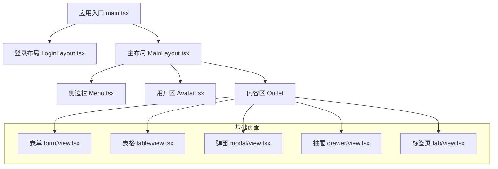
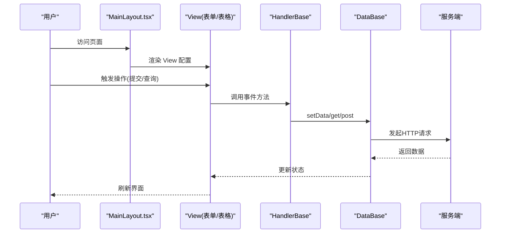
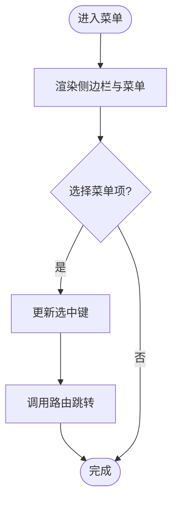
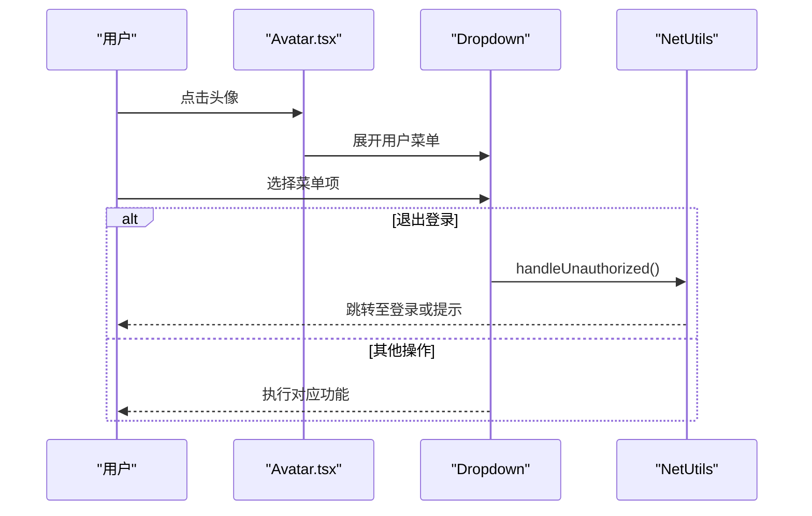
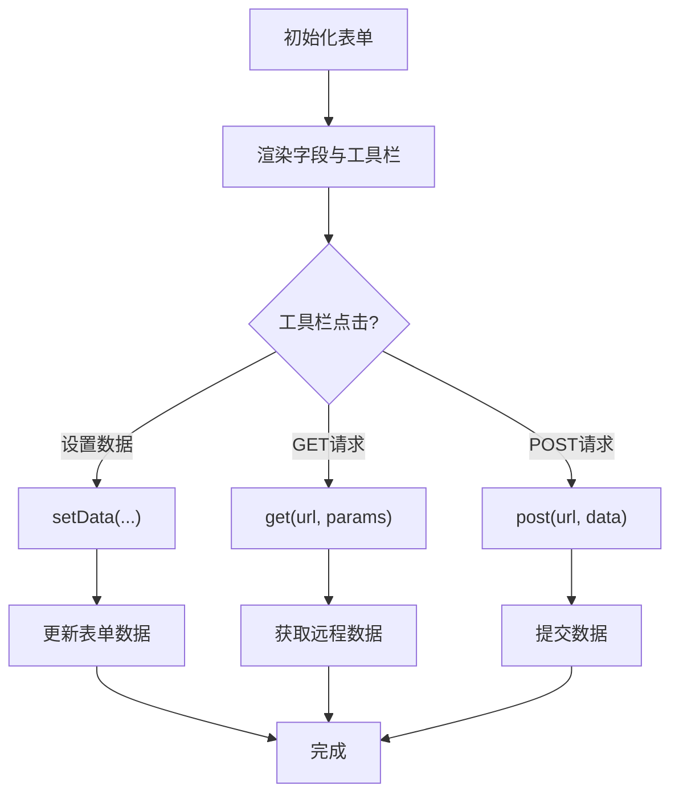
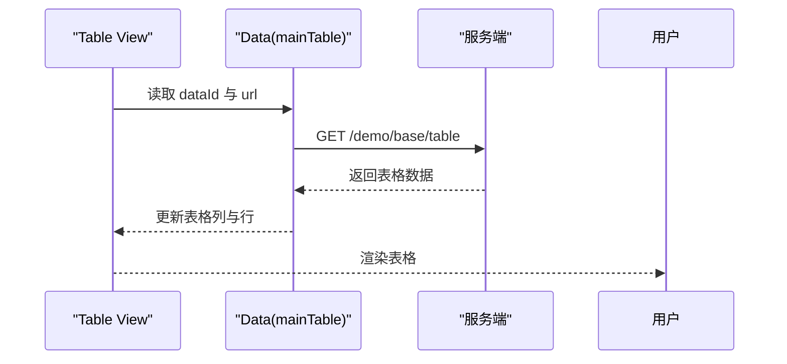
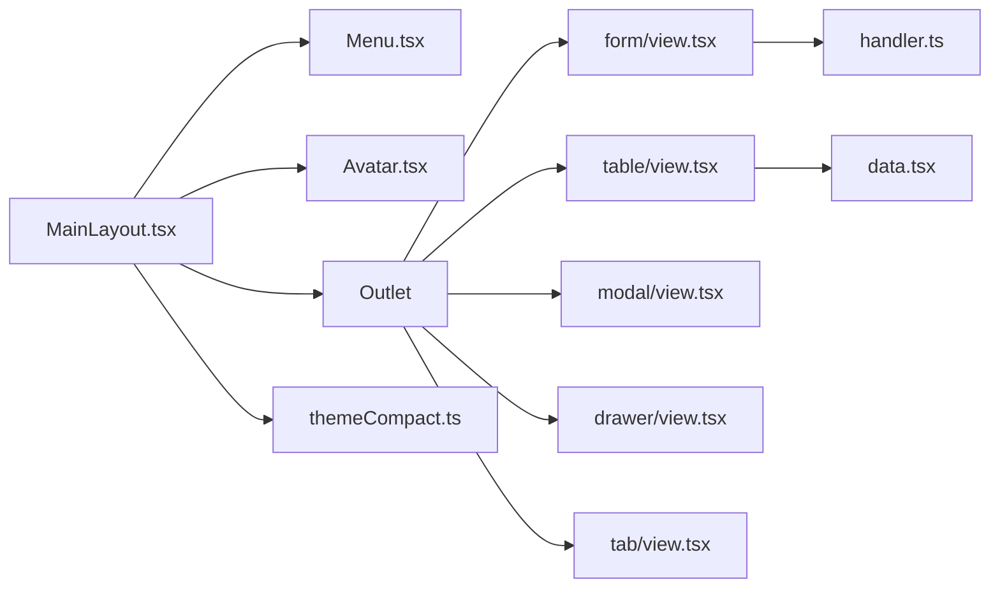

# 组件库

<cite>
**本文引用的文件**
- [apps/demo/src/layouts/main/MainLayout.tsx](file://apps/demo/src/layouts/main/MainLayout.tsx)
- [apps/demo/src/layouts/main/comp/Menu.tsx](file://apps/demo/src/layouts/main/comp/Menu.tsx)
- [apps/demo/src/layouts/main/comp/Avatar.tsx](file://apps/demo/src/layouts/main/comp/Avatar.tsx)
- [apps/demo/src/layouts/main/styles.less](file://apps/demo/src/layouts/main/styles.less)
- [apps/demo/src/layouts/main/comp/Menu.less](file://apps/demo/src/layouts/main/comp/Menu.less)
- [apps/demo/src/pages/base/form/view.tsx](file://apps/demo/src/pages/base/form/view.tsx)
- [apps/demo/src/pages/base/table/view.tsx](file://apps/demo/src/pages/base/table/view.tsx)
- [apps/demo/src/pages/base/modal/view.tsx](file://apps/demo/src/pages/base/modal/view.tsx)
- [apps/demo/src/pages/base/drawer/view.tsx](file://apps/demo/src/pages/base/drawer/view.tsx)
- [apps/demo/src/pages/base/tab/view.tsx](file://apps/demo/src/pages/base/tab/view.tsx)
- [apps/demo/src/pages/base/table/data.tsx](file://apps/demo/src/pages/base/table/data.tsx)
- [apps/demo/src/pages/base/form/handler.ts](file://apps/demo/src/pages/base/form/handler.ts)
- [apps/demo/src/theme/themeDefault.ts](file://apps/demo/src/theme/themeDefault.ts)
- [apps/demo/src/theme/themeCompact.ts](file://apps/demo/src/theme/themeCompact.ts)
- [apps/demo/src/main.tsx](file://apps/demo/src/main.tsx)
- [docs/2.组件用法.md](file://docs/2.组件用法.md)
</cite>

## 目录
1. [简介](#简介)
2. [项目结构](#项目结构)
3. [核心组件](#核心组件)
4. [架构总览](#架构总览)
5. [详细组件分析](#详细组件分析)
6. [依赖关系分析](#依赖关系分析)
7. [性能考虑](#性能考虑)
8. [故障排查指南](#故障排查指南)
9. [结论](#结论)
10. [附录](#附录)

## 简介
本组件库基于 Ant Design 与 React，提供基础 UI 组件（按钮、输入框、表格等）与业务组件（菜单、头像、标签页等），并通过声明式视图配置驱动页面构建。项目采用“数据-处理-视图”的三段式组织方式：Data 负责数据源与路径映射，Handler 负责事件与网络请求，View 通过 VProps 描述表单、表格、布局等组件及其组合关系。主题通过 Ant Design ConfigProvider 全局注入，支持默认与紧凑两种主题。

## 项目结构
- 应用入口与路由：main.tsx 使用 BrowserRouter 挂载根组件，并通过 ConfigProvider 注入主题；登录与主布局分别对应 LoginLayout 与 MainLayout。
- 布局与业务组件：MainLayout 组合侧边栏 Menu 与用户区 Avatar，内容区域承载子路由。
- 基础与业务页面：base 目录下包含表单、表格、弹窗、抽屉、标签页等示例页面，均通过 ViewBase 继承并声明 VProps。
- 主题配置：themeDefault 与 themeCompact 提供两套主题 Token 与组件覆盖。

图表来源
- [apps/demo/src/main.tsx:1-53](file://apps/demo/src/main.tsx#L1-L53)
- [apps/demo/src/layouts/main/MainLayout.tsx:1-77](file://apps/demo/src/layouts/main/MainLayout.tsx#L1-L77)
- [apps/demo/src/layouts/main/comp/Menu.tsx:1-53](file://apps/demo/src/layouts/main/comp/Menu.tsx#L1-L53)
- [apps/demo/src/layouts/main/comp/Avatar.tsx:1-47](file://apps/demo/src/layouts/main/comp/Avatar.tsx#L1-L47)

章节来源
- [apps/demo/src/main.tsx:1-53](file://apps/demo/src/main.tsx#L1-L53)
- [apps/demo/src/layouts/main/MainLayout.tsx:1-77](file://apps/demo/src/layouts/main/MainLayout.tsx#L1-L77)

## 核心组件
- 表单 Form：通过 VProps.Form 声明字段 items 与工具栏 toolList，支持多种控件类型（Text、Input、Select、Switch、Radio、Checkbox、Date、Time、Upload、Link 等）。
- 表格 Table：通过 VProps.Table 声明列 items、搜索项 searchItems，并与 Data 层 URL 绑定实现数据加载。
- 布局 Tab/Flex/Modal/Drawer：通过 VProps.Tab、VProps.Flex、VProps.Modal、VProps.Drawer 组合多个子视图，形成复杂页面结构。
- 业务组件 Menu/Avatar：封装侧边导航与用户操作区，集成路由跳转与权限退出逻辑。

章节来源
- [docs/2.组件用法.md:1-455](file://docs/2.组件用法.md#L1-L455)
- [apps/demo/src/pages/base/form/view.tsx:1-99](file://apps/demo/src/pages/base/form/view.tsx#L1-L99)
- [apps/demo/src/pages/base/table/view.tsx:1-86](file://apps/demo/src/pages/base/table/view.tsx#L1-L86)
- [apps/demo/src/pages/base/tab/view.tsx:1-60](file://apps/demo/src/pages/base/tab/view.tsx#L1-L60)
- [apps/demo/src/pages/base/modal/view.tsx:1-46](file://apps/demo/src/pages/base/modal/view.tsx#L1-L46)
- [apps/demo/src/pages/base/drawer/view.tsx:1-47](file://apps/demo/src/pages/base/drawer/view.tsx#L1-L47)
- [apps/demo/src/layouts/main/comp/Menu.tsx:1-53](file://apps/demo/src/layouts/main/comp/Menu.tsx#L1-L53)
- [apps/demo/src/layouts/main/comp/Avatar.tsx:1-47](file://apps/demo/src/layouts/main/comp/Avatar.tsx#L1-L47)

## 架构总览
整体采用“声明式视图 + 数据/处理分离”的架构：
- 视图层：View 类继承 ViewBase，通过 VProps 描述 UI 结构与交互。
- 数据层：Data 类继承 DataBase，定义数据源 URL、键属性与路径绑定。
- 处理层：Handler 类继承 HandlerBase，封装事件与网络请求。
- 框架层：@jl/framework 提供 ViewRoot、ViewBase、DataBase、HandlerBase 等能力。
- 主题层：通过 Ant Design ConfigProvider 注入主题 Token 与组件样式覆盖。

图表来源
- [apps/demo/src/pages/base/form/view.tsx:1-99](file://apps/demo/src/pages/base/form/view.tsx#L1-L99)
- [apps/demo/src/pages/base/table/view.tsx:1-86](file://apps/demo/src/pages/base/table/view.tsx#L1-L86)
- [apps/demo/src/pages/base/form/handler.ts:1-18](file://apps/demo/src/pages/base/form/handler.ts#L1-L18)
- [apps/demo/src/pages/base/table/data.tsx:1-22](file://apps/demo/src/pages/base/table/data.tsx#L1-L22)

## 详细组件分析

### 菜单组件 Menu
- 职责：展示侧边导航，支持折叠、滚动与选中态管理，点击后执行路由跳转。
- Props 接口：
  - collapsed?: boolean — 控制侧边栏折叠状态
  - menuItems?: MenuProps['items'] — 菜单项数据
- 事件处理：onSelect 回调中更新选中键并调用路由导航。
- 样式定制：通过 CSS 类 .main-sider 与 .menu 调整高度、边框与滚动条样式；Logo 区域使用环境变量标题。
- 主题支持：Menu 使用暗色主题模式，可通过全局主题 Token 进一步定制颜色与圆角。

图表来源
- [apps/demo/src/layouts/main/comp/Menu.tsx:1-53](file://apps/demo/src/layouts/main/comp/Menu.tsx#L1-L53)
- [apps/demo/src/layouts/main/comp/Menu.less:1-31](file://apps/demo/src/layouts/main/comp/Menu.less#L1-L31)

章节来源
- [apps/demo/src/layouts/main/comp/Menu.tsx:1-53](file://apps/demo/src/layouts/main/comp/Menu.tsx#L1-L53)
- [apps/demo/src/layouts/main/comp/Menu.less:1-31](file://apps/demo/src/layouts/main/comp/Menu.less#L1-L31)

### 头像组件 Avatar
- 职责：聚合通知、设置、全屏与用户下拉菜单，提供快捷操作入口。
- Props 接口：无外部 Props（内部维护菜单项与点击处理）。
- 事件处理：Dropdown onClick 根据 key 执行不同动作，如退出登录时调用统一鉴权处理。
- 样式定制：通过 .user-area 与 Space 间距控制布局。
- 主题支持：图标与背景色可随主题 Token 变化。

图表来源
- [apps/demo/src/layouts/main/comp/Avatar.tsx:1-47](file://apps/demo/src/layouts/main/comp/Avatar.tsx#L1-L47)

章节来源
- [apps/demo/src/layouts/main/comp/Avatar.tsx:1-47](file://apps/demo/src/layouts/main/comp/Avatar.tsx#L1-L47)

### 表单组件 Form
- 职责：声明式构建表单，支持多控件类型与工具栏按钮。
- Props 接口（VProps.Form）：
  - id: string — 唯一标识
  - type: VType.Form
  - path: string[] — 数据路径
  - items: 字段数组 — title、field、ctrl（控件类型与配置）
  - toolList: 工具栏按钮数组 — type(Ctrl.Button)、text、onClick
- 事件处理：toolList 中的按钮调用 Handler 方法，如 setData、get/post 请求。
- 样式定制：通过 Ant Design Form 默认样式与主题 Token 控制。
- 主题支持：全局 ConfigProvider 注入主题，影响所有表单控件。

图表来源
- [apps/demo/src/pages/base/form/view.tsx:1-99](file://apps/demo/src/pages/base/form/view.tsx#L1-L99)
- [apps/demo/src/pages/base/form/handler.ts:1-18](file://apps/demo/src/pages/base/form/handler.ts#L1-L18)

章节来源
- [apps/demo/src/pages/base/form/view.tsx:1-99](file://apps/demo/src/pages/base/form/view.tsx#L1-L99)
- [apps/demo/src/pages/base/form/handler.ts:1-18](file://apps/demo/src/pages/base/form/handler.ts#L1-L18)

### 表格组件 Table
- 职责：声明式构建表格，支持列定义与搜索项，结合 Data 层进行数据加载。
- Props 接口（VProps.Table）：
  - id: string
  - type: VType.Table
  - dataId: string — 关联的数据源 ID
  - searchItems: 搜索项数组 — title、field
  - items: 列定义数组 — title、field
- 事件处理：由框架与 Data/Handler 协作完成数据获取与更新。
- 样式定制：通过主题 Token 的 components.Table 覆盖样式。
- 主题支持：全局主题影响表格外观。

图表来源
- [apps/demo/src/pages/base/table/view.tsx:1-86](file://apps/demo/src/pages/base/table/view.tsx#L1-L86)
- [apps/demo/src/pages/base/table/data.tsx:1-22](file://apps/demo/src/pages/base/table/data.tsx#L1-L22)

章节来源
- [apps/demo/src/pages/base/table/view.tsx:1-86](file://apps/demo/src/pages/base/table/view.tsx#L1-L86)
- [apps/demo/src/pages/base/table/data.tsx:1-22](file://apps/demo/src/pages/base/table/data.tsx#L1-L22)

### 标签页布局 Tab
- 职责：将多个子视图（如表单、表格）以标签页形式组合展示。
- Props 接口（VProps.Tab）：
  - type: VType.LayoutTab
  - id: string
  - items: 标签项数组 — key、label、viewId
- 事件处理：切换标签时加载对应 viewId 的视图。
- 样式定制：通过主题 Token 的 components.Tab 覆盖样式。
- 主题支持：全局主题影响标签页外观。

章节来源
- [apps/demo/src/pages/base/tab/view.tsx:1-60](file://apps/demo/src/pages/base/tab/view.tsx#L1-L60)

### 弹窗布局 Modal
- 职责：以模态窗口形式承载表单或其他视图。
- Props 接口（VProps.Modal）：
  - id: string
  - type: VType.LayoutModal
  - viewId: string — 弹窗内嵌视图 ID
- 事件处理：通过工具栏按钮触发打开/关闭。
- 样式定制：通过主题 Token 的 components.Modal 覆盖样式。
- 主题支持：全局主题影响弹窗外观。

章节来源
- [apps/demo/src/pages/base/modal/view.tsx:1-46](file://apps/demo/src/pages/base/modal/view.tsx#L1-L46)

### 抽屉布局 Drawer
- 职责：以侧滑抽屉形式承载表单或其他视图。
- Props 接口（VProps.Drawer）：
  - id: string
  - type: VType.LayoutDrawer
  - width: number — 抽屉宽度
  - viewId: string — 抽屉内嵌视图 ID
- 事件处理：通过工具栏按钮触发打开/关闭。
- 样式定制：通过主题 Token 的 components.Drawer 覆盖样式。
- 主题支持：全局主题影响抽屉外观。

章节来源
- [apps/demo/src/pages/base/drawer/view.tsx:1-47](file://apps/demo/src/pages/base/drawer/view.tsx#L1-L47)

### 主题与样式定制
- 主题配置：
  - 默认主题 themeDefault：使用 defaultAlgorithm，设置 borderRadius 与组件覆盖。
  - 紧凑主题 themeCompact：使用 compactAlgorithm，适合高密度信息展示。
- 全局注入：在 main.tsx 中使用 ConfigProvider 注入主题，确保全应用一致风格。
- 组件级覆盖：通过 ThemeConfig.components 对特定组件（如 Table、Input）进行样式微调。

章节来源
- [apps/demo/src/theme/themeDefault.ts:1-16](file://apps/demo/src/theme/themeDefault.ts#L1-L16)
- [apps/demo/src/theme/themeCompact.ts:1-16](file://apps/demo/src/theme/themeCompact.ts#L1-L16)
- [apps/demo/src/main.tsx:1-53](file://apps/demo/src/main.tsx#L1-L53)

## 依赖关系分析
- 布局依赖：MainLayout 依赖 Menu、Avatar 与路由 Outlet，构成应用骨架。
- 页面依赖：各 base 页面依赖 @jl/framework 提供的 ViewBase、VProps、Ctrl、VType 等能力。
- 数据依赖：Data 层通过 DataBase 管理 URL、keyAttr 与路径绑定，供 View 消费。
- 主题依赖：全局 ConfigProvider 为所有组件提供一致的视觉风格。

图表来源
- [apps/demo/src/layouts/main/MainLayout.tsx:1-77](file://apps/demo/src/layouts/main/MainLayout.tsx#L1-L77)
- [apps/demo/src/pages/base/form/view.tsx:1-99](file://apps/demo/src/pages/base/form/view.tsx#L1-L99)
- [apps/demo/src/pages/base/table/view.tsx:1-86](file://apps/demo/src/pages/base/table/view.tsx#L1-L86)
- [apps/demo/src/pages/base/modal/view.tsx:1-46](file://apps/demo/src/pages/base/modal/view.tsx#L1-L46)
- [apps/demo/src/pages/base/drawer/view.tsx:1-47](file://apps/demo/src/pages/base/drawer/view.tsx#L1-L47)
- [apps/demo/src/pages/base/tab/view.tsx:1-60](file://apps/demo/src/pages/base/tab/view.tsx#L1-L60)
- [apps/demo/src/pages/base/form/handler.ts:1-18](file://apps/demo/src/pages/base/form/handler.ts#L1-L18)
- [apps/demo/src/pages/base/table/data.tsx:1-22](file://apps/demo/src/pages/base/table/data.tsx#L1-L22)
- [apps/demo/src/theme/themeCompact.ts:1-16](file://apps/demo/src/theme/themeCompact.ts#L1-L16)

章节来源
- [apps/demo/src/layouts/main/MainLayout.tsx:1-77](file://apps/demo/src/layouts/main/MainLayout.tsx#L1-L77)
- [apps/demo/src/pages/base/form/view.tsx:1-99](file://apps/demo/src/pages/base/form/view.tsx#L1-L99)
- [apps/demo/src/pages/base/table/view.tsx:1-86](file://apps/demo/src/pages/base/table/view.tsx#L1-L86)
- [apps/demo/src/pages/base/modal/view.tsx:1-46](file://apps/demo/src/pages/base/modal/view.tsx#L1-L46)
- [apps/demo/src/pages/base/drawer/view.tsx:1-47](file://apps/demo/src/pages/base/drawer/view.tsx#L1-L47)
- [apps/demo/src/pages/base/tab/view.tsx:1-60](file://apps/demo/src/pages/base/tab/view.tsx#L1-L60)
- [apps/demo/src/pages/base/form/handler.ts:1-18](file://apps/demo/src/pages/base/form/handler.ts#L1-L18)
- [apps/demo/src/pages/base/table/data.tsx:1-22](file://apps/demo/src/pages/base/table/data.tsx#L1-L22)
- [apps/demo/src/theme/themeCompact.ts:1-16](file://apps/demo/src/theme/themeCompact.ts#L1-L16)

## 性能考虑
- 列表渲染优化：表格数据量较大时，建议分页或虚拟滚动；避免在 items 中创建过多闭包函数。
- 状态更新最小化：Handler 中尽量合并多次 setData 调用，减少重渲染次数。
- 网络请求节流：频繁触发的查询应加入防抖或缓存策略，避免重复请求。
- 主题与样式：合理使用主题 Token，避免过度覆盖导致样式计算开销增加。
- 资源加载：按需懒加载页面与组件，减少首屏体积。

## 故障排查指南
- 菜单数据为空：检查 NetUtils.get 返回码与数据结构，确认 API 地址与鉴权是否正确。
- 表单数据未更新：确认 setData 的路径参数与字段名是否匹配，查看 Data 层 path 配置。
- 表格数据不显示：核对 Data 层的 url 与 keyAttr，确保后端返回字段与列定义一致。
- 主题不生效：确认 ConfigProvider 已包裹应用根节点，且主题 Token 正确传入。
- 弹窗/抽屉无法打开：检查工具栏按钮绑定的 handler 方法与 viewId 是否正确。

章节来源
- [apps/demo/src/layouts/main/MainLayout.tsx:1-77](file://apps/demo/src/layouts/main/MainLayout.tsx#L1-L77)
- [apps/demo/src/pages/base/form/view.tsx:1-99](file://apps/demo/src/pages/base/form/view.tsx#L1-L99)
- [apps/demo/src/pages/base/table/view.tsx:1-86](file://apps/demo/src/pages/base/table/view.tsx#L1-L86)
- [apps/demo/src/pages/base/modal/view.tsx:1-46](file://apps/demo/src/pages/base/modal/view.tsx#L1-L46)
- [apps/demo/src/pages/base/drawer/view.tsx:1-47](file://apps/demo/src/pages/base/drawer/view.tsx#L1-L47)
- [apps/demo/src/theme/themeCompact.ts:1-16](file://apps/demo/src/theme/themeCompact.ts#L1-L16)

## 结论
本项目以声明式视图为核心，结合数据与处理分离，快速构建表单、表格与复合页面。通过 Ant Design 主题机制实现统一的视觉风格，借助框架提供的 ViewBase/DataBase/HandlerBase 降低样板代码。建议在大规模应用中继续遵循此架构，注重性能优化与可维护性。

## 附录
- 组件分类与用法参考：详见文档“组件用法”，涵盖基础组件、控件组件、布局组件与复合组件的使用示例。
- 最佳实践：
  - 使用 VProps 清晰描述 UI 结构，保持 View 轻量。
  - 在 Handler 中集中处理事件与网络请求，便于测试与维护。
  - 通过 Data 层统一管理数据源与路径，提升复用性。
  - 利用主题 Token 进行样式定制，避免硬编码样式。
- 响应式设计与无障碍：
  - 响应式：使用 Ant Design 栅格与布局组件适配不同屏幕尺寸。
  - 无障碍：为关键交互元素添加 aria-* 属性，确保键盘可达性与屏幕阅读器友好。

章节来源
- [docs/2.组件用法.md:1-455](file://docs/2.组件用法.md#L1-L455)