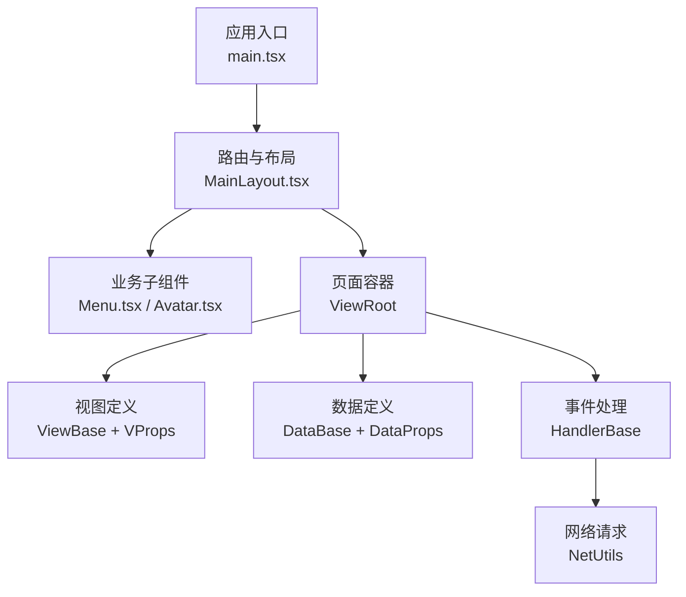
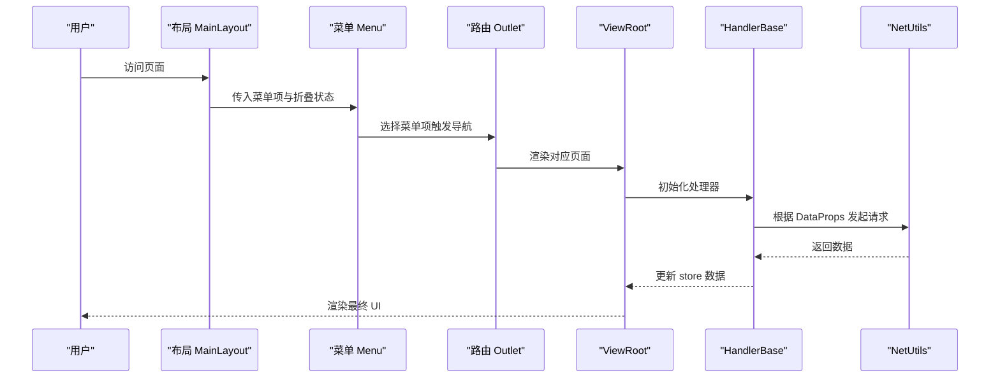
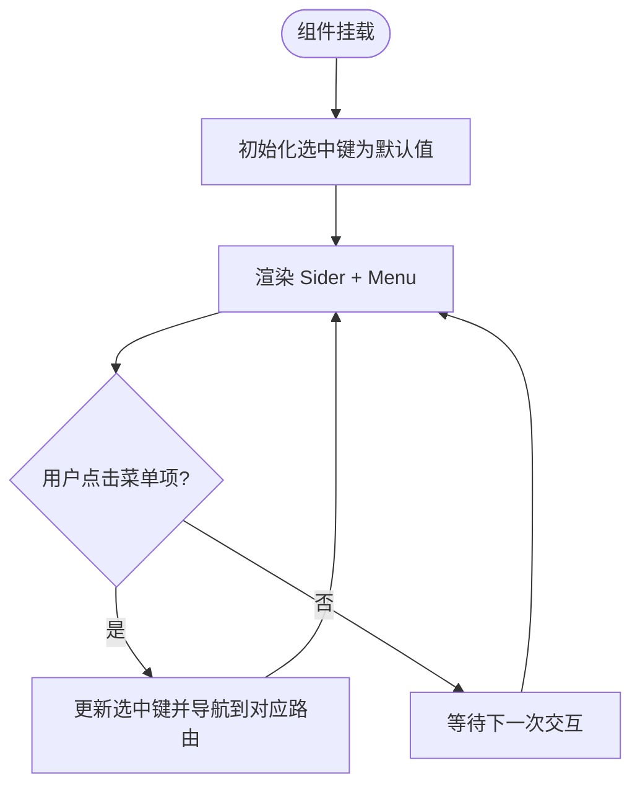
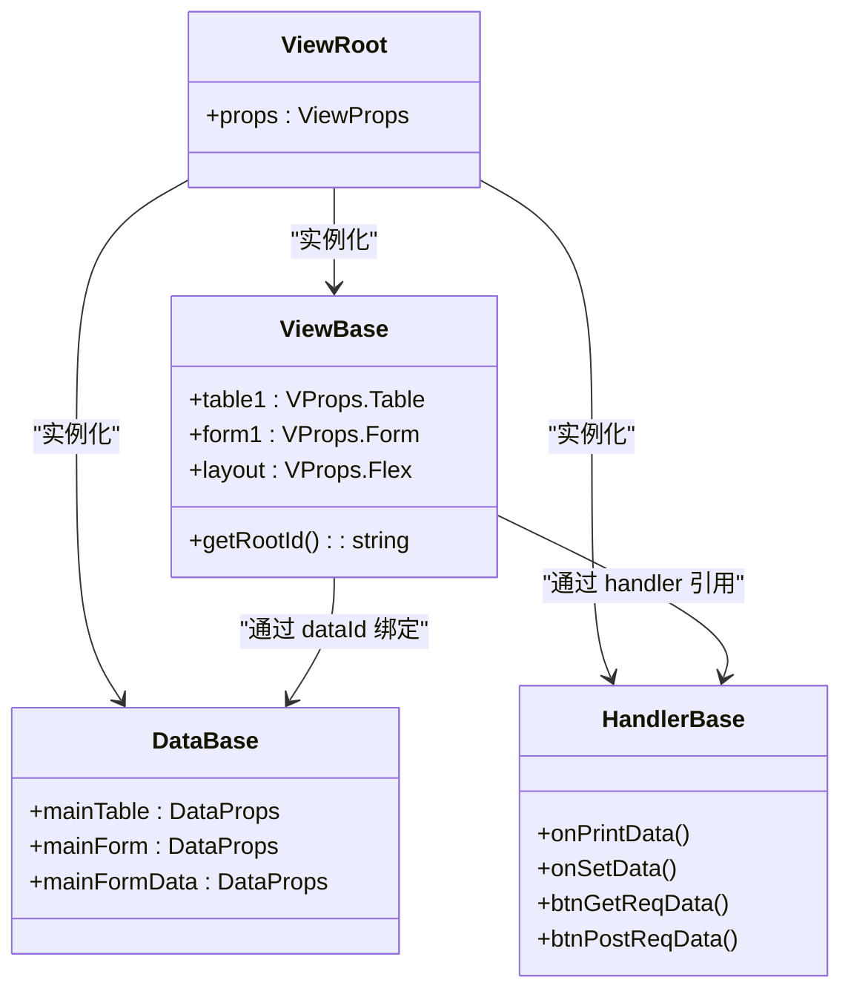
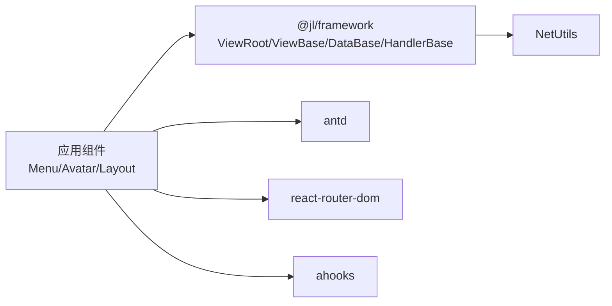

# 自定义组件

<cite>
**本文引用的文件**
- [Menu.tsx](file://apps/demo/src/layouts/main/comp/Menu.tsx)
- [Avatar.tsx](file://apps/demo/src/layouts/main/comp/Avatar.tsx)
- [MainLayout.tsx](file://apps/demo/src/layouts/main/MainLayout.tsx)
- [2.组件用法.md](file://docs/2.组件用法.md)
- [framework-design.md](file://docs/design/framework-design.md)
- [index.tsx（表格页）](file://apps/demo/src/pages/base/table/index.tsx)
- [index.tsx（表单页）](file://apps/demo/src/pages/base/form/index.tsx)
- [data.tsx（表格数据）](file://apps/demo/src/pages/base/table/data.tsx)
- [handler.ts（表格处理器）](file://apps/demo/src/pages/base/table/handler.ts)
- [view.tsx（表格视图）](file://apps/demo/src/pages/base/table/view.tsx)
- [framework index.ts](file://packages/framework/src/index.ts)
- [framework interface.ts](file://packages/framework/src/interface.ts)
</cite>

## 目录
1. [简介](#简介)
2. [项目结构](#项目结构)
3. [核心组件](#核心组件)
4. [架构总览](#架构总览)
5. [详细组件分析](#详细组件分析)
6. [依赖关系分析](#依赖关系分析)
7. [性能考虑](#性能考虑)
8. [故障排查指南](#故障排查指南)
9. [结论](#结论)
10. [附录：开发流程与最佳实践](#附录：开发流程与最佳实践)

## 简介
本指南面向基于 FrontArk 框架开发“自定义业务组件”的工程师，目标是帮助你掌握：
- 组件结构设计、Props 定义、事件处理、样式定制
- 生命周期管理、状态管理与跨组件通信
- 完整的自定义组件示例与最佳实践
- 测试与发布流程建议

本仓库提供了两类组件范式：
- 布局级业务组件：如侧边菜单、用户头像等，适合封装页面级交互与样式
- 声明式视图组件：通过 ViewRoot + ViewBase/DataBase/HandlerBase 实现“配置驱动”的表单/表格等复杂组件

## 项目结构
应用层采用分层组织：
- apps/demo：示例应用，包含布局、页面、主题、初始化脚本等
- packages/framework：核心框架，提供 ViewRoot、ViewBase、DataBase、HandlerBase、NetUtils 等能力
- docs：文档与设计说明

图表来源
- [MainLayout.tsx:16-77](file://apps/demo/src/layouts/main/MainLayout.tsx#L16-L77)
- [framework-design.md:32-57](file://docs/design/framework-design.md#L32-L57)

章节来源
- [framework-design.md:1-29](file://docs/design/framework-design.md#L1-L29)
- [MainLayout.tsx:16-77](file://apps/demo/src/layouts/main/MainLayout.tsx#L16-L77)

## 核心组件
- 布局级业务组件
  - 菜单组件：负责导航、选中态、折叠态与滚动容器
  - 头像组件：用户下拉菜单、通知/设置/全屏按钮、退出登录
- 声明式视图组件
  - 通过 ViewRoot 注入 ViewClass、DataClass、HandlerClass，由框架自动完成状态绑定、数据请求与渲染

章节来源
- [Menu.tsx:10-52](file://apps/demo/src/layouts/main/comp/Menu.tsx#L10-L52)
- [Avatar.tsx:8-46](file://apps/demo/src/layouts/main/comp/Avatar.tsx#L8-L46)
- [2.组件用法.md:430-444](file://docs/2.组件用法.md#L430-L444)

## 架构总览
FrontArk 采用“视图-数据-处理器”三层分离：
- 视图层：ViewBase + VProps 描述 UI 结构与控件
- 数据层：DataBase + DataProps 描述数据来源、路径与依赖
- 处理器层：HandlerBase 封装事件与业务逻辑，调用 NetUtils 发起请求或更新状态

图表来源
- [framework-design.md:32-57](file://docs/design/framework-design.md#L32-L57)
- [framework index.ts:1-69](file://packages/framework/src/index.ts#L1-L69)

章节来源
- [framework-design.md:32-57](file://docs/design/framework-design.md#L32-L57)
- [framework index.ts:1-69](file://packages/framework/src/index.ts#L1-L69)

## 详细组件分析

### 布局级业务组件：菜单（Menu.tsx）
- 职责
  - 接收 collapsed 与 menuItems 作为 Props
  - 维护选中态 selectedKey，结合路由进行跳转
  - 使用滚动容器优化长列表体验
- 关键点
  - 使用 useMemoizedFn 稳定回调引用，避免不必要的重渲染
  - 通过 antd Layout.Menu 实现内联模式与深色主题
  - 样式通过独立 less 文件隔离

图表来源
- [Menu.tsx:17-49](file://apps/demo/src/layouts/main/comp/Menu.tsx#L17-L49)

章节来源
- [Menu.tsx:10-52](file://apps/demo/src/layouts/main/comp/Menu.tsx#L10-L52)

### 布局级业务组件：头像（Avatar.tsx）
- 职责
  - 展示用户头像与常用操作按钮
  - 通过 Dropdown 提供个人中心、设置、退出登录等入口
- 关键点
  - 退出登录调用 NetUtils.handleUnauthorized() 统一处理鉴权失效
  - 使用 ahooks 的 useMemoizedFn 稳定 onClick 回调

章节来源
- [Avatar.tsx:8-46](file://apps/demo/src/layouts/main/comp/Avatar.tsx#L8-L46)

### 声明式视图组件：表格+表单（ViewRoot 范式）
- 页面入口
  - 通过 ViewRoot 注入 ViewClass、DataClass、HandlerClass
- 数据定义
  - DataBase 中声明 mainTable、mainForm、mainFormData 等数据源及依赖关系
- 视图定义
  - ViewBase 中声明 table1、form1、layout 等视图结构，并通过 dataId 绑定数据
- 事件处理
  - HandlerBase 中实现打印数据、设置数据、GET/POST 请求等方法

图表来源
- [framework index.ts:1-69](file://packages/framework/src/index.ts#L1-L69)
- [index.tsx（表格页）:1-10](file://apps/demo/src/pages/base/table/index.tsx#L1-L10)
- [data.tsx（表格数据）:1-22](file://apps/demo/src/pages/base/table/data.tsx#L1-L22)
- [handler.ts（表格处理器）:1-30](file://apps/demo/src/pages/base/table/handler.ts#L1-L30)
- [view.tsx（表格视图）:1-86](file://apps/demo/src/pages/base/table/view.tsx#L1-L86)

章节来源
- [index.tsx（表格页）:1-10](file://apps/demo/src/pages/base/table/index.tsx#L1-L10)
- [data.tsx（表格数据）:1-22](file://apps/demo/src/pages/base/table/data.tsx#L1-L22)
- [handler.ts（表格处理器）:1-30](file://apps/demo/src/pages/base/table/handler.ts#L1-L30)
- [view.tsx（表格视图）:1-86](file://apps/demo/src/pages/base/table/view.tsx#L1-L86)

### 声明式视图组件：表单（ViewRoot 范式）
- 页面入口与表格页一致，均通过 ViewRoot 装配
- 数据、视图、处理器按相同约定组织，便于复用与维护

章节来源
- [index.tsx（表单页）:1-10](file://apps/demo/src/pages/base/form/index.tsx#L1-L10)

### 组件通信与状态管理
- 父子通信
  - 布局级组件通过 Props 传递数据与回调（如 Menu 的 collapsed、menuItems）
- 跨组件通信
  - 声明式视图通过 Store（Zustand）在 ViewRoot 中统一管理，Handler 通过 setData/getData 读写共享状态
- 数据请求
  - 通过 DataBase 配置 url/path/keyAttr 等，框架自动组装参数、处理依赖与缓存，再交由 NetUtils 发送请求

章节来源
- [framework-design.md:59-128](file://docs/design/framework-design.md#L59-L128)
- [framework index.ts:1-69](file://packages/framework/src/index.ts#L1-L69)

## 依赖关系分析
- 应用层依赖框架层提供的 ViewRoot、ViewBase、DataBase、HandlerBase、NetUtils
- 布局级组件依赖 antd、ahooks、react-router-dom 等第三方库
- 声明式视图通过类型导出集中暴露 VType、Ctrl、VProps 等类型，保证类型安全

图表来源
- [framework index.ts:1-69](file://packages/framework/src/index.ts#L1-L69)
- [MainLayout.tsx:1-12](file://apps/demo/src/layouts/main/MainLayout.tsx#L1-L12)

章节来源
- [framework index.ts:1-69](file://packages/framework/src/index.ts#L1-L69)
- [MainLayout.tsx:1-12](file://apps/demo/src/layouts/main/MainLayout.tsx#L1-L12)

## 性能考虑
- 回调稳定性
  - 使用 useMemoizedFn 包裹事件处理函数，避免子组件因回调变化导致的重复渲染
- 列表滚动
  - 使用虚拟滚动容器（SimpleBar）提升长列表性能
- 请求与状态
  - 合理拆分 DataProps，利用依赖检查减少冗余请求
  - 按需刷新：通过 refreshByViewId 精确刷新指定视图的数据
- 样式与主题
  - 使用 antd theme.useToken 获取 token，保持主题一致性

章节来源
- [Menu.tsx:21-24](file://apps/demo/src/layouts/main/comp/Menu.tsx#L21-L24)
- [MainLayout.tsx:41-43](file://apps/demo/src/layouts/main/MainLayout.tsx#L41-L43)
- [framework-design.md:129-162](file://docs/design/framework-design.md#L129-L162)

## 故障排查指南
- 未授权错误
  - 使用 NetUtils.handleUnauthorized() 统一处理鉴权失败场景
- 菜单数据加载失败
  - 捕获异常并提示用户；检查环境变量与接口地址是否正确
- 数据未更新
  - 确认 DataProps 的 path/url/keyAttr 配置正确
  - 检查 Handler 中是否调用了 setData 或触发了正确的刷新方法
- 路由跳转无效
  - 确认 Menu 的 onSelect 回调已调用 navigate，且路由配置正确

章节来源
- [Avatar.tsx:21-23](file://apps/demo/src/layouts/main/comp/Avatar.tsx#L21-L23)
- [MainLayout.tsx:22-33](file://apps/demo/src/layouts/main/MainLayout.tsx#L22-L33)
- [framework-design.md:48-57](file://docs/design/framework-design.md#L48-L57)

## 结论
- 对于简单可复用的 UI 片段，优先采用布局级业务组件（如 Menu、Avatar），通过 Props 与事件进行通信
- 对于复杂的数据驱动界面，采用声明式视图组件（ViewRoot + ViewBase/DataBase/HandlerBase），以配置驱动的方式快速构建表单/表格等页面
- 借助框架的状态管理与网络层，实现清晰的职责分离与良好的可维护性

## 附录：开发流程与最佳实践

### 组件结构设计
- 单一职责：每个组件聚焦一个功能点（如导航、用户操作、表单/表格）
- 明确 Props：对可选属性提供默认值，使用 TypeScript 类型约束
- 样式隔离：使用独立的 less/css 文件，避免全局污染

章节来源
- [Menu.tsx:10-13](file://apps/demo/src/layouts/main/comp/Menu.tsx#L10-L13)
- [Avatar.tsx:8-13](file://apps/demo/src/layouts/main/comp/Avatar.tsx#L8-L13)

### Props 定义
- 使用 TypeScript 接口定义 Props，确保类型安全
- 对数组类 Props 提供空数组默认值，避免空指针问题

章节来源
- [Menu.tsx:10-13](file://apps/demo/src/layouts/main/comp/Menu.tsx#L10-L13)

### 事件处理
- 使用 ahooks 的 useMemoizedFn 稳定回调引用
- 将业务逻辑下沉到 Handler 中，UI 仅负责触发

章节来源
- [Menu.tsx:21-24](file://apps/demo/src/layouts/main/comp/Menu.tsx#L21-L24)
- [handler.ts（表格处理器）:1-30](file://apps/demo/src/pages/base/table/handler.ts#L1-L30)

### 样式定制
- 使用 antd 主题 token 保持一致性
- 通过 className 与外部样式文件控制布局与外观

章节来源
- [MainLayout.tsx:41-43](file://apps/demo/src/layouts/main/MainLayout.tsx#L41-L43)

### 生命周期管理
- 页面级数据加载：在布局或页面中使用 useEffect 触发初始数据请求
- 路由变化监听：根据 location.pathname 动态刷新菜单或数据

章节来源
- [MainLayout.tsx:35-39](file://apps/demo/src/layouts/main/MainLayout.tsx#L35-L39)

### 状态管理与通信
- 局部状态：组件内部 useState 管理（如选中键、折叠态）
- 全局状态：通过 ViewRoot 注入的 Store 管理共享数据
- 跨组件通信：通过 Props 与事件回调，或通过 Store 的 setData/getData

章节来源
- [framework-design.md:59-128](file://docs/design/framework-design.md#L59-L128)

### 完整示例：声明式表单/表格
- 页面入口：使用 ViewRoot 注入三类类
- 数据定义：在 DataBase 中声明数据源与依赖
- 视图定义：在 ViewBase 中声明控件与布局
- 事件处理：在 HandlerBase 中实现交互逻辑

章节来源
- [2.组件用法.md:347-428](file://docs/2.组件用法.md#L347-L428)
- [index.tsx（表格页）:1-10](file://apps/demo/src/pages/base/table/index.tsx#L1-L10)
- [data.tsx（表格数据）:1-22](file://apps/demo/src/pages/base/table/data.tsx#L1-L22)
- [handler.ts（表格处理器）:1-30](file://apps/demo/src/pages/base/table/handler.ts#L1-L30)
- [view.tsx（表格视图）:1-86](file://apps/demo/src/pages/base/table/view.tsx#L1-L86)

### 测试建议
- 单元测试
  - 针对 Handler 中的方法编写用例，验证数据处理与副作用
- 集成测试
  - 使用 ViewRoot 搭建最小可用页面，模拟数据与网络响应，验证渲染结果
- 性能测试
  - 使用 printStats/resetStats 统计 getData 使用情况，定位热点

章节来源
- [framework-design.md:163-204](file://docs/design/framework-design.md#L163-L204)
- [handler.ts（表格处理器）:12-18](file://apps/demo/src/pages/base/table/handler.ts#L12-L18)

### 发布流程建议
- 代码质量
  - 使用 ESLint/Prettier/Stylelint 统一规范
- 构建与预览
  - 使用 pnpm scripts 执行 dev/build/preview
- 包管理
  - 通过 workspace 方式管理 framework 与应用依赖，确保版本一致

章节来源
- [package.json（demo）:6-13](file://apps/demo/package.json#L6-L13)