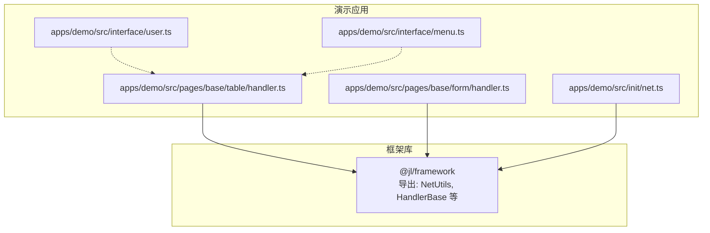
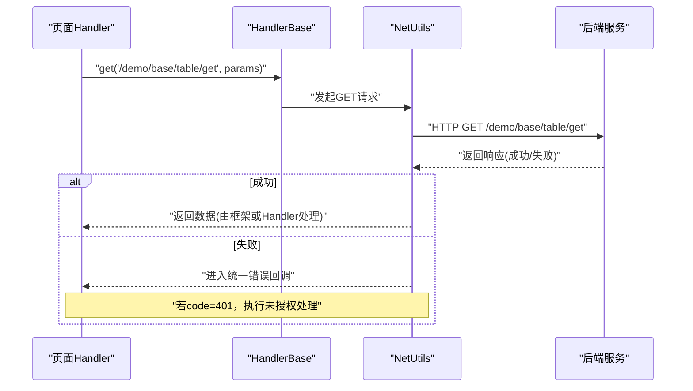
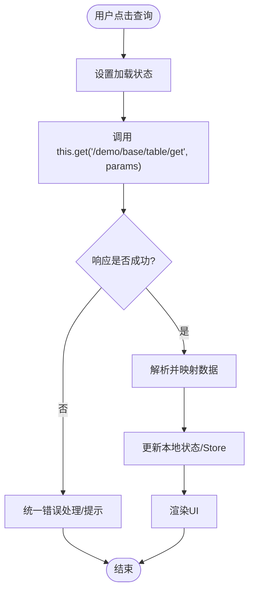
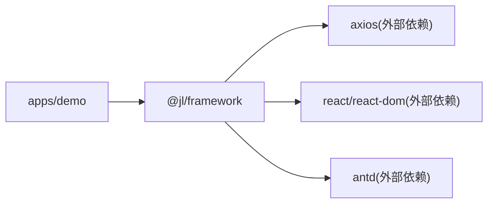

# API调用

<cite>
**本文引用的文件**
- [apps/demo/src/init/net.ts](file://apps/demo/src/init/net.ts)
- [apps/demo/src/interface/user.ts](file://apps/demo/src/interface/user.ts)
- [apps/demo/src/interface/menu.ts](file://apps/demo/src/interface/menu.ts)
- [apps/demo/src/pages/base/table/handler.ts](file://apps/demo/src/pages/base/table/handler.ts)
- [apps/demo/src/pages/base/form/handler.ts](file://apps/demo/src/pages/base/form/handler.ts)
- [packages/framework/package.json](file://packages/framework/package.json)
- [packages/framework/vite.config.ts](file://packages/framework/vite.config.ts)
</cite>

## 目录
1. [简介](#简介)
2. [项目结构](#项目结构)
3. [核心组件](#核心组件)
4. [架构总览](#架构总览)
5. [详细组件分析](#详细组件分析)
6. [依赖关系分析](#依赖关系分析)
7. [性能考虑](#性能考虑)
8. [故障排查指南](#故障排查指南)
9. [结论](#结论)
10. [附录](#附录)

## 简介
本章节面向使用本仓库的开发者，系统化说明在 Handler 中发起 API 调用的标准实现模式。内容涵盖：
- GET、POST、PUT、DELETE 等 HTTP 方法的封装与使用方式
- 请求参数类型定义与验证（TypeScript 接口）
- 响应数据的处理与转换（成功数据提取、错误统一处理）
- 完整的 API 调用示例（用户认证、数据查询、数据提交）
- 异步处理、加载状态管理与错误重试机制的实践建议

## 项目结构
本项目采用应用+框架包的组织方式：
- apps/demo：演示应用，包含页面、Handler、接口类型定义以及网络初始化
- packages/framework：基础框架库，提供 HandlerBase、NetUtils 等能力（通过构建产物对外暴露）

图表来源
- [apps/demo/src/pages/base/table/handler.ts:1-30](file://apps/demo/src/pages/base/table/handler.ts#L1-L30)
- [apps/demo/src/pages/base/form/handler.ts:1-18](file://apps/demo/src/pages/base/form/handler.ts#L1-L18)
- [apps/demo/src/interface/user.ts:1-9](file://apps/demo/src/interface/user.ts#L1-L9)
- [apps/demo/src/interface/menu.ts:1-6](file://apps/demo/src/interface/menu.ts#L1-L6)
- [apps/demo/src/init/net.ts:1-20](file://apps/demo/src/init/net.ts#L1-L20)

章节来源
- [apps/demo/src/pages/base/table/handler.ts:1-30](file://apps/demo/src/pages/base/table/handler.ts#L1-L30)
- [apps/demo/src/pages/base/form/handler.ts:1-18](file://apps/demo/src/pages/base/form/handler.ts#L1-L18)
- [apps/demo/src/interface/user.ts:1-9](file://apps/demo/src/interface/user.ts#L1-L9)
- [apps/demo/src/interface/menu.ts:1-6](file://apps/demo/src/interface/menu.ts#L1-L6)
- [apps/demo/src/init/net.ts:1-20](file://apps/demo/src/init/net.ts#L1-L20)
- [packages/framework/package.json:1-52](file://packages/framework/package.json#L1-L50)
- [packages/framework/vite.config.ts:22-56](file://packages/framework/vite.config.ts#L22-L56)

## 核心组件
- 网络初始化与全局错误处理：通过 NetUtils.init 配置基础地址、登录地址、登录接口以及统一的错误回调；当服务端返回 401 时触发未授权处理流程，并展示错误消息。
- HandlerBase 提供的便捷方法：在页面级 Handler 中继承自 HandlerBase，可直接调用 get/post/put/delete 等方法发起请求，并通过 setData/getData 管理本地数据与表单模型。
- TypeScript 类型声明：在 interface 目录下定义业务实体类型（如用户、菜单项），用于约束请求与响应的数据结构，提升类型安全与可维护性。

章节来源
- [apps/demo/src/init/net.ts:5-17](file://apps/demo/src/init/net.ts#L5-L17)
- [apps/demo/src/pages/base/table/handler.ts:1-30](file://apps/demo/src/pages/base/table/handler.ts#L1-L30)
- [apps/demo/src/pages/base/form/handler.ts:1-18](file://apps/demo/src/pages/base/form/handler.ts#L1-L18)
- [apps/demo/src/interface/user.ts:1-9](file://apps/demo/src/interface/user.ts#L1-L9)
- [apps/demo/src/interface/menu.ts:1-6](file://apps/demo/src/interface/menu.ts#L1-L6)

## 架构总览
下图展示了从页面 Handler 到框架层网络模块的请求链路，包括统一错误处理与未授权跳转。

图表来源
- [apps/demo/src/pages/base/table/handler.ts:20-26](file://apps/demo/src/pages/base/table/handler.ts#L20-L26)
- [apps/demo/src/init/net.ts:5-17](file://apps/demo/src/init/net.ts#L5-L17)

## 详细组件分析

### Handler 中的标准 API 调用模式
- GET 请求：在 Handler 中通过 this.get(url, params) 发起查询类请求，适合获取列表、详情等只读数据。
- POST 请求：通过 this.post(url, body) 提交表单或创建资源，适用于新增、登录等写操作。
- PUT/DELETE：同样可通过 this.put(url, body)、this.delete(url, params) 进行更新与删除操作（遵循相同封装）。
- 数据管理：结合 this.setData 与 this.getData 对表单模型与页面数据进行读写，便于与 UI 联动。
- 统计与调试：可使用 printStats/resetStats 辅助观察 getData 的性能与缓存命中情况。

章节来源
- [apps/demo/src/pages/base/table/handler.ts:20-26](file://apps/demo/src/pages/base/table/handler.ts#L20-L26)
- [apps/demo/src/pages/base/form/handler.ts:8-14](file://apps/demo/src/pages/base/form/handler.ts#L8-L14)

#### 请求参数类型定义与校验
- 使用 TypeScript 接口定义请求/响应结构，例如用户信息、菜单项等，确保前后端契约一致。
- 建议在 Handler 中对入参进行必要的前置校验（非空、格式、范围等），再调用 this.get/post 等方法。
- 对于复杂表单，可将字段类型与校验规则集中管理，减少重复代码。

章节来源
- [apps/demo/src/interface/user.ts:1-9](file://apps/demo/src/interface/user.ts#L1-L9)
- [apps/demo/src/interface/menu.ts:1-6](file://apps/demo/src/interface/menu.ts#L1-L6)

#### 响应数据处理与转换
- 成功响应：根据接口约定解析 data 字段，映射为业务对象后写入 store 或局部状态，供视图渲染。
- 错误响应：统一错误回调负责提示与路由跳转；当 code 为 401 时触发未授权处理，避免敏感信息泄露。
- 异常兜底：在网络异常或服务端异常时，保持 UI 稳定，给出友好提示并可支持重试。

章节来源
- [apps/demo/src/init/net.ts:10-16](file://apps/demo/src/init/net.ts#L10-L16)

#### 完整 API 调用示例
- 用户认证：在登录页 Handler 中调用 this.post('/api/login', { username, password })，成功后保存 token 并跳转。
- 数据查询：在表格页 Handler 中调用 this.get('/demo/base/table/get', { name })，将结果渲染到表格。
- 数据提交：在表单页 Handler 中调用 this.post('/demo/base/table/post', formData)，提交后刷新列表或提示成功。

章节来源
- [apps/demo/src/pages/base/table/handler.ts:20-26](file://apps/demo/src/pages/base/table/handler.ts#L20-L26)
- [apps/demo/src/pages/base/form/handler.ts:8-14](file://apps/demo/src/pages/base/form/handler.ts#L8-L14)

#### 异步处理、加载状态与错误重试
- 异步处理：使用 async/await 包裹请求逻辑，配合 try/catch 捕获异常，保证主线程流畅。
- 加载状态：在请求前设置 loading=true，完成后重置；可结合 UI 组件的 loading 属性提升体验。
- 错误重试：对幂等请求（如 GET）可在失败时自动重试有限次数；非幂等请求谨慎重试，避免重复提交。
- 防抖节流：对高频触发的查询（如搜索）增加防抖，降低服务器压力。

[本节为通用实践建议，不直接引用具体文件]

### 概念总览
下图展示一次典型的数据查询流程，从用户交互到数据渲染的端到端路径。

[该图为概念流程图，不绑定具体源码文件]

## 依赖关系分析
- 应用层依赖框架层：Handler 通过 HandlerBase 提供的方法发起请求；网络层通过 NetUtils 统一管理基础配置与错误回调。
- 框架构建与导出：框架以 UMD/ES 模块形式输出，并在 package.json 中声明 peerDependencies（如 axios、antd、react 等），确保宿主环境提供运行时依赖。
- 别名与入口：vite.config.ts 定义了构建入口与别名，便于在框架内部组织代码结构。

图表来源
- [packages/framework/package.json:25-34](file://packages/framework/package.json#L25-L34)
- [packages/framework/vite.config.ts:33-56](file://packages/framework/vite.config.ts#L33-L56)

章节来源
- [packages/framework/package.json:1-52](file://packages/framework/package.json#L1-L50)
- [packages/framework/vite.config.ts:22-56](file://packages/framework/vite.config.ts#L22-L56)

## 性能考虑
- 合理分页与增量更新：列表数据优先分页加载，避免一次性拉取大量数据。
- 缓存策略：对静态或低频变更数据启用缓存，减少重复请求。
- 并发控制：限制同时进行的请求数量，避免阻塞浏览器主线程。
- 资源优化：按需引入 UI 组件与图标，减小打包体积。

[本节为通用指导，不直接引用具体文件]

## 故障排查指南
- 401 未授权：检查登录态是否过期，确认 NetUtils.handleUnauthorized 是否正确触发并跳转至登录页。
- 网络错误：确认 VITE_BASE_URL、VITE_API_LOGIN 等环境变量配置正确；检查跨域与代理设置。
- 请求参数错误：核对 TypeScript 接口定义与实际传参是否一致；在 Handler 中加入前置校验。
- 响应数据为空：与服务端联调确认接口契约；在统一错误回调中打印日志定位问题。

章节来源
- [apps/demo/src/init/net.ts:10-16](file://apps/demo/src/init/net.ts#L10-L16)

## 结论
通过在 Handler 中统一使用 this.get/post/put/delete 发起请求，并结合 NetUtils 的全局错误处理与未授权管理，可实现一致的 API 调用体验。配合 TypeScript 类型定义与良好的异步/状态管理实践，能够显著提升开发效率与系统稳定性。

[本节为总结性内容，不直接引用具体文件]

## 附录
- 环境变量参考：
  - VITE_BASE_URL：后端基础地址
  - VITE_LOGIN_URL：登录页地址
  - VITE_API_LOGIN：登录接口路径
- 常用 Handler 方法：
  - this.get(url, params)：GET 请求
  - this.post(url, body)：POST 请求
  - this.put(url, body)：PUT 请求
  - this.delete(url, params)：DELETE 请求
  - this.setData(path, value)：设置数据
  - this.getData(path)：读取数据

[本节为补充说明，不直接引用具体文件]