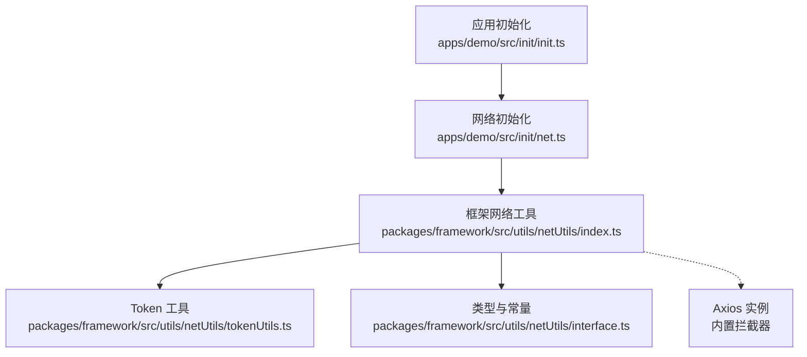
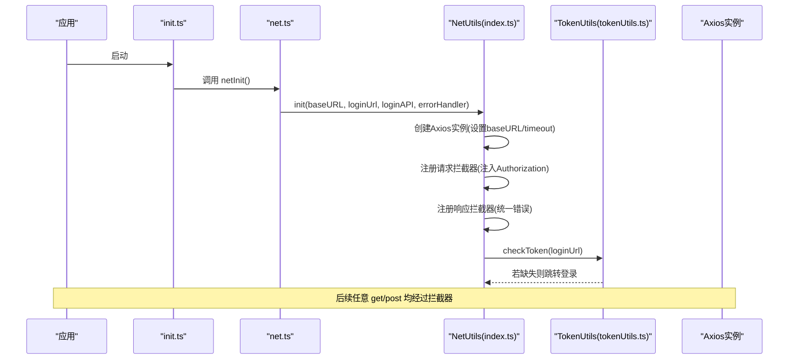
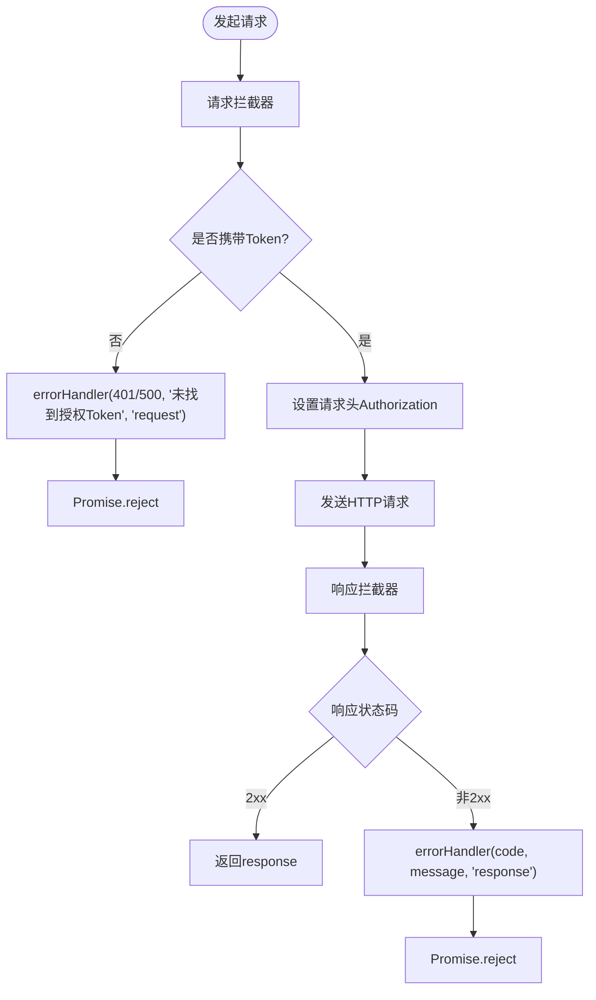
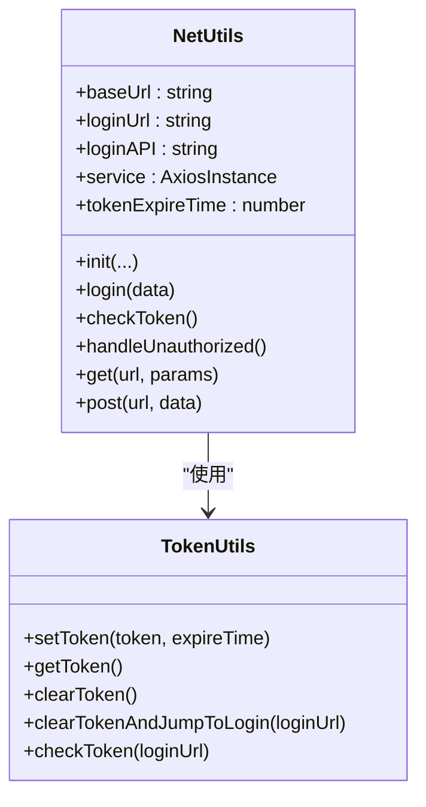
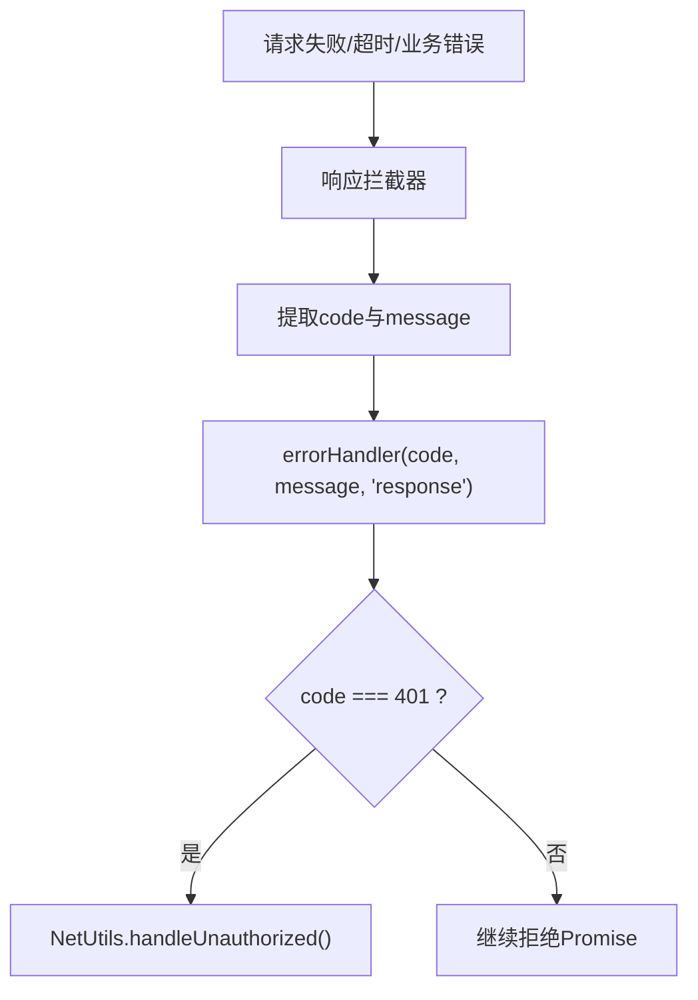
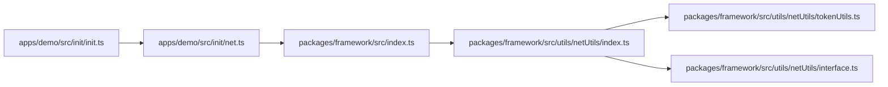

# 网络请求

<cite>
**本文引用的文件**
- [apps/demo/src/init/net.ts](file://apps/demo/src/init/net.ts)
- [apps/demo/src/init/init.ts](file://apps/demo/src/init/init.ts)
- [packages/framework/src/utils/netUtils/index.ts](file://packages/framework/src/utils/netUtils/index.ts)
- [packages/framework/src/utils/netUtils/tokenUtils.ts](file://packages/framework/src/utils/netUtils/tokenUtils.ts)
- [packages/framework/src/utils/netUtils/interface.ts](file://packages/framework/src/utils/netUtils/interface.ts)
- [packages/framework/src/index.ts](file://packages/framework/src/index.ts)
</cite>

## 目录
1. [简介](#简介)
2. [项目结构](#项目结构)
3. [核心组件](#核心组件)
4. [架构总览](#架构总览)
5. [详细组件分析](#详细组件分析)
6. [依赖分析](#依赖分析)
7. [性能考虑](#性能考虑)
8. [故障排查指南](#故障排查指南)
9. [结论](#结论)
10. [附录](#附录)

## 简介
本模块基于 Axios 封装了统一的网络请求能力，提供：
- Axios 实例配置（基础地址、超时）
- 请求拦截器（自动注入 Token、未授权处理）
- 响应拦截器（统一错误上报与提示）
- Token 管理（设置、读取、过期检查、跳转登录）
- 便捷方法（get/post/login/checkToken/handleUnauthorized）
- 应用层初始化入口（从环境变量注入 baseURL、登录页、登录接口、错误回调）

该实现将“通用网络能力”下沉到框架包中，业务应用只需在启动时调用一次初始化即可全局生效。

## 项目结构
- 应用层初始化
  - apps/demo/src/init/init.ts：应用启动入口，调用网络初始化
  - apps/demo/src/init/net.ts：调用框架的 NetUtils.init，传入 baseURL、登录页、登录接口、错误回调
- 框架层网络能力
  - packages/framework/src/utils/netUtils/index.ts：NetUtils 主类，Axios 实例、拦截器、便捷方法
  - packages/framework/src/utils/netUtils/tokenUtils.ts：Token 存取、过期校验、未授权跳转
  - packages/framework/src/utils/netUtils/interface.ts：类型定义（Result、ErrorHandler、常量键名）
  - packages/framework/src/index.ts：对外导出 NetUtils 与 Result 类型

**图示来源**
- [apps/demo/src/init/init.ts:1-9](file://apps/demo/src/init/init.ts#L1-L9)
- [apps/demo/src/init/net.ts:1-19](file://apps/demo/src/init/net.ts#L1-L19)
- [packages/framework/src/utils/netUtils/index.ts:1-116](file://packages/framework/src/utils/netUtils/index.ts#L1-L116)
- [packages/framework/src/utils/netUtils/tokenUtils.ts:1-64](file://packages/framework/src/utils/netUtils/tokenUtils.ts#L1-L64)
- [packages/framework/src/utils/netUtils/interface.ts:1-12](file://packages/framework/src/utils/netUtils/interface.ts#L1-L12)

**章节来源**
- [apps/demo/src/init/init.ts:1-9](file://apps/demo/src/init/init.ts#L1-L9)
- [apps/demo/src/init/net.ts:1-19](file://apps/demo/src/init/net.ts#L1-L19)
- [packages/framework/src/utils/netUtils/index.ts:1-116](file://packages/framework/src/utils/netUtils/index.ts#L1-L116)
- [packages/framework/src/utils/netUtils/tokenUtils.ts:1-64](file://packages/framework/src/utils/netUtils/tokenUtils.ts#L1-L64)
- [packages/framework/src/utils/netUtils/interface.ts:1-12](file://packages/framework/src/utils/netUtils/interface.ts#L1-L12)
- [packages/framework/src/index.ts:1-69](file://packages/framework/src/index.ts#L1-L69)

## 核心组件
- NetUtils（Axios 封装）
  - 初始化：创建 Axios 实例，设置 baseURL 与 timeout；注册请求/响应拦截器；执行 Token 检查
  - 登录：调用登录接口，解析响应头中的 Authorization，写入本地存储并返回数据
  - 便捷方法：get、post，自动拼接 baseUrl 并返回 data
  - 未授权处理：清理 Token 并跳转到登录页
- TokenUtils（Token 管理）
  - set/get/clear：持久化 Token 与过期时间，读取时进行过期判断
  - checkToken：启动时校验 Token，缺失则跳转登录
  - clearTokenAndJumpToLogin：清理并替换历史，强制跳转登录页
- 类型与常量
  - Result<T>：统一响应结构 {code, message, data?}
  - ErrorHandler：统一错误回调签名 (code, msg, type)
  - AUTH_TOKEN_KEY/AUTH_TOKEN_EXPIRE_KEY：本地存储键名

**章节来源**
- [packages/framework/src/utils/netUtils/index.ts:1-116](file://packages/framework/src/utils/netUtils/index.ts#L1-L116)
- [packages/framework/src/utils/netUtils/tokenUtils.ts:1-64](file://packages/framework/src/utils/netUtils/tokenUtils.ts#L1-L64)
- [packages/framework/src/utils/netUtils/interface.ts:1-12](file://packages/framework/src/utils/netUtils/interface.ts#L1-L12)

## 架构总览
下图展示了从应用初始化到具体 API 调用的完整链路，包括拦截器、Token 校验与错误处理。

**图示来源**
- [apps/demo/src/init/init.ts:1-9](file://apps/demo/src/init/init.ts#L1-L9)
- [apps/demo/src/init/net.ts:1-19](file://apps/demo/src/init/net.ts#L1-L19)
- [packages/framework/src/utils/netUtils/index.ts:23-72](file://packages/framework/src/utils/netUtils/index.ts#L23-L72)
- [packages/framework/src/utils/netUtils/tokenUtils.ts:54-60](file://packages/framework/src/utils/netUtils/tokenUtils.ts#L54-L60)

## 详细组件分析

### Axios 实例与拦截器
- 实例配置
  - baseURL：来自环境变量，集中管理后端地址
  - timeout：默认 15000ms，避免长连接无响应
- 请求拦截器
  - 从 TokenUtils 获取 Token，不存在则通过 errorHandler 上报并拒绝请求
  - 存在则将 Token 写入请求头 Authorization
- 响应拦截器
  - 成功直接透传 response
  - 失败提取 status 与 message，交由 errorHandler 统一处理并拒绝 Promise

**图示来源**
- [packages/framework/src/utils/netUtils/index.ts:34-69](file://packages/framework/src/utils/netUtils/index.ts#L34-L69)

**章节来源**
- [packages/framework/src/utils/netUtils/index.ts:34-69](file://packages/framework/src/utils/netUtils/index.ts#L34-L69)

### Token 管理与权限控制
- Token 生命周期
  - 登录成功后从响应头解析 Authorization，调用 setToken 持久化并记录过期时间
  - 每次请求前通过 getToken 校验有效性，过期则清除并返回 null
  - 应用启动时 checkToken，缺失则跳转登录页
- 未授权处理
  - 当服务端返回 401 或前端检测到无 Token，触发 handleUnauthorized，清理并跳转登录

**图示来源**
- [packages/framework/src/utils/netUtils/index.ts:6-116](file://packages/framework/src/utils/netUtils/index.ts#L6-L116)
- [packages/framework/src/utils/netUtils/tokenUtils.ts:3-64](file://packages/framework/src/utils/netUtils/tokenUtils.ts#L3-L64)

**章节来源**
- [packages/framework/src/utils/netUtils/tokenUtils.ts:1-64](file://packages/framework/src/utils/netUtils/tokenUtils.ts#L1-L64)
- [packages/framework/src/utils/netUtils/index.ts:74-116](file://packages/framework/src/utils/netUtils/index.ts#L74-L116)

### 错误处理机制
- 网络错误
  - 由响应拦截器捕获，提取 status 与 message，调用 errorHandler 上报
- 业务错误
  - 通过 errorHandler 的 code/msg/type 三元组，应用层可据此区分请求/响应阶段与错误码
- 超时处理
  - 由 Axios 实例 timeout 控制，超时异常同样进入响应拦截器的错误分支
- 未授权处理
  - 401 场景下，应用层 errorHandler 调用 NetUtils.handleUnauthorized，完成清理与跳转

**图示来源**
- [packages/framework/src/utils/netUtils/index.ts:57-69](file://packages/framework/src/utils/netUtils/index.ts#L57-L69)
- [apps/demo/src/init/net.ts:10-15](file://apps/demo/src/init/net.ts#L10-L15)

**章节来源**
- [apps/demo/src/init/net.ts:10-15](file://apps/demo/src/init/net.ts#L10-L15)
- [packages/framework/src/utils/netUtils/index.ts:57-69](file://packages/framework/src/utils/netUtils/index.ts#L57-L69)

### API 调用最佳实践
- 请求方法封装
  - 优先使用 NetUtils.get / NetUtils.post，自动拼接 baseUrl 并返回 data
  - 复杂场景可直接使用 NetUtils.service（Axios 实例）以支持自定义配置
- 参数处理
  - GET 使用 params 对象；POST 使用 body 对象
- 响应数据转换
  - 便捷方法已返回 data，业务层无需再解包
- 实际示例（概念性说明）
  - 用户认证：调用 NetUtils.login(data)，成功后 Token 自动写入本地存储
  - 数据获取：调用 NetUtils.get('/api/users', params)
  - 数据提交：调用 NetUtils.post('/api/users', payload)

**章节来源**
- [packages/framework/src/utils/netUtils/index.ts:74-116](file://packages/framework/src/utils/netUtils/index.ts#L74-L116)

### 高级功能：缓存、重试与并发控制
- 当前实现
  - 未内置请求缓存、重试与并发限制
- 扩展建议
  - 缓存：可在请求拦截器前增加内存/本地缓存层，按 URL+params 作为键，命中则直接返回
  - 重试：在响应拦截器对特定状态码（如 5xx）进行指数退避重试
  - 并发控制：使用队列或信号量限制同时进行的请求数，避免雪崩

[本节为通用建议，不直接分析具体文件]

## 依赖分析
- 应用层依赖
  - apps/demo/src/init/init.ts 依赖 apps/demo/src/init/net.ts
  - apps/demo/src/init/net.ts 依赖 @jl/framework 导出的 NetUtils
- 框架层依赖
  - NetUtils 依赖 Axios、lodash.isString、TokenUtils、interface 类型
  - TokenUtils 依赖 interface 中的常量键名
- 导出关系
  - packages/framework/src/index.ts 导出 NetUtils 与 Result 类型供外部使用

**图示来源**
- [apps/demo/src/init/init.ts:1-9](file://apps/demo/src/init/init.ts#L1-L9)
- [apps/demo/src/init/net.ts:1-19](file://apps/demo/src/init/net.ts#L1-L19)
- [packages/framework/src/index.ts:1-69](file://packages/framework/src/index.ts#L1-L69)
- [packages/framework/src/utils/netUtils/index.ts:1-116](file://packages/framework/src/utils/netUtils/index.ts#L1-L116)
- [packages/framework/src/utils/netUtils/tokenUtils.ts:1-64](file://packages/framework/src/utils/netUtils/tokenUtils.ts#L1-L64)
- [packages/framework/src/utils/netUtils/interface.ts:1-12](file://packages/framework/src/utils/netUtils/interface.ts#L1-L12)

**章节来源**
- [packages/framework/src/index.ts:1-69](file://packages/framework/src/index.ts#L1-L69)
- [packages/framework/src/utils/netUtils/index.ts:1-116](file://packages/framework/src/utils/netUtils/index.ts#L1-L116)

## 性能考虑
- 合理设置超时：默认 15s，可根据网络环境调整
- 减少无效请求：确保 Token 有效后再发起请求，避免被服务端拒绝
- 批量与分页：后端尽量支持批量接口与分页，降低请求次数
- 资源复用：单例 Axios 实例，避免重复创建开销

[本节为通用建议，不直接分析具体文件]

## 故障排查指南
- 现象：请求未携带 Token
  - 检查应用初始化是否调用 NetUtils.init
  - 检查 TokenUtils.getToken 是否能读到 Token（可能已过期或被清除）
- 现象：登录后仍跳转登录页
  - 确认登录接口响应头包含 Authorization，且跨域允许暴露该头部
  - 检查 TokenUtils.setToken 是否正确写入本地存储
- 现象：统一错误提示不显示
  - 检查应用层 errorHandler 是否正确注册并调用 message.error
- 现象：401 未跳转
  - 确认应用层 errorHandler 中对 code===401 调用了 NetUtils.handleUnauthorized

**章节来源**
- [apps/demo/src/init/net.ts:10-15](file://apps/demo/src/init/net.ts#L10-L15)
- [packages/framework/src/utils/netUtils/index.ts:40-69](file://packages/framework/src/utils/netUtils/index.ts#L40-L69)
- [packages/framework/src/utils/netUtils/tokenUtils.ts:15-60](file://packages/framework/src/utils/netUtils/tokenUtils.ts#L15-L60)

## 结论
本网络请求模块以最小侵入的方式提供了稳定的 HTTP 能力：统一的 Axios 实例、完善的拦截器、健壮的 Token 管理与错误处理。应用仅需一次初始化即可全局生效，并通过简洁的 get/post/login 等方法快速接入业务。对于缓存、重试与并发控制等高级需求，可在现有基础上按需扩展。

## 附录
- 环境变量（由应用层注入）
  - VITE_BASE_URL：后端基础地址
  - VITE_LOGIN_URL：登录页路径
  - VITE_API_LOGIN：登录接口路径
- 类型约定
  - Result<T>：{ code, message, data? }
  - ErrorHandler：(code, msg, type) => void

**章节来源**
- [apps/demo/src/init/net.ts:5-16](file://apps/demo/src/init/net.ts#L5-L16)
- [packages/framework/src/utils/netUtils/interface.ts:1-12](file://packages/framework/src/utils/netUtils/interface.ts#L1-L12)