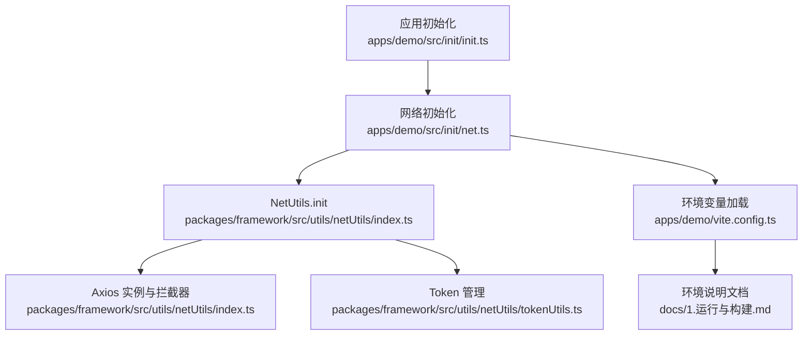
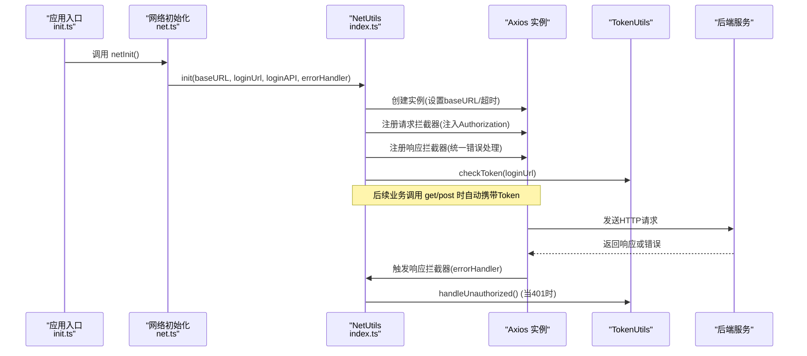
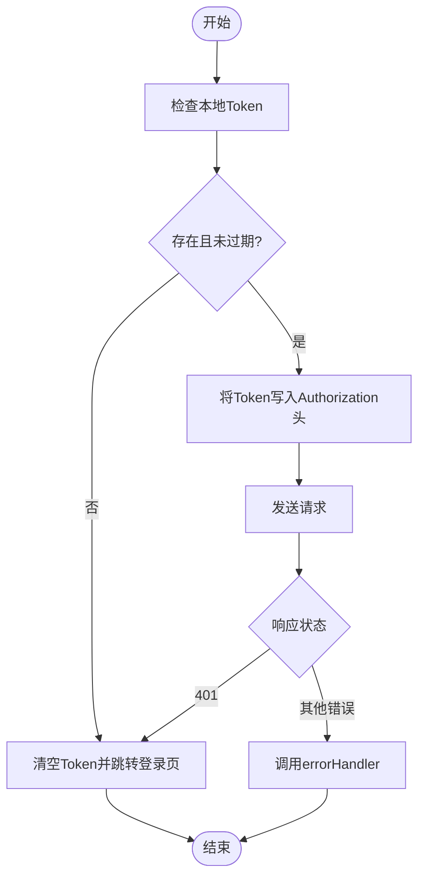
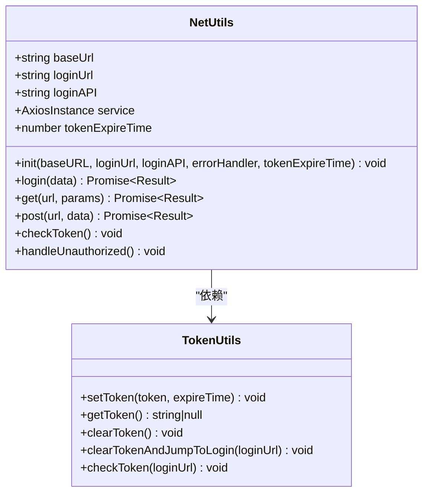
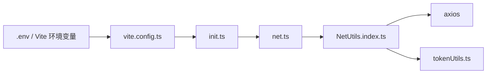

# 请求配置

<cite>
**本文引用的文件**
- [apps/demo/src/init/net.ts](file://apps/demo/src/init/net.ts)
- [apps/demo/src/init/init.ts](file://apps/demo/src/init/init.ts)
- [packages/framework/src/utils/netUtils/index.ts](file://packages/framework/src/utils/netUtils/index.ts)
- [packages/framework/src/utils/netUtils/interface.ts](file://packages/framework/src/utils/netUtils/interface.ts)
- [packages/framework/src/utils/netUtils/tokenUtils.ts](file://packages/framework/src/utils/netUtils/tokenUtils.ts)
- [apps/demo/vite.config.ts](file://apps/demo/vite.config.ts)
- [docs/1.运行与构建.md](file://docs/1.运行与构建.md)
</cite>

## 目录
1. [简介](#简介)
2. [项目结构](#项目结构)
3. [核心组件](#核心组件)
4. [架构总览](#架构总览)
5. [详细组件分析](#详细组件分析)
6. [依赖关系分析](#依赖关系分析)
7. [性能考虑](#性能考虑)
8. [故障排查指南](#故障排查指南)
9. [结论](#结论)
10. [附录](#附录)

## 简介
本章节面向需要配置网络请求的开发者，详细说明 NetUtils.init 方法的参数与环境变量使用方式，解释请求拦截器的行为与自定义选项，并给出开发、测试、生产环境的差异化配置建议、最佳实践与安全注意事项。文档同时提供常见问题定位思路与解决方案。

## 项目结构
本项目采用应用层（apps/demo）与框架层（packages/framework）分离的组织方式：
- 应用层负责初始化网络请求配置，读取环境变量并调用框架提供的 NetUtils.init。
- 框架层封装 Axios 实例、请求/响应拦截器、Token 管理与统一错误处理。

图表来源
- [apps/demo/src/init/init.ts:1-9](file://apps/demo/src/init/init.ts#L1-L9)
- [apps/demo/src/init/net.ts:1-20](file://apps/demo/src/init/net.ts#L1-L20)
- [packages/framework/src/utils/netUtils/index.ts:1-116](file://packages/framework/src/utils/netUtils/index.ts#L1-L116)
- [packages/framework/src/utils/netUtils/tokenUtils.ts:1-64](file://packages/framework/src/utils/netUtils/tokenUtils.ts#L1-L64)
- [apps/demo/vite.config.ts:1-36](file://apps/demo/vite.config.ts#L1-L36)
- [docs/1.运行与构建.md:1-91](file://docs/1.运行与构建.md#L1-L91)

章节来源
- [apps/demo/src/init/init.ts:1-9](file://apps/demo/src/init/init.ts#L1-L9)
- [apps/demo/src/init/net.ts:1-20](file://apps/demo/src/init/net.ts#L1-L20)
- [apps/demo/vite.config.ts:1-36](file://apps/demo/vite.config.ts#L1-L36)
- [docs/1.运行与构建.md:1-91](file://docs/1.运行与构建.md#L1-L91)

## 核心组件
- NetUtils：封装 Axios 实例、请求/响应拦截器、登录流程、Token 校验与跳转、通用 GET/POST 方法。
- TokenUtils：本地存储 Token 与过期时间，提供获取、清除、检查与未授权跳转能力。
- 环境变量：通过 Vite 加载 .env 系列文件，暴露给应用层用于配置基础 URL、登录页路径、登录接口等。

章节来源
- [packages/framework/src/utils/netUtils/index.ts:1-116](file://packages/framework/src/utils/netUtils/index.ts#L1-L116)
- [packages/framework/src/utils/netUtils/tokenUtils.ts:1-64](file://packages/framework/src/utils/netUtils/tokenUtils.ts#L1-L64)
- [apps/demo/vite.config.ts:1-36](file://apps/demo/vite.config.ts#L1-L36)
- [docs/1.运行与构建.md:1-91](file://docs/1.运行与构建.md#L1-L91)

## 架构总览
下图展示了从应用初始化到网络请求执行的完整链路，包括环境变量注入、拦截器执行、Token 校验与错误处理。

图表来源
- [apps/demo/src/init/init.ts:1-9](file://apps/demo/src/init/init.ts#L1-L9)
- [apps/demo/src/init/net.ts:1-20](file://apps/demo/src/init/net.ts#L1-L20)
- [packages/framework/src/utils/netUtils/index.ts:1-116](file://packages/framework/src/utils/netUtils/index.ts#L1-L116)
- [packages/framework/src/utils/netUtils/tokenUtils.ts:1-64](file://packages/framework/src/utils/netUtils/tokenUtils.ts#L1-L64)

## 详细组件分析

### NetUtils.init 方法与参数说明
- 作用：初始化全局网络请求能力，包含基础地址、登录页路径、登录接口、错误处理器、Token 过期时间，并创建 Axios 实例与拦截器。
- 关键参数
  - baseURL：基础 URL，所有相对路径将拼接到此地址。
  - loginUrl：登录页面路径，用于未授权时跳转。
  - loginAPI：登录接口路径，默认 fallback 为 'login'。
  - errorHandler：统一错误处理回调，接收 code、msg、type（'request' | 'response'）。
  - tokenExpireTime：可选，Token 过期时间（毫秒），默认值在实现中定义。
- 内部行为
  - 创建 Axios 实例，设置 baseURL 与超时。
  - 请求拦截器：若未检测到 Token，则调用 errorHandler 并拒绝请求；否则将 Token 写入 Authorization 请求头。
  - 响应拦截器：捕获错误，提取状态码与消息，调用 errorHandler。
  - 启动时检查 Token，必要时跳转到登录页。
  - 提供 login、get、post、checkToken、handleUnauthorized 等便捷方法。

章节来源
- [packages/framework/src/utils/netUtils/index.ts:18-72](file://packages/framework/src/utils/netUtils/index.ts#L18-L72)
- [packages/framework/src/utils/netUtils/index.ts:74-113](file://packages/framework/src/utils/netUtils/index.ts#L74-L113)

### 环境变量与端点配置
- 应用层通过 import.meta.env 读取环境变量，传递给 NetUtils.init：
  - VITE_BASE_URL：API 基础地址。
  - VITE_LOGIN_URL：登录页面路径。
  - VITE_API_LOGIN：登录接口路径。
- Vite 通过 loadEnv 根据 mode 加载对应环境变量，并将 VITE_ENV 注入到运行时常量 __APP_ENV__。
- 文档提供了常用环境变量清单与示例值，便于在不同环境切换。

章节来源
- [apps/demo/src/init/net.ts:5-16](file://apps/demo/src/init/net.ts#L5-L16)
- [apps/demo/vite.config.ts:7-33](file://apps/demo/vite.config.ts#L7-L33)
- [docs/1.运行与构建.md:18-62](file://docs/1.运行与构建.md#L18-L62)

### 请求拦截器与错误处理
- 请求拦截器
  - 从 TokenUtils 获取 Token，缺失时调用 errorHandler(401, ...) 并拒绝请求。
  - 存在 Token 时，将其放入 Authorization 请求头。
- 响应拦截器
  - 成功响应直接透传。
  - 失败响应提取 status 与 message，调用 errorHandler(code, message, 'response')。
- 应用层 errorHandler
  - 当 code 为 401 时，调用 NetUtils.handleUnauthorized() 清理 Token 并跳转登录。
  - 使用 Ant Design 的 message.error 展示错误信息。

章节来源
- [packages/framework/src/utils/netUtils/index.ts:39-69](file://packages/framework/src/utils/netUtils/index.ts#L39-L69)
- [apps/demo/src/init/net.ts:10-16](file://apps/demo/src/init/net.ts#L10-L16)

### Token 管理流程
- 登录成功后，从响应头读取 Authorization，存入 localStorage，并记录过期时间。
- 每次请求前检查 Token 是否存在且未过期，否则拒绝请求并提示。
- 未授权时清空 Token 并跳转到登录页。

图表来源
- [packages/framework/src/utils/netUtils/tokenUtils.ts:1-64](file://packages/framework/src/utils/netUtils/tokenUtils.ts#L1-L64)
- [packages/framework/src/utils/netUtils/index.ts:39-69](file://packages/framework/src/utils/netUtils/index.ts#L39-L69)

### 类与模块关系图

图表来源
- [packages/framework/src/utils/netUtils/index.ts:1-116](file://packages/framework/src/utils/netUtils/index.ts#L1-L116)
- [packages/framework/src/utils/netUtils/tokenUtils.ts:1-64](file://packages/framework/src/utils/netUtils/tokenUtils.ts#L1-L64)

## 依赖关系分析
- 应用层依赖框架层的 NetUtils，通过环境变量注入配置。
- NetUtils 依赖 Axios 进行 HTTP 通信，依赖 TokenUtils 管理认证状态。
- Vite 负责加载不同模式下的环境变量，并在构建时注入常量。

图表来源
- [apps/demo/vite.config.ts:1-36](file://apps/demo/vite.config.ts#L1-L36)
- [apps/demo/src/init/init.ts:1-9](file://apps/demo/src/init/init.ts#L1-L9)
- [apps/demo/src/init/net.ts:1-20](file://apps/demo/src/init/net.ts#L1-L20)
- [packages/framework/src/utils/netUtils/index.ts:1-116](file://packages/framework/src/utils/netUtils/index.ts#L1-L116)
- [packages/framework/src/utils/netUtils/tokenUtils.ts:1-64](file://packages/framework/src/utils/netUtils/tokenUtils.ts#L1-L64)

章节来源
- [apps/demo/vite.config.ts:1-36](file://apps/demo/vite.config.ts#L1-L36)
- [apps/demo/src/init/net.ts:1-20](file://apps/demo/src/init/net.ts#L1-L20)
- [packages/framework/src/utils/netUtils/index.ts:1-116](file://packages/framework/src/utils/netUtils/index.ts#L1-L116)

## 性能考虑
- 超时设置：Axios 实例默认超时时间为固定值，可根据网络状况调整以平衡用户体验与资源占用。
- 拦截器开销：请求/响应拦截器会执行 Token 读取与错误处理逻辑，建议在大规模并发场景下避免在拦截器中进行耗时操作。
- Token 读写：频繁访问 localStorage 可能带来 I/O 开销，可结合内存缓存策略减少重复读取（需自行扩展）。
- 跨域与响应头：登录成功后从响应头读取 Token，若出现跨域限制，需在服务端暴露相关响应头字段。

[本节为通用指导，不直接分析具体文件]

## 故障排查指南
- 401 未授权
  - 现象：请求被拒绝并提示未找到授权 Token，随后跳转到登录页。
  - 排查要点：确认登录流程是否正确保存 Token；检查 Token 是否过期；确认服务端是否返回正确的响应头。
  - 相关位置：请求拦截器与未授权处理逻辑。
- 跨域导致无法读取 Token
  - 现象：登录后无法从响应头获取 Token。
  - 排查要点：服务端需暴露必要的响应头字段，以便前端读取。
- 环境变量未生效
  - 现象：基础 URL 或接口地址不正确。
  - 排查要点：确认 Vite 加载的环境变量是否正确；检查构建模式与 .env 文件命名约定；确认 import.meta.env 的使用位置。
- 错误信息不明确
  - 现象：仅看到通用错误提示。
  - 排查要点：在 errorHandler 中打印更详细的上下文；检查响应体中的 message 字段。

章节来源
- [packages/framework/src/utils/netUtils/index.ts:39-69](file://packages/framework/src/utils/netUtils/index.ts#L39-L69)
- [packages/framework/src/utils/netUtils/index.ts:74-97](file://packages/framework/src/utils/netUtils/index.ts#L74-L97)
- [apps/demo/src/init/net.ts:10-16](file://apps/demo/src/init/net.ts#L10-L16)
- [docs/1.运行与构建.md:18-62](file://docs/1.运行与构建.md#L18-L62)

## 结论
通过 NetUtils.init 与环境变量的配合，项目实现了统一的网络请求配置、拦截与错误处理机制。借助 TokenUtils 完成认证生命周期管理，结合 Vite 的多环境支持，可在不同部署场景下灵活切换配置。遵循本文的最佳实践与安全建议，可有效提升稳定性与可维护性。

[本节为总结性内容，不直接分析具体文件]

## 附录

### 环境变量与端点速查
- VITE_BASE_URL：API 基础地址，用于拼接所有接口路径。
- VITE_LOGIN_URL：登录页面路径，用于未授权跳转。
- VITE_API_LOGIN：登录接口路径，默认 fallback 为 'login'。
- VITE_AUTH_TOKEN_EXPIRE_TIME：Token 过期时间（毫秒），用于控制本地缓存有效期。
- VITE_SERVER_PORT：本地开发服务器端口。
- VITE_TITLE：应用标题。
- VITE_ENV：环境标识，可用于条件分支或日志标记。

章节来源
- [docs/1.运行与构建.md:18-62](file://docs/1.运行与构建.md#L18-L62)

### 配置最佳实践
- 将敏感配置（如基础 URL、接口地址）集中放在环境变量中，避免硬编码。
- 针对不同环境（dev/test/prod）使用不同的 .env 文件，并通过 Vite 的 mode 切换。
- 在 errorHandler 中区分 request/response 类型，提供更精确的错误提示。
- 确保服务端正确设置跨域响应头，使前端能读取必要信息。
- 合理设置超时与重试策略，提升弱网环境下的鲁棒性。

[本节为通用指导，不直接分析具体文件]

### 安全考虑
- Token 存储：当前实现使用 localStorage 存储 Token，需注意 XSS 风险；建议结合 HttpOnly Cookie 或更安全方案。
- 传输安全：生产环境务必使用 HTTPS，防止中间人攻击。
- 最小权限：接口应实施鉴权与权限控制，避免越权访问。
- 错误信息脱敏：避免在前端暴露敏感信息或堆栈细节。

[本节为通用指导，不直接分析具体文件]